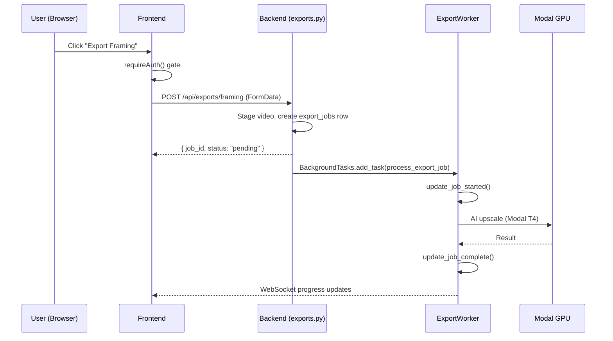
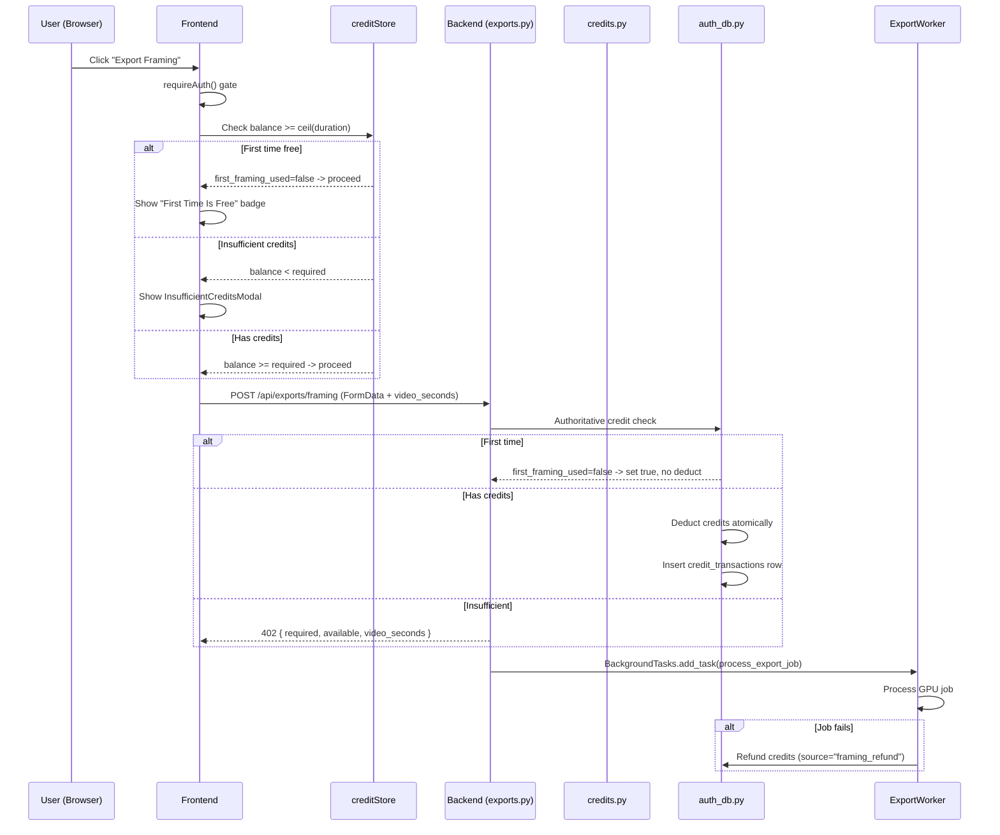

# T530: Credit System — Design Document

## Current State

### Export Flows (No Credit Gating)



### Auth Database (auth.sqlite)

```sql
-- Current schema
users (
    user_id TEXT PRIMARY KEY,
    email TEXT UNIQUE,
    google_id TEXT UNIQUE,
    verified_at TEXT,
    stripe_customer_id TEXT,
    created_at TEXT DEFAULT (datetime('now')),
    last_seen_at TEXT
);
sessions (...);
otp_codes (...);
```

### Key Integration Points

| Component | File | Function/Endpoint |
|-----------|------|-------------------|
| Framing export endpoint | `src/backend/app/routers/exports.py:469` | `start_framing_export()` |
| Export worker entry | `src/backend/app/services/export_worker.py:113` | `process_export_job()` |
| Framing worker | `src/backend/app/services/export_worker.py:173` | `process_framing_export()` |
| Annotate export endpoint | `src/backend/app/routers/annotate.py:430` | `export_clips()` |
| Auth DB init | `src/backend/app/services/auth_db.py:74` | `init_auth_db()` |
| Auth store | `src/frontend/src/stores/authStore.js` | `useAuthStore` |
| Export button | `src/frontend/src/containers/ExportButtonContainer.jsx:371` | `handleExport()` |
| Annotate export | `src/frontend/src/containers/AnnotateContainer.jsx:434` | `callAnnotateExportApi()` |
| Gallery button (header) | `src/frontend/src/components/GalleryButton.jsx` | `GalleryButton` |
| Header area | `src/frontend/src/App.jsx:323` | Next to GalleryButton |
| User context | `src/backend/app/user_context.py` | `get_current_user_id()` |

---

## Target State

### Export Flow WITH Credit Gating



### Updated Auth Database Schema

```sql
-- ADD to users table
ALTER TABLE users ADD COLUMN credits INTEGER DEFAULT 0;
ALTER TABLE users ADD COLUMN first_framing_used BOOLEAN DEFAULT 0;
ALTER TABLE users ADD COLUMN first_annotate_used BOOLEAN DEFAULT 0;

-- NEW table
CREATE TABLE IF NOT EXISTS credit_transactions (
    id INTEGER PRIMARY KEY AUTOINCREMENT,
    user_id TEXT NOT NULL REFERENCES users(user_id),
    amount INTEGER NOT NULL,           -- positive = grant, negative = usage
    source TEXT NOT NULL,              -- 'quest_reward', 'admin_grant', 'framing_usage', 'framing_refund', 'stripe_purchase'
    reference_id TEXT,                 -- export job_id, quest_id, stripe_payment_id
    video_seconds REAL,               -- for framing_usage: duration charged
    created_at TEXT DEFAULT (datetime('now'))
);

CREATE INDEX IF NOT EXISTS idx_credit_transactions_user_id ON credit_transactions(user_id);
```

---

## Implementation Plan

### 1. Schema Changes (auth_db.py)

**File:** `src/backend/app/services/auth_db.py`

Add to `init_auth_db()` after existing CREATE TABLE statements:

```python
# Credit system columns (T530)
# Use ALTER TABLE with try/except for idempotent upgrades
for col, col_def in [
    ("credits", "INTEGER DEFAULT 0"),
    ("first_framing_used", "INTEGER DEFAULT 0"),
    ("first_annotate_used", "INTEGER DEFAULT 0"),
]:
    try:
        db.execute(f"ALTER TABLE users ADD COLUMN {col} {col_def}")
    except sqlite3.OperationalError:
        pass  # Column already exists

# Credit transactions ledger
db.execute("""
    CREATE TABLE IF NOT EXISTS credit_transactions (
        id INTEGER PRIMARY KEY AUTOINCREMENT,
        user_id TEXT NOT NULL REFERENCES users(user_id),
        amount INTEGER NOT NULL,
        source TEXT NOT NULL,
        reference_id TEXT,
        video_seconds REAL,
        created_at TEXT DEFAULT (datetime('now'))
    )
""")
db.execute("CREATE INDEX IF NOT EXISTS idx_credit_tx_user ON credit_transactions(user_id)")
```

### 2. Credit Service Functions (auth_db.py)

New functions added to `auth_db.py`:

- `get_credit_balance(user_id)` — Returns `{balance, first_framing_used, first_annotate_used}`
- `grant_credits(user_id, amount, source, reference_id)` — Adds credits + ledger entry, syncs to R2
- `deduct_credits(user_id, amount, source, reference_id, video_seconds)` — Atomic check + deduct in single connection
- `use_first_time_free(user_id, export_type)` — Check-and-consume first-time flag atomically
- `refund_credits(user_id, amount, reference_id, video_seconds)` — Delegates to grant_credits with source="framing_refund"
- `get_credit_transactions(user_id, limit)` — Recent transaction history

### 3. Credits Router (NEW: credits.py)

**File:** `src/backend/app/routers/credits.py`

| Endpoint | Method | Description |
|----------|--------|-------------|
| `/api/credits` | GET | Balance + first-time flags |
| `/api/credits/grant` | POST | Grant credits (for quests/admin) |
| `/api/credits/transactions` | GET | Transaction history |

Register in `main.py`.

### 4. Framing Export Credit Check (exports.py)

In `start_framing_export()`, after video staging, before creating export job:

1. Get `user_id` from request context
2. Calculate `video_seconds` from staged video via `get_video_duration()`
3. Calculate `credits_required = ceil(video_seconds)`
4. Check `use_first_time_free(user_id, "framing")` — if true, skip deduction
5. If not first time: `deduct_credits()` atomically — return 402 on insufficient
6. Store `credits_deducted` and `user_id` in job config for refund path

### 5. Refund on GPU Failure (export_worker.py)

In `process_export_job()` except block:
- If job_type == 'framing' and `config.credits_deducted > 0`
- Call `refund_credits(user_id, credits_deducted, job_id)`

### 6. Annotate First-Time Tracking (annotate.py)

In `export_clips()`:
- Call `use_first_time_free(user_id, "annotate")`
- No credit deduction (annotate is always free)

### 7. Frontend: creditStore.js (NEW)

Zustand store with:
- `balance`, `firstFramingUsed`, `firstAnnotateUsed`, `loaded`
- `fetchCredits()` — GET /api/credits
- `canAffordExport(videoSeconds)` — optimistic check
- `setBalance()`, `markFirstFramingUsed()`, `markFirstAnnotateUsed()`

### 8. Frontend: CreditBalance.jsx (NEW)

Pill component: coin icon + balance number. Only visible when authenticated + loaded.
Placed next to GalleryButton in App.jsx header.

### 9. Frontend: InsufficientCreditsModal.jsx (NEW)

Blocking modal showing required vs available credits. Cancel + disabled "Purchase" button (placeholder for T525).

### 10. Frontend Export Wiring

**ExportButtonContainer.jsx:**
- Before framing API call: optimistic credit check via `canAffordExport()`
- On insufficient: show InsufficientCreditsModal
- On 402 response: show InsufficientCreditsModal with backend values
- On success: update creditStore balance
- Show "First Time Is Free" badge when `!firstFramingUsed`

**AnnotateContainer.jsx:**
- After successful export: update `firstAnnotateUsed` flag
- Show "First Time Is Free" badge when `!firstAnnotateUsed`

### 11. Credit Fetch on Auth

In authStore's `onAuthSuccess()` and `setSessionState()`: call `creditStore.fetchCredits()`.

---

## Risks & Open Questions

### Risk: Race condition on concurrent exports
**Mitigation:** SQLite WAL mode + `busy_timeout=30000` provides serialization. `deduct_credits` reads + writes in a single `get_auth_db()` context manager (single connection). Sufficient for single-server architecture.

### Risk: Video duration unavailable before staging
**Mitigation:** Backend calculates from staged video via `get_video_duration()`. Frontend uses `calculateEffectiveDuration()` for optimistic check. Backend is authoritative.

### Risk: Refund doesn't fire on process crash
**Mitigation:** Acceptable for MVP. Can add reconciliation job later.

### Decision: Deduct BEFORE GPU (not after)
Prevents "try for free" abuse. Refund on failure is the safety net.

### Decision: Frontend check is optimistic only
Backend is authoritative. Frontend check prevents unnecessary API calls and gives instant feedback.

---

## Files Changed Summary

| File | Change Type | Description |
|------|-------------|-------------|
| `src/backend/app/services/auth_db.py` | Modify | Add credit columns, transactions table, credit service functions |
| `src/backend/app/routers/credits.py` | **NEW** | Credit API endpoints (GET balance, POST grant, GET transactions) |
| `src/backend/app/routers/exports.py` | Modify | Add credit check + deduction before framing export |
| `src/backend/app/services/export_worker.py` | Modify | Add refund on GPU failure |
| `src/backend/app/routers/annotate.py` | Modify | Track first-time annotate flag |
| `src/backend/app/main.py` | Modify | Register credits router |
| `src/frontend/src/stores/creditStore.js` | **NEW** | Zustand store for credit balance |
| `src/frontend/src/components/CreditBalance.jsx` | **NEW** | Header balance pill |
| `src/frontend/src/components/InsufficientCreditsModal.jsx` | **NEW** | Blocking modal for insufficient credits |
| `src/frontend/src/containers/ExportButtonContainer.jsx` | Modify | Add credit check before framing export |
| `src/frontend/src/containers/AnnotateContainer.jsx` | Modify | Track first-time annotate |
| `src/frontend/src/stores/authStore.js` | Modify | Fetch credits on auth success |
| `src/frontend/src/App.jsx` | Modify | Add CreditBalance to header |
