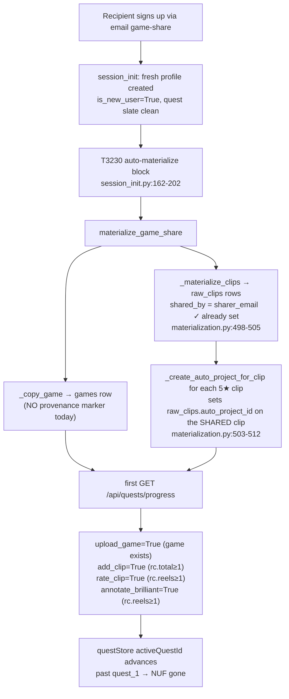
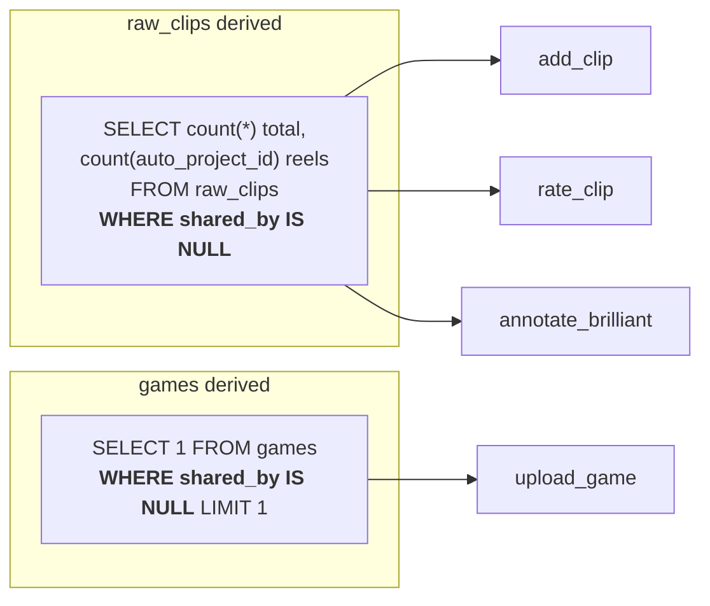

# T5330 Design — Email game-share recipient skips the new-user flow

**Status:** DESIGN — awaiting approval gate
**Tier:** M (+ short Architect pass; behavior pre-decided, this doc locks the *mechanism*)
**Author:** Architect pass, 2026-07-18

> Behavior is already decided (task file + user, 2026-07-17): **a user's onboarding
> state is a pure function of THEIR OWN gestures/content — content shared into their
> profile is orthogonal to NUF progress.** This doc does not relitigate that. It locks
> (1) the provenance mechanism, (2) the no-regression argument, (3) the migration
> decision, (4) re-materialization edges, (5) the link-share (T4910) scope call.

---

## 1. Current State

### How onboarding visibility is computed

Onboarding is 100% quest-derived. `GET /api/quests/progress` →
`_check_all_steps()` (`quests.py:117`) derives quest_1's steps from **profile-DB
state** via four batched queries. The four quest_1 steps that misfire:

```python
# quests.py:171-183  (current)
steps["upload_game"]        = SELECT 1 FROM games LIMIT 1                       # any game
rc = SELECT count(*) AS total,
            count(CASE WHEN auto_project_id IS NOT NULL THEN 1 END) AS reels
     FROM raw_clips                                                             # (current: no filter)
steps["add_clip"]           = 'add_clip_opened' in achieved OR rc["total"] >= 1 # any clip
steps["rate_clip"]          = 'clip_rated'      in achieved OR rc["reels"] >= 1  # any reel
steps["annotate_brilliant"] = rc["reels"] >= 1                                   # any reel
```

The `OR rc[...] >= 1` backfills exist so **pre-existing users** (who did these
before the quest system) aren't re-nagged. They misfire for a share recipient
because the recipient's profile is pre-populated with content they never created.

### The divergence mechanism (share recipient's first `session_init`)



### Key data facts confirmed by code read

| Fact | Evidence |
|------|----------|
| `raw_clips` **already has** `shared_by TEXT DEFAULT NULL`, set for every materialized clip | `database.py:582`; `_insert_clip` `materialization.py:290-305`; call `materialization.py:500` |
| The auto-draft-reel's `auto_project_id` sits on the **same shared raw_clip row** (which has `shared_by` set) | `_create_auto_project_for_clip` `clips.py:896-898` updates `raw_clips.auto_project_id` on the shared clip |
| `games` table has **no** provenance column | `database.py:703-726` |
| `_copy_game` copies no marker | `materialization.py:146-200` |
| `projects` table has **no** provenance column (auto-reel is `is_auto_created=1`) | `database.py:593-608` |
| Self-heal renders ALL steps True for **claimed** quests (established users) | `quests.py` completed/claimed path |
| Own content always has `shared_by IS NULL` | `_insert_clip` only sets it on materialization; normal clip-create never does |

---

## 2. Target State

**Provenance-based exclusion.** Quest_1's DB-derived counts count **only content
with no shared-in provenance** — everything else is unchanged.



### Provenance value — never NULL for a shared item (approved amendment 1)

A shared row's provenance marker is computed once at materialization with the
precedence **`sharer_email` → else `sharer_user_id` → else the literal sentinel
`"lost"`**, and written to BOTH `games.shared_by` (new) and `raw_clips.shared_by`
(existing). **A share is never NULL**; own content stays NULL as before. This closes
the NULL-`sharer_email` hole (former open question 6a) — the exclusion can rely on
`shared_by IS NOT NULL` == "shared in". `sharer_profile_name` (athlete attribution) is
computed separately and is unchanged.

### The two exclusion signals

1. **Clips + reels → reuse existing `raw_clips.shared_by`.** No new column, and it is
   **already populated for every existing materialized share**. The auto-draft-reel is
   excluded *transitively*: `rc["reels"]` keys off `raw_clips.auto_project_id`, and that
   column lives on the same shared clip row whose `shared_by` is set — so **no marker
   is needed on `projects`**.

2. **Game → add `games.shared_by TEXT DEFAULT NULL`** (mirror `raw_clips`), set in
   `_copy_game` to the provenance marker above. This is the one genuinely new column.

### Files changed

| File | Change | Structure change? |
|------|--------|-------------------|
| `quests.py:158-183` | Add `WHERE shared_by IS NULL` to the `raw_clips` aggregate; add `WHERE shared_by IS NULL` to the `upload_game` games probe | No |
| `materialization.py` `_copy_game` (146-200) | `INSERT INTO games (... , shared_by) VALUES (..., ?)` with sharer's email | No |
| `database.py` `games` DDL (703-726) | Add `shared_by TEXT DEFAULT NULL` (fresh DBs) | Schema |
| `migrations/profile_db/v026_games_shared_by.py` | New: idempotent `ALTER TABLE games ADD COLUMN shared_by TEXT DEFAULT NULL` | Schema/migration |
| `.claude/knowledge/backend-services.md` | Note the new column + v026 (Stage 7) | Docs |

**No quest-structure change** → `quest_config.py` and the two frontend mirrors
(`questDefinitions.js` / `questDefinitions.jsx`) are **untouched** (this is count
logic, same `step_ids`). The `is_new_user` wiring is **not** touched (rejected approach).

### Query diff (exact)

```python
# quests.py — raw_clips aggregate (was line 158-160)
rc = cursor.execute(
    "SELECT count(*) as total, "
    "count(CASE WHEN auto_project_id IS NOT NULL THEN 1 END) as reels "
    "FROM raw_clips WHERE shared_by IS NULL"          # <-- added
).fetchone()

# quests.py:171 — upload_game
steps["upload_game"] = cursor.execute(
    "SELECT 1 FROM games WHERE shared_by IS NULL LIMIT 1"   # <-- added
).fetchone() is not None
```

```python
# materialization.py _copy_game — INSERT column list gains shared_by
# (value = the sharer_email already threaded into materialize_game_share)
```
> `_copy_game` currently takes only `(sharer_conn, recipient_conn, game_id)`. It must
> receive the sharer's email (thread `sharer_email` from `materialize_game_share`
> through to the `_copy_game` call at `materialization.py:485`).

---

## 3. No-regression argument (the two guard criteria)

**Pre-existing / established users are NOT re-onboarded.** Their own games and clips
have `shared_by IS NULL` (the column is only ever written on materialization), so
`WHERE shared_by IS NULL` still counts them exactly as today. The claimed-quest
self-heal (`quests.py` completed/claimed path) is untouched, so anyone who already
claimed quest_1 still renders all-True regardless of these counts. **Both guard
criteria hold by construction.**

**Mid-NUF recipient keeps earned progress.** Earned progress is either an
own-gesture achievement (`add_clip_opened`, `clip_rated` — unaffected) or own content
(`shared_by IS NULL` — still counted). A share adds only `shared_by IS NOT NULL` rows,
which the new filter ignores → the share neither advances nor rolls back any step. The
only thing that "rolls back" is the buggy auto-completion, which is the intended fix.

---

## 4. Migration decision (approved amendment 2 — REVERSES the earlier no-backfill stance)

**A `profile_db` migration is REQUIRED, and it MUST BACKFILL** `games.shared_by` for
already-materialized shared games so existing data is correct — not just add the column.

- **Why the column alone is insufficient:** `ensure_database()` only does `CREATE TABLE
  IF NOT EXISTS`, never `ALTER` — existing `profile.sqlite` DBs keep a `games` table
  **without** `shared_by`, so the new `SELECT 1 FROM games WHERE shared_by IS NULL`
  would raise **`no such column`** on every below-head profile (T5110 landmine). The
  ALTER ships as a versioned migration (run via `POST /api/admin/migrate` after deploy)
  **and** the fresh-DB DDL in `database.py` is updated too (both, always — invariant #4).

- **Track / version:** `profile_db`, latest is **v025** → new file
  **`v026_games_shared_by.py`** (mirrors `v024_add_poster_filename.py` for the idempotent
  `PRAGMA table_info(games)` add-column guard).

- **Backfill signal — derive a game's provenance from ITS OWN clips, in-profile, no
  Postgres.** A materialized game's clips carry `raw_clips.shared_by`. So:
  ```sql
  -- for each game still NULL after the ALTER, adopt the provenance of its shared clips
  UPDATE games
     SET shared_by = (
       SELECT rc.shared_by FROM raw_clips rc
        WHERE rc.game_id = games.id AND rc.shared_by IS NOT NULL
        ORDER BY rc.id LIMIT 1)
   WHERE shared_by IS NULL
     AND EXISTS (SELECT 1 FROM raw_clips rc
                  WHERE rc.game_id = games.id AND rc.shared_by IS NOT NULL);
  ```
  This correctly stamps every game that has at least one shared-in clip. Own games (no
  shared clips) stay NULL — correct, they must keep counting toward `upload_game`.

- **`"lost"` fallback for the no-recoverable-signal case.** A shared game with **no
  in-profile signal** — a **game-only share** (materialized with zero clips) — cannot be
  distinguished from an own empty game by the in-profile derive. Per the approved
  decision we accept this: such rows are **left NULL** by the derive step (we do NOT
  blanket-stamp clip-less games as shared, because that would wrongly suppress a
  genuinely-own empty game and re-break the established-user guard). `"lost"` is the
  runtime fallback for **new** materializations where `sharer_email`/`sharer_user_id`
  are both absent (§2); the migration only reaches `"lost"` if a shared clip itself
  already carries `"lost"`. **Documented residual:** a legacy *game-only* share leaves
  `upload_game` reading pre-checked for that recipient (quest_1 is still correctly
  incomplete via the other three steps, which have no shared clips to count either — so
  the NUF still surfaces). This is the one case the in-profile derive cannot recover;
  noted in the report rather than solved with a cross-DB Postgres read.

- **Tuple-row-factory rule now applies.** `up(conn)` reads rows (the derive/verify
  path), and per migrations/__init__.py the SQLite conn uses a **tuple** row factory —
  index **positionally** (`r[0]`), never `r['col']` (the v017 prod crash). The pure-SQL
  `UPDATE ... FROM subquery` above avoids Python-side row reads entirely; any
  verification `SELECT` in the migration/test indexes positionally. **The migration test
  exercises the row-reading path WITH data** (a pre-column `games` + shared clips), not
  just the empty case.

- **No** `postgres` or `user_db` migration needed.

---

## 5. Re-materialization edges (all must stay NUF-neutral)

| Edge | Behavior | NUF-neutral? |
|------|----------|--------------|
| **Second-device login / re-`session_init`** | `materialize_game_share` dedups by video hash (`_find_existing_game_by_hashes`) → takes the `existing_game_id` path, `_copy_game` not re-called. The already-present game/clips keep their `shared_by`. | ✅ still excluded |
| **Share re-sent** | Same idempotent dedup path. | ✅ |
| **Recipient already had their OWN copy of that exact game** (hash collision) | Dedup → `_copy_game` skipped; the pre-existing own game keeps `shared_by IS NULL` → `upload_game` stays True — correct, they *did* upload it. Merged clips get `shared_by` set → excluded from clip/reel counts. | ✅ correct |
| **`sharer_email` is `None`** at materialization (sharer row unresolved) | Provenance precedence `sharer_email → sharer_user_id → "lost"` (amendment 1) writes a non-null marker → the row is still excluded. | ✅ closed |

---

## 6. Resolved decisions (approved 2026-07-18)

**6a. RESOLVED — provenance never NULL (amendment 1).** At materialization the marker is
`sharer_email → sharer_user_id → "lost"`, written to both `games.shared_by` and
`raw_clips.shared_by`. Own content stays NULL. See §2.

**6b. RESOLVED — link-share T4910 covered by construction (amendment 3).**
T4910 (share a game via link) is **TODO / not yet built**. The fix is applied at the
**materialization layer** (`materialize_game_share` → `_copy_game` / `_materialize_
clips`), so any signup path that materializes through it inherits share-blind
onboarding automatically. **No code now**; an acceptance note is added to
`docs/plans/tasks/T4910*.md` stating T4910 **must reuse `materialize_game_share`** so the
provenance markers get set and NUF-blindness carries over.

---

## 7. Acceptance-criteria → mechanism map

| Criterion | Covered by |
|-----------|-----------|
| Never-started recipient lands on quest_1 (active, incomplete) | `games.shared_by` + `raw_clips.shared_by` exclusions make all four quest_1 DB steps False |
| Mid-NUF recipient keeps exactly earned progress | Own content `shared_by IS NULL` still counts; achievements untouched (§3) |
| Already-completed recipient unchanged | Claimed-quest self-heal untouched (§3) |
| Established users not re-onboarded | Own content `shared_by IS NULL` still counts; self-heal intact (§3) — **regression guard** |
| Fresh signup (no share) unchanged | No share rows → filter is a no-op |
| Materialized game/clips still present & usable | Only quest *counts* change; no data/materialization change |
| Link-share (T4910) consistent or out-of-scope | §6b — covered-by-construction if T4910 reuses `materialize_game_share`; documented |
| Backend + frontend tests pass; reproducing test first | Test plan below |

## 8. Test plan (post-approval)

- **Backend, test-first (extend `test_t3230_auto_materialize.py` / `test_auto_materialize.py`):**
  (a) share-email recipient → after `session_init` materializes a game (incl. a 5★
  clip), `/quests/progress` shows quest_1 active + all four DB steps incomplete;
  (b) mid-NUF recipient (own game+clip+`clip_rated`) → materialize a share → earned
  steps unchanged, no share-driven advance;
  (c) established/claimed recipient → unchanged (self-heal);
  (d) fresh no-share signup → unchanged;
  (e) migration `v026` row-reading path exercised against a pre-column `games` table
  (idempotent, no crash).
- **E2E:** clone `src/frontend/e2e/new-user-flow.spec.js` for a share-signup that must
  land on the onboarding quest.

## 9. Risks

- **R1 — deploy ordering:** the new query needs `games.shared_by` present. If code
  deploys before `POST /api/admin/migrate` runs, below-head profiles 500 on
  `/quests/progress`. Mitigation: run the migrate endpoint immediately post-deploy
  (standard T5110-class discipline); call this out in the completion note.
- **R2 — NULL sharer_email** closed: provenance precedence `email → user_id → "lost"`
  guarantees a non-null marker for every shared row (§2).
- **R2b — legacy game-only shares** (no clips) can't be recovered by the in-profile
  derive backfill → their `upload_game` stays pre-checked; quest_1 as a whole is still
  correctly incomplete (no shared clips to count). Accepted residual (§4).
- **R3 — future materialization paths** that bypass `_copy_game`/`_materialize_clips`
  would not set the markers. Mitigation: markers set at the lowest shared layer; T4910
  note added.

---

**APPROVED 2026-07-18** with amendments: (1) provenance never NULL
(`email → user_id → "lost"`); (2) v026 **backfills** `games.shared_by` by deriving from
in-profile `raw_clips.shared_by`, `"lost"` fallback, no-signal game-only shares left
NULL; (3) T4910 covered-by-construction + acceptance note added. Proceeding to
test-first + implementation.
