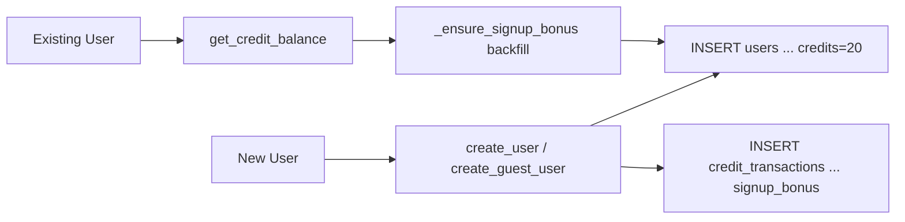
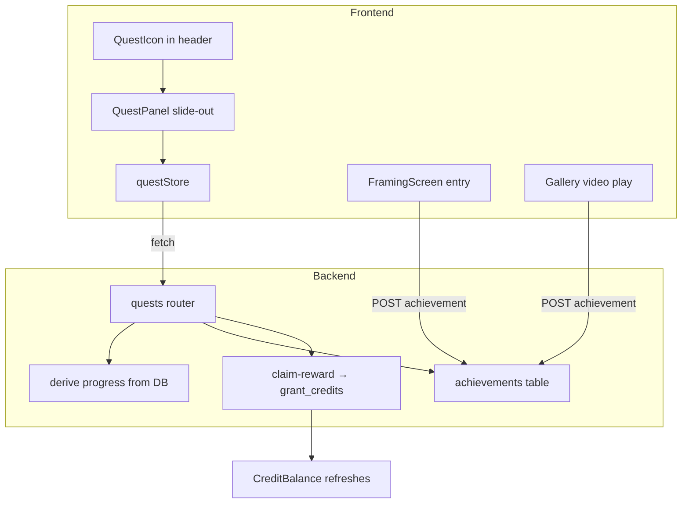

# T540 Design: Quest System

**Status:** DRAFT
**Author:** Architect Agent
**Created:** 2026-03-17

## Current State ("As Is")

### Credit Grant Flow


### Current Behavior
```pseudo
when new user signs up:
    create_user() grants SIGNUP_CREDITS=20 immediately
    ledger records source='signup_bonus'

when existing pre-T530 user hits credit endpoint:
    _ensure_signup_bonus() backfills 20 credits if no signup_bonus transaction exists

result: every user gets 20 free credits with no engagement required
```

### Limitations
- Users get credits without learning the app
- No guided onboarding — users don't know the full pipeline
- No reason to explore framing, overlay, or gallery features

## Target State ("Should Be")

### Quest System Flow


### Target Behavior
```pseudo
when user opens app:
    QuestIcon shows completed/total steps (e.g., "3/9")
    clicking QuestIcon opens QuestPanel (slide-out, same pattern as Gallery)

quest progress is derived:
    upload_game: games table has ≥1 row
    annotate_brilliant: raw_clips has rating=5
    annotate_unfortunate: raw_clips has rating IN (1,2)
    create_annotated_video: export_jobs has type='annotate' AND status='complete'
    log_in: user has email in auth.sqlite
    open_framing: achievements table has 'opened_framing_editor'
    export_framing: export_jobs has type='framing' AND status='complete'
    export_overlay: export_jobs has type='overlay' AND status='complete'
    view_gallery_video: achievements table has 'viewed_gallery_video'

when all steps in a quest complete:
    "Claim 10 credits" button appears
    POST /api/quests/{id}/claim-reward → idempotent grant
    CreditBalance refreshes via fetchCredits()

achievement triggers:
    entering framing mode → POST /api/achievements/opened_framing_editor
    playing gallery video → POST /api/achievements/viewed_gallery_video
    both fire-and-forget (UI doesn't block on response)
```

## Implementation Plan ("Will Be")

### Phase 1: Remove Signup Credits

| File | Change |
|------|--------|
| `src/backend/app/services/auth_db.py:36` | Remove `SIGNUP_CREDITS = 20` |
| `src/backend/app/services/auth_db.py:246-255` | `create_user()`: set credits=0, remove signup_bonus transaction |
| `src/backend/app/services/auth_db.py:432-442` | `create_guest_user()`: set credits=0, remove signup_bonus transaction |
| `src/backend/app/services/auth_db.py:451-465` | Remove `_ensure_signup_bonus()` entirely |
| `src/backend/app/services/auth_db.py:469-470` | `get_credit_balance()`: remove `_ensure_signup_bonus()` call |

```pseudo
// auth_db.py
- SIGNUP_CREDITS = 20

  def create_user(...):
-     INSERT users ... credits=SIGNUP_CREDITS
-     INSERT credit_transactions ... signup_bonus
+     INSERT users ... credits=0

  def create_guest_user():
-     INSERT users ... credits=SIGNUP_CREDITS
-     INSERT credit_transactions ... signup_bonus
+     INSERT users ... credits=0

- def _ensure_signup_bonus(user_id):
-     ... backfill logic ...

  def get_credit_balance(user_id):
-     _ensure_signup_bonus(user_id)
      ... query credits ...
```

### Phase 2: Backend — Achievements Table + Quest API

**New file: `src/backend/app/routers/quests.py`**

```pseudo
router = APIRouter(prefix="/quests", tags=["quests"])

QUEST_DEFINITIONS = [
    {id: 'quest_1', title: 'Get Started', reward: 30, steps: [5 steps]},
    {id: 'quest_2', title: 'Master the Pipeline', reward: 50, steps: [4 steps]},
]

GET /progress:
    user_id = get_current_user_id()
    profile_id = get_selected_profile(user_id)
    db = get_user_db(user_id, profile_id)

    steps = {}
    # Derived checks (per-user SQLite)
    steps['upload_game'] = db.query("SELECT 1 FROM games LIMIT 1")
    steps['annotate_brilliant'] = db.query("SELECT 1 FROM raw_clips WHERE rating=5 LIMIT 1")
    steps['annotate_unfortunate'] = db.query("SELECT 1 FROM raw_clips WHERE rating IN (1,2) LIMIT 1")
    steps['create_annotated_video'] = db.query("SELECT 1 FROM export_jobs WHERE type='annotate' AND status='complete' LIMIT 1")
    steps['export_framing'] = db.query("SELECT 1 FROM export_jobs WHERE type='framing' AND status='complete' LIMIT 1")
    steps['export_overlay'] = db.query("SELECT 1 FROM export_jobs WHERE type='overlay' AND status='complete' LIMIT 1")

    # Auth check (auth.sqlite)
    user = get_user_by_id(user_id)
    steps['log_in'] = user is not None and user['email'] is not None

    # Achievement checks (per-user SQLite)
    steps['open_framing'] = db.query("SELECT 1 FROM achievements WHERE key='opened_framing_editor'")
    steps['view_gallery_video'] = db.query("SELECT 1 FROM achievements WHERE key='viewed_gallery_video'")

    # Check reward_claimed via credit_transactions (auth.sqlite)
    for quest in QUEST_DEFINITIONS:
        quest.reward_claimed = has_transaction(user_id, 'quest_reward', quest.id)

    return {quests: [...]}

POST /{quest_id}/claim-reward:
    # Idempotent: check if already claimed
    if has_transaction(user_id, 'quest_reward', quest_id):
        return current balance (no duplicate grant)

    # Verify all steps complete
    progress = check_progress(user_id, profile_id)
    if not all steps complete for quest_id:
        raise 400

    new_balance = grant_credits(user_id, quest.reward, 'quest_reward', quest_id)
    return {credits_granted: 10, new_balance}

POST /achievements/{key}:
    # Only allow known achievement keys
    if key not in KNOWN_ACHIEVEMENT_KEYS:
        raise 400
    db.execute("INSERT OR IGNORE INTO achievements (key) VALUES (?)", key)
    return {key, achieved_at}
```

**Schema addition in `src/backend/app/database.py`:**

```sql
-- Add after before_after_tracks table (~line 656)
CREATE TABLE IF NOT EXISTS achievements (
    key TEXT PRIMARY KEY,
    achieved_at TEXT DEFAULT (datetime('now'))
);
```

**Router registration in `src/backend/app/routers/__init__.py` and `main.py`:**

```pseudo
// __init__.py
+ from .quests import router as quests_router
+ __all__ = [..., 'quests_router']

// main.py
+ from app.routers import ..., quests_router
+ app.include_router(quests_router, prefix="/api")
```

### Phase 3: Frontend — Quest Store + Panel + Icon

**New file: `src/frontend/src/config/questDefinitions.js`**

Data-driven config array matching the task spec. Exact content from T540 task file.

**New file: `src/frontend/src/stores/questStore.js`**

```pseudo
questStore = create((set, get) => ({
    quests: [],          // [{id, steps: {step_id: bool}, completed: bool, reward_claimed: bool}]
    loaded: false,
    totalCompleted: 0,   // derived: count of all true steps across quests
    totalSteps: 0,       // derived: count of all steps across quests

    fetchProgress: async () => {
        res = fetch('/api/quests/progress')
        data = await res.json()
        // Compute totals
        totalCompleted = sum of all true values across all quest steps
        totalSteps = sum of all step counts
        set({ quests: data.quests, loaded: true, totalCompleted, totalSteps })
    },

    claimReward: async (questId) => {
        res = fetch(`/api/quests/${questId}/claim-reward`, { method: 'POST' })
        data = await res.json()
        // Update credit store
        useCreditStore.getState().setBalance(data.new_balance)
        // Refresh quest state
        get().fetchProgress()
        return data
    },

    recordAchievement: async (key) => {
        // Fire-and-forget
        fetch(`/api/achievements/${key}`, { method: 'POST' })
        // Refresh quest progress
        get().fetchProgress()
    },

    reset: () => set({ quests: [], loaded: false, totalCompleted: 0, totalSteps: 0 }),
}))
```

**New file: `src/frontend/src/components/QuestIcon.jsx`**

```pseudo
QuestIcon:
    totalCompleted, totalSteps, loaded = useQuestStore selectors
    isAuthenticated = useIsAuthenticated()

    // Subscribe to export events to refresh quest progress
    useEffect:
        if !isAuthenticated: return
        unsub1 = exportWebSocketManager.addEventListener('*', 'complete', fetchProgress)
        return () => unsub1()

    // Fetch on mount
    useEffect:
        if isAuthenticated: fetchProgress()

    if !loaded or totalSteps === 0: return null

    allDone = totalCompleted === totalSteps

    return (
        <Button variant="ghost" onClick={questStore.open} title="Quests">
            <Trophy icon />
            <span>{totalCompleted}/{totalSteps}</span>
            {allDone && <checkmark>}
        </Button>
    )
```

**New file: `src/frontend/src/components/QuestPanel.jsx`**

Follows DownloadsPanel pattern exactly:
- Reads `isOpen` from questStore
- Backdrop at z-40, panel at z-50
- `animate-slide-in-right` animation
- Header with Trophy icon + "Quests" title + close button
- Maps over QUESTS config, showing each quest as a card
- Each quest shows: title, progress bar, step checklist, reward section
- Completed steps: green checkmark + title + description
- Incomplete steps: gray circle + title + description
- When all steps done + !reward_claimed: "Claim N credits" button (30 or 50)
- When reward_claimed: "N credits earned" badge

**Mutual exclusion with Gallery:**
```pseudo
// In questStore.open():
open: () => {
    useGalleryStore.getState().close()  // Close Gallery if open
    set({ isOpen: true })
}

// In galleryStore.open():
open: () => {
    useQuestStore.getState().close()    // Close Quest panel if open
    set({ isOpen: true })
}
```

### Phase 4: Wire Achievement Triggers

| Trigger | Location | Action |
|---------|----------|--------|
| Enter framing mode | `App.jsx` line 356 — `useEffect` when `editorMode === FRAMING` | `questStore.recordAchievement('opened_framing_editor')` |
| Play gallery video | `DownloadsPanel.jsx` line 159 — `handlePlay` function | `questStore.recordAchievement('viewed_gallery_video')` |

```pseudo
// App.jsx — fire achievement when entering framing mode
useEffect(() => {
    if (editorMode === EDITOR_MODES.FRAMING) {
        useQuestStore.getState().recordAchievement('opened_framing_editor')
    }
}, [editorMode])

// DownloadsPanel.jsx — fire achievement when playing video
const handlePlay = (e, download) => {
    e.stopPropagation()
    setPlayingVideo(download)
    useQuestStore.getState().recordAchievement('viewed_gallery_video')
}
```

### Phase 5: Wire QuestIcon into Headers

QuestIcon goes right before CreditBalance in all 3 header locations:

| Location | File | Line |
|----------|------|------|
| Framing/Overlay header | `App.jsx` | 325 (before `<CreditBalance />`) |
| Annotate header | `AnnotateScreen.jsx` | 438 (before `<CreditBalance />`) |
| Project Manager header | `ProjectManager.jsx` | 430 (before `<CreditBalance />`) |

### Phase 6: QuestPanel Rendering

Add `<QuestPanel />` in `App.jsx` after `<DownloadsPanel />`:
```pseudo
<DownloadsPanel ... />
<QuestPanel />
```

## Risks

| Risk | Mitigation |
|------|------------|
| Existing user (imankh@gmail.com) has 20 signup credits | Clear credits + signup_bonus transaction for this account. They earn credits fresh via quests. |
| Quest progress stale after export | Subscribe QuestIcon to export complete events (same pattern as CreditBalance) |
| Double reward claim race condition | Backend checks credit_transactions for existing quest_reward before granting. INSERT OR IGNORE on achievements. |
| Gallery + Quest panel both open | Mutual exclusion: opening one closes the other via cross-store calls |
| Achievement POST fails | Fire-and-forget; next fetchProgress will still derive correct state for derived steps. Achievement steps just won't show until retry. |

## Open Questions

- [x] **Quest 2 has 4 steps** — 4/4 for completion, no placeholder. **Decision: 4 steps only.**
- [x] **Existing users with signup credits** — Clear credits for imankh@gmail.com (only account with old signup bonus). They earn quest credits fresh. **Decision: Reset + earn.**
- [x] **Reward amounts** — Quest 1: 30 credits, Quest 2: 50 credits (total 80 earnable).
