# T5410 — Poster Selection Rework: Design (Stage 2)

**Task:** [T5410-poster-selection-rework.md](T5410-poster-selection-rework.md)
**Epic:** [clearest-frame-posters/EPIC.md](clearest-frame-posters/EPIC.md)
**Status:** Design — REVISED per user decisions (2026-07-17); awaiting approval
**Tier:** L (backend selection change + capture-point move + schema/migration + frontend override UX + backfill)

> This design replaces the byte-size "clearest frame" heuristic with a zone-weighted,
> **Modal-YOLO-driven** "athletic open-play" selector, **moves poster generation from publish
> (T5280) back to the overlay EXPORT step**, adds a user-editable preview override on the completed
> draft, and specifies the schema, endpoints, and backfill. **It writes NO source code** —
> pseudo-code and prose only.

---

## 0. Decision summary (read this first)

The user reviewed the first draft and gave two **authoritative** decisions that override the earlier
CPU/publish recommendation. This design implements them.

| Decision | Resolution | Source |
|----------|------------|--------|
| **Detection compute** | **Modal, during overlay export** — reuse the existing `detection.py::call_modal_detect_players` (YOLOv8x) over the open-play frames. **CPU-at-publish is OUT** — "we can't use the cpu because that would drown our server." Not a new Modal function; the same detector the overlay phase already uses, run over more (open-play) frames. | User |
| **Capture point** | **Poster select+generate moves from publish (T5280) to the overlay EXPORT / finalize step** — "we need to move the preview gen to overlay export to get the recommendation since it uses yolo." The poster therefore EXISTS at export-complete, so the "Edit preview image" UX lives on the completed **DRAFT** card (post-export), not the published My-Reels card. | User |
| **"exclude trailing branded outro"** | **No-op / small end-margin only** — post-T3950 the stored `final_videos` object carries no baked outro (playback-composited / download-burn only). Nothing to exclude in the file; keep a tiny end-margin to skip fade/black tail frames. | Architect (Open Q #2) |

**This REVERSES T5280.** Accepted tradeoff (user-approved): every exported draft now pays the Modal
open-play detection cost even if it is never published/shared — in exchange for (a) Modal not CPU and
(b) an editable preview available on drafts. See §5.

---

## 1. Current State Analysis

### 1.1 Architecture (today — this is what we REVERSE)

```mermaid
flowchart LR
  subgraph Export["Overlay export / finalize (TODAY)"]
    R[render -> upload final to R2] --> FIN["_finalize_overlay_export<br/>INSERT final_videos, FREEZE slowmo_section<br/>poster_filename = NULL (T5280)"]
  end
  subgraph Publish["Move to My Reels (TODAY = capture point)"]
    U[User: Move to My Reels] --> P[downloads.py publish_to_my_reels]
    P -->|to_thread, inside durable barrier| G[generate_poster_at_publish]
    G --> EX["extract_clearest_frame_jpeg<br/>window = FIRST HALF of slow-mo section<br/>byte-size heuristic (largest of 5 JPEGs)"]
    EX --> R2[(R2 final_videos/posters/&#123;fn&#125;.jpg)]
    G --> COL[poster_filename = basename]
  end
```



Consumers (unchanged by this task) read the **deterministic** key, never `poster_filename`:
`shares.py::_build_poster_r2_key` derives `final_videos/posters/{video_filename}.jpg` →
`_resolve_poster` HEAD-probes it → `_serve_poster_jpeg` proxies it → edge
`functions/shared/[token].js` emits `og:image`.

### 1.2 Code smells / evidence-backed defects

| Smell / defect | Location | Impact |
|----------------|----------|--------|
| **Wrong-signal heuristic** (byte size ranks whole-scene detail: bleachers, field lines) | `poster.py::extract_clearest_frame_jpeg` | Study Spearman **-0.54** vs user ranking — actively backwards. |
| **Wrong zone sampled** (first HALF of the slow-mo section = the ~0-2s contested/occluded spotlight instant) | `generate_and_store_poster` window math (`start + (end-start)/2`) | Spotlight frames ranked WORST (mean rank 0.80, never #1). |
| **Capture point can't run YOLO** — publish is a Fly API request; a CPU YOLO pass there would overload the server; Modal isn't wired at publish | `generate_poster_at_publish` (T5280) | Forces the move back to export, where Modal YOLO is already available. |
| **No manual override** for the residual within-zone aesthetic preference | (absent) | Users are stuck with whatever the auto-score picks. |
| **`10*zone` weight has no home** in a per-frame score (all samples share the zone) | design gap | Realized structurally as a window gate — see 2.2. |

### 1.3 Current behavior (pseudo-code)

```pseudo
on export_finalize(project):
    section = first_slowmo_section(project)      # freeze slowmo_section_start/end
    poster_filename = NULL                        # deferred to publish (T5280)

on publish(project):
    if section:
        window = (section.start, section.start + (section.end - section.start)/2)   # WRONG zone
        frame  = argmax over 5 samples in window of len(jpeg_encode(frame))          # WRONG signal
    else:
        frame  = first_frame
    store frame -> R2 deterministic key ;  poster_filename = basename
```

---

## 2. Target Architecture

### 2.1 Architecture (target — Modal detection at overlay export)

```mermaid
flowchart LR
  subgraph Export["Overlay export / finalize (NEW capture point)"]
    R[render -> upload FINAL video to R2] --> FIN["_finalize_overlay_export<br/>INSERT final_videos, FREEZE slowmo_section"]
    FIN --> GEN["generate_poster_at_export (async, best-effort)"]
    GEN --> W["open_play_window(section, final_duration)<br/>= [start + SPOTLIGHT_SKIP, end - END_MARGIN]"]
    W --> DET["Modal YOLO on the FINAL R2 object<br/>call_modal_detect_players(final_videos/&#123;fn&#125;, frame_N) x ~12<br/>cached: detections/&#123;fn&#125;/frame_N.json"]
    DET --> SC["score = 2*size + 1.5*ball + 1*(1-occ)"]
    SC --> GRAB[ffmpeg grab best frame on server -> JPEG]
    GRAB --> R2[(R2 overwrite deterministic poster key)]
    SC --> COL["poster_filename + poster_frame_time + poster_source='auto'"]
    FIN --> BARR[sync-then-announce barrier T4110]
  end
  subgraph Override["Completed DRAFT card -> Edit preview image (gesture)"]
    C[PosterEditModal] -->|scrub 'Set as cover'| FR["POST /downloads/&#123;id&#125;/poster/frame &#123;time&#125;"]
    C -->|upload own image| UP["POST /downloads/&#123;id&#125;/poster/upload"]
    FR --> OV[store_override_poster]
    UP --> OV
    OV --> R2
    OV --> COL2["poster_filename + poster_frame_time + poster_source='scrub'|'upload'"]
  end
  subgraph PublishNow["Move to My Reels (NO LONGER generates)"]
    PB[publish_to_my_reels] --> VER["verify poster exists (HEAD) + log; NO generation"]
  end
  subgraph Backfill["admin (Modal)"]
    A[backfill_posters force=true] --> DET2["Modal YOLO on each existing FINAL object's open-play window<br/>SKIP rows where poster_source in (scrub,upload)"]
    DET2 --> R2
  end
  R2 --> CONS["shares.py consumers UNCHANGED (deterministic key)"]
```



### 2.2 Design principles applied

- **DRY / single home:** all frame selection stays in `poster.py` (epic decision #2). The export
  path, the override endpoints, and the backfill call the SAME `select_poster_frame` +
  `store_override_poster` helpers — one selection path, one write path.
- **Detect on the FINAL R2 object, not on working clips.** The final video's timeline already has
  all slow-mo stretch baked in and all multi-clip offsets resolved, so the frozen
  `slowmo_section_start/end` (final time) maps 1:1 to the frames we sample. This makes the
  **identity time-map question moot** — we never translate working-clip time to final time (that was
  the multi-clip offset snag of the "detect during per-clip overlay" variant). We sample final-time
  frames directly.
- **The `10*zone` weight is realized as a window gate**, not a per-candidate term (every candidate is
  already in the open-play window, so the term is constant and cannot discriminate). Within-window
  ranking = `2*subject_size + 1.5*ball_present + 1*(1-occlusion)`. Faithful to the study ("one big
  weight = zone, + light nudges").
- **Modal, not CPU.** The heavy YOLO inference runs on Modal (the detector the overlay phase already
  uses); the Fly server only does ~12 network calls + 1 ffmpeg frame grab + 1 R2 upload — no CPU
  YOLO on the API worker.
- **Gesture-based persistence:** the override is written ONLY from an explicit button click, via a
  surgical endpoint, under `durable_sync`. No `useEffect`→API (CLAUDE.md "Gesture-Based, Never
  Reactive").
- **Preserve invariants:** poster failure never fails export; the sync-then-announce barrier (T4110)
  still gates COMPLETE; consumers keep serving the token-gated proxy (never presigned og:image).

### 2.3 Target behavior (pseudo-code)

```pseudo
# --- selection (poster.py) ---
def open_play_window(section, final_duration):
    if section is None:
        return (0.0, final_duration - END_MARGIN)          # no slow-mo: whole clip minus tail
    start, end = section
    cand_start = start + SPOTLIGHT_SKIP_SECONDS            # skip the ~2s spotlight instant
    cand_end   = min(end, final_duration - END_MARGIN)
    if cand_end - cand_start < MIN_WINDOW:                  # section too short after skip
        return (start, end)                                # degrade to whole section (logged)
    return (cand_start, cand_end)

async def select_poster_frame(user_id, final_filename, window, fps):
    times   = evenly_spaced(window, N_SAMPLES)             # ~12
    frames  = [round(t * fps) for t in times]              # final-time -> frame numbers (identity)
    # Modal person+ball detection on the FINAL R2 object, cached per frame, run in parallel.
    results = await gather(
        modal_detect_cached(user_id, f"final_videos/{final_filename}", n) for n in frames
    )
    best = None
    for (t, det) in zip(times, results):
        subject = pick_subject(det.boxes, det.dims)         # largest lower-central person
        if subject is None:
            score = 0.0
        else:
            size = subject.height / det.dims.height
            occ  = max_overlap_fraction(subject, other_person_boxes(det))
            ball = 1.0 if any_ball_near(subject, ball_boxes(det)) else 0.0
            score = 2.0*size + 1.5*ball + 1.0*(1.0 - occ)  # zone fixed by the window
        best = keep_higher(best, (score, t))
    if best is None or best.score == 0.0:                   # no person detected in-window
        return midpoint(window)                             # deliberate, LOGGED within-zone default
    return best.t                                           # chosen FINAL-time seconds

async def generate_poster_at_export(user_id, final_video_id, final_filename, section, final_duration, fps):
    try:
        window = open_play_window(section, final_duration)
        t      = await select_poster_frame(user_id, final_filename, window, fps)
        jpeg   = ffmpeg_grab_frame(presign(final_videos/final_filename), t)   # 1 server-side seek
        upload jpeg -> R2 deterministic poster key
        set final_videos: poster_filename=basename, poster_frame_time=t, poster_source='auto'
        return basename
    except Exception:
        log at info ; return None       # poster failure NEVER fails export (unchanged invariant)

# --- publish (T5280 REVERSED) ---
def publish_to_my_reels(...):
    ...
    # NO poster generation here anymore. Best-effort existence check only:
    if not r2_head(poster_key): log info "draft exported without poster; unfurl falls back to text"
    ...

# --- override (downloads.py, gesture; UNCHANGED from prior design) ---
def store_override_poster(user_id, fv_id, filename, jpeg_bytes, source, frame_time):
    upload jpeg_bytes -> R2 deterministic key (overwrite)   # same key consumers already read
    set final_videos: poster_filename=basename, poster_frame_time=frame_time, poster_source=source
```

---

## 3. Implementation Plan

### 3.1 Backend — selection (`src/backend/app/services/poster.py`)

| Change | Detail |
|--------|--------|
| **Remove** the byte-size heuristic as the reel selector | Keep `extract_clearest_frame_jpeg` ONLY for recap posters (T5180 whole-clip path is unaffected). The reel path stops calling it. |
| **Add module constants** | `SPOTLIGHT_SKIP_SECONDS=2.0`, `END_MARGIN_SECONDS=0.3`, `MIN_WINDOW_SECONDS=0.5`, `N_SAMPLES=12`, `BALL_CLASS_ID=32`, `PERSON_CLASS_ID=0`, `BALL_NEAR_RADIUS_FRAC` (subject-box multiple). |
| **Add** `open_play_window(section, final_duration) -> (start,end)|None` | Pure, unit-testable. Handles no-slow-mo, too-short-section, end-margin. |
| **Add** `pick_subject(boxes, frame_dims) -> box|None` | Largest person box whose center is in the lower-central third. (Tracked-keyframe subject is only defined in the ~2s spotlight window, not open play, and the study says subject features are weak — so no cross-read of `highlights_data` is needed.) |
| **Add** `score_candidate(subject, boxes, frame_dims) -> float` | `2*size + 1.5*ball_present + 1*(1-occlusion)`; fixed constants (measured effect sizes), NOT learned. |
| **Add** `modal_detect_cached(user_id, input_key, frame_number) -> det` | Thin wrapper: check R2 cache (`get_cached_detection`), else `call_modal_detect_players(user_id, input_key, frame_number, conf)` and `cache_detection_result`. Reuses `detection.py`'s existing cache scheme → re-export/backfill is cheap. Person+ball only. |
| **Add** `select_poster_frame(user_id, final_filename, window, fps) -> time` (async) | Sample→Modal-detect (parallel `asyncio.gather`)→score→best time. Empty detection → window midpoint (logged). Never raises to the caller (caught in `generate_poster_at_export`). |
| **Rename/relocate** `generate_poster_at_publish` → `generate_poster_at_export(...)` (async) | New signature takes the already-computed `section` + `final_duration` + `fps` (all available at finalize) instead of reconstructing. Stores `poster_filename` + `poster_frame_time` + `poster_source='auto'`. Best-effort/never-raises unchanged. |
| **Add** `store_override_poster(user_id, final_video_id, final_filename, jpeg_bytes, source, frame_time)` | Shared override writer: overwrite R2 deterministic key, set the three columns. |
| **Update** `backfill_posters(force=..)` | (a) use `select_poster_frame` (Modal) on each published reel's **existing final object**; (b) **skip** `poster_source IN ('scrub','upload')` even under `force`; (c) heal `poster_frame_time`/`poster_source='auto'`. Candidate SQL adds `poster_source`. Async or thread-bridged (it iterates all users/profiles like the T4140 recap backfill). |

**Detection target = the FINAL R2 object** (`final_videos/{filename}`), not the working video. This
resolves multi-clip offsets and makes the identity time-map moot. The Modal detector is unchanged
(`call_modal_detect_players`, YOLOv8x) — we only feed it more frames (the open-play window) and a
different input key.

### 3.2 Backend — export hook (`src/backend/app/routers/export/overlay.py`)

- **Hook point:** the shared finalize `_finalize_overlay_export` (overlay.py:111) computes +
  freezes `slowmo_section` and INSERTs the `final_videos` row (returns `final_video_id`). The FINAL
  video is already uploaded to R2 by the render path before finalize runs. Add the poster step
  **after** finalize returns and **before** the sync-then-announce barrier, in each async completion
  path that calls finalize (`_run_overlay_export_background`, the no-keyframes copy path, the test
  path, and `export_final`). Because `_finalize_overlay_export` is sync and the poster step is async
  (Modal), await `generate_poster_at_export(...)` from those async callers (do NOT block the sync
  finalize function on an event loop).
- **Ordering (mirrors T5280's "land before the barrier"):** final in R2 → finalize INSERT + slowmo
  freeze → `await generate_poster_at_export(...)` sets `poster_filename`/`poster_frame_time`/
  `poster_source` on the row → existing `sync_export_db_to_r2` barrier carries all of it to R2 →
  announce COMPLETE. Poster failure returns None and the export still completes with
  `poster_filename` NULL (never fatal).
- **fps / duration:** pass the render's known output fps + duration into
  `generate_poster_at_export` (finalize already computes `duration` via `compute_project_metadata`).
  Avoid an extra ffprobe when the value is already in hand; probe only as a fallback.
- **Latency note:** this adds ~12 Modal round-trips (parallelized) + 1 ffmpeg grab to the
  export-complete path. See Open Question #6 (accept the added export latency, or run the poster as a
  deferred best-effort write after announce with an explicit `sync_db_to_r2_explicit`).

### 3.3 Backend — publish (`src/backend/app/routers/downloads.py`, REVERSE T5280)

- `publish_to_my_reels` **no longer calls** `generate_poster_at_publish`. Replace the
  `asyncio.to_thread(generate_poster_at_publish, ...)` block (downloads.py:~1291) with a cheap
  best-effort **existence check** (HEAD the deterministic poster key; log at info if absent). No
  Modal, no ffmpeg at publish.
- `archive_project` still prunes working_clips afterward — irrelevant now, since selection ran at
  export on the final object (no working-clip dependency).

### 3.4 Backend — schema/migration (UNCHANGED from prior design)

**New columns on `final_videos`:**

| Column | Type | Meaning |
|--------|------|---------|
| `poster_frame_time` | `REAL` (nullable) | Absolute time (s) on the FINAL timeline of the auto/scrub-chosen frame. NULL for uploads + legacy. Feeds the edit-preview scrubber default + backfill idempotency. |
| `poster_source` | `TEXT` (nullable) | `'auto'` \| `'scrub'` \| `'upload'`. NULL = legacy (treated as `'auto'`). Guards force-regen from clobbering overrides. |

- **Migration:** `src/backend/app/migrations/profile_db/v026_add_poster_frame_fields.py` (Migration
  agent). Additive guarded `ALTER TABLE final_videos ADD COLUMN ...` (mirror v025). **No data
  backfill** — legacy rows stay NULL (interpreted as legacy/auto); the admin backfill recomputes
  `poster_frame_time` on regen. Tuple-row-factory safe (reads no rows).
- **Fresh-DB schema:** add both columns to `CREATE TABLE final_videos` in
  `database.py::ensure_database` (after line 688, alongside `slowmo_section_end`).
- Migrations do NOT auto-run — trigger `POST /api/admin/migrate` after deploy, before backfill.

### 3.5 Backend — override endpoints (`src/backend/app/routers/downloads.py`, UNCHANGED)

Two gesture-scoped, `durable_sync` endpoints (poster override is a persisted `final_videos` write; a
lost sync = stale cover):

| Endpoint | Body | Behavior |
|----------|------|----------|
| `POST /api/downloads/{final_video_id}/poster/frame` | `{ "time": float }` | Look up the row (latest-version subquery). Presign the reel's final object, `ffmpeg_grab_frame(url, time)` → JPEG. `store_override_poster(..., source='scrub', frame_time=time)`. Return `{ poster_filename, poster_frame_time }`. |
| `POST /api/downloads/{final_video_id}/poster/upload` | multipart image | Decode-verify (cv2) to reject non-images; re-encode JPEG (`-q:v 3`), cap long edge ~1440px. `store_override_poster(..., source='upload', frame_time=NULL)`. Return same shape. |

- Available for a **completed draft's** final object (the reel is owned by the requester's current
  profile; the deterministic key lives under that profile prefix). Works pre- AND post-publish (the
  final object exists from export onward).
- Both overwrite the **same deterministic R2 key** → `shares.py`, `_serve_poster_jpeg`, edge og:image
  need **zero changes**.
- Both are explicit user gestures (no reactive persistence). `no-persistence-in-effects` ESLint keeps
  the frontend honest.
- **Known limitation (documented):** an already-crawled share may show the old og:image until the
  crawler/edge cache expires (overwrite-same-key). Acceptable — same lag the existing force-regen has.

### 3.6 Frontend — editable preview UX (on the completed DRAFT)

Because the poster now exists at export-complete, the edit surface is the **completed-draft card**,
not the published My-Reels card.

| File | Change |
|------|--------|
| `src/frontend/src/components/ProjectManager.jsx` | On the completed-draft card (`ProjectCard`, the `has_final_video` branch ~line 1654), add an **"Edit preview image"** action (alongside the existing draft actions). Opens `PosterEditModal`. Passes the draft's `final_video_id` + `poster_frame_time`. |
| `src/frontend/src/components/PosterEditModal.jsx` **(new)** | MVC View: current poster thumbnail + a `<video>` on the draft's final stream (reuse the existing reel/working-video stream endpoint) with a scrubber; **"Set as cover"** (captures current time); **"Upload your own image"** file input. Scrubber default seek = `poster_frame_time`. No backdrop-close (memory: no-backdrop-close). Writes only on the confirm click. |
| Draft data hook / `useDownloads.js` (or the projects hook feeding `ProjectManager`) | Add surgical `setPosterFrame(id, time)` + `uploadPoster(id, file)` actions (POST → on success update the local draft's `poster_filename`/`poster_frame_time`; store raw, no derived flags). |

Data-always-ready: the modal receives the already-loaded draft object as a prop from the card
(parent guards; the View assumes it exists).

### 3.7 Backfill strategy (existing reels)

- **Chosen:** an admin **Modal-detection force-regen** via the extended `backfill_posters(force=true)`
  — it runs `select_poster_frame` (Modal YOLO on each published reel's existing final object's
  open-play window) and overwrites the deterministic key. Mirrors the T4890/T4950 rollout: staging
  first, one prod pass, then `verify_share_unfurl.py`.
- **Never clobber overrides:** skip `poster_source IN ('scrub','upload')`.
- **No silent read-time fallback** (CLAUDE.md): missing final object → `skipped_gone` (logged); no
  detectable person in-window → midpoint frame (logged), never silent first-frame.
- Cache reuse: `detections/{final_filename}/frame_N.json` means a re-run of the backfill is cheap.
- Alternative "regenerate on next export only": rejected (leaves the legacy corpus on the
  worse-than-random heuristic indefinitely).

### 3.8 Tests

| Layer | Test |
|-------|------|
| Backend unit | `open_play_window` (slow-mo / no-slow-mo / too-short / end-margin); `score_candidate` (size/ball/occlusion monotonicity); `pick_subject` (lower-central); `select_poster_frame` empty-detection → midpoint. Modal mocked; synthetic box fixtures. |
| Backend integration | export finalize now sets `poster_filename`/`poster_frame_time`/`poster_source='auto'` (Modal mocked); poster failure → export still COMPLETE (barrier intact); override endpoints (scrub/upload set columns + `poster_source`, durable 503 on forced sync failure); backfill `force` skips override rows; publish no longer generates. |
| Consumer regression | `shares.py` still serves the (overwritten) poster; `_resolve_poster` HEAD still hits the deterministic key. |
| Frontend | `PosterEditModal` renders scrubber at `poster_frame_time`; confirm fires ONE POST; `no-persistence-in-effects` clean. |
| Manual | real unfurl (`verify_share_unfurl.py`) + email thumbnail spot-check after staging backfill. |

---

## 4. Design Decisions

| Decision | Options | Choice | Rationale |
|----------|---------|--------|-----------|
| Detection compute | Modal (existing detector) vs CPU YOLOv8n on the API worker | **Modal** | User: CPU "would drown our server." Reuse `call_modal_detect_players`; no new Modal function. |
| Capture point | publish (T5280) vs overlay export/finalize | **overlay export** | User: "move the preview gen to overlay export … since it uses yolo" — Modal YOLO is available there; poster then exists on drafts. |
| ~~(B) CPU-at-publish~~ | — | **REJECTED** | CPU YOLO on the Fly API worker would overload the server (user). |
| Detection target video | working clips (per-clip, needs offsets) vs FINAL R2 object | **FINAL object** | Final-time offsets already resolved; identity time-map moot; no `highlights_data` cross-read. |
| Zone weight (`10*zone`) | per-candidate term vs window gate | **window gate** | All candidates share the zone; a term is dead arithmetic. |
| Selector model | learned vs fixed measured weights | **fixed constants** | ~25 labeled frames → learning overfits. |
| Override persistence | reactive autosave vs gesture endpoint | **gesture endpoint + durable_sync** | CLAUDE.md bans reactive persistence; poster_filename loss = stale cover. |
| Override write target | new key + share snapshot vs overwrite deterministic key | **overwrite deterministic key** | Consumers derive the key from `video_filename`; zero consumer change. |
| Edit UX surface | My-Reels card vs completed-draft card | **completed-draft card** | Poster now exists at export-complete (pre-publish). |
| New columns | frame-time only vs frame-time + source | **both** | `poster_source` stops force-regen clobbering manual covers; `poster_frame_time` seeds the scrubber + idempotent regen. |
| Empty-detection fallback | first-frame vs window-midpoint | **window-midpoint (logged)** | Zone dominates; any open-play frame beats the first frame (spotlight/pre-roll). |

---

## 5. Reversal of T5280 — honest tradeoff

T5280 deliberately deferred poster capture to publish so a draft that never publishes "pays nothing."
This design **reverses that**, per the user, because the poster recommendation needs Modal YOLO, which
is only available at export. Consequences:

- **Every exported draft now pays the Modal open-play detection cost**, even if never published or
  shared. User-accepted, to (a) use Modal not CPU and (b) get an editable preview on drafts.
- **Expiry-sweep auto-export path:** does NOT need the hook. Per the export-pipeline knowledge, the
  T4175 sweep is **no longer a `final_videos` writer** — it produces a needs-framing draft +
  `raw_clips/` extract and does NOT publish. Only the two overlay finalize paths write `final_videos`,
  so the poster hook lives there and nowhere else. (If the sweep is ever re-made a `final_videos`
  writer, it must call `generate_poster_at_export` too — noted as an invariant.)
- **Draft re-export** overwrites the deterministic poster key in place (idempotent, same policy). A
  user override (`poster_source` in scrub/upload) is NOT preserved across a re-export finalize by
  default — finalize always writes `poster_source='auto'`. See Open Question #7.

---

## 6. Risks & Mitigations

| Risk | Mitigation |
|------|------------|
| **Added export-complete latency** (~12 Modal round-trips + 1 ffmpeg grab) | Parallelize the Modal calls (`asyncio.gather`); reuse the R2 detection cache. If still too slow, run the poster as a deferred best-effort write after announce with an explicit `sync_db_to_r2_explicit` (Open Q #6). Poster failure never blocks/fails export. |
| **Never-published drafts pay Modal cost** | Accepted by user. Optional guard (threshold / skip tiny drafts) — Open Q #6b. |
| Final object not yet in R2 when the poster step runs | Confirm the render path uploads the final before `_finalize_overlay_export`; the poster step runs after finalize returns (row + object both present). Best-effort HEAD before detecting. |
| Modal detection failure / timeout | `generate_poster_at_export` catches all; export completes with `poster_filename` NULL; admin backfill (or next re-export) heals. Never fatal. |
| og:image cache lag after an override | Documented limitation; same as existing force-regen. |
| Force-regen clobbering a user's manual cover | `poster_source IN ('scrub','upload')` skip guard. |
| Re-export wiping a manual override | Flagged (Open Q #7): either preserve `poster_source!='auto'` across finalize, or accept re-export resets to auto. |
| Migration not auto-run on deploy | Trigger `POST /api/admin/migrate` after deploy, before backfill (memory: migrations manual). |
| Scope creep on the modal | Keep it minimal (scrub + upload); reuse the existing stream + draft card action. |

---

## 7. Open Questions

**RESOLVED by the user (recorded):**
1. ~~Approach (B) CPU-at-publish?~~ **RESOLVED: NO.** Detection runs on **Modal, during overlay
   export** (CPU would overload the server). Poster select+generate moves to the export/finalize step.
3. ~~Edit surface = My-Reels card?~~ **RESOLVED: completed-DRAFT card** (poster exists at
   export-complete, pre-publish).

**Still open:**
2. **"Exclude the trailing outro" is a no-op post-T3950** (stored finals carry no baked outro). OK to
   keep only a small end-margin? Confirm no reel path bakes an outro into the stored object.
4. **Upload validation policy:** decode-verify + re-encode JPEG + cap long edge ~1440px, don't force
   aspect — OK?
5. **`poster_frame_time` = NULL on upload** (no source frame); the scrubber then defaults to the reel
   midpoint. OK?
6. **NEW — export latency vs deferred write:** accept the added Modal-detection latency on the
   export-complete path (poster set before the sync-then-announce barrier, so it's durable
   immediately), OR run the poster as a deferred best-effort write AFTER announce with an explicit
   `sync_db_to_r2_explicit` (faster export-complete, but the draft card may briefly show no poster)?
   Recommendation: run before the barrier (simpler, durable, matches T5280's placement) unless
   staging shows unacceptable export latency.
6b. **NEW — never-published-draft cost guard:** every exported draft now pays Modal detection. Add a
   guard/threshold (e.g. skip very short drafts, or only the primary reel), or accept the cost
   uniformly? (Recommend: accept uniformly first; add a guard only if Modal spend shows up.)
7. **NEW — override survival across re-export:** should a manual override (`poster_source` scrub/upload)
   be PRESERVED when the draft is re-exported (finalize would otherwise reset it to `auto`), or is a
   re-export allowed to reset the cover to the auto pick? (Recommend: preserve non-auto sources across
   re-export — finalize skips poster regen when `poster_source` is a user override AND the poster
   object still exists.)
```
