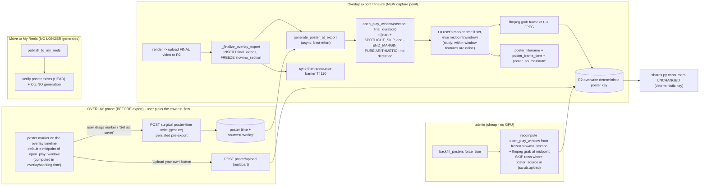

# T5410 — Poster Selection Rework: Design (Stage 2)

**Task:** [T5410-poster-selection-rework.md](T5410-poster-selection-rework.md)
**Epic:** [clearest-frame-posters/EPIC.md](clearest-frame-posters/EPIC.md)
**Status:** Design — **REVISED 2026-08-01: NO NEW YOLO** (supersedes the 2026-07-17 Modal revision); awaiting approval
**Tier:** L (backend selection change + capture-point move + schema/migration + frontend override UX + backfill)

> This design replaces the byte-size "clearest frame" heuristic with a **zone-gated open-play
> selector that requires no object detection at all**, moves poster generation from publish
> (T5280) to the overlay EXPORT step (now a cheap ffmpeg grab), adds a user-editable preview
> override on the completed draft, and specifies the schema, endpoints, and backfill.
> **It writes NO source code** — pseudo-code and prose only.

---

## 0. Decision summary (read this first)

**2026-08-01 — the user rejected adding any new YOLO calls.** ("I actually am nervous about new
yolo calls. even now we only run yolo on 4 frames during the framing export. Can we make any
improvements in the poster image selection without new yolo?")

The answer is yes, and it costs almost nothing in quality. **The study's dominant signal is free.**

| Decision | Resolution | Source |
|----------|------------|--------|
| **Detection compute** | **NONE. No new YOLO, no Modal call, no CPU inference.** The `10*zone` weight — the only strong effect the study measured — is realized purely as a **candidate-window gate** computed by arithmetic on the already-frozen `final_videos.slowmo_section_start/end` (v025). No detection is required to compute it. | User (2026-08-01) |
| **Within-window pick** | **Window midpoint**, deterministic. The study measured every within-window pixel/box feature at \|Spearman\| <= 0.23 (subject size +0.23, occlusion +0.11, player-count +0.09) — i.e. near noise. The task's own conclusion: *"the residual within-zone preference is aesthetic — handle it with a manual override, not a fragile model."* Paying for detection buys the weakest term in the score. | Study evidence + user |
| **Capture point** | **Still moves from publish (T5280) to overlay EXPORT / finalize** — so the poster exists at export-complete and the "Edit preview image" UX can live on the completed **DRAFT** card. With detection gone this is now just *one ffmpeg seek + one R2 upload*, so the move is essentially free. | Architect |
| **The aesthetic residual** | **Part 3 (manual override) is the answer**, exactly as the study concluded. It is now the *only* mechanism for within-window preference, which raises its importance — do not cut it. | Study evidence |
| **Override surface** | **A draggable poster marker on the OVERLAY timeline**, showing where the auto-pick landed, moved before export. **`PosterEditModal` and the draft-card action are CUT.** Upload-your-own becomes a button in the same overlay panel. | User (2026-08-01) |

### Why the override moved into overlay

The user proposed it: *"what if when the user opened overlay there was an indication as to what
frame was preselected for the poster frame and the user had the option to move it."* It is better
than the post-export modal on every axis:

| | Overlay marker (chosen) | Post-export modal (cut) |
|---|---|---|
| Discoverability | On the timeline the user is already scrubbing | A new action on a draft card — **the exact pattern that produced T6180 and T6300** |
| New UI | A marker + drag on an existing timeline | A whole modal with its own `<video>`, scrubber, stream wiring |
| When | In-flow, while finishing the reel | A separate post-hoc chore |
| Export | Grabs the already-chosen frame | Generate at export, then regenerate on override |
| Re-export survival | Choice lives pre-export → **survives naturally** | Open Q #7, unresolved |
| Honesty | Shows the user where the "midpoint of open play" pick landed, and lets them fix it | Silent pick, hidden fix |

It also **dissolves Open Question #7** rather than answering it, and **removes this task's
`ProjectManager.jsx` edit** (the frontend work moves entirely into `src/frontend/src/modes/overlay/`).
| **"exclude trailing branded outro"** | **No-op / small end-margin only** — post-T3950 the stored `final_videos` object carries no baked outro. Keep a tiny end-margin to skip fade/black tail frames. | Architect (Open Q #2) |

### Why this loses almost nothing

| Signal | Study effect | Needs YOLO? | In this design |
|--------|--------------|-------------|----------------|
| **Zone** (open-play slow-mo vs spotlight) | **10x — dominant.** Open-play ranked #1 in 4/5 reels (mean 0.38); spotlight ranked WORST (0.80, never #1) | **No** — pure arithmetic on frozen `slowmo_section` | **Window gate** ✅ |
| Byte size (shipping today) | **-0.54 — worse than random** | No | **Deleted** ✅ |
| subject_size | +0.23 (weak) | Yes | Dropped |
| ball_present | 0.88 vs 0.74 goodness (weak) | Yes | Dropped |
| occlusion | +0.11 (weak) | Yes | Dropped |
| YOLO confidence / aspect / sharpness | -0.11 / -0.12 / -0.08 (already rejected) | Yes | Not used (was already 0-weight) |

Going from byte-size to the window gate moves the primary signal from **-0.54 (actively backwards)**
to the zone that won 4 of 5 reels. The dropped terms are the weak residual the manual override exists
to handle.

### What dropping detection removes from the plan

- No Modal call at export -> **no added export latency** (Open Q #6 is moot)
- **No never-published-draft cost** (Open Q #6b is moot — this was the user's actual concern)
- Backfill becomes **cheap arithmetic + one frame grab**, not a Modal pass over every published reel
- No `modal_detect_cached` wrapper, no detection cache dependency, no `pick_subject`/`score_candidate`
- `poster_frame_time` + `poster_source` columns and the entire override UX are **unchanged**

### If box features are ever wanted later (NOT this task)

Do **not** add a second detection pass. Framing export already makes ONE batched Modal T4 call —
`calculate_detection_timestamps` (`multi_clip.py:700`) samples 4 timestamps per clip at
0 / 0.66 / 1.33 / 2.0s from clip start, flattened across clips into a single
`call_modal_detect_players_batch`. Appending a few open-play timestamps to that existing list is
marginal inference on an already-warm container with the video already downloaded — no new call, no
cold start. **Blocker to resolve first:** framing export runs *before* `slowmo_section` is frozen at
overlay finalize, so the open-play window is not yet known at that point. Out of scope here.

---

## 1. Current State Analysis

### 1.1 Architecture (today — this is what we REVERSE)


```mermaid
flowchart LR
  subgraph Export["Overlay export / finalize (TODAY)"]
    R[render -> upload final to R2] --> FIN["_finalize_overlay_export<br/>INSERT final_videos, FREEZE slowmo_section<br/>poster_filename = NULL (T5280)"]
  end
  subgraph Publish["Move to My Reels (TODAY = capture point)"]
    U[User: Move to My Reels] --> P[downloads.py publish_to_my_reels]
    P -->|to_thread, inside durable barrier| G[generate_poster_at_publish]
    G --> EX["extract_clearest_frame_jpeg<br/>window = FIRST HALF of slow-mo section<br/>byte-size heuristic (largest of 5 JPEGs)"]
    EX --> R2[(R2 final_videos/posters/&#123;fn&#125;.jpg)]
    G --> COL[poster_filename = basename]
  end
```

Consumers (unchanged by this task) read the **deterministic** key, never `poster_filename`:
`shares.py::_build_poster_r2_key` derives `final_videos/posters/{video_filename}.jpg` →
`_resolve_poster` HEAD-probes it → `_serve_poster_jpeg` proxies it → edge
`functions/shared/[token].js` emits `og:image`.

### 1.2 Code smells / evidence-backed defects

| Smell / defect | Location | Impact |
|----------------|----------|--------|
| **Wrong-signal heuristic** (byte size ranks whole-scene detail: bleachers, field lines) | `poster.py::extract_clearest_frame_jpeg` | Study Spearman **-0.54** vs user ranking — actively backwards. |
| **Wrong zone sampled** (first HALF of the slow-mo section = the ~0-2s contested/occluded spotlight instant) | `generate_and_store_poster` window math (`start + (end-start)/2`) | Spotlight frames ranked WORST (mean rank 0.80, never #1). |
| **No manual override** for the residual within-zone aesthetic preference | (absent) | Users are stuck with whatever the auto-pick chooses. **Now the only within-window mechanism** — see §0. |
| **`10*zone` weight has no home** in a per-frame score (all samples share the zone) | design gap | Realized structurally as a window gate — see 2.2. This is also why the gate needs no detection: it is a *time-window* decision, not a *pixel* decision. |

### 1.3 Current behavior (pseudo-code)

```pseudo
on export_finalize(project):
    section = first_slowmo_section(project)      # freeze slowmo_section_start/end
    poster_filename = NULL                        # deferred to publish (T5280)

on publish(project):
    if section:
        window = (section.start, section.start + (section.end - section.start)/2)   # WRONG zone
        frame  = argmax over 5 samples in window of len(jpeg_encode(frame))          # WRONG signal
    else:
        frame  = first_frame
    store frame -> R2 deterministic key ;  poster_filename = basename
```

---

## 2. Target Architecture

### 2.1 Architecture (target — zone gate at overlay export, NO detection)


```mermaid
flowchart LR
  subgraph Export["Overlay export / finalize (NEW capture point)"]
    R[render -> upload FINAL video to R2] --> FIN["_finalize_overlay_export<br/>INSERT final_videos, FREEZE slowmo_section"]
    FIN --> GEN["generate_poster_at_export (async, best-effort)"]
    GEN --> W["open_play_window(section, final_duration)<br/>= [start + SPOTLIGHT_SKIP, end - END_MARGIN]<br/>PURE ARITHMETIC - no detection"]
    W --> PICK["t = user's marker time if set,<br/>else midpoint(window)<br/>(study: within-window features are noise)"]
    PICK --> GRAB[ffmpeg grab frame at t -> JPEG]
    GRAB --> R2[(R2 overwrite deterministic poster key)]
    PICK --> COL["poster_filename + poster_frame_time + poster_source='auto'"]
    FIN --> BARR[sync-then-announce barrier T4110]
  end
  subgraph Overlay["OVERLAY phase (BEFORE export) - user picks the cover in-flow"]
    MK["poster marker on the overlay timeline<br/>default = midpoint of open_play_window<br/>(computed in overlay/working time)"]
    MK -->|user drags marker / 'Set as cover'| SV["POST surgical poster-time write (gesture)<br/>persisted pre-export"]
    MK -->|'Upload your own' button| UP["POST poster/upload (multipart)"]
    SV --> PT[("poster time + source='overlay'")]
    UP --> R2
    PT --> GEN
  end
  subgraph PublishNow["Move to My Reels (NO LONGER generates)"]
    PB[publish_to_my_reels] --> VER["verify poster exists (HEAD) + log; NO generation"]
  end
  subgraph Backfill["admin (cheap - no GPU)"]
    A[backfill_posters force=true] --> DET2["recompute open_play_window from frozen slowmo_section<br/>+ ffmpeg grab at midpoint<br/>SKIP rows where poster_source in (scrub,upload)"]
    DET2 --> R2
  end
  R2 --> CONS["shares.py consumers UNCHANGED (deterministic key)"]
```

### 2.2 Design principles applied

- **DRY / single home:** all frame selection stays in `poster.py` (epic decision #2). The export
  path, the override endpoints, and the backfill call the SAME `select_poster_frame` +
  `store_override_poster` helpers — one selection path, one write path.
- **No inference of any kind.** The Fly server does 1 ffmpeg seek + 1 R2 upload. No Modal call, no
  CPU YOLO, no detection cache dependency. This is the 2026-08-01 user decision (§0).
- **Work in FINAL time.** The frozen `slowmo_section_start/end` are already final-time values, and
  `final_duration` is in hand at finalize, so the window is computed directly against the final
  timeline. No working-clip translation, no multi-clip offset math, **identity time-map question
  moot**.
- **The `10*zone` weight is realized as a window gate**, not a per-candidate term (every candidate is
  already in the open-play window, so the term is constant and cannot discriminate). This is
  precisely why the design needs no detection: **the dominant signal is a decision about *when*, not
  about *what is in the pixels*.** Faithful to the study ("one big weight = zone").
- **Within the window, pick deterministically (midpoint) and stop.** The study measured every
  within-window feature at \|Spearman\| <= 0.23. Fabricating a ranking out of noise would be a
  fragile model dressed up as precision — the task file explicitly warns against it at this sample
  size (~25 labeled frames). The honest design picks the middle of the good zone and hands the
  aesthetic call to the user via the override.
- **Gesture-based persistence:** the override is written ONLY from an explicit button click, via a
  surgical endpoint, under `durable_sync`. No `useEffect`→API (CLAUDE.md "Gesture-Based, Never
  Reactive").
- **Preserve invariants:** poster failure never fails export; the sync-then-announce barrier (T4110)
  still gates COMPLETE; consumers keep serving the token-gated proxy (never presigned og:image).

### 2.3 Target behavior (pseudo-code)

```pseudo
# --- selection (poster.py) ---
def open_play_window(section, final_duration):
    if section is None:
        return (0.0, final_duration - END_MARGIN)          # no slow-mo: whole clip minus tail
    start, end = section
    cand_start = start + SPOTLIGHT_SKIP_SECONDS            # skip the ~2s spotlight instant
    cand_end   = min(end, final_duration - END_MARGIN)
    if cand_end - cand_start < MIN_WINDOW:                  # section too short after skip
        return (start, end)                                # degrade to whole section (logged)
    return (cand_start, cand_end)

def select_poster_frame(window, user_marker_time):
    # NO detection. The study's only strong signal (zone) is already spent by the window gate;
    # every within-window pixel/box feature measured |Spearman| <= 0.23 (noise at n~25), so
    # ranking inside the window would be false precision.
    # The aesthetic residual is the USER's call - and by now they have already made it in
    # overlay, on the marker. Honour it; otherwise pick the middle of the good zone.
    if user_marker_time is not None:
        return user_marker_time            # NOT clamped to the window: the user may deliberately
                                           # want a spotlight frame. Their call beats our gate.
    return midpoint(window)                # chosen FINAL-time seconds

async def generate_poster_at_export(user_id, final_video_id, final_filename, section,
                                    final_duration, user_marker_time):
    try:
        window = open_play_window(section, final_duration)
        t      = select_poster_frame(window, user_marker_time)
        jpeg   = ffmpeg_grab_frame(presign(final_videos/final_filename), t)   # 1 server-side seek
        upload jpeg -> R2 deterministic poster key
        set final_videos: poster_filename=basename, poster_frame_time=t,
                          poster_source=('overlay' if user_marker_time else 'auto')
        return basename
    except Exception:
        log at info ; return None       # poster failure NEVER fails export (unchanged invariant)

# --- publish (T5280 REVERSED) ---
def publish_to_my_reels(...):
    ...
    # NO poster generation here anymore. Best-effort existence check only:
    if not r2_head(poster_key): log info "draft exported without poster; unfurl falls back to text"
    ...

# --- override (downloads.py, gesture; UNCHANGED from prior design) ---
def store_override_poster(user_id, fv_id, filename, jpeg_bytes, source, frame_time):
    upload jpeg_bytes -> R2 deterministic key (overwrite)   # same key consumers already read
    set final_videos: poster_filename=basename, poster_frame_time=frame_time, poster_source=source
```

---

## 3. Implementation Plan

### 3.1 Backend — selection (`src/backend/app/services/poster.py`)

| Change | Detail |
|--------|--------|
| **Remove** the byte-size heuristic as the reel selector | Keep `extract_clearest_frame_jpeg` ONLY for recap posters (T5180 whole-clip path is unaffected). The reel path stops calling it. |
| **Add module constants** | `SPOTLIGHT_SKIP_SECONDS=2.0`, `END_MARGIN_SECONDS=0.3`, `MIN_WINDOW_SECONDS=0.5`. (No `N_SAMPLES` / class ids / radius — nothing is detected.) |
| **Add** `open_play_window(section, final_duration) -> (start,end)` | Pure, unit-testable, **the whole algorithm**. Handles no-slow-mo, too-short-section, end-margin. This is where the study's 10x zone weight lives. |
| **Add** `select_poster_frame(window) -> time` | Returns `midpoint(window)`. Pure and trivial — kept as a named function so the selection point is greppable and the override/backfill/export paths share one definition (and so a future within-window rule has an obvious home). |
| ~~`pick_subject` / `score_candidate` / `modal_detect_cached`~~ | **CUT** (2026-08-01). All three existed only to rank within the window using detection — the study measured those features at noise level. No detection wrapper, no cache dependency, no box math. |
| **Rename/relocate** `generate_poster_at_publish` → `generate_poster_at_export(...)` (async) | New signature takes the already-computed `section` + `final_duration` (both available at finalize). Stores `poster_filename` + `poster_frame_time` + `poster_source='auto'`. Best-effort/never-raises unchanged. Async only because its callers are async and it does R2 I/O — no inference. |
| **Add** `store_override_poster(user_id, final_video_id, final_filename, jpeg_bytes, source, frame_time)` | Shared override writer: overwrite R2 deterministic key, set the three columns. **Unchanged.** |
| **Update** `backfill_posters(force=..)` | (a) recompute `open_play_window` from each published reel's **frozen `slowmo_section`** + grab the midpoint frame from its existing final object — **no GPU, no detection**; (b) **skip** `poster_source IN ('scrub','upload')` even under `force`; (c) heal `poster_frame_time`/`poster_source='auto'`. Candidate SQL adds `poster_source`. |

**Frame grab target = the FINAL R2 object** (`final_videos/{filename}`). `slowmo_section_start/end`
are already final-time, so the window applies directly with no offset translation.

**Note on `fps`:** the previous design threaded `fps` through to convert times to frame numbers for
the detector. With no detector there are no frame numbers — everything is seconds on the final
timeline — so `fps` drops out of the signature entirely.

### 3.2 Backend — export hook (`src/backend/app/routers/export/overlay.py`)

- **Hook point:** the shared finalize `_finalize_overlay_export` (overlay.py:111) computes +
  freezes `slowmo_section` and INSERTs the `final_videos` row (returns `final_video_id`). The FINAL
  video is already uploaded to R2 by the render path before finalize runs. Add the poster step
  **after** finalize returns and **before** the sync-then-announce barrier, in each async completion
  path that calls finalize (`_run_overlay_export_background`, the no-keyframes copy path, the test
  path, and `export_final`). Because `_finalize_overlay_export` is sync and the poster step is async
  (R2 I/O), await `generate_poster_at_export(...)` from those async callers (do NOT block the sync
  finalize function on an event loop).
- **Ordering (mirrors T5280's "land before the barrier"):** final in R2 → finalize INSERT + slowmo
  freeze → `await generate_poster_at_export(...)` sets `poster_filename`/`poster_frame_time`/
  `poster_source` on the row → existing `sync_export_db_to_r2` barrier carries all of it to R2 →
  announce COMPLETE. Poster failure returns None and the export still completes with
  `poster_filename` NULL (never fatal).
- **duration:** pass the render's known duration into `generate_poster_at_export` (finalize already
  computes it via `compute_project_metadata`). Avoid an extra ffprobe when the value is in hand;
  probe only as a fallback. (`fps` is no longer needed — see §3.1.)
- **Latency note (2026-08-01):** with detection cut, this adds **one ffmpeg seek + one R2 upload** to
  the export-complete path — the same cost T5280 already paid at publish, just relocated. Open
  Question #6 (accept latency vs deferred write) is **moot**; run it before the barrier so the poster
  columns ride the existing `sync_export_db_to_r2`.

### 3.3 Backend — publish (`src/backend/app/routers/downloads.py`, REVERSE T5280)

- `publish_to_my_reels` **no longer calls** `generate_poster_at_publish`. Replace the
  `asyncio.to_thread(generate_poster_at_publish, ...)` block (downloads.py:~1291) with a cheap
  best-effort **existence check** (HEAD the deterministic poster key; log at info if absent). No
  Modal, no ffmpeg at publish.
- `archive_project` still prunes working_clips afterward — irrelevant now, since selection ran at
  export on the final object (no working-clip dependency).

### 3.4 Backend — schema/migration (UNCHANGED from prior design)

**New columns on `final_videos`:**

| Column | Type | Meaning |
|--------|------|---------|
| `poster_frame_time` | `REAL` (nullable) | Absolute time (s) on the FINAL timeline of the auto/scrub-chosen frame. NULL for uploads + legacy. Feeds the edit-preview scrubber default + backfill idempotency. |
| `poster_source` | `TEXT` (nullable) | `'auto'` \| `'scrub'` \| `'upload'`. NULL = legacy (treated as `'auto'`). Guards force-regen from clobbering overrides. |

- **Migration:** `src/backend/app/migrations/profile_db/v032_add_poster_frame_fields.py` (Migration
  agent). Additive guarded `ALTER TABLE final_videos ADD COLUMN ...` (mirror v025). **No data
  backfill** — legacy rows stay NULL (interpreted as legacy/auto); the admin backfill recomputes
  `poster_frame_time` on regen. Tuple-row-factory safe (reads no rows).

  > ⚠️ **VERSION CORRECTED 2026-08-01.** The original design said `v026` — that number is long gone.
  > Verified state: `origin/master` profile_db head is **v029**; unmerged
  > `feature/T5800-cross-profile-game-attribution` claims **v030**; unmerged
  > `feature/T5725-teammates-team-only` claims **v031**. So **v032** is the first free slot.
  > **Re-verify at implementation time** (`ls src/backend/app/migrations/profile_db/` *and* check
  > sibling unmerged branches) — the runner only applies versions greater than the DB's current
  > version, so a duplicate number is **silently skipped** and the columns never get created.
- **Fresh-DB schema:** add both columns to `CREATE TABLE final_videos` in
  `database.py::ensure_database` (after line 688, alongside `slowmo_section_end`).
- Migrations do NOT auto-run — trigger `POST /api/admin/migrate` after deploy, before backfill.

### 3.5 Backend — poster-time persistence (PRE-EXPORT, gesture-scoped)

**REVISED 2026-08-01.** The override now happens in overlay, *before* a `final_videos` row exists —
so the chosen time cannot be written to `final_videos`. It is persisted against the reel's
pre-export state and consumed by finalize.

| Endpoint | Body | Behavior |
|----------|------|----------|
| `POST /api/overlay/{project_id}/poster-time` | `{ "time": float \| null }` | Surgical, gesture-only write of the user's marker time (overlay/working-video seconds). `null` clears it back to auto. Returns the stored value. |
| `POST /api/overlay/{project_id}/poster/upload` | multipart image | Decode-verify (cv2) to reject non-images; re-encode JPEG (`-q:v 3`), cap long edge ~1440px. Stores the custom cover and marks the source as `'upload'`. |

- **Gesture-only.** Both fire from an explicit click/drag-end — never from a `useEffect`
  (CLAUDE.md "Gesture-Based, Never Reactive"). `no-persistence-in-effects` ESLint enforces it.
- **Surgical.** Send only the poster time, not the whole overlay state.

#### ⚠️ Architect decision required at implementation (wave 2)

**Where the pre-export poster time is stored is NOT settled here** and must be verified against code,
not assumed. Candidates:

| Option | Pro | Con / must verify |
|--------|-----|-------------------|
| New column on `working_videos` (e.g. `poster_time REAL`) | Overlay already edits this row; naturally per-reel | **`upsert_working_video` versions rows** — confirm whether a re-render creates a new version that would drop the value. If so, carry it forward explicitly. |
| Project-level column | Immune to working-video versioning | Need to confirm the right project table/row and that it survives the draft lifecycle |
| Inside `working_videos.highlights_data` | No migration | Buries a distinct datum in an overlay blob; poor greppability (violates "greppability beats elegance") |

Recommendation: a **dedicated, explicitly-named column** (greppable, one datum one home) — but the
implementor must confirm the versioning semantics before choosing the table. Whichever is chosen,
`v032` covers it alongside the two `final_videos` columns.

#### Time mapping (verified — the key feasibility question)

The overlay timeline is the **rendered working video** (`working_videos/{filename}` — the same
`output_key` fed to detection at framing export), so it already has trim and slow-mo stretch baked
in. The final video is rendered from it, with the branded outro appended *after* all content. So
**overlay time maps to final time directly**, which is what the task file recorded as the verified
identity map. Machinery already exists if any translation is ever needed:
`highlight_transform.source_time_to_working_time` (speed/trim) and `poster.first_slowmo_section`'s
`clip_offset` accumulation (multi-clip → final concatenated time).

**Implementor must re-verify the identity end-to-end on a multi-clip, slow-mo reel** (set the marker
at a visually distinctive moment, export, confirm the poster is that moment) — a single-clip check
is not sufficient evidence, and the original spot-check was at 2.0s only.

- Upload still overwrites the **same deterministic R2 key** → `shares.py`, `_serve_poster_jpeg`, edge
  og:image need **zero changes**.
- **Known limitation (documented):** an already-crawled share may show the old og:image until the
  crawler/edge cache expires (overwrite-same-key). Same lag the existing force-regen has.

### 3.6 Frontend — poster marker in the OVERLAY timeline

**REVISED 2026-08-01. `PosterEditModal` and the `ProjectManager.jsx` draft-card action are CUT.**
All frontend work now lives under `src/frontend/src/modes/overlay/`.

| File | Change |
|------|--------|
| Overlay timeline component (`src/frontend/src/modes/overlay/`) | Render a **poster marker** on the existing timeline at the current poster time. Default position = midpoint of the open-play window. Draggable; drag-end fires the surgical write. Must read as a *cover-photo* marker, distinct from the playhead and from highlight-region handles — go through the **UI Designer** (this is a new timeline affordance, and the style guide governs it). |
| Overlay panel | A **"Use current frame as cover"** action (sets the marker to the playhead) and an **"Upload your own"** file input. Both explicit gestures. |
| Overlay hook | Surgical `setPosterTime(projectId, time)` + `uploadPoster(projectId, file)`. On success update local state from the response; store raw, no derived flags. **No `useEffect` → API.** |

**Discoverability is the point** (this is why the surface moved). The marker must be visible without
hovering and reachable with a coarse pointer — the app has shipped this bug twice already
(T5910, T6300). Keep >=44px touch targets. Do not build a hover-only affordance.

**Do not label it "AI-picked" or "smart."** It is the midpoint of the open-play slow-mo. Honest copy.

### 3.7 Backfill strategy (existing reels)

- **Chosen:** an admin force-regen via the extended `backfill_posters(force=true)` — recompute
  `open_play_window` from each published reel's **frozen `slowmo_section`** and grab the midpoint
  frame from its existing final object, overwriting the deterministic key. Mirrors the T4890/T4950
  rollout: staging first, one prod pass, then `verify_share_unfurl.py`.
- **Now cheap (2026-08-01).** With detection cut this is arithmetic + one ffmpeg seek per reel — no
  GPU, no Modal, no per-frame cache. The backfill stops being the expensive part of this task and
  becomes a routine admin pass, so there is no reason to phase it.
- **Never clobber overrides:** skip `poster_source IN ('scrub','upload')`.
- **No silent read-time fallback** (CLAUDE.md): missing final object → `skipped_gone` (logged);
  **row with no frozen `slowmo_section`** → whole-clip-minus-end-margin midpoint (logged), never a
  silent first-frame.
- Alternative "regenerate on next export only": rejected (leaves the legacy corpus on the
  worse-than-random heuristic indefinitely).

### 3.8 Tests

| Layer | Test |
|-------|------|
| Backend unit | `open_play_window` (slow-mo / no-slow-mo / too-short / end-margin / section longer than duration); `select_poster_frame` (marker set → honoured verbatim including outside the window; marker unset → midpoint). Pure functions, no mocking needed. |
| Backend integration | export finalize sets `poster_filename`/`poster_frame_time`/`poster_source='auto'` with no marker, and `'overlay'` with one; poster failure → export still COMPLETE (**barrier intact — assert this explicitly**); poster-time endpoint persists + clears (`null`); upload endpoint rejects a non-image; backfill `force` skips override rows; **publish no longer generates a poster**. |
| Consumer regression | `shares.py` still serves the (overwritten) poster; `_resolve_poster` HEAD still hits the deterministic key. |
| Frontend | Marker renders at the auto default; drag-end fires **exactly ONE** POST; `no-persistence-in-effects` clean; marker reachable **without hover** and at coarse pointer (regression guard for the T5910/T6300 class of bug). |
| **Time-map verification (REQUIRED, manual)** | On a **multi-clip, slow-mo** reel: set the marker at a visually distinctive moment → export → confirm the generated poster is that exact moment. A single-clip check does not count as evidence. |
| Manual | real unfurl (`verify_share_unfurl.py`) + email thumbnail spot-check after staging backfill. |

---

## 4. Design Decisions

| Decision | Options | Choice | Rationale |
|----------|---------|--------|-----------|
| **Detection compute** | Modal YOLO at export vs CPU on the API worker vs **none** | **NONE (2026-08-01)** | User: nervous about new YOLO calls. The study's only strong signal (zone) needs no pixels; every detection-dependent feature measured at noise. Buying the weak terms is not worth a GPU pass. |
| ~~(A) Modal detection at overlay export~~ | — | **SUPERSEDED** | Was the 2026-07-17 decision. Cut because it purchases only \|Spearman\| <= 0.23 features while adding export latency + a per-export GPU cost on never-published drafts. |
| ~~(B) CPU-at-publish~~ | — | **REJECTED** | CPU YOLO on the Fly API worker would overload the server (user). |
| Capture point | publish (T5280) vs overlay export/finalize | **overlay export** | The poster must exist at export-complete for the draft-card edit UX. Now costs one ffmpeg seek, so the move is near-free. |
| Frame-grab target video | working clips (per-clip, needs offsets) vs FINAL R2 object | **FINAL object** | `slowmo_section` is already final-time; no offset translation. |
| Zone weight (`10*zone`) | per-candidate term vs window gate | **window gate** | All candidates share the zone; a term is dead arithmetic. The gate is a *time* decision, which is why it needs no detection. |
| Within-window pick | detection-scored vs sharpness vs **midpoint** | **midpoint** | All measured within-window features are noise at n~25; sharpness specifically scored **-0.08**. Deterministic beats false precision. |
| Selector model | learned vs fixed measured weights vs none | **none needed** | With the zone realized as a gate, there is no remaining weight vector to set or learn. |
| Aesthetic residual | auto-score vs **manual override** | **manual override** | The task file's own conclusion. Now the sole within-window mechanism — raises part 3's importance. |
| Override persistence | reactive autosave vs gesture endpoint | **gesture endpoint** | CLAUDE.md bans reactive persistence. |
| Override write target | new key + share snapshot vs overwrite deterministic key | **overwrite deterministic key** | Consumers derive the key from `video_filename`; zero consumer change. |
| **Edit UX surface** | My-Reels card vs completed-draft modal vs **overlay timeline marker** | **overlay timeline marker (2026-08-01)** | User's proposal. In-flow, no new modal, survives re-export, dissolves Open Q #7, and avoids repeating the T6180/T6300 hidden-affordance bug. Removes this task's `ProjectManager.jsx` edit. |
| ~~`PosterEditModal` on the draft card~~ | — | **CUT** | Superseded by the overlay marker. |
| User marker vs the window gate | clamp the marker into the open-play window vs honour it anywhere | **honour it anywhere** | If the user deliberately picks a spotlight frame, that is a decision, not an error. Our gate is a default, not a rule. |
| New columns | frame-time only vs frame-time + source | **both** | `poster_source` stops force-regen clobbering manual covers; `poster_frame_time` records what was used. |
| No-slow-mo fallback | first-frame vs whole-clip midpoint | **whole-clip-minus-margin midpoint (logged)** | Any mid-reel frame beats the first frame (pre-roll/spotlight). |

---

## 5. Reversal of T5280 — honest tradeoff

T5280 deliberately deferred poster capture to publish so a draft that never publishes "pays nothing."
This design still **reverses that** — the poster must exist at export-complete for the draft-card
edit UX — but the 2026-08-01 no-YOLO decision makes the reversal nearly costless. Consequences:

- **Every exported draft now pays one ffmpeg seek + one R2 upload**, even if never published. This is
  the *same* work T5280 did at publish, merely relocated — not a new class of cost.
  **(The Modal-per-export concern that made this tradeoff contentious is gone.)**
- **Expiry-sweep auto-export path:** does NOT need the hook. Per the export-pipeline knowledge, the
  T4175 sweep is **no longer a `final_videos` writer** — it produces a needs-framing draft +
  `raw_clips/` extract and does NOT publish. Only the two overlay finalize paths write `final_videos`,
  so the poster hook lives there and nowhere else. (If the sweep is ever re-made a `final_videos`
  writer, it must call `generate_poster_at_export` too — noted as an invariant.)
- **Draft re-export** overwrites the deterministic poster key in place (idempotent, same policy). A
  user override (`poster_source` in scrub/upload) is NOT preserved across a re-export finalize by
  default — finalize always writes `poster_source='auto'`. See Open Question #7.

---

## 6. Risks & Mitigations

| Risk | Mitigation |
|------|------------|
| ~~Added export-complete latency (~12 Modal round-trips)~~ | **ELIMINATED 2026-08-01** — one ffmpeg seek + one R2 upload. Run before the sync barrier. |
| ~~Never-published drafts pay Modal cost~~ | **ELIMINATED 2026-08-01** — no GPU cost per export. This was the user's blocking concern. |
| **Midpoint lands on a bad frame** (motion blur, ref/coach in shot, subject out of view) | Accepted and *expected sometimes* — the study says no cheap signal predicts this. The **manual override is the mitigation** and is part of this task, not a follow-up. If overrides turn out to be used on most reels, that is the trigger to revisit within-window ranking (see §0 "if box features are ever wanted later"). |
| **Quality claim must stay honest** | Do NOT describe this as "AI-picked" or "smart" in UI copy. It picks the middle of the open-play slow-mo. Call it what it is. |
| Final object not yet in R2 when the poster step runs | Confirm the render path uploads the final before `_finalize_overlay_export`; the poster step runs after finalize returns (row + object both present). Best-effort HEAD before grabbing. |
| ffmpeg grab failure / bad seek | `generate_poster_at_export` catches all; export completes with `poster_filename` NULL; admin backfill (or next re-export) heals. Never fatal. |
| og:image cache lag after an override | Documented limitation; same as existing force-regen. |
| Force-regen clobbering a user's manual cover | `poster_source IN ('scrub','upload')` skip guard. |
| Re-export wiping a manual override | Flagged (Open Q #7): either preserve `poster_source!='auto'` across finalize, or accept re-export resets to auto. |
| Migration not auto-run on deploy | Trigger `POST /api/admin/migrate` after deploy, before backfill (memory: migrations manual). |
| Scope creep on the modal | Keep it minimal (scrub + upload); reuse the existing stream + draft card action. |

---

## 7. Open Questions

**RESOLVED by the user (recorded):**
1. ~~Approach (B) CPU-at-publish?~~ **RESOLVED: NO** — CPU would overload the server. *(And as of
   2026-08-01, approach (A) Modal-at-export is also out: **no detection at all.** See §0.)*
3. ~~Edit surface = My-Reels card / draft card?~~ **RESOLVED 2026-08-01: the OVERLAY timeline
   marker.** `PosterEditModal` and the draft-card action are cut.
6. ~~Export latency vs deferred write?~~ **MOOT** — no detection, so the poster step is one ffmpeg
   seek + one upload. Run it before the sync-then-announce barrier.
6b. ~~Never-published-draft Modal cost guard?~~ **MOOT** — there is no per-export GPU cost. This was
   the user's blocking concern and it is resolved by removing detection, not by adding a guard.
7. ~~Override survival across re-export?~~ **DISSOLVED** — the marker is stored pre-export, so a
   re-export re-reads the same user choice instead of overwriting it. No special-casing in finalize.

**Still open (for wave-2 implementation):**
2. **"Exclude the trailing outro" is a no-op post-T3950** (stored finals carry no baked outro). OK to
   keep only a small end-margin? Confirm no reel path bakes an outro into the stored object.
4. **Upload validation policy:** decode-verify + re-encode JPEG + cap long edge ~1440px, don't force
   aspect — OK?
5. **`poster_frame_time` on upload:** NULL (there is no source frame). The marker then sits at the
   auto default while the actual cover is the uploaded image — confirm that is acceptable, and that
   the overlay UI makes it obvious a custom image is in use rather than the marker frame.
8. **NEW — where the pre-export poster time lives** (§3.5). Must be decided against real code: a
   `working_videos` column risks being dropped by `upsert_working_video` versioning on re-render; a
   project-level column is safer. Verify before choosing.
9. **NEW — marker visibility on a crowded timeline.** The overlay timeline already carries the
   playhead and highlight-region handles. UI Designer must ensure the poster marker is
   distinguishable and does not collide with region drag targets.
```
