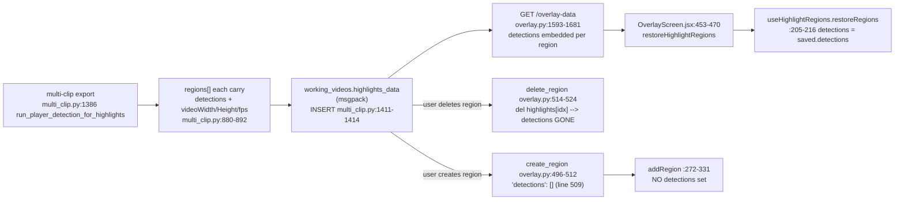
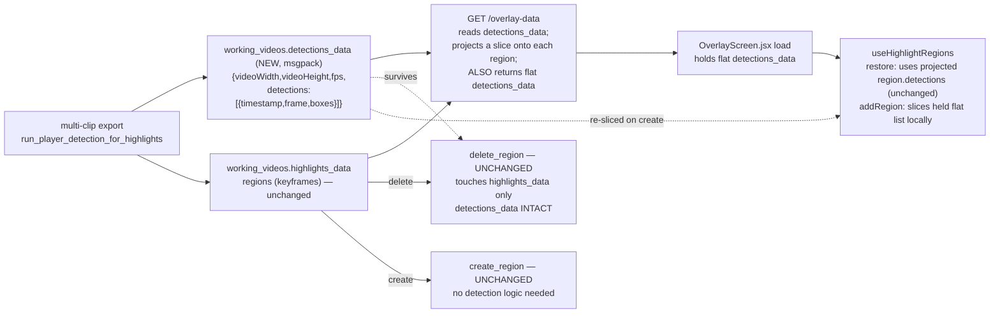

# T5600 — Design: Player-detection survives region delete (video-level detection store)

**Status:** DESIGN — awaiting user approval (Stage 2 gate)
**Tier:** L (schema + backend + frontend + migration)
**Chosen behavior:** "Protect tracking only" — deleting a highlight region removes the spotlight
span + its circle keyframes, but the player-detection *tracking squares* survive; re-creating a
region over the same time span re-populates them.
**Approach:** Option A — retain detections at the **working-video level**, decoupled from regions.

Anchors below are trusted from the task's audit (`docs/plans/tasks/T5600-detection-survives-region-delete.md`);
each was confirmed against the code while writing this doc.

---

## 1. Current State

Detection "tracking squares" are computed once at multi-clip export, at 4 evenly-spaced timestamps
in each clip's first ~2s, and stored **only** inside each region's `detections` array inside the
`working_videos.highlights_data` msgpack blob. There is **no video-level or project-level copy**.
Region delete does `del highlights[idx]`, which destroys that region's detections; region create
hardcodes `"detections": []`.



**Current pseudocode**

```pseudo
# EXPORT (once)
regions = run_player_detection_for_highlights(...)   # each region: {..., detections:[{timestamp,frame,boxes}], videoWidth,videoHeight,fps}
working_videos.highlights_data = msgpack(regions)     # detections live ONLY here, per region

# READ (enter Overlay)
row = latest working_videos
regions = decode(row.highlights_data)                 # detections ride inside each region
return { highlights_data: regions, ... }              # per-region detections embedded in wire JSON

# DELETE region (gesture)
highlights = decode(highlights_data)
del highlights[idx]                                   # <-- detections for that span destroyed
save(highlights)

# CREATE region (gesture)
new_region = { id, startTime, endTime, keyframes:[], detections:[] }   # <-- always empty
highlights.append(new_region); save(highlights)
# frontend addRegion likewise never sets detections
```

**Code smells**

| Smell | Location | Impact |
|-------|----------|--------|
| Data coupled to the wrong lifetime | detections stored inside a `region` dict that the user can delete | Deleting the spotlight (a rendering concern) destroys detection (an editing aid) — the reported bug |
| Two write behaviors, one silently lossy | delete mutates the same blob that holds detections | No way to "protect tracking" without decoupling storage |
| Unrelated second store misleads | R2 `detections/{filename}/frame_{N}.json` (`detection.py:65-74`) written ONLY by single-frame scrub `POST /api/detect/players` (`detection.py:424`) | Looks like a detection cache but never holds the batch/export squares — do NOT reuse it here |

---

## 2. Target State

Store the batch detection result **once per working video** as a flat, whole-timeline payload in a
new `working_videos.detections_data` column, decoupled from regions. A region's `detections` become
a **read-time projection** (a time-slice of the canonical payload), never persisted per-region and
never destroyed by delete.

Detection timestamps are already absolute times on the concatenated working-video timeline
(`calculate_detection_timestamps`: `absolute_time = clip_start + relative_time`, `multi_clip.py:726`),
so slicing a region `[startTime, endTime]` out of the flat list is a direct time filter — no
per-clip remapping needed.



**Target pseudocode**

```pseudo
# EXPORT (once) — producer ALSO emits the flat video-level payload
regions, video_detections = run_player_detection_for_highlights(...)
#   video_detections = {videoWidth, videoHeight, fps, detections:[{timestamp,frame,boxes}]}  # whole video
working_videos.highlights_data = msgpack(regions)          # unchanged
working_videos.detections_data = msgpack(video_detections) # NEW canonical store

# READ (enter Overlay) — detections_data is the SINGLE source; project per region
row = latest working_videos
regions = decode(row.highlights_data)
vd = decode(row.detections_data) or backfill_from_regions(regions)   # old exports: hoist union
for r in regions:
    r["detections"]  = slice_detections(vd, bounds(r))     # read-time projection (NOT persisted)
    r["videoWidth"], r["videoHeight"], r["fps"] = vd meta  # keep coord scaling correct
return { highlights_data: regions, detections_data: vd, ... }   # NEW top-level field

# DELETE region (gesture) — UNCHANGED. detections_data never touched -> squares survive.

# CREATE region (gesture) — backend UNCHANGED.
#   frontend addRegion slices the held flat list for instant in-session squares;
#   on next /overlay-data the backend projection reproduces the same slice.

def slice_detections(vd, start, end, EPS=0.04):
    return [d for d in vd.detections if start-EPS <= d.timestamp <= end+EPS]
```

**Design principles applied**

- [x] **No redundant persisted state**: detection boxes have ONE canonical home (`detections_data`);
  `region.detections` becomes a derived read-time projection, not stored twice.
- [x] **Single code path for delete/create**: the overlay action handlers are untouched — decoupling
  the store means "protect tracking" needs no per-action branch.
- [x] **DRY**: one projection function per side of the wire (Python `slice_detections`, JS
  `sliceDetections`) — a sanctioned cross-language mirror (like the spline mirrors), not intra-repo
  duplication.
- [x] **Data always ready / gesture-based**: the flat list loads with overlay data; addRegion is a
  pure local slice inside the existing gesture; NO reactive `useEffect` write.

---

## 3. Implementation Plan

### (a) New column: `working_videos.detections_data`

- **Track:** `profile_db` (`working_videos` lives in `profile.sqlite`, created by `ensure_database()`).
- **Type/encoding:** `BLOB` — msgpack via `encode_data`/`decode_data` (`app/utils/encoding.py`),
  matching `highlights_data`/`text_overlays`. NOT JSON-on-disk (confirmed: all `working_videos`
  binary columns are msgpack; JSON is wire-only — persistence-sync.md §Blob encoding).
- **Payload shape (decoded):**
  ```json
  { "videoWidth": 810, "videoHeight": 1440, "fps": 30,
    "detections": [ { "timestamp": 12.34, "frame": 370, "boxes": [ ... ] }, ... ] }
  ```
  Flat, whole-timeline, absolute concatenated-video time. Nullable (NULL = never populated / pre-migration).

### (b) `_SCHEMA_DDL` / `ensure_database()` — `src/backend/app/database.py`

Add the column to the `CREATE TABLE IF NOT EXISTS working_videos` DDL (currently `database.py:635-653`),
so **fresh** DBs have it:

```pseudo
CREATE TABLE IF NOT EXISTS working_videos (
    ... existing columns ...
    dim_strength REAL DEFAULT 0.20,
+   detections_data BLOB,
    created_at TIMESTAMP DEFAULT CURRENT_TIMESTAMP,
    FOREIGN KEY (project_id) REFERENCES projects(id) ON DELETE CASCADE
)
```
(`ensure_database()` only does CREATE-IF-NOT-EXISTS; it will NOT alter existing tables — that is the
migration's job, per (c). This mirrors every prior column add, e.g. v024 `poster_filename`.)

### (c) Versioned migration — `profile_db`

- **Current head:** v026 (`v026_games_shared_by.py`). **Next:** **v027**.
- **File:** `src/backend/app/migrations/profile_db/v027_working_video_detections_data.py`
- **`up(conn)`** (remember: **tuple** row factory — index positionally `r[0]`, never `r['col']`;
  backend-services.md landmine):
  ```pseudo
  ALTER TABLE working_videos ADD COLUMN detections_data BLOB
  # BACKFILL (recommended — see Risks): hoist union of existing regions' detections up to video level
  for (id, highlights_blob) in SELECT id, highlights_data FROM working_videos WHERE highlights_data IS NOT NULL:
      regions = decode_data(highlights_blob)
      flat = union of region['detections'] across regions, dedup by (round(timestamp,2), frame)
      meta = first region carrying videoWidth/videoHeight/fps  (else skip row: leave NULL)
      if flat and meta:
          UPDATE working_videos SET detections_data = encode_data(
              {videoWidth, videoHeight, fps, detections: sorted(flat, by timestamp)}
          ) WHERE id = ? AND detections_data IS NULL          # idempotent
  ```
  Idempotent (only fills where NULL), best-effort per row (a row whose blob won't decode is logged +
  skipped, never aborts the run — mirrors v025). Migration agent writes this file after the Implementor
  changes the schema.

### (d) Export persistence — `src/backend/app/routers/export/multi_clip.py`

Two touch points, both minimal (the export path has no characterization net — keep the diff surgical):

1. **Producer** `run_player_detection_for_highlights` (`multi_clip.py:741-899`): it already computes
   `detections` (the flat per-timestamp `{timestamp,frame,boxes}` entries, `:869-873`) and
   `video_width`/`video_height`/`fps` (`:820-822`, `:891`). Return the flat video-level payload
   ALONGSIDE the regions:
   ```pseudo
   video_detections = { "videoWidth": video_width, "videoHeight": video_height, "fps": fps,
                        "detections": [ all clip_detections entries across clips ] }
   return regions, video_detections
   ```
   The default/fallback paths (`generate_default_highlight_regions`) return `video_detections = {..., "detections": []}`.
2. **Persist** at the INSERT (`multi_clip.py:1411-1414`): add the column + value.
   ```pseudo
   highlight_regions, video_detections = await run_player_detection_for_highlights(...)
   ...
   INSERT INTO working_videos (project_id, filename, version, duration, highlights_data, detections_data)
   VALUES (?, ?, ?, ?, ?, ?)   # + encode_data(video_detections)
   ```
   Region dicts in `highlights_data` are left AS-IS (they still carry their own `detections` +
   metadata). That per-region copy is now legacy/ignored on read (canonical source is
   `detections_data`); leaving it avoids touching region-building in a fragile path. A follow-up may
   stop embedding it once stable (noted in Risks).

### (e) `create_region` / `delete_region` — `src/backend/app/routers/export/overlay.py`

**No detection logic added to either handler.**
- `delete_region` (`overlay.py:514-524`): unchanged — it only mutates `highlights_data` via
  `_save_overlay_data`; `detections_data` is never touched, so tracking survives. This is the whole point.
- `create_region` (`overlay.py:496-512`): unchanged — leaves the region without embedded detections.
  Re-population happens via the read-time projection in `/overlay-data` (reload / other device) and via
  the frontend local slice (instant, in-session). This is a deliberate divergence from the task's
  literal "slice inside create_region" suggestion, chosen to avoid re-introducing redundant persisted
  state (see Design Decisions).

### (f) `/overlay-data` read boundary — `overlay.py:1593-1681`

- Add `detections_data` to the SELECT (`:1613-1620`), decode it.
- If NULL (old export not yet backfilled, or backfill skipped): hoist a flat payload from the regions'
  embedded detections at read time (same union+meta logic as the migration) — resilience for the
  deploy→migrate window and never-migratable orphans; do NOT persist the hoist (read-only).
- For each region in the response, set `region['detections'] = slice_detections(vd, bounds)` and
  `videoWidth/videoHeight/fps` from `vd` meta (keeps coordinate scaling correct at `overlay.py:862-875`).
- Add top-level `detections_data: vd` to the response.
- Reuse `_region_bounds` (`overlay.py:412-425`) for bounds — it already tolerates camelCase/snake_case.

### (g) Frontend — `useHighlightRegions.js` + `OverlayScreen.jsx`

- **`OverlayScreen.jsx` load** (`:451-484`): read `data.detections_data`; pass it into the hook (new
  input `videoDetections`). No new fetch — same `/overlay-data` response.
- **`useHighlightRegions.js`**:
  - Accept/hold `videoDetections` (flat payload).
  - `restoreRegions` (`:205-216`): UNCHANGED — the backend now delivers `saved.detections` as the
    projected slice, so the existing `detections: saved.detections || []` keeps working with no edit.
  - `addRegion` (`:272-331`): set `detections = sliceDetections(videoDetections, snappedStartTime,
    snappedEndTime)` and `videoWidth/videoHeight/fps` from `videoDetections` meta on `newRegion`, so
    the tracking squares appear immediately for the just-created region (gesture-scoped, no effect).
  - Add a small `sliceDetections(vd, start, end)` mirror of the Python helper.
- `PlayerDetectionOverlay` consumes `region.detections` unchanged.

### Wire format decision (g / constraint 6)

**Ride the SAME `/overlay-data` JSON response; add ONE top-level field `detections_data` (flat payload);
keep per-region `detections` in the response as the backend-projected slice.** No new endpoint. Backward
compatible (existing consumers still see per-region `detections`; the new field is additive). JSON over
the wire, msgpack on disk (unchanged convention).

---

## 4. Design Decisions

| Decision | Options | Choice | Rationale |
|----------|---------|--------|-----------|
| Where detections live | per-region (today) vs video-level column vs reuse R2 frame cache | **New `working_videos.detections_data`** | Video-level is the correct lifetime; the R2 `detections/{file}/frame_N.json` cache is written only by single-frame scrub, never the export — reusing it would need a new batch writer + cross-store read |
| Region detections at read | persist slice into region on create vs project at read | **Project at read (`/overlay-data`)** | Avoids redundant persisted state (memory: "no redundant state"); create/delete handlers stay untouched; one projection site |
| create_region backend | slice into region (task's literal suggestion) vs no-op | **No-op** | Read-time projection + frontend local slice already cover reload/other-device/in-session; slicing on create would re-persist derivable data |
| Producer change scope | strip region.detections + move to video-level vs additive write | **Additive** (leave region blob as-is, add `detections_data`) | Export path has no characterization tests (export-pipeline.md); minimal diff is safer. Follow-up can stop embedding |
| Encoding | JSON vs msgpack | **msgpack** (`encode_data`) | Matches every other `working_videos` binary column |
| Backfill | new-exports-only vs hoist from existing regions | **Hoist (migration) + read-time hoist fallback** | The data still exists in `highlights_data` today; hoisting recovers old reels cheaply and idempotently |
| Instant in-session squares on create | frontend local slice vs create-response payload vs reload-only | **Frontend local slice of held flat list** | createRegion is fire-and-forget-with-retry (`dispatchOverlayAction`); a local slice needs no response plumbing and satisfies "re-creating re-shows squares" immediately |

---

## 5. Risks & Open Questions

| Risk | Mitigation |
|------|------------|
| **Backfill (RESOLVED — recommend YES).** Old exports have no `detections_data`. | v027 hoists the union of existing regions' `detections` into the video-level payload (data still exists in `highlights_data`); PLUS `/overlay-data` hoists at read if the column is NULL. Both derive `videoWidth/Height/fps` from the first region that carries them; a row with detections but no metadata is left NULL (logged). |
| **Deploy→migrate window:** `/overlay-data` SELECT names `detections_data`; an un-migrated existing profile lacks the column → `no such column` (T5110 class). | Same precedent as every prior column that a hot read selects (`/overlay-data` already selects v004/v005 columns `highlight_shape`/`stroke_width`/…). Run v027 immediately post-deploy via `POST /api/admin/migrate` (memory: migrations are manual). Not a defensive read — migration makes data correct. |
| **Coordinate scaling** must stay correct on re-sliced detections. | `videoWidth/videoHeight/fps` stored in the `detections_data` meta and re-attached to each region at read; frontend addRegion copies them from the held payload. Render coord scaling (`overlay.py:862-875`) still reads region metadata — unchanged. |
| **Re-slice vs `restoreRegions` overlap-dedup** (`useHighlightRegions.js:219-248`). | The dedup drops overlapping/duplicate REGIONS, not detections. Detections are a per-region projection; a region that survives dedup gets its slice, a dropped region contributes nothing. `wouldOverlap` (`:260-266`) already forbids creating a region overlapping an existing one, so no two regions ever claim the same span. No interaction — projection is a pure function of a region's own bounds. |
| **Encoding convention** (RESOLVED). | msgpack via `encode_data`/`decode_data`, matching `highlights_data`. Confirmed: `working_videos` binary columns are msgpack on disk. |
| **Two slice implementations** (Python read + JS add). | Accepted cross-language mirror (like `interpolation.py` ↔ `splineInterpolation.js`); each is a 1-line time filter with a shared EPS=0.04 (matches `_keyframes_within_bounds`). Keep them literally in sync; note it in both. |
| Export path is fragile (no golden net). | Producer diff is additive only; region-building untouched; import-check (`python -c "from app.main import app"`) + targeted tests. |

**Open questions for the user**

- [ ] Follow-up to STOP embedding `detections` in `highlights_data` at export (once `detections_data`
  proves out) — do now or defer? (Recommend defer; additive is safer.)

---

## 6. Agents & Testing

- **Migration agent** — writes `v027_working_video_detections_data.py` (ALTER + idempotent, tuple-row-factory-safe backfill) after the Implementor changes `_SCHEMA_DDL`/`ensure_database`.
- **Tester** —
  - Backend: `delete_region` leaves `detections_data` intact; `/overlay-data` projects the slice + returns the flat field; export writes `detections_data`; v027 backfill hoists from a seeded pre-migration blob (with data, not just empty); read-time hoist when column NULL.
  - Frontend: `addRegion` populates `detections` from the held flat list for the new span; delete→recreate over the same span re-shows squares; restore unchanged.
- **Reviewer** — L-tier parallel fan-out; focus on the persistence rule (no reactive write), redundant-state decision, and the deploy→migrate column risk.

---

## 7. Approval Checklist (please sign off)

- [ ] **Schema:** add `working_videos.detections_data BLOB` (msgpack), track **profile_db**, migration **v027**.
- [ ] **Backfill: YES** — v027 hoists the union of existing regions' detections to video level (+ read-time hoist fallback when NULL).
- [ ] **Wire format:** additive top-level `detections_data` on the existing `/overlay-data` response; per-region `detections` kept as the backend-projected slice. No new endpoint.
- [ ] **create_region/delete_region handlers unchanged** (read-time projection + frontend local slice, NOT per-region persistence) — approve this divergence from the task's literal suggestion.
