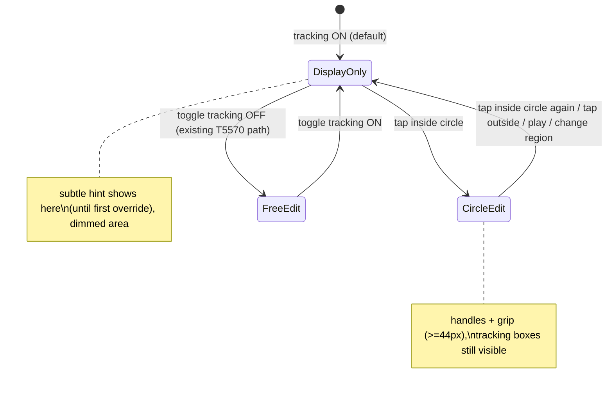

# T5610: Make manual spotlight override discoverable (tap-the-circle to edit + a subtle hint)

**Status:** TODO (UX design below — awaiting user approval before implementation)
**Impact:** 5
**Complexity:** 4
**Created:** 2026-07-20
**Tier:** M (frontend-only, presentational + interaction; no schema/backend/persistence)
**Relates to / evolves:** T5570 (tracking-toggle gates editing; superseded T5390 tap-to-select)

## Problem

Manual override of the spotlight is undiscoverable. Auto player-tracking drives the
circle; when it's wrong, the user must **turn the whole player-tracking layer OFF** (the
Eye/Crosshair toggle) before the circle's edit handles appear — because today
`editable = !showPlayerBoxes` ([OverlayModeView.jsx:261](../../../src/frontend/src/modes/OverlayModeView.jsx#L261)).
Nothing on screen says this, so users don't know they *can* fine-tune the circle at all.

**Current model (grounded in code):**
- Spotlight circle ALWAYS renders (visible with tracking on) — `HighlightOverlay.jsx:245-260`.
- Edit UI (dashed frame + 4 corner resize handles + center 4-arrow move grip, all >=44px from T5570)
  renders ONLY when `editable` (= player boxes OFF) — `HighlightOverlay.jsx:432`.
- Toggle lives as an Eye/EyeOff (timeline: `OverlayTimeline.jsx:96-98`) / Crosshair
  (`OverlayMode.jsx:115-120`) icon in the timeline chrome — easy to miss, and its
  connection to "editing the circle" is not signposted.
- No hint anywhere that manual override exists.

## UX Design

Two additive changes. Neither removes the existing toggle-gate; they make the same
capability reachable and legible.

### 1. Tap the spotlight to edit — even with tracking ON

Introduce an **ephemeral per-region "circle edit" state** (`circleEditActive`, view-state
only, NEVER persisted — it's an editing affordance, not data):

- **Enter:** a tap/click **inside the spotlight circle** reveals the edit controls (dashed
  frame + corner handles + move grip) **without turning off the tracking layer**. Tracking
  boxes stay visible underneath (the user is fine-tuning *relative to* what tracking found).
- **Exit:** tap **inside the circle again** dismisses the controls (back to display-only).
  Also exit on: tapping the video **outside** the circle (deselect), entering play, or
  switching regions — so a stray edit state never lingers.
- Editing is now enabled when **either** path is active:
  `editable = !showPlayerBoxes || circleEditActive`. The toggle-OFF path (T5570) is
  unchanged for power users; tap-the-circle is the discoverable path.

**Hit-priority while tracking is ON (must be unambiguous — this is where T5390 failed):**

| Target of the tap | Result |
|---|---|
| Inside the spotlight circle | Toggle `circleEditActive` (enter/exit edit). Wins over video tap-nav. |
| A player detection box OUTSIDE the circle | Assign that player (existing `handlePlayerSelect`) — unchanged. |
| Anywhere else on the video | Video tap-nav (play/seek) — unchanged; also exits edit if active. |
| A handle / move grip (edit active) | Drag to resize / move — unchanged from T5570. |

While `circleEditActive`, the video tap-nav + long-press-speed handlers YIELD over the
circle (reuse T5570's existing `editable`-gated suppression at
`OverlayModeView.jsx:388-391` — just drive it off the combined `editable`), so a
move/resize drag is never stolen. This is the exact drag-vs-tap-nav lesson from T5570 —
keep that guard, only widen what turns it on.

**Why this is not a T5390 regression:** T5390's tap-to-select was the ONLY way in and was
ambiguous with tap-nav; T5570 replaced it with the toggle. Here the toggle REMAINS the
canonical gate and tap-the-circle is an *additive, explicit* override with a defined
hit-priority + the same drag-guard — discoverability, not a competing selection model.

### 2. A subtle "you can override this" hint

A low-emphasis affordance rendered **in the dimmed tracking-layer area, outside the
spotlight circle** (the darkened region the spotlight already creates — a natural, quiet
canvas that doesn't cover the action):

- **Copy (concise, two paths):** `Tap the spotlight to adjust it — or hide tracking to edit freely`
  (mobile may shorten to `Tap the spotlight to adjust`).
- **Placement:** bottom-center of the video, inside the dimmed zone, clear of the circle
  and of the player boxes; a small pill (`text-xs`, `text-white/70`,
  `bg-black/40 backdrop-blur`, `rounded-full`, low z below the handles). Never overlaps the
  circle or its grip.
- **When it shows:** only when tracking is ON, a spotlight region exists, and the user has
  not yet used manual override in this reel. Fade out (200-300ms) on the first
  `circleEditActive` enter OR first toggle-off — they've learned it.
- **Don't nag:** once dismissed/learned, suppress for the session (ephemeral flag; a
  lightweight `questStore`-style "seen" marker is acceptable since it's a one-time teach,
  but keep it view-state, not reel data). Re-showing every load would be noise.
- **Discoveres BOTH overrides** per the request: the copy names tapping the circle *and*
  hiding the tracking layer, so users learn the toggle exists too.

### States (target)

## Files (likely, for the implementor)

- `src/frontend/src/modes/OverlayModeView.jsx` — combined `editable`, tap-nav yield, hint mount.
- `src/frontend/src/modes/overlay/overlays/HighlightOverlay.jsx` — accept the tap-inside-circle
  toggle; controls already gate on `editable`.
- `src/frontend/src/containers/OverlayContainer.jsx` — own the ephemeral `circleEditActive`
  + "hint seen" view state and the enter/exit transitions.
- A small hint component (new) rendered in the dimmed layer.
- Reuse T5570's handle/grip sizing + `useVideoDisplayRect` screenToVideo hit-testing; reuse
  the existing `editable`-gated tap-nav suppression.

## Acceptance Criteria

- [ ] With tracking ON, tapping inside the circle brings up the edit controls; tapping inside
      again dismisses them; tracking boxes stay visible throughout.
- [ ] Player-box assignment (tap a box outside the circle) and video tap-nav still work; no
      drag is stolen while editing (T5570 guard intact).
- [ ] Toggle-OFF free-edit path unchanged.
- [ ] A subtle hint in the dimmed area names BOTH overrides, shows until first use, then
      fades and stays gone for the session; never overlaps the circle/handles.
- [ ] Desktop + mobile parity; controls/hint don't regress the >=44px touch targets.
- [ ] `circleEditActive` + "hint seen" are ephemeral view state — NO persistence, no reactive write.

## Verification

Pointer/overlay-interaction change -> MUST be verified in a real browser (jsdom gives false
confidence; T5380/T5570 lesson). Use the overlaydiag harness pattern or staging (imankh /
9fa7378c). Unit-test the hit-priority/state machine; real-browser the actual taps + drags on
mobile emulation (coarse pointer) and desktop.

## Classification hint

M-tier, frontend-only, presentational + interaction. No schema/backend/persistence. Needs a
UI-design approval on the exact hint copy/placement (this doc is the proposal) and real-browser
verification. Reviewer for the drag-vs-tap-nav guard.
