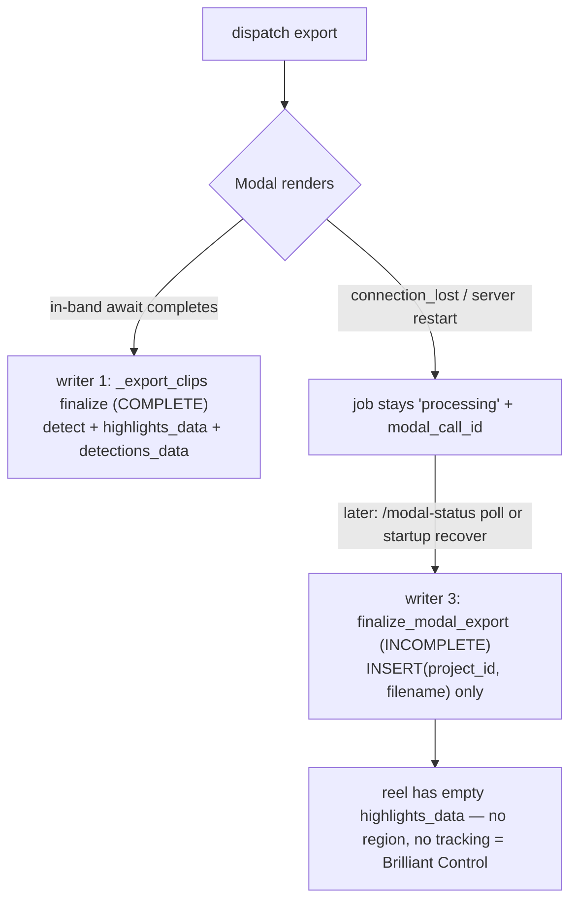
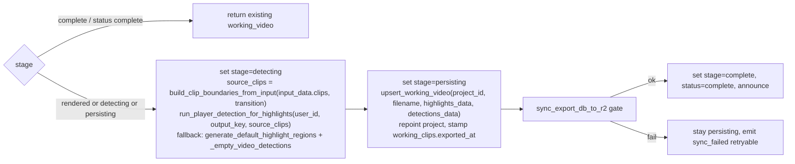

# T5630 — Design: Staged, resumable, unified export finalize (recovery == normal export)

**Tier:** L (backend export-pipeline refactor + profile_db schema + v028 migration; export path is fragile — characterization tests required)
**Status:** DESIGN — awaiting approval before implementation.
**Scope owner:** the multi-clip **render → detect → persist** finalizer (writers 1, 2, 3). Framing carry-forward (writers 4/5) and restore (writer 6) are explicitly OUT of scope.

This design **validates and refines** the architecture already in the task file against the real code. It does not invent a new approach. Where the task's pseudocode diverges from current code (two spots), this doc corrects it to preserve happy-path behavior.

---

## 0. Verification against real code (cited)

Every claim in the task's finalizer table was checked against `src/backend`:

| # | Writer | Location (verified) | Detection | highlights_data | detections_data | Verdict |
|---|--------|---------------------|-----------|-----------------|-----------------|---------|
| 1 | multi_clip Modal branch | `export/multi_clip.py:1427-1447` (detection `:1400`, source_clips `:1397` via `build_clip_boundaries_from_input`) | ✅ `run_player_detection_for_highlights` | ✅ | ✅ | **COMPLETE** (normal Modal) |
| 2 | multi_clip local branch | `export/multi_clip.py:1739-1759` (detection `:1724` via `run_local_detection_on_video_file`, source_clips `:1721` via `build_clip_boundaries_from_durations`) | ✅ local YOLO | ✅ | ❌ (col omitted) | **COMPLETE-ish** |
| 3 | `finalize_modal_export` | `exports.py:188`; the bug INSERT at `:269-272` `INSERT INTO working_videos (project_id, filename)` — no version/duration/highlights/detections | ❌ | ❌ | ❌ | **INCOMPLETE — recovery only** (the bug) |
| 4 | `create_framing_export` | `export/framing.py` INSERT (carry-forward) | ❌ | carries prior | ❌ | **OUT OF SCOPE** |
| 5 | `process_framing_export` | `export_worker.py:323` (carry-forward) | ❌ | carries prior | ❌ | **OUT OF SCOPE** |
| 6 | `restore_project` | `project_archive.py` (faithful archive copy) | — | faithful | faithful | **OUT OF SCOPE** |

**Schema** — `database.py:735-754` `CREATE TABLE IF NOT EXISTS export_jobs`: columns are `id, project_id, type, status, error, input_data(BLOB), output_video_id, output_filename, modal_call_id, created_at, started_at, completed_at, game_id, game_name, acknowledged_at, gpu_seconds, modal_function`. **Confirmed: NO `stage` column, NO `output_key` column.** `input_data` is a msgpack BLOB holding the config needed to rebuild `source_clips`.

**Recovery call sites of writer 3** (all three verified):
- `exports.py:850 check_modal_status` → `finalize_modal_export` at `:908`.
- `exports.py:1056 resume-progress` → `finalize_modal_export` at `:1132`.
- `export_worker.py:407 recover_orphaned_jobs` — does NOT finalize directly; for a completed Modal job it `continue`s (`:461-462`) and lets `/modal-status` finalize; for a no-`modal_call_id` orphan it calls `update_job_error(job_id, "Server restarted during processing")` (`:473`) — the exact origin-bug string.

**Helpers** (signatures verified in `export/multi_clip.py`):
- `run_player_detection_for_highlights(user_id, output_key, source_clips, progress_callback=None, fps=30) -> (regions, video_detections)` (`:746`).
- `build_clip_boundaries_from_input(clips_data, transition=None)` (`:605`) — render-file-independent; the fallback path.
- `build_clip_boundaries_from_durations(...)` (`:561`) — needs actual processed-clip durations (ephemeral, absent at recovery); used only by the local in-band branch.
- `generate_default_highlight_regions(source_clips, fps=30)` (`:657`), `_empty_video_detections(fps=30)` (`:741`).

**Migration head:** `migrations/profile_db/` newest is **`v027_working_video_detections_data.py`** → **T5630 takes `v028_export_job_stages.py`**. NOTE: sibling task T5640 (framing rotation) claims **v029**; T5630 must NOT use v029.

### Two corrections to the task's pseudocode (to prevent happy-path drift)
1. **`fps`:** writer 1 (`:1400-1405`) calls detection WITHOUT an `fps` arg (defaults to 30). The task pseudocode's `fps=input_data.target_fps` would change behavior. **finalize_export must replicate writer 1 exactly — default fps=30, no `input_data.target_fps`.**
2. **Detection fallback:** writer 1 (`:1409-1410`) falls back to `generate_default_highlight_regions(source_clips)` **plus `_empty_video_detections()`** — NOT `None`. The task pseudocode's `video_detections = None` would write a NULL blob where current code writes an empty-detections blob. **finalize_export must use `_empty_video_detections()`.**

---

## 1. Current State

### Divergence (root cause)
Writers 1 and 3 are the *same conceptual step* ("finalize a Modal-rendered export"), but 1 is complete and 3 is a stub. Normal Modal completion finalizes **in-band** inside `_export_clips` (writer 1). `finalize_modal_export` (writer 3) runs ONLY when the in-band await was interrupted (server restart / dropped connection). So **only interrupted Modal exports lose overlay data** — the Brilliant-Control incident.

The pipeline has **no notion of what stage was reached**, so recovery cannot "complete only the missing work" — it just writes a minimal row and calls it done.



### Why recovery can't extract detection
`modal_result` carries only the render (`{status, output_key, clips_processed, gpu_seconds, modal_function}`). Detection is a **separate** Modal fn the backend runs after render (`run_player_detection_for_highlights`). So recovery must **re-run detection**, not read it from the result. It has everything it needs: `input_data` (already stored) + the render's `output_key`.

---

## 2. Target State

Two coupled changes.

### (A) Durable per-stage checkpoints on `export_jobs`
Add a `stage` column and persist the render output as soon as it exists, so any interruption leaves a truthful record:

```
queued → rendering → rendered → detecting → persisting → complete    (| error)
```

- **`rendering`** — dispatched, `modal_call_id` stored (the existing `store_modal_call_id` callback already marks this moment).
- **`rendered`** — the video exists in R2; **persist `output_key` here** (new column) so finalize no longer depends on Modal being reachable.
- **`detecting` / `persisting` / `complete`** — the post-render stages owned by the unified finalizer.

Each transition is a small durable UPDATE. A restart at any point leaves `stage` at the last *completed* step.

> **Refinement vs task:** the task listed a 7th stage `synced` (between `persisting` and `complete`). We **drop `synced`**. Rationale: a crash between R2-sync and announce re-runs finalize, which is idempotent (working_video already exists → early return), so `synced-but-not-complete` is never a state we branch on differently. Keeping it would persist an unactionable checkpoint. The sync stays as a **gate** between `persisting` and `complete` (sync-then-announce, invariant #1), not a persisted stage. See §4 Q2.

### (B) ONE unified, resumable, idempotent finalize (Modal path)
Extract two functions:

- **`upsert_working_video(...)`** — the shared idempotent *persist transaction* (INSERT/UPDATE `working_videos` → repoint `projects.working_video_id` → complete `export_jobs` → stamp `working_clips.exported_at` + `raw_clip_version`). Used by writers 1, 2, AND recovery.
- **`finalize_export(job, output_key, user_id)`** — the Modal *detect → persist → sync* orchestrator, resumable by `stage`. Used by writer 1 in-band AND recovery (collapsing writer 3).



**Boundary (explicit):**
- `finalize_export` is the **Modal** detect path (detect from `output_key`). Recovery only ever hits Modal jobs (a local export has no `modal_call_id` → `recover_orphaned_jobs` marks it error, never re-finalizes), so the resumable orchestrator does not need a local detect variant.
- **Writer 2 (local in-band)** keeps its own `build_clip_boundaries_from_durations` + `run_local_detection_on_video_file` (they need the ephemeral processed clips, which exist in-band), then calls the **same `upsert_working_video`**. It shares the persist transaction but not the Modal detect step.
- Writers 4/5/6 are untouched.

### Target pseudocode (corrected)
```pseudo
def finalize_export(job, output_key, user_id):
    if job.stage == 'complete' or job.status == 'complete':      # idempotency, generalizes exports.py:242-255
        return existing_working_video_id(job)

    set_stage(job, 'detecting')
    input_ = decode(job.input_data)
    source_clips = build_clip_boundaries_from_input(input_.clips, input_.transition)
    try:
        regions, video_detections = run_player_detection_for_highlights(
            user_id, output_key, source_clips)                    # fps defaults to 30 — DO NOT pass input.target_fps
    except Exception:
        regions, video_detections = generate_default_highlight_regions(source_clips), _empty_video_detections()

    set_stage(job, 'persisting')
    wv_id = upsert_working_video(job, filename=output_key.split('/')[-1],
                                 highlights_data=encode(regions),
                                 detections_data=encode(video_detections))  # insert-once-per-job
    # upsert also: repoint project.working_video_id, stamp working_clips.exported_at, complete export_jobs

    if not sync_export_db_to_r2(user_id, profile_id):             # invariant #1 gate
        emit sync_failed (retryable); return                     # stay at 'persisting'
    set_stage(job, 'complete'); job.status = 'complete'; announce()
    return wv_id
```

---

## 3. Implementation Plan

### (a) Schema — profile_db (`database.py:735` + migration)
- Add to `CREATE TABLE IF NOT EXISTS export_jobs` (fresh DBs): `stage TEXT DEFAULT 'queued'`, `output_key TEXT`.
- **Migration `migrations/profile_db/v028_export_job_stages.py`** (Migration agent, after Implementor changes schema). ALTER TABLE add both columns; idempotent; **tuple-row-factory safe** (`up(conn)` gets tuples, index positionally — backend-services landmine). Backfill `stage`:
  - `status='complete'` → `stage='complete'`
  - `status='error'` → leave (`error` handled separately; `stage` stays default)
  - `status IN ('pending','processing')` → best-effort infer: `output_video_id` set ⇒ `'persisting'`; else `modal_call_id` set ⇒ `'rendering'`; else `'queued'`
  - `output_key` stays NULL for all existing rows (recovery falls back to `modal_result.output_key`).
- Runs manually post-deploy (`POST /api/admin/migrate`) — versioned migrations do NOT auto-run.

### (b) `upsert_working_video` — shared idempotent persist
Home it beside the detection helpers (`export/multi_clip.py`) or a new `services/export_finalize.py`; both `_export_clips` branches and recovery must reach it. Contract in §Idempotency below. Encapsulates the finalize transaction (`working_videos` insert/update → repoint project → complete job → stamp `exported_at`/`raw_clip_version`). Local branch passes `detections_data=None` (preserving writer 2's omission); Modal passes both.

### (c) `finalize_export` — Modal detect→persist→sync orchestrator
New shared function per §2 pseudocode. Move the detect+persist block out of writer 1's tail into it; `_export_clips` calls it in-band. Reimplement `finalize_modal_export` as a thin adapter: `(job, modal_result, user_id) → finalize_export(job, output_key=persisted_or_modal_result_key, user_id)`.

### (d) Stage checkpoints wired through `_export_clips`
- `rendering` at dispatch (reuse `store_modal_call_id` callback).
- `rendered` + **persist `output_key`** immediately after `call_modal_clips_ai` returns success (before detection).
- Delegate `detecting → persisting → complete` to `finalize_export`.
- Local branch: set `rendered` after concat+upload, then persist via `upsert_working_video` (may set `rendering`/`rendered` for truthfulness; no resume path needed).

### (e) Recovery resumes by stage
- `exports.py:908` (check_modal_status), `exports.py:1132` (resume-progress): replace the `finalize_modal_export(job, result, user_id)` call semantics — the function now delegates to `finalize_export`. Read persisted `stage` + `output_key`; if `output_key` is NULL (pre-v028 job) fall back to `modal_result.output_key` (writer 3's existing `if not output_key → error` guard is preserved for the truly-empty case).
- `export_worker.py:407 recover_orphaned_jobs`: **unchanged** — it already delegates completed Modal jobs to `/modal-status`. No direct finalize there.
- `cleanup_stale_exports` (`exports.py:354`): unchanged; may optionally reason over `stage` but not required.

### (f) Delete writer 3's inline INSERT
After (c)+(e) land, the minimal `INSERT INTO working_videos (project_id, filename)` at `exports.py:269-272` is dead → delete it. `finalize_modal_export` becomes the adapter only.

### Idempotency contract (`upsert_working_video`, keyed on `(project_id, version)`)
- `finalize_export` early-returns when `stage=='complete'` OR `status=='complete'` (generalizes the existing guard at `exports.py:242-255`) → returns existing `output_video_id`. No duplicate row.
- Today writers 1/2/3 always `INSERT` a new `MAX(version)+1` row. Problem: a job that crashed *after* INSERT but *before* `stage='complete'` would INSERT a **second** row on resume. Fix: **one working_video per job.** `upsert_working_video` checks `job.output_video_id`:
  - if set AND the `working_videos` row still exists → **UPDATE** that row's `highlights_data`/`detections_data`/`duration` in place (same `version`);
  - else → **INSERT** `MAX(version)+1`, and write the new id back onto `export_jobs.output_video_id` (so a later resume finds it).
- There is **no UNIQUE constraint** on `(project_id, version)` (invariant #5 — coexisting versions are by design), so idempotency is enforced via the `job.output_video_id` back-reference, not a DB constraint. `(project_id, version)` is the *logical* key.
- Detection re-run on resume is safe: it is a pure function of `(output_key video, source_clips)`.

### Strangler-fig sequence (explicit ordering — each a reviewable unit <200 lines)
Code motion never mixes with behavior change in one commit (refactor rule 3). Order:

1. **Characterization tests FIRST** (Tester Phase 1, RED→GREEN pin of *current* behavior). Snapshot DB deltas for:
   (a) local export (`MODAL_ENABLED=false`) — `working_videos` non-empty `highlights_data`, `detections_data` omitted, `projects.working_video_id`, `export_jobs.status='complete'`, `working_clips.exported_at`;
   (b) Modal export (mock `call.get` success + mock detection) — same plus `detections_data` populated;
   (c) **current recovery** via `finalize_modal_export` — pin the BUGGY minimal row (empty highlights), which step 6 will intentionally flip to complete.
2. **Schema + v028** (add columns, backfill). No behavior change — columns unused. Tests stay green.
3. **Build `upsert_working_video` + `finalize_export`** as NEW functions, not yet wired. Unit-test in isolation. (Mechanical — no caller change.)
4. **Route writer 1 (Modal in-band) through `finalize_export`** + wire `rendering`/`rendered`/`output_key` checkpoints in `_export_clips`. Characterization test (b) must stay green (no drift — see §0 fps/`_empty_video_detections`). *The first flip.*
5. **Route writer 2 (local in-band) through `upsert_working_video`** (persist only; keep local detection). Test (a) stays green.
6. **Flip recovery:** `finalize_modal_export` → `finalize_export` at both call sites (`:908`, `:1132`). Recovery characterization test (c) now asserts **complete** (highlights populated) — the intended fix.
7. **Delete writer 3's inline INSERT** (`exports.py:269-272`) — now dead.

---

## 4. Risks & Open Questions

### Risks
| Risk | Mitigation |
|------|------------|
| **No golden/characterization net over this pipeline** (export-pipeline.md testing-seam note; T4370 harness not yet landed). | Step 1: write characterization tests pinning CURRENT complete-path DB deltas (local + Modal) before any extraction. Strangler-fig, not big-bang. |
| **Happy-path drift** from the two pseudocode divergences (fps, `None` vs `_empty_video_detections`). | §0 corrections are binding: fps defaults to 30 (no `input_data.target_fps`), fallback uses `_empty_video_detections()`. Characterization test (b) catches drift. |
| Detection at recovery = a Modal GPU run (cost/latency). | Acceptable — it is exactly what a normal export does. Fallback to default region so recovery never hard-fails / never blank. |
| `upsert_working_video` idempotency — today every finalize INSERTs a new version. | Insert-once-per-job via `job.output_video_id` back-reference (contract above). Coexisting versions from re-export stay legal (invariant #5). |
| Local `_from_durations` needs ephemeral processed clips absent at recovery. | Recovery uses only the Modal path (`build_clip_boundaries_from_input`, render-file-independent). Local in-band keeps `_from_durations`; not a recovery concern. |
| Deploy→migrate window: hot paths read `stage`/`output_key` before v028 runs. | Reads tolerate missing columns as `stage='queued'` / `output_key=NULL`; recovery falls back to `modal_result.output_key`. Migrate immediately post-deploy. |
| Writers 4/5 (framing carry-forward) + 6 (restore) share `working_videos`. | OUT of scope; do NOT change carry-forward/restore semantics. `finalize_export`/`upsert_working_video` are only for the multi-clip finalizer. Local branch's `detections_data=None` preserves writer 2's current shape. |

### Open questions — RESOLVED

**Q1. Persist `output_key` as a NEW column vs. reuse `output_filename` early?**
→ **NEW column `output_key`.** `output_filename` is the *basename* (`working_X.mp4`), set at persist and read as a completion signal (e.g. `finalize_modal_export`'s idempotency check reads `output_filename` at `exports.py:244`). `output_key` is the *full R2 key* (`working_videos/working_X.mp4`) needed by `run_player_detection_for_highlights` BEFORE persist. Setting `output_filename` early would (a) make a still-`processing` job look partly finalized to those readers, and (b) conflate key vs basename. One nullable TEXT column buys clean stage semantics and zero reader confusion. **Agree with task.**

**Q2. Full ordered `stage` enum vs. a minimal `render_done`/`detect_done` pair?**
→ **Ordered enum, but 6 states not 7** — `queued → rendering → rendered → detecting → persisting → complete` (`+ error`). Ordered is human-legible, extensible, and mirrors the pipeline; a boolean pair loses the render-in-flight vs render-done distinction that recovery branches on (`rendering` = Modal maybe still running, `output_key` not yet persisted → fall back to `modal_result`; `rendered` = `output_key` persisted → finalize offline). **Refinement:** drop the task's `synced` — sync stays a gate between `persisting` and `complete`, not a persisted checkpoint, because re-finalize past persist is idempotent and we never branch on `synced`. **Agree with task's enum choice, minus one state.**

**Q3. Should the export panel SHOW the persisted stage?**
→ **No UI in T5630** (live progress stays WS/`export_progress`-driven as today). **Disposition:** the `stage` column is a backend recovery mechanism; do not build UI now. Low-cost hook for later: include `stage` in the job JSON already returned by `check_modal_status` / active-jobs endpoints (it is just another column on the row) so a future "Detecting players…" durable panel can read it with zero backend rework. Recommend adding `stage` to those payloads (free), building UI later. **Agree with task (out of scope), with the free payload hook.**

---

## 5. Acceptance Criteria (unchanged from task; restated for the gate)
- Interrupted-by-restart export recovers into the SAME persisted state as an uninterrupted one: non-empty `highlights_data` with a region, `detections_data` populated when detection ran (empty-detections blob if it fell back). Reproduce the Brilliant-Control scenario in a test.
- In-band finalize and recovery finalize call ONE shared `finalize_export`; writer 3's inline INSERT deleted.
- `export_jobs.stage` truthfully reflects progress; a resumed job re-runs ONLY the missing stages (never re-renders).
- Idempotent: re-finalizing a complete job is a no-op (no duplicate `working_video`); resuming a `detecting`/`persisting` job completes it once.
- Characterization tests pin normal local + Modal export output unchanged (no happy-path regression).
- v028 backfills existing jobs' `stage`; documented as manual post-deploy.

---

## 6. Agents & Testing
- **Migration** — writes `v028_export_job_stages.py` (ALTER + idempotent, tuple-row-factory-safe backfill) after the Implementor edits `database.py`. (v029 is reserved for sibling T5640 — do not use.)
- **Tester** — characterization tests FIRST (§3 step 1); then: interrupted→recovered == uninterrupted; stage-resume skips render; idempotent re-finalize (no duplicate row); default-region fallback when detection fails.
- **Reviewer** — L-tier; focus on strangler-fig safety (no happy-path drift on the two fidelity points), `upsert_working_video` insert-once-per-job, and the deploy→migrate window.

## Knowledge docs to update at Stage 7
`.claude/knowledge/export-pipeline.md` (primary — add the staged-finalize model; note writers 1+3 collapsed into `finalize_export`, writer 2 shares `upsert_working_video`), `modal-gpu.md`, `backend-services.md`, `persistence-sync.md`.
