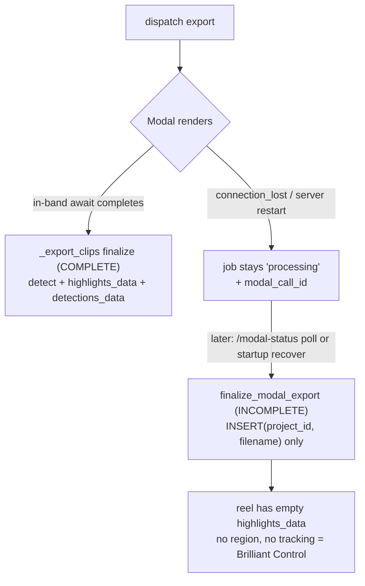

# T5630: Staged, resumable, unified export finalize (recovery == normal export)

**Status:** TODO — architecture below; **design-gated** (Architect approval before implementation)
**Impact:** 5
**Complexity:** 8
**Created:** 2026-07-20
**Tier:** L (backend export-pipeline refactor + profile_db schema + migration; export path is fragile — characterization tests required)
**Origin:** Brilliant Control (proj 31) shipped with empty overlay data. Root cause: its export was interrupted by a server restart ("Server restarted during processing") and finalized via the **recovery-only** `finalize_modal_export`, which records the video but skips detection + never writes `highlights_data`. A normal (uninterrupted) export builds full overlay data. The two finalize paths diverged, and the pipeline has no notion of *what stage was reached*, so recovery can't complete only the missing work.

## Goal (user framing)
> "It would be good if our pipeline ascertained what was done versus what was still needed to be done."

Make the export pipeline **checkpoint each stage** so recovery **resumes only the missing stages**, and **unify** the in-band and recovery finalizers into ONE code path — so a restart-interrupted export recovers into the *same* state as an uninterrupted one. Recovery stops being a lossy shortcut.

---

## 1. Current State

### Finalization writers (audited — do NOT re-derive)
| # | Path | Detection? | highlights_data | detections_data | Verdict |
|---|------|-----------|-----------------|-----------------|---------|
| 1 | `multi_clip.py:_export_clips` Modal branch INSERT `1427-1447` | ✅ `run_player_detection_for_highlights` (1400) | ✅ | ✅ | **COMPLETE** (normal Modal) |
| 2 | `multi_clip.py:_export_clips` local branch INSERT `1739-1759` | ✅ `run_local_detection_on_video_file` (1724) | ✅ | ❌ (col omitted; regions carry embedded detections) | **COMPLETE-ish** |
| 3 | `exports.py:finalize_modal_export` INSERT `269-272` | ❌ | ❌ | ❌ | **INCOMPLETE — recovery only** (the bug) |
| 4 | `framing.py:create_framing_export` INSERT `253` | ❌ | carries prior forward | ❌ | carry-forward (framing never generates highlights) |
| 5 | `export_worker.py:process_framing_export` INSERT `323` | ❌ | carries prior forward | ❌ | carry-forward |
| 6 | `project_archive.py:restore_project` INSERT `261` | — | faithful archive copy | faithful | restore |

**The divergence:** writers 1 & 3 are the same conceptual step ("finalize a Modal-rendered export") but 1 is complete and 3 is a minimal stub. Normal Modal completion finalizes **in-band** inside `_export_clips` (writer 1). `finalize_modal_export` (writer 3) runs ONLY on recovery — so **only interrupted exports lose overlay data**, not all Modal exports.

### export_jobs schema (profile_db — `database.py ensure_database` ~735)
`id, project_id, type, status(pending|processing|complete|error), error, input_data(msgpack config), output_video_id, output_filename, modal_call_id, created_at, started_at, completed_at, game_id, game_name, acknowledged_at, gpu_seconds, modal_function`.
**No stage/phase column. `output_key` is NOT persisted** (only present in `modal_result` at poll time). `input_data` holds the config needed to rebuild `source_clips`.

### What routes to the incomplete recovery path
`call_modal_clips_ai` returns `{status:'connection_lost'}` (server restart / dropped conn) → `_export_clips` returns `"processing"` and **skips its own finalize** → job sits `processing` with a `modal_call_id` → later a `/modal-status` poll (page load) or `recover_orphaned_jobs` (startup) sees Modal finished and calls `finalize_modal_export` (exports.py `908`, `1132`).



### modal_result carries only the render
`{status:'success', output_key, clips_processed, ...}` + `gpu_seconds`/`modal_function`. **No detection/highlight data** — detection is a *separate* Modal fn (`detect_players_batch`) the backend runs after render. So recovery must **run detection**, not extract it.

---

## 2. Target State

Two changes, together:

### (A) Per-stage checkpoints — "what's done vs needed"
Add a durable `stage` to `export_jobs` and persist the render output as soon as it exists, so any interruption leaves a truthful record:

```
queued -> rendering -> rendered -> detecting -> persisting -> synced -> complete   (| error)
```

- `rendered`: the video exists in R2 — **persist `output_key`** at this point (new column) so finalize no longer depends on Modal being reachable.
- Each transition is a small durable UPDATE. A restart at any point leaves `stage` at the last *completed* step.
- `input_data` (already stored) + persisted `output_key` = everything detection needs.

### (B) ONE unified finalize, resumable + idempotent
Extract `finalize_export(job, output_key, user_id)` used by BOTH the in-band path and recovery. It runs the post-render stages, each **skipped if already done** (read `stage`):

```mermaid
flowchart LR
  S{stage?} -->|>= complete| NOOP[return existing working_video]
  S -->|rendered| DET[detect: build source_clips from input_data<br/>run_player_detection_for_highlights(output_key)<br/>fallback generate_default_highlight_regions]
  DET --> PERSIST[persist: upsert working_videos<br/>highlights_data + detections_data<br/>project.working_video_id, working_clips.exported_at]
  PERSIST --> SYNC[R2 sync gate] --> DONE[stage=complete, status=complete, announce]
```

- **Recovery calls the same `finalize_export`** — with the persisted `output_key` (or, transitionally, the one from `modal_result`). So writer 1 and writer 3 collapse into one; recovery is complete by construction.
- **Detection inputs reconstructable:** decode `job['input_data']` → `build_clip_boundaries_from_input` (render-file-independent — the local `_from_durations` path needs ephemeral processed clips and is NOT used at recovery) → `run_player_detection_for_highlights(user_id, output_key, source_clips, fps=input_data.target_fps)`. Fallback to `generate_default_highlight_regions(source_clips)` so a reel is NEVER blank.

### Pseudocode
```pseudo
def finalize_export(job, output_key, user_id):
    if job.stage == 'complete' or job.status == 'complete':      # idempotency (existing guard, generalized)
        return existing_working_video(job)
    set_stage(job, 'detecting')
    source_clips = build_clip_boundaries_from_input(decode(job.input_data).clips, transition)
    try:
        regions, video_detections = run_player_detection_for_highlights(user_id, output_key, source_clips, fps)
    except Exception:
        regions, video_detections = generate_default_highlight_regions(source_clips), None   # never blank
    set_stage(job, 'persisting')
    wv_id = upsert_working_video(job.project_id, output_key.filename,
                                 highlights_data=encode(regions),
                                 detections_data=encode(video_detections))   # idempotent on (project_id, version)
    projects.working_video_id = wv_id ; mark working_clips.exported_at
    set_stage(job, 'synced'); durable_r2_sync()
    set_stage(job, 'complete'); job.status='complete'; announce()
    return wv_id
```

---

## 3. Implementation Plan

### (a) Schema — profile_db
- `export_jobs.stage TEXT DEFAULT 'queued'` and `export_jobs.output_key TEXT` — `database.py ensure_database` (~735) for fresh DBs.
- Migration `migrations/profile_db/vNNN_export_job_stages.py` (next after **v027** → **v028**; confirm head). Backfill: `status='complete'` → `stage='complete'`; `status='error'` → leave; `status IN ('pending','processing')` → best-effort infer (`output_video_id` set ⇒ `persisting`; `modal_call_id` set ⇒ `rendering`; else `queued`). Tuple-row-factory safe (backend-services landmine). Migration agent writes it after schema change.

### (b) `finalize_export` — new shared function
Home it where both callers reach it (e.g. `services/export_finalize.py` or in `multi_clip.py` beside the detection helpers). Move the detection+persist block out of `_export_clips` (writers 1 & 2 tail) into it; have `_export_clips` call it in-band. Reimplement `finalize_modal_export` to call it. This is a **strangler-fig**: build `finalize_export`, route the in-band path through it behind characterization tests, then flip recovery to it, then delete writer 3's inline INSERT.

### (c) Stage checkpoints wired through the pipeline
`_export_clips`: set `rendering` at dispatch, `rendered` + persist `output_key` right after `call_modal_clips_ai`/local concat, then delegate to `finalize_export` (which owns `detecting→…→complete`). `store_modal_call_id` callback already exists for `rendering`.

### (d) Recovery resumes by stage
`exports.py check_modal_status` (908) / `resume-progress` (1132) / `export_worker.recover_orphaned_jobs` (407): instead of the minimal INSERT, read `stage` + persisted `output_key` and call `finalize_export`. If `output_key` is unpersisted (old job) fall back to `modal_result.output_key`. `cleanup_stale_exports` unchanged except it reasons over `stage`.

### (e) Idempotency
- `finalize_export` early-returns on `stage=='complete'` (generalizes the existing `status=='complete'` guard, exports.py 242-255).
- `upsert_working_video` keyed on `(project_id, version)` so a re-run doesn't duplicate rows (today it always INSERTs a new version — must become idempotent for the same job, e.g. reuse `output_video_id` if the row already exists).
- Detection re-run on resume is safe (pure function of the video + source_clips).

---

## 4. Risks & Open Questions
| Risk | Mitigation |
|------|------------|
| **Export path has NO golden/characterization tests** (export-pipeline.md landmine). Refactoring finalize is high-risk. | Write characterization tests pinning the CURRENT complete-path output (`highlights_data`/`detections_data`/project/job rows) for a local + a Modal export BEFORE extracting `finalize_export`. Strangler-fig, not big-bang. |
| Detection at recovery = a Modal GPU run (cost/latency). | Acceptable — it's exactly what a normal export does. Fallback to default region if Modal unavailable, so recovery never hard-fails. |
| `upsert_working_video` idempotency — today every finalize INSERTs a new version. | Make finalize reuse the job's `output_video_id` row if present; only INSERT once per job. Define version semantics for resumed jobs. |
| Local `_from_durations` needs ephemeral processed clips absent at recovery. | Recovery standardizes on `build_clip_boundaries_from_input` (render-file-independent). Confirm it reproduces the same boundaries as `_from_durations` within tolerance. |
| Deploy→migrate window (v028 columns read by hot paths). | Migrate immediately post-deploy (`POST /api/admin/migrate`); reads tolerate missing `stage`/`output_key` as `queued`/NULL during the window. |
| Writers 4/5 (framing carry-forward) + 6 (restore) are out of scope but share `working_videos`. | Do NOT change carry-forward semantics; `finalize_export` is only for the multi-clip render→detect→persist finalizer. State this boundary explicitly. |

**Open questions for approval:**
- [ ] Persist `output_key` as a new column vs. set `output_filename` early — recommend a distinct `output_key` (clean stage semantics).
- [ ] Full stage enum vs. a minimal `render_done`/`detect_done` pair — recommend the ordered `stage` enum (extensible, human-legible in the export panel).
- [ ] Should the export panel SHOW the stage (progress: "Detecting players…" persisted, not just ephemeral WS)? Nice-to-have, out of scope unless wanted.

---

## 5. Acceptance Criteria
- [ ] An export interrupted by a server restart recovers into the SAME persisted state as an uninterrupted one: non-empty `highlights_data` with a region, `detections_data` populated when detection ran (or a default region if not). (Reproduce the Brilliant-Control scenario in a test.)
- [ ] In-band finalize and recovery finalize call ONE shared `finalize_export`; writer 3's inline INSERT is deleted.
- [ ] `export_jobs.stage` truthfully reflects progress; a resumed job re-runs ONLY the missing stages (does not re-render).
- [ ] Idempotent: re-finalizing a complete job is a no-op (no duplicate working_video); resuming a `detecting`/`persisting` job completes it once.
- [ ] Characterization tests pin the normal local + Modal export output unchanged (no happy-path regression).
- [ ] v028 migration backfills existing jobs' `stage`; documented that it runs manually post-deploy.

## 6. Agents & Testing
- **Architect** — approve this architecture (design gate) before implementation.
- **Migration** — `v028_export_job_stages.py` (ALTER + idempotent, tuple-row-factory-safe backfill).
- **Tester** — characterization tests FIRST (pin current finalize output); then: interrupted→recovered == uninterrupted; stage resume skips render; idempotent re-finalize; default-region fallback when detection fails.
- **Reviewer** — L-tier; focus on the strangler-fig safety (no happy-path drift), upsert idempotency, and the deploy→migrate window.

## Knowledge docs
`.claude/knowledge/export-pipeline.md` (primary — update at Stage 7 with the staged-finalize model), `modal-gpu.md`, `backend-services.md`, `persistence-sync.md`.
