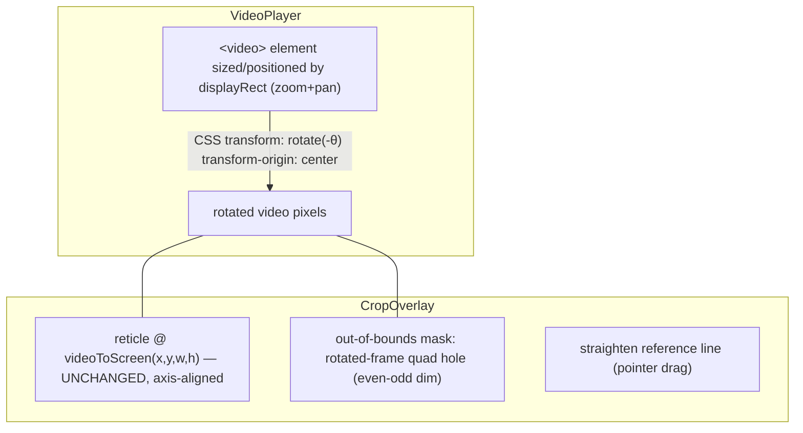

# T5640 — Framing Rotation / Horizon Straighten — Design

**Status:** DESIGN (awaiting user approval — L-tier design gate)
**Author:** Architect agent
**Task:** [T5640-framing-rotation-horizon-straighten.md](T5640-framing-rotation-horizon-straighten.md)
**Domain doc:** [.claude/knowledge/keyframes-framing.md](../../../.claude/knowledge/keyframes-framing.md)

---

## 0. TL;DR of Locked Decisions

| # | Decision | Choice | Rationale (short) |
|---|----------|--------|-------------------|
| 1 | Coordinate space | **(a)** crop coords live in the **rotated** frame space; rotation is an outer transform applied FIRST everywhere (`rotate` → `crop`; `warpAffine` → slice; CSS `rotate` on the video element + unmodified reticle) | Reuses the two existing render primitives with zero new sampling logic; keeps existing `crop_data` semantics byte-identical at θ=0; no crop-keyframe migration. |
| 2 | Safe-area clamp | Closed-form `rotatedRectWithMaxArea(W,H,θ)` ∩ aspect `r`, centered; clamp applied on **set-rotation** AND on **crop-drag while θ≠0**; single shared helper mirrored FE/BE | Deterministic function of (θ,W,H,r); guarantees no black corners; DRY. |
| 3 | Schema unit | **degrees** (`working_clips.rotation REAL DEFAULT 0`), convert to radians only at the ffmpeg boundary | Human-legible in the DB; cv2 + CSS both take degrees natively; only ffmpeg `rotate=a=` wants rad. |
| 4 | Persistence | single surgical `set_rotation` action (`{rotation: deg}`); straighten-drag-end / dial-commit / nudge / reset each fire ONE action; NO reactive `useEffect`; full-state PUT also carries `rotation` | Matches project-wide gesture-based surgical rule; rotation is a clip scalar, not threaded into the keyframe list. |
| 5 | Migration | **`v029_working_clips_rotation.py`** (profile_db). Head is **v027**; sibling **T5630 = v028** lands first → **T5640 = v029** | Sequential version numbering; only additive `ALTER TABLE … ADD COLUMN rotation REAL DEFAULT 0`. |

---

## 1. Current State Analysis

### 1.1 Architecture (crop today, θ implicitly 0)

```mermaid
flowchart LR
    subgraph FE[Frontend]
      CO[CropOverlay drag] -->|screenToVideo delta| FC[FramingContainer.handleCropComplete L315]
      FC -->|resolveTargetFrame + addOrUpdateKeyframe| UC[useCrop / keyframeController]
      FC -->|persistKeyframeEdit surgical| FA[framingActions.addCropKeyframe]
      UC -->|interpolateCrop x,y,w,h| RET[reticle via useVideoDisplayRect.videoToScreen]
    end
    FA -->|POST /clips/{id}/actions| BA[clips.framing_action L327]
    BA -->|RMW crop_data blob| DB[(working_clips.crop_data msgpack)]
    DB --> EXP[export]
    subgraph EXP[Export]
      MC[multi_clip._export_clips L1223] -->|cv2 warp? NO| CV[frame\[y:y+h, x:x+w\] video_processing L1361/1734/1962/2598]
      FR[framing.py /api/framing L101] -->|ffmpeg crop expr| GCF[interpolation.generate_crop_filter L188]
    end
```

### 1.2 Key facts verified in code

- **`useVideoDisplayRect`** (`src/frontend/src/hooks/useVideoDisplayRect.js`) is the SSOT video↔screen transform (T4550). `computeVideoDisplayRect` (L34-73) returns a centered aspect-fit rect with `{offsetX,offsetY,width,height,scaleX,scaleY,zoom,panOffset}`. `videoToScreenRect` (L80-88) is a pure affine `x*scaleX+offsetX`; `screenToVideoRect` (L91-99) the inverse. **No rotation today.** Rotation will NOT be threaded into this hook (see §2.2 — rotation is a CSS transform on the video element; the reticle stays axis-aligned).
- **`useCrop`** (`src/frontend/src/modes/framing/hooks/useCrop.js`) owns `aspectRatio` (L65), `framerate` (L66), `calculateDefaultCrop` (L83-125), `defaultCropData` memo (L293-296), and the keyframe controller. It is seeded from `savedKeyframes` (L173-186). It is the natural home for `rotation` state + the safe-area clamp (it already has W/H + aspect).
- **`FramingContainer.handleCropComplete`** (L315-373) is the gesture pattern to mirror: optimistic hook + store update, `persistKeyframeEdit` surgical call, rollback on error, `resolveTargetFrame` before persist.
- **`framingActions.js`** — every action is `sendAction(projectId, clipId, action, target, data)` → `POST /api/clips/projects/{pid}/clips/{cid}/actions` (L24-48). Mirror this for `setRotation`.
- **Backend `framing_action`** (`clips.py:327`) reads via `_get_clip_framing_data` (L268-287, returns crop_keyframes + segments_data + clip row) and writes via `_save_clip_framing_data` (L290-310, in-place `UPDATE crop_data,segments_data`, no version bump). `FramingActionData` model (L228-245) is the payload schema; `WorkingClipUpdate` (L209-213) is the PUT model.
- **Full-state PUT** `update_working_clip` (`clips.py:2074-2197`): version-INSERT column list at L2137-2159 (`crop_data,timing_data,segments_data,raw_clip_version,width,height,fps` carried forward); in-place UPDATE builder at L2173-2194; `is_framing_change` gate L2105-2109.
- **Export crop sites:**
  - **Primary (real reel export) = cv2/numpy**, NOT ffmpeg. `video_processing.py` slices `frame[y:y+h, x:x+w]` at **4 sites: L1361, L1734, L1962, L2598**, after `_interpolate_crop` (L1117-1147) and after clamping x/y/w/h to canvas bounds (L1350-1359). This is where `cv2.warpAffine` must be inserted **before** the slice.
  - **Secondary = ffmpeg expression** path: `framing.py /api/framing` (L101) builds `crop=` via `interpolation.generate_crop_filter` (L188-214, linear expr). A `rotate` filter must be prepended at the `ffmpeg.filter` call site (L106), NOT inside `generate_crop_filter` (keep it pure).
  - Multi-clip payload assembled at `multi_clip.py:1223-1232` (`clips_data` dicts) and normalized for Modal at L1316-1326 (`normalized_clips_data`). Per-clip `rotation` is threaded here.
- **Schema:** `working_clips` (`database.py:612-630`) has `crop_data,timing_data,segments_data,width,height,fps` — add `rotation REAL DEFAULT 0`. Migration head **v027** (`v027_working_video_detections_data.py`); pattern in `v024_add_poster_filename.py` (idempotent `PRAGMA table_info` guard + `ALTER TABLE ADD COLUMN`).

### 1.3 Code smells / risks in the touched area

| Smell | Location | Impact on this task |
|-------|----------|---------------------|
| 4× duplicated cv2 crop loops | `video_processing.py` L1361/1734/1962/2598 | Rotation insert must be applied 4×; extract a `rotate_then_crop(frame, θ, crop)` helper to stay DRY. |
| cv2 clamps to **canvas** not to rotated content (L1350-1359) | `video_processing.py` | Post-rotation the canvas corners are black; a canvas-clamped crop could still bleed black → the safe-area clamp (client SSOT) must hold, pinned by a characterization test. |
| Two export crop paths (cv2 + ffmpeg expr) already diverge (Catmull-Rom vs linear — see domain doc T4420) | video_processing vs interpolation | Rotation must be added to BOTH or the ffmpeg path silently ignores θ. |
| `fps || 30` fallback landscape | multiple (domain doc) | Not introduced here; do not add new fps fallbacks. |

---

## 2. Target Architecture

### 2.1 The coordinate-space decision (core)

**Chosen: Option (a) — crop coords in the ROTATED frame space; rotation is an outer transform applied first, with output canvas kept at the source W×H.**

Everywhere, the render is exactly:

```
render(frame) = crop_{x,y,w,h}( rotate_θ_aboutCenter_sameWH( frame ) )
```

- **Invariant that makes (a) safe:** rotation is **about the frame center** and the **output size equals the input size (W×H)**. Rotating a W×H image about its center inside a W×H canvas preserves the coordinate box: a rotated-frame coordinate `(x,y)` maps to screen/canvas the SAME linear way as today. Therefore existing `crop_data` keeps identical meaning, and **θ=0 is byte-identical to current behavior** (rotate is identity → no migration of crop keyframes).
- **Why not (b):** (b) stores crop in original space and samples a *rotated quad*, which needs a perspective/affine ROI sample — new sampling code on both sides and a real risk of FE/BE drift. (a) reuses `ffmpeg rotate,crop` and `cv2.warpAffine → slice` verbatim.

**Sign convention (pinned — this is the #1 drift risk):**

- `θ` = the **content correction angle in degrees**, positive = rotate content **counter-clockwise** (standard math orientation, y-up). Stored in `working_clips.rotation`.
- **cv2:** `M = cv2.getRotationMatrix2D(center=(W/2, H/2), angle=θ, scale=1.0)` — cv2 positive angle is counter-clockwise. `rotated = cv2.warpAffine(frame, M, (W, H), flags=INTER_LANCZOS4, borderValue=(0,0,0))`.
- **ffmpeg:** `rotate=a=-θ*PI/180:ow=iw:oh=ih:c=black` — ffmpeg `rotate` positive is **clockwise**, so it takes **`-θ` in radians** to match cv2. (Load-bearing: `ow=iw:oh=ih` forces same-size output so crop coords stay valid.)
- **CSS preview:** `transform: rotate(-θdeg)` about the display-rect center — CSS positive is clockwise (y-down screen), so `-θ` matches the content-CCW convention. (The exact sign is pinned by the real-browser test, not by eyeballing this doc.)

A single Python constant + a single JS constant document the mapping; the characterization test (§5) is the guard that all three agree.

### 2.2 Preview composition — rotation does NOT enter `useVideoDisplayRect`



Because the video element rotates about the display-rect center (= frame center in video space, same center the export rotates about), the pixel that lands at fixed screen position `videoToScreen(x,y)` after rotation is source-pixel `rotate⁻¹(x,y)` = rotated-frame coord `(x,y)`. So the **existing unmodified reticle** (drawn from `videoToScreen`) selects exactly the region the export's `crop(x,y,w,h)` takes. Consequences:

- `useVideoDisplayRect` / `videoToScreen` / `screenToVideo` are **untouched** (T4550 SSOT not forked — satisfies the task constraint).
- Crop **drag math is unchanged** at any θ: the reticle lives in rotated-frame axis-aligned space, which aligns with screen space; drag deltas map via the existing `screenToVideo`/hand-rolled `delta/scaleX`. Only the **clamp** changes (§2.3). This directly satisfies acceptance criterion "desktop crop drag unchanged when rotation=0" and keeps θ≠0 drag simple.
- Rotation composes with zoom/pan as an additional CSS `rotate` layered on the element that zoom/pan already sized — orthogonal, no interaction with the transform math.

### 2.3 Inscribed safe-area clamp contract

Largest axis-aligned rectangle centered in a W×H frame rotated by θ (the classic `rotatedRectWithMaxArea`), then fit to aspect `r = ratioW/ratioH`:

```pseudo
function maxAxisAlignedInRotated(W, H, θdeg):
    a = abs(θdeg) * PI/180
    if a == 0: return (W, H)
    sin_a = |sin a|; cos_a = |cos a|
    longer  = max(W, H); shorter = min(W, H)
    widthIsLonger = (W >= H)
    if shorter <= 2*sin_a*cos_a*longer or |sin_a - cos_a| < 1e-10:
        halfShort = 0.5*shorter
        if widthIsLonger: (wr, hr) = (halfShort/sin_a, halfShort/cos_a)
        else:             (wr, hr) = (halfShort/cos_a, halfShort/sin_a)
    else:
        cos_2a = cos_a*cos_a - sin_a*sin_a
        wr = (W*cos_a - H*sin_a)/cos_2a
        hr = (H*cos_a - W*sin_a)/cos_2a
    return (wr, hr)

function safeAreaForAspect(W, H, θdeg, r):     # r = target crop aspect
    (wr, hr) = maxAxisAlignedInRotated(W, H, θdeg)
    if wr/hr >= r: (w_safe, h_safe) = (hr*r, hr)      # height-constrained
    else:          (w_safe, h_safe) = (wr,   wr/r)     # width-constrained
    # centered box:
    x0 = (W - w_safe)/2; y0 = (H - h_safe)/2
    return { x0, y0, w_safe, h_safe }                  # allowed crop region

function clampCropToSafeArea(crop, W, H, θdeg, r):
    S = safeAreaForAspect(W, H, θdeg, r)
    w = min(crop.width,  S.w_safe); h = min(crop.height, S.h_safe)   # aspect-locked shrink
    # keep aspect exactly r after shrink:
    if w/h > r: w = h*r  else  h = w/r
    x = clamp(crop.x, S.x0, S.x0 + S.w_safe - w)
    y = clamp(crop.y, S.y0, S.y0 + S.h_safe - h)
    return { x, y, width: w, height: h }
```

**When it runs (SSOT = client, gesture-time):**

1. **On `setRotation` (straighten end / dial commit / nudge):** clamp EVERY crop keyframe (they all share the reel aspect `r`) against the new θ, in `useCrop`. Persisted clamped crops are surgical `update_crop_keyframe` follow-ups **only for keyframes that actually moved** (see §2.5 open point on whether to persist clamp-corrections).
2. **On crop drag while θ≠0:** clamp the drag result in `handleCropComplete` before hook update + persist.

The clamp is **one pure helper** (`clampCropToSafeArea`) exported from a util (e.g. `utils/rotationSafeArea.js`), imported by `useCrop`, and **mirrored in Python** (`services/rotation_safe_area.py`) purely for the characterization test / defense. Per project rule "correct data, not workarounds," the export **trusts** the stored clamped crop; it does NOT re-clamp defensively at render time. The characterization test is the guard that the stored data is in fact black-corner-free.

### 2.4 Straighten-tool interaction spec

```pseudo
# CropOverlay, straighten mode active (toolbar toggle)
onPointerDown(e):  setPointerCapture(e.pointerId); p0 = screenPoint(e); dragging = pointerId
onPointerMove(e):  if e.pointerId != dragging: return
                   p1 = screenPoint(e); θlive = correctionAngle(p0, p1)
                   setRotationLocal(θlive)           # memory-only live preview (video rotates)
onPointerUp(e):    if e.pointerId != dragging: return
                   θ = clamp(correctionAngle(p0,p1), -MAX_ROT, +MAX_ROT)
                   commitRotation(θ)                 # ONE set_rotation surgical action
                   releasePointerCapture; dragging = null

function correctionAngle(p0, p1):
    dx = p1.x - p0.x; dy = p1.y - p0.y               # screen coords, y-down
    α = atan2(dy, dx) * 180/PI
    tilt = ((α + 45) mod 90) - 45                     # reduce to (-45, 45]: nearest level OR vertical
    return -tilt                                      # correction rotates content to level the reference
```

- Works for BOTH a horizon (near-horizontal drag) and a goalpost (near-vertical drag) — the `mod 90` normalization snaps to whichever axis is nearest, so the user just drags along "the thing that should be straight."
- `MAX_ROT` = **20°** (dial nominal ±15°, straighten allowed a bit more; hard cap avoids absurd angles where the safe area collapses). Documented constant.
- **Pointer Events + `touch-action:none` + `setPointerCapture` + `pointerId` filter** (real-browser rule; precedent T5450/T5644). Coarse pointer gets a fatter hit line if we add endpoint handles; the primary interaction is a single drag so no ≥44px handle needed, but the toggle button follows the ≥44px coarse rule.

### 2.5 Out-of-bounds mask

- Compute the 4 rotated-frame corners: rotate `(0,0),(W,0),(W,H),(0,H)` about `(W/2,H/2)` by the content angle, then `videoToScreen` each → a screen-space quad.
- Render an SVG overlay in `CropOverlay` covering the display rect, with the rotated quad as an **even-odd hole**, filled semi-opaque dark (`fill-rule:evenodd`, e.g. `rgba(0,0,0,0.55)`), optionally a checkerboard `<pattern>` — the black wedges in the canvas corners read as **clearly out-of-bounds**. `pointer-events:none` so it never eats crop/straighten input (domain-doc T5380b landmine: overlays that must pass input through need `pointer-events-none`).
- The reticle is guaranteed inside the safe area (§2.3) so it never overlaps the dimmed wedges — the mask is purely a "here be dragons" cue.

### 2.6 Persistence action shape

```mermaid
flowchart LR
    STR[straighten drag-end] --> H[FramingContainer.handleSetRotation]
    DIAL[dial commit / nudge / reset] --> H
    H -->|setRotation θ in useCrop| UC[useCrop state]
    H -->|optimistic store update + await| FA[framingActions.setRotation]
    H -->|clamp all crop kfs| UC
    FA -->|POST set_rotation {rotation: deg}| BE[clips.framing_action new branch]
    BE -->|UPDATE working_clips SET rotation=?| DB[(working_clips.rotation)]
```

- **NO reactive `useEffect`** watches θ (T350 rule). Each gesture handler fires exactly ONE `set_rotation`.
- New action `set_rotation` in `framing_action`: direct `UPDATE working_clips SET rotation = ? WHERE id = ? AND project_id = ?` (in-place, no version bump — matches other gesture actions). Does NOT route through `_save_clip_framing_data` (that helper only writes crop/segments). Add `rotation: float | None = None` to `FramingActionData`.
- Full-state PUT `update_working_clip`: add `rotation` to `WorkingClipUpdate`, include in `is_framing_change` + `data_actually_changed` comparison, add to the version-INSERT column list (carried forward like width/height/fps), and to the in-place UPDATE builder.

### 2.7 Export threading

```
working_clips.rotation (deg)
  → ClipExportData.rotation                       (multi_clip clip assembly)
  → clips_data[i]['rotation']                     (L1226-1232)
  → normalized_clips_data[i]['rotation']          (L1316-1326, Modal payload)
  → cv2 loop: rotate_then_crop(frame, rotation_deg, crop)   (video_processing 4 sites)
  → ffmpeg path: ffmpeg.filter(stream,'rotate', a=f'-{rad}', ow='iw', oh='ih', c='black') BEFORE crop  (framing.py L106)
```

`rotate_then_crop(frame, θdeg, crop)` extracted helper (DRY across the 4 cv2 sites): if `θdeg==0` return the existing slice unchanged (byte-identical fast path); else `warpAffine` full frame then slice. The canvas-bound clamp (L1350-1359) stays; the safe-area clamp guarantees no black in the slice.

---

## 3. Refactoring Plan (before / minimal)

**Before the feature (small, mechanical):**

| Change | Reason |
|--------|--------|
| Extract `rotate_then_crop(frame, θdeg, crop)` in `video_processing.py` | 4 duplicated crop-slice sites; avoid 4× rotation copy-paste. |
| Add `utils/rotationSafeArea.js` (`maxAxisAlignedInRotated`, `safeAreaForAspect`, `clampCropToSafeArea`) + Python mirror `services/rotation_safe_area.py` | Single clamp definition, testable, shared by rotation-change + drag paths. |

No pre-existing consolidation required beyond these; the θ=0 fast paths keep every current path untouched.

## 3.1 Files to change

| Layer | File | Change |
|-------|------|--------|
| Schema | `src/backend/app/database.py` (L612-630) | Add `rotation REAL DEFAULT 0` to `working_clips` DDL (fresh DBs). |
| Migration | `src/backend/app/migrations/profile_db/v029_working_clips_rotation.py` (NEW) | Idempotent `ALTER TABLE working_clips ADD COLUMN rotation REAL DEFAULT 0` (guard via `PRAGMA table_info`). **Depends on T5630 = v028 landing first.** |
| Backend action | `src/backend/app/routers/clips.py` | `FramingActionData.rotation` (L228-245); `set_rotation` branch in `framing_action` (L327); `WorkingClipUpdate.rotation` (L209); PUT: `is_framing_change`, `data_actually_changed`, INSERT list (L2137-2159), UPDATE builder (L2173-2194). |
| Backend export (primary) | `src/backend/app/modal_functions/video_processing.py` | `rotate_then_crop` helper; call it at the 4 crop sites (L1361/1734/1962/2598); thread `rotation` param into `process_framing_ai` + multi-clip Modal fns. |
| Backend export (payload) | `src/backend/app/routers/export/multi_clip.py` | `ClipExportData.rotation`; `clips_data`/`normalized_clips_data` include `rotation` (L1226-1232, L1316-1326). |
| Backend export (ffmpeg) | `src/backend/app/routers/export/framing.py` | Prepend `rotate` filter before `crop` at L106 (only if θ≠0). `generate_crop_filter` stays pure. |
| FE hook | `src/frontend/src/modes/framing/hooks/useCrop.js` | `savedRotation` param; `rotation` + `setRotation` in return; run `clampCropToSafeArea` on setRotation (all kfs) and expose the clamp for drag. |
| FE container | `src/frontend/src/containers/FramingContainer.jsx` | `handleSetRotation` (optimistic + surgical, mirrors `handleCropComplete` L315-373); clamp crop in `handleCropComplete` when θ≠0; seed θ from `selectedClip.rotation`. |
| FE overlay | `.../components/.../CropOverlay.jsx` | CSS `rotate(-θ)` on the video element; out-of-bounds SVG mask; straighten-line pointer tool; fine dial (±0.1° nudge, numeric readout, reset). |
| FE API | `src/frontend/src/api/framingActions.js` | `setRotation(projectId, clipId, degrees)` → `sendAction(...,'set_rotation',null,{rotation})`; add to default export. |
| FE store | `src/frontend/src/stores/projectDataStore.js` / `clipSelectors.js` | Carry `rotation` on the clip data shape (like `crop_data`) so it survives load/optimistic update. |
| Tests | backend characterization + FE unit | See §5. |

## 3.2 Pseudocode deltas

```pseudo
# framingActions.js
+ export async function setRotation(projectId, clipId, degrees) {
+   return sendAction(projectId, clipId, 'set_rotation', null, { rotation: degrees });
+ }

# clips.py framing_action
+ elif action.action == "set_rotation":
+     if action.data is None or action.data.rotation is None:
+         raise ValueError("set_rotation requires data.rotation")
+     cursor.execute("UPDATE working_clips SET rotation = ? WHERE id = ? AND project_id = ?",
+                    (float(action.data.rotation), clip_id, project_id))
+     conn.commit()
+     return {"success": True, "refresh_required": False}

# video_processing.py
+ def rotate_then_crop(frame, rotation_deg, x, y, w, h):
+     if rotation_deg:
+         H0, W0 = frame.shape[:2]
+         M = cv2.getRotationMatrix2D((W0/2, H0/2), rotation_deg, 1.0)   # CCW +
+         frame = cv2.warpAffine(frame, M, (W0, H0), flags=cv2.INTER_LANCZOS4, borderValue=(0,0,0))
+     return frame[y:y+h, x:x+w]
  ...
- cropped = frame[y:y+h, x:x+w]
+ cropped = rotate_then_crop(frame, clip_rotation_deg, x, y, w, h)

# framing.py (ffmpeg path, L106)
+ import math
+ if rotation_deg:
+     stream = ffmpeg.filter(stream, 'rotate', a=-math.radians(rotation_deg), ow='iw', oh='ih', c='black')
  stream = ffmpeg.filter(stream, 'crop', w=..., h=..., x=..., y=...)
```

---

## 4. Design Decisions Table

| Decision | Options | Choice | Rationale |
|----------|---------|--------|-----------|
| Coordinate space | (a) rotated-frame crop / (b) original-frame rotated rect | **(a)** | Reuses existing render primitives; θ=0 byte-identical; no crop migration; FE/BE cannot diverge on sampling. |
| θ into `useVideoDisplayRect`? | thread θ / keep out | **keep out** — CSS rotate on video element, reticle unchanged | Doesn't fork T4550 SSOT; drag math unchanged; simplest correct composition. |
| Unit | degrees / radians | **degrees** | Legible DB; cv2+CSS native; convert to rad only at ffmpeg. |
| θ location (state) | useCrop / new hook / container | **useCrop** | Owns W/H + aspect needed by the clamp; task specifies it. |
| Clamp authority | client SSOT / server re-clamp | **client SSOT + Python mirror for test only** | "Correct data, not workarounds"; export trusts stored crop; test guards it. |
| Safe-area on drag | always / only θ≠0 | **only θ≠0** | θ=0 path untouched → zero regression. |
| Action | new `set_rotation` / reuse crop update | **new surgical `set_rotation`** | Rotation is a clip scalar, not a keyframe; single write path. |
| Persist clamp corrections | yes / no | **yes, only moved keyframes** (open — see §6) | Keeps DB == what export renders. |

---

## 5. Testing Plan

- **Characterization (backend, required):** `test_t5640_rotation_export.py` — build a synthetic source frame with a marker at a known source pixel; run `rotate_then_crop(frame, θ, crop)` for a fixed `(θ=−3°, crop=x,y,w,h)`; assert (1) output has **no pure-black pixels** for a safe-area-clamped crop, and (2) a golden hash / marker-centroid pins the exact output so cv2↔ffmpeg↔future refactors cannot drift. Add an ffmpeg-path variant asserting the two produce visually-equal output (marker centroid within 1px).
- **FE unit (Vitest):** `rotationSafeArea.test.js` — `maxAxisAlignedInRotated` against known angles (0°→full, 45° symmetric), `clampCropToSafeArea` shrinks+recenters an oversize crop and preserves aspect; `straighten.test.js` — `correctionAngle` normalizes horizon (+2° drag → θ=−2) and goalpost (near-vertical) into (−45,45].
- **FE real-browser (Playwright, required — drag/pointer rule, T5644/T5450 precedent):** dev-only harness mounting the REAL `CropOverlay` + `useCrop` + a real rotated `<video>`; drive the straighten line via CDP touch + mouse, assert the video element's computed `transform` matches `rotate(-θ)`, the reticle stays inside the safe area, and a `set_rotation` POST fires once on release. Honest-skip without a fixture, like T5370/T5450.
- **Manual (acceptance):** Arshia's prod clip (*Brilliant Save Pats Cup … Behind Goal Jul 18*, arshia.kalantari@gmail.com) — straighten the horizon, export, confirm the reel is level with no black corners.

---

## 6. Risks & Open Questions

| Risk | Mitigation |
|------|------------|
| **FE/BE sign drift** (CCW vs CW across cv2/ffmpeg/CSS) | Single documented constant each side + the characterization test pins output; real-browser test pins the CSS sign. |
| **ffmpeg path silently ignores θ** (two export paths) | Add rotate to BOTH; characterization variant asserts parity. |
| Safe-area clamp interaction with T3910 aspect refit (`POST /aspect-ratio`) — refit re-centers crops server-side, unaware of θ | Re-run `clampCropToSafeArea` after a refit reload (θ is loaded with the clip); document that refit + rotation both center-preserve so they compose. **Confirm with a test.** |
| cv2 `warpAffine` per-frame cost on the GPU/Modal path (4× loops, full-frame warp) | θ=0 fast path skips warp entirely (the common case); warp only when a clip is actually rotated. |
| Migration ordering: T5630 must take v028 first | Sequenced in the epic; if T5630 slips, renumber to v028 — flagged. |

**Open questions for the user:**

1. **Persist clamp-corrections?** When a `set_rotation` shrinks/moves existing crop keyframes to fit the safe area, do we (a) fire surgical `update_crop_keyframe` for each moved keyframe so the DB matches the render, or (b) leave crop_data untouched and let the export re-clamp? Recommendation: **(a)** — keeps a single truth and avoids a hidden server re-clamp (per "correct data, not workarounds"). Confirm.
2. **`MAX_ROT` cap** — 20° proposed (dial ±15°, straighten allowed to 20°). Acceptable, or hard ±15° everywhere?
3. **Out-of-bounds cue** — dim (`rgba(0,0,0,0.55)`) vs checkerboard. Recommendation: dim (cheaper, matches VideoLoadingOverlay idiom). Confirm.
4. **ffmpeg `/api/framing` endpoint (framing.py L101)** — is it still a live export/preview path, or legacy? If legacy-only, we still add rotate for correctness but it's off the critical path; if live, it needs the same characterization coverage. Please confirm its status (couldn't determine callers with certainty).
5. **Rotation-only re-export versioning** — a rotation change on an already-exported clip: should it create a new `working_clips` version (like a crop change does) on the next full-state PUT? Recommendation: **yes** (treat rotation as a framing change). Confirm.
```