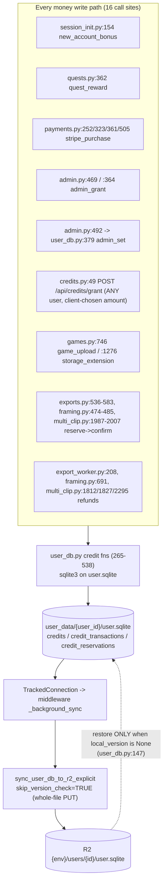
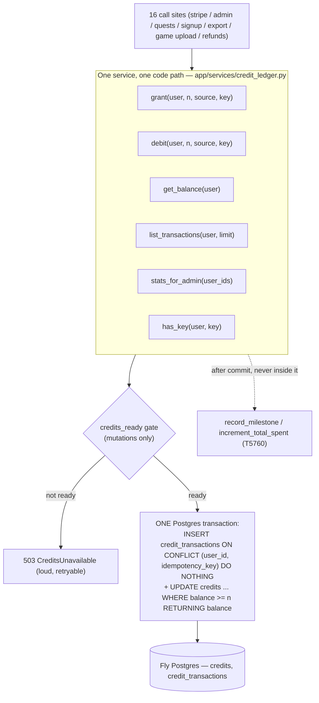

# T5840 — Credits → Postgres (Design)

**Status:** DESIGN — awaiting user approval (L-tier, design-gated)
**Task:** [T5840-credits-to-postgres.md](T5840-credits-to-postgres.md)
**Related:** [durability-sync/EPIC.md](durability-sync/EPIC.md) · [T4310+T4315 design](durability-sync/T4310-T4315-design.md) · T4940 (repricing + credit history) · T5760 (Stripe revenue reconciliation)
**Author:** Architect agent

> **Relationship to T4310/T4315.** Those two harden the R2 last-write-wins surface (CAS on upload,
> restore-if-newer on read). T5840 **removes the highest-stakes dataset from that surface entirely**.
> They are independent and non-blocking in both directions: T4310/T4315 still matter (quests,
> profiles, preferences, activity all stay in `user.sqlite`), and T5840 does not need them — its
> whole point is that money should not depend on a whole-file replication protocol being correct.
> One dependency direction only: **T4315's open question 4** ("should user.sqlite write-path
> freshness also cover the credits horizon") is answered here — yes, build the general rule anyway;
> after T5840 the `user.sqlite` stakes drop from "paid balance destroyed" to "quest step re-derives".

---

## 1. Current State

### 1a. Where credits live and how a write flows



Schema today (`user_db.py:37-64`):

| Table | Definition | Note |
|---|---|---|
| `credits` | `user_id TEXT PK, balance INTEGER NOT NULL DEFAULT 0` (`user_db.py:38-41`) | no constraint stopping a negative balance |
| `credit_transactions` | `id, user_id, amount, source, reference_id (NULLABLE), video_seconds, created_at` (`user_db.py:43-51`) | idempotency index is **partial**: `... WHERE reference_id IS NOT NULL` (`user_db.py:52-54`) |
| `credit_reservations` | `job_id TEXT PK, amount, video_seconds, created_at` (`user_db.py:59-64`) | no `user_id` column — the file *is* the user scope |

Readers: `bootstrap.py:52` (hot path, on the user-scoped worker thread), `games_upload.py:136`,
`credits.py:36/57`, `payments.py:217/317/355/469` (`has_processed_payment`, `user_db.py:419`),
`quests.py:346` via `get_completed_and_claimed_quest_ids` (`user_db.py:718` — the **claimed** set is
a `credit_transactions` query, `user_db.py:735-740`), `backfill_completed_quests` (`user_db.py:744`),
`admin.py:255` via `get_credit_stats_for_admin` (`user_db.py:545` — reads *other users'* SQLite
files, R2-restoring the missing ones, T4870), and `privacy.py:58-74` (GDPR export).

### 1b. Code smells / failure modes (with evidence)

| # | Failure mode | Evidence | Consequence |
|---|---|---|---|
| **1** | **Silent loss on machine swap** — the balance is a whole file replicated last-write-wins, and `ensure_user_database` restores only when `local_version is None` (`user_db.py:145-147`); every upload passes `skip_version_check=True` | prod 2026-07-24: a 400-credit admin grant lived only on the machine's volume, the deploy replaced the machine, the fresh volume pulled the R2 copy that never saw it (EPIC.md re-escalation) | paid value destroyed, no anomaly visible anywhere |
| **2** | **Double-grant on retry** — `grant_credits` writes `reference_id = NULL` for `admin_grant` and `new_account_bonus` (`user_db.py:277-281`, `admin.py:469`, `session_init.py:154`); SQLite treats NULLs as distinct and the unique index is partial (`user_db.py:52-54`) | `_persist_target_user_db` docstring states it outright: *"Deliberately NOT turned into a 5xx: admin_grant carries no idempotency key … so a retry would double-grant"* (`admin.py:114-117`) | `admin_grant_credits` **cannot** report a durable-sync failure as 5xx; it returns `{synced:false}` and hopes a human notices |
| **3a** | **Over-spend (TOCTOU)** — balance is read, checked, then relative-updated in two statements: `deduct_credits` (`user_db.py:326-335`), `reserve_credits` (`user_db.py:465-471`) | two concurrent exports both read 100, both pass `current < amount`, both debit 60 → **-20** | negative balance, free exports |
| **3b** | **Lost update (absolute write)** — `set_credits` reads `old_balance` then writes an absolute value (`user_db.py:387-393`) | a grant landing between the read and the write is erased | silent loss |
| **3c** | **Cross-machine lost transaction** — two machines each hold a copy; whole-file PUT means the loser's *entire* ledger + balance vanish | EPIC.md Mode A | a committed debit or grant disappears |
| **4** | **Open self-grant endpoint** — `POST /api/credits/grant` (`credits.py:39-50`) takes `amount`, `source`, `reference_id` **from the client** and is gated only by `get_current_user_id()`. It is mounted in every env (`main.py:225`) | used by e2e specs (`e2e/new-user-flow.spec.js:229`, `e2e/regression-tests.spec.js:1034/2358`); no frontend caller | **any logged-in production user can mint unlimited credits** |
| **5** | **`admin_set` reference collision** — `set_credits` writes `reference_id = f"set_to_{amount}"` (`user_db.py:397`) | setting the same user to the same value twice violates the unique index → `IntegrityError` after the balance UPDATE but before `commit()` → 500 + no change | a legitimate admin op fails opaquely |
| **6** | **DB-specific exceptions leak into routers** — `except sqlite3.IntegrityError` is the idempotency mechanism in `payments.py:253/324/362` and `quests.py:363` | 4 copies of "swallow the unique violation and report already_processed" | storage engine is part of the router contract |
| **7** | **Reservations are vestigial** — every call site reserves and confirms inside the same handler (`framing.py:474-485`, `multi_clip.py:1987-2007`); only `exports.py:536-583` has a real gap (one `INSERT` into `export_jobs`) | `recover_orphaned_reservations` (`user_db.py:520-538`) releases anything older than 60s **without checking for a matching export job**, contradicting its own docstring | a whole table + 4 functions for a two-phase commit that nothing really uses |
| **8** | **Admin read path pays R2** — `get_credit_stats_for_admin` opens up to `page_size` other users' SQLite files and R2-restores the missing ones (`user_db.py:573-605`) | ~130 lines of restore/stub/null handling (T4870) | slow, fragile, and the null-vs-0 ambiguity exists only because the file may be unreadable |

### 1c. Current behaviour (pseudo)

```pseudo
grant(user, n, source, ref=None):            # user_db.py:265
    open user.sqlite (may cold-restore from R2, ~200ms)
    UPDATE credits SET balance = balance + n  # no key -> retry duplicates
    INSERT credit_transactions(..., ref)      # ref NULL for admin/signup
    commit; later: whole-file PUT to R2, last-write-wins

deduct(user, n, source, ref):                # user_db.py:290
    if ref and a matching negative row exists: return already-done   # only when ref is not NULL
    SELECT balance                            # <-- check
    if balance < n: return insufficient       # <-- ...
    UPDATE credits SET balance = balance - n  # <-- ...and act, non-atomically
    INSERT credit_transactions(-n, ...)
```

---

## 2. Target State



### 2a. Design principles applied

- **One write primitive per direction.** Everything that adds credits is `grant()`; everything that
  removes is `debit()`. `refund_credits` collapses into `grant(source='..._refund', key='refund:{id}')`.
  11 functions → 6; 3 tables → 2.
- **Idempotency is not optional.** `idempotency_key TEXT NOT NULL` under `UNIQUE(user_id, idempotency_key)`.
  There is no NULL-key path, so failure mode 2 becomes structurally impossible and
  `admin_grant_credits` can finally return 503 on a durability failure.
- **No read-modify-write.** Sufficiency is expressed as a predicate on the write:
  `UPDATE ... WHERE balance >= :n RETURNING balance`. Row-level locking serialises concurrent debits.
- **No DB exceptions in routers.** `grant()`/`debit()` return `{applied: bool, balance: int}`;
  the four `except sqlite3.IntegrityError` blocks (smell 6) are deleted.
- **No fallback reads.** After cutover nothing reads the SQLite credit tables. Ever. (CLAUDE.md
  "No fallbacks, correct data".)
- **Cohesion.** Credits leave `user_db.py` (which is *"per-user SQLite"* by definition,
  `user_db.py:1-16`) for `app/services/credit_ledger.py`. Function names are preserved where
  callers keep them, so every call-site change is a mechanical import swap (greppability rule).

### 2b. Postgres schema (added to `_SCHEMA_DDL`, `pg.py:33`, and to migration `postgres/v019`)

```sql
CREATE TABLE IF NOT EXISTS credits (
    user_id     TEXT PRIMARY KEY,
    balance     INTEGER     NOT NULL DEFAULT 0 CHECK (balance >= 0),
    updated_at  TIMESTAMPTZ NOT NULL DEFAULT now()
);

CREATE TABLE IF NOT EXISTS credit_transactions (
    id              BIGSERIAL PRIMARY KEY,
    user_id         TEXT        NOT NULL,
    amount          INTEGER     NOT NULL CHECK (amount <> 0),   -- + grant, - debit
    source          TEXT        NOT NULL,                        -- unchanged vocabulary
    idempotency_key TEXT        NOT NULL,
    reference_id    TEXT,                                        -- human/API compat, NOT the key
    video_seconds   REAL,
    created_at      TIMESTAMPTZ NOT NULL DEFAULT now()
);
CREATE UNIQUE INDEX IF NOT EXISTS idx_credit_tx_idem
    ON credit_transactions(user_id, idempotency_key);
CREATE INDEX IF NOT EXISTS idx_credit_tx_user_created
    ON credit_transactions(user_id, created_at DESC, id DESC);
CREATE INDEX IF NOT EXISTS idx_credit_tx_source
    ON credit_transactions(source);      -- admin aggregates (stripe_purchase / spend)

CREATE TABLE IF NOT EXISTS credit_migration_state (   -- the cutover gate, one row per env DB
    id           INTEGER PRIMARY KEY CHECK (id = 1),
    ready_at     TIMESTAMPTZ,
    backfilled_users INTEGER NOT NULL DEFAULT 0
);
```

**Deliberate omissions, with reasons:**

| Omitted | Why |
|---|---|
| `REFERENCES users(user_id)` FK | `X-User-ID` header users and e2e users legitimately have **no Postgres `users` row** (backend-services.md § auth bypasses; `session_init.py:154` grants them the signup bonus). An FK would 500 session-init in dev/staging. A money ledger must also never fail to record because of a referential dependency. Cleanup is explicit instead — see §3d. |
| `balance_after` column | Derivable (`balance = Σ amount`); project rule "no redundant state". The invariant is checkable without it and is asserted by the backfill/report tool. (Open question 5.) |
| `credit_reservations` | Phase 2 deletes it — see §2d. Phase 1 moves it verbatim so the storage move stays mechanical (Refactoring rule 3: moves never mix with behaviour change). |

### 2c. The two mutation statements (the whole correctness story)

```pseudo
# grant / refund — idempotent, atomic.  ONE transaction (get_pg commits on clean exit)
grant(user_id, amount>0, source, key, video_seconds=None) -> {applied, balance}:
    INSERT INTO credits (user_id, balance) VALUES (:u, 0) ON CONFLICT DO NOTHING;
    WITH ins AS (
        INSERT INTO credit_transactions (user_id, amount, source, idempotency_key,
                                         reference_id, video_seconds)
        VALUES (:u, :n, :source, :key, :ref, :secs)
        ON CONFLICT (user_id, idempotency_key) DO NOTHING
        RETURNING amount
    ), upd AS (
        UPDATE credits SET balance = balance + (SELECT amount FROM ins), updated_at = now()
        WHERE user_id = :u AND EXISTS (SELECT 1 FROM ins)
        RETURNING balance
    )
    SELECT (SELECT balance FROM upd) AS new_balance, EXISTS(SELECT 1 FROM ins) AS applied;
    # applied=false  -> retry of a prior grant: SELECT balance and return it, change nothing

# debit — idempotent AND overdraft-proof.  ONE transaction, ledger row written FIRST
debit(user_id, amount>0, source, key, video_seconds=None) -> {ok, applied, balance, required}:
    INSERT INTO credit_transactions (...) VALUES (:u, -:n, ...)
    ON CONFLICT (user_id, idempotency_key) DO NOTHING;              -- 0 rows => retry
    if inserted == 0:
        return {ok: true, applied: false, balance: SELECT balance}   -- retry is a no-op
    UPDATE credits SET balance = balance - :n, updated_at = now()
    WHERE user_id = :u AND balance >= :n RETURNING balance;          -- 0 rows => insufficient
    if updated == 0:
        ROLLBACK              -- the ledger row disappears with it; nothing partial can survive
        return {ok: false, applied: false, balance: <read>, required: :n}
    COMMIT
```

Why this order: writing the ledger row first makes the *key* the concurrency token, so a retry can
never race the balance; and because both statements are in one transaction, an insufficient balance
rolls the ledger row back — there is no state where a debit row exists without the matching balance
change. The conditional `WHERE balance >= :n` takes a row lock, so N parallel debits serialise:
each either succeeds against the balance it actually sees or fails 402. Over-spend is impossible
(belt and braces: `CHECK (balance >= 0)`).

### 2d. Idempotency keys — one shared derivation, used by runtime AND backfill

```pseudo
# app/services/credit_ledger.py — the single definition (DRY; also §3c depends on it)
KEY_PREFIX = {
    'stripe_purchase': 'stripe', 'quest_reward': 'quest', 'new_account_bonus': 'signup',
    'game_upload': 'game_upload', 'storage_extension': 'storage_ext',
    'framing_usage': 'export', 'framing_refund': 'refund', ...
}
def credit_key(source, reference_id): return f"{KEY_PREFIX[source]}:{reference_id}"
```

| Path | file:line | Key today | Key after |
|---|---|---|---|
| Signup bonus | `session_init.py:154` | **NULL** | `signup:{user_id}` |
| Quest reward | `quests.py:362` | `quest_id` | `quest:{quest_id}` |
| Stripe confirm-intent | `payments.py:252` | `pi_id` | `stripe:{pi_id}` |
| Stripe webhook (checkout) | `payments.py:323` | `session_id` | `stripe:{session_id}` |
| Stripe webhook (PI) | `payments.py:361` | `pi_id` | `stripe:{pi_id}` |
| Stripe verify (legacy) | `payments.py:505` | `session_id` | `stripe:{session_id}` |
| Admin grant (single) | `admin.py:469` | **NULL** | `admin:{admin_user_id}:{request_id}` — `request_id` is a UUID minted by the admin UI per click, sent in the body; a retry of that click reuses it, a new click gets a new one |
| Admin bulk grant | `admin.py:364` | **NULL** | `admin:{admin_user_id}:{batch_id}:{target_user_id}` |
| Admin set balance | `admin.py:492` | `set_to_{amount}` (collides, smell 5) | `adminset:{admin_user_id}:{request_id}` |
| Game upload | `games.py:746` | `game_id` | `game_upload:{game_id}` |
| Storage extension | `games.py:1276` | `ext_ref` | `storage_ext:{ext_ref}` |
| Export debit ×3 | `exports.py:536`, `framing.py:474`, `multi_clip.py:1987` | `export_id` | `export:{export_id}` |
| Refund ×5 | `export_worker.py:208`, `framing.py:691`, `multi_clip.py:1812/1827/2295` | `export_id` | `refund:{export_id}` |
| Self-serve grant | `credits.py:49` | client-chosen | **removed / gated** (open question 2) |

**Reservations (task design question 2) — recommendation: eliminate, in a separate phase.**
Phase 1 moves `credit_reservations` to Postgres unchanged. Phase 2 replaces reserve→confirm with a
single `debit(key='export:{export_id}')`, because the atomic conditional UPDATE provides exactly the
guarantee the two-phase dance was faking, and 2 of the 3 call sites already confirm one line after
reserving (`framing.py:474-485`, `multi_clip.py:1987-2007`). The one real gap —
`exports.py:536-583`, which inserts an `export_jobs` row between reserve and confirm — is closed by
reordering to *insert job → debit → on 402 delete the just-created pending job* (safe: the worker
task is only scheduled afterwards, `exports.py:589`). Phase 2 deletes `credit_reservations`,
`reserve_credits`/`confirm_reservation`/`release_reservation`/`recover_orphaned_reservations`
(`user_db.py:462-538`) and the `session_init.py:204-211` hook.

### 2e. Read paths after the move

| Reader | Today | After |
|---|---|---|
| `bootstrap.py:52` | SQLite open (can pay a cold R2 restore, ~200ms — see the T1536 comment at `user_db.py:721-724`) | one pooled PG query (~1-3ms, pre-pinged pool `pg.py:305`). **Net latency win**; no cache (never cache a money balance). |
| `credits.py:36/57` | SQLite | PG |
| `payments.has_processed_payment` | SQLite ledger scan | `has_key(user, 'stripe:{ref}')` |
| `quests` claimed set (`user_db.py:735-740`) | same SQLite connection as `completed_quests` | `completed_quests` stays in SQLite; the claimed set becomes a PG query (2 stores, both fast; the T1536 single-open optimisation applied to a *cold R2 restore* which no longer exists for the ledger) |
| `backfill_completed_quests` (`user_db.py:744`) | SQLite ledger | PG ledger, writes SQLite `completed_quests` (unchanged) |
| `get_credit_stats_for_admin` (`user_db.py:545`) | opens N other users' SQLite files + R2 restores | **one grouped PG query** for the whole page; the R2/stub/null branching (`user_db.py:573-614`) is deleted. `credits` is a real number now (absent row = 0); the "unavailable → null" case disappears because a PG outage 500s the endpoint loudly instead. |
| `privacy.py:58-74` GDPR export | SQLite | PG (same shape) |

### 2f. Analytics coupling (task design question 4)

`record_milestone` / `increment_total_spent` (`analytics.py:270/499`) already run on their own
`get_pg()` connections. **Keep them after the ledger commit, not inside its transaction.** Rationale:
a milestone write failure must never roll back a paid grant, and T5760's reconciliation exists
precisely to repair `total_spent_cents` drift on demand. Ordering stays exactly as today
(`payments.py:260-264`), so T5760 is untouched.

---

## 3. Migration plan

### 3a. Tracks touched

| Track | Change |
|---|---|
| `postgres` | **v019** — creates `credits`, `credit_transactions` (+ indexes), `credit_reservations`, `credit_migration_state`. Same DDL added to `_SCHEMA_DDL` (`pg.py:33-275`) so fresh deploys get it without a migration. Latest PG version today is v018 (`migrations/postgres/v018_share_sharer_sport.py`) — never renumber (`base.py:38-40`). |
| `user_db` | **No versioned migration in this task.** The SQLite credit tables stay in `_USER_DB_SCHEMA` (`user_db.py:38-64`), unread and unwritten, as the pre-migration record and the rollback substrate. A later task drops them (open question 6). |
| `profile_db` | untouched |

### 3b. The backfill is a tool, not a migration file

`run_all_migrations` is the wrong vehicle for money: `_migrate_user_db` (`migrations/__init__.py:141`)
calls `ensure_user_database`, which restores from R2 **only when `local_version is None`**
(`user_db.py:147`) — on a live machine that has served a user, it would read a possibly stale local
copy; and a `user_db` migration's `up(conn)` receives no user context, so it cannot even name the user
it is migrating. Money also needs a **dry run a human reads before anything is written**.

So: `app/services/credit_backfill.py` + two admin endpoints (both `_require_admin()` first line,
per `admin.py:52`):

- `GET  /api/admin/credits/backfill-report` — pure read, no writes, returns the per-user table below.
- `POST /api/admin/credits/backfill` — applies; `{user_ids?: [...]}` for a targeted re-run.

This follows CLAUDE.md doctrine (AI writes migration code, admin triggers it) and matches the T5760
precedent — an on-demand report + an explicit heal gesture, never automatic.

### 3c. Per-user algorithm (idempotent, re-runnable forever)

```pseudo
for user_id in get_all_users_for_admin():        # Postgres-derived; NO user_segments join (T4970)
    # 1. RESOLVE THE AUTHORITATIVE COPY — never trust the local snapshot blindly
    r2_copy    = force_download("{env}/users/{id}/user.sqlite" -> tmp)   # mirrors _download_profile_db (migrations/__init__.py:271)
    local_copy = user_data/{id}/user.sqlite if it exists
    if neither: report status=no_user_db; continue        # nothing to migrate; first grant creates the row

    # 2. READ + CHECK THE INVARIANT on each copy
    for copy in (r2_copy, local_copy):
        ledger[copy]  = SELECT id, amount, source, reference_id, video_seconds, created_at FROM credit_transactions
        stored[copy]  = SELECT balance FROM credits
        resv[copy]    = SELECT job_id, amount FROM credit_reservations
        invariant: stored == Σ(ledger.amount) - Σ(resv.amount)      # holds by construction today
        flag 'ledger_mismatch' if violated                          # = a historical bug, needs a human

    # 3. MERGE the two copies: ledger rows are append-only, so the UNION is well defined
    rows = union(ledger[r2], ledger[local]) keyed by natural_key(row)
    flag 'divergent' if the two copies differ at all (report both sides; apply still uses the union)

    # 4. KEY every legacy row with the SAME derivation the runtime uses (§2d)
    key(row) = credit_key(row.source, row.reference_id)  if row.reference_id is not NULL
             = f"legacy:{row.id}"                        otherwise (admin_grant / new_account_bonus)

    # 5. WRITE — one Postgres transaction per user
    INSERT INTO credit_transactions (user_id, amount, source, idempotency_key, reference_id,
                                     video_seconds, created_at)
      VALUES ... ON CONFLICT (user_id, idempotency_key) DO NOTHING          -- inserts only what's missing
    INSERT INTO credits (user_id, balance)
      VALUES (:u, (SELECT COALESCE(SUM(amount),0) FROM credit_transactions WHERE user_id = :u))
      ON CONFLICT (user_id) DO UPDATE SET balance = EXCLUDED.balance, updated_at = now();
    # open reservations are NOT carried: dropping them credits them back, which is exactly what
    # recover_orphaned_reservations (user_db.py:520) would do — and at cutover their exports are
    # dead anyway (the deploy replaced the machine). Each released reservation is logged + reported.
```

**Why step 4's key derivation is the critical detail.** Keying legacy rows as `legacy:{id}`
*everywhere* would open a real double-grant hole: Stripe redelivers a webhook for up to 3 days, so a
pre-cutover `pi_xxx` could arrive post-cutover, compute `stripe:pi_xxx`, find no row, and grant
again. Using the shared `credit_key()` for every row that has a `reference_id` closes it — and a
regression test pins it (§6).

**Why re-running is always safe.** Balance is re-derived as `Σ(PG ledger)`, never copied from
SQLite. Every balance mutation in the new schema writes a ledger row (single code path, §2c), so
that identity is an invariant, not a coincidence. Consequences: the backfill doubles as a permanent
audit/repair tool, and a post-cutover catch-up pass cannot clobber post-cutover grants — it only
inserts rows PG is missing and recomputes the sum.

**Users whose `user.sqlite` is only in R2.** Handled by construction: enumeration comes from
Postgres, and step 1 force-downloads from R2 rather than relying on a local file. Users with no R2
object at all are reported `no_user_db` and skipped (truthful — no ledger, no balance).

**Report shape** (`GET .../backfill-report`), per user: `email, r2_balance, local_balance,
ledger_sum, open_reservations, tx_count, pg_balance_now, pg_balance_after, delta, flags[]` where
flags ∈ `{divergent, ledger_mismatch, negative_balance, no_user_db, missing_stripe_grant,
unknown_stripe_grant}`, plus a summary line. Sorted anomalies-first (T5760's report convention).

### 3d. Stripe reconciliation (AC: "purchases reconciled against Stripe")

Reuse T5760's builders **unchanged** (`app/services/revenue_reconciliation.py`:
`fetch_stripe_intents` — `PaymentIntent.list` auto-paginated, status filtered client-side;
grouping by `metadata.user_id`, never customer id). For every succeeded live-mode PI the expected
ledger key is `stripe:{pi.id}` and the expected credit amount is `int(pi.metadata['credits'])` —
note this is **read off the PI, not off `CREDIT_PACKS`**, so T4940's reprice (80/160/340 at
`payments.py:68`) has zero effect on historical rows.

- PI present, ledger row absent → `missing_stripe_grant`. **Reported, never auto-granted.** Healing
  is an explicit admin click that calls the ordinary `grant(key='stripe:{pi}')` — no special path.
- Ledger row present, PI absent → `unknown_stripe_grant` (expected for test-mode-era rows, T5760's
  `test_mode_era` classification). Reported, carried over as-is (open question 7).
- `user_segments.total_spent_cents` is **not touched** by this task. T5760's report/heal keeps
  working exactly as today.

### 3e. Read-from-both / dual-write: **NO. One-way cutover.** Here is why.

| Option | Verdict |
|---|---|
| **Dual-write (SQLite + PG)** | Rejected. Two writers to a money balance is precisely the lost-update/divergence class this task exists to remove; it doubles every write path (against "one way to do each thing") and creates an unanswerable question at every read: which one is right? |
| **Read-from-both (PG, fall back to SQLite)** | Rejected — it is a fallback for internal data, banned by CLAUDE.md ("No Silent Fallbacks", "Correct Data, Not Workarounds"). It would also hide exactly the failure we must see: a missing PG row. |
| **One-way cutover + `credits_ready` gate** | **Chosen.** The gate makes the only dangerous window *fail loudly instead of wrongly* (§4), and the idempotent re-runnable backfill makes ordering vs live traffic a non-issue. |

---

## 4. Cutover & rollback

### 4a. The gate (this is what makes the cutover safe)

`credit_ledger` checks `credit_migration_state.ready_at` once per process (cached after the first
successful read):

- **not ready → every mutation (`grant`/`debit`) raises `CreditsUnavailable` → HTTP 503.** Reads
  (`get_balance`, `list_transactions`) pass through and may transiently show a low/zero balance.
- Consequences of a closed gate are all safe: no debit can run against an unbackfilled balance (no
  over-spend, no wrong 402 that costs a user money); a Stripe webhook 503s and **Stripe retries** —
  the eventual grant is idempotent on `stripe:{pi}`; an admin grant 503s and is retried with the
  same `request_id`.
- Reads staying open avoids 503-ing `/api/bootstrap` for a cosmetic reason.

### 4b. Sequence

```mermaid
flowchart LR
    D1["Deploy 1: PG DDL + backfill tool<br/>(credits still SQLite — zero behaviour change)"]
    M1["POST /api/admin/migrate -> v019"]
    R1["GET backfill-report (dry run) -> human review"]
    B1["POST backfill (bulk load; PG unused, drift starts)"]
    D2["Deploy 2: cutover — credit_ledger is the only writer<br/>gate CLOSED on boot"]
    B2["POST backfill (catch-up: inserts drift rows, re-derives balances)"]
    V["GET backfill-report -> zero drift, per-user delta == 0"]
    OPEN["Open the gate (ready_at = now)"]
    D1 --> M1 --> R1 --> B1 --> D2 --> B2 --> V --> OPEN
```



Notes:
- **Deploy 2 replaces the machine**, so all in-flight exports die and no local-only `user.sqlite`
  write survives — which is why the backfill reads the R2 copy and why open reservations are
  released. Run the SIGTERM graceful sync (`main.py:347/374`) as usual before the deploy so the last
  writes reach R2.
- Steps D2 → OPEN are a scripted, minutes-long sequence at a low-traffic hour. Mutations 503 for
  that window; nothing can be lost.
- Env order: **dev → staging (full rehearsal incl. report review) → prod.** Each env has its own
  `DATABASE_URL`, so each needs its own migrate + backfill + gate open.

### 4c. Rollback

| When | Action |
|---|---|
| Before the gate opens (no real PG writes yet) | **Free.** Redeploy the previous image; the SQLite path resumes on data that was never modified. PG rows are inert; a later re-run of the backfill re-derives them. |
| After the gate opens | **Forward-fix only.** PG now holds writes SQLite never saw, so reverting would destroy them. This is the point of no return and it is deliberate — it is why the report must be reviewed *before* opening the gate. Escape hatch if PG itself is the problem: the ledger is a small table; a `credit_ledger` export can regenerate a `user.sqlite` snapshot, but no such tool is built up front (open question 4). |

### 4d. Adjacent code that MUST change with the move (easy to miss)

| Site | Why |
|---|---|
| `auth.py:133-136` `_reset_test_account` and `privacy.py:171` delete-account | Both explicitly delete dependent PG rows before `DELETE FROM users`. The new credit rows must be added to those lists — otherwise a deleted account keeps its balance and reregisters with credits (and, if an FK were added, the delete would fail outright). |
| `auth.py:74` `_purge_user_data` | Purges local + R2 + caches; add the PG credit purge so `is_new_user` reseeding (backend-services.md invariant 0) starts from a true zero. |
| `scripts/reset-test-user.py`, `scripts/reset_all_accounts.py`, `scripts/delete_all_guests.py:124`, `scripts/copy_user_between_envs.py` | Credits are no longer in the file they copy/clear. `copy_user_between_envs` must copy the ledger, or copied accounts arrive with 0. |
| `conftest.py` PG fixture (TRUNCATE list, `conftest.py:105-121`) | New tables must be truncated between tests — and the guard that refuses staging/prod DSNs still applies (memory: tests wipe the dev DB). |
| `e2e` specs using `POST /api/credits/grant` (`new-user-flow.spec.js:229`, `regression-tests.spec.js:1034/2358`) | Depend on the endpoint resolved by open question 2. |

---

## 5. Risks & Open Questions

| Risk | Mitigation |
|---|---|
| **Money wrong during cutover** | `credits_ready` gate 503s mutations until the report shows per-user delta 0; dry-run reviewed by a human before the gate opens; backfill idempotent and re-runnable. |
| **Stripe redelivery across the cutover double-grants** | Legacy rows carry their *semantic* key (`stripe:{ref}`) via the shared `credit_key()`, not a synthetic one. Pinned by a regression test (§6). |
| **A user's local `user.sqlite` diverges from R2 at backfill time** | Both copies are read; the ledger union is applied; divergence is flagged in the report for human review before the gate opens. |
| **Historical ledger ≠ stored balance** (e.g. a past LWW loss) | The invariant check flags `ledger_mismatch` per user. Because the target balance is `Σ ledger`, a user whose file was reverted gets exactly what the ledger says — deltas are surfaced per user and require an explicit decision (e.g. re-granting the lost 400 with `admin:{...}` key). |
| **Postgres becomes a hard dependency of exports** | Not a new SPOF: auth/sessions/sharing already live in PG (`pg.py`), so a PG outage is already a full outage. T4960's pre-ping (`pg.py:305-367`) covers the staging idle-connection 500 noted in memory. |
| **Latency regression on the export button / bootstrap** | Measured before/after per the AC. Expected *improvement*: a pooled PG query replaces a SQLite open that can cold-restore from R2 (`user_db.py:721-724`). |
| **T4940 intersections** | (a) pack pricing comes from `GET /api/payments/config` and grants read credits from Stripe metadata (`payments.py:245/308/346`) — untouched. (b) `CreditHistoryModal` walks the running balance back from the authoritative balance; the response shape is preserved and ordering becomes `created_at DESC, id DESC` (strictly more deterministic than today). (c) `formatDate` (`CreditHistoryModal.jsx:38-45`) already accepts zoned ISO, so `TIMESTAMPTZ` serialisation is safe — pinned by the existing `CreditHistoryModal.test.jsx`. |
| **T5760 intersections** | `total_spent_cents` and `revenue_reconciliation.py` are read-only inputs here; the backfill imports its Stripe builders, changes nothing. `increment_total_spent` still runs after the grant commits. |
| **Tests truncate the real dev Postgres** | Warn before running the suite (memory); the conftest guard already refuses staging/prod DSNs. |
| **Scope creep** | Phase 2 (delete reservations) and the `POST /credits/grant` gating are called out as separate commits so each reviewable unit stays < ~200 lines (Refactoring rule 4). |

### Deliverable slices (each a reviewable commit)

1. `postgres/v019` + `_SCHEMA_DDL` + `credit_ledger.py` (service, no callers) + unit/concurrency tests.
2. `credit_backfill.py` + the two admin endpoints + report UI row (dry run only).
3. Cutover: re-point all 16 call sites + the 7 read paths; delete the `sqlite3.IntegrityError`
   branches; add the account-delete/purge/script changes. **Mechanical, no behaviour change beyond
   the store.**
4. Phase 2: collapse reservations into `debit`/`refund`; delete `credit_reservations` + 4 functions
   + the `session_init` hook.
5. (Per open question 2) close `POST /api/credits/grant`.

---

## 6. Test strategy

**Backend unit — `tests/test_credit_ledger.py`**
- `grant` twice with the same key → one ledger row, balance +n once, second call `applied=False`.
- `grant` with different keys → two rows.
- `debit` with sufficient balance → row + balance; same key again → `applied=False`, balance unchanged.
- `debit` with insufficient balance → 402 shape `{required, available}`, **zero ledger rows** (proves
  the rollback), balance unchanged.
- `CHECK (balance >= 0)` cannot be violated by any public function.
- absent user → `get_balance` = 0; first `grant` creates the row.

**Concurrency (the AC "two parallel deducts")** — `tests/test_credit_ledger_concurrency.py`
- Balance 100, two threads each `debit(60, key=export:A / export:B)` on **separate** PG connections
  → exactly one succeeds, final balance 40, exactly one ledger row.
- Balance 100, two threads each `debit(30)` → both succeed, final balance 40, two rows (proves the
  lock serialises rather than spuriously failing).
- Balance 100, 10 threads with the **same** key → one row, balance 70.
- Uses real connections (the whole point is DB-level locking; a mocked test proves nothing).

**Idempotency at the HTTP layer** — `tests/test_admin_credit_idempotency.py`
- `POST /admin/users/{id}/grant-credits` twice with the same `request_id` → balance +n once.
- Different `request_id` → +2n (a deliberate second grant still works).
- Simulated failure after commit → handler returns **503**, and the retry with the same
  `request_id` does not double-grant (this is the AC that was structurally impossible before).

**Backfill** — `tests/test_credit_backfill.py`
- Fixture `user.sqlite` with a known ledger (mixed sources, some NULL `reference_id`, one open
  reservation) → PG rows keyed per §3c; balance = Σ ledger; the reservation is released and reported.
- Re-run → no new rows, balance unchanged (idempotent).
- Re-run **after** a post-cutover grant → the post-cutover row survives and the balance includes it.
- Divergent local vs R2 copies → union applied, `divergent` flagged.
- Stored balance ≠ Σ ledger → `ledger_mismatch` flagged, nothing silently "fixed".
- **Cross-cutover Stripe redelivery:** backfill a legacy `stripe_purchase` row for `pi_X`, then call
  the webhook path for `pi_X` → `applied=False`, balance unchanged. (Guards the §3c step-4 hole.)
- Stripe reconciliation with a mocked `fetch_stripe_intents` (mirrors `test_revenue_reconciliation.py`):
  paid PI with no ledger row → `missing_stripe_grant`; healing it uses the ordinary grant path.

**Regression (existing suites must stay green)** — `test_credits.py`, `test_admin.py`,
`test_admin_credit_grant_r2_sync.py` (its `_persist_target_user_db` assertions change: after the move
there is no grantee `user.sqlite` write to sync — the test becomes "no R2 sync is attempted"),
`test_t4940_pack_pricing.py`, `test_revenue_reconciliation.py`, quests claim/`already_claimed`,
payments webhook double-delivery.

**Frontend** — `CreditHistoryModal.test.jsx` and `creditStore` unchanged (contract preservation is
the assertion); one added case for a zoned ISO `created_at`.

**Latency (AC)** — measure `/api/credits` and `/api/bootstrap` p50/p95 before and after on staging;
record the numbers in the task file.

**Live-drive on staging (required per the workers-QA rule)** — buy a pack in Stripe test mode, run
an export to a 402, admin-grant with a double-click, claim a quest, open the credit history modal,
and re-run the backfill report to show delta 0.

---

## RESOLVED — user decisions 2026-07-25 (design APPROVED on these terms)

The questions below are answered. Implementors follow THIS section; the original list is kept
underneath for the reasoning behind each choice.

1. **Reservations — MOVE AS-IS.** Phase 1 moves `credit_reservations` to Postgres verbatim (lowest
   risk, keeps the task's existing acceptance criteria). The atomic-debit + refund simplification is
   a possible phase 2 AFTER this is proven stable — do NOT fold it into this task.
2. **Open self-grant endpoint — ALREADY FIXED, do not re-solve.** `POST /api/credits/grant` was
   gated on 2026-07-25 (commit on master): `APP_ENV == "production"` -> hard 404, mirroring
   `auth.py` dev-login; staging/dev stay open so the e2e specs that seed credits keep passing.
   Regression test: `src/backend/tests/test_credits_grant_prod_gate.py`. When credits move to
   Postgres, keep this gate.
3. **Divergence at backfill — UNION both ledgers, re-derive the balance.** Ledger rows are
   append-only, so the union is the least-loss answer; never R2-only (that would silently drop a
   local-only grant — the exact 400-credit loss that started this epic).
4. **Cutover — `credits_ready` GATE.** Credit MUTATIONS return 503 until the reconciliation report
   shows zero drift; READS keep working. Stripe and admin retries are idempotent, so the window
   fails loudly, never wrongly. Rollback stays free until the gate opens; forward-fix after.
   Escape hatch: forward-fix-only is acceptable — do not build a PG->SQLite export up front.
5. **`balance_after` column — OMIT** (derivable; "no redundant state" is a standing project rule).
6. **Legacy SQLite credit tables — leave unread, drop later.** Keep them in `_USER_DB_SCHEMA` for a
   deprecation period; drop in a later `user_db` migration ~30 days after prod verification.
7. **Test-mode-era grants — deducting is FINE.** User (2026-07-25): *"It was all from my own testing
   so I really don't care. If we need to deduct for accounting reasons that's fine. I'll grant as
   admin."* So: carry them into Postgres, then zero the fake-payment credits through the ORDINARY
   admin-set path so the adjustment lands in the ledger (never a silent DB edit). The user re-grants
   as admin if they want balance restored. Affected accounts per T5760's `test_mode_era`
   classification (imankh + arshia — both the user's own).
8. **`stripe_customers` — OUT OF SCOPE.** Billing-adjacent but not money at risk; keep the diff
   focused.

## Open questions for user approval

1. **Reservations — eliminate in phase 2 (recommended) or keep the table?** Recommendation: move it
   verbatim in phase 1, then delete it and replace reserve→confirm with a single atomic
   `debit(key='export:{export_id}')` + `refund:{export_id}` compensation. Trade-off to accept: a
   crash between "job row created" and "debit" gives a free export (tiny revenue leak) instead of
   today's orphaned reservation released after 60s. If you prefer zero leak, we keep the table.
   *(This changes the task's AC wording, which currently lists `credit_reservations` as living in
   Postgres.)*
2. **`POST /api/credits/grant` (`credits.py:39-50`) is an open self-grant endpoint in production** —
   any logged-in user can mint credits. It has no frontend caller; only e2e specs use it. Delete it
   and move the seeding into the non-prod test-seam router (`/api/test/*`, dev-only) — or gate it
   like `dev-login` (404 in production + `X-Test-Mode` on staging) so staging e2e keeps working?
   Recommendation: the `dev-login` gating pattern (`auth.py:884`), since staging e2e needs it.
3. **Divergence policy at backfill.** When a user's local copy and R2 copy disagree, apply the
   *union* of ledger rows and re-derive the balance (recommended — ledger rows are append-only, so
   the union is the least-loss answer), or read R2 only? The union can over-credit if a row was
   deliberately removed out-of-band — nothing does that today.
4. **Cutover policy:** `credits_ready` gate that 503s mutations until the report shows zero drift
   (recommended), vs a maintenance banner, vs accepting a short window where balances read low. Also:
   do you want a PG→SQLite export tool built up front as a post-gate escape hatch, or is
   forward-fix-only acceptable?
5. **`balance_after` column on the ledger** — omit (recommended; derivable, and "no redundant state"
   is a standing rule) or include for money-audit convention?
6. **Legacy SQLite credit tables** — leave in `_USER_DB_SCHEMA` unread for a deprecation period and
   drop in a later `user_db` migration (recommended: drop ~30 days after prod verification), or drop
   immediately at cutover?
7. **Test-mode-era grants** (T4940 operator note (c), T5760 `test_mode_era`): the backfill carries
   them into Postgres as-is and flags them `unknown_stripe_grant`. Confirm no cleanup/zeroing — or
   name the users to adjust, with the adjustment done through the ordinary admin-set path so it
   lands in the ledger.
8. **Should `stripe_customers` (`user_db.py:66-69`) move too?** It is billing-adjacent and tiny, but
   it is not money at risk. Recommendation: **no** — out of scope, keep the diff focused.
