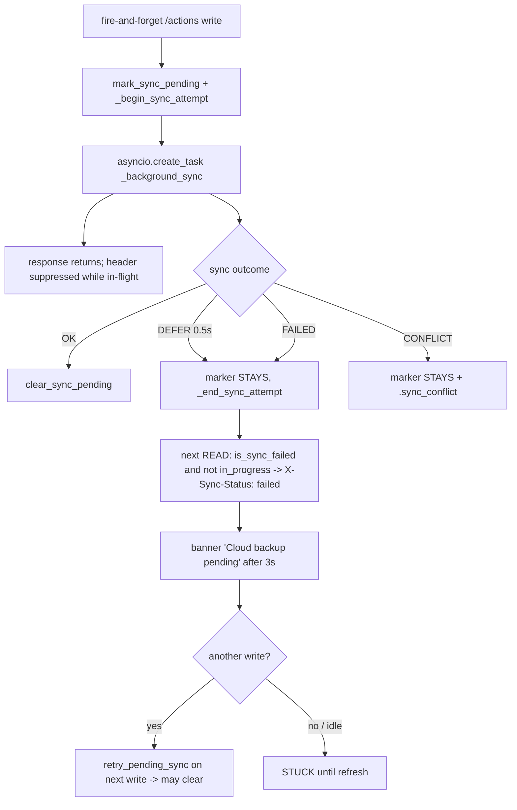

# T5870 — Design: "Your edits aren't saving" fires regularly; only a refresh clears it

**Status:** DESIGN — awaiting approval (Stage 2 gate). Do not implement past this doc.
**Branch:** `feature/T5870-edits-arent-saving` (off `origin/master` @ `20e1a169`, incl. T4310/T4315/T5920).
**Measured on:** today's master via `src/backend/tests/t5870_measure_sync_outcomes.py` (real markers,
real `_SYNC_IN_PROGRESS`, real `_background_sync`, real header predicate; only the R2 boundary modelled
by a fake R2 that owns a real per-(user,db) upload lock so the 0.5s DEFER is genuine thread contention).

---

## 0. TL;DR for the gate

Two defects, both confirmed, but the traced leads were **partly stale** and the measurement moved the
root cause:

- **(A) Frequency** is driven by the **0.5s upload-lock DEFER on the fire-and-forget `/actions` write
  path**, not by an "in-flight read as failed" race. In-flight IS correctly suppressed. A *deferred*
  sync returns `FAILED` and calls `_end_sync_attempt`, so the queued-retry state loses its in-flight
  cover and surfaces as `X-Sync-Status: failed`. **A defer is "pending/queued", not "failed" — the
  overload `is_sync_failed := has_sync_pending` is what mislabels it.**
- **(B) Refresh-only recovery** has a simpler cause than the leads assumed: **the sync banner
  (`SyncStatusIndicator`) has had NO Retry button since commit `3b495048` ("no manual button").** The
  only auto-retry is gated on a browser `offline→online` event; the only write-triggered retry
  (`retry_pending_sync`) needs the user to *keep editing*. So if an editing burst ends on a defer/
  failure, nothing heals it and refresh is the only user-accessible cure — exactly the report.

The fix is to **stop lying about pending/deferred syncs** (separate "pending" from "failed") **and give
the real-failure state a working, honest recovery** (a Retry that actually clears without a refresh, and
that says so honestly when it cannot — a CAS conflict). We do **not** silence the banner.

---

## 1. Current state

### 1.1 There are THREE "not saving"-flavoured surfaces, not one

The user's words ("your edits aren't saving") match surface **B**, but the traced leads describe surface
**A**. They are independent code paths:

| # | Trigger | Store / component | Copy today | Retry affordance |
|---|---------|-------------------|------------|------------------|
| **A** | backend `.sync_pending` marker → `X-Sync-Status` header on every response → global fetch interceptor | `syncStore.js` → `SyncStatusIndicator.jsx` | **"Cloud backup pending — your work is saved locally"** / "Offline — …" | **NONE** (informational only; auto-retry only on network `online` event) |
| **B** | overlay surgical `/actions` POST fails after 2 bounded retries (T4900) | `overlayActionStore.js` toast | **"Your edits aren't saving"** / "Some highlight changes could not be saved. Retry before exporting." | **Retry** button → `retryFailedOverlayActions()` (re-sends queued actions). Overlay screen only. |
| **C** | clip gesture durable 503 `{code:'sync_failed'}` (T4320/T5350) | `useRawClipSave.js` toast | **"Could not save to the cloud" / "Your clip wasn't saved. Please try again."** | **Retry** button → re-fires the clip gesture. Annotate screen only. |

`/api/retry-sync` (the endpoint the leads call "the Retry path") is wired to **nothing in the UI**
except `syncStore`'s `online`-event auto-retry. The manual button that used to call it was deleted in
`3b495048`.

### 1.2 Backend sync outcome taxonomy (what a sync attempt can terminate as)

From `storage.sync_database_to_r2_with_version` → `sync_db_to_r2_explicit` (real `SyncResult`), plus the
middleware's marker/header handling:

| Outcome | SyncResult | `.sync_pending` after | `.sync_conflict` | `X-Sync-Status` a later read sees | Retryable? |
|---------|-----------|-----------------------|------------------|-----------------------------------|-----------|
| Success | `OK` | cleared | cleared | (none) | — |
| **Upload-lock DEFER** (0.5s timeout, fire-and-forget) | `FAILED` | **stays** | no | **`failed`** | yes, transient — but only on next write |
| **Checkpoint-busy** (T5920 `[SYNC_CHECKPOINT_BUSY]`) | `FAILED` | stays | no | `failed` | yes, transient |
| Checkpoint open-failed (T5920 `[SYNC_CHECKPOINT_OPEN_FAILED]`) | `FAILED` | stays | no | `failed` | yes-ish (internal bug, loud) |
| Genuine R2 error / exception | `FAILED` | stays | no | `failed` | yes, transient |
| **CAS conflict** (T4310, `[SYNC_CONFLICT]`) | `CONFLICT` | stays | **yes** | `conflict` | **NO — needs restore-if-newer, not blind retry** |

**The bug in one line:** `is_sync_failed(user_id)` is literally `return has_sync_pending(user_id)`
(`db_sync.py:250-252`). Every one of the "stays" rows above — including a mere DEFER — reads as "failed".

### 1.3 Header-emission predicate (the false-positive gate)

`db_sync.py:791` — `if is_sync_failed(user_id) and not is_sync_attempt_in_progress(user_id):`
Suppresses only while an attempt is *executing*. A DEFER ends the attempt (`_end_sync_attempt` in the
`finally`), so the queued state is no longer covered → surfaces as `failed`.



---

## 2. Measured distribution (justifies the design)

`python3 tests/t5870_measure_sync_outcomes.py`, MODELLED-INPUT: R2 upload latency 300ms, defer timeout
0.5s (the real `_SYNC_LOCK_TIMEOUT`). Numbers below are **MEASURED from the real code**; the input
assumptions (latency, edit cadence) are stated so they can be swept.

| Scenario | uploads | **defers** | banner-reads | final banner |
|----------|--------:|-----------:|-------------:|:---:|
| uncontended (writes spaced apart) | 10 | 0 | 0/20 | off |
| rapid writes, gap=50ms | 6 | **10** (71% of syncs) | 0/24 | off |
| rapid writes, gap=150ms | 12 | **4** (25%) | 2/24 | off |
| refcount-FP probe (A ends while B in flight) | 4 | 0 | 0/6 | off |
| CAS conflict | 0 | 0 | 1/1 | **ON (`conflict`)** |
| checkpoint-busy then next write | 2 | 0 | (stuck→healed) | off |
| **idle after failed last write (reads only)** | 0 | 0 | **20/20** | **ON (`failed`)** |

**Read-off:**
1. **Uncontended editing produces zero false banners.** In-flight suppression works.
2. **Contention makes syncs DEFER at a high rate** (71% at 50ms cadence). During a *continuous* burst the
   banner is still suppressed (an attempt is almost always in progress), so mid-burst reads rarely see it
   (0/24 at 50ms, 2/24 at 150ms).
3. **The damage lands when the burst ENDS on a defer/failure** and the user goes idle: the marker stays,
   every subsequent read re-emits `failed`, and **nothing heals it** (20/20 banner-reads, no write to
   trigger `retry_pending_sync`, no reconnect, no button). → this is both (A) "regularly" and (B)
   "refresh only".
4. **The lead-1 "in-flight read as failed" race was probed and NOT reproduced** — the real mislabel is
   **DEFER read as failed**, not in-flight. (Reported honestly; the design targets the reproduced cause.)
5. **CAS conflict is a genuinely stuck state**: `retry_pending_sync` re-refuses (baseline frozen by
   T4310), and `session_init`'s `ensure_database()` is first-access-only (NOT restore-if-newer), so on a
   pinned machine even a **refresh may not heal a conflict** — a distinct, honest state.

> Caveat carried to the gate: these are reproduction-harness numbers with a stated latency/cadence
> model, not prod telemetry (no prod log access in this environment). §6 proposes shipping the
> classification logging so staging yields the real prod histogram before we trust any percentage.

---

## 3. Target state

### 3.1 The state model — separate "pending" from "failed"

Four **distinct** user-visible states (backend-authoritative, surfaced via `X-Sync-Status`):

| State | Backend condition | `X-Sync-Status` | User sees | Recovery |
|-------|-------------------|-----------------|-----------|----------|
| **in-flight** | attempt executing (`_SYNC_IN_PROGRESS`) | (none) | nothing (optionally a quiet "saving…") | n/a |
| **pending** | marker set, last attempt DEFERRED or not-yet-run, **no genuine failure** | **`pending`** (NEW) | quiet "Cloud backup pending — your work is saved locally" (the existing gentle copy), **no alarm** | auto: bounded background re-drain (below) |
| **failed** (transient) | last attempt genuinely `FAILED` (R2 error / checkpoint-busy) | `failed` | **"Could not save to the cloud — Retry"** (T5350 vocabulary) with a **working Retry** | Retry button → retry endpoint → clears on success, no refresh |
| **conflict** | `.sync_conflict` (CAS refusal) | `conflict` | honest conflict copy: needs reconciliation; Retry attempts restore-if-newer+resync, else tells the user to reload | Retry → confirm-current-before-write + resync; if still refused, say so — never loop |

The crux: **DEFER/queued → `pending` (quiet), not `failed` (alarm).** This removes the (A) frequency
false alarms while keeping every genuine non-landing write visible (no silencing).

### 3.2 Backend mechanism

1. **Distinguish "genuinely failed" from "pending/deferred".** Today only `.sync_pending` (set before the
   attempt) and `.sync_conflict` exist. Add the missing distinction so the header can tell `pending`
   from `failed`. Two candidate encodings (decision for the gate — see §5 Q1):
   - **(preferred) a `.sync_failed` marker** written only when an attempt *terminates in a genuine
     failure* (`FAILED` that is NOT a bare defer), cleared on success — mirrors the existing
     `.sync_conflict` pattern. Header logic becomes:
     `conflict` if `.sync_conflict` → else `failed` if `.sync_failed` → else `pending` if `.sync_pending`
     (and not in-flight) → else none.
   - (alt) a single small JSON state file per user. More flexible, more surface area. Preferred = the
     marker, matching T4310's established idiom.
   - Redefine `is_sync_failed()` to mean **`has_sync_failed() or has_sync_conflict()`** (genuine), NOT
     `has_sync_pending()`. `has_sync_pending()` stays the crash-safety marker it was designed to be.
2. **A DEFER must actually get retried without requiring the user to keep editing.** Today retry only
   piggybacks on the next write (`_sync_aware_flow:677`). Add a **bounded, attempt-scoped re-drain** of a
   deferred sync (this is a *continuation of the original write gesture*, exactly the T4900 precedent:
   "bounded retry, still the same gesture, NOT reactive" — NOT a `useEffect`/reactive loop). Bounded
   (e.g. N attempts, backoff); on exhaustion it becomes `failed` (visible). This directly fixes the
   idle-stuck 20/20 case.
3. **Header:** emit `pending`/`failed`/`conflict` per the table; `pending` never within the 3s grace
   window that `SyncStatusIndicator` already applies.

### 3.3 Frontend mechanism

1. `syncStore.checkSyncStatus`: branch on three header values. `pending` → quiet indicator (or nothing
   within grace); `failed`/`conflict` → the alarming state.
2. **Restore a working Retry on surface A** for `failed`/`conflict` (the missing affordance from
   `3b495048`) — a **gesture** (button click), wired to `/api/retry-sync` (which already clears on `ok`
   post-T4310). For `conflict`, Retry first does confirm-current-before-write (restore-if-newer) then
   resyncs; if still refused, the copy states it honestly and offers reload. **No reactive re-send** —
   the persistence rules forbid a `useEffect` retry loop; the only triggers are the button, the online
   event, and the bounded backend re-drain (a continuation of the original write).
3. **Copy: reuse, don't invent a fourth vocabulary.** `pending` keeps the existing gentle
   `SyncStatusIndicator` copy; `failed` reuses **T5350's** "Could not save to the cloud" title; `conflict`
   gets an honest reconciliation line. No new toast system.

### 3.4 How Retry recovers, and what it says when it cannot

- **transient `failed`:** Retry → `/api/retry-sync` → `sync_db_to_cloud` → `ok` → `set_sync_failed(False)`
  clears both markers → header clears → banner gone, **no refresh**. (Path already correct post-T4310;
  we are re-exposing the button and clearing the new `.sync_failed` marker on success.)
- **`conflict`:** Retry attempts restore-if-newer (`confirm_current_before_write`) + resync. If it heals
  → cleared. If R2 is still ahead and the write genuinely conflicts → the copy says "a newer version of
  your work exists; reload to continue" rather than silently re-refusing forever. Never a blind loop.

---

## 4. Implementation plan (files, ~150 LOC)

| File | Change |
|------|--------|
| `src/backend/app/database.py` | add `.sync_failed` marker helpers (`mark/clear/has_sync_failed`) mirroring `.sync_conflict`; keep `.sync_pending` as-is |
| `src/backend/app/middleware/db_sync.py` | redefine `is_sync_failed` = genuine (failed∨conflict), NOT pending; in `_background_sync` set `.sync_failed` only on a genuine `FAILED` (not a bare defer), clear on `OK`; add bounded attempt-scoped re-drain of a deferred sync; header emits `pending`/`failed`/`conflict` |
| `src/backend/app/routers/health.py` | `/api/retry-sync`: unchanged mapping, ensure it clears `.sync_failed` too (via `set_sync_failed(False)`) |
| `src/frontend/src/stores/syncStore.js` | three-way header branch (`pending`/`failed`/`conflict`); expose retry state |
| `src/frontend/src/components/SyncStatusIndicator.jsx` | `pending` → quiet copy; `failed`/`conflict` → alarm copy (reuse T5350 title) + **Retry button** (gesture) |
| tests | see §7 |

**Not touched / explicitly out of scope:** the overlay (B) and clip (C) toast surfaces already have
working gesture-Retry — this task fixes surface **A** and the backend state model they all read from. No
schema change (markers are files). No change to the durable-sync (T4050/T4320) 503 path.

---

## 5. Risks & open questions (for the gate)

1. **Q1 — encoding of the new "genuine failure" state:** a `.sync_failed` marker file (preferred,
   matches `.sync_conflict`) vs a single JSON state file. Marker keeps the diff small and idiomatic;
   confirm before implementing.
2. **Q2 — bounded background re-drain of a deferred sync:** is a bounded, attempt-scoped retry
   (continuation of the write gesture, T4900 precedent) acceptable here, or do you want surface A to stay
   button-only (re-add the deleted Retry button and rely on the user clicking it)? The re-drain is what
   actually fixes the **idle-stuck** 20/20 case without the user doing anything; button-only leaves idle
   users stuck until they click. **Recommend the bounded re-drain** — it is not reactive persistence (no
   `useEffect`, no new gesture), it is the same gesture finishing its job.
3. **Q3 — should a mere DEFER show anything at all?** Options: (a) `pending` quiet indicator after the 3s
   grace, (b) show nothing until it becomes `failed`. "No silencing" applies to *genuine* non-landing;
   a defer that the re-drain will heal in <1s arguably needs no UI. Recommend (b) within grace, (a) if it
   persists — i.e. quiet, never alarming.
4. **Q4 — conflict on a pinned machine:** confirmed a refresh may NOT heal a CAS conflict today
   (`session_init` is first-access-only). The `conflict` Retry doing restore-if-newer is the real fix;
   confirm we want Retry to perform a restore (vs. just telling the user to reload).
5. **Reduced-scope fallback** if the re-drain is contentious: ship only (i) the pending-vs-failed split
   (kills the (A) false alarms) + (ii) re-add the Retry button (fixes (B) for anyone who clicks). The
   re-drain (auto-heal idle) can be a follow-up. Flag if you want this smaller first cut.
6. **No prod telemetry here** — §6 instrumentation is how we validate the real histogram on staging
   before/after.

---

## 6. Instrumentation to ship (get the REAL prod histogram)

Add one structured log line at each sync terminal state classifying it
(`ok|defer|failed_r2|checkpoint_busy|checkpoint_open_failed|conflict`) with `user_id`/`req_id`, so
staging/prod logs yield the true distribution (the harness models it; this measures it). The
`[SYNC_CHECKPOINT_BUSY]`/`[SYNC_CHECKPOINT_OPEN_FAILED]`/`[SYNC_CONFLICT]` lines already exist; add a
`[SYNC_DEFER]` line for the 0.5s lock-timeout path (currently only an INFO "deferring") and a single
`[SYNC_OUTCOME] class=…` summary line.

---

## 7. QA plan (per acceptance criterion) — to run AFTER approval

- **pending-not-failed:** a deferred sync surfaces `X-Sync-Status: pending`, not `failed`; RED without
  the split (today it returns `failed`). Revert-capture-restore both outputs.
- **transient-failure-then-successful-retry:** seed a `FAILED`, banner shows `failed`, Retry → `ok` →
  marker + banner clear **without refresh**.
- **conflict path:** seed a CAS conflict, banner shows `conflict`, Retry states it honestly / restores,
  never loops.
- **"no refresh required" regression:** the idle-after-failure 20/20 case — the bounded re-drain (or a
  Retry click) clears the banner with no page reload. jsdom can't prove the reload negative → **real-
  browser** via `bash scripts/dev-verify.sh` + drive-app-as-user: seed a failure, see the banner, click
  Retry, watch it clear WITHOUT a refresh.
- Reviewer (fresh context) on the diff; full backend suite from a **/tmp worktree** (not /workspace).

---

## Appendix — evidence pointers
- `middleware/db_sync.py:250-252` (`is_sync_failed := has_sync_pending`), `:791-792` (header predicate),
  `:677-699` (write-triggered retry only), `:864` (`lock_timeout` defer), `_background_sync` marker logic.
- `storage.py:1032` (`_checkpoint_wal_or_refuse`), `:1189` (CAS refusal), `:1223-1230` (0.5s defer).
- `database.py:1288` (`sync_db_to_cloud`), `:1362` (`sync_db_to_r2_explicit` SyncResult mapping),
  `:88-108` (`.sync_conflict` marker idiom to mirror).
- `syncStore.js` (no button; `online`-only auto-retry), `SyncStatusIndicator.jsx` ("informational only"),
  git `3b495048` (button removed), `overlayActionStore.js:125` / `useRawClipSave.js:18` (copy to reuse).
- Harness + raw numbers: `src/backend/tests/t5870_measure_sync_outcomes.py`.
```
