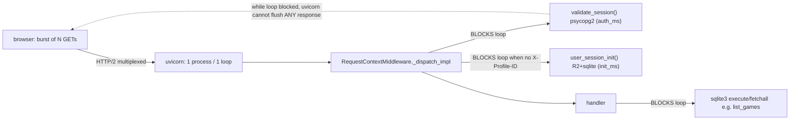
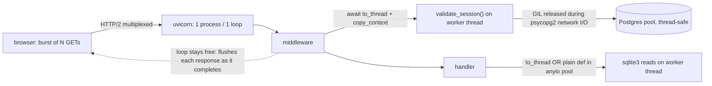

# T6200 — Design: Get blocking request-path I/O off the event loop

**Stage:** 2 (Architecture) — **DESIGN GATE, approval required before implementation.**
**Task file:** `docs/plans/tasks/T6200-concurrent-request-serialization.md` (Progress Log 2026-07-30 = confirmed diagnosis).
**Measurement phase:** DONE. Root cause CONFIRMED with evidence. This doc does not re-measure; it designs the fix on the established diagnosis.

---

## 1. Current State Analysis

### Concurrency model (confirmed)

- **One process, one event loop.** `src/backend/Dockerfile:23` runs `uvicorn app.main:app` with **no `--workers`** flag → a single uvicorn process with a single asyncio event loop. The Fly machine is 1 shared vCPU / 1024MB.
- **Blocking I/O runs directly on that loop for every authenticated request.** `RequestContextMiddleware._dispatch_impl` (`db_sync.py:562`) calls `validate_session(session_id)` synchronously at `db_sync.py:604` — not `await`ed, not offloaded. `validate_session` (`auth_db.py:140`) opens a Postgres connection (`get_auth_db()` → `get_pg()`, `auth_db.py:23`) and runs a blocking psycopg2 query (a JOIN on `sessions`/`users`, plus a second query when impersonating). This is the dominant serialization point.
- **When `X-Profile-ID` is absent, a second blocking call runs on the loop:** `user_session_init(user_id)` at `db_sync.py:693` (R2 download of user.sqlite + profile.sqlite + local sqlite). Normal clients send `X-Profile-ID`, so this is skipped on the hot path (`init_ms` ≈ 0), but it is on the loop when it does run.
- **`async def` data handlers also do blocking `sqlite3` on the loop.** `list_games` (`games.py:889`) is `async def` but runs `get_db_connection` + `cursor.execute` + `fetchall` synchronously (`games.py:904-928`) before it `await`s the presign gather. `list_projects`, `list_clips`, etc. are the same shape.
- **What already offloads correctly (the precedent to copy):** `_background_sync` runs every R2 upload via `asyncio.to_thread` (`db_sync.py:759, 995-1092`); `list_games`'s presign step uses `asyncio.gather(asyncio.to_thread(...))` (`games.py:937`); `bootstrap.py` runs its user.sqlite read group on a worker thread with `contextvars.copy_context()` so `get_current_user_id()` survives in the thread. The PG pool is a `ThreadedConnectionPool(minconn=2, maxconn=10)` (`pg.py:346`) — **already thread-safe**, so `validate_session` is safe to call from a worker thread today.

### Architecture diagram (current)



### Code smells identified

| Smell | Location | Impact |
|-------|----------|--------|
| Blocking I/O on the async event loop | `db_sync.py:604` (`validate_session`), `db_sync.py:693` (`user_session_init`) | Serializes the whole process; a burst of N drains together (the HAR fingerprint) |
| `async def` that does sync blocking work | `games.py:889-928` (`list_games`) + siblings | Same loop-block; the `async` keyword implies non-blocking but the body isn't |
| Inconsistent offload discipline | R2 uploads/presign already `to_thread`; auth + sqlite reads are not | Two code paths for "I/O in a handler"; the safe one exists but wasn't applied to the hot path |

### Current behavior (pseudo)

```pseudo
# concurrent burst of N authenticated GET /api/health
for each request (on the SINGLE loop, one at a time):
    validate_session(cookie)      # ~200-350ms blocking psycopg2 — LOOP IS BLOCKED
    # loop cannot advance ANY other request, cannot flush ANY finished response
run handler (health = trivial)
# all N responses flush only after the last validate_session returns
# → identical durations, finish within ~1ms of each other
```

### Evidence recap (from the task Progress Log — not re-measured here)

- Local loop-probe (`GET /api/test/loop-probe`, 200ms unit): `block` mode scales 227ms→1753ms across N=1..8 with finish-spread <1.4ms; `async`/`thread` modes stay flat ~210-230ms. The loop is the bottleneck and offloading fixes it.
- Staging warm `/api/health`: **anon** stays flat (~118ms at N=8); **authed** scales 358ms→**1271ms** at N=8 with 26ms finish-spread. The only per-request code difference between anon and authed is `validate_session` on the loop.
- Cold-start (auto_stop suspend, ~600ms) is real but **secondary** — prod runs `min_machines_running=1`, and the warm authed probe reproduces the signature with no resume.

---

## 2. Target Architecture + Fix Decision

### Target: keep ONE process; move request-path blocking I/O off the loop

The loop must never block on network/disk I/O. Every blocking call on the request path is either (a) offloaded to the default thread-pool executor via `asyncio.to_thread` while carrying the request's `contextvars`, or (b) — for handlers with no `await` between the blocking work and the response — converted from `async def` to plain `def` so FastAPI runs it in its anyio worker-thread pool.

### Target diagram



### Options evaluated

#### Option A — Offload request-path blocking I/O to threads (RECOMMENDED baseline)

Start with `validate_session`; then the hot blocking-sqlite reads in `async def` handlers.

- **Mechanism:** wrap the blocking call in `await asyncio.to_thread(...)`. psycopg2 and sqlite3 both **release the GIL during their I/O**, so calls on worker threads genuinely overlap (proven by the `thread` loop-probe column staying flat).
- **Blast radius:** minimal and local. Changing `validate_session`'s call site does not change its contract or return value; the middleware already tolerates the same exceptions (it catches `psycopg2.OperationalError/InterfaceError/PoolError` at `db_sync.py:605`, and those propagate identically out of a `to_thread` await). The PG pool is already a `ThreadedConnectionPool` (`pg.py:346`) — no pool change needed.
- **Keeps ONE process** → preserves the machine-global `_USER_WRITE_LOCKS` (`db_sync.py:215`) and the in-process version caches (`_user_db_versions`/`_user_sqlite_versions`) that the CAS/data-safety invariants depend on (persistence-sync.md §T4310/T4315). This is the decisive advantage over Option D.
- **Executor sizing (must address):** the default `asyncio` executor is `ThreadPoolExecutor(max_workers=min(32, os.cpu_count()+4))` → on 1 vCPU that is **5 threads**. Under a burst larger than 5 concurrent offloaded I/O calls, requests queue for a thread — a *smaller* serialization than today's N=1-on-the-loop, but still a cap. Decision: **set an explicit executor** sized for I/O-bound concurrency (e.g. `loop.set_default_executor(ThreadPoolExecutor(max_workers=32))` at startup in `lifespan()`), independent of vCPU count, because these threads are I/O-bound (GIL released) not CPU-bound. Bound it (not unbounded) so a pathological burst can't exhaust memory. **Correction (post-implementation):** an earlier draft of this line claimed the PG pool `maxconn=10` "naturally backpressures the DB-touching subset." That is FALSE — psycopg2's `ThreadedConnectionPool.getconn()` does not block; it RAISES `PoolError` the instant `len(_used) == maxconn`, which `db_sync` catches and turns into a 503. So 32 offload threads could 503 an authed burst >10. The real bound is a separate `threading.BoundedSemaphore(maxconn)` checkout gate in `pg.py` `get_pg()` (the single checkout path): threads WAIT for a free connection instead of racing getconn past the ceiling. Executor stays 32 (sqlite/R2 offloads need no PG connection); the PG subset is capped at `maxconn` by the gate.
- **ContextVar landmine (must address):** a bare `asyncio.to_thread` does **not** copy the caller's `contextvars`, so `get_current_user_id()` / `get_current_profile_id()` / `get_current_req_id()` would raise `RuntimeError: No user context set` inside the thread (exactly the bootstrap.py landmine, backend-services.md). Two safe patterns:
  - `validate_session` runs at `db_sync.py:604` **before** `set_current_user_id` (line 673), and takes only `session_id` as an arg — it reads no contextvar, so a bare `to_thread` is safe there. (Confirm during implementation: `validate_session` → `get_pg` touches no request contextvar.)
  - Handler-body offloads (list_games etc.) run **after** context is set and DO read contextvars → they MUST use the `contextvars.copy_context()` + `ctx.run(...)` pattern, mirroring `bootstrap.py`. Introduce ONE shared helper (e.g. `app/utils/offload.py: run_in_context(fn, *args)` that does `ctx = contextvars.copy_context(); return await asyncio.to_thread(ctx.run, fn, *args)`) so every call site uses the same correct pattern — DRY, and greppable.

#### Option B — Short-TTL in-process session cache for `validate_session` (COMPLEMENTARY, optional)

Cache `session_id → (validated dict, expiry)` for a short TTL (e.g. 5-15s) so a concurrent burst from the same session validates ONCE and the rest hit memory.

- **Effect:** cuts the *serialized constant itself*, not just its overlap — the burst in the HAR is 4 requests from ONE session, the exact case a per-session cache collapses to a single PG query.
- **Trade-off:** revocation latency. A logout / session invalidation / impersonation-expiry (`validate_session` writes an audit + `invalidate_session` on impersonation TTL, `auth_db.py:174-178`) would not take effect until the TTL lapses. Keep TTL short (≤15s) and **do not cache impersonation sessions** (they have their own TTL logic) — or skip B entirely for v1.
- **Recommendation:** Option A is sufficient to flatten the probe (the `thread` column already proves it). **Treat B as a follow-up optimization, not part of the first slice** — it adds a cache-invalidation surface (a new correctness axis) for a constant-factor win. Revisit only if post-A latency (~350ms constant) is still a product problem.

#### Option C — Convert hot `async def` DB handlers to plain `def` (PARTIAL applicability)

FastAPI runs a plain `def` path operation in its anyio thread pool (default 40 threads) automatically — no `to_thread` needed, and contextvars ARE propagated by anyio.

- **Where it works:** handlers whose entire body is synchronous.
- **Where it does NOT work:** handlers that `await`. `list_games` (`games.py:889`) awaits `_list_games_impl`, which `await asyncio.gather(...)`s the presign step (`games.py:937`) — it cannot be a plain `def`. For these, the correct move is Option A on the blocking prefix (the sqlite reads), leaving the existing `await` presign gather as-is.
- **Recommendation:** prefer C for genuinely sync handlers (simplest, zero new helper), fall back to A (`run_in_context` around the sqlite block) for handlers that must stay `async`. Decide per handler in the sweep slice, not upfront.

#### Option D — Naive `uvicorn --workers N` (REJECT)

- **OOM risk:** each worker reloads the whole app (FastAPI + the torch shim + boto3 + a fresh PG pool of up to 10 conns). On 1 shared vCPU / 1024MB, N workers multiply resident memory and PG connections → OOM / pool exhaustion.
- **Decisive correctness hazard:** `_USER_WRITE_LOCKS` (`db_sync.py:215`) is an **in-process** dict of `asyncio.Lock`s. With multiple worker processes it becomes **per-process, not per-machine** — two workers could hold "the lock" for the same user simultaneously and write that user's `profile.sqlite` concurrently. That is the exact CAS/last-write-wins data-loss hazard the lock exists to prevent (persistence-sync.md §T4310 invariant 4, §T4315). The in-process version caches (`_user_db_versions`) would likewise diverge per worker, defeating the restore-if-newer CAS baseline.
- **Verdict:** REJECT for this task. Multi-process is only viable AFTER moving the write lock + version cache out of process (e.g. Postgres advisory lock or Redis) AND a VM resize — a separate, larger epic, not a fix for T6200.

### Design principles applied

- [x] **DRY:** one shared `run_in_context()` offload helper; reuse the existing `to_thread`/`copy_context()` precedent rather than inventing a new mechanism.
- [x] **Single code path:** "blocking I/O in a request → offload it the same way everywhere" — no ad-hoc per-site variations.
- [x] **Minimal branches:** no new runtime branching; the fix is mechanical (wrap/flip), not conditional.
- [x] **Fix smell at source:** blocking-on-loop removed where it lives, not worked around.
- [x] **Preserve invariants:** ONE process kept → `_USER_WRITE_LOCKS` and version caches stay machine-global.

---

## 3. Scope & Sequencing

Two reviewable slices, each < ~200 lines of meaningful diff (Refactoring Rule 4).

### Slice 1 (FIRST, minimal, proves the fix) — offload `validate_session`

| File | Change |
|------|--------|
| `db_sync.py:604` | `session = validate_session(session_id)` → `session = await asyncio.to_thread(validate_session, session_id)` (bare `to_thread` is safe here — runs before context is set, reads no contextvar). Keep the existing `except (psycopg2...)` around the `await`. |
| `app/main.py` `lifespan()` | Set an explicit bounded I/O executor: `loop.set_default_executor(ThreadPoolExecutor(max_workers=32, thread_name_prefix="io"))` before yield; shut it down after. Sizes for I/O concurrency independent of the 1-vCPU default of 5. |

Then re-run the probe (Section 4). Expectation: authed `/api/health` flattens across N (matches the anon curve). This slice alone should kill the HAR fingerprint.

### Slice 2 (SECOND, the sweep) — offload hot blocking-sqlite handler reads

Introduce the shared helper and apply it to the hot data endpoints.

| File | Change |
|------|--------|
| `app/utils/offload.py` (new) | `async def run_in_context(fn, *args)` = `ctx = contextvars.copy_context(); return await asyncio.to_thread(ctx.run, fn, *args)`. Single greppable offload primitive for handler bodies that read contextvars. |
| `games.py:904-928` | Wrap the sqlite read block (`get_db_connection` … `fetchall`) of `_list_games_impl` in `run_in_context(...)`; leave the existing `await asyncio.gather(... to_thread(presign) ...)` unchanged. |
| `projects.py`, `clips.py` (list handlers) | Same treatment for the equivalently hot blocking-sqlite reads. Per handler: if it has NO `await`, prefer Option C (flip `async def` → `def`); if it awaits, use `run_in_context`. |

Scope guard: Slice 2 touches only the *hot* read handlers established by the HAR (games, clips list, projects list, playback-url path). Do NOT sweep every router in this task — that is scope creep; file a follow-up if a broad audit is wanted.

### Out of scope (explicit)

- The `playback-url` endpoint's own 1.4s intrinsic cost (task step 7 — a separate follow-up once serialization is excluded).
- Option B session cache (follow-up, if A's constant is still a problem).
- Multi-process / VM resize (Option D — requires moving the write lock first).
- `user_session_init` on the loop (`db_sync.py:693`): only runs when `X-Profile-ID` is absent (rare on the hot path). Offloading it is a natural Slice-2 addition IF the probe with `--no-profile` shows it matters; otherwise defer. Note the T4315 landmine — `session_init`'s pending-share block already runs on a background daemon thread, so keep the offload read-only and don't disturb that.

---

## 4. Verification Plan

The committed, repeatable probe artifacts (`scripts/concurrency_probe.py` + `GET /api/test/loop-probe` in `test_seams.py`) are the pass/fail gate. A fix must re-pass them.

1. **Primary acceptance (the flatten):**
   ```
   python scripts/concurrency_probe.py --path /api/health --cookie "<real rb_session>" --base <staging>
   ```
   PASS = authed per-request duration stays ~flat across N=1,2,4,8 (tracks the anon ~118ms curve), NOT scaling to ~1271ms at N=8. Before-fix numbers are recorded in the task Progress Log; attach the after-fix table to the log.
2. **Loop-probe regression baseline (unchanged artifact):** `--mode block` still demonstrates the loop-block property (the seam intentionally blocks); the fix does not touch the seam. This confirms the probe still discriminates.
3. **Handler sweep check (Slice 2):** `--path /api/games --cookie <real>` (or `--no-profile` to also exercise `user_session_init`) stays flat across N.
4. **Fresh browser HAR** on project open (acceptance criterion): `playback-url` no longer waits behind the other three; first R2 byte lands sooner. Attach HAR delta.
5. **Backend tests pass** (`run_tests.py`) — especially any auth/session tests; the `to_thread` wrap must not change `validate_session`'s observable behavior.

### Perf guard (make the property durable)

Add a lightweight test that asserts the flatten property WITHOUT a live network, mirroring the loop-probe philosophy: drive the middleware (or a thin harness) with a `validate_session` stub that `time.sleep`s, fire N concurrent requests through the app, and assert wall-time ≈ single-request time (overlap), not N×. This is the state-based, disk/speed-independent style the repo already prefers (backend-services.md T6070 note — assert the property, never a wall-clock threshold on real I/O). Gate it so it can't silently regress if someone re-inlines a blocking call.

### Instrumentation — what stays, what goes

- `GET /api/test/loop-probe` is already gated non-prod (`_require_seams_enabled`, mounted only in non-prod at `main.py:173-177`) → **keep as-is**; it is the permanent repeatable probe. No prod exposure.
- The middleware `[REQ_TIMING]` line (`db_sync.py:549`, with `auth_ms`/`init_ms`/`handler_ms`/`inflight`) already exists and is the durable attribution signal → **keep**. After the fix, `auth_ms` should drop out of the critical serialized path (it's now on a worker thread), and `inflight_exit` should show real overlap.
- No new permanent instrumentation is required.

---

## 5. Risks

| Risk | Likelihood | Mitigation |
|------|-----------|------------|
| **ContextVar lost in thread** (`get_current_user_id()` raises inside `to_thread`) | High if done naively | `validate_session` offload is bare-safe (pre-context, no contextvar read). All handler-body offloads go through the single `run_in_context()` helper (`copy_context()` + `ctx.run`), the proven bootstrap.py pattern. Covered by a test that asserts context is readable in the offloaded fn. |
| **GIL contention on 1 vCPU** | Low for I/O; real for CPU | psycopg2/sqlite3 release the GIL during network/disk I/O, so I/O-bound offloads genuinely overlap (the `thread` probe column proves it). Do NOT offload CPU-bound work to these threads — it would serialize on the GIL anyway. Slice scope is strictly I/O calls. |
| **Executor exhaustion under load** | Medium | Explicit bounded executor (max_workers=32) instead of the vCPU-derived default of 5. Bounded (not unbounded) so a burst can't OOM. Monitor `inflight` gauge in `[REQ_TIMING]`. |
| **PG pool exhaustion → 503 under authed burst** | High (regression the executor bump introduced) | `ThreadedConnectionPool.getconn()` does NOT block when full — it RAISES `PoolError` at `len(_used) == maxconn`, which `db_sync` turns into a 503. With 32 offload threads, a burst of >10 concurrent authed requests would 503 where it previously merely queued on the loop. Fix: a `threading.BoundedSemaphore(maxconn)` checkout gate in `pg.py` `get_pg()` (structurally enforced in the single checkout path) makes threads WAIT for a free connection instead of racing getconn. Regression test drives N > maxconn concurrent authed requests and asserts zero 503s. |
| **Ordering vs the per-user write lock** | Low | `validate_session` and the read offloads run OUTSIDE `_maybe_write_lock` (auth is at :604, before the lock at :716; reads take no lock). The lock's invariant — commit before release, serialized writers — is untouched. Do not offload anything that mutates DB state out from under the lock. |
| **Interaction with T4960 PG idle-ping** | Low | `get_pg()`'s pre-checkout `SELECT 1` idle-ping (`pg.py`) runs inside the pool checkout, which now happens on a worker thread — that is fine and in fact better (the ping's latency also leaves the loop). The `ThreadedConnectionPool` is thread-safe; concurrent checkouts from multiple worker threads are exactly what it's for. `maxconn=10` IS the ceiling under a large authed burst — but the checkout gate (see the PG-pool-exhaustion row above) makes threads WAIT at it rather than 503, so raising maxconn is a latency tuning knob (fewer waits), not a correctness requirement, and would still need a Postgres `max_connections` + VM headroom check first. |
| **Behavior change in `validate_session`** | Low | Pure call-site wrap; return value, exceptions, and impersonation logic unchanged. Existing auth/session tests are the regression net. |
| **Scope creep from the handler sweep** | Medium | Slice 2 limited to the HAR-established hot endpoints; broad router audit is a separate follow-up. Reviewable units < 200 lines each. |

---

## 6. Open Questions (for the approver)

- [ ] **Slice 2 in this task or split out?** Slice 1 (offload `validate_session` + executor) alone should flatten the probe. Proposal: land Slice 1, prove the flatten, then decide whether Slice 2's handler sweep rides the same task or becomes a fast-follow. (Recommendation: same task if the probe still shows a residual handler-driven curve; otherwise fast-follow.)
- [ ] **Executor size (32)** — acceptable default, or prefer a smaller cap given the 1024MB machine? Threads are cheap (I/O-bound, ~8MB stack each) but PG-touching ones are already capped at 10 by the pool; 32 is a headroom number, tunable.
- [ ] **Option B (session cache)** — defer as recommended, or include a minimal 5s TTL now to cut the ~350ms constant? (Adds a revocation-latency correctness surface; recommend defer.)
- [ ] **`user_session_init` offload** — include the `--no-profile` path in Slice 2, or leave it (rare on the hot path)?
