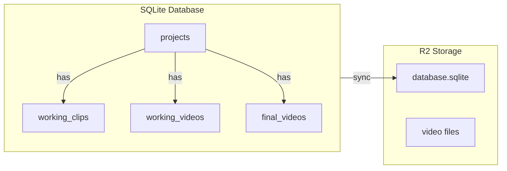
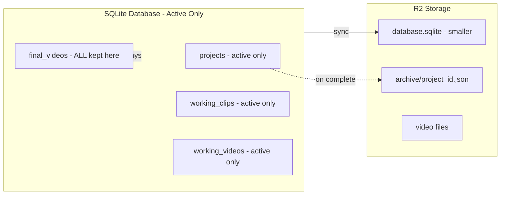

# T66 Design: Database Completed Projects Split

**Status:** APPROVED
**Author:** Architect Agent
**Approved:** 2026-02-11
**Approach:** JSON Archive in R2

## Current State ("As Is")

### Data Flow


### Current Behavior
```pseudo
when project completes (final_video created):
    set projects.final_video_id = new_final_video.id
    all data remains in database
    database syncs to R2 (grows over time)

when user opens gallery:
    query final_videos table
    display list with folder icons

when user clicks folder icon:
    currently: opens source game (for annotated exports)
    no action for regular projects
```

### Limitations
- Database grows unbounded with completed projects
- 70.8% of database is completed project data (validated)
- `highlights_data` alone is 453KB (50%+ of DB)
- Completed projects rarely accessed but always loaded

## Target State ("Should Be")

### Updated Flow


### Target Behavior
```pseudo
when project completes (final_video created):
    serialize project data to JSON:
        - project row
        - working_clips for project
        - working_videos for project (with highlights_data, etc.)
    upload JSON to R2: {user_id}/archive/{project_id}.json
    delete from DB: project, working_clips, working_videos
    keep in DB: final_videos row (for gallery listing)
    sync smaller database to R2

when user opens gallery:
    query final_videos table (unchanged)
    display list with folder icons

when user clicks folder icon on completed project:
    fetch archive JSON from R2
    restore project data to DB (project, working_clips, working_videos)
    delete archive JSON from R2
    navigate to project in editor
    (project is now "active" again, normal DB sync)

when user re-exports restored project:
    creates new final_video (or new version)
    archives project again
    cycle continues
```

## Implementation Plan

### Phase 1: Archive on Complete

#### Backend Changes

**New file: `src/backend/app/services/project_archive.py`**
```pseudo
def archive_project(project_id: int, user_id: str):
    # 1. Gather all project data
    project = get_project(project_id)
    working_clips = get_working_clips(project_id)  # all versions
    working_videos = get_working_videos(project_id)  # all versions

    # 2. Build archive JSON
    archive = {
        "archived_at": now(),
        "project": project_to_dict(project),
        "working_clips": [clip_to_dict(c) for c in working_clips],
        "working_videos": [video_to_dict(v) for v in working_videos],
    }

    # 3. Upload to R2
    r2_key = f"{user_id}/archive/{project_id}.json"
    upload_json_to_r2(r2_key, archive)

    # 4. Delete from DB (order matters for FK constraints)
    delete_working_clips(project_id)
    delete_working_videos(project_id)
    delete_project(project_id)
    # Note: final_videos stays - no FK cascade issue

def get_archive_url(project_id: int, user_id: str) -> str:
    r2_key = f"{user_id}/archive/{project_id}.json"
    return generate_presigned_url(r2_key)
```

**Modify: `src/backend/app/routers/overlay.py`** (export endpoint)
```pseudo
# After creating final_video and setting project.final_video_id:
+ archive_project(project_id, user_id)
```

#### Files to Modify

| File | Change |
|------|--------|
| `src/backend/app/services/project_archive.py` | New file - archive/retrieve logic |
| `src/backend/app/routers/overlay.py` | Call archive after export completes |
| `src/backend/app/storage.py` | Add `upload_json_to_r2()` helper |

### Phase 2: Restore from Gallery

#### Backend Changes

**Add to: `src/backend/app/services/project_archive.py`**
```pseudo
def restore_project(project_id: int, user_id: str) -> int:
    # 1. Download archive JSON from R2
    r2_key = f"{user_id}/archive/{project_id}.json"
    archive = download_json_from_r2(r2_key)

    # 2. Insert data back into DB
    insert_project(archive["project"])
    for clip in archive["working_clips"]:
        insert_working_clip(clip)
    for video in archive["working_videos"]:
        insert_working_video(video)

    # 3. Delete archive from R2
    delete_from_r2(r2_key)

    return project_id
```

**Modify: `src/backend/app/routers/gallery.py`** (or downloads.py)
```pseudo
@router.post("/api/gallery/{final_video_id}/restore-project")
def restore_project_from_archive(final_video_id: int):
    # Get project_id from final_video
    final_video = get_final_video(final_video_id)
    project_id = final_video.project_id

    # Restore from archive to DB
    restore_project(project_id, user_id)

    # Return project_id for navigation
    return {"project_id": project_id}
```

#### Frontend Changes

**Modify: `src/frontend/src/screens/GalleryScreen.jsx`**
```pseudo
when folder icon clicked:
    if item.source_type == 'annotated_game':
        open game (existing behavior)
    else:
        # New: restore and open project
        result = await api.post(`/api/gallery/${item.id}/restore-project`)
        navigate to `/project/${result.project_id}`
```

#### Files to Modify

| File | Change |
|------|--------|
| `src/backend/app/services/project_archive.py` | Add `restore_project()` |
| `src/backend/app/routers/gallery.py` | New endpoint to restore project |
| `src/frontend/src/screens/GalleryScreen.jsx` | Folder click → restore → navigate |

### Phase 3: Stale Restore Cleanup

#### Backend Changes

**Add column to projects table (migration in database.py)**
```pseudo
ALTER TABLE projects ADD COLUMN restored_at TIMESTAMP DEFAULT NULL
```

**Modify restore logic in `project_archive.py`:**
```pseudo
def restore_project(project_id: int, user_id: str):
    # ... existing restore logic ...
    # Set restored_at timestamp after insert
    UPDATE projects SET restored_at = CURRENT_TIMESTAMP WHERE id = ?
```

**Clear restored_at on any project edit (in relevant routers):**
```pseudo
# In any endpoint that modifies project data (clips, overlays, etc.)
UPDATE projects SET restored_at = NULL WHERE id = ?
```

**Add startup cleanup in `project_archive.py`:**
```pseudo
def cleanup_stale_restored_projects(user_id: str):
    # Find projects restored > 48 hours ago that weren't edited
    stale_projects = SELECT id FROM projects
        WHERE restored_at IS NOT NULL
        AND restored_at < datetime('now', '-48 hours')

    for project_id in stale_projects:
        archive_project(project_id, user_id)
```

**Call cleanup on app startup (in main.py or database init):**
```pseudo
# During database initialization / first request
cleanup_stale_restored_projects(user_id)
```

#### Files to Modify

| File | Change |
|------|--------|
| `src/backend/app/database.py` | Add `restored_at` column |
| `src/backend/app/services/project_archive.py` | Add cleanup logic, set timestamp on restore |
| `src/backend/app/routers/framing.py` | Clear `restored_at` on edit |
| `src/backend/app/routers/overlay.py` | Clear `restored_at` on edit |
| `src/backend/app/main.py` | Call cleanup on startup |

### Phase 4: Remove Completed Filter

#### Frontend Changes

**Modify: `src/frontend/src/components/ProjectFilters.jsx`**
```pseudo
- statusFilter options: ['all', 'uncompleted', 'completed']
+ statusFilter options: ['all']  // or remove filter entirely
```

**Modify: `src/frontend/src/stores/settingsStore.js`**
```pseudo
- statusFilter: 'uncompleted' | 'completed' | 'all'
+ statusFilter: 'all'  // Only option, or remove field
```

| File | Change |
|------|--------|
| `src/frontend/src/components/ProjectFilters.jsx` | Remove completed option |
| `src/frontend/src/stores/settingsStore.js` | Update default, remove option |

## Database Schema Changes

### New Column: `projects.restored_at`

```sql
ALTER TABLE projects ADD COLUMN restored_at TIMESTAMP DEFAULT NULL
```

| Column | Type | Default | Description |
|--------|------|---------|-------------|
| `restored_at` | TIMESTAMP | NULL | When project was restored from archive. NULL = active project or never restored. Set on restore, cleared on any edit. |

**Behavior:**
- `NULL` → Normal active project (or restored and edited)
- `<timestamp>` → Restored from archive, not yet edited
- On startup, if `restored_at` is set AND older than 48 hours → re-archive

### Tables Affected by Archive/Restore

| Table | On Archive | On Restore |
|-------|------------|------------|
| `projects` | Row deleted | Row inserted, `restored_at` set |
| `working_clips` | Rows deleted | Rows inserted |
| `working_videos` | Rows deleted | Rows inserted |
| `final_videos` | **Kept in DB** | Already exists |

## Archive JSON Schema

```json
{
  "version": 1,
  "archived_at": "2026-02-11T15:30:00Z",
  "project": {
    "id": 42,
    "name": "My Project",
    "aspect_ratio": "9:16",
    "working_video_id": 67,
    "final_video_id": 83,
    "is_auto_created": 0,
    "created_at": "2026-02-10T10:00:00Z",
    "last_opened_at": "2026-02-11T14:00:00Z",
    "current_mode": "overlay"
  },
  "working_clips": [
    {
      "id": 101,
      "project_id": 42,
      "raw_clip_id": 5,
      "version": 1,
      "crop_data": "{...}",
      "timing_data": "{...}",
      "segments_data": "{...}",
      "exported_at": "2026-02-11T12:00:00Z"
    }
  ],
  "working_videos": [
    {
      "id": 67,
      "project_id": 42,
      "filename": "working_42_v1.mp4",
      "version": 1,
      "highlights_data": "{...large JSON...}",
      "text_overlays": "[]",
      "duration": 45.5,
      "effect_type": "original",
      "overlay_version": 3,
      "highlight_color": "#FF0000"
    }
  ]
}
```

## Risks

| Risk | Mitigation |
|------|------------|
| Archive fails mid-export | Archive after final_video confirmed; if archive fails, log error but don't block user |
| R2 unavailable when restoring | Show error message; user can still download final video |
| Restore fails mid-operation | Wrap in transaction; if insert fails, don't delete archive |
| Large archive files | Compress JSON with gzip; highlights_data is already JSON strings |
| Schema changes over time | Include `version` field in archive; migration logic if needed |
| ID conflicts on restore | Use original IDs; if conflict, project was never properly archived |

## Design Decisions

- **Re-edit strategy**: Restore to DB when user opens archived project
  - User clicks folder in gallery → project restored to DB → archive deleted
  - Project gets `restored_at = now()` timestamp
  - Normal DB sync while editing
  - On any edit: `restored_at` cleared to NULL (now a "real" active project)
  - On export: project re-archived (normal flow)
  - On app startup: check for projects with `restored_at` older than 48 hours → re-archive them
  - Keeps DB clean even if user just peeked at old project and closed tab

## Migration

For existing completed projects:
1. One-time migration script to archive all completed projects
2. Run after deployment, before users notice
3. Script: query all projects with final_video_id, archive each, delete from DB

```pseudo
for project in get_completed_projects():
    archive_project(project.id, user_id)
print(f"Archived {count} projects, run VACUUM to reclaim space")
```

## Acceptance Criteria

- [ ] Completing a project archives data to R2 JSON
- [ ] Archived project data deleted from active DB
- [ ] final_videos row remains in DB (gallery works)
- [ ] Gallery folder icon restores project to DB and navigates to editor
- [ ] Archive JSON deleted after restore
- [ ] Restored project gets `restored_at` timestamp
- [ ] Any edit clears `restored_at` to NULL
- [ ] App startup re-archives projects with `restored_at` older than 48 hours
- [ ] Project filter no longer shows "completed" option
- [ ] Migration script for existing completed projects
