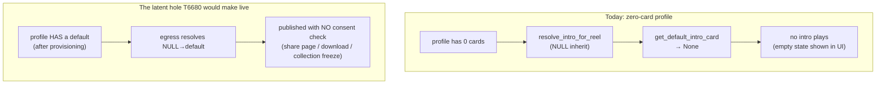
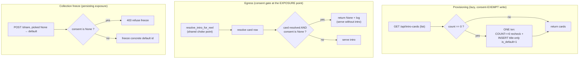

# T6680 — Default Athlete Intro Card provisioning — Design (Stage 2)

**Task:** [T6680](player-intro/T6680-default-athlete-intro-card-provisioning.md) — every profile has a usable default Athlete Intro Card before the user builds one.
**Tier:** L (Architecture design gate). **Epic:** [Player Intro + Rich Text](player-intro/EPIC.md).
**Status of this doc:** awaiting user approval. No source code is written until approved.

This doc **decides** all four open questions the task raised; it does not hand them onward. Where a
question touches compliance, the decision was pre-resolved by the Opus expert and is encoded here as
a verdict, not re-litigated.

---

## 1. Current State

### 1.1 What exists today

A profile has **zero** intro cards until a user explicitly creates one. The empty-library state
(`IntroCardGrid.jsx:24-28`, `IntroCardCarousel.jsx:141-143`, reworded by T6660 to *"No Athlete Intro
Cards yet. Create one to open a reel with your player."*) is the starting point for every profile.
Nothing plays before any reel or collection until that first card exists.

### 1.2 The resolution + egress machinery (verified 2026-08-09, corrects two stale task-file refs)

The NULL/0 resolver did **not** move to `intro_egress.py`. It lives in `services/intro_cards.py`:

| Symbol | Location | Role |
|---|---|---|
| `resolve_intro_card_id(...)` | `intro_cards.py:195-235` | **Pure** resolution order. `0 → None`; `<id> → id`; `NULL → default_id` **iff** `reel_duration ≥ min_duration` (duration-gated), else `None`. |
| `get_default_intro_card(cursor)` | `intro_cards.py:245-251` | `SELECT * FROM intro_cards WHERE is_default = 1 LIMIT 1`. |
| `resolve_intro_card(...)` | `intro_cards.py:303-339` | DB-backed: loads default + `get_intro_min_duration`, applies the pure resolver, fetches the resolved row. Read-only. |
| `resolve_intro_for_reel(...)` | `intro_egress.py:141` | T5220 **cross-DB shared egress resolution point** (`mode="burn"|"playback"`). Delegates to `resolve_intro_card`. **Never raises** — every failure degrades to `None` (epic decision 9). This is the shared choke point for the LIVE egress paths. |

The **three LIVE egress paths** that resolve a card at serve time, all through `resolve_intro_for_reel`:

1. **Owner download burn** — `downloads.py:719` `_resolve_download_intro()` → `resolve_intro_for_reel`.
2. **Single-reel share** (playback + download) — same helper, `mode="playback"`/`"burn"`.
3. **Reel share page (public)** — `shares.py:270` passes the reel's live `intro_card_id`.

The **FROZEN** collection path is different (T5215): at **share creation** (`collections.py:1086-1102`)
the picker choice is frozen to a **concrete** value (a real id, or `0`). When the user picked "use my
default" (`intro_card_id is None`), `collections.py:1092-1094` calls `get_default_intro_card` and
freezes that **concrete default id** into the public share definition. At **playback**,
`_evaluated_share_members` (`collections.py:866-899`) re-resolves that already-concrete frozen id via
`resolve_intro_card(frozen_id, reel_duration=None, ...)` — it never re-inherits NULL, so playback
reads exactly what freeze stored.

### 1.3 The consent gates today (per-profile KV `intro_consent_at.{profile_id}`)

`get_intro_consent(user_id, profile_id)` (`user_db.py:558-566`) reads the KV; `None` = never consented.

| Gate | Location | Fires on |
|---|---|---|
| Create card | `intro_cards.py:204-211` (router only; service has no gate) | any create, unconditionally → 403 |
| Reel attach (PATCH) | attach handler | an **explicit non-null, non-zero** id pick |
| Collection freeze | `collections.py:1079-1084` | an **explicit non-null, non-zero** id pick |

**The hole (expert-confirmed, high confidence).** The attach/freeze gates fire ONLY on an explicit
non-null, non-zero pick. `None` ("use my default") and `0` ("no intro") are **deliberately never
gated**. So a `NULL`-inherit reel resolves to the profile's `is_default=1` card and rides **every
egress with no consent check**:

- Reel share page (`shares.py:270`) — public, no consent check.
- Owner/share download burn (`downloads.py:719`) — no consent check.
- **Collection freeze** (`collections.py:1092`, the persisting one) — freezes the concrete default id
  into a public share definition with the `:1079` guard **skipped** because `d.intro_card_id is None`.

Today this hole is **latent**: a zero-card profile's default resolves to *nothing*, so no exposure
happens. **The moment T6680 auto-provisions a default, the hole becomes live** — a title-only card
carrying a minor's full name would publish on any share with no recorded parental authority.

### 1.4 Content shape a default would use

`derive_composition(has_photo, shown_fields)` (`intro_cards.py:64-84`): **no photo OR 0 facts →
`title-only`**. A title-only card renders its title from the profile's `intro_full_name.{profile_id}`
KV (typed in `ProfileIntroSection`, a separate consent-free flow). `intro_egress._load_field_values`
(`intro_egress.py:74-84`) omits `full_name` cleanly when unset (no placeholder string). `first-card
becomes default` is enforced atomically at insert time (`intro_cards.py:249-252`), and delete
auto-promotes the newest (`intro_cards.py:389-397`).

### 1.5 Architecture diagram — current



---

## 2. Target State

A profile with zero cards is **lazily provisioned** — on the first read of its card library — with a
single private `is_default=1` **title-only** row (`shown_fields=[]`, `image_key=NULL`), whose rendered
title comes from `intro_full_name`. The write is consent-exempt (it is not an exposure event). The
consent decision moves from "explicit pick" to **"will this egress EXPOSE a card"**, enforced
**structurally in the shared resolver** `resolve_intro_for_reel` and at the **collection freeze** —
the two places a resolved card leaves the profile. An un-consented default therefore **degrades to
no-intro** on every egress (epic decision 9) instead of publishing a minor's name.



---

## 3. Decisions

### Decision 1 — Consent on auto-create: **WRITE is exempt; gate the EXPOSURE, in the shared resolver.**

**Decision.**
1. **Auto-provisioning the default row is consent-exempt.** A private title-only row
   (`is_default=1, shown_fields=[], image_key=NULL`) is not an exposure event. The user-gesture
   create endpoint keeps its 403 consent gate unchanged (`intro_cards.py:204-211`).
2. **Move the consent check to the exposure point.** Enforce **structurally** in the shared resolver
   `resolve_intro_for_reel`: after a card resolves, if it would be exposed and the profile has no
   `intro_consent_at`, resolve to `None` (serve without intro) and log. This covers all three LIVE
   egress paths at once (owner download, single-reel share playback/download, reel share page),
   because every one routes through that helper — a new egress call site cannot skip the gate
   (mirrors CLAUDE.md's T4315 "enforce in the shared path" rule). It degrades gracefully per epic
   decision 9 (intro failure never sinks a download/share).
3. **Also gate the collection default-freeze** at `collections.py:1092`: before freezing a resolved
   default into a public share definition, require consent; refuse with 403 otherwise. This is the
   one path that **persists** an exposure into a durable public link, so it must fail loud at the
   gesture, not silently drop the intro.
4. **Do not weaken** `test_create_card_blocked_without_consent` — it guards the user-gesture create
   path and is still correct. Add new interaction tests (see §6) asserting each egress refuses to
   expose the auto-default when consent is `None`.

**Reasoning.** T5230's compliance posture (EPIC.md § Compliance posture) names the real risk as
**PUBLIC EXPOSURE, not storage** — "The real risk is PUBLIC EXPOSURE, not storage." A private row is
storage; publishing a minor's name is exposure. The task file's "consent-exempt because private until
explicitly attached" reasoning is **wrong** on its own terms: `NULL`-inherit is exactly the path that
publishes a default with **no** explicit attach gesture, so "until explicitly attached" never fires.
Putting the gate at the resolver is the only place that catches all of burn, playback, and freeze
without depending on each future call site remembering to check. The guard test's historical
"no row" assertion was a valid proxy for "no exposure" **only while a zero-card profile's default
resolved to nothing** — provisioning breaks that proxy, so the invariant must be restated as
"no un-consented PUBLIC EXPOSURE" and enforced where exposure happens.

**Collection playback double-gate check (expert caveat, resolved).** `_evaluated_share_members`
(`collections.py:890-892`) re-resolves the **frozen concrete id** (never NULL) via
`resolve_intro_card` — a plain row fetch, not `resolve_intro_for_reel`, so the new resolver gate does
**not** fire on the frozen playback path. That is correct and intentional: gating the **freeze**
(Decision 1.3) means a consent-less default is **never frozen into a link in the first place**, so
playback inherits the gate structurally and there is no frozen-but-consent-less link left to read.
No double-gating, no leak. (If consent is later **revoked** after a valid freeze, the frozen link
keeps its already-consented card — revocation-driven purge of existing shares is T5230's retention
job, explicitly out of scope here.)

**Rejected alternatives.**
- *Gate the `None` pick at attach time.* Would 403 a user who just wants their default on a reel, and
  still miss the burn/playback/freeze paths that never route through attach. Expert-flagged as wrong.
- *Consent-gate the auto-create write.* Would either block provisioning for every un-consented
  profile (defeating the feature — every profile should get a default) or require a synthetic consent
  record (fabricating parental authority — a compliance falsehood).
- *Add the check independently at each of the 3 egress call sites.* Duplicated logic (DRY violation)
  and a new call site would silently skip it — the exact multiple-code-paths smell the shared-resolver
  choke point exists to prevent.

### Decision 2 — Existing zero-card profiles: **lazy provisioning on read, ONE site, ONE transaction.**

**Decision.** Provision lazily, at **exactly one site**: the card-list read
`list_intro_cards` (`intro_cards.py:167-178`). When the profile's `intro_cards` table exists and
`COUNT(*) == 0`, create the default row **inside one transaction** that re-checks the count and
inserts, mirroring the atomic first-card-default logic at `intro_cards.py:249-252`. No migration
backfill; **no** Migration agent.

**Idempotency / concurrency.** The count-check and insert run in a **single transaction** so two
concurrent `GET`s cannot both insert a default. The insert sets `is_default = 1` directly (the row is
provably the only one, since we hold the transaction and just saw `COUNT == 0`), reusing the same
"first card is default" invariant already proven at `:249-252`. Below-head DBs (table absent,
pre-v034 deploy→migrate window) are left untouched — `list_intro_cards` already returns `{"cards": []}`
there (`:173-175`), and provisioning simply does not run until the table exists. This adds **no new
migration** and **no schema change**.

**Reconciling with the persistence rule (addressed head-on).** CLAUDE.md bans **reactive frontend
persistence** — a `useEffect` watching state and writing to the backend as a side effect of state
changing. Lazy provisioning is **not** that. It is a **server-side, read-triggered creation** at a
single named API entry point (`GET /api/intro-cards`), analogous to a get-or-create: the "gesture" is
the user opening their card library, a real user action, not a reactive watcher. It is **not** a
background job, **not** a frontend effect, and **not** a write-back during a *restore* read (the banned
T350 pattern). The banned pattern corrupts data by persisting runtime fixups that then re-fix on every
load; here there is no fixup and no feedback loop — once the row exists, `COUNT == 0` is false forever,
so the write happens **at most once per profile** and never re-fires. It is a **single write path** for
this datum (no second provisioning site), satisfying "one canonical write path per data."

**Reasoning.** Lazy wins on cost and safety: no data-walk over every profile, no data-writing
migration, and it self-heals for profiles created before OR after the task with identical code. A
migration backfill would be a **data-writing migration touching every profile** — heavier, and
`.claude/skills/migration.md` conventions push migrations to be self-sufficient transforms of existing
data, not fabricators of brand-new rows for profiles that may never open the intro UI. Choosing the
**list read** as the single site (rather than also provisioning inside an egress resolver) avoids two
write paths and keeps the write attributable to a real user visiting the intro library, not to an
anonymous public share-page hit resolving a stranger's profile.

**Why not provision inside `resolve_intro_for_reel`.** That helper runs on **public share-page reads**
for the *sharer's* profile under a request carrying no owner context, and it is explicitly read-only
(opens a **read-only** connection, `intro_egress.py:186`). Writing there would (a) create a second
write path, (b) attempt a write on a read-only connection, and (c) provision a default as a side
effect of a stranger viewing a share — conceptually wrong. Egress stays read-only; the default is
provisioned when the **owner** opens their library, and the egress gate (Decision 1) handles the case
where an owner shares before ever opening it (resolves to no-intro until they do).

**Rejected alternative — migration backfill.** More predictable (one row per profile, deterministic),
but: a data-writing migration over every profile DB; must itself decide consent shape and title
source per profile; and it provisions cards for dormant profiles that will never use them. Rejected
for cost and for adding a Migration-agent stage this task otherwise does not need.

### Decision 3 — Resolution semantics (epic decision 8): **unchanged.**

**Decision.** `resolve_intro_card_id` (`intro_cards.py:195-235`) is **not touched**. `0` (explicit
opt-out) still → `None` at any duration. The `NULL → default` inheritance stays **duration-gated**:
NULL resolves to the default only when `reel_duration ≥ get_intro_min_duration` (default 20s), else
`None`. `test_null_inherit_no_default_is_none` (passing `default_id=None` directly) remains valid — it
exercises the pure resolver, which is unchanged.

**Reasoning + the nuance that is NOT a regression.** After provisioning, "a profile always has a
default" is true, but that does **not** mean "NULL always resolves to something." NULL resolves to the
default **only for reels at or above the duration threshold**; short reels (and reels with an unknown
duration — logged as an internal data bug) still resolve to no-intro. This is existing, deliberate
behavior (short reels probably don't want a ~4s card in front of them), and the task must state it so a
reviewer does not read "every profile has a default now" as "every NULL reel suddenly grows an intro."
`0` is entirely untouched. **No change to the resolver, no test changes to the NULL/0 suite.**

### Decision 4 — Default content shape: **title-only, name from `intro_full_name`; empty-name renders acceptably (verify live).**

**Decision.** The provisioned default is **title-only**: `shown_fields=[]`, `image_key=NULL`,
`image_cutout_key=NULL`, `focal_x/y`/`zoom` at their neutral stored defaults, `duration` at the
service default, `treatment` at the default treatment, `text_elements` empty. Its rendered title is
the profile's `intro_full_name.{profile_id}` KV — read at **render/egress time**, not copied into the
row (single canonical location per datum; a name change edits one place and every render follows).
`name` (the library label, never shown on the card) is a fixed non-empty literal so list/serialization
never sees a blank label.

**When `intro_full_name` is also empty.** `_load_field_values` omits `full_name` with no placeholder
(`intro_egress.py:82-83`), and `derive_composition([]) → title-only`. So a name-less default renders a
**title-only card with an empty title line** — motion/treatment still play, just no text. This is
acceptable per epic decision 9 (non-fatal, never a placeholder like "Athlete"). **This is the one AC
that needs a live visual check** — confirm the title-only composition with zero facts AND no name
degrades to a clean card (no broken layout, no literal placeholder), not just that it doesn't crash.
No synthetic/fabricated name is written — inventing "Player" or the profile slug would be inserting
data we don't have (violates "correct data, not workarounds").

**Reasoning.** Title-only is the only shape a system-provisioned card can honestly take: no photo
exists to attach (and attaching one would be an exposure/biometric-adjacent decision the system must
never make), and there are no facts to show. Reading the title live rather than snapshotting it keeps
`intro_full_name` the single source of truth. `derive_composition` already collapses "no photo or 0
facts" to title-only, so no new composition branch is needed.

---

## 4. Implementation Plan

**Provisioning is the write; the egress gate + freeze gate are the compliance half.** Sequence them so
the gate lands **in the same task as** the write that makes the hole live (never provision without the
gate).

### 4.1 Files & sequence

| # | File | Change |
|---|---|---|
| 1 | `services/intro_cards.py` | New helper `provision_default_card_if_absent(cursor)` — count-check + title-only insert + `is_default=1`, transaction-safe. Contains **no biometric terms** (guardrail, see §5). |
| 2 | `routers/intro_cards.py` `list_intro_cards` (`:167-178`) | Call the helper inside the existing `with get_db_connection()` block, guarded by `not _table_missing(cursor)`, then re-select the list so the provisioned card is returned in the same response. |
| 3 | `services/intro_egress.py` `resolve_intro_for_reel` | After `resolve_intro_card` returns a card, if `card is not None` and `get_intro_consent(user_id, profile_id) is None`, log and return `None` (serve without intro). Single choke point → all 3 LIVE egress paths gated at once. |
| 4 | `routers/collections.py` `:1092-1094` | In the "picked None → freeze default" branch, if a default resolves AND consent is `None`, raise 403 (refuse freeze) rather than freezing a consent-less default into a public link. |
| 5 | Frontend (see §4.3) | Keep the empty-state branches as a non-fatal fallback; no removal. |
| 6 | `.claude/knowledge/backend-services.md` § "Intro card library" | Update: default is auto-provisioned lazily on list; egress/freeze consent gate at the exposure point; NULL/0 unchanged. Same commit. |

**No migration. No schema change. No Migration agent.** (Decision 2.)

### 4.2 Pseudo-code

**Provisioning helper (single write path, idempotent):**

```
# services/intro_cards.py
def provision_default_card_if_absent(cursor) -> int | None:
    """Create the profile's default title-only card iff it has none.
    Transaction-safe: caller holds the connection; count-check + insert commit together,
    mirroring the first-card-default invariant at intro_cards.py:249-252.
    Returns the new card id, or None if a card already existed. NO consent gate
    (the WRITE is not an exposure event — see design Decision 1)."""
    if not _intro_cards_table_exists(cursor):
        return None                      # below-v034: nothing to do (list already returns [])
    cursor.execute("SELECT COUNT(*) FROM intro_cards")
    if cursor.fetchone()[0] != 0:
        return None                      # already provisioned or user-created — never a 2nd default
    cursor.execute(
        "INSERT INTO intro_cards (name, shown_fields, treatment, title_text, image_key, "
        "image_cutout_key, focal_x, focal_y, zoom, text_elements, duration, is_default) "
        "VALUES (?, '[]', ?, NULL, NULL, NULL, ?, ?, ?, ?, ?, 1)",
        (DEFAULT_CARD_LABEL, DEFAULT_TREATMENT, DEFAULT_FOCAL_X, DEFAULT_FOCAL_Y,
         DEFAULT_ZOOM, encode_data({}), DEFAULT_DURATION),
    )
    return cursor.lastrowid
    # title renders LIVE from intro_full_name at egress; NOT copied into title_text.
```

```
# routers/intro_cards.py  list_intro_cards
with get_db_connection() as conn:
    cursor = conn.cursor()
    if _table_missing(cursor):
        return {"cards": []}
    provision_default_card_if_absent(cursor)   # get-or-create, same txn
    conn.commit()
    cursor.execute("SELECT * FROM intro_cards ORDER BY created_at DESC, id DESC")
    rows = cursor.fetchall()
return {"cards": [_serialize(r) for r in rows]}
```

**Egress exposure gate (shared choke point):**

```
# services/intro_egress.py  resolve_intro_for_reel, after `card = resolve_intro_card(...)`
if card is None:
    return None
if get_intro_consent(user_id, profile_id) is None:
    logger.warning(
        "[intro_egress] profile_id=%s resolved intro card id=%s but has NO parental "
        "consent — serving without intro (no un-consented public exposure)",
        profile_id, card["id"],
    )
    return None
# ... existing decode + burn/playback payload build unchanged
```

**Collection freeze gate (persisting exposure):**

```
# routers/collections.py  ~1092, the "picked None -> freeze default" branch
if d.intro_card_id is None:
    default_row = get_default_intro_card(cursor)
    if default_row is not None and get_intro_consent(user_id, profile_id) is None:
        raise HTTPException(
            status_code=403,
            detail="Parental consent is required before sharing a collection with an intro card.",
        )
    concrete_intro_id = default_row["id"] if default_row is not None else 0
```

### 4.3 Frontend — keep empty states as a non-fatal fallback

**Decision: keep, do not remove.** `IntroCardGrid.jsx:24-28` and `IntroCardCarousel.jsx:141-143`
empty branches stay. Provisioning **usually** makes them unreachable (the list read provisions before
returning), but provisioning is non-fatal by design (a below-v034 DB, or a failed insert, still
returns `{"cards": []}`), and epic decision 9 forbids letting an intro failure break the UI. A dead-
looking-but-cheap fallback is the correct posture over a hard assumption that a card always exists. No
frontend logic change is required — the grid simply renders the provisioned card like any other.

---

## 5. Risks

| Risk | Mitigation |
|---|---|
| Provisioning makes the consent hole live (a minor's name published without authority). | Ship the egress gate + freeze gate **in the same task** (§4.1 steps 3–4). Never provision without the gate. New interaction tests assert each path refuses (§6). |
| Concurrent `GET`s create two defaults. | Count-check + insert in **one transaction**, reusing the proven `:249-252` atomic first-card-default pattern. `COUNT != 0 → return` makes it a true get-or-create. |
| The `test_no_face_recognition` static grep guardrail (`test_t5230_intro_compliance.py:241`) trips on the new helper. | The provisioning helper lives in `intro_cards.py` (in-scope for the grep over `player_intro.py`/`intro_cards.py`/`intro_media.py`/`text_render.py`) and must contain **no biometric terms** — it writes `image_key=NULL`, touches no photo, does no detection. Named-check in the reviewer pass. |
| Weakening `test_create_card_blocked_without_consent`. | Explicitly out of scope — that test guards the user-gesture create path and stays unmodified (Decision 1.4). |
| Read regression: NULL reels "suddenly" grow intros. | The resolver is untouched; NULL→default stays **duration-gated** (Decision 3). Documented so it doesn't read as a regression. |
| Empty-name default renders a broken/placeholder card. | Live visual check (Decision 4) — the one AC needing eyes on the rendered card. `_load_field_values` already omits an unset name with no placeholder. |
| Provisioning fires on a public share-page read for a stranger's profile. | It doesn't — provisioning is only at `list_intro_cards` (owner library), never in the read-only egress resolver (Decision 2). |

---

## 6. Test Plan (for Stage 3 Tester)

**New tests:**

1. **Egress refuses un-consented default — 3 LIVE paths.** For a profile with an auto-provisioned
   default and `intro_consent_at = None`, assert `resolve_intro_for_reel` returns `None`
   (`mode="burn"` and `mode="playback"`) for: (a) owner download, (b) single-reel share, (c) reel
   share page. With consent set, assert the card resolves normally. These replace the retired
   "no row" proxy with a direct "no exposure" assertion.
2. **Collection freeze refuses un-consented default.** `POST /share` with `intro_card_id = None` on a
   profile with a provisioned default and no consent → **403**, and assert **no** share definition was
   frozen with the default id. With consent → freezes the concrete default id.
3. **Provisioning idempotency.** Two `list_intro_cards` calls (and a concurrency-simulating double
   count) create **exactly one** `is_default=1` row; a profile that already has a user-created card is
   never given a second default.
4. **Title-only with missing name renders.** Provisioned default + `intro_full_name` unset → the
   playback/burn payload builds without error and carries no placeholder title (composition =
   `title-only`, `field_values` has no `full_name`). **Plus a live visual check** that the rendered
   card is clean (Decision 4 AC).
5. **No-biometrics guardrail unchanged.** `test_no_face_recognition_in_intro_pipeline` passes against
   the new helper (no biometric terms in `intro_cards.py`).

**Unchanged suites that must still pass unmodified in intent:**

- `test_t5230_intro_compliance.py::test_create_card_blocked_without_consent` — create-gesture gate.
- `test_t5215_intro_attachment.py` NULL/0 suite, incl. `test_null_inherit_no_default_is_none`.

**Relevant set (curated, ~10):** the 5 new tests + `test_create_card_blocked_without_consent` +
`test_no_face_recognition_in_intro_pipeline` + the NULL/0 resolver suite + the collection-share
resolution test guarding `_evaluated_share_members` + the single-reel/download egress test guarding
`resolve_intro_for_reel`.

---

## 7. Open Questions for the user

None of the four design questions remain open — all are decided above. The only item requiring a human
is **verification, not a decision**:

- [ ] **Live visual confirmation (Decision 4 AC):** does a title-only default with **no** `intro_full_name`
  set render as a clean, professional card (empty title line, motion + treatment intact) rather than a
  broken layout or a literal placeholder? This is a Stage-6 manual-test check, not a design choice.

One genuine product nuance to confirm you are comfortable with (not blocking):

- [ ] With the egress gate, a user who has **not** completed the parental-consent attestation will see
  their auto-provisioned default in the library **but it will not appear on any shared reel/download**
  (it silently serves without an intro) until they consent. Is that the intended UX, or do you want the
  card UI to surface a "consent required before this plays on shares" hint on the provisioned default?
  (The `IntroCardCarousel` already shows a `!hasConsent` amber notice at `:153` — reusing that copy on
  the default would make the gate legible without changing the compliance behavior.)
