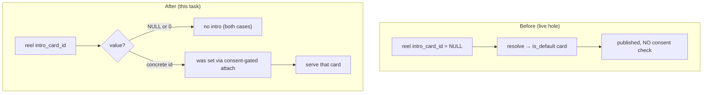

# T6680 — Remove the default / auto-inherited Athlete Intro Card — Design (Stage 2, v2)

**Task:** [T6680](player-intro/T6680-default-athlete-intro-card-provisioning.md).
**Tier:** L (Architecture design gate). **Epic:** [Player Intro + Rich Text](player-intro/EPIC.md).
**Status of this doc:** **APPROVED** (v2, 2026-08-09) — all 5 open questions in §0 resolved. Proceeding
to implementation.

> **What changed in v2 (2026-08-09):** superseded by user direction — the default / auto-inherited
> intro card concept is being **removed**, not provisioned-and-gated. v1 designed a lazily-provisioned
> default plus a new egress consent gate; v2 deletes the inherit path entirely so every intro requires
> an **explicit attach gesture** (which already runs through the existing consent gate), removing the
> exposure hole rather than patching around it. Decisions 1/2/4 are rewritten; Decision 3 restates what
> `NULL` means now. This doc is self-contained — v1 is not needed to read it.

---

## 0. Open Questions — RESOLVED 2026-08-09 (user approval)

The direction resolves the four *original* questions (they presupposed a default, which no longer
exists). It raised five new ones — all **product/UX or remediation scope**, not code mechanics — now
answered:

- [x] **OQ1 — No-intro-until-attach is acceptable?** **CONFIRMED.** Out-of-box state for every reel is
  *no intro* until the user explicitly attaches a card. Proceed.
- [x] **OQ2 — Picker: optional → prompted?** **(a)** — drop the inherit option only. Picker becomes
  *[specific card | no intro]*, defaulting to no intro. A prompt-to-attach nudge affordance is explicitly
  **out of scope** for this task (noted as a possible future follow-up, not built here).
- [x] **OQ3 — Existing reels currently showing the inherited default.** **(a) clean break** — no
  migration. No Migration agent needed for this task.
- [x] **OQ4 — Remediation of already-frozen unconsented shares.** **Out of scope for this task.**
  T5230's retention/purge scope is the right owner for remediating shares frozen during the live-hole
  window; this task only stops *new* exposure.
- [x] **OQ5 — Retire the `is_default` UI concept too, or leave dormant badges?** **(a)** — retire
  end-to-end per Decision 4 as already written.

---

## 1. Current State (what is being removed)

### 1.1 The default exists and is populated in prod today

`first card inserted → is_default = 1` is enforced at insert (`routers/intro_cards.py:249-252`), delete
auto-promotes the newest survivor (`:389-397`), and a manual "set as default" gesture flips it
(`:336-337`). Crucially, **`v040_backfill_intro_card_default.py` has already run**: every pre-T6640
profile that had cards but no flagged default was backfilled to `is_default = 1`. So **every profile
with ≥ 1 card has a default row right now** — the inherit path is not hypothetical, it is live for the
entire existing user base.

### 1.2 The resolution machinery (verified 2026-08-09)

The NULL/0 resolver lives in `services/intro_cards.py` (it did **not** move to `intro_egress.py`):

| Symbol | Location | Role |
|---|---|---|
| `resolve_intro_card_id(id, dur, default_id, min_dur)` | `intro_cards.py:195-235` | **Pure** order. `0 → None`; `<id> → id`; `NULL → default_id` **iff** `dur ≥ min_dur` (duration-gated), else `None`. **The inherit branch is `:224-235`.** |
| `get_default_intro_card(cursor)` | `intro_cards.py:245-251` | `SELECT * FROM intro_cards WHERE is_default = 1 LIMIT 1`. |
| `get_intro_min_duration(cursor)` | `intro_cards.py:254-265` | Per-profile threshold; **only consumer is the inherit duration gate** (plus the settings read/write UI, `profiles.py:277`). |
| `load_profile_cards(cursor)` | `intro_cards.py:284-300` | Batch `{id: {name, is_default, has_photo}}` for the download list. |
| `resolve_intro_card(id, dur, conn)` | `intro_cards.py:303-339` | DB-backed: loads default via `get_default_intro_card` + threshold, applies the pure resolver, fetches the row. Read-only. |
| `resolve_intro_for_reel(...)` | `intro_egress.py:141` | T5220 cross-DB egress choke point; delegates to `resolve_intro_card`. Never raises → `None` on any failure (epic decision 9). |

### 1.3 Every live call site that INHERITS the default (all must be removed — v1 missed two)

There are **two independent inherit paths**, not one:

1. **Single-reel / share / download-burn egress** — via `resolve_intro_for_reel` → `resolve_intro_card`:
   - Owner download burn `downloads.py:723-724`; single-reel share playback/burn (same helper);
     reel share page `shares.py:270`; per-download resolution `downloads.py:1123`.
2. **The download LIST** — `downloads.py:337-345` batch-loads `intro_default_id` **directly from
   `is_default`** and passes it into `resolve_intro_card_id` at `:577` per tile. This path **does not
   route through `resolve_intro_for_reel`** — a resolver-only gate (v1's plan) would have missed it.
3. **Collection freeze** — `collections.py:1086-1102`: when the picker choice is `None`, `:1093` calls
   `get_default_intro_card` and **freezes the concrete default id** into the public share definition.
   At playback, `_evaluated_share_members` (`collections.py:866-899`) re-resolves that already-concrete
   frozen id (never re-inherits NULL).

### 1.4 The consent hole — LIVE, not latent

`get_intro_consent(user_id, profile_id)` (`user_db.py:558-566`) → `None` = never consented. The
attach/freeze consent gates fire **only on an explicit non-null, non-zero pick**
(`intro_cards.py:204-211` create; the attach PATCH handler; `collections.py:1079-1084` freeze). `None`
("inherit default") and `0` ("no intro") are **deliberately never gated**. Combined with §1.1 (every
profile already has a default) and §1.3 (NULL inherits it on every egress), the result is:

> **A `NULL`-inherit reel on an unconsented profile publishes that profile's default card — a
> title-only card carrying a minor's full name — on the share page, on download burns, and (durably)
> into frozen collection-share links, with no recorded parental authority.** This is shipped and live.

v1 called this "latent." That was wrong: `v040` already populated the defaults, so the hole is **active
in production now**.

### 1.5 `is_default` surfaces in the frontend (relevant to Decision 4 / OQ5)

`is_default` is not only a resolution key; the UI reads it:

| Surface | File | Meaning that dies with inherit |
|---|---|---|
| Carousel "inherited" state | `IntroCardCarousel.jsx:128` `inherited={isInherit && card.is_default}` | The whole "this reel inherits your default" concept. |
| Carousel default selector | `IntroCardCarousel.jsx:79,129` | Which card is "the default". |
| "Default" badge | `IntroCardTile.jsx:13`, `IntroCardEditorContainer.jsx:150-156` | A label that no longer resolves to anything. |
| Delete-confirm copy | `IntroCardGrid.jsx:50` | "deleting your default…". |
| Store selector + promotion | `introCardStore.js:135,162,216` | Tracks/animates default promotion. |

---

## 2. Target State

**Explicit-attach-only.** An intro plays on a reel/collection **iff** a concrete card id was explicitly
attached through a consent-gated gesture. `NULL` and `0` both resolve to **no intro**, at every call
site. There is no profile default, no inherit, no auto-provisioning, and (Decision 4) no `is_default`
concept. The exposure hole is closed **structurally by removal**: the only value that can reach egress
is a concrete id, and every concrete id was set through the existing attach/freeze consent gate — so no
new egress gate is needed (nothing ungated remains to gate).



---

## 3. Decisions

### Decision 1 — No provisioning, and NO new egress gate. The fix is REMOVAL, not gating.

**Decision.**
1. **Drop auto-provisioning entirely.** Nothing is auto-created. A profile with zero cards stays at
   zero until the user creates one (the empty-library copy reworded by T6660 remains the start state).
2. **Add no egress consent gate.** v1 proposed gating the resolver + freeze. That gate exists only to
   contain the inherit hole; once inherit is removed there is nothing ungated at egress — every card
   that can reach egress is a concrete id that already passed the **attach-time** consent gate. Adding
   an egress gate would be defensive code for an impossible state (CLAUDE.md: no defensive fixes for
   states our own code can no longer create).
3. **Load-bearing invariant to verify (not a new gate — a check):** *every* write of a concrete
   `intro_card_id` onto a reel/collection must go through a consent-gated gesture. Known writers: the
   attach PATCH handler and collection freeze (both gate an explicit non-null/non-zero pick). The
   implementor (or a Stage-1 re-audit) must confirm **no other endpoint writes a concrete
   `intro_card_id`** (bulk edit, import, duplication). If one exists, it needs the same attach gate —
   that is the completeness condition for "removal closes the hole."

**Reasoning.** The direction is right on its own terms: the attach gate already captures consent at the
point a card is chosen; inheriting a card with *no* attach gesture is precisely the path that skips it.
Removing the inherit path deletes the exposure vector instead of adding a second, parallel gate that
every future call site must remember (v1's resolver gate still would have missed the download-list path
at §1.3.2). Fewer code paths, one consent chokepoint (attach), no dead defensive branches.

### Decision 2 — This task CLOSES the pre-existing live hole. It is in scope, not a follow-up. No migration required.

**Decision.** Removing the inherit resolution **is** closing the hole — they are the same code change,
not separable. You cannot "remove the default concept" while leaving `resolve_intro_card_id`'s NULL
branch reading `is_default`; the branch *is* the hole. So T6680 owns the full closure across **all**
inherit sites enumerated in §1.3:

- `resolve_intro_card_id`: the `NULL → default_id` branch (`:224-235`) is removed — `NULL` returns
  `None` (details in Decision 4).
- `resolve_intro_card` (`:320-322`): stops loading `get_default_intro_card` / threshold for inherit.
- **Download list** (`downloads.py:337-345,577`): stops computing/passing `intro_default_id`.
- **Collection freeze** (`collections.py:1093`): the "picked `None` → freeze default" branch is
  removed; `None` freezes `0` (no intro), same as an explicit `0`.

**No migration is required for correctness.** Existing `is_default = 1` rows become **dead data** the
moment nothing reads `is_default` for resolution. Nothing breaks: those rows are **real user-created
cards** (the first card each profile made) — still fully usable via explicit attach; only the *flag* is
now unread. The column stays in the schema (dropping it is a destructive migration for zero benefit).
`v040`/`v041` remain as historical no-ops. **State explicitly:** dead `is_default` values are harmless
because the only thing that ever read them for resolution is being deleted in the same change.

**One OPTIONAL migration — a product choice, deferred to OQ3.** The clean-break removal will make
existing `NULL`-inherit reels on **consented** profiles silently lose their intro. If preserving that
visible behavior matters, a one-time data migration can convert implicit → explicit: for each reel with
`intro_card_id IS NULL` on a **consented** profile that has a default and qualifying duration, write the
concrete default id into `intro_card_id`. This preserves what consented users see **and** still closes
the hole for unconsented profiles (whose NULL reels correctly go to no-intro). **Recommendation:**
default to **clean break (no migration)** — it matches the direction and avoids fabricating explicit
attaches on the user's behalf — but this is OQ3 for the user to decide. If chosen, it adds the Migration
agent and a `profile_db` migration; if not, **no Migration agent, no schema change** for this task.

**Rejected — leave the hole for a follow-up task.** Incoherent: the removal the user asked for *is* the
fix. Splitting them would mean shipping "remove the default concept" while leaving the default-reading
branch in place, i.e. not actually removing it.

### Decision 3 — Resolution semantics going forward: `NULL` now means "no intro".

**Decision.** After this change the resolver is:

```
0            -> None      (explicit opt-out — unchanged)
<positive>   -> that id   (explicit attach — unchanged; consent-gated at attach)
NULL         -> None      (NEW: "no card attached" — no longer inherits anything)
```

- **`NULL` semantics restated:** `NULL` = *"no card attached / no intro"*. It **no longer means
  "inherit the profile default"** (there is no default). At resolution `NULL` and `0` are now
  **equivalent** (both → no intro).
- **Distinction kept only as an optional UI hint, not a resolution difference:** if the frontend wants
  to distinguish *"never chosen"* (`NULL`) from *"deliberately off"* (`0`) for picker copy, it may — but
  the backend treats them identically. **No data migration to collapse `NULL`→`0`** (unnecessary; they
  resolve the same).
- **The duration gate (`get_intro_min_duration`) no longer participates in resolution** — it existed
  solely to gate inherit. `get_intro_min_duration`'s settings read/write UI (`profiles.py:277`) is a
  separate feature; verify at implementation whether the threshold has any remaining consumer and, if
  fully orphaned by this change, remove it (otherwise leave the settings plumbing, just drop it from the
  resolver). Do not silently keep a dead gate inside the resolver.

### Decision 4 — Remove the branch (don't leave it dead), and retire `is_default` end-to-end.

**Decision — the resolver NULL branch: REMOVE it, do not leave dead-but-harmless.** Simplify
`resolve_intro_card_id` to `0/NULL → None`, `<positive> → id`, dropping the `default_id`, `reel_duration`,
and `min_duration` parameters from the inherit logic (the signature/params drop as their callers stop
supplying them). Rationale over "leave it returning `None`":
- **Security auditability:** with `get_default_intro_card` and the `is_default` reads physically gone, a
  reviewer can `grep get_default_intro_card` / `grep is_default` and see **zero live resolution
  callers** — proving the hole is *structurally* closed, not just behaviorally disabled behind a branch
  a future edit could re-enable.
- **CLAUDE.md** favors deleting dead branches over "handles-impossible-state" code, and greppability
  here *improves* with removal (no phantom default-resolution path lurking).

**Decision — `is_default` machinery: retire end-to-end (Recommendation for OQ5).** A "default" that is
never inherited is misleading UI. Retire it in the same task for coherence:
- **Backend writes:** remove first-card-auto-default (`intro_cards.py:249-252`), delete-promotion
  (`:389-397`), the manual set-default gesture (`:336-337`), and `get_default_intro_card`
  (once its two callers in §1.3 are gone). Drop `is_default` from `load_profile_cards`'s projection.
- **Frontend:** remove the carousel "inherited" state and default selector, the "Default" badges
  (tile/editor), the delete-confirm "your default" copy, and the store promotion logic (§1.5).
- **Schema:** leave the `is_default` column in place (harmless dead column; no destructive migration).
- **The picker change is gated on OQ2** — removing the inherit state forces a picker-copy decision
  (drop the option vs. prompt-to-attach). That is the one frontend piece that needs the UX answer
  before implementation of the frontend slice.

**No default content shape decision (v1's Decision 4 is void).** Nothing is provisioned, so there is no
system-authored title-only card, no `intro_full_name`-at-render question, and no empty-name rendering
case. Those concerns disappear with provisioning.

---

## 4. Implementation Plan

**Two slices.** Backend removal (self-contained, closes the hole, no UX dependency) can land first;
the frontend slice depends on **OQ2**. Keep each reviewable unit < ~200 lines (refactoring rule).

### 4.1 Backend slice (load-bearing; closes the hole)

| # | File | Change |
|---|---|---|
| 1 | `services/intro_cards.py` | `resolve_intro_card_id`: `0/NULL → None`, `<positive> → id`; drop inherit branch + `default_id`/duration params. Remove `get_default_intro_card`. Remove `is_default` from `load_profile_cards` projection. Simplify `resolve_intro_card` (no default/threshold load). Remove first-card-default / delete-promotion / set-default writes. |
| 2 | `routers/downloads.py` | Drop `intro_default_id` computation (`:337-345`) and its use at `:577`; update `resolve_intro_card_id` calls to the new signature. |
| 3 | `routers/collections.py` | Freeze branch (`:1093`): `picked None → freeze 0` (no intro); remove `get_default_intro_card` import/use. |
| 4 | `routers/intro_cards.py` | Remove set-default endpoint + auto-default/promotion writes; drop `is_default` from serialization (`:149`). |
| 5 | `services/intro_egress.py` | No logic change beyond the simplified `resolve_intro_card` it calls; verify it still degrades to `None` cleanly. |
| 6 | `.claude/knowledge/backend-services.md` § "Intro card library" | Update: no default/inherit; `NULL/0 → no intro`; `is_default` retired; explicit-attach-only. Same commit. |

**Verify (Decision 1.3):** grep every writer of `reel.intro_card_id` / collection freeze id to confirm
each concrete-id write is consent-gated; report any ungated writer as a blocker.

### 4.2 Frontend slice (gated on OQ2)

Remove carousel inherit/default state + selector, "Default" badges, delete-confirm copy, store
promotion (§1.5). Implement the OQ2 picker decision (drop inherit option → no-intro default selection,
or prompt-to-attach). Update `introCardStore.test.js` fixtures that assert `is_default` promotion.

### 4.3 Optional migration (only if OQ3 = preserve-behavior)

`profile_db` migration: for reels with `intro_card_id IS NULL` on a **consented** profile with a default
and qualifying duration, `UPDATE ... SET intro_card_id = <default_id>`. Self-guarded/idempotent. Adds
the Migration agent. **Not built unless OQ3 selects it.**

---

## 5. Risks

| Risk | Mitigation |
|---|---|
| **Missed inherit call site** leaves a live default-read path (v1 missed the download list). | §1.3 enumerates **all** sites (both `resolve_intro_*` paths, download list, freeze). Removal of `get_default_intro_card` makes any missed reader a **compile/grep failure**, not a silent survivor. |
| **Existing consented reels silently lose their intro** (clean break). | OQ3 — surfaced for the user; optional preserve-behavior migration (§4.3) available if they choose it. |
| **Already-frozen unconsented public shares** created during the live-hole window persist. | OQ4 — flag to T5230 retention/purge; recommend out of scope here (this fix stops **new** exposure). |
| **Ungated concrete-id write path** would keep the hole open via a different vector. | Decision 1.3 verification: grep all writers; block on any ungated one. |
| Frontend picker becomes incoherent (inherit option with nothing to inherit). | OQ2 must be answered before the frontend slice; backend slice ships independently. |
| `get_intro_min_duration` left as a dead gate inside the resolver. | Decision 3 — remove from resolver; verify/keep only its settings-UI consumer. |
| Dead `is_default` rows in prod. | Decision 2 — harmless (unread after removal); no migration; column retained. |

---

## 6. Test Plan (for Stage 3 Tester)

**Behavior-change tests (these INVERT prior expectations — update intent, don't just keep them):**

1. **`NULL → no intro` at every site.** For a profile that HAS cards (incl. an `is_default` row from
   `v040`), assert a reel with `intro_card_id IS NULL` resolves to **no intro** on: single-reel share
   (playback + burn), owner download burn, reel share page, **and the download list** (`downloads.py`
   batch path) — at every duration (short AND above threshold). This is the direct hole-closure test and
   the one that catches the download-list path.
2. **`0 → no intro`** unchanged; **`<positive id> → that card`** unchanged (still consent-gated at
   attach — assert the create/attach gate is untouched).
3. **Collection freeze: `picked None → freeze 0`.** `POST /share` with `intro_card_id = None` freezes
   `0` (no intro) and **never** calls `get_default_intro_card`; assert no default id is frozen into the
   share definition.
4. **No egress can serve an un-attached card.** For an **unconsented** profile with cards, every egress
   path serves no intro (there is no inherit to expose) — the invariant that replaces v1's egress gate.
5. **`is_default` retirement.** Backend: creating a first card no longer sets `is_default=1`; no
   set-default endpoint. Frontend: `introCardStore.test.js` promotion/default-selector cases updated to
   the retired concept (OQ5).

**Suites to update (deliberately, because behavior changed):** `test_t5215_intro_attachment.py` NULL
inherit cases now assert `NULL → None` (was `NULL → default`). `test_null_inherit_no_default_is_none`
still passes (it always expected `None` for `default_id=None`; now `None` regardless).

**Unchanged (must still pass):** `test_t5230_intro_compliance.py::test_create_card_blocked_without_consent`
(create-gesture gate) and `test_no_face_recognition_in_intro_pipeline`.

**Relevant set (curated, ~10):** the 5 new/inverted tests + the download-list resolution test + the
collection freeze test + `test_create_card_blocked_without_consent` + the attach-gate test + the
`introCardStore` picker test.

---

## 7. Original four questions

All four presupposed a default that will no longer exist, so they are void, not merely answered:
consent-on-auto-create (no auto-create), backfill strategy (nothing to backfill), default content shape
(no default), resolution-semantics interaction (resolver simplified per Decision 3). The live decisions
are **OQ1–OQ5 in Section 0**.
