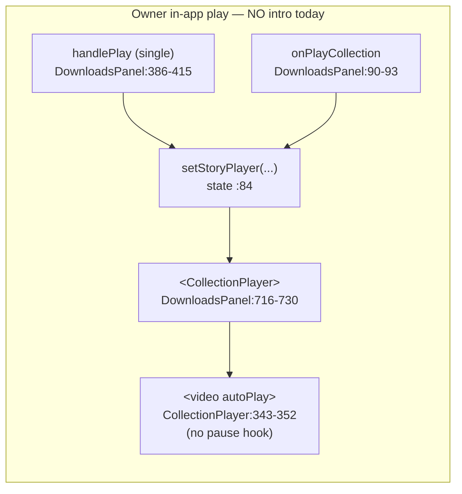

# T6700 — Owner in-app playback intro (Design)

**Status:** WAITING ON USER (design gate)
**Tier:** L (frontend: `DownloadsPanel` + a new `IntroPreRoll` mount; backend: two thin per-play GET endpoints; no schema change, no new abstractions — reuses the T5220 serializer/component wholesale)
**Epic:** [Player Intro + Rich Text](player-intro/EPIC.md) — extends decision 1's PLAYBACK half to a 5th surface
**Task file:** [player-intro/T6700-owner-inapp-playback-intro.md](player-intro/T6700-owner-inapp-playback-intro.md)
**Follows:** [T5220](T5220-design.md) — the 4-egress design + the share-path unmount/mount SWAP precedent (§5.4, §11)

This design is decision-complete: every choice the task's acceptance criteria touch is resolved
below with rationale. Nothing is left "either/or" for the implementor. **No source code is
written here — this doc is the only artifact.**

---

## 0. Open Questions (design-gate — need the user's call)

None block implementation. Two low-stakes confirmations, both with a recommended default already
baked into the plan; the user can veto either at the gate:

- [ ] **Q1 — Owner sees the intro they'll ship, LIVE.** Owner in-app playback resolves the intro
      LIVE from the current attachment (exactly like owner download and single-reel share — T5220
      §11's LIVE-vs-frozen rule). So a reel on `NULL` (inherit) that clears the duration gate WILL
      show the profile default as a pre-roll when the owner presses Play in-app, and swapping the
      attached card changes the very next in-app play with no re-export. **Recommendation: keep**
      (consistent with the single resolution order; the whole point of decision 1 is "swap an
      intro, costs nothing, see it everywhere"). Flagging only because it means every long reel
      with a default now shows a pre-roll on the owner's own Play, which the owner has not seen
      before this task.
- [ ] **Q2 — Collection in-app play uses the COLLECTION's own intro, not per-member reel intros.**
      Per T5220's landmine (intro_cards.py:353-375) and the owner collection-intro seam
      (`GET /api/collections/intro`, collections.py:734-762), a collection's leading pre-roll is
      the COLLECTION's own attached card resolved against the LIVE total duration — per-member reel
      intros stay out of scope (they never played inside a collection on the share path either).
      **Recommendation: keep** (matches the share-collection behavior exactly). No design change
      either way; flagging so the "one pre-roll, collection's own card, before the first member"
      semantics are an explicit yes.

---

## 1. Current State Analysis

### 1.1 The gap (verified this session, file:line current)

Owner in-app "Play" — both single reel and collection — funnels through ONE `storyPlayer` state in
`DownloadsPanel.jsx`, which renders `CollectionPlayer` directly. `CollectionPlayer`'s
`<video autoPlay>` (:343-352) starts the first reel immediately on mount; it has **no intro prop,
no pause hook, no `IntroPreRoll` awareness**. `DownloadsPanel` has plenty of intro *assignment* UI
(pickers, badges) but never fetches or renders the intro *playback* payload. Result: the 5th
egress — playing your own content in-app — shows no intro, unlike T5220's 4 wired paths.



### 1.2 What already exists to wire (do NOT rebuild — this is the whole point)

| Asset | Where | Reuse in T6700 |
|---|---|---|
| **`IntroPreRoll`** — the DOM pre-roll wrapping `MotionPreview`, mount-gated like `BrandedEndCard` | `introcards/IntroPreRoll.jsx:34-83` | Mounted VERBATIM in `DownloadsPanel`. Reassembles `{card, previewUrl, field_values, profile}` at :63-64. |
| **`build_intro_playback_payload(card, field_values)`** → exactly `{card, previewUrl, field_values, profile}` | `services/intro_egress.py:110-138` | The ONE serializer both new endpoints return. Decodes `shown_fields` JSON + `text_elements` msgpack via `_card_payload` (:248-302) — a raw `SELECT *` would 500. |
| **`resolve_intro_for_reel(user_id, profile_id, intro_card_id, reel_duration, reel_id, *, mode="playback", profile_conn=None)`** | `services/intro_egress.py:141-245` | The single-reel endpoint calls it with `mode="playback"` and the **ambient** connection (same-account — see §2.2). |
| **Collection intro resolution** (`get_collection_intro_card_id` + `resolve_intro_card` against LIVE total duration) | `collections.py:749-757` (`GET /api/collections/intro`) | The collection endpoint reuses this resolution, then serializes via `build_intro_playback_payload`. |
| **The unmount/mount SWAP precedent** | `SharedCollectionView.jsx:31, 50, 121-136` | Copied structurally into `DownloadsPanel`: `introShowing ? <IntroPreRoll onDone/> : <CollectionPlayer/>`. |

### 1.3 Why the obvious shortcuts are REJECTED (settled)

| Tempting shortcut | Why rejected |
|---|---|
| **Widen `GET /api/downloads` (the list) to embed the playback payload** | The list is a poster grid; embedding `{card, previewUrl, ...}` would presign every card on every list load (N presigns per gallery open). The existing no-N+1 design deliberately returns only thin `intro_card_id`/`intro_card_name`/`resolved_intro_has_photo` (downloads.py:237-239, :575-592). Rejected. |
| **Hand-build the payload client-side** from the library card + `currentProfile` (the assignment picker's shortcut) | Produces a differently-shaped object than `IntroPreRoll` expects (:63-64) and re-derives resolution order in the client — divergence risk. The backend serializer is the single shape source. Rejected. |
| **Add an `intro`/`autoPlay`-toggle prop to `CollectionPlayer`** | `CollectionPlayer` is shared infra (4 callers). Its `<video autoPlay>` has no pause hook; an `autoPlay`-toggle prop is exactly the attribute-toggle pattern that caused the share-path auto-continue bug (§3). Rejected — swap instead. |

---

## 2. Target Architecture

The change lives **entirely in `DownloadsPanel` (the caller) + two new thin backend GET endpoints.**
`CollectionPlayer`'s prop signature is UNTOUCHED, so its other callers are structurally unaffected
(§4).

```mermaid
flowchart TB
  subgraph FE["DownloadsPanel — the ONLY frontend change"]
    HP["handlePlay (single reel)<br/>gesture: press Play"]
    OPC["onPlayCollection (collection)<br/>gesture: press Play all"]
    HP -->|"GET /downloads/{id}/intro-playback"| SP
    OPC -->|"GET /collections/intro-playback?scope..."| SP
    SP["storyPlayer state (grows: intro, introShowing)"]
    SP --> SWAP{introShowing?}
    SWAP -- yes --> IPR["&lt;IntroPreRoll intro onDone/&gt;<br/>(mounts INSTEAD of the player)"]
    SWAP -- no --> CP["&lt;CollectionPlayer&gt; (props UNCHANGED)"]
    IPR -->|onDone| SP2["setIntroShowing(false)"]
    SP2 --> CP
    CP --> V["&lt;video autoPlay&gt; fires on FIRST mount<br/>→ auto-continues, no toggle"]
  end
  subgraph BE["Two new thin per-PLAY GET endpoints (gesture-triggered READs)"]
    E1["GET /api/downloads/{id}/intro-playback<br/>→ resolve_intro_for_reel(mode=playback, ambient conn)"]
    E2["GET /api/collections/intro-playback?scope_type&aspect_ratio&game_id&tags<br/>→ collection's OWN card + build_intro_playback_payload"]
    E1 --> PL["{intro: {card, previewUrl, field_values, profile}} | {intro: null}"]
    E2 --> PL
  end
```



**Design principles applied:**

- [x] **DRY** — no new serializer, no new component, no new resolver. Both endpoints return the
      IDENTICAL `{intro}` shape via the ONE `build_intro_playback_payload`; the frontend reuses the
      ONE `IntroPreRoll`. The swap is copied structurally from the ONE existing precedent
      (`SharedCollectionView`).
- [x] **Single code path** — one player instance still serves both single-reel and collection play
      (unchanged); one swap gates both; one payload shape for both.
- [x] **Minimal branches** — the only new branch is the `introShowing ?` swap ternary, mirroring the
      share path exactly. No per-path branching inside `CollectionPlayer`.
- [x] **Pattern** — mirrors T5220's playback delivery (DOM pre-roll via `MotionPreview`) and the
      share-collection SWAP; extends decision 1's PLAYBACK half to the 5th surface, no new pattern.
- [x] **Gesture-based READ, never reactive** — both fetches fire from the Play *gesture handler*
      (`handlePlay` / `onPlayCollection`), never from a `useEffect` watching state, never on list
      load. This is a READ triggered by a named gesture (pressing Play), fully compliant with
      CLAUDE.md's persistence rule (it writes nothing; it reads the payload for the pre-roll).

### 2.1 `storyPlayer` state shape (grows by two fields)

Today: `{ reels, title, downloadId? }` (DownloadsPanel:82-84). It grows to:

```
{ reels, title, downloadId?, intro }   // intro: {card, previewUrl, field_values, profile} | null
```

Plus one sibling piece of component state (mirroring `SharedCollectionView:31`):

```
const [introShowing, setIntroShowing] = useState(false);
```

`introShowing` is set `true` at the moment `storyPlayer` is set **iff** the fetched payload has a
non-null `intro`; otherwise it stays `false` and the player mounts immediately (today's behavior,
unchanged). `closeStoryPlayer` (:94) also resets `introShowing = false` so a reopened player
re-gates cleanly.

### 2.2 Same-account simplification (no readonly-share machinery)

The owner path is same-account / same-request-user: the reel and its profile.sqlite belong to the
current session. So the single-reel endpoint passes the **ambient** DB connection
(`get_db_connection()` inside the request) to `resolve_intro_for_reel(..., profile_conn=conn)` —
the `open_profile_db_readonly` / explicit-`(user_id, profile_id)` cross-profile path the SHARE
endpoints need (intro_egress.py:174-194) is **unnecessary and must not be used here.** The
collection endpoint likewise resolves against the ambient connection, exactly as the existing
`GET /api/collections/intro` already does (collections.py:747-757).

---

## 3. Designing OUT the auto-continue bug (AC3)

**The SWAP is chosen precisely so the autoplay-attribute-toggle bug cannot recur — and NO
`autoPlay`-toggle prop is added to `CollectionPlayer`.**

Two auto-continue mechanisms exist in the codebase:

| Mechanism | Used by | Why it works there | Applicable to T6700? |
|---|---|---|---|
| **`<MediaPlayer autoPlay={bool}>` PROP TOGGLE** | `SharedVideoOverlay` (single-reel share) | Only works because `MediaPlayer.jsx:58-69` has a compensating effect that calls `.play()` on a `false→true` transition — the fix for the raw autoplay-attribute bug. | **NO.** T6700 renders `CollectionPlayer`, which has NO such compensating effect. A toggle prop here would reintroduce the exact bug. |
| **Unmount/mount SWAP** | `SharedCollectionView` (collection share) | `CollectionPlayer`'s `<video autoPlay>` fires on its FIRST mount. Gating the mount behind the pre-roll means when `onDone` flips `introShowing→false`, `CollectionPlayer` mounts for the first time and autoPlay fires naturally — no toggle, no compensating effect needed. | **YES.** This is the mechanism T6700 uses. |

**The handoff (both single-reel and collection route through the same `storyPlayer`/`CollectionPlayer`,
so ONE swap covers both):**

```
press Play (gesture)
  → fetch intro payload (READ)
  → setStoryPlayer({..., intro});  setIntroShowing(intro != null)
  → render: introShowing
        ? <IntroPreRoll intro onDone={() => setIntroShowing(false)}/>   // CollectionPlayer NOT mounted yet
        : <CollectionPlayer .../>                                       // FIRST mount → <video autoPlay> fires
  → MotionPreview finishes → IntroPreRoll onDone → setIntroShowing(false)
  → CollectionPlayer mounts for the first time → autoPlay auto-continues into the reel
```

Because `CollectionPlayer` is never mounted-then-hidden-then-shown (it is genuinely unmounted until
`onDone`), its `autoPlay` attribute does its job on a fresh mount with no toggle. AC3 satisfied by
construction.

**Right intro per path (AC1 + AC2):**

- **Single reel:** the pre-roll is the REEL's OWN resolved intro (its `final_videos.intro_card_id`),
  from `GET /api/downloads/{id}/intro-playback`.
- **Collection:** the pre-roll is the COLLECTION's OWN resolved intro (the collection-settings
  attachment resolved against LIVE total duration), from `GET /api/collections/intro-playback`.
  ONE pre-roll before the first member, NOT per-member — the collection's card, per §0/Q2. This is
  the DIFFERENT-intro-source landmine (T5220): fetch from the RIGHT source per path.

---

## 4. Other `CollectionPlayer` callers are structurally unaffected (AC4)

`CollectionPlayer`'s prop signature is UNCHANGED and the swap lives entirely inside `DownloadsPanel`,
so every other caller is inert with respect to this change:

| Caller | file:line | Effect of T6700 |
|---|---|---|
| **DownloadsPanel** (owner in-app) | :716-730 | THE target. Gains the swap + `intro` fetch. |
| **SharedCollectionView** (collection share) | :129 | **Already has its own swap** (:121-136) + `intro` from its own payload. Untouched. |
| **RankingGame** (ranker) | :264 | No intro today, must stay that way (AC4). Untouched — it never mounts `IntroPreRoll`, passes no `intro`. Green by omission. |
| **collectionplayerdiag** (dev harness) | — | Dev-only. Untouched. |

Guarded by `CollectionPlayer.characterization.test.jsx` (props/behavior contract) — it must stay
GREEN because the props don't change. This is the AC4 proof: no prop change → no caller change.

---

## 5. Implementation Plan (ordered, file-by-file)

Do backend first (the frontend consumes the new endpoints), each a reviewable unit.

### 5.1 Backend

| Order | File | Change |
|---|---|---|
| 1 | `routers/downloads.py` | **NEW** `GET /{download_id}/intro-playback`. Open the ambient `get_db_connection()`; `SELECT intro_card_id, duration FROM final_videos WHERE id = ?` (mirrors `download_file`'s SELECT :693-697); call `resolve_intro_for_reel(user_id, profile_id, row['intro_card_id'], row['duration'], download_id, mode="playback", profile_conn=conn)`. Return `{"intro": <payload-or-None>}`. **Non-fatal contract: HTTP 200 ALWAYS** — no card / resolve fails / no attachment → `{"intro": null}` (the resolver already returns None + logs on every failure rung, intro_egress.py:169-197). Never 4xx/5xx for "no intro". |
| 2 | `routers/collections.py` | **NEW** `GET /intro-playback` taking the SAME params as `GET /intro` (`scope_type, aspect_ratio, game_id?, tags?`). Reuse `_collection_scope_and_definition` + `get_collection_intro_card_id` + `resolve_intro_card` against LIVE total duration (copy the resolution block from `get_collection_intro` :742-757) to get the concrete card row, then `build_intro_playback_payload(card, field_values)` (facts via the same `_load_field_values` the resolver uses). Return `{"intro": <payload-or-None>}`. Same non-fatal 200-always contract: no stored/inherited card, or the duration gate blocks it → `{"intro": null}`. |

**Why two thin per-PLAY endpoints beat list-widening (justification, restated for the record):** the
list is a poster grid loaded eagerly and often; the playback payload requires a presign (and, for
the card, JSON/msgpack decode) that is wasted on every non-played tile. A per-play GET presigns
exactly ONE card at exactly the moment the user commits to watching — O(1) work on a real gesture,
zero cost on list load. It also keeps the presigned URL fresh (presigns expire; a URL embedded in a
list loaded minutes earlier could be stale by play time). This matches the existing per-play cost
model (`toPlayerReel` already builds stream URLs lazily) and the no-N+1 list design.

> The single-reel endpoint intentionally does NOT reuse `GET /api/collections/intro` — that resolves
> a COLLECTION's card; a single reel resolves its OWN `final_videos.intro_card_id`. Different
> sources (the §3 landmine), hence two endpoints.

### 5.2 Frontend — `DownloadsPanel.jsx` (the only frontend file)

| Order | Location | Change |
|---|---|---|
| 3 | state (:84) | Grow `storyPlayer` shape to carry `intro`; add `const [introShowing, setIntroShowing] = useState(false)` (mirror `SharedCollectionView:31`). |
| 4 | `handlePlay` (:386-415) | After building the reel, `await` `GET /api/downloads/{download.id}/intro-playback`; `setStoryPlayer({ reels:[toPlayerReel(download)], title, downloadId, intro })`; `setIntroShowing(!!intro)`. Fetch failure → treat as `intro: null` (play immediately) — never block Play on the intro fetch. Keep all existing quest/warmup/watch-timer side effects. |
| 5 | `onPlayCollection` (:90-93) | Signature gains the collection's scope identity so it can fetch the collection's own intro. `CollectionsTab.onPlay` (CollectionsTab.jsx:50-53) and the group components already hold `shareScope` (`{type, game_id}`, :102) and the aspect ratio; thread those through `onPlayCollection(reels, title, scope)` → build the `GET /api/collections/intro-playback` query from `scope_type`/`aspect_ratio`/`game_id`/`tags` (reuse `collectionIntroKey`'s scope-shape mapping, introBadgeKey.js:8-15, so the params match what the badge already resolves). `setStoryPlayer({ reels, title, intro })`; `setIntroShowing(!!intro)`. |
| 6 | render (:716-730) | Wrap the existing `<CollectionPlayer .../>` in the swap: `{storyPlayer && (introShowing ? <IntroPreRoll intro={storyPlayer.intro} aspect={/* from reels[0].aspect_ratio */} onDone={() => setIntroShowing(false)} positionClassName="fixed inset-0 z-[...]"/> : <CollectionPlayer ...unchanged props.../>)}`. Use a fixed, appropriately-layered `positionClassName` matching the player's z-layer (mirror `SharedCollectionView`'s `fixed inset-0 z-[85]`), since this player is full-viewport (:714-715 comment). `CollectionPlayer`'s props are copied verbatim — NO new prop. |
| 7 | `closeStoryPlayer` (:94) | Also `setIntroShowing(false)` on close, so a reopen re-gates. |

> Thread-through note (step 5): `onPlayCollection` is called from `CollectionsTab.onPlay(items, title)`
> (:50-53), which is invoked by `GameCollectionGroup`/smart-scope/mixes rows that each already know
> their `shareScope` + ratio (:102, :153-155, :247-250). The minimal change is to pass the scope
> descriptor down to `onPlay` and up through `onPlayCollection` — no new state, purely widening an
> existing call signature. The single-reel path already has the id, so it needs no threading.

### 5.3 Nothing else changes

No change to `CollectionPlayer.jsx`, `IntroPreRoll.jsx`, `MotionPreview`, `SharedCollectionView`,
`RankingGame`, `toPlayerReel`, `useCollections`, the downloads list serializer, or any schema.

---

## 6. Risks

| # | Risk | Mitigation |
|---|---|---|
| R1 | **Play latency** — awaiting the intro fetch before the player opens could feel slow. | The fetch is one thin GET (one presign) fired on the gesture. Acceptable (share paths do the same). If perceptible: open the pre-roll container immediately and let `MotionPreview` mount when the payload lands — but the pre-roll needs the payload anyway, so the await is inherent. Do NOT block on failure (R3). |
| R2 | **Reintroducing the auto-continue bug** by "helpfully" adding an `autoPlay` prop to `CollectionPlayer`. | Explicitly banned (§3). The swap is the only mechanism. Reviewer checks `CollectionPlayer.jsx` diff is empty. |
| R3 | **Intro fetch failure blocks Play.** | Both endpoints are 200-always; the client treats any non-200 / network error as `intro: null` and plays immediately. Play must NEVER hang on the intro. |
| R4 | **Wrong intro source** — showing the reel's card for a collection or vice-versa (the §3 landmine). | Two distinct endpoints; single reel → `/downloads/{id}/intro-playback` (reel's own), collection → `/collections/intro-playback` (collection's own). Tests assert each path hits the right endpoint. |
| R5 | **`onPlayCollection` signature change ripples** to `CollectionsTab` test doubles. | Two test files stub `onPlayCollection` (CollectionsTab.test.jsx:43, .grouping.test.jsx:44) — widening the signature is backward-compatible (extra arg ignored by stubs). Update them only if they assert call args. |
| R6 | **Reopen leaves `introShowing` stale.** | `closeStoryPlayer` resets `introShowing=false`; each open sets it from the fresh payload. Covered by a unit test (open→close→open with/without intro). |
| R7 | **Aspect mismatch in the pre-roll** (portrait card box on a 16:9 reel). | `IntroPreRoll` already takes an `aspect` prop and `MotionPreview` renders the card at both ratios (EPIC decision 3b). Pass the reel's `aspect_ratio` (from `reels[0]`) so the pre-roll matches the video that follows. |

---

## 7. Test Plan (sketch)

### Backend (pytest — changed-code scope)

`test_t6700_intro_playback_endpoints.py` (NEW):
- **Single-reel happy path:** a reel with a resolvable intro → `GET /downloads/{id}/intro-playback`
  returns `{"intro": {card, previewUrl, field_values, profile}}` with `card.shown_fields` decoded to
  a list and `text_elements` decoded (proves the `_card_payload` path, not a raw `SELECT *`).
- **Single-reel non-fatal null path:** reel on `0` (opted out) → `{"intro": null}`, HTTP 200; reel on
  `NULL` with no default → `{"intro": null}`, 200; forced resolve failure → `{"intro": null}`, 200.
  Assert NEVER 4xx/5xx for "no intro".
- **Collection happy path:** a scope with a resolvable collection intro → payload; assert it resolves
  the COLLECTION's card (not any member reel's), against LIVE total duration.
- **Collection non-fatal null path:** no stored/inherited card, or duration gate blocks it →
  `{"intro": null}`, 200.
- **Same-account / ambient connection:** assert the single-reel endpoint resolves via the ambient
  connection and does NOT invoke `open_profile_db_readonly` (owner path, §2.2).

### Frontend

E2E `T6700-owner-inapp-intro.qa.spec.js` (NEW), real account via `loginAsRealUser`:
- **Owner single-reel play:** press Play on a reel with an intro → `IntroPreRoll` (`MotionPreview`)
  mounts, `CollectionPlayer` is NOT yet mounted; on `onDone` the player mounts and auto-continues into
  the video with NO manual resume (AC1 + AC3).
- **Owner collection play:** press Play all on a collection with an intro → exactly ONE pre-roll before
  the first member (assert a single `IntroPreRoll` mount across the member chain), then auto-continue
  (AC2 + AC3).
- **No-intro reel:** press Play on a reel with `intro: null` → player mounts immediately, no pre-roll
  (today's behavior preserved).
- **Right endpoint per path:** network assertion that single-reel play hits
  `/api/downloads/{id}/intro-playback` and collection play hits `/api/collections/intro-playback`
  (R4).

Unit (Vitest):
- `DownloadsPanel` open→close→open re-gates `introShowing` correctly (R6); `intro: null` never mounts
  `IntroPreRoll`; `onDone` flips to the player.

### Regression (must stay GREEN)

- `CollectionPlayer.characterization.test.jsx` — props/behavior unchanged (AC4 proof).
- `RankingGame` tests — no intro, no `IntroPreRoll` mount (AC4).
- `SharedCollectionView` share-path swap tests — untouched (its own swap + payload).
- `CollectionsTab.test.jsx` / `.grouping.test.jsx` — `onPlayCollection` signature widening is
  backward-compatible (R5).
