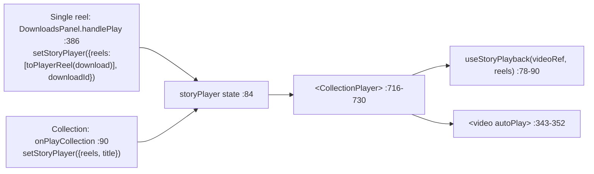
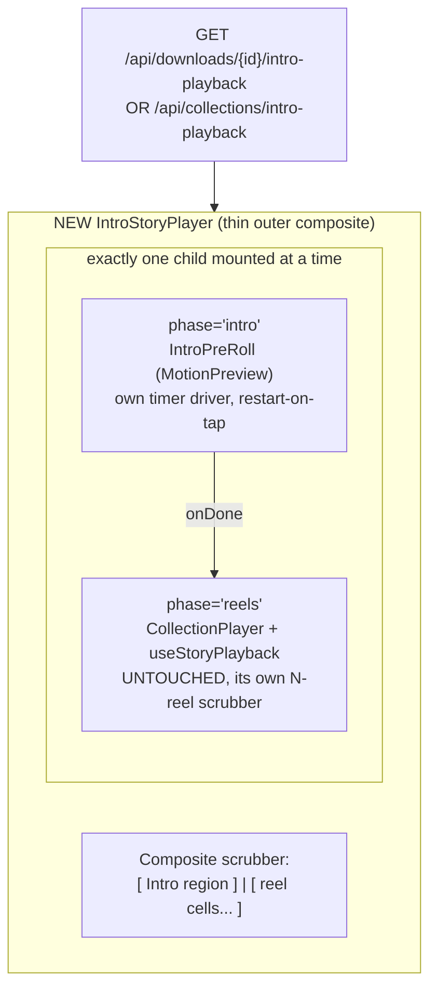

# T6710 — Owner in-app playback intro as a real timeline segment (Design)

**Status:** WAITING ON USER (design gate)
**Tier:** L (frontend composite + one new backend GET endpoint, shared playback infra, no schema change)
**Epic:** [Player Intro + Rich Text](player-intro/EPIC.md)
**Task file:** [player-intro/T6710-owner-playback-intro-as-timeline-segment.md](player-intro/T6710-owner-playback-intro-as-timeline-segment.md)
**Subsumes:** [T6700](player-intro/T6700-owner-inapp-playback-intro.md) — never shipped (see §1.1); this task builds the owner in-app intro from scratch.

This design is decision-complete except for the **two explicit approval-gate questions** in §7,
each carrying a recommendation the user can confirm or redirect. Approach is settled (§3): Approach B,
sub-variant (b) — a thin outer composite. Approach A is closed by user direction.

---

## 0. TL;DR of the decisions

| # | Decision | Choice |
|---|---|---|
| 1 | **Approach A vs B** | **B (virtual composite, intro kept a distinct region).** A (ffmpeg concat into one seamless bar) is CLOSED by user direction — it produces no visible seam, the opposite of "separate scrub region." |
| 2 | **Composite structure (Code Expert (a) vs (b))** | **(b) Thin OUTER composite** owning two regions: an intro driver + the untouched `CollectionPlayer`/`useStoryPlayback` below. Does NOT rewrite the shared hook (which 3 other callers depend on). |
| 3 | **Region-boundary rendering** (Q1, §7) | **Recommend:** a separate bar GROUP for the intro, left of a gap/divider, tinted a distinct accent (blue-400) with a small "Intro" label; the reel region(s) keep today's white segmented cells. Sizing: **equal-weight** intro cell (NOT proportional to `card.duration`). |
| 4 | **Backward-seek into the intro** (Q2, §7) | **Recommend:** **landing/restart only** — clicking the intro region remounts the intro from 0 and replays it atomically. NOT arbitrary-offset seekable (that requires rewriting the atomic `MotionPreview` into a time-driven player — materially bigger, higher risk, out of scope). No "UX lie": the intro region visibly reads as a distinct restart-on-tap block, not a fine scrubber. |
| 5 | **Intro→reel handoff** | Reuse `SharedCollectionView`'s proven `onDone` → mount `CollectionPlayer` (`<video autoPlay>`) transition. No autoplay-attribute toggling (avoids the T6700-flagged bug). |
| 6 | **Payload / endpoint** | **NEW** `GET /api/downloads/{download_id}/intro-playback` (single reel) and `GET /api/collections/intro-playback` (collection, keyed by scope+ratio). Both reuse the SHIPPED `resolve_intro_for_reel(mode="playback")` / `build_intro_playback_payload`. No schema change, no migration. |

---

## 1. Current State Analysis

### 1.1 Correction: T6700 never merged — this task builds from scratch

The task file (and T6700's own file) frame T6710 as "extending T6700's swap." **That is stale.**
Code Expert verified, and I re-confirmed against the code:

- **No `IntroPreRoll` mount in `DownloadsPanel.jsx`.** The owner story player renders a bare
  `<CollectionPlayer>` (`DownloadsPanel.jsx:716-730`) with no intro branch.
- **No owner `intro-playback` endpoint.** `grep intro-playback` finds only doc text; there is no
  such route. `downloads.py:693-726` is the burn-in **download** path (`GET /{id}/file`), not a
  playback payload endpoint.
- **No T6700 impl commit.**

So the owner in-app path today shows **NO intro at all**, for either a single reel or a collection.
T6710 **subsumes T6700**: there is no existing swap to extend — we are building the owner in-app
intro for the first time, and building it directly as the distinct-region composite the user asked for.

### 1.2 The exact owner in-app render path (today)



Both entry points funnel into one `storyPlayer` state and render one `CollectionPlayer`. No intro
awareness anywhere in that path.

### 1.3 The shared infra we must NOT destabilize

`CollectionPlayer` + `useStoryPlayback` already implement a **virtual playhead across N reels**:

- Segmented progress bar, **equal-width** cells (`flex gap-1`, each `flex-1`), `CollectionPlayer.jsx:216-260`.
- Per-segment click-to-seek: `handleSegmentClick` computes a click fraction → `goTo(i, fraction)`
  (`CollectionPlayer.jsx:180-184`, `useStoryPlayback.js:51-55`).
- Boundary advance on the `<video>` `ended` event (`useStoryPlayback.js:86-93`).
- Progress derived from `v.currentTime / v.duration` **every rAF tick, NEVER from a frozen
  `duration`** (`useStoryPlayback.js:94-105`) — deliberate, so a NULL reel duration can't break
  the scrubber (docstring `:5-11`).

The hook is **100% HTMLMediaElement-driven**: it needs a real `currentTime`, `duration`, and an
`ended` event on the `<video>`.

**Callers that must stay green (regression surface):**

| Caller | Location | Requirement |
|---|---|---|
| Owner story player | `DownloadsPanel.jsx:716-730` | Gains the intro (this task) |
| Share swap | `SharedCollectionView.jsx:129` | Out of scope — do NOT touch |
| Ranker replay | `RankingGame.jsx:264` | Must stay intro-free |
| Dev diag harness | (diag) | Unaffected |
| Characterization tests | `CollectionPlayer.characterization.test.jsx`, `useStoryPlayback.test.js` | The guard — stay byte-green |

### 1.4 The intro renderer is ATOMIC — the load-bearing constraint

`IntroPreRoll` (`introcards/IntroPreRoll.jsx`) wraps `MotionPreview` (`introcards/MotionPreview.jsx`).
`MotionPreview`:

- Drives motion with the **Web Animations API** in a **mount-once** `useEffect([])`
  (`MotionPreview.jsx:44-94`).
- Fires `onDone` via `setTimeout(onDone, durationMs + 60)` (`:87`), where
  `durationSec = card?.duration || 4.0` (`:42`).
- Has **no `currentTime`, no `seek`, no progress callback, no `ended` event.** It plays start→end
  exactly once and cannot be scrubbed to an offset without a rewrite.

> This is why intra-intro scrubbing (Q2 option b) is out of scope: it would mean rewriting
> `MotionPreview` into a time-driven player, and the coding standards BAN faking an impossible
> state (do NOT bolt a fake `currentTime` onto the intro to make it look like a media element).

### 1.5 Client lacks the intro payload — a new endpoint is genuinely needed

`GET /api/downloads` (the list) exposes only `intro_card_id`, `intro_card_name`,
`resolved_intro_has_photo` (`downloads.py:237-239, 638-640`). `MotionPreview` needs the full
`{card, previewUrl(presigned), field_values, profile}` shape — **absent client-side**.

**Already shipped and reusable (do NOT rebuild):**

- `resolve_intro_for_reel(user_id, profile_id, intro_card_id, reel_duration, reel_id, *, mode="playback")`
  → returns exactly `{card, previewUrl, field_values, profile}` or `None`
  (`intro_egress.py:141-233`). Opens its OWN read-only profile connection keyed on explicit
  `(user_id, profile_id)` (`:174-194`), decodes `shown_fields`/`text_elements` (`:212-222`).
- `build_intro_playback_payload(card, field_values)` — the one serializer both live and frozen
  paths call (`intro_egress.py:110-138`).
- The collection share path already serializes this exact payload from the FROZEN card
  (`collections.py:940-947`).

These are the same helpers the share paths use — we add owner-facing GET wrappers around them.

### 1.6 Collections have no `download_id` — the resolve split

- A **single reel** resolves its intro from `final_videos.intro_card_id` + `duration`
  (`downloads.py:694-726` shows the download path doing exactly this).
- A **collection** resolves its intro from the collection's OWN attachment, keyed by
  `(scope, ratio)` (`collections.py:734-762`, `get_collection_intro`) against the collection's
  live total duration (all members, NULL-excluded, `:754-756`).

The owner story player plays **both** through the same `storyPlayer.reels` array
(`onPlayCollection` vs `handlePlay`), so the composite must handle both — via two endpoints
(§4.2), one per resolve rule.

---

## 2. Target Architecture (the composite scrubber)



Two structurally distinct regions on ONE bar row:

- **Intro region** — its own timer-driven driver (mount-once `MotionPreview`), visually distinct
  (Q1), restart-on-tap only (Q2).
- **Reel region(s)** — the existing `CollectionPlayer`'s equal-width white cells, unchanged.

**Design principles applied:**

- [x] **DRY:** reuse `IntroPreRoll`/`MotionPreview` verbatim; reuse `resolve_intro_for_reel(mode="playback")`
      + `build_intro_playback_payload` verbatim; reuse `CollectionPlayer`/`useStoryPlayback` verbatim.
      Net new code is the thin composite + two GET wrappers + one shared scrubber-strip render.
- [x] **Single code path:** the intro is delivered ONE way (DOM `MotionPreview`), matching the
      epic's "one preview component" invariant and every other playback surface.
- [x] **Minimal branches:** the composite routes on a single `phase` value (`'intro' | 'reels'`),
      not scattered conditionals.
- [x] **No faked state:** the intro's timer lives in its OWN driver, never bolted into the
      media-element-driven `useStoryPlayback` (coding-standards ban on faking impossible state).
- [x] **No new shared-infra coupling:** `useStoryPlayback` and its 3 other callers are byte-unchanged.

---

## 3. Chosen Approach — B, sub-variant (b), with justification

**Approach A (physical ffmpeg concat, one seamless `<video>` bar) is CLOSED.** The user tested
T6700 and said *"i wanted a separate scrub region for the intro card."* A produces a single seamless
scrubber with no seam — the opposite of a separate region. It also adds a per-play transcode/cache
on a path that has always served the LIVE current state (fighting the resolve-at-play-time contract).
Do not design A.

**Within Approach B, choose (b) the thin outer composite over (a) generalizing `useStoryPlayback`:**

| | (a) Generalize the hook into a `kind: video|intro` segment abstraction | (b) Thin outer composite (RECOMMENDED) |
|---|---|---|
| Blast radius | Rewrites the core of a hook shared by 3 other callers (share, ranker, diag) | Zero change to the hook or its callers |
| Faking risk | Tempts a fake `currentTime` on the intro segment inside the media-driven hook (BANNED) | Intro timer stays in its own clearly-separate driver |
| UX fit | Would tend toward one uniform bar | Two structurally distinct regions — literally what the user asked for |
| Atomic-intro honesty | Would have to pretend the atomic intro is seekable | Intro region is its own restart-on-tap block, no pretense |

(b) matches BOTH the "separate region" UX decision AND "don't destabilize shared infra." Adopted
as the Code Expert recommended; I add the concrete `phase`-routing structure and the two-endpoint
resolve split below.

---

## 4. Implementation Plan

### 4.1 Frontend — the new composite

**New component `src/frontend/src/components/introcards/IntroStoryPlayer.jsx`** (co-located with the
other intro components). It is the single thing `DownloadsPanel` mounts in place of the bare
`<CollectionPlayer>` when an intro resolves.

Props: exactly `CollectionPlayer`'s current prop set (`reels, title, onClose, onReelChange,
onDownload, downloadLoading, onReEdit, reEditLoadingId, onReRank, reRankLoadingId, handleGlyph`)
PLUS `intro` (the fetched payload) and `aspect` (the active reel's ratio, for `IntroPreRoll`).

Internal state: `const [phase, setPhase] = useState(intro ? 'intro' : 'reels')`.

```pseudo
IntroStoryPlayer({ intro, aspect, reels, ...playerProps }):
  phase = useState(intro ? 'intro' : 'reels')
  introKey = useState(0)   // bump to remount MotionPreview on restart-tap (Q2 = restart-only)

  scrubber =
    <CompositeScrubber
       intro={intro}
       reels={reels}
       phase={phase}
       // clicking the intro region: land in intro, restart it from 0
       onIntroSeek={() => { setPhase('intro'); setIntroKey(k => k+1) }}
       // clicking a reel cell while in intro: leave intro, jump into that reel
       onReelSeek={(i, frac) => { setPhase('reels'); pendingReelSeek = {i, frac} }}
    />

  if phase == 'intro':
    return (
      scrubber +
      <IntroPreRoll
         key={introKey}                     // remount == replay-from-0 (atomic)
         intro={intro} aspect={aspect}
         onDone={() => setPhase('reels')}    // forward auto-continue (§4.3)
         positionClassName="fixed inset-0 z-[85]" />
    )

  // phase == 'reels'
  return (
    scrubber +
    <CollectionPlayer reels={reels} {...playerProps}
       initialIndex={pendingReelSeek?.i}     // land on the clicked reel when arriving from intro
       /* CollectionPlayer owns its OWN scrubber; see §4.1a on the double-scrubber choice */ />
  )
```

**§4.1a — one scrubber, not two.** `CollectionPlayer` renders its own segmented bar internally
(`:216-260`). To present ONE continuous timeline (AC #1), the composite scrubber must be the single
visible bar. Cleanest low-risk realization: **`CompositeScrubber` renders the intro region + reuses
`CollectionPlayer`'s existing per-reel cells layout for the reel region**, and we pass a flag to
`CollectionPlayer` to suppress its internal bar while in the composite (a new optional
`renderScrubber={false}` prop, defaulting true so every other caller is byte-unchanged). The reel
cells' fill math (`i < activeIndex ? 100 : i === activeIndex ? segmentProgress*100 : 0`,
`:232-236`) stays inside `CollectionPlayer`; the composite bar mirrors it via the same
`onReelChange`/progress the player already surfaces. **This is the one seam that touches
`CollectionPlayer`** — an additive, default-on prop; its characterization test asserts the default
still renders the internal bar.

> Alternative considered and rejected: two stacked bars (intro bar above the player's bar). Rejected —
> AC #1 demands ONE continuous timeline/scrubber, and two bars reads as "two screens glued together,"
> the exact complaint that opened this task.

**Region rendering** (Q1, recommended treatment): the intro region is a **separate bar group** to
the LEFT of a small gap, then the reel cells:

```
[ ▓▓▓▓ Intro ]   [ cell ][ cell ][ cell ]
   blue-400          white (bg-white/25 track), unchanged
```

- Intro cell: one `flex`-none block (fixed basis, e.g. `w-16`) with a distinct fill
  (`bg-blue-400`, track `bg-blue-400/25`) and a small `text-[11px]` "Intro" label above it — a
  discoverable, at-rest affordance (style-guide "discoverable never hover-only" rule) with
  `aria-label="Intro card — tap to replay"` and a ≥44px coarse-pointer hit target.
- A visible gap/divider (`gap-2` + a thin `w-px bg-white/20` rule) separates the two groups so the
  seam is unmistakable.
- Reel cells: today's `flex-1` white segmented cells, byte-unchanged.
- **Sizing = equal-weight intro cell (fixed basis), NOT proportional to `card.duration`.** Rationale:
  the reel scrubber deliberately never trusts a frozen duration (`useStoryPlayback.js:5-11`); making
  the intro width proportional to `card.duration` would reintroduce exactly the null-duration hazard
  the hook avoids (and `card.duration` can be null → `|| 4.0` fallback in `MotionPreview:42`). A
  fixed-basis intro block is honest and null-safe. The blue tint + label already communicate
  "different kind of segment," so width need not encode time.

### 4.2 Backend — two new owner GET endpoints (thin wrappers over shipped helpers)

**A. Single reel — `GET /api/downloads/{download_id}/intro-playback`** (in `downloads.py`,
owner session auth, same as the rest of the router):

```pseudo
@router.get("/{download_id}/intro-playback")
def get_download_intro_playback(download_id):
    user_id, profile_id = get_current_user_id(), get_current_profile_id()
    with get_db_connection() as conn:
        row = SELECT intro_card_id, duration FROM final_videos WHERE id = ?   # mirrors :694
        if not row: 404
        payload = resolve_intro_for_reel(
            user_id, profile_id, row['intro_card_id'], row['duration'], download_id,
            mode="playback", profile_conn=conn)     # conn is live here; helper won't close a passed conn
    return { "intro": payload }   # payload is {card, previewUrl, field_values, profile} or None
```

**B. Collection — `GET /api/collections/intro-playback`** (in `collections.py`, mirrors
`get_collection_intro`'s scope/ratio params `:734-762`):

```pseudo
@router.get("/intro-playback")
def get_collection_intro_playback(scope_type, aspect_ratio, game_id=None, tags=None):
    tag_list, definition = _collection_scope_and_definition(...)
    key = collection_intro_settings_key(...)
    with get_db_connection() as conn:
        raw_id = get_collection_intro_card_id(cursor, key)          # :749
        total_duration = sum(member durations, NULL-excluded)       # :754-756
        card = resolve_intro_card(raw_id, total_duration, conn)     # :757 (same as get_collection_intro)
        if card is None: return { "intro": None }
        field_values = _load_field_values(user_id, profile_id)      # collections.py already imports this
        payload = build_intro_playback_payload(dict(card), field_values)
    return { "intro": payload }
```

Both return `{ "intro": {card, previewUrl, field_values, profile} | null }`. Both are non-fatal
(the shipped helpers degrade to `None` and log on any failure — `intro_egress.py:169-171`).

> Note on `profile_conn`: `resolve_intro_for_reel` only closes a connection it OWNS (opened itself);
> a passed `profile_conn` is left open (`:174-194`). The download endpoint passes its live `conn`
> (cheap, correct). The collection endpoint follows `get_collection_intro`'s existing shape exactly
> and calls `resolve_intro_card` + `build_intro_playback_payload` directly (it already resolves the
> card itself for the frozen-vs-live-duration reason), so it does not route through
> `resolve_intro_for_reel` at all — same split the share paths already use (`collections.py:940-947`
> vs single-reel).

### 4.3 Intro→reel handoff (forward auto-continue)

Reuse `SharedCollectionView`'s proven pattern (`SharedCollectionView.jsx:121-136`): while
`phase === 'intro'`, mount `IntroPreRoll`; on its `onDone`, `setPhase('reels')`, which mounts
`CollectionPlayer` whose `<video autoPlay>` (`CollectionPlayer.jsx:347`) starts the first reel.
**No autoplay-attribute toggling** — the `<video>` is freshly mounted with `autoPlay` already set,
exactly the transition the share path uses. This structurally avoids the autoplay-toggle bug T6700
flagged (there is no toggle; mount == play).

### 4.4 Wiring in `DownloadsPanel.jsx`

- On `handlePlay`/`onPlayCollection`, keep setting `storyPlayer`; additionally fetch the intro
  payload for that target:
  - single reel → `GET /api/downloads/{download.id}/intro-playback`
  - collection → `GET /api/collections/intro-playback?scope_type=...&aspect_ratio=...`
- Store the fetched `intro` on `storyPlayer` state (`{ reels, title, downloadId?, intro }`).
- The render block (`:716-730`) swaps `<CollectionPlayer .../>` for
  `<IntroStoryPlayer intro={storyPlayer.intro} aspect={activeAspect} reels=... {...same props} />`.
  When `intro` is null, `IntroStoryPlayer` starts in `phase='reels'` and is behaviorally identical
  to today's bare `CollectionPlayer` (AC #5).

**Data-always-ready:** the fetch is a named user gesture (the Play click) — NOT reactive
persistence, NOT a `useEffect` watching state. It reads a payload; it writes nothing. The composite's
children assume `intro` is resolved (or null) before mount — the guard lives at the panel level.

---

## 5. Risks

| # | Risk | Mitigation |
|---|---|---|
| R1 | **Shared-infra blast radius** — `useStoryPlayback` and `CollectionPlayer`'s 3 other callers (share swap, ranker, diag) must stay green. | The hook is byte-unchanged. `CollectionPlayer` gains ONE additive, default-on `renderScrubber` prop (§4.1a); its characterization test asserts the default path is unchanged. Ranker/share/diag pass nothing new → identical behavior. |
| R2 | **Atomic-intro / seek honesty** — the intro cannot be scrubbed to an offset (`MotionPreview` is mount-once, no `currentTime`). | Q2 = restart-only, and the intro region is rendered as a distinct restart-on-tap block (blue, labeled), NOT a fine scrubber. No "UX lie." A truly-seekable intro is explicitly out of scope (would rewrite `MotionPreview`). |
| R3 | **Null-duration reels/cards.** | The reel scrubber already derives progress from the live element, never a frozen duration (`useStoryPlayback.js:5-11`, untouched). The intro region is FIXED width, not proportional to `card.duration` (Q1), so a null `card.duration` (→ `MotionPreview`'s `|| 4.0`) never sizes or breaks the bar. |
| R4 | **Boundary double-fire** at intro→reel. | Single-shot: `MotionPreview` fires `onDone` once via one `setTimeout` (`:87`), cleared on unmount (`:88-91`); `setPhase('reels')` is idempotent (already-'reels' is a no-op). The reel `ended`/advance logic is entirely inside the untouched hook. |
| R5 | **Collection-vs-single-reel resolve split.** | Two endpoints, one per rule: single reel keys off `final_videos.intro_card_id`+`duration`; collection keys off `(scope, ratio)` + live total duration (mirrors the SHIPPED `get_collection_intro`). Same split the share paths already encode (`collections.py:940-947`). |
| R6 | **Payload divergence** between owner playback and share playback. | Both call the SAME `build_intro_playback_payload` / `resolve_intro_for_reel(mode="playback")` — one serializer, no second shape. `IntroPreRoll` already reassembles `{card, previewUrl, field_values, profile}` for `MotionPreview` (`IntroPreRoll.jsx:61-64`). |
| R7 | **Fetch latency before Play.** | Non-blocking: mount the composite in `phase='intro'` only once the payload resolves; while it's in flight the existing skeleton/first-frame handling covers the gap. On fetch failure → treat as `intro=null` → plain reel playback (AC #5), never a broken player. |

**No schema change → no migration.** Both endpoints read existing columns
(`final_videos.intro_card_id`/`duration`, collection settings). Confirmed: Migration agent NOT
required.

---

## 6. Test Plan Sketch (Stage 3 writes these)

**Frontend unit (Vitest):**
- `IntroStoryPlayer`: with a non-null `intro` starts in `phase='intro'`, mounts `IntroPreRoll`; on
  `onDone` → mounts `CollectionPlayer` (`phase='reels'`). With `intro=null` starts directly in
  `phase='reels'` and mounts `CollectionPlayer` (pass-through, AC #5).
- Composite scrubber: renders a distinct intro region (blue/labeled) + the reel cells; clicking the
  intro region re-enters `phase='intro'` and bumps `introKey` (restart, Q2); clicking a reel cell
  from the intro enters `phase='reels'` at that index.
- `CollectionPlayer` `renderScrubber` default: default-on renders the internal bar (characterization
  guard); `false` suppresses it — asserted so no other caller changes.

**Frontend E2E (Playwright):**
- Owner plays a reel WITH an intro → one continuous timeline (intro region + reel cells), intro
  plays then auto-continues into the reel with no manual resume (AC #1, #2).
- Seeking within the reel portion works normally (AC #3).
- Tapping the intro region restarts the intro from 0 (AC #4 behavior — restart, verified honest).
- Owner plays a reel/collection with NO intro → single plain timeline, byte-identical to today (AC #5).
- **Regression:** `SharedCollectionView` (share swap) and `RankingGame` replay still mount a bare
  `CollectionPlayer` with no intro region.

**Backend (pytest):**
- `GET /api/downloads/{id}/intro-playback`: returns `{intro: {...}}` for a reel with a resolvable
  intro; `{intro: null}` for one with none / opted-out (`intro_card_id=0`) / duration-gated-out;
  404 for a missing id; non-fatal (`intro: null`) on an induced resolver failure.
- `GET /api/collections/intro-playback`: returns the payload for a (scope, ratio) collection with a
  frozen/attached intro; `{intro: null}` when none; uses live total duration for the inherit-path
  gate (mirrors `get_collection_intro`).
- Payload shape parity: owner playback payload == share playback payload for the same card
  (both through `build_intro_playback_payload`).

---

## 7. Open Questions for the User (the approval gate)

Both restated with a recommendation — confirm or redirect.

### Q1 — How is the intro region drawn as distinct?

**Options:** (i) separate bar group + gap/divider; (ii) distinct color/shade for the intro cell;
(iii) a small "Intro" label. (These combine.) And **sizing:** equal-weight fixed block vs
proportional to `card.duration`.

**Recommendation:** **all three, combined** — a **separate bar group** (intro block left of a
`gap-2` + thin divider), a **distinct blue-400 fill** (vs the reel cells' white), and a small
**"Intro" label** above it, at rest (discoverable, `aria-label`, ≥44px coarse hit). **Fixed
equal-weight width, NOT proportional to `card.duration`** — proportional sizing would reintroduce
the null-duration hazard the reel scrubber deliberately avoids, and the tint+label already
communicate "different segment kind."

**Rationale:** maximally satisfies "visually AND structurally distinct" while staying within the
style guide's dark-theme + "discoverable never hover-only" rules, and stays null-safe.

### Q2 — Is backward-seek INTO the intro required to be arbitrary-offset seekable, or landing/restart only?

**Options:** (a) **landing/restart only** — clicking the intro region remounts `MotionPreview` from
0 and replays it (low-risk, achievable now); (b) **arbitrary-offset seekable** — scrub to any point
inside the intro's own animation (requires rewriting the atomic `MotionPreview` into a time-driven
player: materially bigger, higher risk).

**Recommendation:** **(a) landing/restart only.** `MotionPreview` is atomic (mount-once WAAPI, no
`currentTime`/seek — `MotionPreview.jsx:44-94`); making it offset-seekable is a separate, larger
build, and the coding standards ban faking a `currentTime` to simulate it. Critically, we do NOT
ship a scrubber that LOOKS finely seekable but silently restarts (a UX lie) — the intro region is
rendered as a distinct restart-on-tap block (Q1), so its behavior matches its appearance.

**If the user wants true intra-intro seeking**, that becomes an explicit follow-up task to rewrite
`MotionPreview` as a time-driven player (out of scope here), and this task ships restart-only in the
meantime.

---

## 8. File-by-file change list

### Frontend

| File | Change |
|---|---|
| `components/introcards/IntroStoryPlayer.jsx` | **NEW.** Thin outer composite: `phase` routing (`intro`↔`reels`), composite scrubber, intro→reel `onDone` handoff, restart-on-tap intro (`introKey`). |
| `components/collections/CollectionPlayer.jsx` | Additive `renderScrubber = true` prop; when false, suppress the internal segmented bar (the composite supplies it). Byte-unchanged for every existing caller (default true). |
| `components/DownloadsPanel.jsx` | On Play (`:386`) / play-collection (`:90`), fetch the intro payload for the target and stash it on `storyPlayer`; swap the render (`:716-730`) from `<CollectionPlayer>` to `<IntroStoryPlayer intro=... aspect=... {...same props}>`. |
| `components/introcards/IntroPreRoll.jsx` | Reused verbatim (no change). |
| `components/introcards/MotionPreview.jsx` | Reused verbatim (no change) — atomic intro. |

### Backend

| File | Change |
|---|---|
| `routers/downloads.py` | **NEW** `GET /{download_id}/intro-playback` — thin wrapper over `resolve_intro_for_reel(mode="playback")` (§4.2 A). |
| `routers/collections.py` | **NEW** `GET /intro-playback` — mirrors `get_collection_intro`'s resolve, then `build_intro_playback_payload` (§4.2 B). |
| `services/intro_egress.py` | Reused verbatim (no change) — `resolve_intro_for_reel`, `build_intro_playback_payload` already shipped. |

**No schema change, no migration, no Modal change.**
