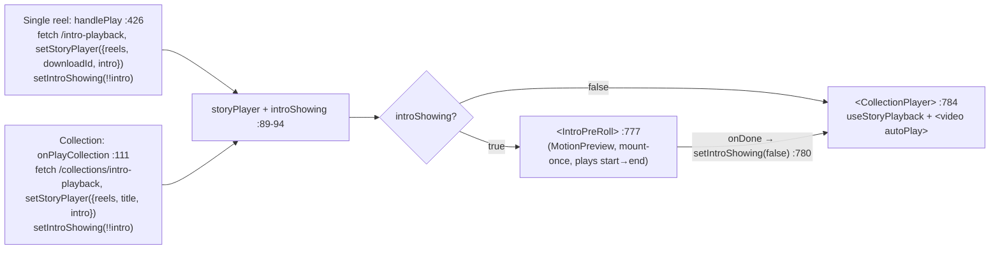
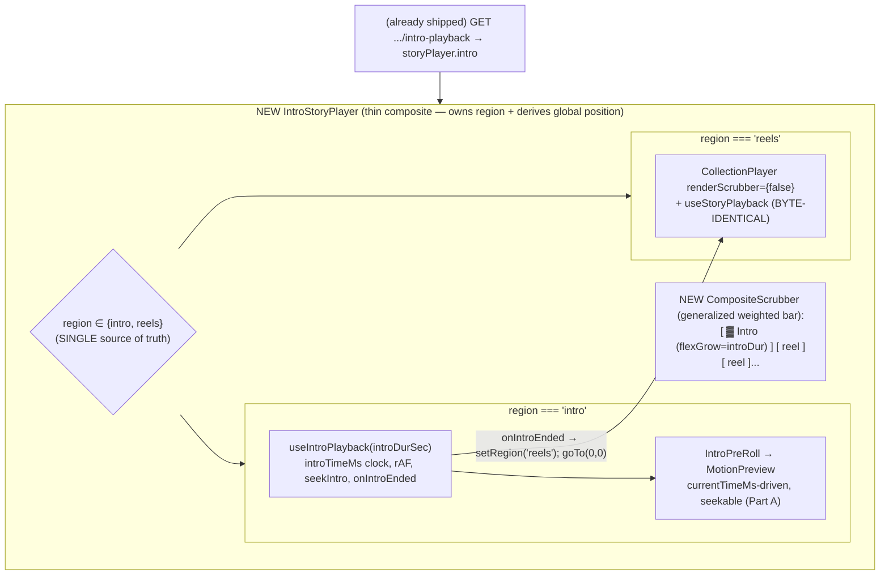

# T6710 — Owner in-app playback intro as a real composite-scrubber timeline segment (Design)

**Status:** WAITING ON USER (design gate — REVISED after T6700-merge re-audit)
**Tier:** L (frontend composite scrubber + a genuinely-seekable intro renderer over shipped playback infra; no backend change, no schema change)
**Epic:** [Player Intro + Rich Text](player-intro/EPIC.md)
**Task file:** [player-intro/T6710-owner-playback-intro-as-timeline-segment.md](player-intro/T6710-owner-playback-intro-as-timeline-segment.md)
**Extends:** [T6700](player-intro/T6700-owner-inapp-playback-intro.md) — the owner in-app playback intro **shipped** (merged via `feature/T6680`). This task EXTENDS that code, reusing the swap's fetch, both endpoints, and the intro renderer unchanged (see §1.1). It does **not** rebuild anything.

This design is approach-complete. It carries exactly **ONE new approval-gate question** (§7): whether the reel-vs-reel scrubber segments are ALSO duration-proportional or stay equal-weight among themselves. The user's two earlier open questions are now **DECIDED** (§0, decisions 1 and 2) and are NOT re-litigated here.

---

## 0. TL;DR of the decisions

| # | Decision | Choice |
|---|---|---|
| 1 | **Intro region width** (was Q1) | **DECIDED by user — PROPORTIONAL** to the intro card's actual duration relative to the whole reel/collection duration. Still visually distinct (own group, tint, "Intro" label), now proportionally sized. NOT the old "fixed equal-weight block." |
| 2 | **Backward-seek into the intro** (was Q2) | **DECIDED by user — TRUE ARBITRARY SEEK.** Scrubbing into the intro lands wherever the playhead is dropped inside the intro's own animation. NOT restart-from-0. This forces `MotionPreview` to become `currentTime`-driven — a real, conscious scope increase (§Part C, §5). |
| 3 | **Integration structure** | **(b2) intro owns its own clock + a thin composite router.** `useStoryPlayback` stays byte-identical. Add `useIntroPlayback` (the intro's own clock), an `IntroStoryPlayer` composite that owns a single `region` state and DERIVES global position, and a generalized weighted composite scrubber. **(b1) — "intro as segment 0 inside `useStoryPlayback`" — is REJECTED** (blast radius across 4 callers + it forces a faked media element the standards ban; §3). |
| 4 | **Making the intro seekable** | Feasible, LOW-MEDIUM risk. The intro card is a near-ideal WAAPI scrub target (no `<video>`, no slideshow, no infinite loops, no non-WAAPI timers). Create each WAAPI `Animation` `pause()`d; `seek(ms)` sets `a.currentTime` on all; a parent rAF advances a virtual clock forward. `fill:'both'` is already set (`MotionPreview.jsx:56/74/83`), so staggered/out-of-interval poses are free. Kill `setTimeout(onDone)` (`:87`). ONE medium-risk area: the font-settle `setState` (`introCardPreviewElements.js:277`) can remount text nodes and invalidate the WAAPI objects — the animation effect must key on `elements` identity and re-`seek` after rebuild (§Part A). |
| 5 | **Intro→reel handoff** | Composite owns it: `onIntroEnded` → `setRegion('reels')` + `goTo(0,0)`. Replaces today's `onDone={() => setIntroShowing(false)}` (`DownloadsPanel.jsx:780`). Boundary double-fire guarded by the single `region` state (§Sync surface). |
| 6 | **Payload / endpoints** | **NO backend change.** Both endpoints already SHIPPED (T6700) and are reused UNCHANGED: `GET /api/downloads/{download_id}/intro-playback` (`downloads.py:842-875`) and `GET /api/collections/intro-playback` (`collections.py:760-803`). No new route, no schema change, no migration. |

---

## 1. Current State Analysis

### 1.1 Correction: T6700 SHIPPED — this task EXTENDS it (the prior doc's premise was stale)

The previous revision of this doc claimed "T6700 never merged, build from scratch." **That was false.**
T6700 merged via `feature/T6680`; the export-pipeline knowledge doc records it as "the 5th egress —
owner in-app playback." Verified against the current tree, the owner in-app intro **already ships**:

| Already ships (REUSED unchanged) | Location |
|---|---|
| Unmount/mount **swap** gated by `introShowing` state: `IntroPreRoll` (intro) OR `CollectionPlayer` (reels) | `DownloadsPanel.jsx:776-797`; state at `:89-94` |
| Play handlers **fetch the intro payload** and stash it on `storyPlayer.intro`, then `setIntroShowing(!!intro)` | `handlePlay` `:426-471`, `onPlayCollection` `:111-129` |
| **Forward handoff** intro→reel already exists: `onDone={() => setIntroShowing(false)}` → `CollectionPlayer`'s `<video autoPlay>` fires on mount | `:780` |
| **Single-reel endpoint** (`resolve_intro_for_reel(...,mode="playback",profile_conn=conn)`) | `downloads.py:842-875` |
| **Collection endpoint** (resolves the card itself via live total duration, then `build_intro_playback_payload`) | `collections.py:760-803` |
| Serializer `build_intro_playback_payload` / resolver `resolve_intro_for_reel` | `intro_egress.py:110-138` / `:141-233` |
| Intro renderer `IntroPreRoll` → `MotionPreview` (the SAME component the editor/carousel use) | `introcards/IntroPreRoll.jsx`, `introcards/MotionPreview.jsx` |

**The genuine remaining delta** (what this task actually builds) is therefore NOT "add an intro." The
intro plays today. The delta is turning the **bolted-on pre-roll swap** into a **real single timeline**:

1. Make `MotionPreview` `currentTime`-driven (seekable), replacing its mount-once auto-play (§Part A).
2. Give the intro its own clock hook `useIntroPlayback` (a real clock for real non-media animations).
3. Replace the DownloadsPanel swap ternary with an `IntroStoryPlayer` composite that owns a single
   `region` state and DERIVES a continuous global position across intro + reels.
4. Generalize `CollectionPlayer`'s segmented bar into ONE weighted composite scrubber (segment 0 = intro,
   proportionally sized — decision 1), driven additively via a new `renderScrubber={false}` seam.

`SharedCollectionView` has its OWN identical swap (`SharedCollectionView.jsx:121-136`) — **out of scope,
untouched** (the epic explicitly scopes T6710 to the owner in-app player only).

### 1.2 The exact owner in-app render path (today — WITH the shipped T6700 swap)



This is TWO separately-mounted screens glued by a timer/callback — exactly the "commercial before the
video" the user flagged. There is no single scrubber spanning both, and no way to seek backward from the
reel into the intro.

### 1.3 The shared infra we must NOT destabilize

`CollectionPlayer` + `useStoryPlayback` already implement a **virtual playhead across N reels**:

- Segmented progress bar, **equal-width** cells (`flex gap-1`, each `flex-1`), `CollectionPlayer.jsx:216-260`.
- Per-segment click-to-seek: `handleSegmentClick` → click fraction → `goTo(i, fraction)` (`:180-184`,
  `useStoryPlayback.js:51-55`).
- Boundary advance on the `<video>` `ended` event (`useStoryPlayback.js:86-93`).
- Progress derived from `v.currentTime / v.duration` **every rAF tick, NEVER from a frozen `duration`**
  (`useStoryPlayback.js:94-105`) — deliberate, so a NULL reel duration can't break the scrubber
  (docstring `:6-10`). `pendingSeekRef` cancels an in-flight seek on transition (`:38,87`).

The hook is **100% HTMLMediaElement-driven**: it reads a real `currentTime`/`duration` and seeks by
assigning `v.currentTime`. Its contract is literally "a real element's live metadata."

**Callers that must stay green (the regression surface — all keep `useStoryPlayback` byte-identical):**

| Caller | Location | Requirement |
|---|---|---|
| Owner story player | `DownloadsPanel.jsx:776-797` | Gains the composite (this task) |
| Share swap | `SharedCollectionView.jsx:121-136` | **Out of scope — do NOT touch** |
| Ranker replay | `RankingGame.jsx:264` | Must stay intro-free |
| Dev diag harness | `collectionplayerdiag/main.jsx:64` | Unaffected |
| Characterization tests | `CollectionPlayer.characterization.test.jsx`, `useStoryPlayback.test.js` | The guard — stay byte-green |

### 1.4 The intro renderer TODAY is atomic — and that is exactly what changes

`MotionPreview` (`MotionPreview.jsx`) drives motion with the **Web Animations API** in a **mount-once**
`useEffect([])` (`:44-94`): every motion piece is a WAAPI `Animation` pushed into an `animations` array —
a photo push-in (`:51-57`), N staggered text fade-ups each with its own `delay` (`:64-76`), one white
flash (`:79-85`). It has **no `currentTime`, no `seek`, no progress callback**, and auto-completes via
`setTimeout(onDone, durationMs + 60)` (`:87`). `durationSec = card?.duration || 4.0` (`:42`).

The expert feasibility pass (§Part A) established this is a **near-ideal scrub target** — it has NO
`<video>`, NO photo slideshow, NO looping/infinite animations, and NO non-WAAPI visual timers. RichText
renders with `animation:'none'` (`introCardPreviewElements.js:139`); its font-settle rAF only recomputes
layout, it is NOT a playback clock. So making it seekable is a bounded, honest change, not a rewrite into
a fake media element. Decision 2 (true seek) makes this a first-class part of the work — see §Part A.

### 1.5 Backend: nothing new — both endpoints already ship

Both owner playback endpoints shipped with T6700 and return `{ "intro": {card, previewUrl, field_values,
profile} | null }`:

- **Single reel** — `GET /api/downloads/{download_id}/intro-playback` (`downloads.py:842-875`): resolves
  the reel's own `final_videos.intro_card_id` + `duration` via
  `resolve_intro_for_reel(..., mode="playback", profile_conn=conn)`. This is the one call site that
  intentionally passes the ambient `get_db_connection()` (same-account/same-request-user — correct here).
- **Collection** — `GET /api/collections/intro-playback?scope_type&aspect_ratio&game_id?&tags?`
  (`collections.py:760-803`): resolves the COLLECTION's own attached card against LIVE total duration,
  then `build_intro_playback_payload`. Mirrors `get_collection_intro`'s resolution block.

Both are non-fatal (200-always, `{"intro": null}` on no-attachment/resolve failure). **No change to any
backend file.** `IntroPreRoll.jsx` already reassembles the split payload back into the single `card`/
`profile` shape `MotionPreview` reads.

---

## 2. Target Architecture (the composite scrubber)



**Design principles applied:**

- [x] **DRY:** reuse `IntroPreRoll`/`MotionPreview` (now made seekable, not duplicated), both endpoints,
      `resolve_intro_for_reel`/`build_intro_playback_payload`, and `CollectionPlayer`/`useStoryPlayback`
      verbatim. Net-new code is `useIntroPlayback` + `IntroStoryPlayer` + the generalized scrubber view +
      the seekable-clock changes inside `MotionPreview`.
- [x] **Single source of truth for position:** the composite owns ONE `region` state; **global currentTime
      is DERIVED, never stored** (region==='intro' → global = intro clock; region==='reels' → global =
      introDur + Σ(prior reel durations) + activeReel.currentTime). No `globalCurrentTime` useState mirror
      of the sub-clocks (that is the reactive duplication the standards ban).
- [x] **Minimal branches:** cross-boundary scrub is a SINGLE comparison `if (globalMs < introDurMs)` →
      `seekIntro` else `goTo(reelIdx,frac)`. Region routing is one value, not scattered conditionals.
- [x] **No faked media element:** the intro clock lives in `useIntroPlayback` (a real clock for real
      non-media WAAPI animations). We never hand `useStoryPlayback` a fake `{currentTime, duration, play}`
      object — that is precisely why (b1) is rejected (§3).
- [x] **No new shared-infra coupling:** `useStoryPlayback` and its 3 other callers are byte-unchanged;
      `CollectionPlayer` gets ONE additive default-on prop.

---

## 3. Chosen Approach — (b2), with the (b1) rejection made explicit

The user's decisions (true seek + proportional intro) require the intro to be part of ONE timeline with a
continuous playhead. Two ways to structure that:

| | **(b1) intro as "segment 0" inside `useStoryPlayback`** | **(b2) intro owns its own clock + thin composite router (CHOSEN)** |
|---|---|---|
| Shared-hook change | Rewrites the core of a hook shared by 4 callers (SharedCollectionView `:129`, RankingGame `:264`, diag `:64`, owner) | **Zero change** — hook stays byte-identical; all 4 callers + characterization tests untouched |
| Faked-state risk | Forces either intro-specific branching into the shared hook for an owner-only feature, OR handing it a FAKE object with `.currentTime/.duration/.play()` — **exactly the "fake nonexistent media element" the coding standards BAN** | Intro clock is a REAL clock in its own sibling hook; nothing is faked |
| Global position | Would live inside a media-driven hook that reads `v.currentTime` — no honest place for a non-media segment | **Derived** in the composite from whichever sub-clock is active — no third stored clock |
| Blast radius / disqualifier | Blast-radius + invariant violation + no-faked-state → **DISQUALIFIED** | Additive; the one seam that touches `CollectionPlayer` is a default-on `renderScrubber` prop |

**(b2) is adopted.** It keeps the shared infra frozen, gives the intro an honest clock, and makes the
composite the single owner of position. The three new/changed pieces:

- **`useIntroPlayback(introDurationSec)`** — a tiny sibling hook: `introTimeMs` state, a rAF that advances
  it while playing, `seekIntro(ms)`, and `onIntroEnded` fired once `introTimeMs >= durationMs`. Drives
  `MotionPreview`'s new `currentTimeMs` prop. The honest home for the intro clock.
- **`IntroStoryPlayer`** — the composite container replacing the DownloadsPanel swap ternary; owns the
  single `region` state and the derived global position.
- **Generalized composite scrubber** — `CollectionPlayer`'s segmented bar generalized to an ordered list
  of weighted segments (segment 0 = intro). Proportional width (decision 1) is nearly free: replace
  `flex-1` (equal) with `style={{flexGrow: seg.durationSec}}`; intro width =
  `introDur / (introDur + ΣreelDur)` automatically.

### Part A — making `MotionPreview` truly seekable (first-class part of the approach)

Effort ~0.5–1 day, LOW-MEDIUM risk. The card is a near-ideal WAAPI scrub target (§1.4). Implementation:

- **Pause, don't auto-play.** Build each of the three animation types `pause()`d instead of letting them
  auto-play from mount. Expose (imperatively or via a `currentTimeMs` prop effect) `seek(ms)` =
  `animations.forEach(a => a.currentTime = ms)`.
- **Forward playback is virtual-clock-driven.** `useIntroPlayback`'s rAF advances a virtual `clockMs`; the
  component `seek(clockMs)` each frame. A scrub calls the SAME `seek(ms)`. One code path for play and scrub.
- **`fill:'both'` already set** on all three animation kinds (`:56/:74/:83`), so staggered `delay`s and
  out-of-interval poses (before a text line's delay, after the flash) resolve automatically — **no manual
  stagger bookkeeping**, no per-element offset math.
- **Kill `setTimeout(onDone)` (`:87`).** Auto-continue becomes "virtual clock reached `durationMs`", owned
  by `useIntroPlayback`'s `onIntroEnded` → the composite. `MotionPreview` no longer decides when the intro
  ends.
- **THE ONE NON-TRIVIAL AREA (medium risk): the font-settle rebuild.** `useCardPreviewElements`
  (`introCardPreviewElements.js:238-296`) can fire a late `setState` (`:277`) up to ~45 frames after mount
  that REMOUNTS text-slot DOM nodes, invalidating the WAAPI `Animation` objects bound to them. So the
  animation-building effect **must depend on `elements` identity (and box size), NOT `[]`**, and
  **re-apply `seek(currentClockMs)` after any rebuild**. This actually **FIXES a latent staleness bug** in
  today's mount-once code (where a post-settle remount silently detaches the running animations) rather
  than adding risk.
- **Photo decode race:** reuse the existing skeleton-until-loaded guard (`CollectionPlayer.jsx:70,333`
  `videoReady` pattern) for the intro photo `` decode, so a scrub-to-mid never shows an un-decoded
  frame.

---

## 4. Implementation Plan

### (i) `MotionPreview.jsx` — become `currentTimeMs`-driven + seekable

- Add a `currentTimeMs` prop (the driven clock from `useIntroPlayback`). On change, `seek(currentTimeMs)`.
- Build each WAAPI `Animation` `pause()`d; keep `fill:'both'` (already present).
- Change the animation-building `useEffect` deps from `[]` to `[elements, boxWidth, boxHeight]`
  (identity-keyed rebuild); after each rebuild, re-`seek(currentTimeMs)` so a font-settle remount holds
  the current pose instead of snapping to 0.
- Delete `setTimeout(onDone, durationMs + 60)` (`:87`) — end-of-intro is now the composite's call via the
  clock reaching `durationMs`. (`onDone` may be removed from `MotionPreview` entirely; the composite owns
  auto-continue.)
- Guard the photo `` with the existing skeleton-until-decoded pattern.

### (ii) NEW `useIntroPlayback.js` (co-located, e.g. `introcards/useIntroPlayback.js`)

```pseudo
useIntroPlayback(introDurationSec):
  durationMs = introDurationSec * 1000
  introTimeMs = useState(0)
  playing = useState(true)
  rAF loop (while playing && region-active):        // advance virtual clock
     introTimeMs = min(introTimeMs + dt, durationMs)
     if introTimeMs >= durationMs: onIntroEnded()   // fired ONCE (guard below)
  seekIntro(ms): introTimeMs = clamp(ms, 0, durationMs)   // arbitrary seek (decision 2)
  return { introTimeMs, playing, setPlaying, seekIntro, onIntroEnded_subscription }
```

The clock is frozen (no rAF advance) whenever the composite's `region !== 'intro'`.

### (iii) NEW `IntroStoryPlayer.jsx` (composite container, co-located in `introcards/`)

The single thing `DownloadsPanel` mounts in place of the swap ternary. Owns the SINGLE `region` state and
the DERIVED global position (no stored `globalCurrentTime`).

```pseudo
IntroStoryPlayer({ intro, aspect, reels, ...collectionPlayerProps }):
  region = useState(intro ? 'intro' : 'reels')     // single source of truth
  introDurSec = intro ? (intro.card?.duration || 4.0) : 0
  { introTimeMs, seekIntro, onIntroEnded } = useIntroPlayback(introDurSec)

  // global position is DERIVED, never stored:
  globalMs = region === 'intro'
      ? introTimeMs
      : introDurMs + Σ(priorReelDurations) + activeReel.currentTime*1000

  onIntroEnded:                                     // forward auto-continue
     if region !== 'intro': return                 // double-fire guard (region left already)
     setRegion('reels'); goTo(0, 0)                // replaces DownloadsPanel :780

  onScrub(globalMs):                               // single boundary comparison
     if globalMs < introDurMs:
        setRegion('intro'); seekIntro(globalMs)     // arbitrary seek INTO intro (needs Part A)
     else:
        setRegion('reels'); goTo(reelIdxFor(globalMs), fracWithinReel)

  return (
    <CompositeScrubber weights=[introDurSec, ...reelDurs] globalMs=globalMs onScrub=onScrub />
    region === 'intro'
      ? <IntroPreRoll intro={intro} aspect={aspect} currentTimeMs={introTimeMs} />
      : <CollectionPlayer reels={reels} renderScrubber={false} {...collectionPlayerProps} />
  )
```

### (iv) NEW generalized composite scrubber view

Generalize `CollectionPlayer`'s segmented bar (`:216-260`) into an ordered list of weighted segments,
segment 0 = intro. Extract the segment-cell render into a small `CompositeScrubber` (or a shared
`SegmentedBar`) that both the composite and (optionally) `CollectionPlayer` can render:

- **Proportional width (decision 1):** replace each cell's `flex-1` (equal weight) with
  `style={{ flexGrow: seg.durationSec }}`. Intro width = `introDur/(introDur+ΣreelDur)` automatically.
- Segment 0 (intro) is the visually-distinct group: a tint (e.g. `bg-blue-400` fill, `bg-blue-400/25`
  track) + a small "Intro" label + a thin divider before the reel cells. Discoverable at rest,
  `aria-label`, ≥44px coarse hit target (style-guide "discoverable never hover-only").
- Fill per segment: intro fill = `introTimeMs/introDurMs`; reel cells keep today's
  `i<active?100 : i===active?segmentProgress*100 : 0` math.
- Click/drag → `onScrub(globalMs)` mapping the click fraction across the weighted widths back to a global
  ms.

### (v) `CollectionPlayer.jsx` — additive `renderScrubber` seam + weighted-bar generalization

- Add optional `renderScrubber = true` prop. When `false`, suppress the internal segmented bar (the
  composite supplies the single bar). **Default true → every existing caller byte-unchanged.**
- Generalize the internal bar to the shared weighted `SegmentedBar` (the same component the composite uses)
  so there is ONE segmented-bar implementation, not two. With `renderScrubber` default-on and equal
  weights (all reels same `flexGrow`, or falling back to `flex-1` when durations are null), the standalone
  render is visually identical to today — the characterization test guards this.
- This is **the only seam that touches `CollectionPlayer`** — additive and default-on.

### (vi) `DownloadsPanel.jsx` — swap the ternary for the composite

The fetch, `storyPlayer.intro`, and `introShowing` plumbing already ship (§1.1). Change only the render
block (`:776-797`): replace the `introShowing ? <IntroPreRoll…> : <CollectionPlayer…>` ternary with a
single `<IntroStoryPlayer intro={storyPlayer.intro} aspect={…} reels={storyPlayer.reels} {…same props}/>`.
`introShowing` state is no longer needed (the composite owns `region`); it can be removed, or left inert.
When `intro` is null, `IntroStoryPlayer` starts in `region='reels'` and is behaviorally identical to a
bare `CollectionPlayer` (AC #5).

**Data-always-ready:** the fetch is still the named Play gesture (already shipped) — not reactive
persistence, not a `useEffect` watching state. It reads a payload; it writes nothing. The composite's
children assume `intro` is resolved (or null) before mount.

### (vii) Backend — REUSED UNCHANGED

Both endpoints ship (§1.5). No route, serializer, resolver, schema, or migration change. State this
explicitly at review: the diff is frontend-only.

---

## 5. Synchronization surface

| Concern | Rule |
|---|---|
| **Global currentTime** | **DERIVED, no third clock.** region==='intro' → global = intro clock; region==='reels' → global = introDur + Σ(prior reel durations) + activeReel.currentTime. Never a `globalCurrentTime` useState. |
| **Playing state** | Composite owns `region`; play/pause forwarded ONLY to the active sub-hook. The inactive clock is frozen (no rAF advance / element paused). |
| **Forward auto-continue** | `onIntroEnded` → `setRegion('reels')` + `goTo(0,0)`. Replaces today's `setIntroShowing(false)` (`DownloadsPanel.jsx:780`). |
| **Scrub crossing the boundary** | SINGLE comparison: `if (globalMs < introDurMs)` → `seekIntro(globalMs)` (needs Part A) else `goTo(reelIdx, frac)`. |
| **Boundary double-fire mitigation** | Ignore `onIntroEnded` once `region !== 'intro'` (mirrors the hook's `pendingSeekRef` cancel-on-transition, `useStoryPlayback.js:38,87`). Tested for BOTH forward auto-continue AND a fast forward-scrub-past-intro. |
| **Backward scrub reel-0 → intro** | `setRegion('intro'); seekIntro(frac*introDurMs)`. Works ONLY because Part A made the intro seekable. |

---

## 6. Effort / risk delta (honest — the user's two decisions cost real scope)

A restart-only intro (the prior doc's recommendation) would be ~0.5 day, near-zero risk. The user's two
decisions — **true arbitrary seek** and **proportional width** — add ~2–3 days and ONE medium-risk area
(the font-settle animation rebuild + the boundary handoff): roughly **4–5×** the restart-only path. This
tradeoff is a conscious, user-directed choice; it is stated plainly so it stays conscious.

### Risks

| # | Risk | Mitigation |
|---|---|---|
| R1 | **Font-settle rebuild invalidates WAAPI animations mid-scrub** — `useCardPreviewElements` (`introCardPreviewElements.js:277`) can remount text nodes ~45 frames post-mount, detaching the `Animation` objects. | Animation effect keyed on `elements` identity (+ box size), NOT `[]`; re-apply `seek(currentClockMs)` after every rebuild. Characterization test: a settle-triggered remount at `currentTimeMs=X` leaves the visual at X, not 0. Note this FIXES a latent staleness bug in today's mount-once code. |
| R2 | **Boundary double-fire** at intro→reel (auto-continue firing while a scrub also crosses). | Single `region` state as guard; ignore `onIntroEnded` once region left `'intro'` (mirrors `pendingSeekRef`). Test BOTH forward auto-continue AND a fast forward-scrub-past-intro. |
| R3 | **Proportional REEL widths need LIVE durations** — a frozen `reel.duration` is nullable (the hook's founding constraint, `useStoryPlayback.js:6-10`). Intro duration IS known (`card.duration || 4.0`), so the intro weights proportionally immediately; reel-vs-reel proportional widths need a live-duration source the segmented bar doesn't have today. | **This is the ONE new open question (§7).** Intro-proportional is safe now. Reel-vs-reel proportional is opt-in and only if the user wants it; the fallback (equal-weight reels) needs no new duration source. |
| R4 | **Shared-infra byte-identity** — `useStoryPlayback` + 3 other `CollectionPlayer` callers must stay green. | Hook byte-unchanged. `CollectionPlayer` gains ONE additive default-on `renderScrubber` prop; the shared `SegmentedBar` with equal weights renders identically to today. Characterization test asserts the default path is unchanged; ranker/share/diag pass nothing new. |
| R5 | **Payload parity** owner playback vs share playback. | Untouched — both already call the SAME `build_intro_playback_payload`. No backend change means no divergence introduced. |
| R6 | **Null-duration handling** (reels and, on the inherit path, cards). | Intro width uses `card.duration || 4.0` (never null). Reel cells keep the live-progress derivation (never a frozen duration). If reels stay equal-weight (§7 default), null reel durations never size the bar. |

**No schema change → no migration. No backend change at all.** Migration agent NOT required.

---

## 7. Reel-vs-reel proportional width — FINAL DECISION + caller-impact check

**Decided (do NOT re-ask):** intro region width = **PROPORTIONAL** (decision 1); backward-seek into the
intro = **TRUE ARBITRARY SEEK** (decision 2). Both are the user's settled calls.

**Decided (2026-08-09, supersedes the §7 recommendation below) — Option (B): EVERYTHING proportional.**
Reel cells are ALSO duration-proportional, not just the intro. This is a **global change to
`CollectionPlayer`'s shared segmented bar**, not a prop gated per-caller — every caller that renders the
bar gets proportional weighting where a segment's duration is known. The user explicitly chose the bigger
option knowing it touches shared infra beyond the owner path; the caller-impact check below was run before
implementation per that instruction.

### 7.1 Caller list, re-verified against the tree (not the stale doc list)

`grep -rn "CollectionPlayer" src` was re-run; excluding comment-only hits (`BrandedEndCard.jsx`,
`ProgressTrack.jsx`, `zLayers.js`), there are exactly **4 render call sites** and **2 guard test files**:

| # | Caller | File:line | Reels passed | Segment count | Duration values |
|---|---|---|---|---|---|
| 1 | Owner in-app (this task) | `DownloadsPanel.jsx:784` | `toPlayerReel`/`toPlayerReels` (`playerReels.js:12`) | 1 (single reel) or N (collection) | `d.duration` — comment: **"may be null; the player never relies on it"** |
| 2 | Public share view | `SharedCollectionView.jsx:129` | `data.members.map(...)` inline | N (collection members) | `m.duration` ← `final_videos.duration`, backend-typed **`float \| None`** (`shares.py:82`) |
| 3 | Ranker replay | `RankingGame.jsx:264` | `reels={[replayReel]}` (`toReplayReel`, `RankingGame.jsx:17`) | **always exactly 1** | not set on `toReplayReel`'s output (undefined) |
| 4 | Dev diag harness | `collectionplayerdiag/main.jsx:64` | hardcoded `REELS` const | **always exactly 1** | `duration: null` (explicit) |
| — | `CollectionPlayer.characterization.test.jsx` | segment-bar guard | 3 fixture reels | 3 | `duration: null` (all 3) |
| — | `CollectionPlayer.test.jsx` | behavior tests | varies | varies | mixed |

### 7.2 Safety verdict per caller

- **#3 Ranker replay and #4 diag harness are structurally immune.** Both ALWAYS pass a single-element
  `reels` array. A segmented bar with one segment renders at 100% width under `flex-1` **and** under
  `flexGrow: duration` identically — there is no second segment to be unequal against. **No behavior
  change is observable for either caller, under any weighting scheme.** Neither has "a reason to want
  equal-width" because equal-vs-proportional is not a distinction that exists for N=1.
- **#2 Public share view (`SharedCollectionView`) is the one caller materially affected.** It renders real
  multi-member bars (N≥2 is the common case for a shared collection), and `final_videos.duration` is
  genuinely nullable in production (not a hypothetical — `shares.py:82` types it `float | None`, and
  `playerReels.js:12`'s own comment independently confirms the same field "may be null" for the owner
  path). **This directly conflicts with an existing line in THIS SAME design doc (§1.1 and §1.3):
  "`SharedCollectionView` has its OWN identical swap — out of scope, untouched."** A non-gated global
  change to `CollectionPlayer`'s internal bar necessarily reaches this caller too — there is no way to
  make the shared bar proportional "for everyone" while also leaving this one caller untouched, because
  that would require exactly the per-caller gate the user's decision rejects.
- **#1 Owner in-app is the intended target** — no concern, this is the task.

**No caller has a functional reason to WANT equal-width** (nothing depends on segments being visually
equal). The only real finding is the **scope conflict** for #2: this task's own doc marks
`SharedCollectionView` out of scope, yet the chosen (B) implementation mechanism (global, not per-caller)
will change its rendered output too. Flagging per the instruction rather than silently shipping it.

### 7.3 Resolution — AWAITING USER APPROVAL

This is the one thing the caller-impact check surfaced that the user has not yet explicitly decided. Two
ways to resolve the conflict with §1.1/§1.3's "out of scope — do NOT touch" line:

- **(i) Let it flow through globally, including to `SharedCollectionView`.** Read "out of scope" as
  "do not add T6700 intro-swap code paths there" (the concern that line was written for), not "the shared
  bar's visual weighting must never change for it." Proportional segment widths on the public share page
  become an accepted, intentional side effect of making `CollectionPlayer`'s bar duration-proportional
  globally — no new prop, no per-caller branch. Matches the user's "not gated per-caller" instruction
  literally.
- **(ii) Structurally scope it to the owner path.** Add an explicit opt-in weighting prop on
  `CollectionPlayer` (default off = today's `flex-1`), turned on only by the owner composite
  (`IntroStoryPlayer`/`DownloadsPanel`). Preserves §1.1/§1.3's boundary exactly, at the cost of
  reintroducing the per-caller gate the "everything proportional" instruction was pushing away from.

**Recommendation: (i).** The scope conflict is with a stale internal cross-reference in this doc, not with
a functional reason `SharedCollectionView` needs equal width (§7.2 found none). Gating it back per-caller
just to preserve a sentence in §1.1 would be process cargo-culting, not a real product requirement. Pick
(ii) only if there's a reason the public share page should NOT show proportional segments that hasn't
surfaced yet.

### 7.4 Null-duration handling (needed regardless of the scope question above)

`reel.duration` is nullable on every caller that supplies it (see table). The weighted bar needs an
explicit fallback so a null/0 duration cannot collapse a segment to zero width or throw on
`flexGrow: null`:

- **Fallback weight = 1** for any reel with a null/0/undefined duration (mirrors `flex-1`'s old implicit
  equal-share for exactly the reels that have no better data). Reels WITH a known duration weight by that
  duration; reels WITHOUT one weight `1` alongside them — a bar can legitimately mix both in the same row
  (e.g., an older reel with no probed duration next to a recently-exported one that has it).
- This is a **presentational weight only** — it does NOT feed `useStoryPlayback`, which keeps deriving
  live progress from `v.currentTime / v.duration` exactly as today (§1.3, unchanged). The hook's
  "never trust frozen duration for playback correctness" invariant is preserved; only the bar's initial
  layout weight uses the frozen value, and only as a hint.
- All-null fixture sets (`CollectionPlayer.characterization.test.jsx`'s 3 reels, `RankingGame`/diag's
  single reel) render IDENTICALLY to today under this fallback — confirms 7.2's "no observable change"
  conclusion for #3/#4, and gives #2/#1 a defined, non-crashing behavior when duration data is thin.

### 7.5 Required test update (mechanical, not a functional regression)

`CollectionPlayer.characterization.test.jsx:53-58` (`renders each segment as a flex-1 py-2 hit target`)
asserts the literal Tailwind class `flex-1` on every segment button. Implementing weighted segments swaps
static `flex-1` for an inline `style={{ flexGrow }}`, so this assertion breaks on the class name even
though the rendered widths are unchanged (all 3 fixture reels have `duration: null` → fallback weight 1
each → still equal thirds). Stage 3 must update this assertion to check computed width/flexGrow instead of
the class string; this is a fixture-following mechanical change, not evidence of a regression.

---

## 8. File-by-file change list

### Frontend

| File | Change |
|---|---|
| `components/introcards/MotionPreview.jsx` | **CHANGED — seekable.** Add `currentTimeMs` prop; build WAAPI animations `pause()`d; `seek(ms)` sets `a.currentTime` on all; effect deps `[]`→`[elements,boxW,boxH]` with re-`seek` after rebuild; DELETE `setTimeout(onDone)` (`:87`); skeleton-until-decoded photo guard. |
| `components/introcards/useIntroPlayback.js` | **NEW.** The intro's own clock: `introTimeMs`, rAF forward advance, `seekIntro(ms)`, `onIntroEnded`. |
| `components/introcards/IntroStoryPlayer.jsx` | **NEW.** Composite container: owns single `region` state, DERIVES global position, forward auto-continue (`onIntroEnded`→`goTo(0,0)`), boundary scrub routing, boundary double-fire guard. Replaces the DownloadsPanel swap ternary. |
| `components/collections/CollectionPlayer.jsx` | Additive `renderScrubber = true` prop (default on → other callers byte-unchanged); generalize the internal segmented bar to the shared weighted `SegmentedBar`. The one seam touching this file. |
| `components/introcards/IntroPreRoll.jsx` | Thread the new `currentTimeMs` through to `MotionPreview` (payload reassembly unchanged). |
| `components/DownloadsPanel.jsx` | Swap the render ternary (`:776-797`) for `<IntroStoryPlayer …>`; `introShowing` state retired (composite owns `region`). Fetch + `storyPlayer.intro` already ship — unchanged. |
| (new) shared `SegmentedBar` (extracted from `CollectionPlayer.jsx:216-260`) | Ordered weighted segments, `style={{flexGrow: seg.durationSec}}` (proportional; equal weights = today's behavior). Used by both the composite and `CollectionPlayer`. |

### Backend

| File | Change |
|---|---|
| `routers/downloads.py` | **NO CHANGE.** `GET /{download_id}/intro-playback` (`:842-875`) reused as-is. |
| `routers/collections.py` | **NO CHANGE.** `GET /intro-playback` (`:760-803`) reused as-is. |
| `services/intro_egress.py` | **NO CHANGE.** `resolve_intro_for_reel` / `build_intro_playback_payload` reused. |

**No schema change, no migration, no Modal change, no backend change.**

---

## 9. Test Plan Sketch (Stage 3 writes these)

**Frontend unit (Vitest):**
- `MotionPreview` **seek characterization:** with `currentTimeMs=X`, the animations hold pose X (`seek-to-X-holds`); a font-settle-triggered remount at `currentTimeMs=X` leaves the visual at X, not 0 (R1 guard); no `setTimeout` auto-continue fires (ownership moved to the composite).
- `useIntroPlayback`: rAF advances `introTimeMs` while playing; `seekIntro(ms)` clamps to `[0,durationMs]`; `onIntroEnded` fires ONCE at `durationMs`; clock frozen while inactive.
- `IntroStoryPlayer` **region routing + boundary handoff:** non-null `intro` starts `region='intro'`; `onIntroEnded` → `region='reels'` + `goTo(0,0)` (forward auto-continue); a forward scrub PAST the intro also lands in reels without double-firing (R2); a backward scrub into the intro sets `region='intro'` + `seekIntro`; `intro=null` starts directly in `region='reels'` (pass-through, AC #5).
- **Composite scrubber proportional widths:** intro cell `flexGrow` == `introDur`; reel cells per the §7 choice (equal-weight in option A); intro cell renders the distinct tint/label/divider.
- `CollectionPlayer` `renderScrubber` default: default-on renders the (now shared) internal bar identically to today (characterization guard); `false` suppresses it.

**Frontend E2E (Playwright):**
- Owner plays a reel/collection WITH an intro → ONE continuous timeline (proportional intro segment + reel cells); intro plays then auto-continues into the reel with no manual resume (AC #1, #2).
- Seeking within the reel portion works normally (AC #3).
- Backward scrub from reel-0 INTO the intro lands at an arbitrary offset inside the intro and resumes correctly (AC #4 — true seek, decision 2).
- Owner plays a reel/collection with NO intro → single plain timeline, byte-identical to today (AC #5).
- **Regression:** `SharedCollectionView` (share swap) and `RankingGame` replay still mount a bare `CollectionPlayer` with no intro region.

**Backend (pytest):**
- The existing T6700 endpoint tests for `GET /api/downloads/{id}/intro-playback` and `GET /api/collections/intro-playback` stay green (reused, no change). No new backend tests required by this task.
