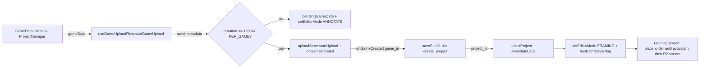

# T7280 Design — Single-Clip Upload Goes Straight to Framing

**Status:** APPROVED (2026-08-20) — Option B; threshold 120s inclusive; escape hatch confirmed; already_owned re-upload skips auto-clip save (mirrors T1540 resume-import guard), still jumps to Framing.
**Tier:** L (frontend-only) · **Backend:** read/verify only (HARD FENCE — see §7)
**Author:** Architect agent, building on the Stage-1 Code Expert audit.

---

## 0. Open Questions (READ FIRST — these gate approval)

1. **Blob-source decision (§3).** I recommend **Option B (processing placeholder, no blob playback in Framing)** over Option A (teach Framing to play the upload blob). Option A is closer to the task's literal wording ("instant Framing preview from the upload blob, like Annotate") but is materially riskier and larger. Do you accept B, or do you want the instant-blob preview of A despite the added risk/LOC? This is the single biggest call in the doc.
2. **Threshold value & unit.** `SINGLE_CLIP_THRESHOLD_SECONDS = 120` (≤ 120s inclusive takes the fast path). Confirm 2 minutes and confirm **inclusive** (a clip of exactly 120.0s goes to Framing).
3. **Escape-hatch persistence.** The "Treat as full game" escape removes nothing (the auto clip stays a valid Annotate region). Confirmed acceptable? (The user lands in Annotate with one full-span clip already present.)
4. **Dedup / already-owned fast path.** If the uploaded single clip is a byte-dup of an existing game (`already_owned`, uploadManager.js:744), `onGameCreated` still fires and the game already has clips. Should the fast path still auto-create a full-span clip + reel and jump to Framing, or should a re-upload of an owned clip behave like today (land on the existing game)? I propose **still jump to Framing** but SKIP the auto-clip save when the game already has annotations (mirrors the T1540 resume import at AnnotateContainer.jsx:420-430). Confirm.

---

## 1. Current State Analysis

### 1.1 The nav seam (decision happens BEFORE duration is known)

`ProjectsScreen.handleAnnotateWithFile` (ProjectsScreen.jsx:339-342) is the single navigation seam for a new upload:

```js
const handleAnnotateWithFile = useCallback((gameData) => {
  pendingGameData = gameData;        // module-level breadcrumb (ProjectsScreen.jsx:22)
  setEditorMode('annotate');         // hardcoded — no duration branch anywhere
}, [setEditorMode]);
```

`gameData` shape at this point (`GameDetailsModal` → `ProjectManager.handleCreateGame` at ProjectManager.jsx:748-749):
`{opponentName, gameDate, gameType, tournamentName, videoMode}` **plus** either `file` (PER_GAME) or `files:[f1,f2]` (PER_HALF). **Duration is NOT present here** — no metadata has been extracted yet.

The breadcrumb is consumed by `AnnotateScreen`, which drives `AnnotateContainer.handleGameVideoSelect(file, gameDetails)`.

### 1.2 Where duration first exists (async, post-seam)

`extractVideoMetadata(file)` (videoMetadata.js:411) is **async** and returns `{duration (seconds, float), width, height, ...}`. It is first awaited inside `AnnotateContainer.handleGameVideoSelect` (AnnotateContainer.jsx:360), which is **after** the nav decision. So the branch cannot be synchronous at the current seam — it must `await` metadata at/just after file pick.

### 1.3 The upload chain and the first moment `game_id` exists

```
handleGameVideoSelect (AnnotateContainer.jsx:350)
  → await extractVideoMetadata (L360)
  → uploadStore.startUpload(file, details, meta, null, displayInfo, onGameCreated)  (L452)
      → wraps onGameCreated, also stores uploadGameId  (uploadStore.js:184-187)
      → uploadManager.uploadGame(...)  (uploadManager.js:715)
          → createGame(..., 'pending')  (L739)
          → options.onGameCreated({game_id, name})  (L764)   ← FIRST point game_id exists
          → ensureVideoInR2 (byte upload)  (L769)
          → activateGame(game_id)  (L775)   ← clip R2 playback URL only resolvable AFTER this
```

The auto-clip save MUST fire from **`onGameCreated`** — the earliest point the new `game_id` exists, and (on the fast path) there is no active game to confuse it with (T7010: use the callback's `game_id`, never a stale ref).

### 1.4 The auto-clip rail (no backend change)

`useRawClipSave.saveClip(gameId, clipData)` (useRawClipSave.js:117) POSTs `/api/clips/raw/save` with `{game_id, start_time, end_time, name, rating, tags, notes, video_sequence?, create_project?}`. `create_project` passes through (L144) and the response carries `project_id` when a reel was created (L175-177). Dedup guard keys on `${gameId}-${start}-${end}` (L119). On success it calls `refreshQuestProgress` (L179).

Auto clip = `saveClip(newGameId, {start_time: 0, end_time: duration, video_sequence: 1, create_project: true, name})` → returns `{ project_id, ... }`.

**Backend verified (clips.py:1009 `save_raw_clip`):** `RawClipCreate` already accepts every field; idempotent on the natural key `(game_id, end_time, video_sequence)` (clips.py:1050); `game_id` write-once (T7010). **No backend change needed. HARD FENCE HOLDS.**

### 1.5 Framing entry — and the PRINCIPAL HAZARD

Framing reads `projectId`/`project` from `ProjectContext` (`useProject()`, FramingScreen.jsx:42), which resolves from `useProjectsStore.selectedProjectId`. Clips come from `projectDataStore`, fetched by **an entry-gesture owner** — Framing does NOT fetch on mount (T6190, FramingScreen.jsx:470-473); re-adding a mount fetch is BANNED.

Closest precedent — the "re-edit reel" path `DownloadsPanel.onOpenProject` (App.jsx:899-916):
```
reset stores → fetchProjects({force}) ∥ selectProject(projectId)
  → invalidateClips(projectId)          ← this gesture OWNS the clip fetch (no loadProject)
  → setEditorMode(FRAMING)
```
The single auto-clip is the only clip in the project, so `useClipManager` auto-selects `clips[0]` (FramingScreen.jsx:90 region) — **no T3960 select-on-load loop is needed** (that loop only matters when picking a specific clip out of many).

**PRINCIPAL HAZARD — Framing has NO working blob-source path for a freshly-uploaded game clip.**
- FramingScreen resolves a clip's video via `getClipVideoConfig` (FramingScreen.jsx:416-456): a clip with `game_video_url` (which a game clip has) routes to `GET .../clips/{id}/playback-url` → presigned R2 (L424-436). That URL **does not resolve until upload bytes land AND `activateGame` runs** (uploadManager.js:769-775).
- The mount load effects explicitly bail on blob URLs: the `useLayoutEffect` at L515 (`if (!clipUrl || clipUrl.startsWith('blob:')) return;`) and the streaming branch guard at L578.
- There IS a blob `else` branch (L582-588) that calls `loadVideoFromUrl(clipUrl, ...) → setVideoFile`, **but** it only triggers when `getClipVideoConfig` RETURNS a blob URL. For a game clip it returns the R2 `playback-url`, never a blob — so the blob branch is dead for this flow. `useProjectLoader.js:145` similarly assumes `game_video_url`/`filename`.

So, unlike Annotate (which gets instant blob playback via `useAnnotateState` early-src + the upload-store restore effects), **Framing today cannot preview the still-uploading source.** Resolving this — frontend-only — is the central design decision (§3).

### 1.6 Multi-file exclusion & quests

- Multi-file (PER_HALF) is `gameData.files` present + `videoMode === PER_HALF`. The branch must guard on `videoMode === PER_GAME` (equivalently `gameData.file && !gameData.files`). Multi-file **never** takes the fast path (§ guard in Target).
- Quests are DB-derived, not counters: `upload_game` and `add_clip` both key on `rc.total >= 1` (quests.py:188, 196-199). The auto clip completes `add_clip` via the same rails; nothing double-fires.

### 1.7 Code smells in the current seam

| Smell | Location | Impact |
|-------|----------|--------|
| Feature envy / split flow | Nav decided in `ProjectsScreen` (L339) but upload+metadata+clip-save logic lives in `AnnotateContainer` (L350-466) | The fast path needs the same upload+clip logic WITHOUT entering Annotate → temptation to duplicate `handleGameVideoSelect`. Must extract, not copy. |
| Hidden temporal coupling | `onGameCreated` fires before R2 activation; Framing assumes an R2-resolvable clip source | Naive "jump to Framing on onGameCreated" mounts a `<video>` against a URL that 404s until activation. |

---

## 2. Target Architecture

### 2.1 Design principles applied

- [x] **DRY / single code path:** the upload + metadata + auto-clip logic is extracted into ONE shared helper (`useGameUploadFlow`, §4) that BOTH the Annotate path and the Framing fast path call. No copy of `handleGameVideoSelect`.
- [x] **One greppable threshold:** `SINGLE_CLIP_THRESHOLD_SECONDS = 120` in `uploadManager.js` next to `UPLOAD_PHASE`/`UPLOAD_STATUS` (uploadManager.js:21-40) — the existing home of upload constants. Not computed, string/number literal near use.
- [x] **No branch sprawl:** ONE `if (duration <= THRESHOLD && isSingleFile)` decides fast vs classic; everything else is the existing rails.
- [x] **Gesture-based persistence:** the auto-clip save is wired into the `onGameCreated` callback chain — a direct consequence of the upload-button gesture. NO `useEffect` watching upload state. (§4 states this invariant + shows the call site.)
- [x] **Data always ready:** the "processing" placeholder (Option B) means the Framing video stage renders a guarded placeholder until the clip source is ready; the View never null-checks a video that isn't there.

### 2.2 Fast-path sequence

```mermaid
sequenceDiagram
    participant U as User
    participant PM as ProjectManager/GameDetailsModal
    participant Flow as useGameUploadFlow (shared)
    participant US as uploadStore.startUpload
    participant UM as uploadManager.uploadGame
    participant Clip as useRawClipSave.saveClip
    participant PS as projectsStore / projectDataStore
    participant FR as FramingScreen

    U->>PM: pick single file + details, click Upload
    PM->>Flow: startGameUpload(gameData)
    Flow->>Flow: await extractVideoMetadata(file)  // duration known
    alt duration <= 120s AND PER_GAME
        Flow->>US: startUpload(file, ..., onGameCreated)
        US->>UM: uploadGame(...)
        UM->>UM: createGame('pending')
        UM-->>Flow: onGameCreated({game_id, name})
        Flow->>Clip: saveClip(game_id, {0..duration, video_sequence:1, create_project:true})
        Clip-->>Flow: { project_id }
        Flow->>PS: selectProject(project_id) ∥ invalidateClips(project_id)
        Flow->>FR: setEditorMode(FRAMING) + set inline-notice flag
        UM->>UM: (background) upload bytes → activateGame
        FR->>FR: clip source not ready → PROCESSING placeholder (Option B)
        UM-->>FR: activation done → invalidateClips re-fetch → R2 stream loads
        FR-->>U: full-span clip + draft reel, inline "jumped to framing" notice
    else duration > 120s OR PER_HALF
        Flow->>PM: pendingGameData = gameData; setEditorMode(ANNOTATE)  // byte-identical to today
    end
```

### 2.3 Target diagram (module responsibilities)



---

## 3. THE BLOB-SOURCE DECISION (key design choice)

The game clip's only playable source is the R2 presigned `playback-url`, which is unavailable until `activateGame` completes (a few seconds after `onGameCreated`). Three ways to bridge that window in Framing:

### Option A — Teach FramingScreen to play the upload blob until R2 is ready, then swap

Pass the upload blob (`activeUpload.blobUrl` from uploadStore, mirroring Annotate's early-src) into Framing as a **display-only** clip source override. When activation completes, swap to the presigned stream (a source swap, NOT a reactive persistence write).

- **UX:** best — instant preview, framing box is immediately draggable on the real footage.
- **Complexity:** HIGH. `getClipVideoConfig` (L416) is keyed on `game_video_url`/`playback-url` and has no notion of an in-memory blob for a game clip; the mount `useLayoutEffect` (L515) and the streaming branch (L578) both explicitly bail on blob, and the existing blob `else` branch (L582-588) is wired to `getClipFileUrlSelector`, not to a live upload blob. Making Framing accept the blob means threading `activeUpload.blobUrl` through ProjectContext or a new prop, adding a "clip source is a blob for THIS clip" path to the load effects, plus a swap-on-activation trigger. `useCrop` restore also needs `duration`/`framerate` from the extracted metadata rather than from a loaded R2 stream.
- **Files changed:** FramingScreen (load effects + source resolution), likely FramingContainer/ProjectContext to carry the override, videoStore load path. ~120-160 LOC, spread across the most timing-sensitive screen in the app.
- **Rule risks:** the swap must be a **display-only source change tied to the activation event**, not a `useEffect` that writes to a store/backend — if written as "watch `activeUpload.phase === COMPLETE` → set state", it's still a state-watching reactive effect (borderline the T350 ban; at minimum it's exactly the load-order coupling T4060 warns against). Also risks the T6190 no-mount-fetch rule if the swap re-triggers a clip fetch. Feasible but this is the highest-blast-radius change in the task.

### Option B — Lightweight "processing…" placeholder until activation, then load R2 (RECOMMENDED)

Framing enters immediately with the clip selected. While the clip's R2 source is not yet resolvable, the video stage shows a quiet "Preparing your clip…" placeholder (spinner + copy). When `activeUpload` reaches `COMPLETE` for this game, fire the existing gesture `invalidateClips(projectId)` (the SAME owner-gesture the re-edit path already uses) so the clips re-fetch and the mount/load effect resolves the now-live `playback-url` and streams normally.

- **UX:** good, honest. The user is already in Framing, sees their clip name, the timeline, the draft reel, and a short "preparing" state on the video (typically 2-6s for a ≤2min clip). No black/broken `<video>`, no false start.
- **Complexity:** LOW–MEDIUM. No change to `getClipVideoConfig` or the blob branches. Add: (a) a guarded placeholder in the Framing video stage gated on "this clip has no resolvable source yet" (clip present but its `playback-url` 404s / upload for this game still in-flight), and (b) a single gesture-driven `invalidateClips` on activation-complete-for-this-game.
- **The activation trigger — keep it a gesture, not a reactive watcher:** the cleanest home is the **upload completion callback already in the chain**. `uploadManager.uploadGame` returns after `activateGame` (uploadManager.js:775-793); the fast-path helper `await`s that result and, on success, calls `invalidateClips(projectId)` — same shape as `saveClip`→`selectProject`. This is a continuation of the upload gesture, NOT a `useEffect` watching `activeUpload.phase`. (If the user navigated away and back mid-upload, the existing upload-store restore machinery + a placeholder-until-clips-have-a-live-URL guard cover it; a short poll/one-shot on the placeholder is acceptable only if it is a display concern with no writes — see Risk R4.)
- **Files changed:** FramingModeView (placeholder in the video stage), FramingScreen (compute the "source not ready" flag from clip + upload state — read-only), the fast-path helper (fire `invalidateClips` on upload result). ~60-90 LOC.
- **Rule risks:** none material. The placeholder is presentational; `invalidateClips` is already the sanctioned gesture-driven clip refresh (T6190); no mount fetch, no reactive write.

### Option C — Block entry to Framing until activation

Hold on ProjectsScreen (progress UI) until `activateGame`, then enter Framing with a ready R2 stream.

- **UX:** worst — the user waits on the home screen staring at a progress bar for the whole upload before seeing anything, which is exactly the "nothing to do here" feeling the task set out to remove. **Reject.**

### Recommendation: **Option B.**

It resolves the principal hazard frontend-only, adds the least surface to the most timing-sensitive screen, and stays cleanly within the gesture-persistence and T6190 rules. It deliberately trades Annotate's instant-blob feel for a short honest "preparing" state — the crop UI (aspect ratio, box) is still usable/visible around the placeholder, and the actual framing work the user does (crop keyframes) persists against `game_id`/`project_id` and is **valid regardless of which source ultimately plays** — the blob (A) and the R2 stream (B) are the same footage; a crop keyframe at frame N means the same thing either way. Option A can be a fast-follow if user testing shows the preparing state feels slow.

**Explicit invariant (holds under A or B):** crop/segment edits persist to `working_clips` keyed by `project_id`/`clip_id`; they never depend on the playing source being a blob vs R2. The source swap (A) or refetch (B) changes only what pixels are shown, never what is saved.

---

## 4. Where the branch & the auto-clip save live

### 4.1 The duration `await` — extract a shared helper, don't put it in ProjectsScreen

**Decision:** create `src/frontend/src/hooks/useGameUploadFlow.js` exposing `startGameUpload(gameData)` and have BOTH surfaces call it:
- `ProjectsScreen.handleAnnotateWithFile` delegates to `startGameUpload(gameData)` (it stops hardcoding `setEditorMode('annotate')`).
- `AnnotateContainer.handleGameVideoSelect` keeps its Annotate-specific state seeding (blob playback, `setGameVideos`, etc.) but its **upload kickoff + `onGameCreated` + auto-clip** logic is the part factored into the helper, so the two paths share ONE upload/clip implementation.

**Justification:**
- Duration is async and needed by BOTH branch and clip; putting the `await` + branch in `ProjectsScreen.handleAnnotateWithFile` alone would force ProjectsScreen to own upload orchestration it currently delegates — and would DUPLICATE the metadata/upload/clip logic that already lives in `AnnotateContainer`. That is the "abstract on the 3rd duplication" line: this is the 2nd concrete need for the exact same upload+clip sequence, and the two would otherwise drift (T6300-class divergence). A shared hook keeps ONE code path.
- The classic (Annotate) branch inside the helper is **byte-identical behavior** to today: set `pendingGameData` + `setEditorMode('annotate')`, then the existing `handleGameVideoSelect` runs. Files > 2min and PER_HALF flow through unchanged.

Guard (the ONLY new branch):
```
duration <= SINGLE_CLIP_THRESHOLD_SECONDS  &&  gameData.videoMode === VideoMode.PER_GAME  &&  gameData.file && !gameData.files
```

### 4.2 The auto-clip save is a gesture continuation, NOT a reactive effect (INVARIANT)

**Invariant, stated explicitly:** the auto-clip write is a direct consequence of the upload-button gesture, wired into the `onGameCreated` callback chain. There is NO `useEffect` watching `uploadStore` state to trigger the save. This is the CLAUDE.md gesture-persistence rule.

Call site (inside the shared helper's fast branch):
```
onGameCreated = async ({ game_id, name }) => {
  // fast path: no active game to confuse (T7010 — use the callback's game_id)
  const existing = await getGame(game_id);            // dedup/resume guard (Open Q4)
  if (existing?.annotations?.length) { /* already has clips — skip auto-save */ }
  else {
    const { project_id } = await saveClip(game_id, {
      start_time: 0, end_time: duration, video_sequence: 1,
      create_project: true, name,
    });
    useProjectsStore.getState().selectProject(project_id);
    useProjectDataStore.getState().invalidateClips(project_id);
    setEditorMode(EDITOR_MODES.FRAMING);
    setFastPathNotice(game_id);   // ephemeral, screen-owned (see §5)
  }
}
uploadStore.startUpload(file, gameDetails, metadata, null, { blobUrl, gameName }, onGameCreated);
```
Then, when `uploadGame` resolves (post-activation), the helper fires a final `invalidateClips(project_id)` so the now-live R2 `playback-url` is fetched (Option B swap). Both writes trace to the one Upload click.

---

## 5. Inline escape hatch (Framing screen)

**Copy:** `Looks like a single play — jumped straight to framing. · Treat as full game` — a dismissible **inline notice**, NOT a modal (project rule: no backdrop-close modals; also less disruptive).

- **Rendered by:** `FramingModeView` (a thin banner slot above/over the video stage), driven by a prop from `FramingScreen`. Keeping it in the View respects MVC (presentational); the gating state is screen-owned.
- **Visibility state:** an **ephemeral, screen-owned** flag — `useState` in `FramingScreen` (e.g. `fastPathNoticeGameId`), seeded once when entering via the fast path (set through the editor entry, read on mount for the just-created project). **Never persisted** — no store field, no API call, no sessionStorage. It exists for this Framing session only; navigating away drops it (precedent: T5641 `straightenVisible`, T5610 `circleEditActive` — ephemeral view state).
  - Mechanism to carry "we arrived via the fast path" into FramingScreen without a persisted flag: the helper sets a **module-level one-shot breadcrumb** (mirroring `pendingGameData`/`navigationResumeAttempted` in ProjectsScreen.jsx:22,48) that FramingScreen consumes ONCE on mount into local state, then clears. This keeps it out of any store and out of persistence. (Alternative: a transient editorStore field cleared on read — but a module one-shot matches the existing `pendingGameData` idiom and avoids adding store surface.)
- **"Treat as full game" action:** navigate to Annotate for the SAME game via the existing `setPendingGame(gameId)` breadcrumb (pendingNavigation.js:29 — the annotate deep-link contract; consumed by AnnotateScreen per annotate.md § Data flow). This lands in Annotate on that game with its one full-span clip present (removes nothing — the auto clip region is valid in Annotate; the auto-created draft reel also survives, editable/deletable normally). Dismiss the notice as part of navigating.
- **Dismiss (×):** clears the local flag; no persistence, no API. Notice does not reappear on reload (it was never persisted, and re-entering Framing for that project via any other gesture does not set the breadcrumb).
- **Keyboard:** `Escape` while the notice is focused/visible dismisses it (matches the × ); the notice is a non-modal `role="status"` region with a labelled dismiss button and a labelled "Treat as full game" button, both keyboard-reachable. (Escape here dismisses the NOTICE only; it does not exit Framing.)

---

## 6. Files & LOC

| File | Change | ~LOC |
|------|--------|------|
| `src/frontend/src/services/uploadManager.js` | Add `SINGLE_CLIP_THRESHOLD_SECONDS = 120` next to `UPLOAD_PHASE`/`UPLOAD_STATUS` | ~2 |
| `src/frontend/src/hooks/useGameUploadFlow.js` (NEW) | Shared `startGameUpload(gameData)`: await metadata → branch → (fast) startUpload + onGameCreated auto-clip + selectProject/invalidateClips/setEditorMode(FRAMING) + notice breadcrumb; (classic) pendingGameData + setEditorMode(ANNOTATE) | ~90 |
| `src/frontend/src/screens/ProjectsScreen.jsx` | `handleAnnotateWithFile` delegates to `startGameUpload`; drop hardcoded annotate nav | ~10 |
| `src/frontend/src/containers/AnnotateContainer.jsx` | Factor the upload-kickoff/`onGameCreated` sequence in `handleGameVideoSelect` so it shares the helper's clip-save path (no behavior change on the classic path) | ~30 |
| `src/frontend/src/screens/FramingScreen.jsx` | Consume fast-path notice breadcrumb into ephemeral state; compute "clip source not ready" flag (read-only); fire `invalidateClips` on upload-complete-for-this-game (gesture continuation, Option B) | ~40 |
| `src/frontend/src/modes/framing/.../FramingModeView.jsx` | Render inline notice slot + "preparing your clip" placeholder in the video stage; wire dismiss / treat-as-full-game props | ~45 |
| `src/frontend/src/utils/pendingNavigation.js` | (Only if a new one-shot breadcrumb is added rather than reusing a module var) tiny `set/peek/consume` for the fast-path notice | ~15 |
| Tests (unit + e2e) | see §8 | ~180 |

**Backend:** none (fence). **Total impl:** ~250–280 LOC frontend — matches the kickoff estimate.

---

## 7. Backend fence check

`clips.py` `save_raw_clip` (L1009) accepts the full payload, is idempotent on `(game_id, end_time, video_sequence)` (L1050), and write-once on `game_id` (T7010). **No backend change is required and none is designed.** If implementation surfaces a genuine backend need, STOP and raise a `BLOCKED "backend change needed: <why>"` — do not edit `clips.py` (T4330 owns backend action edits).

---

## 8. Risks

| Risk | Handled? | Mitigation |
|------|----------|------------|
| **R1 — Framing mounts a `<video>` on an unresolved R2 URL** (the principal hazard) | Yes | Option B placeholder gates the video stage until the clip source resolves; `invalidateClips` on activation swaps in the live stream. No blob-source path is required. |
| **R2 — Auto-clip written as a reactive effect** (T350 ban) | Yes | Save fires from `onGameCreated` (gesture continuation), never a `useEffect` watching upload state. §4.2 states the invariant + call site. |
| **R3 — Stale/active `game_id` on the clip** (T7010) | Yes | Use the `game_id` from the `onGameCreated` arg; on the fast path there is no active game. Dedup guard on `${gameId}-${start}-${end}` also present. |
| **R4 — Double-invoke / StrictMode** re-firing the auto-clip or the notice | Yes | `saveClip` already dedups on the save key (useRawClipSave.js:119); the notice breadcrumb is a one-shot consumed-once-then-cleared (mirrors `navigationResumeAttempted`, ProjectsScreen.jsx:48). `uploadStore.startUpload` refuses a second concurrent upload (uploadStore.js:47). |
| **R5 — T6190 no-mount-fetch rule** | Yes | No mount fetch added. Clips reach Framing via `invalidateClips` (the sanctioned entry gesture, same as the re-edit path App.jsx:913). The activation swap is also `invalidateClips`, gesture-driven. |
| **R6 — Quest double-fire** | Yes | `upload_game` and `add_clip` are DB-derived (`rc.total>=1`, quests.py:188/196); auto clip completes `add_clip` through the same rail, no extra counter. |
| **R7 — Blob-source swap timing (only if Option A chosen)** | N/A under B | Under A, the swap must be a display-only source change tied to the activation event, not a state-watching write — flagged as a rule risk; another reason to prefer B. |
| **R8 — Multi-file leakage** | Yes | Guard requires `PER_GAME` + `file && !files`; PER_HALF never branches. Unit-tested. |
| **R9 — Threshold boundary / bad metadata** | Yes | Inclusive `<= 120`. If `extractVideoMetadata` fails/returns no duration, DO NOT guess — fall through to the classic Annotate path (no silent fast-path fallback; CLAUDE.md no-silent-fallback). Logged warn. |
| **R10 — `already_owned` re-upload** | Open Q4 | Proposed: enter Framing but skip auto-save when the game already has annotations (mirror T1540 resume import). Pending user confirm. |

---

## 9. Test plan

**Unit (Vitest):**
- `useGameUploadFlow` branch: duration ≤ 120 + PER_GAME → fast path (asserts `startUpload` called, `onGameCreated` triggers `saveClip` with `{start_time:0, end_time:duration, video_sequence:1, create_project:true}`, then `selectProject`/`invalidateClips`/`setEditorMode(FRAMING)`).
- Threshold boundary: 120.0 → fast; 120.1 → classic.
- **Multi-file exclusion:** PER_HALF (`files:[...]`) with a short duration → classic Annotate path, no `saveClip`.
- Missing/failed metadata → classic path, no fast branch (R9).
- Notice breadcrumb one-shot: consumed once, cleared, not re-set on re-mount.

**E2E (Playwright, REAL browser — mandatory, T5380):**
- Upload a short (<2min) clip fixture → lands in **Framing** with a full-span clip + a draft reel present; assert on rendered UI (clip selected, timeline, reel), not just API responses. Assert the "preparing" placeholder appears then resolves to a playing/loaded video after activation (Option B).
- Inline notice visible on arrival; **"Treat as full game"** → lands in **Annotate** showing the SAME game with the one full-span clip (nothing lost). Dismiss (×) and `Escape` both hide the notice without leaving Framing.
- Control: upload a >2min clip → byte-identical to today (lands in Annotate; no auto-clip/reel).
- `responsiveSweep` on Framing (375px + desktop) with the notice present; `saveEvidence` per acceptance criterion.
- Run scope = RELEVANT SET (~10): the new unit specs + the upload/annotate-entry regression tests guarding this corner + the one changed-flow e2e spec. Compare any failure against `docs/testing/known-failures.md` first.

---

## 10. Design decisions summary

| Decision | Options | Choice | Rationale |
|----------|---------|--------|-----------|
| Blob vs R2 source in Framing | A blob-swap / B placeholder / C block | **B** (pending user) | Frontend-only, least surface on the timing-sensitive Framing screen, stays within gesture-persistence + T6190; A is a fast-follow if the preparing state feels slow. |
| Where the duration branch lives | ProjectsScreen only / shared helper | **Shared `useGameUploadFlow`** | Duration is async + needed by both branch and clip; avoids duplicating AnnotateContainer's upload/clip logic (2nd concrete need for the same sequence → extract, don't copy). |
| Auto-clip trigger | reactive effect / gesture chain | **`onGameCreated` chain** | CLAUDE.md gesture-persistence; single write path traced to the Upload click. |
| Threshold home | new constants file / gameConstants / uploadManager | **uploadManager.js** | Sits with `UPLOAD_PHASE`/`UPLOAD_STATUS`, the existing upload constants; greppable. |
| Notice visibility state | store field / persisted / ephemeral one-shot | **ephemeral module one-shot → local state** | No-persisted-view-state rule; mirrors `pendingGameData`/`navigationResumeAttempted`. |
| Clip source refresh on activation | mount refetch / gesture invalidateClips | **`invalidateClips`** | T6190 owner-gesture; no banned mount fetch. |
