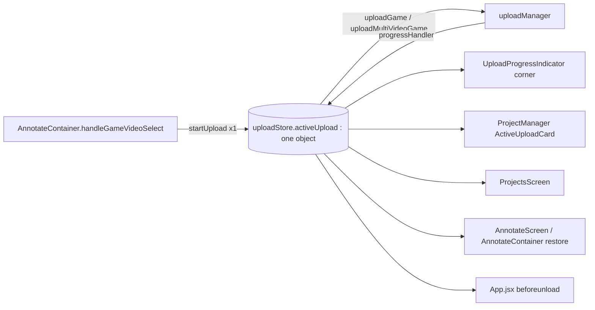
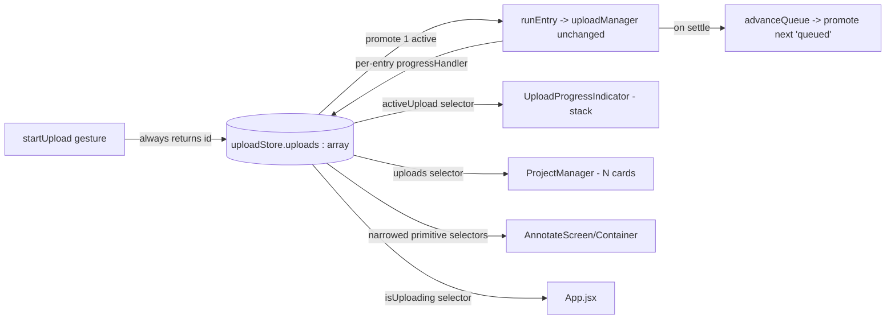
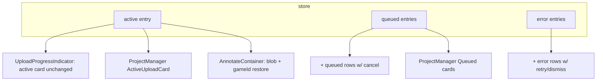

# T7360 — Design: Multiple game uploads (store + UI handle N at a time)

**Stage:** 2 (Architecture) — **requires user approval before implementation.**
**Tier:** L (store redesign + 5 consumer surfaces, no schema change, no backend change).
**Author:** Architect agent, 2026-08-26.
**Task brief:** [T7360-concurrent-game-uploads.md](./T7360-concurrent-game-uploads.md).
**Knowledge:** [annotate.md](../../../.claude/knowledge/annotate.md) (T7280 selector landmine, T7470/T7480/T7490 upload-failure shape, T1540 annotate-during-upload).

> Scope note: `uploadManager.js` (`uploadGame`/`uploadMultiVideoGame`, `UPLOAD_PHASE`, beacon, only-if-empty cleanup) is REUSED UNCHANGED. This task rewrites only the *client-side store shape* (`uploadStore.js`) and the surfaces that render it. No backend, no Modal, no DB.

---

## 1. Current State Analysis

### Architecture (today — singular)



### The exact defect (file:line)

| Location | Current behavior | Problem |
|----------|------------------|---------|
| `uploadStore.js:47-50` | `if (state.activeUpload) { console.warn(...); return null; }` | 2nd concurrent upload **silently dropped** — no toast, no queue. |
| `uploadStore.js:17` | `activeUpload: null` — a SINGLE object | Store structurally can hold only one upload. Every consumer is downstream of this. |
| `uploadStore.js:56` | `` const uploadId = `upload_${Date.now()}` `` | Two drops in the same ms collide once >1 upload exists. |
| `uploadStore.js:19-28` | `uploadGameId`, `uploadGameName`, `retryContext`, `onCompleteCallbacks` are **top-level globals** | Per-upload state stored globally → cannot coexist for N uploads. |
| `uploadStore.js:108-118` | `progressHandler` mutates `state.activeUpload` (new object each tick) | Feeds the T7280 re-render landmine: a whole-object selector re-renders on every tick. |
| `uploadStore.js:125-146` | `onUploadComplete` fires callbacks **before** clearing state | Documented race (T1540): `setAnnotateGameId` must run before `isUploading()` flips false. Must be preserved per-entry. |

### Code smells identified

| Smell | Location | Impact |
|-------|----------|--------|
| Silent rejection (swallowed error) | `uploadStore.js:47` | User-visible data loss (dropped upload), no feedback. |
| Global state that is really per-instance | `uploadStore.js:19-31` | Blocks concurrency; four parallel globals must move into the entry. |
| Time-based id (collision) | `uploadStore.js:56` | Latent bug that only manifests once concurrency exists — i.e. exactly now. |
| Duplicated clear-state literal | `:138, :228, :240, :270, :279` | Same `{ activeUpload:null, onCompleteCallbacks:[], uploadGameId:null, ... }` object repeated 5x — DRY target (becomes per-entry retire). |

### Current behavior (pseudo)

```pseudo
startUpload(file):
    if activeUpload exists: console.warn; return null      // ← silent drop
    activeUpload = {...}; globals(uploadGameId/retryContext/callbacks) = {...}
    uploadManager.uploadGame(...).then(onComplete).catch(onError)

onComplete: fire callbacks; clear activeUpload + all globals
onError:    set activeUpload.phase = ERROR (stays as the one card); toast
```

---

## 2. Target Architecture

### Concurrency model — DECISION: serial queue of ONE active upload

**Confirmed** (the task file's recommendation). Reasoning:

- **One upstream pipe.** `uploadManager.uploadParts` already runs adaptive parallelism (2→6 concurrent PARTS, `uploadManager.js:385-398`) to saturate the uplink for ONE file. Running two files at once halves each file's throughput, doubles each ETA, and makes the adaptive throughput sampler noisy (it can't tell "slow link" from "shared link").
- **No R2 multipart interleaving.** Two independent `prepare→parts→finalize` sessions competing for the same cell uplink is exactly the shape that produced the 2026-08-20 stall outage (T7480). A queue keeps one healthy transfer with a working stall watchdog.
- **Predictable UX.** "Drop 3 games, walk away" is satisfied identically by a queue: file 1 uploads with a real ETA, 2 and 3 show "Queued", auto-advance on completion.
- **Cost:** the queue MUST auto-advance on both completion AND failure, and a failed entry must not block the entries behind it (failure isolation, §3). This is the only non-trivial part and is specced below.

Parallel is explicitly rejected for this task (out-of-scope per brief unless overturned).

### Target diagram



### Design principles applied

- [ ] **DRY:** one `retireEntry(id)` / `patchEntry(id, fields)` internal helper replaces the 5 duplicated clear-state literals and the scattered `state.activeUpload ? {...} : null` guards.
- [ ] **Single code path:** every start (fresh, retry, queued-promotion) funnels through one internal `runEntry(entry)`; there is no second "retry re-implements start" path.
- [ ] **No new branches in consumers:** consumers render `uploads.map(...)`; the "single upload looks unchanged" requirement is met by the LIST rendering exactly one item, not by a `length === 1` special case.
- [ ] **Greppability:** `status` is a string-literal union near use (`'uploading'|'queued'|'error'|'done'`), no registry/dynamic dispatch.

---

## 3. Store Shape (target)

Replace singular `activeUpload` + 4 globals with a `uploads: []` array of self-contained entries. `insufficientCredits` stays top-level (it is a modal-level app concern, not per-entry — see §on credits below).

```js
// uploadStore.js — target shape (pseudo-JS)
create((set, get) => ({
  uploads: [],            // ordered; index 0-ish = arrival order. See selectors.
  insufficientCredits: null,   // unchanged: app-level modal trigger

  // ---- per-entry shape ----
  // {
  //   id: 'upl_<counter>',           // §7 monotonic, collision-free
  //   status: 'uploading'|'queued'|'error'|'done',
  //   file | files, fileName, fileSize,
  //   progress, phase, message, startedAt,
  //   gameDetails, videoMetadata, isMultiVideo, blobUrl, gameName,
  //   gameId: null, gameName2: null,  // ← was top-level uploadGameId/uploadGameName (per-entry now)
  //   onComplete: [fn...],            // ← was top-level onCompleteCallbacks (per-entry now)
  //   retryContext: {...} | null,     // ← was top-level retryContext (per-entry now)
  //   fileKey: `${name}:${size}`,     // §6 duplicate detection identity
  // }

  startUpload(fileOrFiles, gameDetails, videoMetadata, onComplete, displayInfo, onGameCreated) {
    // NO rejection. Duplicate check (§6) → toast + return existing id.
    // Build entry. If NO entry currently 'uploading' → status='uploading' + runEntry(entry).
    //             else → status='queued' (runEntry fires later via advanceQueue).
    // ALWAYS return entry.id.
  },
  addCompletionCallback(cb),   // attaches to the CURRENTLY-active entry (see §migration)
  clearFailedUpload(id),       // retire an 'error' entry
  retryUpload(id),             // re-run one errored entry via its own retryContext
  cancelUpload(id),            // retire one entry; if it was active → advanceQueue
  clearInsufficientCredits(),
  reset(),                     // clears the whole array (profile switch)
}))
```

### Selectors (the T7280 landmine is the reason these are explicit)

The T7280 finding: **a Zustand selector over a whole mutable upload object re-renders every subscriber on every progress tick**, because `progressHandler` produces a new object each tick. The array makes this worse (a new array ref per tick). Mitigations, per consumer effort-level:

| Selector | Returns | Re-render frequency | Used by |
|----------|---------|---------------------|---------|
| `useActiveUpload()` | the ONE entry with `status==='uploading'` (or null) | every tick of the active entry | UploadProgressIndicator, ProjectManager card (these MUST show live progress) |
| `useUploadCount()` | `state.uploads.length` (primitive) | only on add/retire | AnnotateScreen effect guards, badges |
| `useIsUploading()` | boolean: any entry `status==='uploading'` | only on status transitions | App.jsx `beforeunload`, AnnotateContainer `isUploadingFromStore` |
| `useActiveUploadGameId()` | active entry's `gameId` (primitive, may be null) | only when `gameId` is set (once, at `onGameCreated`) | AnnotateContainer T1540 restore |
| `useQueuedUploads()` | entries `status==='queued'` | on queue changes | ProjectManager pending section |
| `useFailedUploads()` | entries `status==='error'` | on failure/retry | ProjectManager, indicator |

**Rule for effect-heavy screens (AnnotateScreen/AnnotateContainer):** subscribe to PRIMITIVES (`useIsUploading`, `useActiveUploadGameId`, `useUploadCount`), never to the whole `uploads` array or a whole entry object. This is the explicit fix for the T7280 landmine — an AnnotateScreen effect that today depends on `activeUpload` (a whole object) will be re-pointed at a boolean/id primitive so a background progress tick can't re-run its effect.

### `onGameCreated` → `gameId` mapping, and "THE" active game id (T1540)

Today `options.onGameCreated` sets top-level `uploadGameId` (`uploadStore.js:184-187`), and AnnotateContainer reads `uploadStore.uploadGameId` (`AnnotateContainer.jsx:291-296`) to restore "the" annotate game on remount during upload. With N uploads there is no single "the" game id — but there is exactly ONE **active** upload (queue-of-one), and T1540's use case ("I'm annotating the game I'm currently uploading") is inherently about the active entry. Resolution:

- Per-entry: `onGameCreated` sets `entry.gameId`/`entry.gameName2` on THAT entry.
- `useActiveUploadGameId()` returns the **active** entry's `gameId`. This is the value AnnotateContainer reads. Since only one entry is ever `uploading`, this is unambiguous and preserves T1540 byte-for-byte for the common flow (user starts an upload, annotates it; queued uploads have no blob mounted and aren't the annotate target).
- **Legitimately-single consumer:** AnnotateContainer's restore effect (`:291`) and the blob-restore effect (`:329`) both mean "the upload I'm looking at". They bind to the ACTIVE entry. A queued upload is not annotatable (its blob is not the mounted video), so binding-to-active is correct, not a compromise. Called out here so the implementor does NOT try to thread a game-id list into AnnotateContainer.

### Credits stays top-level

`insufficientCredits` is not per-entry: it blocks BEFORE any queue entry runs (the credit check is in `ensureVideoInR2`/`activateGame`), it drives an app-level modal (`ProjectsScreen.jsx:474`), and the user must buy credits (not retry a specific entry). The errored entry that triggered it is simply retired (as today, `uploadStore.js:150-165`). Keep `insufficientCredits` top-level; do not duplicate it per entry.

---

## 4. Queue Mechanics

Single internal engine; the store never has two entries `uploading` at once.

```pseudo
runEntry(entry):
    entry.status = 'uploading'
    progressHandler = (p) => patchEntry(entry.id, {progress, phase, message})   // per-entry
    manager = entry.isMultiVideo ? uploadMultiVideoGame : uploadGame
    manager(...).then(r => onEntryComplete(entry.id, r))
                .catch(e => onEntryError(entry.id, e))

onEntryComplete(id, result):
    e = find(id); if !e (cancelled) return          // cancelled entries were retired
    e.onComplete.forEach(cb => cb(result))          // ← FIRE BEFORE retire (T1540 race preserved)
    toast.success(...)
    retireEntry(id)                                  // status→'done' then splice out
    refresh quest + credits
    advanceQueue()                                   // ← promote next 'queued'

onEntryError(id, error):
    if error.insufficientCredits: set top-level insufficientCredits; retireEntry(id); advanceQueue(); return
    patchEntry(id, {status:'error', phase:ERROR, message})   // STAYS in the list
    toast.error(...)
    advanceQueue()                                   // ← failure does NOT block the queue

advanceQueue():
    if any entry.status==='uploading': return        // one-at-a-time invariant
    next = first entry with status==='queued'         // FIFO by arrival order
    if next: runEntry(next)
```

**Ordering guarantee:** entries run in **arrival (FIFO) order**. An errored entry is skipped by `advanceQueue` (it is `'error'`, not `'queued'`) and remains visible with its own Retry; the next `'queued'` entry promotes immediately. Retrying an errored entry (§`retryUpload(id)`) flips it back to `'queued'` (or `'uploading'` if nothing is active) and re-runs it through the SAME `runEntry` — no separate retry code path.

**`done` retirement:** on completion the entry is spliced from the array (matches today's "clear on complete"). We do NOT keep a `'done'` history list — completed games appear on the Games tab (via `invalidateGames`, already fired in `uploadManager`), so a lingering done-card would duplicate that surface. `status:'done'` exists as a transient value for the retire step only.

**Completion-callback-before-clear race (T1540):** preserved exactly — `onEntryComplete` fires `e.onComplete` callbacks BEFORE `retireEntry`. Because callbacks and retire are now scoped to one entry id, `useIsUploading()` only flips false for that entry after its callbacks ran; a background queued entry keeping `isUploading` true is fine (and correct).

---

## 5. Consumer Surface Rendering

**The single-upload-looks-unchanged guarantee is met structurally:** each surface renders a *list*; with one active upload the list has one item that renders identically to today. No `length===1` branch.

### 5a. `UploadProgressIndicator.jsx` (corner indicator)

- Today: reads `activeUpload` (one), renders one progress/error card (`:9-61`).
- Target: reads `useActiveUpload()` + `useFailedUploads()` + `useQueuedUploads()`. Renders a **vertical stack**: active card (unchanged markup) on top, then compact rows for each `error` entry (message + per-entry Retry/Dismiss wired to `retryUpload(id)`/`clearFailedUpload(id)`) and each `queued` entry (name + "Queued" + per-entry cancel `cancelUpload(id)`).
- One upload running, none queued/failed → identical to today (single card).
- Test file `UploadProgressIndicator.test.jsx` extends to cover stack + per-entry buttons pass the id.

### 5b. `ProjectManager.jsx` — active card + Pending Uploads section

- Active card (`:1172-1184`, `ActiveUploadCard` at `:1668`): today one `activeUpload` prop. Target: ProjectsScreen passes the `uploads` array (or active+queued split); ProjectManager maps active→`ActiveUploadCard` (unchanged component, one per active — i.e. one) and renders queued entries as ActiveUploadCards in a "Queued" sub-group with a per-card cancel (the card already supports `onCancel`, `:1688`).
- Per-item spec: name (`fileName`), progress bar + `%` (active) or "Queued" label (queued) or error message + Retry/Discard (error), per-item cancel `X` (already present).
- The empty-state guard `:1164` (`!activeUpload`) becomes `uploads.length === 0`.
- The `filteredPending` block (`:1187-1199`) that de-dupes server pending-uploads against the single `activeUpload.fileName` now filters against **all** active/queued entry fileKeys — extend the existing filter to iterate `uploads`.

### 5c. `ProjectsScreen.jsx`

- Today: `activeUpload` selector (`:132`), passes it + `cancelUpload` (`:459-461`) to ProjectManager; `handleClickActiveUpload` navigates to annotate (`:397-400`).
- Target: select `uploads` (or `useActiveUpload`+`useQueuedUploads`), pass down. `cancelUpload` now takes an id — ProjectManager wires each card's cancel to `cancelUpload(entry.id)`. `handleClickActiveUpload` still navigates to annotate for the ACTIVE entry (the one with a mounted blob).

### 5d. `AnnotateScreen.jsx` / `AnnotateContainer.jsx`

- **AnnotateScreen** `:78,84,586-590`: reads `activeUpload?.blobUrl` to decide redirect/restore. Re-point to the ACTIVE entry (`useActiveUpload()`), and change the effect dep from the whole `activeUpload` object to a primitive (`activeUpload?.blobUrl` string, or `useActiveUploadBlobUrl()` selector) so a progress tick doesn't re-run the redirect effect (T7280).
- **AnnotateContainer** `:278-338`: `uploadStore.activeUpload`, `uploadStore.uploadGameId`, `uploadStore.uploadGameName`, `uploadStore.isUploading()` → replace with `useActiveUpload()`/`useActiveUploadGameId()`/`useIsUploading()`. Restore effects (`:290`, `:328`) bind to the active entry (T1540 — §3). `isUploadingFromStore` (`:282`) → `useIsUploading()`. Exposed `isUploadingGameVideo` (`:1368`) unchanged in meaning.
- **App.jsx** `:439`: `useUploadStore.getState().isUploading()` → same `isUploading()` action (now "any entry uploading"). No structural change; the `beforeunload` warning now covers a queue.

### Consumer rendering diagram



---

## 6. `startUpload` Rejection Removal — Call-site Migration Audit

The `:47` `return null` on `activeUpload` is removed. New contract: **`startUpload` ALWAYS returns a string id** (never null for "busy"). It still returns the SAME id for a duplicate (see §dup below), and returns null ONLY if given no file (defensive, unchanged expectation).

Every `startUpload(` call site (grep result), classified:

| Call site | Uses return? | Relies on "busy → null"? | Migration |
|-----------|--------------|--------------------------|-----------|
| `AnnotateContainer.jsx:435` (multi-video) | No — return value discarded | No | None. Now always starts/queues. This is the intended fix. |
| `AnnotateContainer.jsx:452` (single) | No — discarded | No | None. |
| `uploadStore.js:241` (`retryUpload` internal) | Returns the id upward | No | Refactor: `retryUpload(id)` re-runs THAT entry via `runEntry`, does not call the public `startUpload` (avoids the "clear then start" dance at `:240`). |
| `uploadStore.test.js:37` (`start()` helper) | Returns id for assertions | No | Test helper unaffected; extend tests for queue. |

**Finding:** NO production call site inspects the return value or depends on the single-upload guarantee for control flow. The only behavioral dependence on "one upload" is AnnotateContainer's restore effects reading "the" game id — resolved by §3 (active-entry binding), not by the rejection. Removing the rejection is therefore safe for all call sites; the risk is entirely in the store-internal globals→entry move.

---

## 7. Upload ID Scheme

Replace `` `upload_${Date.now()}` `` (`:56`). **DECISION: module-level monotonic counter** → `` `upl_${++_seq}` `` (with `_seq` a module var).

Justification:
- **Collision-free** by construction even for two drops in the same tick (the exact bug).
- **Greppable / stable** — `upl_1`, `upl_2` are readable in logs and tests; deterministic within a session (tests can assert ids without mocking `Date.now`).
- `crypto.randomUUID()` also works but is noisier in logs/tests and gives no ordering signal; the counter is preferred for greppability (CLAUDE.md "greppability beats elegance"). Arrival order is already tracked by array position, so the counter is purely for identity.

---

## 8. Duplicate-file-already-queued Rejection UX

Today: silent `console.warn` (the rejection at `:47` also swallowed the "same file twice" case). Target:

- **Detection identity:** `fileKey = `${file.name}:${file.size}`` for single; for multi-video, join sorted `name:size` pairs. NOT a hash (hashing is async and happens later in `uploadManager`; we need a synchronous check at gesture time, and name+size is the same cheap identity the existing pending-filter already uses at `ProjectManager.jsx:1192-1195`). Matching on name+size across the current `uploads` array (any `uploading`/`queued`/`error` entry) is sufficient to stop an accidental double-drop.
- **UX:** replace the warn with a **toast** (the app's existing `toast` channel, already imported in the store, used for success/error). Channel: `toast.info`. **Exact copy:**
  > **"Already queued"** — `"{fileName} is already uploading or in the queue."`
- **Return:** `startUpload` returns the EXISTING entry's id (so a caller that navigates on the returned id lands on the right upload), and does NOT create a second entry.

This is a genuine collision only for the exact same file; two different games never collide (different name/size). Re-uploading a file that FINISHED is allowed (the entry was retired, so no match) — dedup on the server handles the bytes.

---

## 9. Gesture-Persistence Compliance

- `uploads` is **transient client state** — no DB write, no R2 write, no localStorage. Unchanged from today.
- Each store mutation traces to a **named gesture:** start/queue = the file-drop/Add-Game gesture; cancel = the per-card X click; retry = the per-entry Retry click; clear = Dismiss click. No `useEffect`-driven writes are introduced.
- `progressHandler` writes are memory-only store patches (like today) — not persistence.
- Server-side pending-upload resumability (`listPendingUploads`, `pending_uploads` table, T7490 reap) is untouched and out of scope. The queue lives only for the tab session (cleared by `reset()` on profile switch, as today).
- **No reactive persistence introduced.** The banned shape (`useEffect` watching upload state → write) does not appear; the queue engine is driven by promise settlement inside the store, not by React effects.

---

## Implementation Plan (ordered, per-file)

Strangler-friendly: land the store rewrite with characterization tests FIRST, then migrate consumers one at a time (each keeps working because selectors preserve the old field meanings).

### Step 1 — Store rewrite + tests (Test-First)

**Tester writes these FAILING tests first** (`uploadStore.test.js`, extend):

1. `startUpload` twice (different files) → both entries exist; first `uploading`, second `queued`; both ids non-null and distinct.
2. Active completes → `advanceQueue` promotes the queued entry to `uploading` (FIFO).
3. Active FAILS → entry stays `status:'error'` AND the next queued entry promotes (failure isolation).
4. `retryUpload(id)` on an errored entry re-runs THAT entry (queues if another active) — via `runEntry`, one code path.
5. Per-entry completion callback fires BEFORE that entry is retired (T1540 race), and `useIsUploading()` reflects remaining queue.
6. Duplicate drop (same name+size) → `toast.info('Already queued'...)`, no 2nd entry, returns existing id.
7. Id uniqueness: two `startUpload` in the same tick (mock/force same `Date.now`) → distinct ids (counter).
8. `cancelUpload(id)` of the active entry → retired AND next promotes; cancel of a queued entry → removed, active untouched.
9. `insufficientCredits` path still sets top-level modal state and retires the entry (regression of existing test).
10. Selector `useActiveUploadGameId()` returns active entry's `gameId` after its `onGameCreated`.

**Files:** `uploadStore.js` (full rewrite of shape + engine + selectors), `uploadStore.test.js`.

### Step 2 — `UploadProgressIndicator.jsx` + test

Stack rendering; per-entry buttons pass id. Single-active renders unchanged (assert markup parity in test).

### Step 3 — `ProjectManager.jsx` (+ its ActiveUploadCard) + `ProjectsScreen.jsx`

Active card maps active entry; queued sub-group; `cancelUpload(id)`; empty-state guard → `uploads.length===0`; extend `filteredPending` to iterate `uploads`.

### Step 4 — `AnnotateScreen.jsx` + `AnnotateContainer.jsx` + `App.jsx`

Re-point to `useActiveUpload`/`useActiveUploadGameId`/`useIsUploading`; **change effect deps to primitives** (T7280). Verify T1540 restore + blob-restore against active entry. `App.jsx` `beforeunload` unchanged in behavior.

### Step 5 — Relevant test set + Reviewer + Branch CI

Relevant set: `uploadStore.test.js`, `UploadProgressIndicator.test.jsx`, `uploadManager.test.js` (unchanged — proves manager reuse), the AnnotateContainer restore path (`useAnnotateState.test.js` if it touches upload restore), + one e2e for concurrent drop if a spec exists. Reviewer on the diff. Branch CI (frontend job) green.

---

## Risks

| Risk | Mitigation |
|------|------------|
| **T7280 re-render landmine** — array/entry selector re-renders effect-heavy screens every progress tick, re-firing AnnotateScreen redirect/restore effects. | Primitive/narrowed selectors (`useIsUploading`, `useActiveUploadGameId`, `useActiveUploadBlobUrl`, `useUploadCount`); NEVER subscribe AnnotateScreen/Container to the whole array or a whole entry. Effect deps use primitives. Explicit test: mount AnnotateContainer, tick progress, assert the restore effect runs once. |
| **Completion-callback-before-clear race (T1540)** — `setAnnotateGameId` must run before `isUploading()` flips false, or TSV clip imports skip saving. | `onEntryComplete` fires `entry.onComplete` BEFORE `retireEntry`; scoped per entry. Test 5 pins it. |
| **T1540 annotate-during-upload depends on "the" game id** — N uploads have no single game id. | `useActiveUploadGameId()` binds to the ONE active entry; queued uploads aren't annotatable (no mounted blob). Documented in §3; implementor must NOT thread a game-id list into AnnotateContainer. |
| **Multi-video counts as ONE entry** — `isMultiVideo` (halves) is one game/one entry, not two queue slots. | Entry shape keeps `isMultiVideo`/`files`; the queue treats it as one unit; `runEntry` dispatches to `uploadMultiVideoGame`. Duplicate-key uses the joined pair key. Called out so it isn't split into two queue entries. |
| **Server pending-filter drift** — `filteredPending` de-dupes against the single `activeUpload`; missing an entry double-shows a card. | Extend the existing name-based filter to iterate all `uploads` entries (same identity the store's dup-check uses). |
| **Scope creep into `uploadManager.js`** (shared with the just-landed T7470/T7480/T7490 epic). | Manager is REUSED UNCHANGED. This task edits only `uploadStore.js` + consumers. No manager diff → no contention with the epic. |
| **`beforeunload` now guards a queue** — leaving cancels ALL in-flight/queued, not one. | Acceptable and correct (the whole queue is tab-session state). Copy already generic ("An upload is in progress"). No change needed. |

---

## Open Questions (approval gate)

1. **Queued-upload cancel semantics:** cancelling a QUEUED (not yet started) entry just removes it from the array — confirmed no server session exists yet (prepare-upload hasn't run), so no `uploadManager.cancelUpload(sessionId)` call is needed for queued entries. Cancelling the ACTIVE entry keeps today's behavior (XHR continues, callback discarded). **Confirm this asymmetry is acceptable.**
2. **Do you want a visible max-queue cap** (e.g. warn at N>5 dropped at once), or unbounded queue? Default in this design: unbounded.
3. **Duplicate copy/channel:** `toast.info('Already queued', '{file} is already uploading or in the queue.')`. Confirm wording/channel (info vs a subtler inline note).
4. **Retired-`done` history:** design retires completed entries immediately (games appear on Games tab). Confirm you do NOT want a lingering "Completed" list in the indicator.
