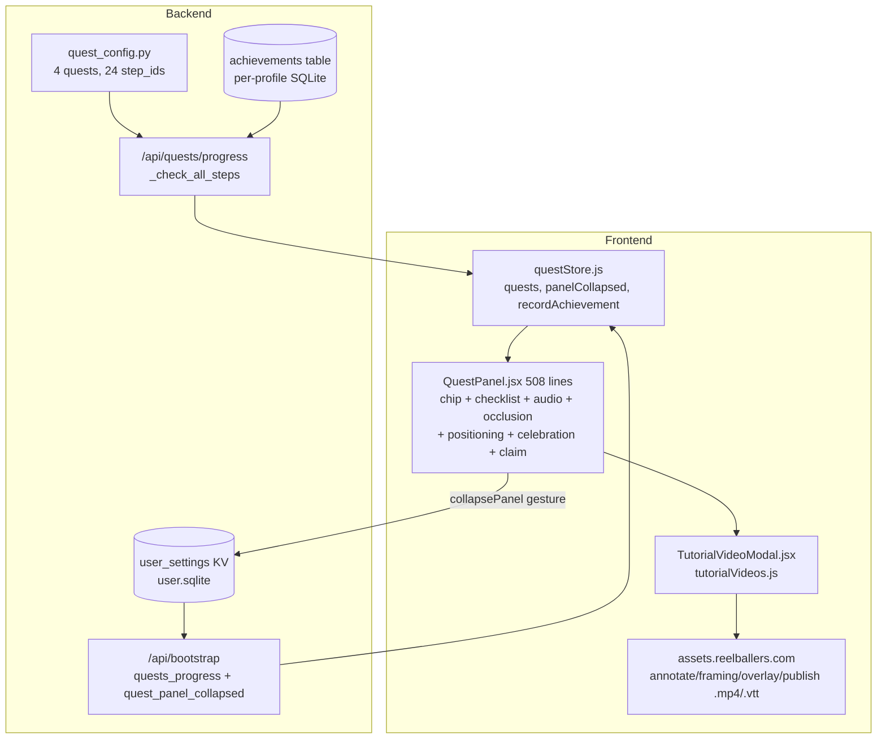
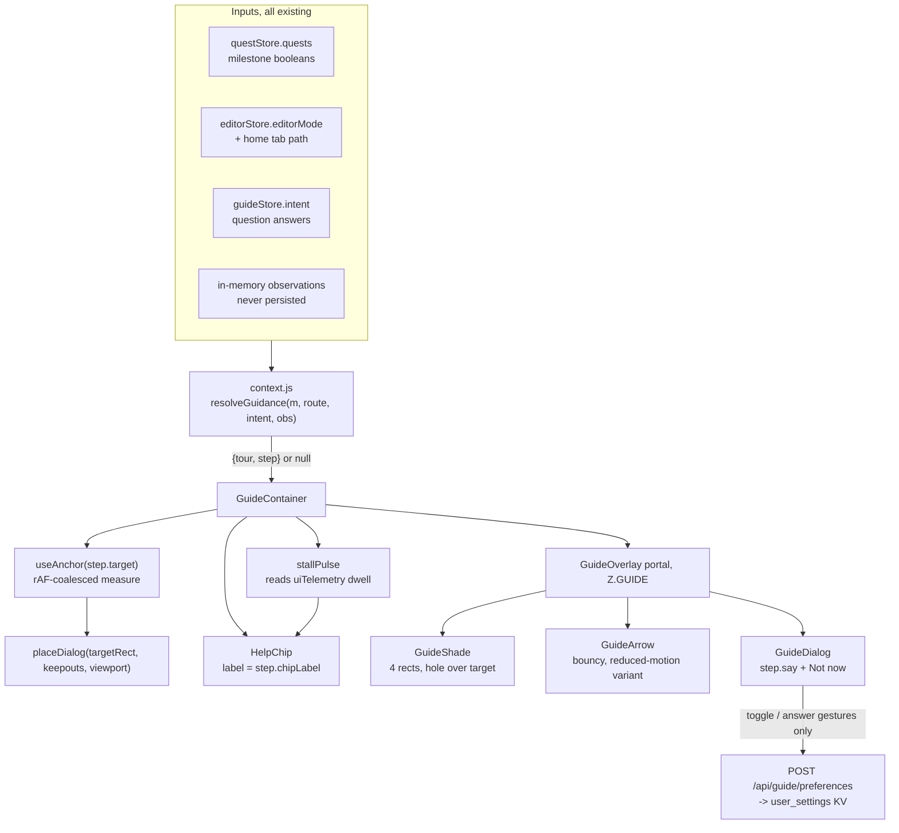
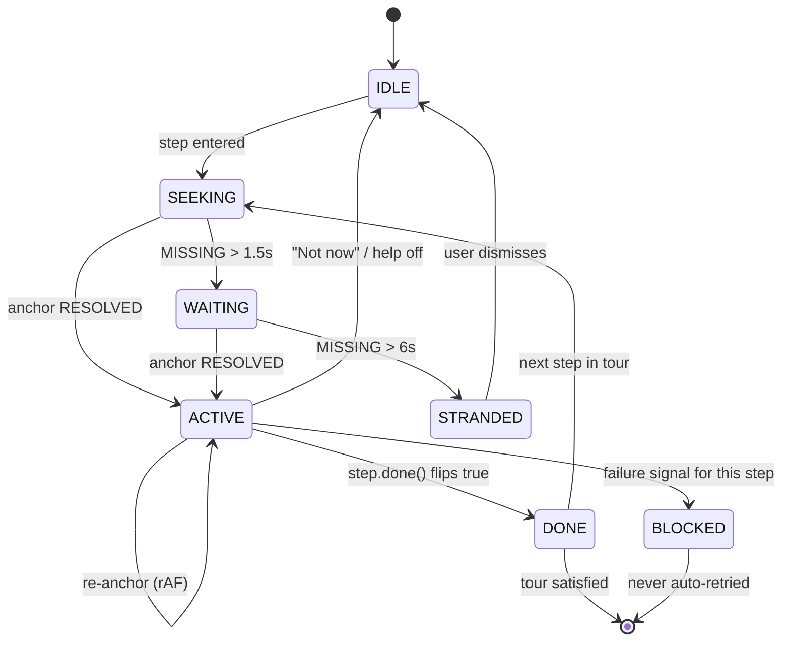
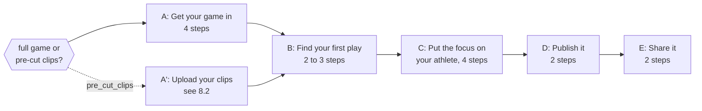
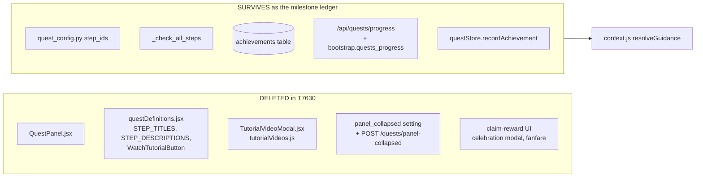

# T7620 Design: Guided Help engine + essential-path step definitions

**Task:** [T7620](tutorial-redesign/T7620-guided-tour-design.md)
**Epic:** [Tutorial Redesign](tutorial-redesign/EPIC.md)
**Status:** AWAITING USER APPROVAL (design gate; T7630 is blocked on this)
**Author:** Architect agent, 2026-09-02

> **Scope note.** This document covers the T7620 Scope items 1 to 5 plus every bullet of the
> binding 2026-08-31 directive addendum. It is written against the **post-T8120/T8130/T8140
> reality** (First-Clip Funnel epic, all three merged to master 2026-09-02), not against the
> pre-collapse quest panel described in the original task file.

---

## 0. What changed under this task since it was filed

| Landing | Effect on this design |
|---|---|
| **T8120** (merged) | Quest panel already collapsed to a **Help chip**; collapsed state persists in `user_settings.quest_panel_collapsed`; a generic modal-occlusion auto-hide exists (`useModalOcclusion`, rAF-coalesced); per-quest credit drip retired, `QUEST_CHAIN_CREDIT_TOTAL = 80` granted upfront. The guided system replaces what the chip OPENS; it does not have to invent the chip. |
| **T8130** (merged) | Approved vocabulary is live: **Add Play**, **Highlight Reels**, **Build Highlight Reel**. The Annotate primary CTA is a full-width button, `data-testid="annotate-primary-cta"` (`AnnotateModeView.jsx:835`). All step copy in this design uses those exact words. |
| **T8140** (merged) | First clip is genuinely **one tap**: every field defaulted, sticky Save, sport asked once as a full-screen question. So the clip tour must be 2 steps, not 6, and must **not** re-teach rating/naming (that would undo T8140). |
| **T8360** (WIP) | Splitting the Reel Drafts surface into single-clip vs multi-clip ("Highlights") views. Every step anchored to that surface is flagged **T8360-RECONCILE** below and binds to a **tile-level attribute**, never to a tab label or tab route. |

---

## 1. Current state analysis

### 1.1 Architecture today



Milestone state already exists and is already correct. `_check_all_steps` (`quests.py:130`)
derives every step boolean from four batched reads (games, raw_clips aggregate, export_jobs
aggregate, achievements) and ships it on `/api/bootstrap`. **That is the context engine's
input. No new state is required to know where a user is.**

### 1.2 Code smells in the surface being replaced

| Smell | Location | Impact |
|---|---|---|
| God component | `QuestPanel.jsx` (508 lines) does fetch subscription, WebAudio synthesis, modal-occlusion detection, per-mode positioning, celebration modal, reward claim, and step rendering | Any guidance change touches seven concerns; the T8120 review found three real bugs in it in one pass |
| Poll instead of observe | `QuestPanel.jsx:146-160` `setInterval(measure, 500)` probing for `[data-add-clip-form]` | A 2 Hz DOM poll to learn a form is open; the new engine needs anchoring anyway, so this becomes one rAF-coalesced observer |
| Two positioning systems | `getPositionForMode()` hardcoded per-mode offsets **and** `useModalOcclusion()` hide-entirely | Two ways to answer "where may this surface sit"; neither can anchor to an element |
| Guidance content in three files | `quest_config.py`, `data/questDefinitions.js`, `config/questDefinitions.jsx` (titles, descriptions, tutorial CTA) | Copy drift already guarded by a test; adding a fourth home would be worse |
| Instruction that cannot transfer | `TUTORIAL_STEP_QUEST` + `WatchTutorialButton` + four videos | The funnel evidence: 15 users watched the annotate video, 3 ever clipped |
| Dead-endable checklist | `activeQuestId` advances only on `claimReward`; `watch_*_tutorial` steps complete only by watching | Once the videos retire, four steps can never complete and the ledger wedges |

### 1.3 Current behavior (pseudo code)

```pseudo
user lands on any screen:
    QuestPanel renders bottom-left (or hides if a modal is open, or repositions per mode)
    shows the first incomplete step of the first unclaimed quest, as TEXT
    if that step is a watch_* step: offer "Watch tutorial" -> full-screen video
    if that step is upload_game AND ProjectManager registered an opener: render a button
    else: a chevron-less div  // <-- no affordance, the user is told, not shown
user then faces the real UI alone
```

The whole defect is the last line. Nothing on screen points at the control.

---

## 2. Target architecture

### 2.1 Design principles applied

- [x] **One guidance system.** The quest PANEL dies; the quest STEP LEDGER survives as
      milestone state. There is never a second arrow or a second prompt.
- [x] **Position is derived, never stored.** The user's place in the path is a pure function
      of milestone state plus route. No step bookmark to go stale (see 6.2).
- [x] **One completion mechanism.** A step completes on a milestone flip, which is produced by
      the gesture handlers that already exist. The engine writes nothing to advance.
- [x] **One placement algorithm.** Anchor rect in, dialog rect out; no per-screen offsets.
- [x] **One escape hatch shape.** Every step dialog carries the same two controls: the primary
      action pointer and "Not now". Off lives in the Help panel.
- [x] **Greppable targets.** `data-tutorial-target="literal-string"` written literally at the
      JSX call site AND literally in the step catalog, with a static test proving the two sets
      match. No computed attribute values, no registry object, no dynamic dispatch.
- [x] **MVC.** `GuideRoot` (screen-level, guards on data ready) to `GuideContainer` (resolution
      plus handlers) to `GuideShade` / `GuideArrow` / `GuideDialog` (pure views, no hooks, no
      null checks).

### 2.2 Target diagram



### 2.3 Module layout

```
src/frontend/src/guide/
  guideStore.js        # zustand: enabled, intent, activeTourId, dismissedThisSession,
                       # blocked, observations. Two write actions, both gesture-called.
  context.js           # PURE. TOURS catalog order + resolveGuidance(). No React.
  steps.js             # PURE data. The step catalog: literal target names + copy.
  anchor.js            # measure()/observers. No React.
  placement.js         # PURE. placeDialog(target, keepouts, viewport) -> {x,y,variant}
  useAnchor.js         # thin React wrapper over anchor.js
  GuideRoot.jsx        # screen layer: guards on bootstrap-ready, mounts container
  GuideContainer.jsx   # logic layer: resolution, handlers, subscriptions
  GuideOverlay.jsx     # view: portal + shade + arrow + dialog
  HelpPanel.jsx        # view: what the Help chip opens (menu, toggle, report a problem)
  stallPulse.js        # dwell-without-key-action detector
```

`context.js` and `placement.js` are pure and unit-testable with no DOM. Screens import
nothing from `guide/`; the only inbound coupling is (a) the `data-tutorial-target` and
`data-tutorial-keepout` attributes and (b) three named `guideStore.blockStep()` calls in
existing failure handlers (see 9.3).

---

## 3. The context engine (next best action)

### 3.1 Inputs, all already on the client

| Input | Source | Notes |
|---|---|---|
| Milestone booleans | `useQuestStore.quests[].steps` from `/api/bootstrap` | 24 derived booleans; refreshed by the existing `recordAchievement` response body (T6270) |
| Route | `useEditorStore.editorMode` plus `window.location.pathname` for `/home/games` vs `/home/reels` | Already the app's routing truth |
| Intent | `guideStore.intent` hydrated from `user_settings.guide_intent` | Only the answers to question steps |
| Observations | in-memory `Set` in `guideStore` | Micro-gestures with no milestone (see 4.3); never persisted |
| Blocked | in-memory `guideStore.blocked` | Set by a real failure; cleared on retry gesture |

### 3.2 Resolution algorithm

```pseudo
// context.js -- pure, no DOM, no React
TOURS = [ TOUR_UPLOAD, TOUR_FIRST_PLAY, TOUR_FOCUS, TOUR_PUBLISH, TOUR_SHARE,
          ...SECONDARY_TOURS ]        // declaration order IS funnel order

function resolveGuidance(m, route, intent, obs, dismissed) {
    for (tour of TOURS) {
        if (dismissed.has(tour.id))     continue     // "Not now", session-scoped
        if (tour.satisfied(m))          continue     // already done, forever
        if (!tour.availableFor(intent)) continue     // branch gate
        if (!tour.ready(m))             continue     // prerequisite not met yet
        step = tour.steps.find(s => !s.done(m, obs))
        if (!step) continue                          // defensive: satisfied() disagreed
        return { tour, step, onScreen: tour.screens.includes(route) }
    }
    return null                                      // nothing to guide; chip says "Help"
}
```

Single pass, single return shape, no branching sprawl. Adding a tour is one array entry.

### 3.3 On-screen vs off-screen: navigation is just another step

If `onScreen === false` the engine does **not** teleport the user and does **not** guess.
Every tour declares `entryStep`: a normal one-control step whose target is the navigation
control that reaches the tour's screen (the Games tab, the game tile, the Highlight Reels
tab). So "get the user to the right surface" reuses the identical step machinery. There is no
second code path for cross-screen guidance.

### 3.4 Push budget (what may start itself)

| Situation | Behavior |
|---|---|
| `enabled` and the user has **no** `clip_created` milestone and the resolved tour is on this screen and it has not been shown this session and no modal is open and no input is focused | The tour **auto-starts once**. This is the default-on first-run promise. |
| Any other case | Pull only. The chip carries the contextual label; tapping it starts the resolved tour. |
| Dwell with no key action (see section 10) | The chip **pulses and relabels**. Never auto-opens. |

At most **one** auto-start per screen per session, and auto-start stops permanently once the
user has created their first clip. (Flagged as **Open decision D2**, since it is the one place
this design pushes rather than pulls.)

---

## 4. Anchoring and step-advance engine

### 4.1 Target registry (greppable, not computed)

```jsx
// AnnotateModeView.jsx -- the literal is written HERE, at the call site
<button data-testid="annotate-primary-cta" data-tutorial-target="annotate-add-play" ...>
```

```js
// guide/steps.js -- the same literal is written HERE, once
{ id: 'play.add', target: 'annotate-add-play', ... }
```

Rules:
1. The attribute value is **always a literal string** in JSX. Never interpolated. `grep -r
   'annotate-add-play' src/` returns exactly two hits: the element and the step.
2. A target name appears on **exactly one** element in the DOM at a time. Enforced by
   `guide/targets.contract.test.js`, which (a) scans `src/frontend/src` for
   `data-tutorial-target="X"` occurrences, (b) scans the step catalog for `target: 'X'`, and
   (c) asserts the two sets are equal with no duplicates. A step pointing at a deleted element
   fails CI instead of failing a user.
3. `data-tutorial-keepout` marks app chrome the dialog may never cover (sticky Save footer,
   transport bar, mobile action bar). Same literal-string rule.

### 4.2 Anchoring and re-anchoring

```pseudo
// anchor.js
measure(name):
    el = document.querySelector('[data-tutorial-target="' + name + '"]')
    if (!el)                          return { state: 'MISSING' }
    if (el.getClientRects().length===0) return { state: 'MISSING' }   // display:none/detached
    r  = el.getBoundingClientRect()
    vv = window.visualViewport || { height: innerHeight, width: innerWidth,
                                    offsetTop: 0, offsetLeft: 0 }
    if (r.bottom < 0 || r.top > vv.height) return { state: 'OFFSCREEN', rect: r }
    return { state: 'RESOLVED', rect: r, keepouts: measureKeepouts() }

// ONE scheduler, every trigger funnels into it
schedule():  if (rafId) return; rafId = rAF(() => { rafId = null; measure() })

triggers (all passive, all -> schedule()):
    ResizeObserver(el) and ResizeObserver(documentElement)
    MutationObserver(body, {childList, subtree, attributes:['class','style']})
    window: resize, orientationchange
    window: scroll (capture: true, passive: true)   // catches nested scroll containers
    visualViewport: resize, scroll                   // iOS keyboard + pinch
    editorStore.subscribe(editorMode)                // route/mode change
```

The MutationObserver plus rAF coalescing is deliberately the **same** pattern T8120 landed in
`useModalOcclusion` after its review found a per-frame forced-layout regression. One
layout-forcing measure per animation frame, and only while a step is active (the observers are
installed on step enter and torn down on step exit, so idle users pay nothing).

**Scroll-into-view happens exactly once, on step ENTER**, when the state is `OFFSCREEN`:
`el.scrollIntoView({ block: 'center', behavior: reducedMotion ? 'auto' : 'smooth' })`. It is
never re-fired by a later measure, so the engine can never fight the user's own scrolling.

**Virtualized/lazy lists** (game grid, draft carousels, reel carousels): a target that is not
mounted yet reads `MISSING`, which is a legitimate transient. See the state machine below.

### 4.3 Step advance detection

Two predicate kinds, one evaluation path.

```pseudo
step.done(m, obs) =
      step.milestone  ? m[step.milestone] === true
    : step.observe    ? obs.has(step.id)
    : false

// observe: a passive capture-phase document listener, installed only while
// that step is active, torn down on exit. It NEVER writes anything.
onDocument(step.observe.type, e => {
    if (!e.target.closest('[data-tutorial-target="' + step.observe.target + '"]')) return
    if (step.observe.key && e.key !== step.observe.key) return
    guideStore.observe(step.id)            // in-memory Set, memory only
}, { capture: true, passive: true })
```

`milestone` covers every meaningful step (they map 1:1 onto quest step ids that already exist).
`observe` exists for exactly two micro-gestures in the essential path: the T7540 tag-input
Enter, and the Focus crop drag before its milestone lands. Nothing about `observe` touches the
network or a store that persists.

### 4.4 Step state machine



- **WAITING** keeps the dialog but drops the shade to 25 percent and says one honest sentence:
  "One moment, I am looking for that button."
- **STRANDED** is a bug in our own data, so it fails loudly: `console.error('[Guide] target
  never resolved', name)` plus a dialog with "Skip this step" and "Report a problem". It never
  loops and never silently self-heals (CLAUDE.md: no defensive fixes for internal bugs).
- **BLOCKED** is section 9.3.

### 4.5 Motion spec (bouncy arrow)

| Property | Value |
|---|---|
| Shape | Lucide `ArrowDown` at 28px in a 44px circular chip, brand cyan `#06b6d4` on `bg-gray-900/90`, `border-cyan-300` |
| Placement | On the target edge nearest the dialog, offset 8px, rotated to point at the target centre (4 discrete rotations only: down, up, left, right) |
| Bounce | `translateY` 0 to -8px to 0, `cubic-bezier(.34,1.56,.64,1)`, 900ms period, infinite, 3-bounce burst then 1.2s rest |
| Enter | 180ms fade plus scale 0.85 to 1 |
| Shade fade | 240ms opacity, `transition-opacity` |
| `prefers-reduced-motion` | No translate, no scale. The chip pulses `opacity 1 to 0.55` at 2s, or if the user has also set reduce-transparency semantics, a static ring with no animation. Shade appears instantly. Arrow still rotates to point. |

Motion is core product value (memory: animation polish direction), so the bounce is specified,
not left to the implementer; the reduced-motion variant is a first-class equal, not a disable.

---

## 5. Step interaction contract and dialog placement

### 5.1 The contract

Each step is **exactly one** of three kinds. There is no fourth, and no step ever mixes them.

| Kind | Interactive surface | Advance |
|---|---|---|
| `ACTION` | One control, reachable through the shade hole | `milestone` or `observe` |
| `INPUT` | One input, reachable through the shade hole | `observe` on commit, or `milestone` |
| `QUESTION` | No app control. The dialog itself carries 2 to 3 big answer buttons | The answer gesture |
| `PROGRESS` (degenerate) | Nothing. Informational while an async job runs | `milestone` or its failure twin |

`PROGRESS` is not a fourth interactive kind: it has zero interactive app surface, so the
one-control invariant is trivially satisfied.

Everything else on the screen is non-interactive while a step is active, because the shade
rects swallow those clicks (5.2).

### 5.2 Shade mechanics (and why not a mask)

The shade is **four positioned rectangles** around the target hole, not one full-screen box
with a CSS mask:

```
+------------------------------------+
|              TOP rect              |   pointer-events: auto  (swallows clicks)
+--------+----------------+----------+
|  LEFT  |   HOLE (none)  |  RIGHT   |   HOLE renders nothing: clicks fall through
+--------+----------------+----------+   to the real element underneath
|             BOTTOM rect            |
+------------------------------------+
```

Why this and not a mask or a re-parented target:

- **No stacking-context surgery.** The target element is never cloned, never portaled, never
  given a z-index. A z-index cannot escape an ancestor's stacking context (the exact trap
  documented in `zLayers.js` and in the annotate knowledge doc's clip-marker tooltip note), so
  raising app elements to punch through a shade is structurally unreliable. Rendering nothing
  over the hole sidesteps the whole class.
- **Hit-testing is exact.** The hole is the measured rect inflated by 6px, so the real
  control keeps its real 44px touch target.
- **No backdrop-close.** Clicking a shade rect does **not** dismiss anything (house rule: no
  backdrop close). It plays one 300ms attention wobble on the arrow. That is the entire
  response. Dismissal is only ever the explicit "Not now".

**Z rung.** Add one rung to `constants/zLayers.js`:

```
GUIDE  z-[300]   the guided-help overlay: shade, arrow, explainer. Above SHARE (z-[200])
                 because a guided step may point at a control inside ANY app surface,
                 including a share dialog; below SYSTEM (z-[9999]) so the impersonation
                 banner and the blocking PWA update gate always win.
```

The Help **chip** stays at `Z.DROPDOWN` and keeps T8120's occlusion contract (hidden whenever
a modal is open). The **overlay** is exempt from that contract by design, and while the overlay
is active the chip does not render at all, so the two can never both be on screen.

### 5.3 Placement algorithm, provably safe at 320px+

```pseudo
// placement.js -- pure
M = 12                                  // viewport margin
G = 10                                  // gap between dialog and target
W = min(vv.width - 2*M, 360)            // dialog width: FIXED, not content-driven
safeTop    = env(safe-area-inset-top)
safeBottom = env(safe-area-inset-bottom)

placeDialog(T, keepouts, vv, H):        // H = measured dialog height
  x = clamp(T.centerX - W/2, M, vv.width - W - M)

  roomBelow = vv.height - safeBottom - T.bottom - G
  roomAbove = T.top - safeTop - G

  1. if (roomBelow >= H && !hitsKeepout(x, T.bottom+G, W, H))  return {x, y: T.bottom+G}
  2. if (roomAbove >= H && !hitsKeepout(x, T.top-G-H,  W, H))  return {x, y: T.top-G-H}
  3. // neither band fits: move the TARGET, not the dialog
     scrollTargetIntoBand(T, preferred = T.centerY > vv.height/2 ? 'upper' : 'lower')
     re-measure; retry 1 and 2 once
  4. // still impossible: the target is taller than the usable viewport
     console.error('[Guide] step ineligible: target exceeds viewport', step.id)
     -> degrade to a NON-SHADED coach mark docked to the safe bottom edge, no hole
```

**Non-overlap proof.** `W` is fixed and `x` is clamped, so the dialog spans the full usable
width at any viewport below 384px. Horizontal separation is therefore impossible at 320px,
which means overlap is decided **entirely by the vertical band**. Branches 1 and 2 select a
band that is disjoint from `[T.top - G, T.bottom + G]` by construction, and `hitsKeepout`
rejects any band intersecting a declared keepout rect. Therefore the returned rect never
overlaps the target or declared essential UI. The only failure mode is "no band is tall
enough", which branch 3 removes by scrolling and branch 4 reports as a design error instead of
silently overlapping.

**The invariant that must hold** for a step to be eligible:

```
H + G <= max(T.top - safeTop, vv.height - safeBottom - T.bottom)
```

Worst realistic cases:

| Case | `vv.height` | Target height | Available | Required `H` | Verdict |
|---|---|---|---|---|---|
| iPhone SE portrait, no keyboard | 568 | 56 | 496 | 160 (full card) | fits, 3x margin |
| 320x498 (bug 46 report) | 498 | 56 | 426 | 160 | fits |
| iOS keyboard open, `INPUT` step | ~250 | 48 | 178 | 96 (compact card) | fits |
| Landscape phone, 320 tall | 320 | 48 | 256 | 96 (compact) | fits |

So the rule is mechanical: **`INPUT` steps and any step that can coexist with an open keyboard
must use the compact card variant** (one sentence, no illustration, a single text "Not now"
link, `H <= 96`). `ACTION` and `QUESTION` steps use the full card (`H <= 160`). This is a
lint-able property of the step catalog: `steps.js` declares `card: 'full' | 'compact'` and a
unit test asserts every `INPUT` step is `compact`.

---

## 6. State model

### 6.1 What persists (two keys, both gesture-written)

Both live in the **existing** `user_settings` KV in `user.sqlite` (`_USER_DB_SCHEMA`), beside
`quest_panel_collapsed` and `notification_email_optout`. **No new table, no migration, no new
Postgres state.**

| Key | Values | Written by (gesture) | Read by |
|---|---|---|---|
| `guide_enabled` | `"1"` / `"0"`; absent means default (see D1) | The on/off toggle click in the Help panel | `/api/bootstrap` |
| `guide_intent` | `"full_game"` / `"pre_cut_clips"`; absent means unasked | The answer tap on the intent question step | `/api/bootstrap` |

Backend, mirroring the proven `panel-collapsed` shape exactly:

```python
# services/user_db.py -- next to get/set_quest_panel_collapsed
_GUIDE_ENABLED_KEY = "guide_enabled"
_GUIDE_INTENT_KEY  = "guide_intent"
def get_guide_prefs(user_id) -> dict          # {"enabled": bool, "intent": str|None}
def set_guide_pref(user_id, key, value)       # INSERT OR REPLACE, one row

# routers/guide.py
@router.post("/api/guide/preferences")        # body: {enabled?: bool, intent?: str}
```

`/api/bootstrap` gains `guide` alongside `quest_panel_collapsed`, so first paint is correct
with no flash and no follow-up fetch.

Frontend write path, one function, optimistic like `collapsePanel`:

```js
// guideStore.js
setEnabled(next) {                 // called ONLY from the toggle's onClick
  set({ enabled: next })
  apiFetch('/api/guide/preferences', { method:'POST', body: {enabled: next}, keepalive:true })
    .catch(() => console.error('[Guide] failed to persist help preference'))
}
answerIntent(value) {              // called ONLY from a question button's onClick
  set({ intent: value })
  apiFetch('/api/guide/preferences', { method:'POST', body: {intent: value}, keepalive:true })
    .catch(() => console.error('[Guide] failed to persist help intent'))
}
```

**Do NOT mark these `rbNonDataWrite: true`.** T8120's post-hoc review found exactly that bug on
the panel-collapse write: it is a genuine `user.sqlite` write, and the marker would suppress a
legitimate sync-conflict alarm. These two writes are the same class.

### 6.2 What does NOT persist, and why there is no step bookmark

| Not persisted | Why |
|---|---|
| Current step / current tour | **Derivable** from milestone state plus route (memory rule: never store derivable state). A stored bookmark can disagree with reality after a delete, a cross-device session, or a share materialization; the derived answer cannot. Resume works better: leave mid-path on your phone, return on a laptop, land on the same step. |
| "Not now" dismissals | Session-scoped in memory. A dismissal that survives reload becomes nagging-by-inversion; the durable escape is the off toggle. |
| Observations | Memory-only micro-gesture set. |
| Which tours auto-started | Session-scoped (`sessionStorage` is not even needed; module state is enough). |
| Blocked state | Memory-only; a failure is re-derived from the next real attempt. |

This satisfies T7620 Scope item 3 ("current-step bookmark") by **derivation rather than
storage**. Flagged as **Open decision D3** since the task file asked for a stored bookmark.

Persistence self-check, per CLAUDE.md:

```
gesture -> handler -> surgical POST with ONLY the changed field     YES (2 keys, 2 gestures)
useEffect watching state -> write                                    NONE. Zero.
runtime fixups persisted                                             NONE.
restore is read-only                                                 YES (bootstrap read only)
```

---

## 7. Essential-path step definitions

Vocabulary is T8130's approved set: **Add Play**, **Clips**, **Highlight Reels**, **Build
Highlight Reel**, **Move to Highlight Reels**. Copy says "reel" per T7580.

Every `copy` cell below is the literal `step.say` string: one spoken-style sentence, 14 words
or fewer, no markup, no emoji, no em dashes. It is rendered verbatim as the dialog body, so
there is exactly one copy string per step (V2 TTS is `speechSynthesis.speak(step.say)`).

### Tour A: "Get your game in" (screens: `/home/games`)

`ready(m)`: always. `satisfied(m)`: `m.upload_game`.

| # | Kind | Target literal | Element (file) | Completion | Copy (`say`) | Mobile anchoring |
|---|---|---|---|---|---|---|
| A0 | QUESTION | none | dialog only | `intent` answered | "Do you have a full game video, or clips you already cut?" | Full card, centred; two 44px+ answer buttons stacked at 320px |
| A1 | ACTION | `home-add-game` | "Add Game" (`ProjectManager.jsx:1202`) | milestone `add_game_opened` | "Tap Add Game to bring in your game video." | Button is in the tab action row; dialog goes BELOW it (room above is header chrome) |
| A2 | ACTION | `add-game-dropzone` | dropzone in `GameDetailsModal.jsx` | milestone `upload_file_selected` | "Tap here to pick the video from your phone." | Modal is `max-h-[90vh] overflow-y-auto` (T7590): scroll-into-view on enter. Opponent input `autoFocus` opens the keyboard, so **compact card**, `visualViewport` geometry |
| A3 | ACTION | `add-game-submit` | "Add Game" submit (`GameDetailsModal.jsx:549`) | milestone `game_created` | "Now tap Add Game to start the upload." | Submit can sit below the fold: scroll-into-view; dialog docks above the button |
| A4 | PROGRESS | `upload-progress` | uploading rail (`ProjectManager.jsx:1301`) | `game_upload_succeeded`; fails on `game_upload_failed` | "Your game is uploading. You can start finding plays while it finishes." | Rail is at the top of Home; dialog below |

> A0 is a question, so the tour is 4 interactive steps plus one question: inside the 3 to 5
> budget the evidence constraint sets.

### Tour B: "Find your first play" (screens: `/home/games`, `annotate`)

`ready(m)`: `m.upload_game`. `satisfied(m)`: `m.add_clip`.

| # | Kind | Target literal | Element | Completion | Copy (`say`) | Mobile anchoring |
|---|---|---|---|---|---|---|
| B0 | ACTION | `home-game-tile` | first `GameTile` in the Games grid | `editorMode === 'annotate'` | "Open your game by tapping its card." | Tiles are in a grouped grid; the target is the FIRST tile, scroll-into-view on enter |
| B1 | ACTION | `annotate-add-play` | full-width Add Play CTA (`AnnotateModeView.jsx:835`) | milestone `add_clip_opened` | "When something great happens, tap Add Play. We grab the last few seconds." | CTA sits directly under the video; dialog docks BELOW it, above the timeline. Timeline carries `data-tutorial-keepout` |
| B2 | ACTION | `clip-form-save` | sticky Save in the clip form (T8140) | milestone `add_clip` / `clip_created`; fails on `clip_save_failed` | "Everything is filled in already. Tap Save." | Form is a full-screen takeover on mobile; Save is a sticky footer, so it is always in the lower band. **Compact card**, docked above the sticky footer via its keepout |
| B3 | INPUT (conditional) | `teammate-tag-input` | `TeammateTagInput` (Team layer only) | `observe` keydown Enter on the target | "Press Enter to add that name as a tag." | Only enters when `hasUncommittedTeammateText()` is true. Keyboard is open by definition, so **compact card** and `visualViewport` geometry |

> B3 is the T7540 behavior the task called out. It is conditional, so the 99 percent case stays
> a two-step tour, and it directly prevents the tag-not-submitted confusion without adding a
> step for everyone. Teammates are Team-layer only (T5725), so B3 can only arise on a Team clip.
> Rating and naming are deliberately **not** steps: T8140 made them defaults, and re-teaching
> them would undo the one-tap win.

### Tour C: "Put the focus on your athlete" (screens: `/home/reels`, `focus`)

`ready(m)`: `m.add_clip` and at least one draft exists. `satisfied(m)`: `m.export_framing`.

| # | Kind | Target literal | Element | Completion | Copy (`say`) | Mobile anchoring |
|---|---|---|---|---|---|---|
| C0 | ACTION | `draft-tile-open` | the draft tile's clip segment (`DraftTile.jsx` `SegmentedProgressStrip`) | milestone `open_framing` / `framing_opened` | "Tap your clip to start framing it." | **T8360-RECONCILE.** Bind to the TILE attribute, never to a tab label or `/home/reels`. If T8360 moves single-clip drafts to a new surface, only `tour.screens` changes |
| C1 | ACTION | `focus-crop-box` | crop box (`modes/focus` crop layer) | milestone `position_crop` | "Drag the white box so your athlete stays inside it." | The box is over the video; dialog docks to whichever band the video does not fill, using the video element's keepout |
| C2 | ACTION | `focus-export` | Export button (`ExportButtonView`) | milestone `export_framing` / `export_started`; fails on `export_failed` | "Tap Export. It shows the length and what it costs." | Bottom-right on desktop, in the action row on mobile; dialog docks above |
| C3 | PROGRESS | `export-progress` | export progress surface | milestone `wait_for_export` | "We are upscaling it now. You can frame another one while you wait." | Dialog docks to the safe bottom edge |

> Slow motion, dim-background review, and Straighten are **not** essential-path steps. They live
> in secondary tour S2 (section 8.3), reachable from Help on the Focus screen.

### Tour D: "Publish it" (screens: `/home/reels`)

`ready(m)`: a draft has a working video. `satisfied(m)`: `m.move_to_my_reels`.

| # | Kind | Target literal | Element | Completion | Copy (`say`) | Mobile anchoring |
|---|---|---|---|---|---|---|
| D1 | ACTION | `draft-tile-preview` | preview play control on the Done draft | milestone `preview_draft` | "Play it once to check it looks right." | Tile action set is hover-reveal on desktop, long-press on mobile: the guide adds `data-guide-force-visible` so the action is rendered at rest while this step is active (the "discoverable, never hover-only" rule) |
| D2 | ACTION | `draft-publish` | "Move to Highlight Reels" (`DraftTile.jsx`) | milestone `move_to_my_reels` / `move_succeeded` | "Tap Move to Highlight Reels to publish it." | Primary tile CTA, always rendered at rest |

**T8360-RECONCILE:** if the split relocates multi-clip drafts, D1/D2 targets stay on the tile
and only `tour.screens` changes.

### Tour E: "Share it" (screens: `/home/reels`)

`ready(m)`: `m.move_to_my_reels`. `satisfied(m)`: `share_completed`.

| # | Kind | Target literal | Element | Completion | Copy (`say`) | Mobile anchoring |
|---|---|---|---|---|---|---|
| E1 | ACTION | `home-tab-reels` | Highlight Reels tab (`ProjectManager.jsx`) | tab path is `/home/reels` and the reels surface is showing | "Open Highlight Reels to see the one you just published." | Tab row is sticky at the top; dialog docks below |
| E2 | ACTION | `reel-share` | share action on `ReelTile` | milestone `share_attempted` then `share_completed` | "Tap Share to send it to family, or copy the link." | Same force-visible treatment as D1 for the tile action set |

### Essential-path summary



Five contextual mini-tours, 2 to 4 steps each, each independently resumable and independently
skippable. Never one mega-tour (the 72 percent at 4 steps versus 16 percent at 7 finding).

---

## 8. Question steps, branching, and curriculum coverage

### 8.1 Question step mechanics

A `QUESTION` step renders no app control. Its dialog carries the sentence plus 2 or 3 answer
buttons, each at least 44px tall and stacked vertically at 320px. The answer tap is a gesture,
so it may persist (`guide_intent`). Answers gate tours through `tour.availableFor(intent)`.

The only question that persists is intent. The sport question is **already owned by T8140** (a
full-screen TurboTax-style question at first save); the guide **defers** to it and must never
render a second sport prompt. If `sport === no_sport`, the guide simply does not insert a step;
T8140's question fires on its own gesture.

### 8.2 The known first branch

| Answer | Tour path |
|---|---|
| `full_game` | A (Add Game with a full match), then B on Annotate |
| `pre_cut_clips` | A' (see below), then B |

A' exists because of kristi.defelice: she uploaded 4 pre-cut clips as 4 "games" in 2.5 minutes,
burned her credits, and quit. Today the app has no direct-clip-upload path (T7860 is the future
feature, and T8130 deliberately reserved the "New Clip" name for it). So A' is **honest
guidance about the current product**, not a fake path:

> A'1 (ACTION, `home-add-game`): "Upload one clip as a game, then mark the play inside it."
> A'2 (PROGRESS): "You have all your credits already, so take your time."

When T7860 ships, A' is re-pointed at the real direct-clip path; the branch point does not move.

### 8.3 Curriculum coverage map (the retired videos)

Source of truth for what the four videos taught: T5140 Part 1 talk tracks (the shipped 2026-08
recut). Every chapter and every topic must map to a guided home. `E` marks essential path.

**annotate.mp4**

| Chapter | Topic | Guided home |
|---|---|---|
| Find A Play | Pick your sport | T8140's sport question (already shipped). Guide defers |
| Find A Play | Games tab, poster cards by month | Tour B0 copy names the card |
| Find A Play | Tap the card to open Annotate | **E** B0 |
| Find A Play | Clips on the left, match in the centre | Tour B1 copy (one orienting clause) |
| Create A Clip | Scrub to find a play | **E** B1 copy (backward capture: "we grab the last few seconds") |
| Create A Clip | Click Add Play | **E** B1 |
| Create A Clip | Drag start and end handles | S1 "Trim a play" (secondary, Annotate) |
| Describe, Rate, Tag | Name, star rating, tags, notes | S1 |
| Describe, Rate, Tag | My Athlete versus Team layers | S1 |
| Describe, Rate, Tag | Team layer unlocks teammate tags | S1, and **E** B3 handles the Enter trap |
| Describe, Rate, Tag | Create Reel toggle | Superseded: T8070 auto-creates the draft. Guide teaches the DRAFT in C0 instead |
| Save & Review | Click Save | **E** B2 |
| Save & Review | Playback Annotations | S1 |
| Share The Game | Share to teammates by email | S4 "Share the whole game" (Annotate) |
| Share The Game | Copy one public link | S4 |

**framing.mp4**

| Chapter | Topic | Guided home |
|---|---|---|
| Open A Draft | Drafts grouped by stage; pick Not Started | **E** C0. **T8360-RECONCILE** |
| Frame Your Player | The white box is the reel's frame | **E** C1 |
| Frame Your Player | Drag and resize to keep the athlete inside | **E** C1 |
| Frame Your Player | Each move sets a keyframe | S2 "Follow the action" (Focus) |
| Add Slow Motion | Split Segments, set half speed | S2 |
| Check & Export | Dim background review | S2 |
| Check & Export | Export shows length and credit cost | **E** C2 copy |
| Check & Export | Export, then upscaling | **E** C2, C3 |

**overlay.mp4**

| Chapter | Topic | Guided home |
|---|---|---|
| Open In Overlay | Why a spotlight | S3 "Add a spotlight" entry step copy |
| Open In Overlay | Open the reel in Overlay; detection runs | S3 |
| Assign Your Player | Green detection markers | S3 |
| Assign Your Player | Tap your player at each marker | S3 |
| Place The Circle | Tracker off, place by hand | S3 |
| Place The Circle | Play spotlight (loops) to verify | S3 |
| Style & Add Spotlight | Colour, shape (Body / Ground) | S3 |
| Style & Add Spotlight | Text tab | S5 "Add a title" (Overlay) |
| Style & Add Spotlight | Thumbnail tab, pick the cover frame | S5 |
| Style & Add Spotlight | Add Spotlight renders it | S3 |

**publish.mp4**

| Chapter | Topic | Guided home |
|---|---|---|
| Preview & Publish | Preview the Done draft | **E** D1 |
| Preview & Publish | Move to Highlight Reels | **E** D2 |
| In My Reels | The reel appears as its own card | **E** E1 |
| In My Reels | Attach an Athlete Intro Card | S6 "Add your athlete's intro card" |
| In My Reels | It plays at every egress | S6 copy |
| In My Reels | Play, download, share | **E** E2 (share); S6 (download) |
| In My Reels | Upload to a platform on mobile | S6 |
| In My Reels | Compilations, tournament and month groups | S7 "Find your compilations" |
| In My Reels | Download a whole compilation | S7 |
| Rank Your Reels | Ranking sorts your best first | S7 |

**Coverage result:** 38 topics. 14 are essential-path steps, 22 are secondary-tour steps across
S1 to S7, 1 is already owned by T8140 (sport), 1 is superseded by product change (the Create
Reel toggle, since T8070 auto-creates the draft). **Nothing from the videos is dropped without
a named reason.** The secondary tours S1 to S7 are declared in `context.js` after the essential
five, so `resolveGuidance` only ever offers them once the essential path is satisfied, and the
Help panel lists the ones available on the current screen.

Retiring the assets: `tutorialVideos.js`, `TutorialVideoModal.jsx`, `WatchTutorialButton`,
`TUTORIAL_STEP_QUEST`, and the `tutorials/{quest}.{mp4,vtt,chapters.vtt}` contract all delete
in T7630. The landing site's own `TutorialModal.tsx` is a separate surface with separate
marketing value and is **out of scope** (flag only).

---

## 9. Quest reconciliation (post-T8120)

### 9.1 What dies, what survives



**Identifiers do not change.** Quest ids, step ids, achievement keys, `FLOW_EVENTS` names, and
`daily_col` names are stored history feeding the admin funnel, `user_actions`, and
`daily_counters`. Renaming any of them severs a time series (the T7930 lesson). The reframing
from "quest checklist" to "milestone ledger" is a comment and docstring change only.

### 9.2 The `watch_*_tutorial` steps

Four step ids (`watch_annotate_tutorial`, `watch_framing_tutorial`, `watch_overlay_tutorial`,
`watch_publish_tutorial`) complete **only** by watching a video. With the videos gone they can
never complete, which would wedge every quest at incomplete forever and permanently distort the
admin funnel's "current step" readout.

**Decision: remove those four entries from `quest_config.py:QUEST_DEFINITIONS[*].step_ids` and
from `data/questDefinitions.js`.** Consequences, all checked:

- `_check_all_steps` simply stops computing them. Existing `achievements` rows are untouched.
- `FLOW_EVENTS["watched_*_tutorial"]` entries **stay registered** so historical `user_actions`
  rows keep their labels on every admin surface.
- Credits: unaffected. T8120 already zeroed every `reward` and grants
  `QUEST_CHAIN_CREDIT_TOTAL` upfront, so a quest flipping to complete grants nothing.
- Some mid-quest accounts flip to "quest complete" on next load. That is correct: they have done
  everything that still counts.
- `config/questDefinitions.test.jsx` guards this copy and must be updated in the same commit.

### 9.3 Failure honesty and the T7490 hand-off

A step whose milestone has a failure twin declares it:

```js
{ id: 'upload.progress', kind: 'PROGRESS',
  milestone: 'upload_game', failsOn: 'game_upload_failed' }
```

When the failure arrives, the tour enters **BLOCKED**:

- The shade is removed entirely (a failure is not a moment to dim the app).
- The dialog becomes a plain card: the honest sentence, then **Try again** pointing at T7490's
  existing retry affordance, then **Report a problem**.
- The step is **never re-armed automatically**. The user re-enters guidance by tapping Help.

Three explicit `guideStore.blockStep(reason)` call sites, added to handlers that already exist,
all memory-only and all named here for grepability:

| Call site | Reason |
|---|---|
| `uploadManager.js` upload failure catch | `upload_failed` |
| `useRawClipSave.js` sync-failed path | `clip_save_failed` |
| The export failure handler (`ExportButtonContainer` / export WS `error` phase) | `export_failed` |

This is the only inbound coupling from app code to the guide, it is three lines, and it carries
no persistence.

---

## 10. Stall-pulse specification

**Never auto-opens.** It pulses the chip and swaps its label. That is all it does.

| Parameter | Value | Rationale |
|---|---|---|
| Signal | Foreground dwell on a funnel screen with **no key-action milestone change since screen entry** | Dwell alone would pulse at a user who is happily scrubbing footage |
| Source | `uiTelemetry.js` already accumulates per-screen **foreground** dwell (`_dwellMs`, `_bankCurrentDwell`, background time excluded). Export a pure read `getScreenDwellSeconds(screen)`; add no second timer | Leverage existing systems; one dwell definition in the app |
| Threshold | **45s** of foreground dwell since screen entry | EPIC requirement 6 |
| Eligible screens and their key actions | Home/Games: `add_game_opened`. Annotate: `add_clip_opened`. Focus: `crop_adjusted` or `export_started`. Overlay: `overlay_players_assigned` or `export_started`. Home/Reels: `move_attempted` or `share_attempted` | Only screens where "did the user act" is answerable |
| Excluded | Admin, sign-in, `/shared/*` public views, and any screen while `shared_annotation_flow` is set | Matches the existing NUF suppression rule |
| Suppressed while | Any modal is open (T8120 occlusion contract); the guide overlay is active; `document.activeElement` is an input or textarea; the tab is backgrounded | Never interrupt typing, never occlude |
| Effect | Chip scales 1 to 1.06 and glows for 2.5s, 3 cycles then stops; label swaps from "Help" to the resolved step's `chipLabel` (for example "Next: add your first play") and stays swapped | Contextual label is the actual value; the motion is only the attention grab |
| Reduced motion | Label swap only, no animation | |
| Rate limit | Max **1 pulse per screen per session** and max **3 pulses per session** total; never re-pulse within 90s of any pulse | Prevents a nagging loop on a screen the user is legitimately parked on |
| Persistence | **None.** All counters are module state | It is a session-scoped attention cue, not a preference |
| Telemetry | One `recordUiImpression('dialog', 'guide_stall_pulse:<screen>')` per pulse, via the existing T7515 tier-3 beacon | Makes the pulse's own effectiveness measurable with no schema change |

```pseudo
// stallPulse.js
onTick(every 5s, only while enabled && !overlayActive):
    s = currentFunnelScreen(); if (!s) return
    if (modalOpen() || isTyping() || document.hidden) return
    if (milestoneChangedSinceEntry(s)) { armed = false; return }
    if (getScreenDwellSeconds(s) < 45) return
    if (!budget.allows(s)) return
    pulse(s); budget.spend(s); recordUiImpression('dialog', 'guide_stall_pulse:' + s)
```

---

## 11. Report a problem from Help

No new backend, no new component. The Help panel renders the **existing**
`<ReportProblemButton />` (`components/ReportProblemButton.jsx`), which already:

- requires a non-empty description (T7560),
- attaches an html2canvas screenshot, the `clientLogger` ring buffer, the action log, and
  `getEditorContext()`,
- POSTs to `/api/auth/report-problem` with `rbNonDataWrite: true` (correct here: it is a support
  ticket, not user data),
- lands in the `bug_reports` Postgres table (migration v008) and the admin surface.

The BLOCKED-step card renders the **same component**, so there is exactly one code path to a
report.

**Real side benefit:** the global mount is `hidden lg:block hide-on-touch`, so today **no mobile
user can report a problem at all**. Reaching it through Help fixes that with zero new code, and
mobile is where the funnel evidence is worst.

---

## 12. Voice-ready copy rules (V2 TTS is a renderer swap)

1. **One string per step.** `step.say` is the dialog body, verbatim. There is no separate
   "spoken" variant to drift.
2. One sentence, 14 words or fewer, plain spoken English.
3. Name controls exactly as labeled: "Add Play", "Save", "Export", "Move to Highlight Reels",
   "Share". The arrow and the noun must agree (T5140 narration principle 3).
4. Outcome before mechanics where a clause is affordable ("we grab the last few seconds").
5. No markup, no emoji, no em dashes, no parentheticals, no "click" (say "tap": it reads fine on
   desktop and is correct on mobile).
6. Numbers spelled out under ten.
7. `chipLabel` is a separate short fragment (max 5 words) for the collapsed chip and the stall
   pulse. It is a label, not a sentence, and is never spoken.

A unit test asserts every step's `say` is a single sentence within the word budget and contains
none of the banned characters. V2 becomes:
`if (voiceEnabled) speechSynthesis.speak(new SpeechSynthesisUtterance(step.say))`.

---

## 13. Implementation plan (for T7630)

### 13.1 Before the feature

| Change | Reason |
|---|---|
| Add `Z.GUIDE = 'z-[300]'` to `constants/zLayers.js` with its ladder comment | The ladder is the single source of truth; T8120's review already caught a forked copy |
| Export `getScreenDwellSeconds(screen)` from `utils/uiTelemetry.js` | Read-only accessor over dwell that already exists; prevents a second timer |
| Add `data-tutorial-keepout` to the Annotate timeline, the clip form's sticky footer, and the mobile action bar | Placement inputs |

### 13.2 The feature

| File | Change |
|---|---|
| `src/frontend/src/guide/*` | New module, 11 files (section 2.3) |
| `App.jsx` | Mount `<GuideRoot />` once, replacing `<QuestPanel />` |
| `AnnotateModeView.jsx`, `ProjectManager.jsx`, `GameDetailsModal.jsx`, `DraftTile.jsx`, `ReelTile.jsx`, the Focus crop layer, `ExportButtonView.jsx`, `TeammateTagInput.jsx` | Add one literal `data-tutorial-target` attribute each. No logic change |
| `uploadManager.js`, `useRawClipSave.js`, export failure handler | One `guideStore.blockStep(...)` line each |
| `services/user_db.py` | `get_guide_prefs` / `set_guide_pref` beside the panel-collapsed pair |
| `routers/guide.py` (new) + `routers/bootstrap.py` | `POST /api/guide/preferences`; bootstrap gains `guide` |
| `quest_config.py`, `data/questDefinitions.js`, `config/questDefinitions.test.jsx` | Drop the four `watch_*_tutorial` step ids |
| DELETE `QuestPanel.jsx`, `config/questDefinitions.jsx`, `TutorialVideoModal.jsx`, `config/tutorialVideos.js`, `POST /quests/panel-collapsed`, `get/set_quest_panel_collapsed` | Section 9.1 |

Sequence as separate commits, per the refactoring rules (moves are mechanical, reviewable units
under ~200 meaningful lines): (1) z rung plus telemetry accessor plus keepouts, (2) attributes
only, (3) guide module plus mount behind `enabled === false` default, (4) backend prefs plus
bootstrap, (5) quest step-id removal plus panel deletion, (6) default flip.

### 13.3 Tests (T7630's relevant set, roughly 12)

| Test | Proves |
|---|---|
| `context.resolveGuidance.test.js` | Ordering, gating, branch selection, null when nothing to guide |
| `placement.test.js` | The non-overlap invariant at 320/375/428/768/1280 and at `visualViewport.height` 250 |
| `targets.contract.test.js` | Every step target exists in exactly one source file, and vice versa |
| `guideStore.persistence.test.js` | Exactly two POSTs, both from gesture actions, neither flagged `rbNonDataWrite` |
| `steps.copy.test.js` | Word budget, banned characters, INPUT steps are compact |
| `anchor.test.js` | rAF coalescing (one measure per frame under a mutation burst); teardown on step exit |
| `stallPulse.test.js` | Threshold, suppression rules, rate limit |
| `questDefinitions.test.jsx` (updated) | The four watch steps are gone; the rest unchanged |
| `test_guide_preferences.py` | KV round trip, bootstrap payload |
| `test_quest_steps_after_tutorial_retirement.py` | `_check_all_steps` returns the reduced set; historical achievements untouched |
| `e2e/T7630-guided-path.qa.spec.js` | Full essential path in a real browser at 390x844 and 1280 |
| `e2e/T7630-guide-blocked.qa.spec.js` | Forced upload failure surfaces the honest card and does not loop |

---

## 14. Risks

| Risk | Mitigation |
|---|---|
| **z-index versus no-backdrop-close modals.** The overlay at `z-[300]` sits above every app modal | The shade never closes anything on click (one wobble, no dismissal), so it cannot introduce backdrop-close semantics. The target inside the modal stays fully interactive through the hole. Every step dialog carries "Not now", so the user is never trapped. Covered by an e2e case that opens the Add Game modal with a step active and asserts the dropzone still receives the tap (the exact T8120 regression shape) |
| **iOS Safari viewport.** Keyboard shrinks the visual viewport and shifts the layout viewport; safe areas cut the bottom | All geometry reads `window.visualViewport` when present (`height`, `offsetTop`), with `innerHeight` as the only fallback. `env(safe-area-inset-*)` feeds `safeTop`/`safeBottom`. `100vh` and `h-screen` are banned by the repo's `check-viewport-units.mjs` gate and are not used. INPUT steps are forced to the compact card, which fits the 250px keyboard-open case with margin (section 5.3) |
| **Real WebKit is not testable in the container** (chromium engine only) | Same honesty rule T8130/T8140 followed: structural verification plus a written spec, documented as such. The 320px matrix sign-off is T7640's job on a real device |
| **Data-always-ready.** Targets in virtualized or lazy lists may not be mounted | `GuideRoot` renders nothing until `questStore.loaded` and auth resolved, so views never null-check. A missing target is a first-class `WAITING` state with a 6s `STRANDED` escape that fails loudly, never a silent retry loop |
| **Failure mid-tour.** A guided step must not walk a user into a wall | BLOCKED state (9.3): shade off, honest sentence, Try again pointing at T7490's retry, Report a problem, and no auto re-arm. Sequencing already required all P1 upload fixes to land first, and they have (T7470/T7480/T7490/T7500 all STAGING) |
| **T8360 moves the drafts surface under tours C and D** | Every affected step binds to a tile-level attribute, never a tab label or route. Only `tour.screens` needs re-checking. Marked T8360-RECONCILE in the step tables and repeated in T7640's checklist |
| **Removing four quest step ids changes admin funnel shapes** | Step ids stay in stored history; only the live computation shrinks. `FLOW_EVENTS` labels stay registered. Verified by `test_quest_steps_after_tutorial_retirement.py` |
| **Auto-start feels imposed** (about 70 percent skip tours that do) | One auto-start per screen per session, only pre-first-clip, never over a modal or an open keyboard, and "Not now" is a same-size sibling of the primary affordance in every dialog |
| **Scope creep into a general tour framework** | The engine ships with exactly the essential five tours. S1 to S7 are declared as data in the same catalog and cost no new machinery; if they slip, they slip as data, not as architecture |

---

## 15. Design decisions

| Decision | Options considered | Choice | Rationale |
|---|---|---|---|
| Where the guide's state lives | New Postgres table; new SQLite table; existing `user_settings` KV | **`user_settings` KV** | Two scalar preferences. No new Postgres state (house rule), no migration, and the exact pattern `quest_panel_collapsed` and `notification_email_optout` already use |
| Step position | Persisted bookmark; derived from milestones | **Derived** | Never store derivable state; a bookmark goes stale across devices and after deletes. Resume is strictly better |
| Shade implementation | Full-screen box with CSS mask; portal the target into the overlay; four rects around a hole | **Four rects** | No stacking-context surgery, exact hit-testing, works over any app surface, and the target keeps its real touch target |
| Step advance | New DOM click instrumentation; reuse milestone flips | **Milestone flips** (plus two `observe` micro-gestures) | The gestures already persist and already report. Zero new writes, and completion means the work actually landed, not that a button was clicked |
| Target naming | Computed registry object; `data-testid` reuse; literal `data-tutorial-target` at both sites plus a static contract test | **Literal at both sites** | Greppability beats elegance. Reusing `data-testid` would couple guidance to test refactors |
| Cross-screen guidance | Auto-navigate; a separate "go here" mechanism; a normal step pointing at the nav control | **A normal step** | One code path; the user always performs the navigation, which is also what teaches it |
| Where the on/off toggle lives | A new settings screen; the profile menu; inside the Help panel | **Help panel** | The toggle belongs where the thing it governs lives; it is one tap from the pulsing chip |
| Report a problem | New Help-specific form; reuse `ReportProblemButton` | **Reuse** | Zero new backend, and it makes reporting reachable on mobile for the first time |
| Stall detection | New idle timer; reuse `uiTelemetry` foreground dwell | **Reuse** | One definition of dwell in the app; background time already excluded correctly |
| Video assets | Keep as optional reference; retire | **Retire** (binding directive) | The EPIC's 2026-08-31 directive supersedes the earlier "videos stay" line. The evidence: 15 watchers, 3 clippers |

---

## 16. Open decisions for approval

**D1. Default for EXISTING accounts (the decision T7620 must put to you).**

| Option | Effect | |
|---|---|---|
| (a) ON for everyone | Every existing user sees guidance for whatever they have not done yet | |
| (b) OFF for existing accounts, ON for new signups | Only new users are guided; existing users find Help themselves | |
| (c) **ON only for accounts that have not yet published a reel; OFF for accounts that have** | Guidance appears exactly where the funnel says it is needed, and never for users who already know the product | **RECOMMENDED** |

Recommendation: **(c)**. It needs no new state (the condition is the `move_to_my_reels`
milestone, already computed), it targets the exact stalled cohort the win-back and drop-off
evidence identifies, and it cannot annoy a competent existing user. Mechanically: `guide_enabled`
absent means "derive the default from the milestone"; an explicit toggle write pins it forever.

**D2. Auto-start scope (how much push).**

| Option | |
|---|---|
| (a) Pull only: nothing ever starts itself; the chip labels and pulses | |
| (b) **One auto-start per screen per session, only while the user has no clip yet** | **RECOMMENDED** |
| (c) Auto-start whenever a tour is resolvable | |

Recommendation: **(b)**. (a) under-delivers on "default ON" for the exact users who did not know
where to look. (c) reintroduces the imposed feeling that makes 70 percent skip. (b) spends the
push budget entirely on the first-clip cliff, which is where the prod evidence is decisive
(11 watched their game, 5 opened the clip form, 6 ever clipped).

**D3. No stored step bookmark (confirm the reduction).** The task file asked for a persisted
current-step bookmark; this design derives position from milestone state plus route instead
(section 6.2). Recommendation: **approve the derivation.** It is strictly more correct across
devices and after deletes, and it removes a whole class of stale-state bugs. If you prefer a
literal stored bookmark, it is one more `user_settings` key and one more gesture write.

**D4. "Not now" scope.**

| Option | |
|---|---|
| (a) **Dismisses the current mini-tour for this session only; the durable escape is the off toggle** | **RECOMMENDED** |
| (b) Dismisses that tour permanently | |
| (c) Turns help off entirely | |

Recommendation: **(a)**. (b) needs a third persisted key and silently strands a user who tapped
it by accident. (c) is too blunt for a one-tap control.

**D5. Secondary tours S1 to S7 in T7630, or a follow-up task.** Curriculum coverage (section
8.3) requires all seven to exist for the videos to retire without loss. They are pure data in
the same catalog, so the engineering risk is copy volume, not architecture.

| Option | |
|---|---|
| (a) **All seven ship in T7630 alongside the essential five** | **RECOMMENDED** |
| (b) Essential five in T7630; S1 to S7 in a new T76xx, and the videos stay reachable until then | |

Recommendation: **(a)**. Under (b) the assets contract cannot retire on schedule and the app
carries two guidance systems for another cycle, which is the exact thing the directive removes.
If the copy volume proves too large during implementation, (b) is a clean fallback that only
delays the asset deletion.

**D6. Landing-site tutorial modal (`src/landing/src/components/TutorialModal.tsx`).** It plays
the same four videos for marketing. This design scopes it OUT (different surface, different
audience, real SEO and conversion value). Recommendation: **leave it alone**, and keep the R2
assets published for the landing site even after the in-app contract retires. Confirm, since
"the assets contract retires with them" in the EPIC could be read as including it.

---

## 17. Approval

- [ ] D1 existing-accounts default
- [ ] D2 auto-start scope
- [ ] D3 derived position instead of a stored bookmark
- [ ] D4 "Not now" scope
- [ ] D5 secondary tours in T7630 or a follow-up
- [ ] D6 landing-site videos stay

T7630 does not start until this section is checked off.
