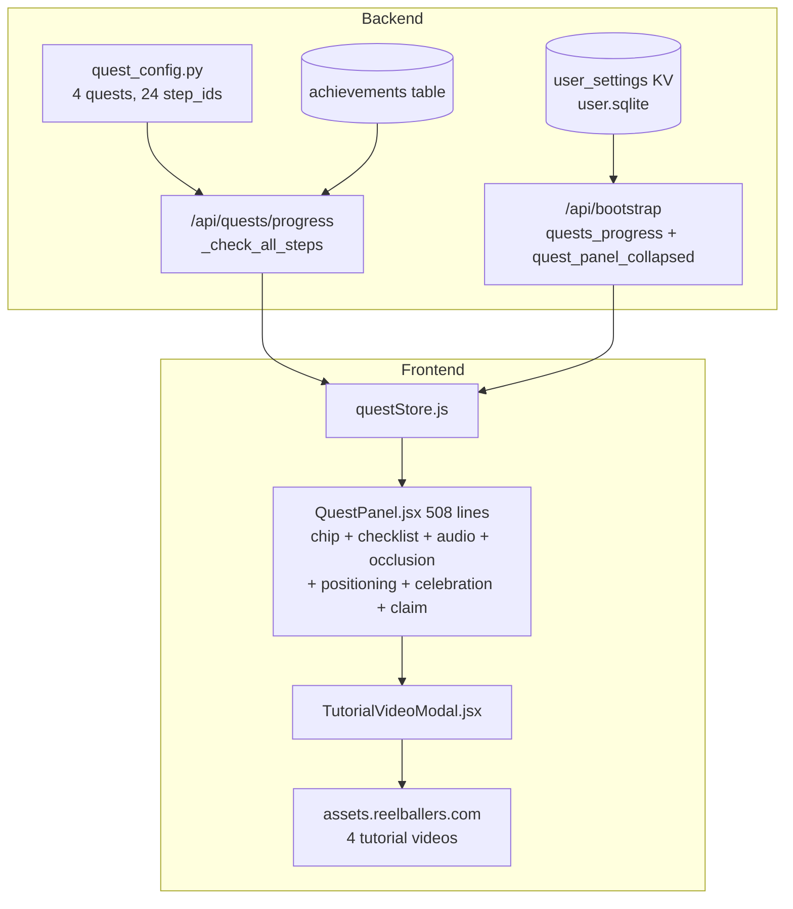
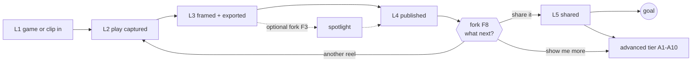
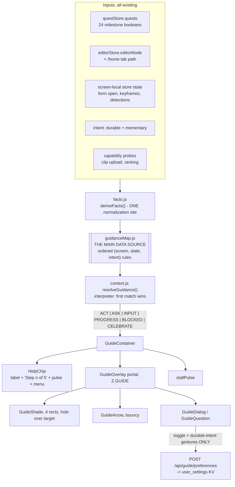
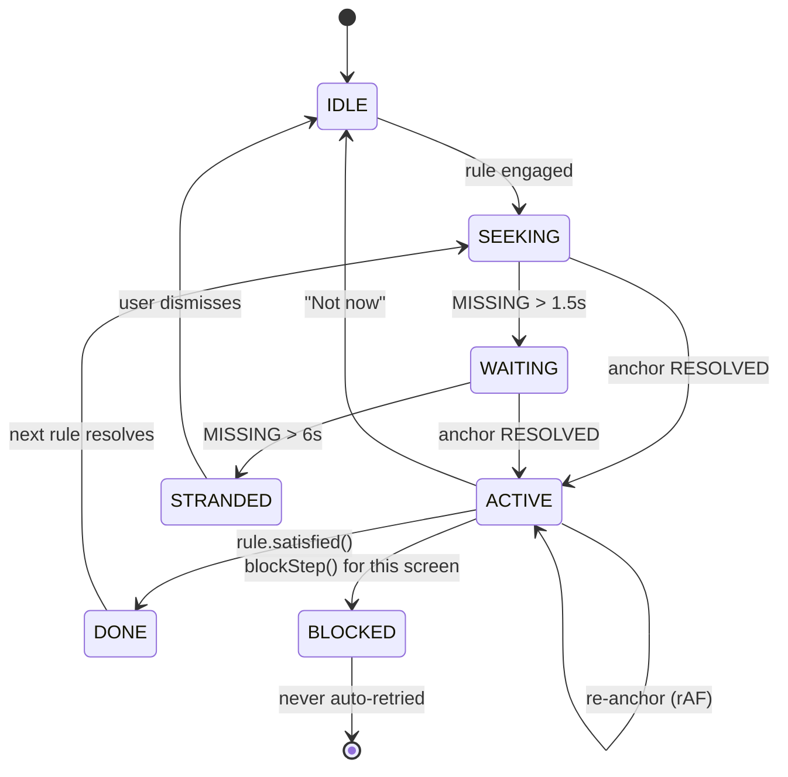
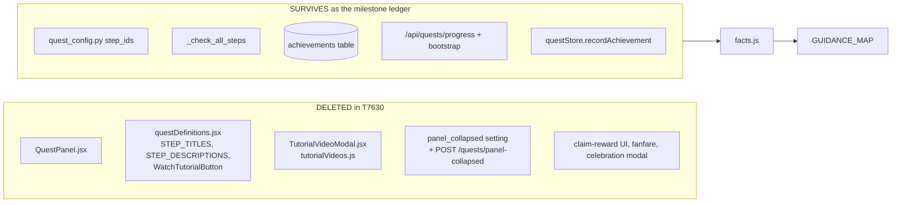

# T7620 Design: Guided Help engine, goal-gradient guidance map, and the post-publish advanced tier

**Task:** [T7620](tutorial-redesign/T7620-guided-tour-design.md)
**Epic:** [Tutorial Redesign](tutorial-redesign/EPIC.md)
**Status:** **APPROVED 2026-09-02** (round 2). T7630 may start once its two blocking sibling tasks (section 17) are filed.
**Author:** Architect agent

> **Round 1 revision (binding).** The first draft treated guidance as five mini-tours with a
> gentle-nudge posture. The user's direction reframed it: the system must be **more comprehensive
> than the old tutorial**, take **current state plus current screen** into account, **capture
> intent at every real fork instead of assuming it**, and **actively drive** the user toward one
> ultimate goal, a **published reel**. The spine is section 5 (per-screen intent analysis) and
> section 6 (`GUIDANCE_MAP`, the single authoritative data source). `resolveGuidance` is an
> interpreter of that map. Posture is section 7.
>
> **Round 2 decisions (binding, folded in).** R3 and R4 accepted, R1 and R2 not (section 17).
> After the first published reel the guide **asks** rather than stopping silently, and first
> publish **unlocks an advanced tier** of deliberately off-ladder capabilities (section 3.1 and
> the A-rules in section 6.3). The pre-cut-clips branch now points at real product work
> ([T8370](T8370-precut-clip-upload.md) plus [T8380](T8380-clips-screen-add-video.md)), which
> gate the tutorial launch (T7640). Driving into Annotate during an active upload is kept, with a
> dedicated regression. All recorded in section 21.

---

## 1. What already landed, and what this design now depends on

| Landing | Effect on this design |
|---|---|
| **T8120** (merged) | Quest panel already collapsed to a **Help chip**; collapsed state persists in `user_settings`; a generic modal-occlusion auto-hide exists (`useModalOcclusion`, rAF-coalesced); credit drip retired, `QUEST_CHAIN_CREDIT_TOTAL = 80` granted upfront. This design replaces what the chip OPENS. |
| **T8130** (merged) | Vocabulary is live: **Add Play**, **Clips**, **Highlight Reels**, **Build Highlight Reel**, **Move to Highlight Reels**. All copy below uses those exact words. |
| **T8140** (merged) | First clip is genuinely **one tap**: all fields defaulted, sticky Save, sport asked once as a full-screen question. Clip guidance is therefore 2 rules, and must not re-teach rating or naming. |
| **T8360** (design approved 2026-09-02, in flight) | Settled IA: the **Highlights section (multi-clip, in progress) lives on the Highlight Reels panel**, **renaming never moves a draft between surfaces**, and the drafts tab becomes **Clips**. Every rule binds to that IA. Its `clipsTabDisabled` dead-end guard is reworked by T8380. |
| **T8370 + T8380** (TODO, **gate T7640 rollout**) | Pre-cut clip upload becomes real: an uploaded file becomes a **clip**, entered through an **Add Video** button on the Clips tab carrying the reserved literal `data-tutorial-target="clips-add-video"`. Fork F1's pre-cut branch points here (section 8). |
| **T7470/T7480/T7490/T7500** (STAGING) | The P1 upload walls this epic was sequenced behind are fixed, so the guide may drive users into upload. T7490's retry affordance is the BLOCKED state's target. |
| **T6660/T6670/T6680/T6690** (live on prod) | Athlete Intro Card creation and attachment are fully shipped, so advanced set **A4** points at real UI. |
| **T3630** (ranking model and insertion UX, not yet deployed) | Advanced set **A5** is the one capability-gated set: it resolves only when the ranking surface is both **deployed** and **unlocked** for that user, and it fails closed (section 6.3). |

---

## 2. Current state analysis

### 2.1 Architecture today



The milestone data is already right. `_check_all_steps` (`quests.py:130`) derives 24 booleans
from four batched reads and ships them on `/api/bootstrap`. **That is the guidance engine's
primary input, and it needs no new state.** What is missing is not data. What is missing is a
model of what a user on a given screen in a given state should do NEXT, and anything on screen
that points at it.

### 2.2 Code smells in the surface being replaced

| Smell | Location | Impact |
|---|---|---|
| God component | `QuestPanel.jsx`, 508 lines, seven concerns | T8120's review found three real bugs in one pass |
| Poll instead of observe | `QuestPanel.jsx:146-160`, `setInterval(measure, 500)` for `[data-add-clip-form]` | 2 Hz DOM poll; the new anchor engine subsumes it |
| Two positioning systems | `getPositionForMode()` per-mode offsets AND `useModalOcclusion()` hide-entirely | Two answers to "where may this sit", neither can anchor to an element |
| Guidance content in three files | `quest_config.py`, `data/questDefinitions.js`, `config/questDefinitions.jsx` | Copy drift, already guarded by a test |
| Instruction that cannot transfer | Four videos plus `WatchTutorialButton` | 15 users watched the annotate video, 3 ever clipped |
| **No model of "next"** | Everywhere | The panel shows the first unchecked box of a fixed linear quest. No concept of screen, fork, or distance to a goal |

### 2.3 Current behavior

```pseudo
user lands on any screen:
    QuestPanel shows the first incomplete step of the first unclaimed quest, as TEXT
    the step is the same text regardless of which screen the user is on
    if the step is a watch_* step, offer a video
user then faces the real UI alone           // <-- the entire defect
```

---

## 3. The goal ladder (the gradient)

Everything is oriented toward **one terminal outcome: a published reel that has been shared**.
Guidance is never "here is a feature". It is always "here is the next action that shortens your
distance to that outcome".

| Rung | Milestone reached | Derived from |
|---|---|---|
| **L1** | A game (or an uploaded clip) is in the app | `upload_game`, `game_upload_succeeded`, `clip_uploaded` |
| **L2** | A play is captured as a clip | `add_clip`, `clip_created` |
| **L3** | The clip is framed and exported (a working video exists) | `export_framing`, `wait_for_export` |
| **L4** | The reel is published to Highlight Reels | `move_to_my_reels`, `move_succeeded` |
| **L5** | The reel is shared | `share_completed` |

Rules:

1. Every rule declares its rung. The engine always serves the **lowest incomplete rung**
   actionable from the current screen; if none is actionable here, it serves a navigation rule
   toward the screen where it is.
2. **The Overlay spotlight is deliberately OFF the critical ladder.** It is a quality branch
   between L3 and L4, offered as fork F3, never as a required rung. This is a change from the old
   quest chain, which forced the whole Overlay quest before Publish and is a plausible
   contributor to the framing-to-publish drop-off.
3. **The gradient is visible.** The chip shows `Step {rung} of 5` while the ladder is incomplete,
   and dialogs name the outcome ("two more steps and your reel is live"). An invisible gradient
   motivates nobody. This replaces the chip's current quest-count slot (recommendation R5).
4. **At L4 the guide asks rather than stopping.** Reaching L4 fires fork **F8** ("Nice. What
   next?": share this reel / show me what else I can do / make another reel). L5 remains a
   critical rung and is F8's first answer, so the share push is never lost.
5. **L4 also unlocks the advanced tier** (3.1). The advanced rules always sort AFTER every
   critical rule, so an unshared reel keeps winning until L5 is reached.



### 3.1 The post-publish advanced tier (new in round 2)

Publishing a reel proves the user has the loop. Everything the product can do BEYOND that loop is
deliberately withheld until then, and then opened deliberately. This is the answer to "does the
guide drive a second reel": it does not push silently and it does not push unconditionally. It
**asks** (F8), and it **opens up** the rest of the product.

| Set | Name | Surface | Unlock condition | Named by the user |
|---|---|---|---|---|
| **A1** | Play your annotations | Annotate | first publish | yes |
| **A2** | Share the whole game | Annotate + share dialog | first publish, a game exists | yes |
| **A3** | Share annotations with a teammate's family | Annotate + share dialog | first publish, a Team-layer clip exists | yes |
| **A4** | Add an Athlete Intro Card | Highlight Reels + profiles | first publish | yes |
| **A5** | Rank your reels | Highlight Reels | first publish **and** ranking deployed **and** unlocked for this user | yes |
| **A6** | Trim, rate and tag a play | Annotate | first publish | (curriculum) |
| **A7** | Slow motion and the dim check | Focus | first publish, a draft exists | (curriculum) |
| **A8** | Style the spotlight, titles and cover frame | Overlay | first publish, a working video exists | (curriculum) |
| **A9** | Compilations and downloads | Highlight Reels | first publish | (curriculum) |
| **A10** | Build a Highlight from several clips | Highlight Reels | three or more published | (curriculum) |

**This replaces the round-1 "secondary sets S1 to S7" entirely.** The reconciliation the round-2
direction asked for: S1 to S7 were gated on the ladder being COMPLETE (L5, published and shared).
A1 to A10 are gated on **first publish (L4)**, which is the user's explicit gate, and they are a
superset (the five capabilities the user named plus the remaining video curriculum).

**How the tier surfaces** (three ways, one resolver):

1. **Fork F8's second answer** ("Show me what else I can do") opens the Help panel in menu mode.
2. **The Help chip becomes a menu** once unlocked. Tapping it lists the advanced sets available on
   the CURRENT screen first (same `resolveGuidance` pass, filtered to `rung: 'A'`), then "Show me
   everything" grouped by screen.
3. **One earned nudge per set, ever.** An advanced set may auto-engage at most **once in the
   account's lifetime**, and only when the user is already on its surface AND idle (the stall
   condition, section 14). It never fires on screen entry. This keeps the tier pull-first: the
   product opens up, it does not start lecturing.

---

## 4. Where the engine sits



```
src/frontend/src/guide/
  facts.js            # PURE. deriveFacts(stores) -> one normalized snapshot
  guidanceMap.js      # PURE DATA. The spine (section 6)
  context.js          # PURE. resolveGuidance(facts) -> rule | null. The interpreter
  engagement.js       # PURE. shouldAutoEngage(rule, facts, session) (section 7)
  placement.js        # PURE. placeDialog(target, keepouts, viewport) -> rect
  anchor.js           # measure + observers (no React)
  useAnchor.js        # thin React wrapper
  guideStore.js       # zustand: enabled, durable intent, momentary intent, session state
  stallPulse.js       # dwell-without-key-action detector
  GuideRoot.jsx       # screen layer: guards on bootstrap-ready
  GuideContainer.jsx  # logic layer
  GuideOverlay.jsx    # view
  HelpPanel.jsx       # view: menu (incl. the advanced tier), on/off toggle, report a problem
```

Five files are pure and testable with no DOM. Screens import nothing from `guide/`. The only
inbound coupling is the `data-tutorial-target` / `data-tutorial-keepout` attributes plus three
named `guideStore.blockStep()` calls in existing failure handlers (section 13.3).

---

## 5. Per-screen intent analysis (what the user is actually trying to do)

The reasoning behind the map in section 6. For each surface: the states a user can genuinely
arrive in, what that user most plausibly wants, and the next action that shortens their distance
to a published reel. Ambiguous states get a question rather than a guess.

### 5.1 Home, Games tab (`/home/games`)

The arrival screen for nearly every session, and where 6 of 11 mobile users opened Add Game and
only 2 ever selected a file.

| State | What the user most plausibly wants | Next best action | Rung |
|---|---|---|---|
| Brand new, zero games, zero clips | To find out whether this app does the thing they signed up for | **Ask F1** (full game, or clips already cut), then drive the matching ingest | L1 |
| Zero content, `intent.source = full_game` | To get their footage in | Drive **Add Game** | L1 |
| Zero content, `intent.source = pre_cut` | To upload the clips they already have | Drive **Clips tab**, then **Add Video** (T8380). Never Add Game: that is the observed failure | L1 |
| Add Game modal open, no file picked | To find the file picker (the exact tap-steal T8120 fixed) | Drive the **dropzone** | L1 |
| File picked, form not submitted | To finish and get on with it | Drive **Add Game submit** | L1 |
| Upload in flight, zero clips | Usually to wait, but waiting is the drop-off. The app supports annotating during upload | Drive **open the game and start finding plays** | L2 |
| Upload failed or stuck pending | To understand what happened and not lose work | **BLOCKED**: honest sentence, drive T7490's retry, offer report | recover |
| Game ready, zero clips | To see their game, and eventually get a highlight out of it | Drive **open the game** | L2 |
| Clips exist, no draft | Ambiguous: keep clipping, or turn what they have into a reel | **Ask F2** (fires on Annotate, re-offered here) | L2/L3 |
| Draft exists, not framed | To finish the reel they started | Drive **open the Clips tab** | L3 |
| Working video exists, unpublished | To see it and get it out | Drive **preview**, then **Move to Highlight Reels** | L4 |
| Just published | Ambiguous, and the moment of highest goodwill | **Ask F8**: share it / show me more / make another | L4 |
| Published, not shared, chose `share_now` | To show someone | Drive **Highlight Reels**, then **Share** | L5 |
| Published and shared | Second-order value | Advanced tier (3.1), pull-first | A |
| Game expired | To not lose the work | **Ask F7** (work from saved clips, or upload again) | recover |

### 5.2 Annotate

The decisive cliff. Last 30 days: 11 users watched their uploaded game here, 5 opened the clip
form, 6 ever created a clip, and `clip_save_failed` is zero all-time. The system never refuses.
Users never arrive.

| State | What the user most plausibly wants | Next best action | Rung |
|---|---|---|---|
| Game open, zero clips, watching | To find a good moment and not lose it | Drive **Add Play**, with the backward-capture sentence | L2 |
| Clip form open, unsaved | To not make five decisions (T8140 removed them) | Drive **Save**. One tap | L2 |
| Form open, typed teammate text uncommitted | To add that name. This used to dead-end (T7540) | Drive **press Enter** on the input | L2 |
| One clip saved, no draft | **The user's own example fork.** Keep hunting, or turn this one into a reel? Both legitimate; the app cannot know | **Ask F2**: "Find another play, or make a reel from this one?" | L2/L3 |
| Branch `more_plays` | Volume before assembly | Drive **Add Play** again, different copy | L2 |
| Branch `make_reel` | To see the payoff now | Drive the clip row's **Reel control** (R1 not accepted, so this is the live target and the map's weakest anchor) | L3 |
| Several clips, at least one has a draft | To go finish it | Drive **navigate to Clips** | L3 |
| Clip save failed / sync failed | Honesty | **BLOCKED** with retry and report | recover |
| Source video expired | To keep using the clips they saved | Honest degrade; never drive playback of a dead source | recover |
| `no_sport` profile | To tag the clip | **Defer.** T8140 owns this. The guide must never render a second sport prompt | |
| Published at least once | The rest of Annotate: playback, sharing, trimming, tagging, layers | Advanced sets **A1, A2, A3, A6** | A |

### 5.3 Focus (framing)

| State | What the user most plausibly wants | Next best action | Rung |
|---|---|---|---|
| Clip open, no crop keyframes | To understand what the white box is for | Drive **drag the box**, copy names its ROLE | L3 |
| Crop set, not exported | A finished video | Drive **Export**, copy names length and cost honestly | L3 |
| Export in flight | To not sit and stare | **PROGRESS** offering the parallel action | L3 |
| Export failed | Honesty | **BLOCKED** with retry and report | recover |
| Working video exists | Genuine fork: polish with a spotlight, or publish now | **Ask F3**: "Add a spotlight on your athlete, or publish it now?" | L3/L4 |
| Branch `publish_now` | To be done | Drive **Publish this reel** on Focus itself (recommendation **R3, accepted**) | L4 |
| Branch `spotlight` | Quality | Drive **open in Overlay** | off-ladder |
| Source clip edited after export (T8070 `reel_source_*` mismatch) | Their reel to match their clip | Drive **re-export** | L3 |
| Insufficient credits | To understand the cost and decide | **BLOCKED** honest, drive the existing buy-credits surface. Never a fake free path | recover |
| Published at least once | Slow motion, the dim check | Advanced set **A7** | A |

### 5.4 Overlay (off the critical ladder, reached only through fork F3)

| State | What the user wants | Next best action |
|---|---|---|
| Opened, detections present, none assigned | The spotlight to follow their kid | Drive **tap a marker, then tap your athlete** |
| Zero detections | The same thing, by hand | Drive **place the circle on your athlete** |
| Assigned, unstyled | It to look good | Defaults are already applied; styling is advanced set **A8**, not a required step |
| Ready | The render | Drive **Add Spotlight** |
| Rendering | To wait usefully | PROGRESS |
| Rendered | To publish | Drive **back to the draft and publish** (returns to L4) |

### 5.5 Clips surface (single-clip work; the tab T8360 renames and T8380 gives an Add Video button)

| State | What the user wants | Next best action | Rung |
|---|---|---|---|
| Zero clips, zero games | To start from the clips on their phone | Drive **Add Video** (T8380). This is the pre-cut branch's home | L1 |
| Draft Not Started | To start framing | Drive the tile's clip segment (R2 not accepted, so this is the live target) | L3 |
| Draft mid-Focus | To resume | Same entry, copy says "pick up where you left off" | L3 |
| Draft has working video | To see and publish it | Drive **preview**, then **Move to Highlight Reels** | L4 |
| Draft stale versus its source clip (T8070) | Their reel to match | Drive **re-export** | L3 |
| Draft waiting on upload | To wait | Suppressed. `canOpen` is false; the guide never points at a dead control | |

### 5.6 Highlight Reels panel (published reels, plus the T8360 Highlights section)

| State | What the user wants | Next best action | Rung |
|---|---|---|---|
| Zero published | Nothing is here yet | Drive **navigate back to Clips** | L4 |
| One published, never shared | To show someone | Drive **Share** | L5 |
| Shared | Acknowledgement, then what next | **CELEBRATE once**, then the advanced tier | A |
| Published, no intro card | Polish that makes the reel feel finished | Advanced set **A4** | A |
| Published, ranking deployed and unlocked | Their best reels to lead | Advanced set **A5** | A |
| Three or more published, no multi-clip Highlight | A compilation | Advanced set **A10** (asks first) | A |

### 5.7 Share surface (share dialog, treated as its own screen)

| State | What the user wants | Next best action | Rung |
|---|---|---|---|
| Dialog open, nothing sent or copied | To get the link to a person | Drive **Copy link**, the lowest-friction egress | L5 |
| Recipient rows visible, none added | Email delivery to a specific family | Drive **add a recipient**, an alternative rule behind Copy link | L5 |
| Sent or copied | Done | CELEBRATE, close the ladder | done |
| Published at least once, sharing a GAME rather than a reel | Other families to see their kids | Advanced sets **A2, A3** | A |

### 5.8 Cross-cutting

| State | Next best action |
|---|---|
| The same rule dismissed twice in one session | **Ask F6**: "Are you stuck, or doing something else?" `stuck` opens report-a-problem plus a simpler path; `something_else` snoozes that whole rung for the session. Repeated dismissal becomes signal instead of nagging |
| Any `blockStep()` reason set | BLOCKED wins over everything on that screen |
| Help off | Nothing renders except the chip, which stays available |

---

## 6. THE MAIN DATA SOURCE: `GUIDANCE_MAP`

The spine. One ordered array. Everything else reads it and nothing duplicates it.

### 6.1 The facts snapshot (one normalization site)

Every predicate reads `facts` and nothing else. No rule touches a store directly.

```js
// guide/facts.js -- PURE, no React, no DOM
deriveFacts({ quests, editorMode, path, annotate, focus, overlay, projects, guide, caps }) => ({
  // --- screen identity
  screen,              // 'home.games' | 'home.clips' | 'home.reels' | 'annotate'
                       // | 'focus' | 'overlay' | 'share-dialog'
  // --- ladder milestones (from quests_progress, already derived server-side)
  hasGame, gameReady, uploadInFlight, uploadFailed, gameExpired,
  clipCount, hasDraft, hasWorkingVideo, hasPublishedReel, hasShared,
  publishedCount, hasMultiClipHighlight,
  // --- screen-local, ephemeral, read from the owning store
  addGameModalOpen, fileChosen, addClipFormOpen, uncommittedTagText,
  cropKeyframeCount, exportInFlight, detectionCount, assignedCount,
  spotlightRendered, draftStage, reelStale, previewed, shareDialogOpen, shareSent,
  hasTeamLayerClip, hasIntroCardAttached,
  // --- capability probes (fail CLOSED: absent capability means the rule never resolves)
  caps: { clipUpload, ranking },        // clipUpload: T8370+T8380 shipped
                                        // ranking: T3630 deployed AND unlocked for this user
  // --- economics and honesty
  credits, sport,
  // --- guide's own state
  intent: { source },                   // DURABLE, persisted
  moment: { afterFirstClip, afterFraming, afterPublish, buildHighlight, shareMode },
  blocked, dismissedThisSession, helpEnabled, advancedNudged,   // Set of set-ids
  // --- derived
  ladderRung,          // 0..5, the lowest INCOMPLETE rung
  ladderComplete,      // hasShared
  advancedUnlocked,    // hasPublishedReel      <-- L4, per the round-2 decision
})
```

### 6.2 Rule shape

```js
{
  id:      'annotate.ask.after-first-clip',   // greppable, unique
  screen:  'annotate',
  rung:    2,                                  // 1..5 | 'rec' | 'A'
  when:    (f) => f.clipCount >= 1 && !f.hasDraft && !f.moment.afterFirstClip,
  kind:    'ASK',                              // ACT | ASK | INPUT | PROGRESS | BLOCKED | CELEBRATE
  ask: {
    say: 'Do you want to find another play, or make a reel from this one?',
    answers: [
      { value: 'more_plays', label: 'Find another play' },
      { value: 'make_reel',  label: 'Make a reel from this one' },
    ],
    writes: 'moment.afterFirstClip',           // momentary, session-scoped
  },
}
```

An `ACT` / `INPUT` rule carries `target` (a literal), `say`, `card`, a completion clause
(`milestone` or `observe`), and an optional `failsOn`. An advanced rule additionally carries
`set` (A1 to A10) and `rung: 'A'`.

### 6.3 The map

Ordered. **First rule whose `screen` matches and whose `when` is true wins.** Within a screen:
BLOCKED, then recovery, then the lowest incomplete critical rung, then forks, then advanced.
**Every advanced rule additionally requires `f.advancedUnlocked`**, so the critical ladder always
wins while it is incomplete.

#### Home, Games tab (`home.games`)

| # | Rule id | `when` | Rung | Kind | Target / question | Copy (`say`) |
|---|---|---|---|---|---|---|
| 1 | `home.blocked.upload` | `blocked === 'upload_failed'` | rec | BLOCKED | `pending-upload-retry` | "That upload did not finish. Tap Try again, or tell us what happened." |
| 2 | `home.recover.expired` | `gameExpired` | rec | ASK | F7 | "That game's video expired. Work from the clips you saved, or upload it again?" |
| 3 | `home.ask.source` | `!hasGame && clipCount === 0 && !intent.source` | 1 | ASK | F1 | "Do you have a full game video, or clips you already cut?" |
| 4 | `home.act.add-game` | `!hasGame && intent.source === 'full_game'` | 1 | ACT | `home-add-game` | "Tap Add Game to bring your game video in." |
| 5 | `home.act.go-clips-for-upload` | `clipCount === 0 && intent.source === 'pre_cut' && caps.clipUpload` | 1 | ACT | `home-tab-clips` | "Open Clips. You can upload the clips you already have." |
| 6 | `home.act.pick-file` | `addGameModalOpen && !fileChosen` | 1 | ACT | `add-game-dropzone` | "Tap here to pick the video from your phone." |
| 7 | `home.act.submit-game` | `addGameModalOpen && fileChosen` | 1 | ACT | `add-game-submit` | "Now tap Add Game to start the upload." |
| 8 | `home.act.open-while-uploading` | `uploadInFlight && clipCount === 0` | 2 | ACT | `home-game-tile` | "It is still uploading. Open it now and start finding plays." |
| 9 | `home.act.open-game` | `gameReady && clipCount === 0` | 2 | ACT | `home-game-tile` | "Open your game by tapping its card." |
| 10 | `home.act.go-clips` | `hasDraft && !hasWorkingVideo` | 3 | ACT | `home-tab-clips` | "Your clip is waiting to be framed. Open Clips." |
| 11 | `home.act.back-to-annotate` | `clipCount >= 1 && !hasDraft && moment.afterFirstClip === 'more_plays'` | 2 | ACT | `home-game-tile` | "Open your game again and grab the next play." |
| 12 | `home.ask.after-publish` | `hasPublishedReel && !hasShared && !moment.afterPublish` | 4 | ASK | **F8** | "Your reel is published. Share it now, see what else you can do, or make another?" |
| 13 | `home.act.go-reels` | `hasPublishedReel && !hasShared && moment.afterPublish === 'share_now'` | 5 | ACT | `home-tab-reels` | "Open Highlight Reels to send it." |

> Rule 13 is **weakened by recommendation R4 (accepted)**: once publishing lands the user on the
> reel they just made, rule 13 only fires for a user who left the surface and came back. It is
> kept for that case rather than deleted.

#### Annotate (`annotate`)

| # | Rule id | `when` | Rung | Kind | Target / question | Copy |
|---|---|---|---|---|---|---|
| 14 | `annotate.blocked.save` | `blocked === 'clip_save_failed'` | rec | BLOCKED | `clip-save-retry` | "That play did not save. Tap Retry, or tell us what happened." |
| 15 | `annotate.recover.expired` | `gameExpired` | rec | ACT | `annotate-exit-home` | "This game's video expired. Your saved clips still work." |
| 16 | `annotate.input.commit-tag` | `uncommittedTagText` | 2 | INPUT | `teammate-tag-input` | "Press Enter to add that name as a tag." |
| 17 | `annotate.act.save-clip` | `addClipFormOpen` | 2 | ACT | `clip-form-save` | "Everything is filled in already. Tap Save." |
| 18 | `annotate.act.add-play` | `clipCount === 0` | 2 | ACT | `annotate-add-play` | "When something great happens, tap Add Play. We grab the last few seconds." |
| 19 | `annotate.ask.after-first-clip` | `clipCount >= 1 && !hasDraft && !moment.afterFirstClip` | 2 | ASK | F2 | "Find another play, or make a reel from this one?" |
| 20 | `annotate.act.more-plays` | `moment.afterFirstClip === 'more_plays' && !hasDraft` | 2 | ACT | `annotate-add-play` | "Find the next one. Tap Add Play when you see it." |
| 21 | `annotate.act.make-reel` | `moment.afterFirstClip === 'make_reel'` | 3 | ACT | `clip-row-reel-toggle` | "Turn this play into a reel with the Reel control on the clip." |
| 22 | `annotate.act.go-frame` | `hasDraft && !hasWorkingVideo` | 3 | ACT | `annotate-exit-home` | "Your reel is waiting. Head back to frame it." |

> Rule 21 uses the in-row Reel control because **R1 was not accepted**. This is the weakest anchor
> in the map (a small control inside the clip row) and is the first thing to revisit if the
> `make_reel` branch under-converts post-ship. Its per-rule dismissal rate is measurable.

#### Focus (`focus`)

| # | Rule id | `when` | Rung | Kind | Target / question | Copy |
|---|---|---|---|---|---|---|
| 23 | `focus.blocked.export` | `blocked === 'export_failed'` | rec | BLOCKED | `export-retry` | "That export did not finish. Tap Try again, or tell us what happened." |
| 24 | `focus.blocked.credits` | `credits < exportCost` | rec | BLOCKED | `buy-credits` | "This reel needs more credits than you have. Here is how to get them." |
| 25 | `focus.progress.export` | `exportInFlight` | 3 | PROGRESS | `export-progress` | "We are upscaling it now. You can frame another one while you wait." |
| 26 | `focus.act.frame` | `cropKeyframeCount === 0` | 3 | ACT | `focus-crop-box` | "Drag the white box so your athlete stays inside it." |
| 27 | `focus.act.restale` | `reelStale` | 3 | ACT | `focus-export` | "You changed this play, so export it again to match." |
| 28 | `focus.act.export` | `cropKeyframeCount > 0 && !hasWorkingVideo` | 3 | ACT | `focus-export` | "Tap Export. It shows the length and what it costs." |
| 29 | `focus.ask.after-export` | `hasWorkingVideo && !moment.afterFraming` | 3 | ASK | F3 | "Add a spotlight on your athlete, or publish it now?" |
| 30 | `focus.act.publish-here` | `moment.afterFraming === 'publish_now'` | 4 | ACT | `focus-publish` (**R3**) | "Tap Publish to put it in Highlight Reels." |
| 31 | `focus.act.go-overlay` | `moment.afterFraming === 'spotlight'` | 3.5 | ACT | `focus-overlay-entry` | "Open Overlay to put a spotlight on your athlete." |

#### Overlay (`overlay`)

| # | Rule id | `when` | Rung | Kind | Target | Copy |
|---|---|---|---|---|---|---|
| 32 | `overlay.blocked.render` | `blocked === 'overlay_failed'` | rec | BLOCKED | `overlay-retry` | "The spotlight did not render. Tap Try again, or tell us what happened." |
| 33 | `overlay.progress.render` | `renderInFlight` | 3.5 | PROGRESS | `overlay-progress` | "We are burning the spotlight in. This takes a minute." |
| 34 | `overlay.act.assign` | `detectionCount > 0 && assignedCount === 0` | 3.5 | ACT | `overlay-detection-marker` | "Tap a green marker, then tap your athlete. The spotlight learns who to follow." |
| 35 | `overlay.act.place-circle` | `detectionCount === 0` | 3.5 | ACT | `overlay-manual-circle` | "We did not spot anyone. Place the circle on your athlete yourself." |
| 36 | `overlay.act.render` | `assignedCount > 0 && !spotlightRendered` | 3.5 | ACT | `overlay-add-spotlight` | "Tap Add Spotlight and we will render it into your reel." |
| 37 | `overlay.act.back-to-publish` | `spotlightRendered` | 4 | ACT | `overlay-exit-home` | "Your spotlight is in. Head back and publish it." |

#### Clips surface (`home.clips`)

| # | Rule id | `when` | Rung | Kind | Target | Copy |
|---|---|---|---|---|---|---|
| 38 | `clips.act.add-video` | `clipCount === 0 && intent.source === 'pre_cut' && caps.clipUpload` | 1 | ACT | `clips-add-video` (**T8380**) | "Tap Add Video and pick the clips from your phone." |
| 39 | `clips.act.frame` | `hasDraft && !hasWorkingVideo && draftStage !== 'waiting_upload'` | 3 | ACT | `draft-tile-open` | "Tap your clip to start framing it." |
| 40 | `clips.act.resume` | `draftStage === 'in_focus'` | 3 | ACT | `draft-tile-open` | "Pick up where you left off." |
| 41 | `clips.act.preview` | `hasWorkingVideo && !previewed` | 4 | ACT | `draft-tile-preview` | "Play it once to check it looks right." |
| 42 | `clips.act.publish` | `hasWorkingVideo && previewed` | 4 | ACT | `draft-publish` | "Tap Move to Highlight Reels to publish it." |

> Rules 39 and 40 anchor to the tile's clip segment because **R2 was not accepted**. Small target,
> higher mis-tap risk on mobile; measurable per-rule and revisitable.

#### Highlight Reels panel (`home.reels`)

| # | Rule id | `when` | Rung | Kind | Target / question | Copy |
|---|---|---|---|---|---|---|
| 43 | `reels.act.none-yet` | `publishedCount === 0` | 4 | ACT | `home-tab-clips` | "Nothing published yet. Your reel is waiting in Clips." |
| 44 | `reels.act.share` | `hasPublishedReel && !hasShared` | 5 | ACT | `reel-share` | "Tap Share to send it to family, or copy the link." |
| 45 | `reels.celebrate` | `hasShared && !celebratedThisAccount` | 5 | CELEBRATE | none | "That is your first reel, published and shared. Here is what else you can do." |

#### Share dialog (`share-dialog`)

| # | Rule id | `when` | Rung | Kind | Target | Copy |
|---|---|---|---|---|---|---|
| 46 | `share.act.copy-link` | `shareDialogOpen && !shareSent` | 5 | ACT | `share-copy-link` | "Copy the link and paste it into any chat." |
| 47 | `share.act.add-recipient` | `shareDialogOpen && !shareSent && moment.shareMode === 'email'` | 5 | ACT | `share-add-recipient` | "Type a family's email and we will send it to them." |

#### Global (evaluated before the screen rules)

| # | Rule id | `when` | Kind | Question |
|---|---|---|---|---|
| 48 | `global.ask.stuck` | `dismissCount(currentRuleId) >= 2` | ASK | F6: "Are you stuck here, or doing something else?" |

#### Advanced tier (`rung: 'A'`, every rule additionally requires `f.advancedUnlocked`)

| # | Rule id | Set | Screen | Extra gate | Target | Copy |
|---|---|---|---|---|---|---|
| 49 | `adv.annotate.playback` | A1 | annotate | `clipCount >= 2` | `annotate-playback-annotations` | "Tap Playback Annotations to watch your saved plays back to back." |
| 50 | `adv.annotate.share-game` | A2 | annotate | `hasGame` | `annotate-share-game` | "Tap Share to send this game's plays to other families." |
| 51 | `adv.share.public-link` | A2 | share-dialog | | `share-copy-public-link` | "Copy one public link so anyone can watch, with no signup." |
| 52 | `adv.annotate.team-layer` | A3 | annotate | `hasTeamLayerClip === false` | `clip-layer-control` | "Put a play on the Team layer to tag someone else's kid." |
| 53 | `adv.share.per-recipient` | A3 | share-dialog | `hasTeamLayerClip` | `share-add-recipient` | "Each family only gets the plays their own player is tagged in." |
| 54 | `adv.reels.intro-card-open` | A4 | home.reels | `!hasIntroCardAttached` | `reel-kebab` | "Open your reel's menu to add an Athlete Intro Card." |
| 55 | `adv.reels.intro-card-pick` | A4 | home.reels | | `intro-card-picker` | "Pick a card. It plays before your reel everywhere it goes." |
| 56 | `adv.profiles.intro-card-create` | A4 | home.reels | no card exists | `manage-profiles-intro-card` | "Make a card with your athlete's name, photo and position." |
| 57 | `adv.reels.rank` | A5 | home.reels | **`caps.ranking`** | `ranking-entry` | "Rank two reels head to head so your best ones lead." |
| 58 | `adv.annotate.trim` | A6 | annotate | `addClipFormOpen` | `clip-range-handles` | "Drag the handles to keep only the moment you want." |
| 59 | `adv.annotate.rate-tag` | A6 | annotate | `addClipFormOpen` | `clip-form-rating` | "Rate it and add tags so your best plays sort to the top." |
| 60 | `adv.focus.slowmo` | A7 | focus | `hasDraft` | `focus-split-segments` | "Split the key moment out and set it to half speed." |
| 61 | `adv.focus.dim-check` | A7 | focus | `cropKeyframeCount > 0` | `focus-background-dim` | "Switch the background to Dim and watch it through once." |
| 62 | `adv.overlay.loop-check` | A8 | overlay | `assignedCount > 0` | `overlay-play-spotlight` | "Play the spotlight on a loop to check it stays locked on." |
| 63 | `adv.overlay.style` | A8 | overlay | | `overlay-style-tab` | "Pick a colour that stands out, then Body or Ground." |
| 64 | `adv.overlay.text` | A8 | overlay | | `overlay-text-tab` | "The Text tab burns a title straight into the video." |
| 65 | `adv.overlay.thumbnail` | A8 | overlay | | `overlay-thumbnail-tab` | "Drag the marker to choose your reel's cover frame." |
| 66 | `adv.reels.collections` | A9 | home.reels | `publishedCount >= 2` | `collection-group-header` | "Your reels group into compilations by tournament and month." |
| 67 | `adv.reels.collection-download` | A9 | home.reels | a collection exists | `collection-download` | "Download a whole compilation as one video." |
| 68 | `adv.reels.ask-build` | A10 | home.reels | `publishedCount >= 3 && !hasMultiClipHighlight && !moment.buildHighlight` | ASK F5 | "Want to make one highlight video from several of these?" |
| 69 | `adv.reels.build` | A10 | home.reels | `moment.buildHighlight === 'yes'` | `build-highlight-reel` | "Tap Build Highlight Reel and pick the plays you want." |

**69 rules across 7 surfaces**, of which 48 are the critical ladder plus recovery and 21 are the
post-publish advanced tier. Compare with the old model: 24 linear checklist entries with no screen
awareness, no forks, and no unlock tier.

**Capability gating fails CLOSED.** Rules 5, 38 (`caps.clipUpload`) and 57 (`caps.ranking`) never
resolve while their feature is absent, so the guide can never point an arrow at a control that is
not on screen. `caps.clipUpload` is what makes the F1 pre-cut branch inert until T8370 and T8380
ship, which is exactly why those two tasks gate the T7640 rollout rather than T7630's build.

### 6.4 The interpreter

```pseudo
// context.js -- pure
function resolveGuidance(f) {
  if (!f.helpEnabled) return null

  for (rule of GUIDANCE_MAP) {                    // one ordered pass
    if (rule.screen !== 'global' && rule.screen !== f.screen) continue
    if (rule.rung === 'A' && !f.advancedUnlocked) continue
    if (f.dismissedThisSession.has(rule.id))      continue
    if (!rule.when(f))                            continue
    return rule
  }
  return null                                     // nothing to guide here
}
```

One pass, one return shape, no nesting. Adding guidance is one array entry with a `when`
predicate. Every rule id is greppable.

**Cross-screen guidance is just a rule whose target is a navigation control** (rules 5, 10, 13,
22, 37, 43). The guide never teleports the user, because performing the navigation is itself part
of learning where things live.

### 6.5 Test obligations on the map

| Test | Proves |
|---|---|
| `guidanceMap.coverage.test.js` | Every (screen, reachable state) in section 5 resolves to a rule or a documented deliberate null |
| `guidanceMap.order.test.js` | Within a screen: BLOCKED, recovery, lowest rung, forks, advanced. No rule is shadowed (unreachable) by an earlier one |
| `guidanceMap.monotonic.test.js` | Satisfying a critical rule strictly decreases `ladderRung` or changes screen. **No cycles** |
| `guidanceMap.unlock.test.js` | No `rung: 'A'` rule can resolve while `advancedUnlocked` is false; rules 5, 38, 57 never resolve with their capability absent |
| `guidanceMap.targets.test.js` | Every `target` literal exists on exactly one element in `src/`, and vice versa |

The monotonicity test is the structural proof that the goal gradient always points forward; the
unlock test is the structural proof that the advanced tier stays shut until first publish.

---

## 7. Engagement posture: actively driving (D2, re-derived in round 1, refined in round 2)

### 7.1 The rule

```pseudo
// engagement.js -- pure
shouldAutoEngage(rule, f, session) =
     f.helpEnabled
  && rule.kind in (ACT, ASK, INPUT, BLOCKED)      // PROGRESS never seizes the screen
  && !session.dismissed(rule.id)
  && !hardSuppressed(f)
  && (
       // critical ladder: drive at EVERY incomplete rung
       (rule.rung !== 'A' && !f.ladderComplete && !session.engagedFor(rule.id))
       ||
       // advanced tier: ONE earned nudge per set, ever, and only when idle on its surface
       (rule.rung === 'A' && !f.advancedNudged.has(rule.set) && stallConditionMet(f))
     )

hardSuppressed(f) =
     anotherModalIsOpen && targetIsNotInsideIt     // never fight a dialog we are not pointing into
  || documentIsHidden
  || anInputIsFocused && rule.target !== thatInput
  || guideOverlayAlreadyActive
  || f.screen is a public/shared route or the sign-in screen
  || sessionStorage 'shared_annotation_flow'       // matches the existing NUF suppression
```

Critical-rung auto-engagement fires **1200ms after the screen's data is ready**, so it lands after
the screen paints and never mid-transition, on every screen entry and on every rule change while
the ladder is incomplete. Advanced nudges never fire on entry; they require the same 45s
dwell-without-key-action condition the stall pulse uses, and each set spends its nudge once for
the lifetime of the account.

### 7.2 What changed, and when the driving stops

| Aspect | Draft 1 | Round 1 | Round 2 (final) |
|---|---|---|---|
| When critical rules auto-start | Only pre-first-clip | Every incomplete rung | Unchanged: every incomplete rung |
| Stop condition | First clip created | L5 (published and shared) | **L4 hands off to fork F8**, which offers share (L5), the advanced tier, or another reel. Critical driving still ends at L5 |
| After the goal | Pull-only forever | Pull-only forever | **Advanced tier unlocks at L4**, pull-first with one earned nudge per set |
| Second reel | not addressed | not addressed | **The guide asks (F8), never assumes.** `another_reel` re-arms the ladder for that session |
| Shade opacity | gentle dim | 72 percent | unchanged |
| "Not now" weight | equal-size button | de-emphasized always-present link | unchanged |
| Repeated dismissal | silent snooze | escalates to fork F6 | unchanged |
| Forks | 1 | 7 | **8** (F8 added) |
| Progress visibility | none | "Step n of 5" | unchanged (recommendation R5) |

### 7.3 The escape hatches that keep this honest

1. **"Not now" is on every dialog**, one tap, always rendered, never behind a hover.
2. **The shade never closes anything.** Clicking it plays one 300ms wobble on the arrow. The
   no-backdrop-close rule is preserved exactly.
3. **Help off is two taps from anywhere** (chip, then the toggle), and it is durable.
4. **A failure always wins.** BLOCKED outranks every driving rule on its screen, drops the shade
   entirely, and never re-arms itself.

### 7.4 Why this is not the pattern that makes 70 percent of users skip

The research constraint in the EPIC is about **front-loaded tours**: a long sequence played before
the user has context. This design is the opposite on all three axes the evidence names: guidance
is **contextual** (fires at the moment of need on the surface of need), **short** (each engagement
is one control; a rung is 1 to 4 rules), and **visibly skippable**. What is escalated is the
*insistence per moment*, not the *length per sequence*. The advanced tier is deliberately the
gentlest part of the system, because by then the user has proven they can drive.

---

## 8. Branching intent capture (pervasive, not assumed)

The old tutorial never asked the user anything. Every fork below is a place where two legitimate
user intents diverge and the app cannot infer which is live.

| Fork | Where it fires | Question (`say`) | Answers | Tier |
|---|---|---|---|---|
| **F1 source** | Home, zero content | "Do you have a full game video, or clips you already cut?" | Full game / Clips already cut | **Durable** |
| **F2 after first clip** | Annotate, clip saved, no draft | "Find another play, or make a reel from this one?" | Find another play / Make a reel | Momentary |
| **F3 after framing** | Focus, working video exists | "Add a spotlight on your athlete, or publish it now?" | Add a spotlight / Publish now | Momentary |
| **F5 compilation** | Reels, 3+ published (advanced set A10) | "Want to make one highlight video from several of these?" | Yes, build one / Not now | Momentary |
| **F6 stuck check** | Any rule dismissed twice this session | "Are you stuck here, or doing something else?" | I am stuck / Doing something else | Momentary |
| **F7 expired source** | Home or Annotate, game expired | "That game's video expired. Work from the clips you saved, or upload it again?" | Use my clips / Upload again | Momentary |
| **F8 after publish** | First publish (L4 reached) | "Your reel is published. Share it now, see what else you can do, or make another?" | Share it now / Show me what else I can do / Make another reel | Momentary |

> F4 from round 1 ("share now or make another") is **absorbed into F8**, which is the same moment
> with a third answer. One question at one moment, not two.

**F1's pre-cut branch now points at real product work.** Until T8370 and T8380 ship,
`caps.clipUpload` is false and rules 5 and 38 cannot resolve, so the branch is inert rather than
misleading. This is why those tasks gate the T7640 rollout: the tutorial must not launch with a
fork whose second answer leads nowhere, and it must never fall back to Add Game (the exact
observed failure: four pre-cut clips uploaded as four games, credits burned, zero output).

**Timing is unchanged from the round-1 recommendation:** F1 fires **before** the first Add Game
tap. It is one tap, it is the cheapest possible guard against the worst observed failure, and it
sets `intent.source` durably for every future session.

### 8.1 Two intent tiers, and why only one persists

**Durable intent** describes a stable trait. Only **F1** qualifies: a parent who films whole
matches will still be filming whole matches next month. It persists in
`user_settings.guide_intent_source`.

**Momentary intent** is a now-choice. "Find another play or make a reel" must be re-askable on the
next game. Momentary answers live in `guideStore.moment`, in memory, and are re-asked after a
reload. That is correct behavior: a reloaded page is a fresh moment.

This keeps persistence at exactly **two keys** while making branching pervasive.

### 8.2 Question dialog form

A `QUESTION` rule is a **true centred modal**: no shade hole, no arrow, no app target, because the
fork is in the user's head rather than on the screen. One sentence, then two or three answer
buttons stacked vertically at 320px, each at least 44px tall, plus the "Not now" link. Answering
is a gesture, so a durable answer may persist from that handler. F8 has three answers, which is
the maximum any fork may have.

### 8.3 Ambiguity policy

A rule may only be `ACT` if the next action is unambiguous given `facts`. If two rules with
different rungs would both match a state, that state is a fork and **must** be an `ASK`. The
`guidanceMap.order.test.js` shadowing check enforces this: an unreachable rule means an un-asked
question.

---

## 9. Anchoring and step-advance engine

### 9.1 Target registry, greppable and not computed

```jsx
// AnnotateModeView.jsx -- the literal is written HERE, at the call site
<button data-testid="annotate-primary-cta" data-tutorial-target="annotate-add-play" ...>
```

```js
// guide/guidanceMap.js -- the same literal is written HERE, once
{ id: 'annotate.act.add-play', target: 'annotate-add-play', ... }
```

1. The attribute value is **always a literal string** in JSX. Never interpolated.
   `grep -r 'annotate-add-play' src/` returns exactly two hits.
2. A target name appears on **exactly one** element in the DOM at a time, enforced by
   `guidanceMap.targets.test.js`, which scans both sides and asserts set equality. Targets whose
   capability has not shipped yet (`clips-add-video`, `ranking-entry`) are listed in an explicit
   `PENDING_TARGETS` allowlist in that test, with the task id that will create them, so a missing
   attribute is a tracked dependency rather than a silent hole.
3. `data-tutorial-keepout` marks chrome the dialog may never cover (sticky Save footer, transport
   bar, mobile action bar). Same literal rule.

### 9.2 Anchoring and re-anchoring

```pseudo
// anchor.js
measure(name):
    el = document.querySelector('[data-tutorial-target="' + name + '"]')
    if (!el)                            return { state: 'MISSING' }
    if (el.getClientRects().length===0) return { state: 'MISSING' }   // display:none/detached
    r  = el.getBoundingClientRect()
    vv = window.visualViewport || { height: innerHeight, width: innerWidth, offsetTop: 0 }
    if (r.bottom < 0 || r.top > vv.height) return { state: 'OFFSCREEN', rect: r }
    return { state: 'RESOLVED', rect: r, keepouts: measureKeepouts() }

// ONE scheduler. Every trigger funnels into it.
schedule(): if (rafId) return; rafId = rAF(() => { rafId = null; measure() })

triggers, all passive, all -> schedule():
    ResizeObserver(el), ResizeObserver(documentElement)
    MutationObserver(body, {childList, subtree, attributes:['class','style']})
    window: resize, orientationchange, scroll (capture, passive)
    visualViewport: resize, scroll                 // iOS keyboard and pinch
    editorStore.subscribe(editorMode)              // route/mode change
```

The MutationObserver plus rAF coalescing is deliberately the same pattern T8120 landed in
`useModalOcclusion` after its review found a per-frame forced-layout regression: at most one
layout-forcing measure per animation frame, and observers are installed on rule enter and torn
down on rule exit, so an idle user pays nothing.

**Scroll-into-view fires exactly once, on rule ENTER**, when the state is `OFFSCREEN`. It is never
re-fired by a later measure, so the engine can never fight the user's own scrolling.

### 9.3 Advance detection

```pseudo
rule.satisfied(f, obs) =
      rule.milestone ? f[rule.milestone] === true
    : rule.observe   ? obs.has(rule.id)
    : rule.when(f) === false            // the state predicate itself went false

// observe: passive, capture-phase, document-level, installed only while the rule is
// active, torn down on exit. It NEVER writes anything.
```

The third clause is the general case and it is why the map works: **a rule is done when its own
state predicate stops matching.** Rules do not need to know about each other. Advance is the
natural consequence of the facts changing, and the facts change because the app's existing gesture
handlers already persist and already report. The engine writes nothing to advance.

### 9.4 Rule state machine



- **WAITING** keeps the dialog, drops the shade to 25 percent, and says one honest sentence:
  "One moment, I am looking for that button."
- **STRANDED** is a bug in our own data, so it fails loudly: `console.error('[Guide] target never
  resolved', name)` plus a dialog offering "Skip this" and "Report a problem". It never loops and
  never silently self-heals (CLAUDE.md: no defensive fixes for internal bugs).

### 9.5 Motion spec

| Property | Value |
|---|---|
| Shape | Lucide `ArrowDown` at 28px in a 44px circular chip, cyan `#06b6d4` on `bg-gray-900/90`, `border-cyan-300` |
| Placement | On the target edge nearest the dialog, 8px offset, one of four rotations |
| Bounce | `translateY` 0 to -8px to 0, `cubic-bezier(.34,1.56,.64,1)`, 900ms period, 3-bounce burst then 1.2s rest, repeating while the rule is active |
| Shade | 72 percent black, 240ms opacity fade in |
| Shade click | 300ms arrow wobble (rotate +/-6deg). No dismissal |
| Enter | 180ms fade plus scale 0.85 to 1 |
| `prefers-reduced-motion` | No translate, no scale. Arrow opacity pulses 1 to 0.55 at 2s. Shade appears instantly. Arrow still rotates to point |

Motion is core product value (memory: animation polish direction), so the reduced-motion variant is
a first-class equal, not a disable.

---

## 10. Interaction contract and dialog placement

### 10.1 The contract

Each engagement is **exactly one** of:

| Kind | Interactive surface | Advance |
|---|---|---|
| `ACT` | One control, reachable through the shade hole | milestone / observe / predicate |
| `INPUT` | One input, reachable through the shade hole | observe on commit |
| `ASK` | No app control. Centred modal with 2 to 3 answer buttons | the answer gesture |
| `PROGRESS` | Nothing interactive. Informational while an async job runs | milestone or its failure twin |
| `BLOCKED` | Retry plus Report, both in the card. No shade | user leaves it |
| `CELEBRATE` | One dismiss | dismiss |

Everything else on screen is non-interactive while an `ACT` or `INPUT` engagement is live, because
the shade rects swallow those clicks.

### 10.2 Shade mechanics, and why not a mask

Four positioned rectangles around a hole, not one box with a CSS mask:

```
+------------------------------------+
|              TOP rect              |   pointer-events: auto (swallows clicks)
+--------+----------------+----------+
|  LEFT  |  HOLE (empty)  |  RIGHT   |   nothing renders over the hole, so clicks
+--------+----------------+----------+   fall through to the real element
|             BOTTOM rect            |
+------------------------------------+
```

- **No stacking-context surgery.** The target is never cloned, portaled, or given a z-index. A
  z-index cannot escape an ancestor's stacking context (documented in `zLayers.js` and in the
  annotate knowledge doc's clip-marker tooltip note), so raising app elements to punch through a
  shade is structurally unreliable. Rendering nothing over the hole sidesteps the class.
- **Hit-testing is exact.** The hole is the measured rect inflated by 6px, so the control keeps its
  real 44px touch target.
- **No backdrop-close.** Clicking a shade rect never dismisses. House rule preserved.

**Z rung**, added to `constants/zLayers.js`:

```
GUIDE  z-[300]   the guided-help overlay: shade, arrow, explainer, question modal. Above
                 SHARE (z-[200]) because a rule may point at a control inside ANY app
                 surface including the share dialog; below SYSTEM (z-[9999]) so the
                 impersonation banner and the blocking PWA update gate always win.
```

The Help **chip** stays at `Z.DROPDOWN` and keeps T8120's occlusion contract. While the overlay is
active the chip does not render, so the two can never both be on screen.

### 10.3 Placement algorithm, provably safe at 320px+

```pseudo
// placement.js -- pure
M = 12;  G = 10
W = min(vv.width - 2*M, 360)                    // FIXED width, not content-driven
safeTop = env(safe-area-inset-top); safeBottom = env(safe-area-inset-bottom)

placeDialog(T, keepouts, vv, H):
  x = clamp(T.centerX - W/2, M, vv.width - W - M)
  roomBelow = vv.height - safeBottom - T.bottom - G
  roomAbove = T.top - safeTop - G
  1. if (roomBelow >= H && !hitsKeepout(x, T.bottom+G, W, H)) return {x, y: T.bottom+G}
  2. if (roomAbove >= H && !hitsKeepout(x, T.top-G-H,  W, H)) return {x, y: T.top-G-H}
  3. scrollTargetIntoBand(T, T.centerY > vv.height/2 ? 'upper' : 'lower'); re-measure; retry 1,2
  4. console.error('[Guide] rule ineligible: target exceeds viewport', rule.id)
     -> degrade to a non-shaded coach mark docked to the safe bottom edge
```

**Non-overlap proof.** `W` is fixed and `x` is clamped, so below 384px the dialog spans the full
usable width. Horizontal separation is therefore impossible at 320px, which means overlap is
decided **entirely by the vertical band**. Branches 1 and 2 select a band disjoint from
`[T.top - G, T.bottom + G]` by construction, and `hitsKeepout` rejects any band intersecting a
declared keepout. The only failure mode is "no band is tall enough", which branch 3 removes by
scrolling and branch 4 reports as a design error rather than silently overlapping.

Eligibility invariant: `H + G <= max(T.top - safeTop, vv.height - safeBottom - T.bottom)`.

| Case | `vv.height` | Target h | Available | Required `H` | Verdict |
|---|---|---|---|---|---|
| iPhone SE portrait | 568 | 56 | 496 | 160 (full card) | fits, 3x margin |
| 320x498 (bug 46 report) | 498 | 56 | 426 | 160 | fits |
| iOS keyboard open, INPUT rule | ~250 | 48 | 178 | 96 (compact) | fits |
| Landscape phone, 320 tall | 320 | 48 | 256 | 96 (compact) | fits |

Mechanical rule: **`INPUT` rules and any rule that can coexist with an open keyboard use the
compact card** (one sentence, no buttons except the "Not now" link, `H <= 96`). `ACT` uses the full
card (`H <= 160`). `ASK` is a centred modal sized to its answers and is never shown with a keyboard
open. A unit test asserts every `INPUT` rule declares `card: 'compact'`.

---

## 11. State model

### 11.1 What persists: two keys, both gesture-written

Both live in the existing `user_settings` KV in `user.sqlite`, beside `quest_panel_collapsed` and
`notification_email_optout`. **No new table, no migration, no new Postgres state.**

| Key | Values | Written by (gesture) | Read by |
|---|---|---|---|
| `guide_enabled` | `"1"` / `"0"`; absent means derive the default (D1) | The on/off toggle click in the Help panel | `/api/bootstrap` |
| `guide_intent_source` | `"full_game"` / `"pre_cut"`; absent means unasked | The F1 answer tap | `/api/bootstrap` |

```python
# services/user_db.py -- next to get/set_quest_panel_collapsed
_GUIDE_ENABLED_KEY = "guide_enabled"
_GUIDE_INTENT_SOURCE_KEY = "guide_intent_source"
def get_guide_prefs(user_id) -> dict         # {"enabled": bool|None, "intent_source": str|None}
def set_guide_pref(user_id, key, value)      # INSERT OR REPLACE, one row, surgical

# routers/guide.py
@router.post("/api/guide/preferences")       # body: {enabled?: bool, intent_source?: str}
```

`/api/bootstrap` gains a `guide` object beside `quest_panel_collapsed`, so first paint is correct
with no flash and no follow-up fetch.

```js
// guideStore.js -- the ONLY two writes in the whole feature
setEnabled(next) {                     // called ONLY from the toggle onClick
  set({ enabled: next })
  apiFetch('/api/guide/preferences', { method:'POST', body:{enabled: next}, keepalive:true })
    .catch(() => console.error('[Guide] failed to persist help preference'))
}
answerSourceIntent(v) {                // called ONLY from the F1 answer onClick
  set({ intentSource: v })
  apiFetch('/api/guide/preferences', { method:'POST', body:{intent_source: v}, keepalive:true })
    .catch(() => console.error('[Guide] failed to persist help intent'))
}
```

**Do not mark these `rbNonDataWrite: true`.** T8120's post-hoc review found exactly that bug on the
panel-collapse write: it is a genuine `user.sqlite` write, and the marker would suppress a
legitimate sync-conflict alarm. These are the same class.

### 11.2 What does not persist, and why

| Not persisted | Why |
|---|---|
| Current rule / current rung | **Derived** from facts (memory rule: never store derivable state). A stored bookmark goes stale after a delete, a cross-device session, or a share materialization. Resume is strictly better |
| Momentary intents (F2, F3, F5 to F8) | Now-choices, not traits. Re-asking after a reload is correct |
| "Not now" dismissals | Session-scoped. A durable dismissal is nagging-by-inversion; the durable escape is the off toggle |
| `advancedNudged` (which advanced sets spent their one nudge) | Session and module state. Worst case a returning user gets one extra gentle nudge on a surface they are already idling on. Persisting it would need a third key for a cosmetic gain |
| Observations, dismiss counts, engaged-this-visit, celebrated | Session or module state |
| Blocked state | Memory only; re-derived from the next real attempt |

Persistence self-check per CLAUDE.md:

```
gesture -> handler -> surgical POST with ONLY the changed field    YES (2 keys, 2 gestures)
useEffect watching state -> write                                   NONE. Zero.
runtime fixups persisted                                            NONE.
restore is read-only                                                YES (bootstrap read only)
```

---

## 12. Curriculum coverage: retiring the four videos

Source of truth for what the videos taught: T5140 Part 1 talk tracks (the shipped 2026-08 recut).
Every chapter topic maps to a rule or a named deferral. `E` marks a critical-ladder rule; `A{n}`
marks an advanced set (post-publish unlock).

**annotate.mp4**

| Chapter | Topic | Guided home |
|---|---|---|
| Find A Play | Pick your sport | Owned by T8140's full-screen question. Guide defers |
| Find A Play | Games tab, poster cards by month | Rule 9 copy names the card |
| Find A Play | Tap the card to open Annotate | **E** rule 9 |
| Find A Play | Clips left, match centre | Rule 18 copy, one orienting clause |
| Create A Clip | Scrub to find a play | **E** rule 18 (backward capture) |
| Create A Clip | Click Add Play | **E** rule 18 |
| Create A Clip | Drag start and end handles | **A6** rule 58 |
| Describe, Rate, Tag | Name, rating, tags, notes | **A6** rule 59 |
| Describe, Rate, Tag | My Athlete versus Team layers | **A3** rule 52 |
| Describe, Rate, Tag | Team unlocks teammate tags | **A3** rules 52, 53; **E** rule 16 handles the Enter trap |
| Describe, Rate, Tag | Create Reel toggle | **E** rule 21 (the reel, not the toggle mechanics). T8070 auto-creates the draft |
| Save & Review | Click Save | **E** rule 17 |
| Save & Review | Playback Annotations | **A1** rule 49 |
| Share The Game | Share to teammates by email | **A2** rule 50, **A3** rule 53 |
| Share The Game | Copy one public link | **A2** rule 51 |

**framing.mp4**

| Chapter | Topic | Guided home |
|---|---|---|
| Open A Draft | Drafts by stage, pick Not Started | **E** rule 39 |
| Frame Your Player | The white box is the reel's frame | **E** rule 26 |
| Frame Your Player | Drag and resize to keep the athlete inside | **E** rule 26 |
| Frame Your Player | Each move sets a keyframe | **E** rule 26 copy (one clause) |
| Add Slow Motion | Split Segments, half speed | **A7** rule 60 |
| Check & Export | Dim background review | **A7** rule 61 |
| Check & Export | Export shows length and cost | **E** rule 28 copy |
| Check & Export | Export, then upscaling | **E** rules 28, 25 |

**overlay.mp4**

| Chapter | Topic | Guided home |
|---|---|---|
| Open In Overlay | Why a spotlight | Fork F3 copy |
| Open In Overlay | Open in Overlay, detection runs | **rule 31** |
| Assign Your Player | Green detection markers | **rule 34** |
| Assign Your Player | Tap your player at each marker | **rule 34** |
| Place The Circle | Tracker off, place by hand | **rule 35** |
| Place The Circle | Play spotlight (loops) to verify | **A8** rule 62 |
| Style & Add Spotlight | Colour and shape | **A8** rule 63 |
| Style & Add Spotlight | Text tab | **A8** rule 64 |
| Style & Add Spotlight | Thumbnail tab, cover frame | **A8** rule 65 |
| Style & Add Spotlight | Add Spotlight renders it | **rule 36** |

**publish.mp4**

| Chapter | Topic | Guided home |
|---|---|---|
| Preview & Publish | Preview the Done draft | **E** rule 41 |
| Preview & Publish | Move to Highlight Reels | **E** rule 42 (and rule 30 via R3) |
| In My Reels | The reel appears as its own card | **E** rule 44 context |
| In My Reels | Attach an Athlete Intro Card | **A4** rules 54, 55 |
| In My Reels | Create a card (name, photo, position) | **A4** rule 56 |
| In My Reels | It plays at every egress | **A4** rule 55 copy |
| In My Reels | Play, download, share | **E** rule 44 (share); **A9** rule 67 (download) |
| In My Reels | Upload to a platform on mobile | **A9** rule 67 copy |
| In My Reels | Compilations, tournament and month groups | **A9** rule 66 |
| In My Reels | Download a whole compilation | **A9** rule 67 |
| Rank Your Reels | Ranking sorts your best first | **A5** rule 57 (capability-gated on T3630) |

**Coverage:** 38 topics. 15 map to critical-ladder rules, 6 to Overlay rules, 16 to advanced-tier
rules, 1 is owned by T8140. Nothing is dropped. The one topic whose guided home is not yet
deployable is ranking, and its rule fails closed until T3630 ships.

**Assets retired in T7630:** `tutorialVideos.js`, `TutorialVideoModal.jsx`, `WatchTutorialButton`,
`TUTORIAL_STEP_QUEST`, and the in-app `tutorials/{quest}.{mp4,vtt,chapters.vtt}` contract. The
landing site's `TutorialModal.tsx` is a separate marketing surface and stays (decision D6).

---

## 13. Quest reconciliation (post-T8120)

### 13.1 What dies, what survives



**Identifiers do not change.** Quest ids, step ids, achievement keys, `FLOW_EVENTS` names, and
`daily_col` names are stored history feeding the admin funnel, `user_actions`, and
`daily_counters`. Renaming any of them severs a time series (the T7930 lesson). The reframe from
"quest checklist" to "milestone ledger" is comments and docstrings only.

### 13.2 The `watch_*_tutorial` steps

Four step ids complete only by watching a video. With the videos gone they can never complete,
which would wedge every quest and distort the admin funnel's current-step readout permanently.

**Decision: remove those four entries from `quest_config.py:QUEST_DEFINITIONS[*].step_ids` and from
`data/questDefinitions.js`.** Checked consequences:

- `_check_all_steps` stops computing them. Existing `achievements` rows are untouched.
- `FLOW_EVENTS["watched_*_tutorial"]` entries **stay registered**, so historical `user_actions` rows
  keep their labels on every admin surface.
- Credits: unaffected. T8120 zeroed every `reward` and grants the total upfront.
- Some mid-quest accounts flip to complete on next load. Correct: they have done everything that
  still counts.
- `config/questDefinitions.test.jsx` guards this copy and updates in the same commit.

### 13.3 Failure honesty and the T7490 hand-off

A rule with an async outcome declares its failure twin (`failsOn`). On failure the engine enters
**BLOCKED**: shade removed entirely (a failure is not a moment to dim the app), the card becomes
the honest sentence plus **Try again** pointing at the existing retry affordance plus **Report a
problem**, and **the rule is never re-armed automatically**. The user re-enters by tapping Help.

Three explicit `guideStore.blockStep(reason)` call sites, added to handlers that already exist, all
memory-only, named here for grepability:

| Call site | Reason |
|---|---|
| `uploadManager.js` upload failure catch | `upload_failed` |
| `useRawClipSave.js` sync-failed path | `clip_save_failed` |
| Export failure handler (`ExportButtonContainer` / export WS `error` phase) | `export_failed`, `overlay_failed` |

This is the only inbound coupling from app code to the guide: three lines, no persistence.

---

## 14. Stall pulse

The pulse **never auto-opens**. It exists for the case where auto-engagement was suppressed or
already dismissed, so the push degrades to an attention cue rather than disappearing. It is also
the trigger condition for an advanced set's single earned nudge (section 7.1).

| Parameter | Value |
|---|---|
| Signal | Foreground dwell on a funnel screen with **no key-action milestone change since screen entry** |
| Source | `uiTelemetry.js` already accumulates per-screen foreground dwell (background excluded). Export a pure read `getScreenDwellSeconds(screen)`. Add no second timer |
| Threshold | **45s** (EPIC requirement 6) |
| Screens and key actions | Home/Games: `add_game_opened`. Annotate: `add_clip_opened`. Focus: `crop_adjusted` or `export_started`. Overlay: `overlay_players_assigned`. Home/Clips: `open_framing`. Home/Reels: `move_attempted` or `share_attempted` |
| Excluded | Admin, sign-in, `/shared/*`, and any screen while `shared_annotation_flow` is set |
| Suppressed while | Any modal is open; the overlay is active; an input is focused; the tab is hidden |
| Effect | Chip scales 1 to 1.06 and glows for 2.5s, 3 cycles; label swaps to the resolved rule's `chipLabel` plus "Step n of 5" and stays swapped |
| Reduced motion | Label swap only |
| Rate limit | Max 1 pulse per screen per session, max 3 per session, never within 90s of a prior pulse |
| Persistence | None. Module state |
| Telemetry | One `recordUiImpression('dialog', 'guide_stall_pulse:<screen>')` per pulse, via the existing T7515 tier-3 beacon. No schema change |

---

## 15. Report a problem from Help

No new backend, no new component. The Help panel and the BLOCKED card both render the **existing**
`<ReportProblemButton />`, which already requires a non-empty description (T7560), attaches an
html2canvas screenshot plus the `clientLogger` ring buffer plus the action log plus
`getEditorContext()`, POSTs to `/api/auth/report-problem` with `rbNonDataWrite: true` (correct here:
a support ticket, not user data), and lands in the `bug_reports` table.

**Real side benefit:** the global mount is `hidden lg:block hide-on-touch`, so today **no mobile
user can report a problem at all**. Reaching it through Help fixes that with zero new code, and
mobile is where the funnel evidence is worst. F6's `stuck` answer routes straight here.

---

## 16. Voice-ready copy rules

1. **One string per rule.** `say` is the dialog body verbatim. No separate spoken variant to drift.
2. One sentence, 14 words or fewer, plain spoken English.
3. Name controls exactly as labeled: "Add Play", "Add Video", "Save", "Export", "Publish",
   "Move to Highlight Reels", "Build Highlight Reel", "Share", "Playback Annotations",
   "Athlete Intro Card".
4. Outcome before mechanics where a clause is affordable ("we grab the last few seconds").
5. No markup, no emoji, no em dashes, no parentheticals. Say "tap", not "click".
6. Numbers under ten spelled out.
7. `chipLabel` is a separate fragment (5 words max) for the chip and the pulse. A label, never
   spoken. The "Step n of 5" gradient text is generated, not authored.

`steps.copy.test.js` asserts the word budget, the banned characters, and that every `INPUT` rule is
`card: 'compact'`. V2 TTS becomes
`speechSynthesis.speak(new SpeechSynthesisUtterance(rule.say))`.

---

## 17. App design changes: accepted and rejected (round 2)

| # | Problem | Recommendation | Verdict | Consequence |
|---|---|---|---|---|
| **R1** | Annotate has no "I am done clipping, make my reel" exit; fork F2's `make_reel` branch has only a per-clip Reel control to point at | Add a persistent "Build reel from this play" CTA under the clips list | **NOT ACCEPTED** | Rule 21 anchors to `clip-row-reel-toggle`. The map's weakest anchor; revisit if the branch under-converts (per-rule dismissal is measured) |
| **R2** | The drafts tile's Focus entry is a small clip segment inside a progress strip (T7790b), a weak target for the most important L3 action | Give a Not Started tile an explicit "Frame this clip" button | **NOT ACCEPTED** | Rules 39 and 40 anchor to `draft-tile-open`. Higher mis-tap risk on mobile; measurable |
| **R3** | **Focus has no publish exit.** After export the user must navigate home and re-find the draft: a genuine dead end at the L3-to-L4 transition | On successful framing export, surface "Publish this reel" and "Add a spotlight" on Focus. This IS fork F3 rendered as real UI | **ACCEPTED** | Rule 30 anchors to `focus-publish`. Shortest path to publish loses a navigation step |
| **R4** | Publishing hides the thing you just made: the tile leaves the Clips surface with a toast, and the reel is on a surface the user has never visited | On publish success, land the user on the Highlight Reels panel scrolled to the new reel | **ACCEPTED** | Rule 13 becomes a fallback for the leave-and-return case only; the normal path goes straight to rule 44 (Share) |
| **R5** | No visible progress toward the goal; the chip's count slot becomes meaningless once the panel dies | Chip shows "Step n of 5" while the ladder is incomplete | **IN SCOPE** (part of this design) | Section 3 rule 3 |
| **R6** | Mobile users cannot report a problem at all (`hidden lg:block hide-on-touch`) | Reach `ReportProblemButton` through the Help panel | **IN SCOPE** (part of this design) | Section 15 |

### 17.1 R3 and R4 land as two sibling tasks, not inside T7630

**Architect's call, stated explicitly.** R3 and R4 are filed as two tightly-scoped tasks that
**block T7630's rules 13, 30, 41, 42 and 44**, rather than being folded into T7630's branch.
Reasons:

1. **They are product improvements that stand on their own.** A publish exit on Focus and a
   "land on the reel you just made" transition remove real friction whether or not guided help
   ever ships, so they deserve their own before/after read on `move_succeeded` and
   `share_completed`.
2. **T7630 is already an L-tier build** (engine, 69 rules, quest deletions, asset retirement).
   The refactoring rules cap reviewable units at roughly 200 meaningful lines and forbid mixing
   mechanical moves with behavior change; bundling two behavior changes into that branch works
   against both.
3. **They touch hot files.** R3 is in the Focus export surface and R4 is in
   `ProjectManager`/`DraftTile`, which T8360 and T8350 are also moving. Two small sequenced tasks
   rebase far more safely than one large branch.

Both must land **before** T7630 wires their rules. If you would rather have fewer tasks, folding
them into T7630 is a one-line change to the plan with no design impact.

---

## 18. Implementation plan and rollout

### 18.1 Preparation (before T7630)

| Change | Reason |
|---|---|
| File and land the **R3** task (publish exit on Focus) | Rule 30's target |
| File and land the **R4** task (publish lands on the new reel) | Rules 13, 41, 42, 44 |
| Add `Z.GUIDE = 'z-[300]'` to `constants/zLayers.js` with its ladder comment | The ladder is the single source of truth (T8120's review already caught a forked copy) |
| Export `getScreenDwellSeconds(screen)` from `utils/uiTelemetry.js` | Read-only accessor over dwell that already exists; prevents a second timer |
| Add `data-tutorial-keepout` to the Annotate timeline, the clip form's sticky footer, and the mobile action bar | Placement inputs |

### 18.2 T7630, the build

| File | Change |
|---|---|
| `src/frontend/src/guide/*` | New module, 13 files (section 4) |
| `App.jsx` | Mount `<GuideRoot />` once, replacing `<QuestPanel />` |
| `AnnotateModeView.jsx`, `ProjectManager.jsx`, `GameDetailsModal.jsx`, `DraftTile.jsx`, `ReelTile.jsx`, Focus crop/export/segments layers, Overlay tabs and detection layer, `TeammateTagInput.jsx`, share dialog, `ManageProfilesModal.jsx`, collection surfaces | One literal `data-tutorial-target` attribute each. No logic change |
| `uploadManager.js`, `useRawClipSave.js`, export failure handler | One `guideStore.blockStep(...)` line each |
| `services/user_db.py` | `get_guide_prefs` / `set_guide_pref` beside the panel-collapsed pair |
| `routers/guide.py` (new), `routers/bootstrap.py` | `POST /api/guide/preferences`; bootstrap gains `guide` |
| `quest_config.py`, `data/questDefinitions.js`, `config/questDefinitions.test.jsx` | Drop the four `watch_*_tutorial` step ids |
| DELETE | `QuestPanel.jsx`, `config/questDefinitions.jsx`, `TutorialVideoModal.jsx`, `config/tutorialVideos.js`, `POST /quests/panel-collapsed`, `get/set_quest_panel_collapsed` |

Sequenced commits (mechanical moves separate from behavior, units under ~200 meaningful lines):

1. Z rung, telemetry accessor, keepouts
2. `data-tutorial-target` attributes only
3. `facts.js` plus `guidanceMap.js` plus `context.js` plus `engagement.js` with tests, no UI
4. Guide UI mounted with `enabled` defaulting to false
5. Backend prefs plus bootstrap
6. Quest step-id removal plus panel deletion
7. Default flip per D1

Step 3 lands the entire spine as pure, tested data before a single pixel renders. That is the
cheapest place to get the model wrong and find out.

### 18.3 Rollout gating (T7640)

**T7640 must not launch guided help until [T8370](T8370-precut-clip-upload.md) and
[T8380](T8380-clips-screen-add-video.md) have shipped.** Fork F1's pre-cut answer is inert without
them (`caps.clipUpload` false, rules 5 and 38 unresolvable), which is safe but means half the
opening question leads nowhere. T7630 can be built and merged behind the default-off flag in the
meantime; only the default flip waits.

Rollout order: R3, R4 → T8360 → T8370 → T8380 → T7630 → T7640 (screen-size matrix, real-device
Safari pass, default flip per D1).

### 18.4 Tests (relevant set, roughly 16)

| Test | Proves |
|---|---|
| `guidanceMap.coverage.test.js` | Every state in section 5 resolves to a rule or a documented null |
| `guidanceMap.order.test.js` | Priority order holds; no rule is shadowed (a shadowed rule means an un-asked fork) |
| `guidanceMap.monotonic.test.js` | Satisfying a critical rule strictly decreases the rung or changes screen. **No cycles** |
| `guidanceMap.unlock.test.js` | No advanced rule resolves before first publish; capability-gated rules fail closed |
| `guidanceMap.targets.test.js` | Target literals match the DOM attributes one-to-one, minus the tracked `PENDING_TARGETS` allowlist |
| `facts.test.js` | Normalization from store shapes, including legacy-NULL and expired cases |
| `engagement.test.js` | Critical rules auto-engage at every incomplete rung; advanced sets nudge at most once and only on the stall condition; every hard suppression holds |
| `placement.test.js` | Non-overlap invariant at 320/375/428/768/1280 and at `visualViewport.height` 250 |
| `anchor.test.js` | rAF coalescing (one measure per frame under a mutation burst); teardown on exit |
| `guideStore.persistence.test.js` | Exactly two POSTs, both from gesture actions, neither flagged `rbNonDataWrite` |
| `steps.copy.test.js` | Word budget, banned characters, INPUT rules are compact |
| `stallPulse.test.js` | Threshold, suppressions, rate limit |
| `questDefinitions.test.jsx` (updated) | The four watch steps are gone; the rest unchanged |
| `test_guide_preferences.py`, `test_quest_steps_after_tutorial_retirement.py` | Backend round trip; reduced step set; historical achievements untouched |
| `e2e/T7630-guided-path.qa.spec.js` | Full ladder L1 to L5 in a real browser at 390x844 and 1280, ending in the F8 fork |
| **`e2e/T7630-annotate-during-upload.qa.spec.js`** | **Q4's dedicated regression:** the guide drives into Annotate while an upload is in flight, the upload then fails, and the user's annotation work survives (T7470 only-if-empty plus T8180 live-session guard) while the BLOCKED card is honest |
| `e2e/T7630-guide-blocked.qa.spec.js` | A forced export failure surfaces the honest card and does not loop |

---

## 19. Risks

| Risk | Mitigation |
|---|---|
| **The map is wrong about what users want.** It is a model, and models are opinions | The map is pure data with a coverage test, so revising a rule is a one-line change with no engine work. Every rule id is greppable and every engagement emits an impression beacon, so per-rule dismissal and completion rates are measurable post-ship with no schema change. R1 and R2's rejected anchors (rules 21, 39, 40) are the first candidates to read |
| **Forcefulness annoys competent users** | Critical driving stops at L5 and hands off to F8. The advanced tier is pull-first with one earned nudge per set. D1 also means existing accounts that already published start OFF |
| **The advanced tier becomes a second imposed tour** | Structurally prevented: `rung: 'A'` rules cannot auto-engage on screen entry at all, require 45s idle, and spend one nudge per set for the account's lifetime. `guidanceMap.unlock.test.js` and `engagement.test.js` both guard it |
| **Rule cycling** (two rules bouncing a user back and forth) | `guidanceMap.monotonic.test.js` is a structural proof, run in CI |
| **Pointing at a control that does not exist yet** (clip upload, ranking) | Capability gates fail CLOSED, and `PENDING_TARGETS` makes each missing attribute a tracked dependency with a task id rather than a silent hole |
| **z-index versus no-backdrop-close modals** | The shade never closes anything; the target inside a modal stays interactive through the hole; every dialog carries "Not now". An e2e case opens the Add Game modal with a rule active and asserts the dropzone still receives the tap (the T8120 regression shape) |
| **iOS Safari viewport** | All geometry reads `window.visualViewport`, with `innerHeight` as the only fallback; `env(safe-area-inset-*)` feeds the safe bands; `100vh`/`h-screen` are banned by `check-viewport-units.mjs` and unused. INPUT rules are forced compact, which fits the 250px keyboard-open case |
| **Real WebKit is not testable in the container** (chromium engine only) | Same honesty rule T8130/T8140 followed: structural verification plus a written spec, documented not claimed. The 320px matrix sign-off is T7640's job on a real device |
| **Data-always-ready** | `GuideRoot` renders nothing until `questStore.loaded` and auth resolved, so views never null-check. A missing target is a first-class `WAITING` state with a 6s `STRANDED` escape that fails loudly |
| **Driving into Annotate during a live upload** (rule 8) | Kept per Q4. Supported by design (T1540), protected by T7470's only-if-empty cleanup and T8180's live-session guard, and covered by its own dedicated e2e regression (18.4) |
| **Copy volume: 69 rules** | Rules are data in one file with a copy test. If volume threatens the schedule, the clean deferral boundary is the advanced tier's non-user-named sets (A6 to A9), at the cost of delaying the asset deletion. A1 to A5 and A10 are user-named and ship |

---

## 20. Design decisions

| Decision | Options considered | Choice | Rationale |
|---|---|---|---|
| Primary structure | Linear tours; per-screen tours; **an ordered (screen, state, intent) rule map** | **Rule map** | The requirement is "current state plus current screen decides", which is literally a lookup. Tours cannot express recovery states, forks, or an unlock tier without special cases |
| Goal representation | Implicit; per-tour progress; **an explicit 5-rung ladder every rule declares** | **Ladder** | Makes "next action toward publish" checkable in CI (monotonicity) and makes the gradient visible in the UI |
| Overlay position | A required stage (old quest chain); **an optional fork between L3 and L4** | **Optional fork** | Forcing the spotlight quest before publish is a plausible contributor to the framing-to-publish drop-off, and it is not needed for a shareable reel |
| What happens after the goal | Silent stop; unconditional push for a second reel; **ask (F8) and unlock an advanced tier** | **Ask plus unlock** | Round-2 direction. A silent stop wastes the product's compounding value; an unconditional push is the imposed-tour pattern |
| Advanced-tier gate | Ladder complete (L5); **first publish (L4)** | **First publish** | Round-2 direction, and it is the moment the user has demonstrably learned the loop |
| Advanced-tier delivery | Full tours; menu only; **menu plus one earned nudge per set** | **Menu plus one nudge** | Pull-first keeps it from becoming a second tutorial; one nudge means a user who never opens Help still discovers the tier exists |
| Intent storage | Persist all answers; persist none; **persist traits, keep moments in memory** | **Two tiers** | "Do you shoot full games" is stable. "Another play or a reel" is not, and persisting it would misdirect the next game |
| Where guide state lives | New Postgres table; new SQLite table; **existing `user_settings` KV** | **KV** | Two scalars. No new Postgres state (house rule), no migration, the exact pattern two shipped preferences already use |
| Position tracking | Persisted bookmark; **derived from facts** | **Derived** | Never store derivable state; a bookmark goes stale across devices and after deletes |
| Shade implementation | CSS mask; portal the target; **four rects around a hole** | **Four rects** | No stacking-context surgery, exact hit-testing, works over any app surface, target keeps its real touch target |
| Advance detection | New click instrumentation; **the rule's own predicate going false** | **Predicate** | Existing gestures already persist and report. Zero new writes, and completion means the work landed, not that a button was pressed |
| Target naming | Computed registry; reuse `data-testid`; **literal at both sites plus a contract test** | **Literal** | Greppability beats elegance; reusing `data-testid` would couple guidance to test refactors |
| Unshipped capabilities | Assume shipped; hardcode a fallback; **capability gates that fail closed plus a PENDING_TARGETS allowlist** | **Fail closed** | The guide must never point an arrow at a control that is not there, and a missing attribute must be a tracked dependency, not a silent hole |
| R3 and R4 delivery | Inside T7630; **two blocking sibling tasks** | **Sibling tasks** | They stand on their own, they keep T7630's reviewable units sane, and they rebase safely around T8360/T8350 (section 17.1) |
| Report a problem | New Help-specific form; **reuse `ReportProblemButton`** | **Reuse** | Zero new backend, and it gives mobile users a reporting path for the first time |
| Stall detection | New idle timer; **reuse `uiTelemetry` foreground dwell** | **Reuse** | One definition of dwell in the app; background time already excluded correctly |
| Videos | Keep as optional reference; **retire** | **Retire** (binding directive) | 15 watchers, 3 clippers |

---

## 21. Decisions taken

### Round 1

| Ref | Decision | Status |
|---|---|---|
| **D1** | Default ON for accounts that have **not yet published a reel**, OFF for accounts that have. `guide_enabled` absent means derive from the `move_to_my_reels` milestone; an explicit toggle write pins it forever | **ACCEPTED** |
| **D2** | Engagement posture | **RE-DERIVED (section 7):** auto-engage at every incomplete ladder rung on every screen where a rule matches, once per rule per screen visit. Shade 72 percent, "Not now" as a de-emphasized but always-present link, repeated dismissal escalates to fork F6. Refined in round 2: at L4 the ladder hands off to fork F8; critical driving still ends at L5 |
| **D3** | No stored step bookmark; position derived from facts | **ACCEPTED** |
| **D4** | "Not now" dismisses the current rule for the session; the durable escape is the off toggle | **ACCEPTED** |
| **D5** | The full curriculum ships with T7630 so the video assets retire on schedule | **ACCEPTED**, now delivered as the advanced tier A1 to A10 rather than S1 to S7 |
| **D6** | The landing site's `TutorialModal.tsx` and its R2 assets stay; only the in-app contract retires | **ACCEPTED** |

### Round 2

| Ref | Decision | Status |
|---|---|---|
| **Q1** | App design changes: **R3 accepted** (Focus gets a publish exit), **R4 accepted** (publishing lands the user on the reel they just made). **R1 and R2 not accepted**; rules 21, 39 and 40 keep their stated fallback anchors and are flagged as the map's weakest, with per-rule metrics to revisit them | **ACCEPTED**. Delivery: **two tightly-scoped sibling tasks blocking T7630**, per the Architect's call in section 17.1 |
| **Q2** | After the first published reel the guide **asks** (fork **F8**: share it / show me what else / make another). First publish also **unlocks an advanced tier** (section 3.1): A1 play your annotations, A2 share the whole game, A3 share annotations with a teammate's family, A4 create and attach an Athlete Intro Card, A5 rank your reels (capability-gated on T3630 being deployed and unlocked), plus A6 to A10 carrying the rest of the retired video curriculum. Surfaced through F8's second answer, the Help chip menu, and one earned nudge per set. Reconciled with round 1: this **replaces** S1 to S7 and moves the gate from ladder-complete (L5) to **first publish (L4)** | **ACCEPTED** |
| **Q3** | The pre-cut branch is resolved by product work, not a design fallback. F1's `pre_cut` answer points at **T8380's "Add Video" button** on the Clips tab (`data-tutorial-target="clips-add-video"`, reserved) backed by **T8370's** clip-upload capability. Both **gate the T7640 rollout**; `caps.clipUpload` keeps rules 5 and 38 inert until then. F1 still fires **before** the first Add Game tap | **ACCEPTED** |
| **Q4** | Rule 8 stands: the guide drives the user into Annotate during an active upload, with a dedicated e2e regression proving a mid-session upload failure never loses work | **ACCEPTED** |

---

## 22. Consistency notes surfaced while folding round 2 in

No blocking conflicts. Three items resolved in place, recorded so a later reader sees the reasoning:

1. **Tab literal unified.** Round 1 used both `home-tab-drafts` and a separate clips target. Post
   T8360 there is one surface, so every rule now uses **`home-tab-clips`** (rules 5, 10, 43) and the
   screen key is `home.clips`.
2. **F4 absorbed into F8.** Round 1's "share now or make another" and round 2's post-publish fork
   are the same moment. They are one three-answer question, not two.
3. **L5 versus the advanced unlock.** Both become available at L4. Resolved by ordering: every
   advanced rule sorts after every critical rule and requires `advancedUnlocked`, so an unshared
   reel keeps winning until L5. L5 is also F8's first answer. `guidanceMap.order.test.js` and
   `guidanceMap.unlock.test.js` both cover this.

---

## 23. Status

**APPROVED 2026-09-02.** Remaining before T7630 starts:

- [ ] File the two sibling tasks for **R3** (Focus publish exit) and **R4** (publish lands on the
      new reel), per section 17.1
- [ ] Confirm the sibling-task split versus folding R3 and R4 into T7630 (a one-line plan change if
      you prefer fewer tasks)

Rollout order: R3, R4 → T8360 → T8370 → T8380 → T7630 → T7640.
