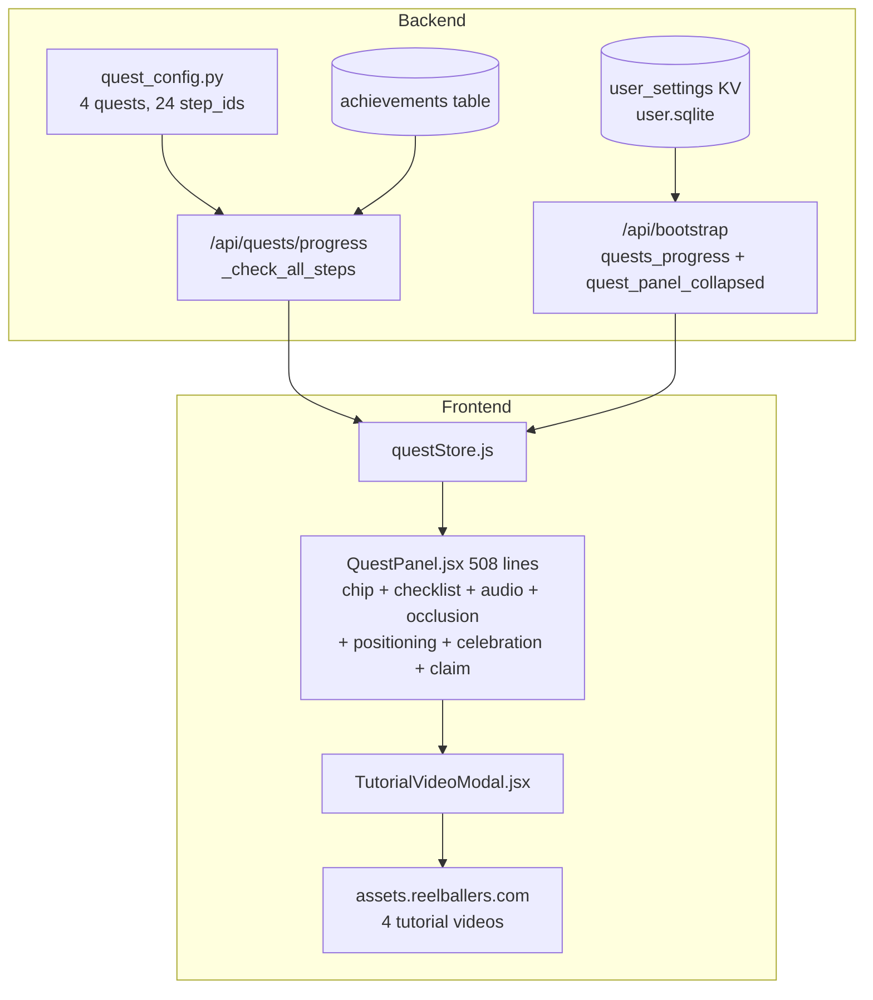
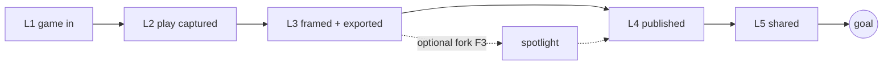
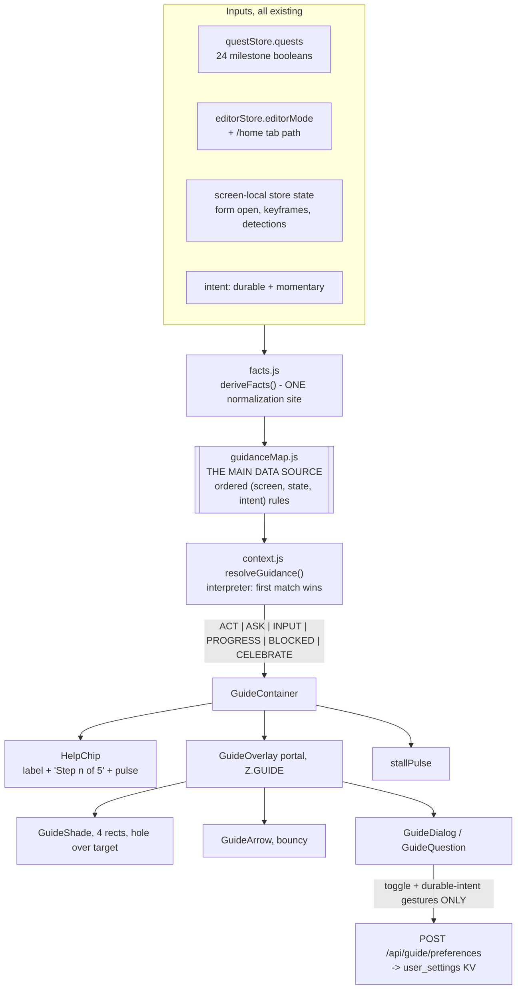
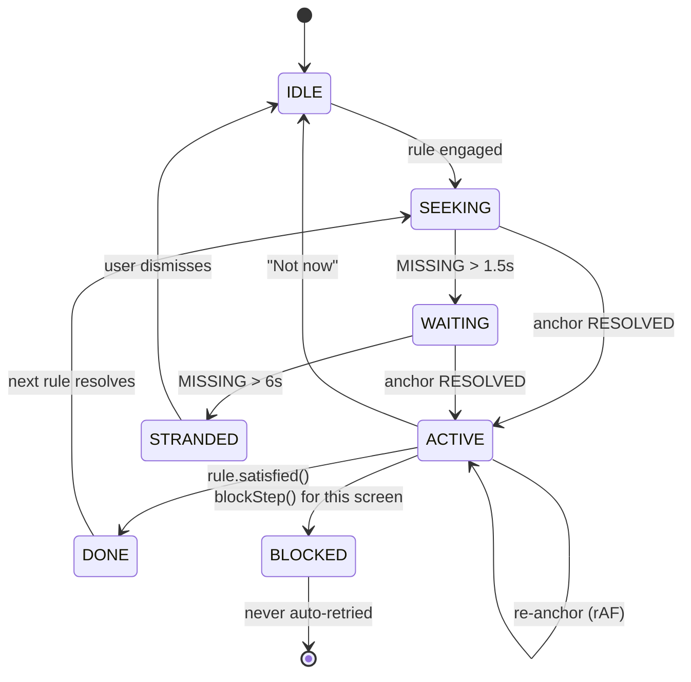
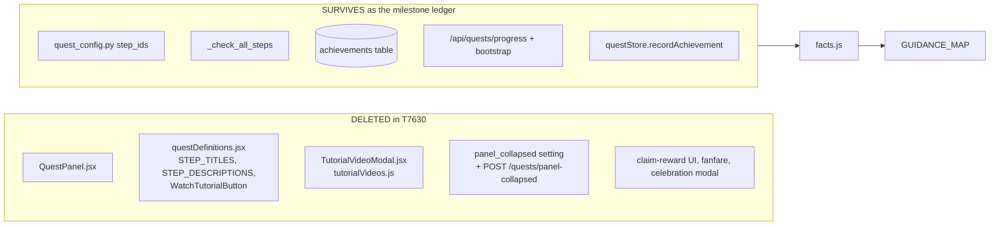

# T7620 Design: Guided Help engine, goal-gradient guidance map, and essential-path steps

**Task:** [T7620](tutorial-redesign/T7620-guided-tour-design.md)
**Epic:** [Tutorial Redesign](tutorial-redesign/EPIC.md)
**Status:** REVISED 2026-09-02 after user review round 1. AWAITING APPROVAL (T7630 blocked on this)
**Author:** Architect agent

> **Revision note (round 1 feedback, binding).** The first draft treated guidance as five
> mini-tours with a gentle-nudge posture. The user's direction reframes it: the system must be
> **more comprehensive than the old tutorial**, take **current state plus current screen** into
> account, **capture intent at every real fork instead of assuming it**, and **actively drive**
> the user toward one ultimate goal, a **published reel**. The spine of this document is now
> section 5, the per-screen intent analysis, and section 6, `GUIDANCE_MAP`, the single
> authoritative data source. `resolveGuidance` is demoted to an interpreter of that map. The
> engagement posture is re-derived in section 7. Recommended app changes are section 17.

---

## 1. What already landed under this task

| Landing | Effect on this design |
|---|---|
| **T8120** (merged) | Quest panel already collapsed to a **Help chip**; collapsed state persists in `user_settings`; a generic modal-occlusion auto-hide exists (`useModalOcclusion`, rAF-coalesced); credit drip retired, `QUEST_CHAIN_CREDIT_TOTAL = 80` granted upfront. This design replaces what the chip OPENS. |
| **T8130** (merged) | Vocabulary is live: **Add Play**, **Clips**, **Highlight Reels**, **Build Highlight Reel**, **Move to Highlight Reels**. All copy below uses those exact words. |
| **T8140** (merged) | First clip is genuinely **one tap**: all fields defaulted, sticky Save, sport asked once as a full-screen question. The clip guidance is therefore 2 steps, and it must not re-teach rating or naming. |
| **T8360** (design gate approved 2026-09-02) | Settled IA: the **Highlights section (multi-clip, in progress) lives on the Highlight Reels panel**, and **renaming never moves a draft between surfaces**. Single-clip drafts stay on the drafts/Clips surface. Every rule below now binds to that settled IA (the old T8360-RECONCILE markers are resolved). |
| **T7470/T7480/T7490/T7500** (STAGING) | The P1 upload walls this epic was sequenced behind are fixed, so the guide may drive users into upload without walking them into a wall. T7490's retry affordance is the BLOCKED state's target. |

---

## 2. Current state analysis

### 2.1 Architecture today



The milestone data is already right. `_check_all_steps` (`quests.py:130`) derives 24 booleans
from four batched reads and ships them on `/api/bootstrap`. **That is the guidance engine's
primary input, and it needs no new state.** What is missing is not data. What is missing is a
model of what a user on a given screen in a given state should do NEXT, and anything on screen
that points at it.

### 2.2 Code smells in the surface being replaced

| Smell | Location | Impact |
|---|---|---|
| God component | `QuestPanel.jsx`, 508 lines, seven concerns | T8120's review found three real bugs in one pass |
| Poll instead of observe | `QuestPanel.jsx:146-160`, `setInterval(measure, 500)` for `[data-add-clip-form]` | 2 Hz DOM poll; the new anchor engine subsumes it |
| Two positioning systems | `getPositionForMode()` per-mode offsets AND `useModalOcclusion()` hide-entirely | Two answers to "where may this sit", neither can anchor to an element |
| Guidance content in three files | `quest_config.py`, `data/questDefinitions.js`, `config/questDefinitions.jsx` | Copy drift, already guarded by a test |
| Instruction that cannot transfer | Four videos plus `WatchTutorialButton` | 15 users watched the annotate video, 3 ever clipped |
| **No model of "next"** | Everywhere | The panel shows the first unchecked box of a fixed linear quest. It has no concept of the current screen, no concept of a fork, and no concept of distance to a goal |

### 2.3 Current behavior

```pseudo
user lands on any screen:
    QuestPanel shows the first incomplete step of the first unclaimed quest, as TEXT
    the step is the same text regardless of which screen the user is on
    if the step is a watch_* step, offer a video
user then faces the real UI alone           // <-- the entire defect
```

---

## 3. The goal ladder (the gradient)

Everything in this design is oriented toward **one terminal outcome: a published reel that has
been shared**. Guidance is never "here is a feature". It is always "here is the next action that
shortens your distance to that outcome".

| Rung | Milestone reached | Derived from |
|---|---|---|
| **L1** | A game (or clip) is in the app | `upload_game`, `game_upload_succeeded` |
| **L2** | A play is captured as a clip | `add_clip`, `clip_created` |
| **L3** | The clip is framed and exported (a working video exists) | `export_framing`, `wait_for_export` |
| **L4** | The reel is published to Highlight Reels | `move_to_my_reels`, `move_succeeded` |
| **L5** | The reel is shared | `share_completed` |

Rules:

1. Every guidance rule declares its rung. The engine always serves the **lowest incomplete
   rung** that is actionable from the user's current screen; if none is actionable here, it
   serves a navigation rule toward the screen where it is.
2. **The Overlay spotlight is deliberately OFF the critical ladder.** It is a quality branch
   between L3 and L4, offered as a fork (section 8, F3), never as a required rung. This is a
   change from the old quest chain, which forced the whole Overlay quest before Publish and is
   a plausible contributor to the drop-off between framing and publishing.
3. **The gradient is visible.** The Help chip shows `Step {rung} of 5` while the ladder is
   incomplete, and every dialog names the outcome ("two more steps and your reel is live").
   Making remaining distance visible is the mechanic (goal-gradient effect); an invisible
   gradient motivates nobody. This replaces the chip's current quest-count slot.
4. Once L5 is reached, the ladder is complete and the guide switches to **pull-only**
   second-order guidance (build a multi-clip Highlight, attach an intro card, rank reels).



---

## 4. Where the engine sits



```
src/frontend/src/guide/
  facts.js            # PURE. deriveFacts(stores) -> one normalized snapshot
  guidanceMap.js      # PURE DATA. The spine (section 6)
  context.js          # PURE. resolveGuidance(facts) -> rule | null. The interpreter
  engagement.js       # PURE. shouldAutoEngage(rule, facts, session) (section 7)
  placement.js        # PURE. placeDialog(target, keepouts, viewport) -> rect
  anchor.js           # measure + observers (no React)
  useAnchor.js        # thin React wrapper
  guideStore.js       # zustand: enabled, durable intent, momentary intent, session state
  stallPulse.js       # dwell-without-key-action detector
  GuideRoot.jsx       # screen layer: guards on bootstrap-ready
  GuideContainer.jsx  # logic layer
  GuideOverlay.jsx    # view
  HelpPanel.jsx       # view: menu, on/off toggle, report a problem
```

Five of these files are pure and testable with no DOM. Screens import nothing from `guide/`.
The only inbound coupling is the `data-tutorial-target` / `data-tutorial-keepout` attributes
plus three named `guideStore.blockStep()` calls in existing failure handlers (section 13.3).

---

## 5. Per-screen intent analysis (what the user is actually trying to do)

This section is the reasoning behind the map in section 6. For each surface: the states a user
can genuinely arrive in, what that user most plausibly wants, and the next action that shortens
their distance to a published reel. Ambiguous states get a question rather than a guess.

### 5.1 Home, Games tab (`/home/games`)

The arrival screen for nearly every session. It is also where 6 of 11 mobile users opened Add
Game and only 2 ever selected a file.

| State | What the user most plausibly wants | Next best action | Rung |
|---|---|---|---|
| Brand new, zero games, zero clips | To find out whether this app can do the thing they signed up for | **Ask F1** (full game or clips already cut), then drive to Add Game | L1 |
| Zero games, source intent known | To get their footage in | Drive **Add Game**; copy differs per branch | L1 |
| Add Game modal open, no file picked | To find the file picker (this is the exact tap-steal T8120 fixed) | Drive the **dropzone** | L1 |
| File picked, form not submitted | To finish and get on with it | Drive **Add Game submit** | L1 |
| Upload in flight, zero clips | Usually to wait, but waiting is the drop-off. The app supports annotating during upload | Drive **open the game and start finding plays** | L2 |
| Upload failed or stuck pending | To understand what happened and not lose work | **BLOCKED**: honest sentence, drive T7490's retry, offer report | recover |
| Game ready, zero clips | To see their game, and eventually to get a highlight out of it | Drive **open the game** | L2 |
| Clips exist, no draft | Genuinely ambiguous: keep clipping, or turn what they have into a reel | **Ask F2** (see 5.2, the fork happens on Annotate, but is re-offered here) | L2/L3 |
| Draft exists, not framed | To finish the reel they started | Drive **open the draft in Focus** | L3 |
| Working video exists, unpublished | To see it and get it out | Drive **preview**, then **Move to Highlight Reels** | L4 |
| Published, not shared | To show someone. This is the whole point of the product | **Ask F4** (share now or make another), then drive **Share** | L5 |
| Published and shared | Second-order value | Pull-only menu: another game, build a Highlight, intro card, ranking | done |
| Game expired | To not lose the work | **Ask F7** (work from saved clips, or upload again) | recover |

### 5.2 Annotate

The decisive cliff. Last 30 days: 11 users watched their uploaded game here, 5 opened the clip
form, 6 ever created a clip, and `clip_save_failed` is zero all-time. The system never refuses.
Users never arrive.

| State | What the user most plausibly wants | Next best action | Rung |
|---|---|---|---|
| Game open, zero clips, watching | To find a good moment and not lose it | Drive **Add Play**, with the backward-capture sentence ("we grab the last few seconds") | L2 |
| Clip form open, unsaved | To not have to make five decisions (T8140 already removed them) | Drive **Save**. One tap | L2 |
| Form open, typed teammate text uncommitted | To add that name. Today this used to dead-end (T7540) | Drive **press Enter** on the input | L2 |
| One clip saved, no draft | **The user's own example fork.** Keep hunting plays, or turn this one into a reel? Both are legitimate and the app cannot know | **Ask F2**: "Find another play, or make a reel from this one?" | L2/L3 |
| Branch `more_plays` | Volume: more clips before assembling | Drive **Add Play** again, with different copy | L2 |
| Branch `make_reel` | To see the payoff now | Drive **Build reel from this clip** (see recommendation **R1**: this control does not exist today) | L3 |
| Several clips, at least one has a draft | To go finish it | Drive **navigate to the drafts surface** | L3 |
| Clip save failed / sync failed | Honesty | **BLOCKED** with retry and report | recover |
| Source video expired | To keep using the clips they saved | Honest degrade rule; never drive playback of a dead source | recover |
| `no_sport` profile | To tag the clip | **Defer.** T8140 already owns this with a full-screen question. The guide must never render a second sport prompt |  |

### 5.3 Focus (framing)

| State | What the user most plausibly wants | Next best action | Rung |
|---|---|---|---|
| Clip open, no crop keyframes | To understand what the white box is for | Drive **drag the box**, copy names its ROLE ("everything inside it is what viewers see") | L3 |
| Crop set, not exported | To get a finished video | Drive **Export**, copy names length and cost honestly | L3 |
| Export in flight | To not sit and stare | **PROGRESS**, copy offers the parallel action ("you can frame another while you wait") | L3 |
| Export failed | Honesty | **BLOCKED** with retry and report | recover |
| Working video exists | Genuine fork: polish with a spotlight, or publish now | **Ask F3**: "Add a spotlight on your athlete, or publish it now?" | L3/L4 |
| Branch `publish_now` | To be done | Drive **Publish this reel** (see recommendation **R3**: Focus has no publish exit today) | L4 |
| Branch `spotlight` | Quality | Drive **open in Overlay** | off-ladder |
| Source clip edited after export (T8070 `reel_source_*` mismatch) | Their reel to match their clip | Drive **re-export** | L3 |
| Insufficient credits | To understand the cost and decide | **BLOCKED** honest, drive the existing buy-credits surface. Never a fake free path | recover |

### 5.4 Overlay (off the critical ladder, reached only through fork F3)

| State | What the user wants | Next best action |
|---|---|---|
| Opened, detections present, none assigned | The spotlight to follow their kid | Drive **tap a detection marker and pick your player** |
| Zero detections | The same thing, by hand | Drive **place the circle on your athlete** |
| Assigned, unstyled | It to look good | Offer colour and shape as ONE step with defaults already applied. Never a chain of style steps |
| Ready | The render | Drive **Add Spotlight** |
| Rendering | To wait usefully | PROGRESS |
| Rendered | To publish | Drive **back to the draft and publish** (returns to L4) |

### 5.5 Drafts / Clips surface (single-clip work, per the settled T8360 IA)

| State | What the user wants | Next best action | Rung |
|---|---|---|---|
| Draft Not Started | To start framing | Drive the tile's framing entry (see recommendation **R2**: today this is a small clip segment inside a progress strip) | L3 |
| Draft mid-Focus | To resume | Drive the same entry, copy says "pick up where you left off" | L3 |
| Draft has working video | To see and publish it | Drive **preview**, then **Move to Highlight Reels** | L4 |
| Draft stale versus its source clip (T8070) | Their reel to match | Drive **re-export** | L3 |
| Draft waiting on upload | To wait | Suppressed. `canOpen` is false; the guide does not point at a dead control | |

### 5.6 Highlight Reels panel (published reels, plus the T8360 Highlights section)

| State | What the user wants | Next best action | Rung |
|---|---|---|---|
| Zero published | Nothing is here yet | Drive **navigate back to the drafts surface** | L4 |
| One published, never shared | To show someone | Drive **Share** | L5 |
| Shared | Acknowledgement, then what next | **CELEBRATE once**, then pull-only | done |
| Three or more published, no multi-clip Highlight | Possibly a compilation | **Ask F5**: "Make one highlight video from several clips?" then drive **Build Highlight Reel** | second-order |
| Published reel without an intro card | Polish | Pull-only menu item | second-order |

### 5.7 Share surface (share dialog, treated as its own screen)

| State | What the user wants | Next best action | Rung |
|---|---|---|---|
| Dialog open, nothing sent or copied | To get the link to a person | Drive **Copy link** (the lowest-friction egress, works in any chat app) | L5 |
| Recipient rows visible, none added | Email delivery to a specific family | Drive **add a recipient**, as an alternative rule behind Copy link | L5 |
| Sent or copied | Done | CELEBRATE, close the ladder | done |

### 5.8 Cross-cutting

| State | Next best action |
|---|---|
| The same rule dismissed twice in one session | **Ask F6**: "Are you stuck, or doing something else?" `stuck` opens report-a-problem plus a simpler path; `something_else` snoozes that whole rung for the session. Repeated dismissal becomes signal instead of nagging |
| Any `blockStep()` reason set | BLOCKED rule wins over everything on that screen |
| Help off | Nothing renders except the chip, which stays available |

---

## 6. THE MAIN DATA SOURCE: `GUIDANCE_MAP`

The spine. One ordered array. Everything else in the engine reads it and nothing duplicates it.

### 6.1 The facts snapshot (one normalization site)

Every rule predicate reads `facts` and nothing else. No rule touches a store directly. This is
the DRY seam: one place converts app state into guidance vocabulary.

```js
// guide/facts.js -- PURE, no React, no DOM
deriveFacts({ quests, editorMode, path, annotate, focus, overlay, projects, guide }) => ({
  // --- screen identity
  screen,              // 'home.games' | 'home.drafts' | 'home.reels' | 'annotate'
                       // | 'focus' | 'overlay' | 'share-dialog'
  // --- ladder milestones (from quests_progress, already derived server-side)
  hasGame, gameReady, uploadInFlight, uploadFailed, gameExpired,
  clipCount, hasDraft, hasWorkingVideo, hasPublishedReel, hasShared,
  publishedCount, hasMultiClipHighlight,
  // --- screen-local, ephemeral, read from the owning store
  addClipFormOpen, uncommittedTagText, cropKeyframeCount, exportInFlight,
  detectionCount, assignedCount, spotlightRendered, draftStage, reelStale,
  shareDialogOpen, shareSent,
  // --- economics + honesty
  credits, sport,
  // --- guide's own state
  intent:   { source },                 // DURABLE, persisted
  moment:   { afterFirstClip, afterFraming, afterPublish, buildHighlight, stuck },
  blocked,  dismissedThisSession, helpEnabled,
  // --- derived
  ladderRung,          // 0..5, the lowest INCOMPLETE rung
  ladderComplete,      // hasShared
})
```

### 6.2 Rule shape

```js
{
  id:      'annotate.ask.after-first-clip',   // greppable, unique
  screen:  'annotate',
  rung:    2,                                  // goal-gradient position
  when:    (f) => f.clipCount >= 1 && !f.hasDraft && !f.moment.afterFirstClip,
  kind:    'ASK',                              // ACT | ASK | INPUT | PROGRESS | BLOCKED | CELEBRATE
  ask: {
    say: 'Do you want to find another play, or make a reel from this one?',
    answers: [
      { value: 'more_plays', label: 'Find another play' },
      { value: 'make_reel',  label: 'Make a reel from this one' },
    ],
    writes: 'moment.afterFirstClip',           // momentary, session-scoped
  },
}
```

An `ACT` / `INPUT` rule carries `target` (a literal), `say`, `card`, and a completion clause
(`milestone` or `observe`), plus an optional `failsOn`.

### 6.3 The map

Ordered. **First rule whose `screen` matches and whose `when` is true wins.** Ordering within a
screen is: blocked first, then honesty/recovery, then the lowest incomplete rung, then forks,
then second-order. `dep` marks a rule that depends on a recommended app change (section 17); its
fallback is given.

#### Home, Games tab (`home.games`)

| # | Rule id | `when` (state) | Rung | Kind | Target / question | Copy (`say`) |
|---|---|---|---|---|---|---|
| 1 | `home.blocked.upload` | `blocked === 'upload_failed'` | rec | BLOCKED | `pending-upload-retry` (T7490) | "That upload did not finish. Tap Try again, or tell us what happened." |
| 2 | `home.recover.expired` | `gameExpired` | rec | ASK | F7 | "That game's video expired. Work from the clips you saved, or upload it again?" |
| 3 | `home.ask.source` | `!hasGame && !intent.source` | 1 | ASK | F1 | "Do you have a full game video, or clips you already cut?" |
| 4 | `home.act.add-game` | `!hasGame && intent.source === 'full_game'` | 1 | ACT | `home-add-game` | "Tap Add Game to bring your game video in." |
| 5 | `home.act.add-clip-as-game` | `!hasGame && intent.source === 'pre_cut'` | 1 | ACT | `home-add-game` | "Add one clip here. You will mark the play inside it next." |
| 6 | `home.act.pick-file` | `addGameModalOpen && !fileChosen` | 1 | ACT | `add-game-dropzone` | "Tap here to pick the video from your phone." |
| 7 | `home.act.submit-game` | `addGameModalOpen && fileChosen` | 1 | ACT | `add-game-submit` | "Now tap Add Game to start the upload." |
| 8 | `home.act.open-while-uploading` | `uploadInFlight && clipCount === 0` | 2 | ACT | `home-game-tile` | "It is still uploading. Open it now and start finding plays." |
| 9 | `home.act.open-game` | `gameReady && clipCount === 0` | 2 | ACT | `home-game-tile` | "Open your game by tapping its card." |
| 10 | `home.act.go-drafts` | `hasDraft && !hasWorkingVideo` | 3 | ACT | `home-tab-drafts` | "Your clip is waiting to be framed. Open Clips." |
| 11 | `home.act.back-to-annotate` | `clipCount >= 1 && !hasDraft && moment.afterFirstClip === 'more_plays'` | 2 | ACT | `home-game-tile` | "Open your game again and grab the next play." |
| 12 | `home.ask.after-publish` | `hasPublishedReel && !hasShared && !moment.afterPublish` | 5 | ASK | F4 | "Share this reel now, or make another one first?" |
| 13 | `home.act.go-reels` | `hasPublishedReel && !hasShared && moment.afterPublish === 'share_now'` | 5 | ACT | `home-tab-reels` | "Open Highlight Reels to send it." |

#### Annotate (`annotate`)

| # | Rule id | `when` | Rung | Kind | Target / question | Copy |
|---|---|---|---|---|---|---|
| 14 | `annotate.blocked.save` | `blocked === 'clip_save_failed'` | rec | BLOCKED | `clip-save-retry` | "That play did not save. Tap Retry, or tell us what happened." |
| 15 | `annotate.recover.expired` | `gameExpired` | rec | ACT | `home-tab-drafts` | "This game's video expired. Your saved clips still work." |
| 16 | `annotate.input.commit-tag` | `uncommittedTagText` | 2 | INPUT | `teammate-tag-input` | "Press Enter to add that name as a tag." |
| 17 | `annotate.act.save-clip` | `addClipFormOpen` | 2 | ACT | `clip-form-save` | "Everything is filled in already. Tap Save." |
| 18 | `annotate.act.add-play` | `clipCount === 0` | 2 | ACT | `annotate-add-play` | "When something great happens, tap Add Play. We grab the last few seconds." |
| 19 | `annotate.ask.after-first-clip` | `clipCount >= 1 && !hasDraft && !moment.afterFirstClip` | 2 | ASK | F2 | "Find another play, or make a reel from this one?" |
| 20 | `annotate.act.more-plays` | `moment.afterFirstClip === 'more_plays' && !hasDraft` | 2 | ACT | `annotate-add-play` | "Find the next one. Tap Add Play when you see it." |
| 21 | `annotate.act.make-reel` **dep R1** | `moment.afterFirstClip === 'make_reel'` | 3 | ACT | `annotate-build-reel` (fallback: `clip-row-reel-toggle`) | "Tap Build reel to turn this play into a reel." |
| 22 | `annotate.act.go-frame` | `hasDraft && !hasWorkingVideo` | 3 | ACT | `annotate-exit-home` | "Your reel is waiting. Head back to frame it." |

#### Focus (`focus`)

| # | Rule id | `when` | Rung | Kind | Target / question | Copy |
|---|---|---|---|---|---|---|
| 23 | `focus.blocked.export` | `blocked === 'export_failed'` | rec | BLOCKED | `export-retry` | "That export did not finish. Tap Try again, or tell us what happened." |
| 24 | `focus.blocked.credits` | `credits < exportCost` | rec | BLOCKED | `buy-credits` | "This reel needs more credits than you have. Here is how to get them." |
| 25 | `focus.progress.export` | `exportInFlight` | 3 | PROGRESS | `export-progress` | "We are upscaling it now. You can frame another one while you wait." |
| 26 | `focus.act.frame` | `cropKeyframeCount === 0` | 3 | ACT | `focus-crop-box` | "Drag the white box so your athlete stays inside it." |
| 27 | `focus.act.restale` | `reelStale` | 3 | ACT | `focus-export` | "You changed this play, so export it again to match." |
| 28 | `focus.act.export` | `cropKeyframeCount > 0 && !hasWorkingVideo` | 3 | ACT | `focus-export` | "Tap Export. It shows the length and what it costs." |
| 29 | `focus.ask.after-export` | `hasWorkingVideo && !moment.afterFraming` | 3 | ASK | F3 | "Add a spotlight on your athlete, or publish it now?" |
| 30 | `focus.act.publish-here` **dep R3** | `moment.afterFraming === 'publish_now'` | 4 | ACT | `focus-publish` (fallback: `focus-exit-home`) | "Tap Publish to put it in Highlight Reels." |
| 31 | `focus.act.go-overlay` | `moment.afterFraming === 'spotlight'` | 3.5 | ACT | `focus-overlay-entry` | "Open Overlay to put a spotlight on your athlete." |

#### Overlay (`overlay`)

| # | Rule id | `when` | Rung | Kind | Target | Copy |
|---|---|---|---|---|---|---|
| 32 | `overlay.blocked.render` | `blocked === 'overlay_failed'` | rec | BLOCKED | `overlay-retry` | "The spotlight did not render. Tap Try again, or tell us what happened." |
| 33 | `overlay.progress.render` | `renderInFlight` | 3.5 | PROGRESS | `overlay-progress` | "We are burning the spotlight in. This takes a minute." |
| 34 | `overlay.act.assign` | `detectionCount > 0 && assignedCount === 0` | 3.5 | ACT | `overlay-detection-marker` | "Tap a green marker, then tap your athlete. The spotlight learns who to follow." |
| 35 | `overlay.act.place-circle` | `detectionCount === 0` | 3.5 | ACT | `overlay-manual-circle` | "We did not spot anyone. Place the circle on your athlete yourself." |
| 36 | `overlay.act.render` | `assignedCount > 0 && !spotlightRendered` | 3.5 | ACT | `overlay-add-spotlight` | "Tap Add Spotlight and we will render it into your reel." |
| 37 | `overlay.act.back-to-publish` | `spotlightRendered` | 4 | ACT | `overlay-exit-home` | "Your spotlight is in. Head back and publish it." |

#### Drafts / Clips surface (`home.drafts`)

| # | Rule id | `when` | Rung | Kind | Target | Copy |
|---|---|---|---|---|---|---|
| 38 | `drafts.act.frame` **dep R2** | `hasDraft && !hasWorkingVideo && draftStage !== 'waiting_upload'` | 3 | ACT | `draft-tile-frame` (fallback: `draft-tile-open`) | "Tap your clip to start framing it." |
| 39 | `drafts.act.resume` | `draftStage === 'in_focus'` | 3 | ACT | `draft-tile-frame` | "Pick up where you left off." |
| 40 | `drafts.act.preview` | `hasWorkingVideo && !previewed` | 4 | ACT | `draft-tile-preview` | "Play it once to check it looks right." |
| 41 | `drafts.act.publish` | `hasWorkingVideo && previewed` | 4 | ACT | `draft-publish` | "Tap Move to Highlight Reels to publish it." |

#### Highlight Reels panel (`home.reels`)

| # | Rule id | `when` | Rung | Kind | Target / question | Copy |
|---|---|---|---|---|---|---|
| 42 | `reels.act.none-yet` | `publishedCount === 0` | 4 | ACT | `home-tab-drafts` | "Nothing published yet. Your reel is waiting in Clips." |
| 43 | `reels.act.share` | `hasPublishedReel && !hasShared` | 5 | ACT | `reel-share` | "Tap Share to send it to family, or copy the link." |
| 44 | `reels.celebrate` | `hasShared && !celebratedThisAccount` | 5 | CELEBRATE | none | "That is your first reel, published and shared. Nice work." |
| 45 | `reels.ask.build-highlight` | `publishedCount >= 3 && !hasMultiClipHighlight && !moment.buildHighlight` | 2nd | ASK | F5 | "Want to make one highlight video from several of these?" |
| 46 | `reels.act.build-highlight` | `moment.buildHighlight === 'yes'` | 2nd | ACT | `build-highlight-reel` | "Tap Build Highlight Reel and pick the plays you want." |

#### Share dialog (`share-dialog`)

| # | Rule id | `when` | Rung | Kind | Target | Copy |
|---|---|---|---|---|---|---|
| 47 | `share.act.copy-link` | `shareDialogOpen && !shareSent` | 5 | ACT | `share-copy-link` | "Copy the link and paste it into any chat." |
| 48 | `share.act.add-recipient` | `shareDialogOpen && !shareSent && moment.shareMode === 'email'` | 5 | ACT | `share-add-recipient` | "Type a family's email and we will send it to them." |

#### Global (evaluated on any screen, before the screen rules)

| # | Rule id | `when` | Kind | Question |
|---|---|---|---|---|
| 49 | `global.ask.stuck` | `dismissCount(currentRuleId) >= 2` | ASK | F6: "Are you stuck here, or doing something else?" |

**48 rules across 7 surfaces.** Compare with the old model: 24 linear checklist entries with no
screen awareness and no forks.

### 6.4 The interpreter

```pseudo
// context.js -- pure
function resolveGuidance(f) {
  if (!f.helpEnabled) return null
  if (f.ladderComplete && !secondOrderAvailable(f)) return null   // pull-only menu

  for (rule of GUIDANCE_MAP) {                  // one ordered pass
    if (rule.screen !== 'global' && rule.screen !== f.screen) continue
    if (f.dismissedThisSession.has(rule.id))    continue
    if (!rule.when(f))                          continue
    return rule
  }
  return null                                   // nothing to guide here
}
```

One pass, one return shape, no nesting. Adding guidance is one array entry, in the right place,
with a `when` predicate. Every rule id is greppable.

**Cross-screen guidance is just a rule whose target is a navigation control** (rules 10, 13, 22,
37, 42). The guide never teleports the user, because performing the navigation is itself part of
learning where things live.

### 6.5 Test obligations on the map

| Test | Proves |
|---|---|
| `guidanceMap.coverage.test.js` | For every (screen, reachable state) combination enumerated in section 5, `resolveGuidance` returns a non-null rule or a documented deliberate null |
| `guidanceMap.order.test.js` | Within a screen, BLOCKED precedes recovery precedes lowest-rung precedes forks precedes second-order; no rule is shadowed (unreachable) by an earlier one |
| `guidanceMap.monotonic.test.js` | Completing a rule's milestone strictly decreases `ladderRung` or moves the user to a different screen. **No cycles**: the engine can never bounce a user between two rules |
| `guidanceMap.targets.test.js` | Every `target` literal exists on exactly one element in `src/`, and vice versa |

The monotonicity test is the important one: it is the structural proof that the goal gradient
always points forward.

---

## 7. Engagement posture: actively driving (D2 re-derived)

The first draft limited auto-start to "pre-first-clip only". **That is withdrawn.** The user's
direction is that the system should push at every incomplete stage toward publish.

### 7.1 The rule

```pseudo
// engagement.js -- pure
shouldAutoEngage(rule, f, session) =
     f.helpEnabled
  && !f.ladderComplete                          // stop condition: published AND shared
  && rule.kind in (ACT, ASK, INPUT, BLOCKED)    // PROGRESS never seizes the screen
  && !session.engagedFor(rule.id)               // once per rule per screen visit
  && !session.dismissed(rule.id)
  && !hardSuppressed(f)

hardSuppressed(f) =
     anotherModalIsOpen && targetIsNotInsideIt   // never fight a dialog we are not pointing into
  || documentIsHidden
  || anInputIsFocused && rule.target !== thatInput
  || guideOverlayAlreadyActive
  || f.screen is a public/shared route or the sign-in screen
  || sessionStorage 'shared_annotation_flow'     // matches the existing NUF suppression
```

Auto-engagement fires **1200ms after the screen's data is ready** (so it lands after the screen
paints, never mid-transition), on every screen entry and on every rule change while the ladder
is incomplete.

### 7.2 What changed from draft 1, explicitly

| Aspect | Draft 1 | Revised |
|---|---|---|
| When tours auto-start | Only while the user had no clip | **At every incomplete ladder rung**, on every screen where a rule matches |
| Stop condition | First clip created | **L5 reached: published AND shared.** Then pull-only forever |
| Scope | 5 tours, essential path only | 48 rules covering 7 surfaces including recovery and second-order |
| Frequency cap | 1 auto-start per screen per session | 1 per **rule** per screen visit. Re-entering a screen with an unfinished rung re-engages |
| Shade opacity | Gentle dim | **72 percent.** The target must read as the only lit thing on screen |
| "Not now" weight | Same-size sibling button | **De-emphasized text link**, always present, always one tap. Visibly skippable, not visually equal |
| Repeated dismissal | Snoozed silently | Second dismissal of the same rule triggers **F6** ("stuck, or doing something else?"), converting refusal into signal |
| Questions | One question (source) | **Seven forks** (section 8), each a true centred modal dialog |
| Progress visibility | None | Chip and dialog both show **"Step n of 5"** to your first reel |

### 7.3 The escape hatches that keep this honest

Forcefulness without traps. Four guarantees, all testable:

1. **"Not now" is on every dialog**, one tap, always rendered, never behind a hover.
2. **The shade never closes anything.** Clicking it plays one 300ms wobble on the arrow, nothing
   else. The no-backdrop-close rule is preserved exactly.
3. **Help off is two taps from anywhere** (chip, then the toggle in the Help panel), and it is
   durable.
4. **A failure always wins.** A BLOCKED rule outranks every driving rule on its screen, drops the
   shade entirely, and never re-arms itself.

### 7.4 Why this is not the pattern that makes 70 percent of users skip

The research constraint in the EPIC is about **front-loaded tours**: a long sequence played
before the user has any context. This design is the opposite on all three axes the evidence
names: guidance is **contextual** (fires at the moment of need on the surface of need),
**short** (each engagement is one control, and a rung is 1 to 4 rules), and **visibly
skippable**. What is being escalated is the *insistence per moment*, not the *length per
sequence*.

---

## 8. Branching intent capture (pervasive, not assumed)

The old tutorial never asked the user anything. Every fork below is a place where two legitimate
user intents diverge and the app cannot infer which one is live.

| Fork | Where it fires | Question (`say`) | Answers | Tier |
|---|---|---|---|---|
| **F1 source** | Home, zero games | "Do you have a full game video, or clips you already cut?" | Full game / Clips already cut | **Durable** |
| **F2 after first clip** | Annotate, clip saved, no draft | "Find another play, or make a reel from this one?" | Find another play / Make a reel | Momentary |
| **F3 after framing** | Focus, working video exists | "Add a spotlight on your athlete, or publish it now?" | Add a spotlight / Publish now | Momentary |
| **F4 after publish** | Home or Reels, published not shared | "Share this reel now, or make another one first?" | Share it now / Make another | Momentary |
| **F5 compilation** | Reels, 3+ published, no multi-clip | "Want to make one highlight video from several of these?" | Yes, build one / Not now | Momentary |
| **F6 stuck check** | Any rule dismissed twice this session | "Are you stuck here, or doing something else?" | I am stuck / Doing something else | Momentary |
| **F7 expired source** | Home or Annotate, game expired | "That game's video expired. Work from the clips you saved, or upload it again?" | Use my clips / Upload again | Momentary |

### 8.1 Two intent tiers, and why only one persists

**Durable intent** describes a stable trait of the user's situation. Only **F1** qualifies: a
parent who films whole matches will still be filming whole matches next month. It persists in
`user_settings.guide_intent_source` (section 11).

**Momentary intent** is a now-choice. "Find another play or make a reel" must be re-askable on
the next game, because the honest answer changes. Momentary answers live in
`guideStore.moment`, in memory, and are re-asked after a reload. That is correct behavior, not
a limitation: a reloaded page is a fresh moment.

This keeps persistence at exactly **two keys** while making branching pervasive.

### 8.2 Question dialog form

A `QUESTION` rule is a **true centred modal**: no shade hole, no arrow, no app target (there is
no control to point at, because the fork is in the user's head, not on the screen). One sentence,
then two or three answer buttons stacked vertically at 320px, each at least 44px tall, plus the
"Not now" link. Answering is a gesture, so a durable answer may persist from that handler.

Question dialogs are also the "modal popups" the user asked for, and they are the one place where
the guide legitimately takes the whole screen.

### 8.3 Ambiguity policy

A rule may only be `ACT` if the next action is unambiguous given `facts`. If two rules with
different rungs would both match a state, that state is a fork and **must** be an `ASK`. The
`guidanceMap.order.test.js` shadowing check is what enforces this: an unreachable rule means an
un-asked question.

---

## 9. Anchoring and step-advance engine

### 9.1 Target registry, greppable and not computed

```jsx
// AnnotateModeView.jsx -- the literal is written HERE, at the call site
<button data-testid="annotate-primary-cta" data-tutorial-target="annotate-add-play" ...>
```

```js
// guide/guidanceMap.js -- the same literal is written HERE, once
{ id: 'annotate.act.add-play', target: 'annotate-add-play', ... }
```

1. The attribute value is **always a literal string** in JSX. Never interpolated.
   `grep -r 'annotate-add-play' src/` returns exactly two hits.
2. A target name appears on **exactly one** element in the DOM at a time, enforced by
   `guidanceMap.targets.test.js`, which scans both sides and asserts set equality.
3. `data-tutorial-keepout` marks chrome the dialog may never cover (sticky Save footer,
   transport bar, mobile action bar). Same literal rule.

### 9.2 Anchoring and re-anchoring

```pseudo
// anchor.js
measure(name):
    el = document.querySelector('[data-tutorial-target="' + name + '"]')
    if (!el)                            return { state: 'MISSING' }
    if (el.getClientRects().length===0) return { state: 'MISSING' }   // display:none/detached
    r  = el.getBoundingClientRect()
    vv = window.visualViewport || { height: innerHeight, width: innerWidth, offsetTop: 0 }
    if (r.bottom < 0 || r.top > vv.height) return { state: 'OFFSCREEN', rect: r }
    return { state: 'RESOLVED', rect: r, keepouts: measureKeepouts() }

// ONE scheduler. Every trigger funnels into it.
schedule(): if (rafId) return; rafId = rAF(() => { rafId = null; measure() })

triggers, all passive, all -> schedule():
    ResizeObserver(el), ResizeObserver(documentElement)
    MutationObserver(body, {childList, subtree, attributes:['class','style']})
    window: resize, orientationchange, scroll (capture, passive)
    visualViewport: resize, scroll                 // iOS keyboard and pinch
    editorStore.subscribe(editorMode)              // route/mode change
```

The MutationObserver plus rAF coalescing is deliberately the same pattern T8120 landed in
`useModalOcclusion` after its review found a per-frame forced-layout regression: at most one
layout-forcing measure per animation frame, and observers are installed on rule enter and torn
down on rule exit, so an idle user pays nothing.

**Scroll-into-view fires exactly once, on rule ENTER**, when the state is `OFFSCREEN`. It is
never re-fired by a later measure, so the engine can never fight the user's own scrolling.

### 9.3 Advance detection

```pseudo
rule.satisfied(f, obs) =
      rule.milestone ? f[rule.milestone] === true
    : rule.observe   ? obs.has(rule.id)
    : rule.when(f) === false            // the state predicate itself went false

// observe: passive, capture-phase, document-level, installed only while the rule is
// active, torn down on exit. It NEVER writes anything.
```

The third clause is the general case and it is why the map works: **a rule is done when its own
state predicate stops matching.** Rules do not need to know about each other. Advance is the
natural consequence of the facts changing, and the facts change because the app's existing
gesture handlers already persist and already report. The engine writes nothing to advance.

### 9.4 Rule state machine



- **WAITING** keeps the dialog, drops the shade to 25 percent, and says one honest sentence:
  "One moment, I am looking for that button."
- **STRANDED** is a bug in our own data, so it fails loudly: `console.error('[Guide] target
  never resolved', name)` plus a dialog offering "Skip this" and "Report a problem". It never
  loops and never silently self-heals (CLAUDE.md: no defensive fixes for internal bugs).

### 9.5 Motion spec

| Property | Value |
|---|---|
| Shape | Lucide `ArrowDown` at 28px in a 44px circular chip, cyan `#06b6d4` on `bg-gray-900/90`, `border-cyan-300` |
| Placement | On the target edge nearest the dialog, 8px offset, one of four rotations |
| Bounce | `translateY` 0 to -8px to 0, `cubic-bezier(.34,1.56,.64,1)`, 900ms period, 3-bounce burst then 1.2s rest, repeating while the rule is active |
| Shade | 72 percent black, 240ms opacity fade in |
| Shade click | 300ms arrow wobble (rotate +/-6deg). No dismissal |
| Enter | 180ms fade plus scale 0.85 to 1 |
| `prefers-reduced-motion` | No translate, no scale. Arrow opacity pulses 1 to 0.55 at 2s. Shade appears instantly. Arrow still rotates to point |

Motion is core product value (memory: animation polish direction), so the reduced-motion variant
is a first-class equal, not a disable.

---

## 10. Interaction contract and dialog placement

### 10.1 The contract

Each engagement is **exactly one** of:

| Kind | Interactive surface | Advance |
|---|---|---|
| `ACT` | One control, reachable through the shade hole | milestone / observe / predicate |
| `INPUT` | One input, reachable through the shade hole | observe on commit |
| `ASK` | No app control. Centred modal with 2 to 3 answer buttons | the answer gesture |
| `PROGRESS` | Nothing interactive. Informational while an async job runs | milestone or its failure twin |
| `BLOCKED` | Retry plus Report, both in the card. No shade | user leaves it |
| `CELEBRATE` | One dismiss | dismiss |

Everything else on screen is non-interactive while an `ACT` or `INPUT` engagement is live,
because the shade rects swallow those clicks.

### 10.2 Shade mechanics, and why not a mask

Four positioned rectangles around a hole, not one box with a CSS mask:

```
+------------------------------------+
|              TOP rect              |   pointer-events: auto (swallows clicks)
+--------+----------------+----------+
|  LEFT  |  HOLE (empty)  |  RIGHT   |   nothing renders over the hole, so clicks
+--------+----------------+----------+   fall through to the real element
|             BOTTOM rect            |
+------------------------------------+
```

- **No stacking-context surgery.** The target is never cloned, portaled, or given a z-index. A
  z-index cannot escape an ancestor's stacking context (documented in `zLayers.js` and in the
  annotate knowledge doc's clip-marker tooltip note), so raising app elements to punch through a
  shade is structurally unreliable. Rendering nothing over the hole sidesteps the class.
- **Hit-testing is exact.** The hole is the measured rect inflated by 6px, so the control keeps
  its real 44px touch target.
- **No backdrop-close.** Clicking a shade rect never dismisses. House rule preserved.

**Z rung**, added to `constants/zLayers.js`:

```
GUIDE  z-[300]   the guided-help overlay: shade, arrow, explainer, question modal. Above
                 SHARE (z-[200]) because a rule may point at a control inside ANY app
                 surface including the share dialog; below SYSTEM (z-[9999]) so the
                 impersonation banner and the blocking PWA update gate always win.
```

The Help **chip** stays at `Z.DROPDOWN` and keeps T8120's occlusion contract. While the overlay
is active the chip does not render, so the two can never both be on screen.

### 10.3 Placement algorithm, provably safe at 320px+

```pseudo
// placement.js -- pure
M = 12;  G = 10
W = min(vv.width - 2*M, 360)                    // FIXED width, not content-driven
safeTop = env(safe-area-inset-top); safeBottom = env(safe-area-inset-bottom)

placeDialog(T, keepouts, vv, H):
  x = clamp(T.centerX - W/2, M, vv.width - W - M)
  roomBelow = vv.height - safeBottom - T.bottom - G
  roomAbove = T.top - safeTop - G
  1. if (roomBelow >= H && !hitsKeepout(x, T.bottom+G, W, H)) return {x, y: T.bottom+G}
  2. if (roomAbove >= H && !hitsKeepout(x, T.top-G-H,  W, H)) return {x, y: T.top-G-H}
  3. scrollTargetIntoBand(T, T.centerY > vv.height/2 ? 'upper' : 'lower'); re-measure; retry 1,2
  4. console.error('[Guide] rule ineligible: target exceeds viewport', rule.id)
     -> degrade to a non-shaded coach mark docked to the safe bottom edge
```

**Non-overlap proof.** `W` is fixed and `x` is clamped, so below 384px the dialog spans the full
usable width. Horizontal separation is therefore impossible at 320px, which means overlap is
decided **entirely by the vertical band**. Branches 1 and 2 select a band disjoint from
`[T.top - G, T.bottom + G]` by construction, and `hitsKeepout` rejects any band intersecting a
declared keepout. The only failure mode is "no band is tall enough", which branch 3 removes by
scrolling and branch 4 reports as a design error rather than silently overlapping.

Eligibility invariant: `H + G <= max(T.top - safeTop, vv.height - safeBottom - T.bottom)`.

| Case | `vv.height` | Target h | Available | Required `H` | Verdict |
|---|---|---|---|---|---|
| iPhone SE portrait | 568 | 56 | 496 | 160 (full card) | fits, 3x margin |
| 320x498 (bug 46 report) | 498 | 56 | 426 | 160 | fits |
| iOS keyboard open, INPUT rule | ~250 | 48 | 178 | 96 (compact) | fits |
| Landscape phone, 320 tall | 320 | 48 | 256 | 96 (compact) | fits |

Mechanical rule: **`INPUT` rules and any rule that can coexist with an open keyboard use the
compact card** (one sentence, no buttons except the "Not now" link, `H <= 96`). `ACT` uses the
full card (`H <= 160`). `ASK` is a centred modal sized to its answers and is never shown with a
keyboard open. A unit test asserts every `INPUT` rule declares `card: 'compact'`.

---

## 11. State model

### 11.1 What persists: two keys, both gesture-written

Both live in the existing `user_settings` KV in `user.sqlite`, beside `quest_panel_collapsed`
and `notification_email_optout`. **No new table, no migration, no new Postgres state.**

| Key | Values | Written by (gesture) | Read by |
|---|---|---|---|
| `guide_enabled` | `"1"` / `"0"`; absent means derive the default (D1) | The on/off toggle click in the Help panel | `/api/bootstrap` |
| `guide_intent_source` | `"full_game"` / `"pre_cut"`; absent means unasked | The F1 answer tap | `/api/bootstrap` |

```python
# services/user_db.py -- next to get/set_quest_panel_collapsed
_GUIDE_ENABLED_KEY = "guide_enabled"
_GUIDE_INTENT_SOURCE_KEY = "guide_intent_source"
def get_guide_prefs(user_id) -> dict         # {"enabled": bool|None, "intent_source": str|None}
def set_guide_pref(user_id, key, value)      # INSERT OR REPLACE, one row, surgical

# routers/guide.py
@router.post("/api/guide/preferences")       # body: {enabled?: bool, intent_source?: str}
```

`/api/bootstrap` gains a `guide` object beside `quest_panel_collapsed`, so first paint is correct
with no flash and no follow-up fetch.

```js
// guideStore.js -- the ONLY two writes in the whole feature
setEnabled(next) {                     // called ONLY from the toggle onClick
  set({ enabled: next })
  apiFetch('/api/guide/preferences', { method:'POST', body:{enabled: next}, keepalive:true })
    .catch(() => console.error('[Guide] failed to persist help preference'))
}
answerSourceIntent(v) {                // called ONLY from the F1 answer onClick
  set({ intentSource: v })
  apiFetch('/api/guide/preferences', { method:'POST', body:{intent_source: v}, keepalive:true })
    .catch(() => console.error('[Guide] failed to persist help intent'))
}
```

**Do not mark these `rbNonDataWrite: true`.** T8120's post-hoc review found exactly that bug on
the panel-collapse write: it is a genuine `user.sqlite` write, and the marker would suppress a
legitimate sync-conflict alarm. These are the same class.

### 11.2 What does not persist, and why

| Not persisted | Why |
|---|---|
| Current rule / current rung | **Derived** from facts (memory rule: never store derivable state). A stored bookmark goes stale after a delete, a cross-device session, or a share materialization. Resume is strictly better: leave on your phone, return on a laptop, land on the same rung |
| Momentary intents (F2 to F7) | They are now-choices, not traits (section 8.1). Re-asking after a reload is correct |
| "Not now" dismissals | Session-scoped. A durable dismissal is nagging-by-inversion; the durable escape is the off toggle |
| Observations, dismiss counts, engaged-this-visit, celebrated | Session or module state |
| Blocked state | Memory only; re-derived from the next real attempt |

Persistence self-check per CLAUDE.md:

```
gesture -> handler -> surgical POST with ONLY the changed field    YES (2 keys, 2 gestures)
useEffect watching state -> write                                   NONE. Zero.
runtime fixups persisted                                            NONE.
restore is read-only                                                YES (bootstrap read only)
```

---

## 12. Curriculum coverage: retiring the four videos

Source of truth for what the videos taught: T5140 Part 1 talk tracks (the shipped 2026-08
recut). Every chapter topic maps to a rule or a named deferral. `E` marks a critical-ladder rule.

**annotate.mp4**

| Chapter | Topic | Guided home |
|---|---|---|
| Find A Play | Pick your sport | Owned by T8140's full-screen question. Guide defers |
| Find A Play | Games tab, poster cards by month | Rule 9 copy names the card |
| Find A Play | Tap the card to open Annotate | **E** rule 9 |
| Find A Play | Clips left, match centre | Rule 18 copy, one orienting clause |
| Create A Clip | Scrub to find a play | **E** rule 18 (backward capture) |
| Create A Clip | Click Add Play | **E** rule 18 |
| Create A Clip | Drag start and end handles | S1 "Trim a play" (second-order, Annotate) |
| Describe, Rate, Tag | Name, rating, tags, notes | S1 |
| Describe, Rate, Tag | My Athlete versus Team layers | S1 |
| Describe, Rate, Tag | Team unlocks teammate tags | S1, and **E** rule 16 handles the Enter trap |
| Describe, Rate, Tag | Create Reel toggle | Superseded: T8070 auto-creates the draft. Rules 19 and 21 teach the reel, not the toggle |
| Save & Review | Click Save | **E** rule 17 |
| Save & Review | Playback Annotations | S1 |
| Share The Game | Share to teammates by email | S4 "Share the whole game" |
| Share The Game | Copy one public link | S4 |

**framing.mp4**

| Chapter | Topic | Guided home |
|---|---|---|
| Open A Draft | Drafts by stage, pick Not Started | **E** rule 38 |
| Frame Your Player | The white box is the reel's frame | **E** rule 26 |
| Frame Your Player | Drag and resize to keep the athlete inside | **E** rule 26 |
| Frame Your Player | Each move sets a keyframe | S2 "Follow the action" |
| Add Slow Motion | Split Segments, half speed | S2 |
| Check & Export | Dim background review | S2 |
| Check & Export | Export shows length and cost | **E** rule 28 copy |
| Check & Export | Export, then upscaling | **E** rules 28, 25 |

**overlay.mp4**

| Chapter | Topic | Guided home |
|---|---|---|
| Open In Overlay | Why a spotlight | Fork F3 copy |
| Open In Overlay | Open in Overlay, detection runs | **rule 31** |
| Assign Your Player | Green detection markers | **rule 34** |
| Assign Your Player | Tap your player at each marker | **rule 34** |
| Place The Circle | Tracker off, place by hand | **rule 35** |
| Place The Circle | Play spotlight (loops) to verify | S3 "Check the spotlight" |
| Style & Add Spotlight | Colour and shape | S3 (one combined step, defaults pre-applied) |
| Style & Add Spotlight | Text tab | S5 "Add a title" |
| Style & Add Spotlight | Thumbnail tab, cover frame | S5 |
| Style & Add Spotlight | Add Spotlight renders it | **rule 36** |

**publish.mp4**

| Chapter | Topic | Guided home |
|---|---|---|
| Preview & Publish | Preview the Done draft | **E** rule 40 |
| Preview & Publish | Move to Highlight Reels | **E** rule 41 |
| In My Reels | The reel appears as its own card | **E** rule 43 context |
| In My Reels | Attach an Athlete Intro Card | S6 "Add your athlete's intro card" |
| In My Reels | It plays at every egress | S6 copy |
| In My Reels | Play, download, share | **E** rule 43 (share); S6 (download) |
| In My Reels | Upload to a platform on mobile | S6 |
| In My Reels | Compilations, tournament and month groups | S7 "Find your compilations" |
| In My Reels | Download a whole compilation | S7 |
| Rank Your Reels | Ranking sorts your best first | S7 |

**Coverage:** 38 topics. 14 map to critical-ladder rules, 6 to Overlay rules, 16 to second-order
sets S1 to S7, 1 is owned by T8140, 1 is superseded by product change. Nothing is dropped without
a named reason.

S1 to S7 are declared as additional entries in the same `GUIDANCE_MAP` (marked `rung: '2nd'`), so
they cost no new machinery. They resolve only once the ladder is complete, and the Help panel
lists those available on the current screen.

**Assets retired in T7630:** `tutorialVideos.js`, `TutorialVideoModal.jsx`, `WatchTutorialButton`,
`TUTORIAL_STEP_QUEST`, and the in-app `tutorials/{quest}.{mp4,vtt,chapters.vtt}` contract. The
landing site's `TutorialModal.tsx` is a separate marketing surface and stays (decision D6).

---

## 13. Quest reconciliation (post-T8120)

### 13.1 What dies, what survives



**Identifiers do not change.** Quest ids, step ids, achievement keys, `FLOW_EVENTS` names, and
`daily_col` names are stored history feeding the admin funnel, `user_actions`, and
`daily_counters`. Renaming any of them severs a time series (the T7930 lesson). The reframe from
"quest checklist" to "milestone ledger" is comments and docstrings only.

### 13.2 The `watch_*_tutorial` steps

Four step ids complete only by watching a video. With the videos gone they can never complete,
which would wedge every quest and distort the admin funnel's current-step readout permanently.

**Decision: remove those four entries from `quest_config.py:QUEST_DEFINITIONS[*].step_ids` and
from `data/questDefinitions.js`.** Checked consequences:

- `_check_all_steps` stops computing them. Existing `achievements` rows are untouched.
- `FLOW_EVENTS["watched_*_tutorial"]` entries **stay registered**, so historical `user_actions`
  rows keep their labels on every admin surface.
- Credits: unaffected. T8120 zeroed every `reward` and grants the total upfront.
- Some mid-quest accounts flip to complete on next load. Correct: they have done everything that
  still counts.
- `config/questDefinitions.test.jsx` guards this copy and updates in the same commit.

### 13.3 Failure honesty and the T7490 hand-off

A rule with an async outcome declares its failure twin (`failsOn`). On failure the engine enters
**BLOCKED**: shade removed entirely (a failure is not a moment to dim the app), the card becomes
the honest sentence plus **Try again** pointing at the existing retry affordance plus **Report a
problem**, and **the rule is never re-armed automatically**. The user re-enters by tapping Help.

Three explicit `guideStore.blockStep(reason)` call sites, added to handlers that already exist,
all memory-only, named here for grepability:

| Call site | Reason |
|---|---|
| `uploadManager.js` upload failure catch | `upload_failed` |
| `useRawClipSave.js` sync-failed path | `clip_save_failed` |
| Export failure handler (`ExportButtonContainer` / export WS `error` phase) | `export_failed`, `overlay_failed` |

This is the only inbound coupling from app code to the guide: three lines, no persistence.

---

## 14. Stall pulse

Still true after the forcefulness recalibration: **the pulse never auto-opens.** It exists for
the case where auto-engagement was suppressed or already dismissed, so the push must degrade to
an attention cue rather than disappear.

| Parameter | Value |
|---|---|
| Signal | Foreground dwell on a funnel screen with **no key-action milestone change since screen entry** |
| Source | `uiTelemetry.js` already accumulates per-screen foreground dwell (background excluded). Export a pure read `getScreenDwellSeconds(screen)`. Add no second timer |
| Threshold | **45s** (EPIC requirement 6) |
| Screens and key actions | Home/Games: `add_game_opened`. Annotate: `add_clip_opened`. Focus: `crop_adjusted` or `export_started`. Overlay: `overlay_players_assigned`. Home/Reels: `move_attempted` or `share_attempted` |
| Excluded | Admin, sign-in, `/shared/*`, and any screen while `shared_annotation_flow` is set |
| Suppressed while | Any modal is open; the overlay is active; an input is focused; the tab is hidden |
| Effect | Chip scales 1 to 1.06 and glows for 2.5s, 3 cycles; label swaps to the resolved rule's `chipLabel` plus "Step n of 5" and stays swapped |
| Reduced motion | Label swap only |
| Rate limit | Max 1 pulse per screen per session, max 3 per session, never within 90s of a prior pulse |
| Persistence | None. Module state |
| Telemetry | One `recordUiImpression('dialog', 'guide_stall_pulse:<screen>')` per pulse, via the existing T7515 tier-3 beacon. No schema change |

---

## 15. Report a problem from Help

No new backend, no new component. The Help panel and the BLOCKED card both render the **existing**
`<ReportProblemButton />`, which already requires a non-empty description (T7560), attaches an
html2canvas screenshot plus the `clientLogger` ring buffer plus the action log plus
`getEditorContext()`, POSTs to `/api/auth/report-problem` with `rbNonDataWrite: true` (correct
here: a support ticket, not user data), and lands in the `bug_reports` table.

**Real side benefit:** the global mount is `hidden lg:block hide-on-touch`, so today **no mobile
user can report a problem at all**. Reaching it through Help fixes that with zero new code, and
mobile is where the funnel evidence is worst. F6's `stuck` answer routes straight here.

---

## 16. Voice-ready copy rules

1. **One string per rule.** `say` is the dialog body verbatim. No separate spoken variant to drift.
2. One sentence, 14 words or fewer, plain spoken English.
3. Name controls exactly as labeled: "Add Play", "Save", "Export", "Move to Highlight Reels",
   "Build Highlight Reel", "Share".
4. Outcome before mechanics where a clause is affordable ("we grab the last few seconds").
5. No markup, no emoji, no em dashes, no parentheticals. Say "tap", not "click".
6. Numbers under ten spelled out.
7. `chipLabel` is a separate fragment (5 words max) for the chip and the pulse. A label, never
   spoken. The "Step n of 5" gradient text is generated, not authored.

`steps.copy.test.js` asserts the word budget, the banned characters, and that every `INPUT` rule
is `card: 'compact'`. V2 TTS becomes
`speechSynthesis.speak(new SpeechSynthesisUtterance(rule.say))`.

---

## 17. Recommended app design changes (flagged, need your acceptance)

The user's latitude note: where a screen genuinely fights the intended next action, recommend a
change rather than working around it. Six places do. Each is scoped small, and each rule that
depends on one has a stated fallback so the design still ships if you reject it.

| # | Problem | Recommendation | Rules affected | If rejected |
|---|---|---|---|---|
| **R1** | **Annotate has no "I am done clipping, make my reel" exit.** Fork F2's `make_reel` branch has nothing obvious to point at: the reel is created by a per-clip toggle buried in the clip form / `ClipDetailsEditor`'s Reel control | Add a persistent secondary CTA under the clips list: **"Build reel from this play"**, which sets `create_project` on the selected clip and navigates to Focus. One button, existing handler | 21 | Rule 21 points at `clip-row-reel-toggle`, a small in-row control. Works, but it is the weakest anchor in the whole map |
| **R2** | **The drafts tile's entry to Focus is a clip SEGMENT inside a progress strip.** Per T7790b the tile BODY navigates by furthest stage while the strip segment is the deterministic per-clip entry. That is a small, non-obvious target for the most important L3 action | Give a Not Started / in-Focus draft tile an explicit primary action button **"Frame this clip"**, mirroring the "Move to Highlight Reels" primary CTA the ready state already has | 38, 39 | Rules 38 and 39 point at `draft-tile-open` (the first strip segment). Small target, higher mis-tap risk on mobile |
| **R3** | **Focus has no publish exit.** After a successful export the user must navigate home and find the draft again. This is a real dead end at exactly the L3-to-L4 transition, and the old quest chain papered over it with a "return home" step | On successful framing export, surface a primary pair on Focus: **"Publish this reel"** and **"Add a spotlight"**. This IS fork F3 rendered as real UI, so the guide points at real controls instead of narrating navigation | 29, 30, 31 | Fork F3 still asks, but `publish_now` points at `focus-exit-home` and the user has to re-find the draft. Adds a navigation step to the shortest path to publish |
| **R4** | **Publishing hides the thing you just made.** "Move to Highlight Reels" removes the tile from the drafts surface with a toast; the reel is now on another surface the user has never visited | On publish success, offer a one-tap **"See it"** that opens the Highlight Reels panel scrolled to the new reel | 13, 42, 43 | Rules 13 and 42 remain as navigation rules. Costs one extra guided step on the path to L5 |
| **R5** | **There is no visible progress toward the goal.** The chip's count slot currently shows quest progress, which becomes meaningless once the panel dies | Chip shows **"Step n of 5"** toward the first published reel while the ladder is incomplete, and the reel name once complete | all | The gradient is invisible and the mechanic in section 3.3 is lost. Guidance still works, motivation is weaker |
| **R6** | **Mobile users cannot report a problem at all** (`hidden lg:block hide-on-touch`) | Reaching `ReportProblemButton` through the Help panel, which this design already does. Listing it here because it is a user-visible product change, not just plumbing | 49, all BLOCKED | Mobile users keep having no way to tell us anything, on the platform where the funnel is worst |

R5 and R6 are already inside this design's own scope and cost nothing extra. R1 to R4 are small
additive controls in existing components, and each removes a real friction point that exists with
or without the guide.

---

## 18. Implementation plan (for T7630)

### 18.1 Preparation

| Change | Reason |
|---|---|
| Add `Z.GUIDE = 'z-[300]'` to `constants/zLayers.js` with its ladder comment | The ladder is the single source of truth (T8120's review already caught a forked copy) |
| Export `getScreenDwellSeconds(screen)` from `utils/uiTelemetry.js` | Read-only accessor over dwell that already exists; prevents a second timer |
| Add `data-tutorial-keepout` to the Annotate timeline, the clip form's sticky footer, and the mobile action bar | Placement inputs |
| Land accepted items from R1 to R4 | The rules that depend on them |

### 18.2 The feature

| File | Change |
|---|---|
| `src/frontend/src/guide/*` | New module, 13 files (section 4) |
| `App.jsx` | Mount `<GuideRoot />` once, replacing `<QuestPanel />` |
| `AnnotateModeView.jsx`, `ProjectManager.jsx`, `GameDetailsModal.jsx`, `DraftTile.jsx`, `ReelTile.jsx`, Focus crop layer, `ExportButtonView.jsx`, `TeammateTagInput.jsx`, Overlay detection layer, share dialog | One literal `data-tutorial-target` attribute each. No logic change |
| `uploadManager.js`, `useRawClipSave.js`, export failure handler | One `guideStore.blockStep(...)` line each |
| `services/user_db.py` | `get_guide_prefs` / `set_guide_pref` beside the panel-collapsed pair |
| `routers/guide.py` (new), `routers/bootstrap.py` | `POST /api/guide/preferences`; bootstrap gains `guide` |
| `quest_config.py`, `data/questDefinitions.js`, `config/questDefinitions.test.jsx` | Drop the four `watch_*_tutorial` step ids |
| DELETE | `QuestPanel.jsx`, `config/questDefinitions.jsx`, `TutorialVideoModal.jsx`, `config/tutorialVideos.js`, `POST /quests/panel-collapsed`, `get/set_quest_panel_collapsed` |

Sequenced commits, per the refactoring rules (mechanical moves separate from behavior, reviewable
units under ~200 meaningful lines):

1. Z rung, telemetry accessor, keepouts
2. Accepted R1 to R4 controls (each its own commit, each independently useful)
3. `data-tutorial-target` attributes only
4. `facts.js` plus `guidanceMap.js` plus `context.js` with tests, no UI
5. Guide UI mounted with `enabled` defaulting to false
6. Backend prefs plus bootstrap
7. Quest step-id removal plus panel deletion
8. Default flip per D1

Step 4 lands the entire spine as pure, tested data before a single pixel renders. That is the
cheapest place to get the model wrong and find out.

### 18.3 Tests (relevant set, roughly 14)

| Test | Proves |
|---|---|
| `guidanceMap.coverage.test.js` | Every state in section 5 resolves to a rule or a documented null |
| `guidanceMap.order.test.js` | Priority order holds; no rule is shadowed (a shadowed rule means an un-asked fork) |
| `guidanceMap.monotonic.test.js` | Satisfying a rule strictly decreases the rung or changes screen. **No cycles** |
| `guidanceMap.targets.test.js` | Target literals match the DOM attributes one-to-one |
| `facts.test.js` | Normalization from store shapes, including the legacy-NULL and expired cases |
| `engagement.test.js` | Auto-engage fires at every incomplete rung; every hard suppression holds |
| `placement.test.js` | Non-overlap invariant at 320/375/428/768/1280 and at `visualViewport.height` 250 |
| `anchor.test.js` | rAF coalescing (one measure per frame under a mutation burst); teardown on exit |
| `guideStore.persistence.test.js` | Exactly two POSTs, both from gesture actions, neither flagged `rbNonDataWrite` |
| `steps.copy.test.js` | Word budget, banned characters, INPUT rules are compact |
| `stallPulse.test.js` | Threshold, suppressions, rate limit |
| `questDefinitions.test.jsx` (updated) | The four watch steps are gone; the rest unchanged |
| `test_guide_preferences.py`, `test_quest_steps_after_tutorial_retirement.py` | Backend round trip; reduced step set; historical achievements untouched |
| `e2e/T7630-guided-path.qa.spec.js` | Full ladder L1 to L5 in a real browser at 390x844 and 1280 |
| `e2e/T7630-guide-blocked.qa.spec.js` | Forced upload failure surfaces the honest card and does not loop |

---

## 19. Risks

| Risk | Mitigation |
|---|---|
| **The map is wrong about what users want.** It is a model, and models are opinions | The map is pure data with a coverage test, so revising a rule is a one-line change with no engine work. Every rule id is greppable and every engagement emits an impression beacon, so per-rule dismissal and completion rates are measurable post-ship without a schema change |
| **Forcefulness annoys competent users** | The stop condition is L5, not "forever": a user who has published and shared never sees a driving engagement again. D1 also means existing accounts that already published start OFF |
| **Rule cycling** (two rules bouncing a user back and forth) | `guidanceMap.monotonic.test.js` is a structural proof against it, run in CI |
| **z-index versus no-backdrop-close modals** | The shade never closes anything; the target inside a modal stays interactive through the hole; every dialog carries "Not now". An e2e case opens the Add Game modal with a rule active and asserts the dropzone still receives the tap (the T8120 regression shape) |
| **iOS Safari viewport** | All geometry reads `window.visualViewport` (`height`, `offsetTop`), with `innerHeight` as the only fallback; `env(safe-area-inset-*)` feeds the safe bands; `100vh`/`h-screen` are banned by `check-viewport-units.mjs` and unused. INPUT rules are forced compact, which fits the 250px keyboard-open case |
| **Real WebKit is not testable in the container** (chromium engine only) | Same honesty rule T8130/T8140 followed: structural verification plus a written spec, documented not claimed. The 320px matrix sign-off is T7640's job on a real device |
| **Data-always-ready** | `GuideRoot` renders nothing until `questStore.loaded` and auth resolved, so views never null-check. A missing target is a first-class `WAITING` state with a 6s `STRANDED` escape that fails loudly |
| **Failure mid-path** | BLOCKED outranks every driving rule on its screen, drops the shade, points at T7490's retry, offers report, and never re-arms |
| **Scope: 48 rules is a lot of copy** | The rules are data in one file with a copy test. If volume threatens the schedule, the second-order set (S1 to S7, 16 topics) is the clean deferral boundary, at the cost of delaying the asset deletion (see D5) |
| **R1 to R4 rejected** | Every dependent rule has a stated fallback target. The design ships either way, with a weaker anchor and one or two extra navigation steps |

---

## 20. Design decisions

| Decision | Options considered | Choice | Rationale |
|---|---|---|---|
| Primary structure | Linear tours; per-screen tours; **an ordered (screen, state, intent) rule map** | **Rule map** | The requirement is "current state plus current screen decides", which is literally a lookup. Tours cannot express recovery states, forks, or second-order guidance without special cases |
| Goal representation | Implicit; per-tour progress; **an explicit 5-rung ladder every rule declares** | **Ladder** | Makes "next action toward publish" checkable in CI (monotonicity) and makes the gradient visible in the UI |
| Overlay position | A required stage (as in the old quest chain); **an optional fork between L3 and L4** | **Optional fork** | Forcing the whole spotlight quest before publish is a plausible contributor to the framing-to-publish drop-off, and it is not needed for a shareable reel |
| Intent storage | Persist all answers; persist none; **persist traits, keep moments in memory** | **Two tiers** | "Do you shoot full games" is stable. "Another play or a reel" is not, and persisting it would misdirect the next game |
| Where guide state lives | New Postgres table; new SQLite table; **existing `user_settings` KV** | **KV** | Two scalars. No new Postgres state (house rule), no migration, the exact pattern two shipped preferences already use |
| Position tracking | Persisted bookmark; **derived from facts** | **Derived** | Never store derivable state; a bookmark goes stale across devices and after deletes |
| Shade implementation | CSS mask; portal the target; **four rects around a hole** | **Four rects** | No stacking-context surgery, exact hit-testing, works over any app surface, target keeps its real touch target |
| Advance detection | New click instrumentation; **the rule's own predicate going false** | **Predicate** | Existing gestures already persist and report. Zero new writes, and completion means the work landed, not that a button was pressed |
| Target naming | Computed registry; reuse `data-testid`; **literal at both sites plus a contract test** | **Literal** | Greppability beats elegance; reusing `data-testid` would couple guidance to test refactors |
| Cross-screen guidance | Auto-navigate; a separate mechanism; **a normal rule pointing at the nav control** | **Normal rule** | One code path, and performing the navigation is what teaches it |
| Report a problem | New Help-specific form; **reuse `ReportProblemButton`** | **Reuse** | Zero new backend, and it gives mobile users a reporting path for the first time |
| Stall detection | New idle timer; **reuse `uiTelemetry` foreground dwell** | **Reuse** | One definition of dwell in the app; background time already excluded correctly |
| Videos | Keep as optional reference; **retire** | **Retire** (binding directive) | 15 watchers, 3 clippers |

---

## 21. Decisions taken (accepted from round 1)

The user accepted the round-1 recommendations except D2, which is re-derived above.

| Ref | Decision | Status |
|---|---|---|
| **D1** | Default ON for accounts that have **not yet published a reel**, OFF for accounts that have. `guide_enabled` absent means derive from the `move_to_my_reels` milestone; an explicit toggle write pins it forever | **ACCEPTED (D1c)** |
| **D2** | Engagement posture | **RE-DERIVED, section 7:** auto-engage at **every incomplete ladder rung** on every screen where a rule matches, once per rule per screen visit, stopping permanently at L5 (published and shared). Shade at 72 percent, "Not now" as a de-emphasized but always-present link, repeated dismissal escalates to fork F6 |
| **D3** | No stored step bookmark; position is derived from facts | **ACCEPTED** |
| **D4** | "Not now" dismisses the current rule for the session; the durable escape is the off toggle | **ACCEPTED** |
| **D5** | Second-order sets S1 to S7 ship in T7630 alongside the critical ladder, so the video assets can retire on schedule | **ACCEPTED** |
| **D6** | The landing site's `TutorialModal.tsx` and its R2 assets stay; only the in-app contract retires | **ACCEPTED** |

---

## 22. New open questions from this revision

**Q1. Accept the app design changes R1 to R4?** (section 17). Each is a small additive control,
each removes friction that exists with or without the guide, and each is the difference between a
strong anchor and a weak one for a critical-ladder rule.

- Recommendation: **accept all four.** R3 (a publish exit on Focus) is the highest value of the
  set, because it removes a genuine dead end at the L3-to-L4 transition and turns fork F3 into
  real product UI rather than guidance narration. R4 is the second highest (it removes a whole
  guided step). If you only want one, take R3.
- These can land as their own small tasks before T7630 if you would rather keep T7630 pure.

**Q2. Does the guide drive a SECOND reel?** The ladder stop condition is L5, reached once. A user
who publishes and shares one reel then sees pull-only guidance forever, even though the product's
value compounds with the second and tenth reel.

| Option | |
|---|---|
| (a) **Stop at L5 as designed; second-order guidance is pull-only** | RECOMMENDED |
| (b) Re-arm the ladder for the second reel, with softer copy | |
| (c) Re-arm per new GAME uploaded | |

Recommendation: **(a)** for T7630. A user who completed the loop has demonstrably learned it, and
(b)/(c) risk becoming the imposed-tour pattern the evidence warns about. Revisit with the
post-ship per-rule dismissal data, which this design already emits.

**Q3. Does the F1 source question fire before or after the first Add Game tap?** Firing it first
(as designed, rule 3) means a brand-new user's very first interaction is a question rather than
an action, which is a small friction cost paid to route the `pre_cut` cohort correctly (the
kristi.defelice failure: four clips uploaded as four games, credits burned, zero output).

| Option | |
|---|---|
| (a) **Ask first, as designed** | RECOMMENDED |
| (b) Drive Add Game first, ask only if a second "game" upload starts within N minutes | |

Recommendation: **(a)**. The question is one tap, it is the cheapest possible way to avoid the
worst observed failure mode, and it sets `intent.source` durably for every future session.

**Q4. Should the guide be allowed to drive during an active upload?** Rule 8 sends the user into
Annotate while bytes are still moving. This is supported by design (T1540) and now protected
(T8180 stops the failure cleanup deleting a game with a live session), and it converts dead wait
time into the exact action the funnel needs. It is also the riskiest rule in the map.

- Recommendation: **keep rule 8**, and make it the single rule with an explicit e2e regression
  (upload fails while the user is annotating; assert the work survives and the BLOCKED card is
  honest). If you would rather be conservative, rule 8 becomes a PROGRESS rule and the user waits.

---

## 23. Approval

- [ ] Section 5, per-screen intent analysis, reflects how you think about these screens
- [ ] Section 6, `GUIDANCE_MAP`, is the right spine and the rules are the right next actions
- [ ] Section 7, the driving posture (D2 re-derived), is the right level of force
- [ ] Section 8, the seven forks, are the right questions in the right places
- [ ] Q1: R1 to R4 accepted, or which subset
- [ ] Q2, Q3, Q4

T7630 does not start until this section is checked off.
