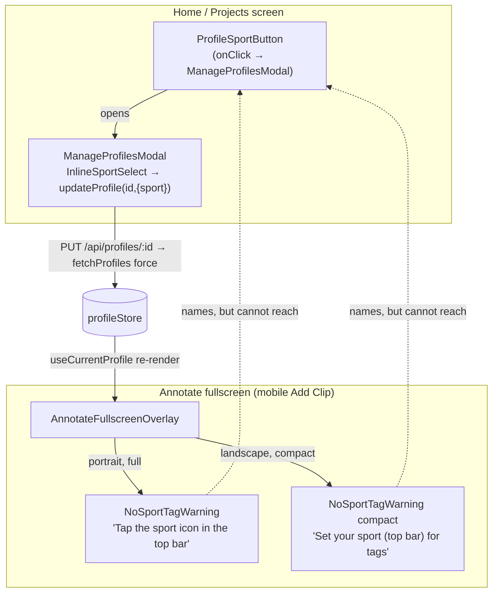

# T7922 — Design: First mobile clip, no_sport Tags block is a dead-feeling prompt

**Status:** WAITING ON USER (design gate)
**Tier:** L (design-gated UX)
**Author:** Architect agent
**Task file:** `docs/plans/tasks/T7922-mobile-first-clip-no-sport-tag-friction.md`
**Knowledge:** `.claude/knowledge/annotate.md` § "No Sport" sentinel (T7850)

---

## TL;DR (the recommendation, up front)

**Recommend Direction A — make `NoSportTagWarning` actionable — implemented as a lightweight
inline sport picker, not a full modal.** Reuse the existing `InlineSportSelect` pill (extracted
from `ManageProfilesModal` into `shared/`) wired to the existing `updateProfile(id, { sport })`
gesture path, with one additive change to that path: an **optimistic local patch** of the
profile's `sport` so tags swap in immediately instead of after a PUT+refetch round-trip.

This **reverses** T7850's "instructional-only, no new nav plumbing" decision, and the reversal is
justified by a **defect T7850 did not foresee**: the header sport control the warning tells the
user to tap (`ProfileSportButton`) is **not mounted on the annotate fullscreen surface** — it lives
only on the home/projects screen header. On mobile portrait Add Clip, the warning points at a
control that is off-screen. The instruction is not merely passive; it is a dead end.

The **compact landscape variant participates** (it names the same off-screen control and is equally
dead), but its treatment is constrained by the scrub-bar space budget — see § Compact variant.

Full rationale, alternatives, risks, and the T7850 reversal argument follow. **This is a STOP gate;
see § Open Questions for Approval.**

---

## 1. Current State Analysis

### 1.1 Architecture (today)



The dashed edges are the defect: the warning **names** a control (`ProfileSportButton`) that is
only reachable on a **different screen**. On the annotate fullscreen surface there is no path from
the warning to the picker.

### 1.2 The three-way tag branch (T7850), identical at all four call sites

```pseudo
tagSet = getTagSet(sport)          // sport = currentProfile?.sport || NO_SPORT
if tagSet:                         // known sport → real tags
    <TagSelector .../>
elif sport === NO_SPORT:           // sentinel → amber prompt
    <NoSportTagWarning [compact] />
else:                              // custom / "Other" sport → silent (deliberate)
    null
```

Call sites (all subscribe to `useCurrentProfile()` → re-render in place when sport changes):

| # | File:line | Variant | Surface |
|---|-----------|---------|---------|
| 1 | `UploadClipModal.jsx:196` | full | Desktop/tablet upload-time clip modal |
| 2 | `ClipDetailsEditor.jsx:250` | full | Clip details editor (edit existing clip) |
| 3 | `AnnotateFullscreenOverlay.jsx:370` | full | **Mobile portrait Add Clip (T7922 primary surface)** + desktop dock (layout="overlay") |
| 4 | `AnnotateFullscreenOverlay.jsx:528` | compact | Mobile landscape horizontal scrub bar (tight space) |

### 1.3 Code smells / defects identified

| Smell / defect | Location | Impact |
|----------------|----------|--------|
| **Dead-end instruction (CRITICAL)** | `NoSportTagWarning` full + compact | Names `ProfileSportButton`, which is NOT mounted on the annotate surface. Mobile user is told to tap an off-screen control. Root cause of the "open form, save nothing, leave" pattern. |
| Prose duplicated across two variants | `NoSportTagWarning.jsx` | Both variants hardcode the "top bar" instruction; if the fix changes the affordance, both must change. |
| No optimistic update on sport change | `profileStore.updateProfile` | Unlike `setIntroFact`/`setIntroConsent`/`uploadIntroImage` (which patch local state), `updateProfile` only refetches — so a sport change has a visible PUT+refetch delay before tags appear. |
| Reusable picker trapped as module-private | `InlineSportSelect` in `ManageProfilesModal.jsx:46` | The exact "change sport" affordance we need already exists but can't be reused where it's needed. |

### 1.4 Current behavior (pseudo)

```pseudo
mobile no_sport user opens Add Clip (portrait):
    scrubs range, sets rating          // works
    reaches Tags section:
        sees amber "Tap the sport icon in the top bar"
        → looks at top bar of THIS screen: no sport icon exists here   // dead end
        → (best case) backs all the way out to Home, opens profiles modal,
          sets sport, re-navigates into Annotate, re-scrubs the clip     // detour, loses in-progress clip
        → (observed case) saves nothing, leaves
```

---

## 2. Target Architecture (Direction A, lightweight inline picker)

### 2.1 Principle: bring the picker to the user, not the user to the picker

The set-sport gesture already exists and is already compliant (`InlineSportSelect.onChange →
updateProfile(id,{sport}) → PUT → refetch`). The only thing missing is **a mounting of that gesture
on the annotate surface**. We do not build new persistence, new endpoints, or new state — we
**relocate an existing affordance** to where the instruction currently points to nothing.

### 2.2 Target diagram

```mermaid
flowchart TD
    subgraph Annotate["Annotate fullscreen (mobile Add Clip)"]
      OVR["AnnotateFullscreenOverlay\n(local useState: range, rating, name, notes, layer)"]
      OVR -->|portrait, full| NEW1["NoSportTagPicker (full)\nlabel + InlineSportSelect pill"]
      OVR -->|landscape, compact| NEW2["NoSportTagPicker (compact)\ntappable pill"]
    end

    NEW1 -->|onChange sport| UP["updateProfile(id,{sport})"]
    NEW2 -->|onChange sport| UP
    UP -->|1: optimistic set(profiles[i].sport)| STORE[(profileStore)]
    UP -->|2: PUT /api/profiles/:id → fetchProfiles force| API[(backend)]
    STORE -->|useCurrentProfile re-render IN PLACE| OVR
    OVR -->|getTagSet(newSport) now non-null| TS["TagSelector swaps in\nlocal clip state survives"]
```

### 2.3 Target behavior (pseudo)

```pseudo
mobile no_sport user opens Add Clip (portrait):
    scrubs range, sets rating          // unchanged
    reaches Tags section:
        sees "Pick your sport to tag this clip" + a sport pill (native OS picker on mobile)
        taps pill → selects e.g. "Soccer"
            → updateProfile optimistically patches profiles[i].sport = 'soccer'
            → useCurrentProfile re-renders overlay IN PLACE (no unmount)
            → getTagSet('soccer') now non-null → TagSelector replaces the picker
            → range / rating / name / notes / layer (local useState) all survive
        taps a tag, taps Save                                  // first clip tagged, no detour
```

### 2.4 Design principles applied

- [x] **DRY** — extract the existing `InlineSportSelect` to `shared/`; reuse it in the warning
      component and leave `ManageProfilesModal` importing it. No new picker built.
- [x] **Single code path for set-sport** — the picker reuses `updateProfile(id,{sport})`, the
      SAME path `ManageProfilesModal` uses. No parallel sport-write path.
- [x] **No new branches** — the three-way tag branch is unchanged in shape; only the `NO_SPORT`
      arm's rendered component gains interactivity. The `custom → null` arm stays silent.
- [x] **Gesture-based persistence** — the write traces to a named gesture (sport pick). The
      optimistic local patch is a memory reflection of a persisted change (same pattern as
      `setIntroFact`), not reactive persistence.
- [x] **MVC / data-always-ready** — the picker is presentational; it calls a store action passed
      via the existing store hook. The overlay (container) owns the branch decision.

---

## 3. Refactoring Plan

### 3.1 Before the task (mechanical, reviewable-in-isolation)

| Change | Reason | Commit |
|--------|--------|--------|
| Extract `InlineSportSelect` from `ManageProfilesModal.jsx` to `src/frontend/src/components/shared/InlineSportSelect.jsx`; update `ManageProfilesModal` to import it | It is the exact affordance the warning needs; second consumer justifies extraction of EXISTING code (not new indirection) | Mechanical move, no behavior change |
| Add optimistic local patch to `profileStore.updateProfile` — on success (before/independent of refetch) `set(state => patch profiles[i] with updates)` mirroring `setIntroFact` | Makes the tag swap feel instant instead of PUT+refetch-delayed; aligns `updateProfile` with the store's other surgical updaters | Small store change; covered by store test |

### 3.2 The task itself

| File | Change |
|------|--------|
| `src/frontend/src/components/shared/NoSportTagWarning.jsx` | Rename to `NoSportTagPicker.jsx` (behavior-named). Full variant: replace the "top bar" prose with a short prompt (`Pick your sport to tag this clip`) + `<InlineSportSelect sport={NO_SPORT} onChange={...} onPickOther={...} />`. Compact variant: render the pill inline (see § Compact). Add props `onChange(sport)` and `onPickOther()`. Keep amber styling as the "action recommended" affordance. |
| `AnnotateFullscreenOverlay.jsx:367-372` (full) | Pass `onChange`/`onPickOther` into the picker. `onChange` = `(sport) => updateProfile(currentProfileId, { sport })`. `onPickOther` = open `ManageProfilesModal` (the ONE case that still needs the full modal — free-text custom sport). |
| `AnnotateFullscreenOverlay.jsx:527-529` (compact) | Same wiring, compact variant (subject to scope decision — see Open Questions). |
| `UploadClipModal.jsx:196` (full) | Same wiring. Desktop surface; low risk. Included for consistency (one component, one behavior). |
| `ClipDetailsEditor.jsx:250` (full) | Same wiring. |
| `profileStore.updateProfile` | Optimistic patch (from 3.1). |

**Note on `onPickOther`:** the inline picker handles No Sport + all supported sports directly.
Only the "Other…" (free-text custom sport) branch still needs a text field, which only the full
`ManageProfilesModal`/`ProfileForm` provides. `onPickOther` opens that modal — the ONE remaining
place we keep the modal path, for the one input the inline pill genuinely can't host.

### 3.3 Pseudo diff (illustrative, NOT source)

```pseudo
// shared/InlineSportSelect.jsx  (MOVED verbatim from ManageProfilesModal)
export function InlineSportSelect({ sport, onChange, onPickOther }) { /* unchanged body */ }

// shared/NoSportTagPicker.jsx  (was NoSportTagWarning)
+ import { InlineSportSelect } from './InlineSportSelect'
+ import { NO_SPORT } from '.../tagRegistry'
  export function NoSportTagPicker({ compact = false, onChange, onPickOther }) {
      if (compact) return <InlineSportSelect sport={NO_SPORT} onChange={onChange} onPickOther={onPickOther} />  // see §Compact
      return (
        <div className="amber prompt box">
          <p>Pick your sport to tag this clip</p>
-         <p>Tap the sport icon in the top bar to pick your sport.</p>
+         <InlineSportSelect sport={NO_SPORT} onChange={onChange} onPickOther={onPickOther} />
        </div>
      )
  }

// AnnotateFullscreenOverlay.jsx  (both call sites)
- <NoSportTagWarning [compact] />
+ <NoSportTagPicker [compact]
+     onChange={(sport) => updateProfile(currentProfileId, { sport })}
+     onPickOther={() => setShowManageModal(true)} />

// profileStore.updateProfile  (optimistic patch, mirrors setIntroFact)
  const response = await apiFetch(... PUT ...)
  if (!response.ok) throw ...
+ set(state => ({ profiles: state.profiles.map(p => p.id === profileId ? { ...p, ...updates } : p) }))
  await get().fetchProfiles({ force: true })   // still reconciles with server truth
```

---

## 4. Design Decisions

| Decision | Options considered | Choice | Rationale |
|----------|-------------------|--------|-----------|
| Reach a tag set from the form | A actionable warning / B onboarding prompt / C rating-only nudge | **A** | Directly fixes the dead-end at the exact moment of friction; smallest, most surgical change; reuses existing gesture path. B and C do not remove the dead end for the existing no_sport cohort. |
| Picker surface | Full `ManageProfilesModal` over annotate / lightweight inline `InlineSportSelect` | **Lightweight inline** | Keeps the user in the form (the whole point). The modal is a screen change — a softer detour, but still a detour, and its 320px reachability is unaudited. Modal kept only for the "Other…" free-text branch. |
| Set-sport call path | New surgical endpoint / reuse `updateProfile` | **Reuse `updateProfile`** | Single write path (Coding Standards: one write path per datum). Already gesture-based and compliant. |
| Make the swap feel instant | Rely on PUT+refetch / add optimistic local patch | **Optimistic patch** | Matches the store's existing pattern (`setIntroFact` et al.); avoids a visible "picked sport, tags appear a beat later" jank. `fetchProfiles({force:true})` still reconciles. |
| Component name | Keep `NoSportTagWarning` / rename `NoSportTagPicker` | **Rename** | It is no longer a warning; name by behavior (Coding Standards: naming). Rename is mechanical (4 import sites + 1 test). |
| Extract `InlineSportSelect` | Duplicate it / extract to shared | **Extract** | It is EXISTING code gaining a 2nd consumer — extraction, not premature abstraction. Greppable, one definition. |

---

## 5. Revisiting T7850's instructional-only decision (MANDATORY)

**Verdict: REVERSE it, for the `NO_SPORT` arm on the annotate surface.**

T7850 chose "instructional-only, names the header path rather than adding new navigation plumbing."
That choice was reasonable **under an assumption that turned out to be false on mobile**: that the
"header path" it names is present and reachable from wherever the warning renders.

The CRITICAL DEFECT is the core evidence: `ProfileSportButton` — the "sport icon in the top bar" the
warning literally instructs the user to tap — is mounted only at `ProjectManager.jsx:983`, the
home/projects screen header. It is **not mounted on the annotate fullscreen surface** (portrait Add
Clip or landscape scrub bar). So on the exact surface T7922 is about, the instruction points at a
control that does not exist on screen. "Instructional-only" degenerates into "dead-end-only."

T7850's underlying goal — *don't add nav plumbing / don't bury sport in a detour* — is not
abandoned; it is **better served** by A. A adds **no navigation** at all: it does not send the user
anywhere. It mounts the already-existing set-sport gesture in place. The "plumbing" A adds is a prop
(`onChange`) into a component that already exists, wired to a store action that already exists. That
is strictly less plumbing than the cross-screen journey T7850's instruction implies.

What we **uphold** from T7850, unchanged:
- The **custom/"Other" sport arm stays silent** (`null`). A deliberate no-registry choice is not a
  problem to solve; the picker only replaces the `NO_SPORT` arm.
- The `NO_SPORT` arm is still visually the amber "action recommended" treatment (not a neutral
  empty state) — we keep the affordance's meaning, we just make it act.
- No change to the sentinel, `SUPPORTED_SPORTS`, `getTagSet`, or the three-way branch shape.

---

## 6. Risks

| Risk | Mitigation |
|------|------------|
| **320px reachability** — the pill + native `<select>` must be tappable at 320px | `InlineSportSelect` already uses a native `<select>` overlay (OS picker on mobile) sized to fill its pill — inherently mobile-friendly. Verify with 320px + 375px component/e2e evidence (acceptance criterion 1). |
| **T7850 reversal is a product-visible change** to a deliberate decision | Reversal argued in § 5 on the concrete defect; surfaced explicitly in Open Questions for founder sign-off. |
| **Compact-bar space budget** — the landscape scrub bar is height/width-starved; a pill may not fit alongside rating + Save | The compact variant is flagged as a **scope decision** (Open Questions). Fallback if it doesn't fit: keep compact as a short tappable prompt that opens the picker (still fixes the dead end) rather than an inline pill. Portrait (the primary T7922 surface) is unaffected. |
| **Async swap UX** — even optimistic, `fetchProfiles({force:true})` runs after | Optimistic patch makes the tag swap immediate; refetch reconciles silently. If the PUT fails, `updateProfile` throws and the store `error` is set; the optimistic patch would need a rollback on failure (mirror the pattern — patch, then on catch revert). Call out rollback in implementation. |
| **Custom-sport branch must stay silent** — regression risk if the branch is touched | The branch shape is unchanged; only the `NO_SPORT` arm's component changes. Existing `UploadClipModal.noSport.test.jsx` covers all 3 branches — extend it to assert the custom arm still renders nothing. |
| **In-progress clip must survive the re-render** — the entire value prop | Verified by audit: overlay clip fields are local `useState`; `useCurrentProfile()` triggers re-render, not remount. Add an explicit e2e assertion: scrub a range, pick sport, confirm range/rating persist and tags appear. |
| **`onPickOther` opens a modal over the annotate surface** — z-index / reachability | Only reached for the "Other…" free-text edge case (rare on first clip). `ManageProfilesModal` uses the shared `Z` layer constants; verify it renders above the fullscreen overlay. |
| **Scope creep** — 4 call sites, rename, extraction, store change | Bounded: extraction + rename are mechanical; the store change is ~3 lines mirroring an existing pattern; the behavior change is one component. Keep the mechanical moves as separate commits (Refactoring Rule 3). |

---

## 7. Test Plan (both acceptance criteria → evidence)

**AC1: a first-time mobile no_sport user can reach a tag set from Add Clip without a dead-feeling
detour, verified on a mobile viewport with evidence.**

| Evidence | Type | Detail |
|----------|------|--------|
| `NoSportTagPicker` renders the inline picker (full) and calls `onChange`/`onPickOther` | Component (Vitest) | New test file `NoSportTagPicker.test.jsx`; assert pill present, `onChange('soccer')` fires. |
| Portrait Add Clip: pick sport → TagSelector swaps in, in-progress range/rating survive | e2e (Playwright) | Extend/mirror `T7920-mobile-clip-save-audit.qa.spec.js` at 320x568 + 375x667: scrub range, pick sport via the inline picker, assert tags appear AND range/rating persisted, then Save round-trips to a `raw_clips` row. Screenshots at both viewports (replace the criterion-3 warning shots). |
| Store optimistic patch: `updateProfile` mutates local `profiles[i].sport` before refetch resolves | Unit (Vitest) | New assertion in a `profileStore` test. |

**AC2: T7850's "instructional-only, no new nav plumbing" decision is explicitly revisited or upheld
in the design doc.**

| Evidence | Type | Detail |
|----------|------|--------|
| § 5 of this doc | Design doc | States REVERSE + rationale (the CRITICAL DEFECT). Satisfied on approval. |

**Regression guard (three-way branch integrity):**

| Evidence | Type | Detail |
|----------|------|--------|
| Known sport → TagSelector; NO_SPORT → picker; custom → silent (null) | Component | Extend `UploadClipModal.noSport.test.jsx` (the existing 3-branch test) to assert the custom arm renders nothing after the change. Add the same for the overlay (no overlay no_sport component test exists today — add one). |

**Mandatory live-drive QA (per task rules):** real mobile-viewport pass (dev/staging) on portrait
320px + 375px: new no_sport profile → Annotate → Add Clip → pick sport inline → tag → Save; confirm
no detour, in-progress clip survives, clip persists. Landscape pass gated on the compact-scope
decision. Capture screenshots to `qa/`.

**Test scope (curated, ~relevant set):** `NoSportTagPicker.test.jsx` (new),
`UploadClipModal.noSport.test.jsx` (extended), overlay no_sport component test (new),
`profileStore` optimistic-patch test (new/extended), `T7920-mobile-clip-save-audit.qa.spec.js`
(extended). Not the full suite — Branch CI is the full-sweep verdict.

---

## 8. Alternatives considered (B and C) — why not

- **B (prompt for sport earlier / onboarding):** does not remove the dead end for the **existing**
  no_sport cohort (T7850 made ALL new profiles no_sport; many already exist), and it couples this
  fix to T7640 Tutorial Redesign timing. Worth doing as a complement, not as the fix. It also
  doesn't help a user who skips onboarding. **Overlaps T7640 — do not hard-block on it.**
- **C (rating-only save + non-blocking nudge):** the form **already** saves fine without a tag
  (verified in T7920), so C changes only framing, not capability — it leaves the user unable to tag
  their first clip without the same off-screen detour. It reframes the dead end rather than removing
  it. A does what C wants (non-blocking, save still works) AND lets the user actually tag.

A can incorporate C's spirit for free: the picker is non-blocking (Save works whether or not a sport
is picked), so a user who wants a rating-only clip is unaffected.

---

## Open Questions for Approval

This is a STOP gate. Please confirm the following before implementation begins:

1. **Direction:** Approve **Direction A (actionable inline sport picker)** as recommended? (vs. B
   onboarding-first or C rating-only reframe.)
2. **Picker weight:** Approve the **lightweight inline `InlineSportSelect` pill** (reusing the
   existing native-select affordance) rather than opening the full `ManageProfilesModal` over the
   annotate surface? (The full modal is kept only for the "Other…" free-text custom-sport branch via
   `onPickOther`.)
3. **T7850 reversal:** Approve **reversing** T7850's "instructional-only, no new nav plumbing"
   decision for the `NO_SPORT` arm on the annotate surface, on the basis that the named header
   control is not mounted there (§ 5)?
4. **Compact landscape variant scope:** Should the **compact landscape scrub-bar variant** get the
   inline pill in this task, or ship portrait-first and treat landscape as a fast-follow if the
   pill doesn't fit the space budget (fallback: a short tappable prompt that opens the picker)?
5. **T7640 coordination:** Ship A standalone now (recommended), or coordinate the copy/onboarding
   framing with the **T7640 Tutorial Redesign** real-device pass? (Recommendation: ship A now, do
   not hard-block.)
6. **Optimistic-patch + rollback:** Approve adding the **optimistic local `sport` patch** to
   `profileStore.updateProfile` (with rollback on PUT failure), aligning it with the store's other
   surgical updaters, so the tag swap feels instant?
