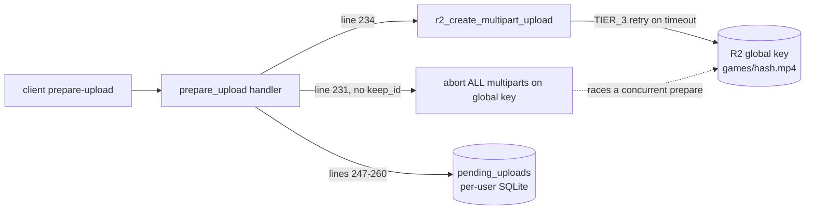
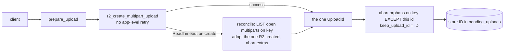

# T7950 — Design: fix the double-UploadId multipart leak

**Status:** WAITING ON USER (design gate)
**Tier:** M (backend-only; ~2 files touched + 1 test file; no schema change)
**Layers:** Backend (FastAPI) + Cloudflare R2
**Knowledge docs:** persistence-sync.md, backend-services.md

> Root cause is CONFIRMED (expert). This doc designs the fix and stops for approval before implementation.

---

## 1. Current State Analysis

### Confirmed mechanism (two compounding defects)

The leak is on the **global, env-prefix-free** R2 key `games/{blake3_hash}.mp4` (the sole cross-profile namespace — persistence-sync.md, storage.py:30). Prod sweep found it 2/2 (T7880): the UploadId stored in `pending_uploads` is dead, a *different* UploadId is open on the same key.

**H1 — a non-idempotent create is retried at the app level.**
`r2_create_multipart_upload` (storage.py:2258-2285) wraps boto3's `create_multipart_upload` in `retry_r2_call(..., **TIER_3)`. TIER_3 = 2 attempts (retry.py:32). The client is configured `read_timeout=30`, boto3 `retries={"max_attempts": 0}` (storage.py:249-250). `CreateMultipartUpload` is **not idempotent** — each call R2 receives mints a new UploadId.

```
attempt 1: CreateMultipartUpload  ── executes at R2, mints UploadId #1 (LIVE)
           …ack takes > 30s on a slow/large upload…
           → ReadTimeoutError  (classified transient, retry.py:38/53)
attempt 2: CreateMultipartUpload  ── executes at R2, mints UploadId #2
           → returns UploadId #2
handler stores ONLY #2. #1 is live and unknown to the server.   ← stranded orphan
```

**H3 — an un-scoped abort under a lock that does not cover the global key.**
`prepare_upload` fresh-create path (games_upload.py:106-285):
- line 231 `r2_abort_orphan_multipart_uploads(r2_key)` — **no `keep_upload_id`** → aborts ALL open multiparts on the global key.
- line 234 creates a fresh multipart; lines 247-260 store its id into `pending_uploads` (per-user-per-profile SQLite).

The per-user write lock (`_USER_WRITE_LOCKS`, db_sync.py) is keyed per `user_id` and **in-process** (backend-services.md § Request concurrency model). It does NOT serialize a *different user* preparing the *same* video (the dedup key is global) nor a later fresh gesture. So a second `prepare` for the same hash can run its line-231 abort and kill the id a first `prepare` already stored / just pointed the client at.

**`prepare-upload` is not idempotent under retry today.** Either defect alone produces stored-dead / other-open.

### Architecture (today)



### Code smells

| Smell | Location | Impact |
|---|---|---|
| Retry wrapping a non-idempotent op | storage.py:2275-2279 | Every retried create leaks a live multipart (H1) |
| Un-scoped destructive op on a shared key | games_upload.py:231 | Cross-user/cross-gesture abort races (H3) |
| Guard exists but is not used | `r2_abort_orphan_multipart_uploads(key, keep_upload_id=None)` (storage.py:2573) already accepts `keep_upload_id`; the T7480 call site passes nothing | The scoping mechanism is already built and simply not wired |

---

## 2. Target Architecture

### Invariants the fix must guarantee (from expert)

1. `prepare-upload` NEVER leaves a live multipart whose UploadId is not the one written to `pending_uploads`.
2. The abort→create→store sequence is safe against the **global** key, not just the per-user DB.
3. Any idempotency/reconciliation is anchored at **global blake3_hash** scope (the R2 key is global; a per-(user,hash) key still races cross-user on the same video).

### Design principle

**Never leave R2 in a state where an unnamed live multipart exists on the key** — because if create can't strand an unnamed multipart, H3's un-scoped abort has nothing extra to strand, and the cross-user race collapses to "abort orphans, then create the one we'll store."

### Target diagram (recommended: B1-primary)



Post-condition on return: exactly one live multipart on the key, and it is the one in `pending_uploads`.

---

## 3. The design decision (this is the gate)

### Option A — global lock / idempotency keyed on blake3_hash

Serialize concurrent prepares for the same hash so they reuse one multipart instead of racing create+abort.

- **In-process global-key lock** (`Lock` per `blake3_hash`, analogous to `_USER_WRITE_LOCKS` but keyed on the hash). Simple, no I/O.
  - **Multi-machine caveat (decisive):** Fly runs **more than one machine**. The per-user write lock and version caches are machine-global ONLY because there is a single uvicorn process *per machine* (backend-services.md § Request concurrency model). An in-process hash lock is **per-machine** — two machines preparing the same global hash still race. This is exactly the cross-machine surface H3 lives on (a *different user*, plausibly routed to a different machine). So an in-process lock does not fully close invariant 2/3.
  - True correctness needs a **cross-machine** lock: a Postgres advisory lock on `hashtext(blake3_hash)`, or an R2/PG idempotency record. That is real new shared state, new failure modes (lock held by a dead machine, TTL), and new schema — L-tier surface for an M-tier bug.
- Even with the lock, **H1 is unaddressed**: a single prepare whose create times out and retries still mints two multiparts *within one lock holder*. So Option A must ALSO fix the create. The lock is additive, not a substitute.

### Option B — reconcile-after-create + scoped abort

- **B1 — stop retrying the non-idempotent create; on timeout, list-and-adopt.** A lost ack on a non-idempotent create is unrecoverable-by-blind-retry. Replace the `retry_r2_call` wrap in `r2_create_multipart_upload` with a single attempt; on `ReadTimeoutError` (or any create failure suspected of having executed), `r2_list_multipart_uploads(key)` (storage.py:2481, already exists) and **adopt** the newest open multipart R2 actually created, aborting any extras. Returns exactly one UploadId, guaranteed live and named. This closes H1 at the source: create can no longer leave an unnamed live multipart.
- **B2 — scope the abort.** Pass `keep_upload_id=<the id we will store>` to `r2_abort_orphan_multipart_uploads` — **the parameter already exists** (storage.py:2573, T7480) and is simply not passed at games_upload.py:231. Reorder so the abort runs AFTER we hold the id we're about to store, sparing it. A concurrent prepare can still abort *this* prepare's id in the narrow window before it's stored — but if B1 holds (create never strands an unnamed multipart), the only ids on the key are named ones, and the abort-except-mine keeps the invariant "one live == stored" per prepare.

**Tradeoff of B1:** dropping the create retry reduces resilience to a *genuinely transient* create failure (e.g. a real 503 where the request never reached R2). Mitigation: the list-and-adopt path handles the ambiguous "did it execute?" case directly — if the list shows a fresh multipart, adopt it; if the list is empty, the create genuinely didn't land and we surface a clean 500 (client re-issues prepare, same as today's `if not upload_id`). A create that never executed leaves nothing to adopt, so we lose one blind retry but gain correctness; a create that DID execute is now recovered instead of duplicated. Net resilience is **higher**, not lower.

### Hybrid consideration

B1 alone arguably closes BOTH H1 and H3: if `r2_create_multipart_upload` never returns while an unnamed live multipart exists on the key, then the only multiparts H3's abort can encounter are (a) genuine stale orphans from prior sessions — correct to abort — and (b) the id this prepare is about to store — spared by B2. B2 is cheap (one already-existing parameter, one reorder) and makes the "one live == stored" post-condition explicit rather than emergent, so ship B1 + B2 together.

---

## 4. RECOMMENDATION

**Ship Option B: B1 (kill the create retry + list-and-adopt on timeout) as the primary fix, plus B2 (scoped abort via the existing `keep_upload_id`). Do NOT add a global lock (Option A) now.**

Justification:
- **B1 fixes the root cause at the source** (H1). H1 is the generative defect — it is the only thing that mints a *second* multipart for one prepare. Kill it and the "double" cannot originate.
- **B2 is nearly free** and makes invariant 1 structural: the abort already has a `keep_upload_id` parameter built by T7480; wiring it + reordering is a few lines.
- **Option A's in-process lock is a false sense of safety** given Fly's multi-machine reality (backend-services.md) — it would not cover the cross-machine race it's meant to, while adding real complexity. A *correct* cross-machine lock (PG advisory / idempotency table) is L-tier scope disproportionate to this bug, and is unnecessary once create is idempotent-under-timeout: with B1, two concurrent/cross-machine prepares each converge to "adopt the live multipart, keep mine, abort extras" — the outcome is at most a brief extra orphan that the very next prepare's scoped abort (or the T7880/T7490 reaper) collects, never a stored-dead row.
- **Keep the T7480 abort-orphans path** — it is the mechanism B2 refines, not something to remove. It legitimately reclaims stale orphans from expired/abandoned sessions.

Residual (documented, acceptable): a genuinely simultaneous cross-machine pair could each briefly create-then-adopt and leave one extra orphan multipart on the global key for the window until the next prepare/reaper. This is a *transient orphan* (storage cost, swept by T7880/T7490), NOT a stored-dead/other-open corruption — which is the exact class this task must eliminate. Closing even that residual is the Option-A cross-machine-lock follow-up, filed only if a sweep shows it recurring.

---

## 5. Implementation Plan

### Files

| File | Change |
|---|---|
| `src/backend/app/storage.py` | `r2_create_multipart_upload`: drop the `retry_r2_call`/`TIER_3` wrap; single `create_multipart_upload`; on timeout/failure, `r2_list_multipart_uploads(key)` and adopt the live multipart (abort any extras), else return `None`. Return the adopted/created id. |
| `src/backend/app/routers/games_upload.py` | Reorder the fresh-create path (lines 231-260): create first → hold `upload_id` → `r2_abort_orphan_multipart_uploads(r2_key, keep_upload_id=upload_id)` → store. So the abort can never strand the id about to be written. |
| `src/backend/app/tests/test_t7950_*.py` (new) | Regression tests reproducing BOTH prod occurrences (below). |

### Pseudocode

```pseudo
# storage.py — r2_create_multipart_upload (B1)
def r2_create_multipart_upload(key, content_type):
    client = get_r2_client(); if not client: return None
    try:
        resp = client.create_multipart_upload(Bucket, Key=key, ...)   # NO retry_r2_call
        return resp['UploadId']
    except <timeout / connection error suspected-executed>:
        # a lost ack on a non-idempotent create is unrecoverable-by-retry:
        # list what R2 ACTUALLY created and adopt, don't blind-retry
        open_uploads = r2_list_multipart_uploads(key)
        if not open_uploads:
            log.error("create timed out and no multipart materialized"); return None
        adopted = newest(open_uploads)                # by Initiated
        for u in open_uploads:                         # abort duplicates from prior attempts
            if u.UploadId != adopted.UploadId: r2_abort_multipart_upload(key, u.UploadId)
        log.warning("create ack lost; adopted live multipart %s", adopted.UploadId)
        return adopted.UploadId
    except <non-transient>:
        return None
```

```pseudo
# games_upload.py — fresh-create path (B2), reordered
upload_id = r2_create_multipart_upload(r2_key)       # now returns ONE guaranteed-live id
if not upload_id: raise 500
r2_abort_orphan_multipart_uploads(r2_key, keep_upload_id=upload_id)   # spare the id we store
session_id = f"upload_{uuid4}"
store (session_id, blake3_hash, ..., upload_id) into pending_uploads
```

### Regression tests (must fail on today's code, pass after)

1. **H1 — read-timeout-then-success create.** Fake R2 where the first `create_multipart_upload` mints a multipart then raises `ReadTimeoutError`; a subsequent `list_multipart_uploads` returns that live multipart. Assert `r2_create_multipart_upload` returns the SAME id that is live on the key and that **exactly one** multipart remains open (no second minted, or the second aborted). On today's code the TIER_3 retry mints a second id and returns it → two open → test RED.
2. **H3 — concurrent / second prepare abort race.** Two `prepare_upload` invocations for the same `blake3_hash` (global key). After both settle, assert the id stored in `pending_uploads` is the one live on the key, and no live multipart exists whose id is not stored. On today's unscoped-abort code the second prepare's line-231 abort kills the first's stored id → stored-dead → test RED.
3. **Post-condition invariant.** After a normal fresh `prepare_upload`, exactly one live multipart on `games/{hash}.mp4` and it equals `pending_uploads.r2_upload_id`.

Test seam: extend the existing `FakeR2` used by upload tests with `create_multipart_upload` / `list_multipart_uploads` / `abort_multipart_upload` behaviors (mirrors the T7880/T7490 multipart fakes). Import check after edit: `cd src/backend && .venv/Scripts/python.exe -c "from app.main import app"`.

---

## 6. Risks & Tradeoffs

| Risk | Assessment / Mitigation |
|---|---|
| Dropping create retry weakens resilience to a *genuinely transient* create failure | list-and-adopt recovers the executed-but-unacked case (the common one on slow uplinks); the never-executed case returns 500 and the client re-prepares exactly as today. Net resilience up. |
| B2 window: a concurrent prepare aborts our id before we store | With B1 there are no unnamed live multiparts; abort-except-mine keeps "one live == stored" per prepare. Residual = a transient extra orphan cross-machine, swept by T7880/T7490 — never stored-dead. |
| Multi-machine race not fully closed | Documented residual (§4). In-process lock would NOT close it (per-machine); a correct PG-advisory/idempotency lock is a disproportionate L-tier follow-up, filed only if sweeps show recurrence. |
| Removing T7480 abort path | NOT removed — B2 refines it (passes `keep_upload_id`). It still reclaims genuine stale orphans. |
| `list_multipart_uploads` itself times out on the adopt path | It uses TIER_3 retry (idempotent LIST — safe to retry, unlike create). If it returns empty on a transient failure we return `None` (clean 500), never a fabricated id. |

---

## 7. Open Questions — RESOLVED (founder approval 2026-08-28)

Design gate **APPROVED**: ship Option B (B1 kill create-retry + list-and-adopt on timeout; B2 scoped abort via `keep_upload_id`) over Option A.

- [x] **Adopt "newest by Initiated" vs "abort all + one clean create"?** → **APPROVED: adopt the newest live multipart by `Initiated` timestamp.** `r2_list_multipart_uploads` already returns `Initiated` (storage.py:2512). The adopt helper picks `max(uploads, key=Initiated)` and aborts the rest.
- [x] **What exception surface triggers list-and-adopt?** → **RESOLVED: do NOT use a blanket any-exception catch.** Reuse retry.py's existing `is_transient_error(exc)` classification (do not invent a new one):
  - **Transient / ack-may-be-lost** (`ReadTimeoutError`, `ConnectTimeoutError`, `EndpointConnectionError`, `ConnectionClosedError`, `BotoCoreError`, HTTP 429/500/502/503, connection errors) → the request MAY have reached R2 and minted a multipart whose ack we lost → run **list-and-adopt** (safe: a no-op returning `None` if nothing materialized).
  - **Non-transient / definitive rejection** (`ClientError` 403/404, `AccessDenied`, `NoSuchKey`, validation 4xx) → the request was rejected BEFORE anything was created → **fail immediately, return `None`, do NOT call `list_multipart_uploads`** (nothing could exist to adopt). This is documented as a short classification table/comment in storage.py next to `r2_create_multipart_upload`. boto3's `create_multipart_upload` raises `botocore.exceptions.ClientError` for R2/S3 API errors (status in `.response["Error"]["Code"]`) and `botocore.exceptions.ReadTimeoutError`/`ConnectTimeoutError`/`EndpointConnectionError` for the ambiguous ack-loss cases — exactly the surface `is_transient_error` already splits.
- [x] **File the cross-machine-lock follow-up now (Option A) or only on recurrence?** → **APPROVED: do NOT file now; only on recurrence** if the next T7880 sweep still shows extras.
