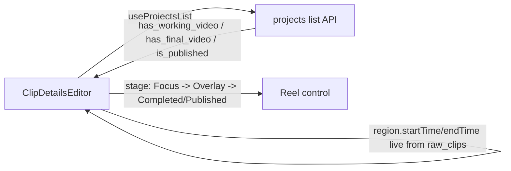
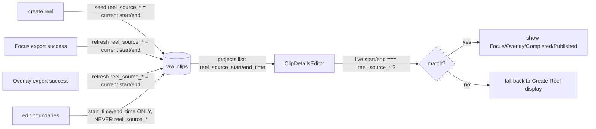

# T8070 — Design: Reel status goes stale when the clip's timestamps change

**Stage:** 4 (Implementation). **v3 (2026-09-01): FULLY APPROVED. Q1 backfill, Q2 multi-clip
data expansion, Q3/Q4 confirmed, Q5 resolved as OPTION A — ship the full per-clip data model +
backfill + all 5 write sites + annotate `ClipDetailsEditor` staleness (seed clip) in T8070 NOW;
the multi-clip VISUAL cue (Reel Drafts strip + Focus clip list, § 3h) is a SEPARATE follow-up
task (supervisor-filed, not implemented here). This doc is the implementation contract.**
**Tier:** L (schema change + backfill migration + 4 completion paths + 2 read surfaces + frontend).
**Depends on:** T8060 (stage-aware Reel control), T8040.

---

## Decision log (user, 2026-09-01)

- **Q1 (NULL policy) — REJECTED self-heal. Chosen: BACKFILL.** The v049 migration backfills
  `reel_source_start_time/end_time` for every existing raw_clip that has a linked reel with
  produced artifacts (`auto_project_id` set AND the linked project has a working_video or
  final_video), setting the snapshot to that raw_clip's OWN current `start_time/end_time` at
  migration time (best-available truth; no historical producing window exists, so
  current-state-at-migration becomes the initial frozen value — "migrations MAKE data correct,
  no runtime fallback"). After migration, `reel_source_*` is NULL **only** for raw_clips with
  NO linked reel (`auto_project_id IS NULL`), a legitimately different meaning already handled
  by the `hasReel` gate. **The self-heal / trust-produced-status runtime special-case is
  removed entirely.**
- **Q2 (multi-clip) — EXPANDED. Assert per-clip staleness for multi-clip reels too.** Surface
  a per-clip snapshot (not a single project-level pair). Investigation (see § 7. Q5) shows the
  data home is per-clip already (`raw_clips`), but the correct READ surface is
  `WorkingClipResponse` (via `working_clips.raw_clip_id`), NOT `ProjectListItem` — and the
  annotate `ClipDetailsEditor` surface cannot display multi-clip per-clip staleness at all
  (only the seed clip has a reel control there). This raised a new DISPLAY-surface question.
- **Q3 (column names) — CONFIRMED:** `reel_source_start_time` / `reel_source_end_time`.
- **Q4 (exact vs epsilon) — CONFIRMED:** exact float `===`, no epsilon.

---

## Acceptance criteria (from task) → how this design satisfies them

| Criterion | Mechanism |
|-----------|-----------|
| Reel control stops showing produced status when the clip's start/end changed after the reel was produced | New per-clip columns snapshot the *exact* window each export rendered from; the comparison is live `start/end` vs `reel_source_*`, falling back to "Create Reel" (annotate) / a stale marker (multi-clip, § 7. Q5) on mismatch |
| Reverting timestamps to EXACTLY the producing values restores the status | The snapshot columns are written ONLY at export-completion + seed, never on boundary edits — so the comparison is a **pure value equality**, and reverting the live boundaries makes them equal again automatically (a version counter could not do this — see Current State) |
| Schema tracks reality (incl. existing reels) | Columns refreshed at every export-completion write site (Focus ×2, Overlay ×2), seeded at reel-creation, and **BACKFILLED for existing produced reels** by v049 (Q1) so there is no unknown-snapshot cohort; `update_raw_clip`'s boundary path provably never touches them |
| Multi-clip reels report per-clip drift | `reel_source_*` lives on `raw_clips` (already per-clip); surfaced per-clip via `WorkingClipResponse` (`working_clips.raw_clip_id`), so every clip of a reel — including added clips and user-created multi-clip reels that carry NO `auto_project_id` — can be compared (§ 3f, § 7. Q5) |

---

## 1. Current State

### Architecture (today, post-T8060)



The Reel control renders the linked reel's furthest stage purely from
`linkedProject.{has_working_video, has_final_video, is_published}`
(`ClipDetailsEditor.jsx:360-382`). Nothing in that chain knows what footage
window the produced `working_video`/`final_video` was actually rendered from.

### Code smells / gap identified

| Issue | Location | Impact |
|-------|----------|--------|
| Produced stage shown regardless of current boundaries | `ClipDetailsEditor.jsx:353-356` (an explicit TODO comment already flags exactly this) | Reel control claims "Completed" for a reel built from a now-different clip |
| No stored snapshot of the producing window | `_create_auto_project_for_clip` copies only dims (`clips.py:1063` via `_insert_working_clip_with_dims`); clip `start_time/end_time` in `WorkingClipResponse` are **live-joined** from `raw_clips`, not stored | No data exists to answer "does the reel still reflect the current window" |
| `boundaries_version` cannot express "reverted" | `raw_clips.boundaries_version` (annotate.md T4340) is a **monotonic** counter — bumps on any change, never decrements | Requirement explicitly needs revert-to-exact to restore validity; a counter can detect "changed since" but not "changed back" |

**Why a value snapshot, not the existing counter (load-bearing):**
`boundaries_version`/`working_clips.raw_clip_version` already snapshot a
*version* at export (`framing.py:275`). But the requirement is that reverting
the boundaries to the *exact* producing values restores the reel reference.
A monotonic counter that only increments can never return to its producing
value once bumped, so it would leave a reverted clip permanently "stale."
The producing window must be recorded as an **actual value** and compared by
value. This is the whole reason the task was deferred from T8060 rather than
taking the counter shortcut.

---

## 2. Target State

### Two new nullable columns on `raw_clips` (profile_db, migration v049)

```sql
ALTER TABLE raw_clips ADD COLUMN reel_source_start_time REAL;
ALTER TABLE raw_clips ADD COLUMN reel_source_end_time   REAL;
```

- **Semantics:** the `start_time`/`end_time` the clip's CURRENTLY-linked reel's
  *most recent successful export* actually rendered from. "What the existing
  artifacts were built from."
- **Nullable / DEFAULT NULL** (no backfill): a NULL pair means "never snapshotted"
  — for pre-T8070 reels that already have artifacts. See Open Question Q1 for the
  chosen NULL-handling policy.
- **Track:** `raw_clips` lives on **profile_db** (DDL `database.py:1179-1201`).
  Migration head is **v048**, so this is **v049**. Fresh DDL at `database.py:1179`
  gains both columns too.
- **Names:** `reel_source_start_time` / `reel_source_end_time` — confirmed from the
  task's proposal. Rationale: greppable, self-documenting ("the source window the
  reel was built from"), parallel to the existing `start_time/end_time` and the
  `source_*` naming already used on final_videos/ClipSummary.

### Target flow



**Design principles applied:**
- [x] Single write-direction: `reel_source_*` is written ONLY by seed +
  export-completion; edits never touch it. One meaning, one set of writers.
- [x] Gesture-based persistence: every write traces to a gesture (Create Reel
  click → seed; Export click → refresh). No reactive/side-effect writes.
- [x] DRY: refresh is a single one-line UPDATE pattern; enumerate the sites
  rather than inventing a new abstraction for a 1-line write (abstract-on-3rd
  rule — see § Write-site strategy).
- [x] Correct data, not workarounds: the frontend does not delete `autoProjectId`
  on mismatch; the reel row is untouched. Staleness is a **display-level**
  derivation, computed on read.

---

## 3. Implementation Plan (per file, with exact write/read sites)

### 3a. Schema — profile_db

| File | Change |
|------|--------|
| `src/backend/app/migrations/profile_db/v049_raw_clips_reel_source_window.py` | NEW. `BaseMigration version=49`. Guarded `PRAGMA table_info(raw_clips)` (rows are TUPLES under the runner's factory — `row[1]` = name, per the v044 landmine); ADD each column only when absent; `DEFAULT NULL`. **THEN BACKFILL (Q1):** `UPDATE raw_clips SET reel_source_start_time = start_time, reel_source_end_time = end_time WHERE auto_project_id IS NOT NULL AND EXISTS (SELECT 1 FROM projects p WHERE p.id = raw_clips.auto_project_id AND (p.working_video_id IS NOT NULL OR p.final_video_id IS NOT NULL))`. Idempotent (re-running sets the same values). Log the row count. **Backfill scope note:** this reaches the SEED clip of every produced auto-draft (the only clips carrying `auto_project_id`). Multi-clip *added* clips and user-created reels carry no `auto_project_id`, so they are NOT backfilled here — see § 3a-note. Model structure verbatim on `v044_working_clips_framing_version.py`; use TUPLE row reads (runner row factory). |
| `src/backend/app/database.py:1179-1201` | Add `reel_source_start_time REAL` and `reel_source_end_time REAL` to the fresh `raw_clips` DDL (fresh deployments never run migrations). |

Both columns nullable; JIT seam runs v049 on first per-user access (T5083/T5085/T8190).

**§ 3a-note — backfill reachability for multi-clip / user-created reels.** The backfill above
keys on `auto_project_id`, which exists only on the single seed clip (investigation § 7. Q5).
For a MULTI-clip reel's *added* clips and for user-created reels, the producing window must be
backfilled via the `working_clips.raw_clip_id → project` join instead:
`UPDATE raw_clips SET reel_source_start_time = start_time, reel_source_end_time = end_time
WHERE id IN (SELECT wc.raw_clip_id FROM working_clips wc JOIN projects p ON p.id = wc.project_id
WHERE (p.working_video_id IS NOT NULL OR p.final_video_id IS NOT NULL))` — restricted to the
latest working_clips version (`latest_working_clips_subquery`, clips.py). This is a SUPERSET of
the `auto_project_id` backfill (it also covers the seed clip), so run ONLY this join-based
statement (the `auto_project_id` variant above is the conceptual illustration; the join form is
what ships). Same "current-state-at-migration = initial frozen value" truth (Q1) for every
produced clip regardless of how its reel was created.

### 3b. Write site — SEED at reel creation

| File | Change |
|------|--------|
| `src/backend/app/routers/clips.py:1025 `_create_auto_project_for_clip`` | Extend the existing SELECT at 1030-1032 to also read `start_time, end_time`. Then fold the two new columns into the **existing** `UPDATE raw_clips SET auto_project_id=? WHERE id=?` at 1066-1068 → `SET auto_project_id=?, reel_source_start_time=?, reel_source_end_time=? WHERE id=?`, column-guarded (see § 3e). One statement, no new query. Covers all 3 callers (1276, 1308, 1417) since they all go through this function. |

Seeding at create means a reel is "valid" the moment it exists, even before its
first export (Gotcha (c) from the Code Expert). The window is then re-frozen on
each real export.

### 3c. Write site — FOCUS export completion (2 paths)

| Path | File / anchor | Change |
|------|---------------|--------|
| (a) single-clip `export_framing` | `src/backend/app/routers/export/framing.py:271-298` | This block already does `UPDATE working_clips SET exported_at=..., raw_clip_version=(...)` at export success (and a fallback at 291-298), before `conn.commit()` at 301. Add a sibling `UPDATE raw_clips SET reel_source_start_time = rc.start_time, reel_source_end_time = rc.end_time` for the raw_clips linked to this project's latest working_clips (derive via `raw_clip_id`), column-guarded. Snapshot the CURRENT boundaries (self-referential from the same row's `start_time/end_time`). |
| (b) multi-clip `upsert_working_video` | `src/backend/app/routers/export/export_finalize.py:106` (reached by Modal `multi_clip.py:1591/1634` and local `multi_clip.py:1898`) | Same refresh for every raw_clip feeding the project. Included for completeness; T8070 reels are single-clip auto drafts so (a) is the primary path, but a multi-clip reel must not go permanently stale either. |

T8070 reels are single-clip; (b) is defensive completeness so the invariant
("reel_source reflects the last real export") holds for any project shape.

### 3d. Write site — OVERLAY export completion (2 paths)

Overlay has exactly **two** final_videos INSERT sites (grep-confirmed: `INSERT INTO
final_videos` at overlay.py:236 and 1913; `export_overlay_only` at :1435 does NOT
write final_videos — it returns a raw FileResponse, so it is NOT a T8070 site).

| Path | File / anchor | Change |
|------|---------------|--------|
| (a) shared finalizer `_finalize_overlay_export` | `src/backend/app/routers/export/overlay.py:121`, txn opens 148, callers 2750/3049/3124 | It already derives the auto-project's raw_clip via `SELECT id FROM raw_clips WHERE auto_project_id=?` (the pattern at 1884-1887) for `source_type`. Add a `UPDATE raw_clips SET reel_source_start_time = start_time, reel_source_end_time = end_time WHERE auto_project_id = ?` inside its transaction (before commit), column-guarded. This is the primary/canonical overlay completion path (no-keyframes copy, local, Modal, test-mode all route here). |
| (b) inline `export_final` | `src/backend/app/routers/export/overlay.py:1764`, INSERT at 1912-1921, repoint 1926-1928, commit 1984; already derives raw_clip at 1884-1887 | Does NOT call the shared finalizer, so it needs its OWN identical refresh before commit at 1984. |

### 3e. Deploy-before-migrate guarding (ALL write + read sites)

Every site above and the read in § 3f MUST guard with `column_exists` (pattern:
`overlay.py:1813`, `export_finalize.py:155`) because on a below-v049 profile DB the
columns are absent during the deploy→migrate window. Rules:
- **Writes:** skip the two new columns entirely when absent (omit from the SET
  list / UPDATE) — never name a nonexistent column (would 500 the export finalize,
  same failure class as the v025 slowmo guard at overlay.py:217-229).
- **Read:** `_read_projects_list` selects the columns only when present, else
  yields `None` for both — a `None` snapshot means "unknown," handled per Q1.

### 3f. Response shape — backend (REVISED for per-clip / multi-clip, Q2)

The original v1 plan surfaced a single project-level pair on `ProjectListItem` via a
correlated subquery on `raw_clips WHERE auto_project_id = p.id`. **That is structurally
single-clip-only** (the subquery yields exactly the one seed clip and is null/ambiguous for
multi-clip). Per the Q2 investigation (§ 7. Q5), the snapshot must be surfaced **per-clip**.
Two surfaces, each per-clip:

| Surface | File | Change | Reaches |
|---------|------|--------|---------|
| **(b) `WorkingClipResponse` via `GET /projects/{id}/clips`** — the canonical per-clip surface | model `clips.py:183-197`; SELECT `clips.py:1601-1602` (already selects `rc.start_time`/`rc.end_time` for each clip via `working_clips.raw_clip_id`); assembly `clips.py:1657` | Add `reel_source_start_time: float \| None` / `reel_source_end_time: float \| None` to the model, add `rc.reel_source_start_time`/`rc.reel_source_end_time` to the SELECT (column-guarded per § 3e — the SELECT already `column_exists`-guards `rotation`/`framing_version` at clips.py:1566-1578; follow that), pass into the response at 1657. Use `latest_working_clips_subquery()` (already applied). | **EVERY clip of a reel** — single-clip, multi-clip added clips, AND user-created reels (no `auto_project_id` needed). The only surface that expresses multi-clip per-clip staleness. |
| **(a) annotate region via `GET /api/games/{id}/load`** — for the annotate `ClipDetailsEditor` single-clip/seed comparison | SELECT `games.py:1908-1916` (already selects `rc.start_time/end_time/auto_project_id`); emit dict `games.py:1935-1942`; frontend map `useAnnotate.js:700` | Add `rc.reel_source_start_time`/`rc.reel_source_end_time` to the SELECT (column-guarded), emit as `reel_source_start_time`/`reel_source_end_time`, map to `region.reelSourceStartTime`/`region.reelSourceEndTime`. | The annotate seed clip only (added clips report `autoProjectId=NULL` in annotate — § 7. Q5). |

**`ProjectListItem` gains nothing.** `ClipDetailsEditor` already reads the reel STAGE flags
(`has_working_video`/`has_final_video`/`is_published`) from `useProjectsList()` (T8060,
unchanged); the SNAPSHOT now rides on the region itself (surface a), so the project-level pair
is dropped. This simplifies the v1 plan and removes the single-clip-only correlated subquery.

### 3g. Frontend — display-level staleness (annotate, single-clip + seed)

| File | Change |
|------|--------|
| `src/frontend/src/modes/annotate/components/ClipDetailsEditor.jsx:115-123, 360-397` | Compute `reelReflectsClip` next to `hasReel`/`linkedProject`. Gate the produced-stage branches (Completed/Published, Overlay, Focus at 360-382) on it; on mismatch fall through to the "Create Reel" display branch (existing `else` at 383-395). Replace the T8070 TODO at 353-356 with the implemented behavior. |

**Comparison rule (exact `===`, § 4) — snapshot now on the region, not the project:**
```pseudo
reelReflectsClip =
  hasReel                                        // region.autoProjectId set
  && region.reelSourceStartTime != null          // post-backfill this is non-null for every produced reel's seed clip
  && region.reelSourceEndTime   != null
  && region.startTime === region.reelSourceStartTime
  && region.endTime   === region.reelSourceEndTime
```
(The stage still comes from `linkedProject` via `useProjectsList`; only the snapshot moved to
the region.) Note: after Q1 backfill, a produced reel's seed clip always has a non-null
snapshot — the `!= null` guards remain only to distinguish the genuine no-reel case, which
`hasReel` already excludes.

**Display-level fallback (NOT a deletion):** on mismatch the control shows the "Create Reel"
affordance, but `region.autoProjectId` in the DB is UNTOUCHED. The reel row, its working/final
videos, and Reel Drafts are unchanged. Clicking "Create Reel" again re-exports against the
current window (re-freezing `reel_source_*`), restoring the tracked status. Read-time
derivation only — no gesture writes `reel_source_*` from the editor.

### 3h. Frontend — multi-clip per-clip staleness display ⚠️ BLOCKED (§ 7. Q5)

Surface (b) makes the per-clip snapshot available on every reel clip via
`GET /projects/{id}/clips`, so the *data* to "report which clips have drifted" exists for
multi-clip and user-created reels. **But there is no rendered UI for it today, and the annotate
`ClipDetailsEditor` cannot host it** (added clips have no reel control there — § 7. Q5). The
surface that renders multi-clip per-clip state is Reel Drafts' `DraftTile` /
`SegmentedProgressStrip` (and the Focus clip list), neither of which shows any staleness cue
now. **What that cue looks like and where it lives is an unspecified design decision — see
§ 7. Q5. This subsection is deliberately left unimplemented pending that answer.**

---

## 4. Design decision — exact float `===` vs epsilon

**Recommendation: EXACT equality (`===`), no epsilon.**

Reasoning:
1. **The requirement is defined in terms of exact revert:** "resume showing it
   again if the timestamps are changed back to EXACTLY the values that produced
   the existing reel." Exact `===` is the literal implementation of the spec.
2. **The producing value and the compared value share ONE canonical home.** Both
   `region.startTime/endTime` (live from `raw_clips.start_time/end_time`) and
   `reel_source_start_time/end_time` are `REAL` columns written from the SAME
   `raw_clips.start_time/end_time` value:
   - seed: `reel_source_* = raw_clips.start_time/end_time` (same row read)
   - export refresh: `reel_source_* = raw_clips.start_time/end_time` (same row)
   - the read path: `region.startTime` is that same `raw_clips.start_time` joined live.
   No arithmetic transform sits between store and compare, so SQLite `REAL`
   round-trips the identical IEEE-754 double both directions — there is no
   precision drift to absorb.
3. **Epsilon would REGRESS the requirement.** An epsilon band would treat a small
   *genuine* boundary nudge as "still matches," showing a stale Completed status
   for a reel that no longer reflects the clip — the exact bug this task fixes.
   Epsilon trades a real correctness property for a robustness that the data
   model doesn't need.

**Guard against precision creep (invariant):** to keep `===` sound, the seed and
all four refresh sites must write `reel_source_*` **directly from the row's own
`start_time`/`end_time`** (copy the stored column value), never from a re-derived
or float-arithmetic value (e.g. never `end - start`, never a rounded display
value). Documented as invariant INV-3 below and covered by a backend test that
seeds a boundary, exports, and asserts `reel_source_* == raw_clips.start_time/end_time`
byte-for-byte.

Contrast with the existing overlay keyframe matcher, which DOES use `±0.02s`
(overlay.py:339-344) — that tolerance exists because keyframe *time* is matched
against interpolated/rounded render times, a genuinely lossy comparison. This
comparison is store-and-compare of the same canonical value, so it is not lossy.

---

## 5. Invariants (load-bearing rules)

- **INV-1 — `update_raw_clip`'s boundary path NEVER touches `reel_source_*`.**
  `update_raw_clip` (`clips.py:1326`) builds its UPDATE at 1420-1464
  (`start_time=` 1438-1440, `end_time=` 1441-1443, `boundaries_version`/
  `boundaries_updated_at` on `duration_changed` 1454-1458). CONFIRMED: none of
  these write the two new columns, and there is no other `UPDATE raw_clips` in
  the function. This must STAY true — it is what makes revert-to-exact restore
  validity (the producing window stays frozen across arbitrarily many edits until
  the next real export). **Guarded by a regression test** that PUTs a boundary
  change and asserts `reel_source_start_time/end_time` are unchanged (and a second
  assertion that reverting boundaries makes `reelReflectsClip` true again).
- **INV-2 — one meaning, four writers + one seeder.** `reel_source_*` is written
  ONLY by: `_create_auto_project_for_clip` (seed), `export_framing` (a),
  `upsert_working_video` (b), `_finalize_overlay_export` (a), inline `export_final`
  (b). No other code path writes these columns. A new export-completion path added
  later MUST refresh them or a reel built on that path goes permanently stale.
- **INV-3 — write the stored value verbatim.** All five writers copy the row's own
  `start_time`/`end_time` into `reel_source_*` with no arithmetic — precondition
  for the exact `===` comparison (§ 4).
- **INV-4 — staleness is display-only; `autoProjectId` is never mutated by it.**
  The frontend mismatch path changes rendering only. No gesture in the editor
  writes `reel_source_*`; restore is read-only (CLAUDE.md persistence rules).
- **INV-5 — deploy-before-migrate safe.** Every write and read site is
  `column_exists`-guarded; a below-v049 DB simply behaves as pre-T8070 (produced
  status shown, no staleness signal) until v049 runs at its JIT seam.
- **INV-6 — no unknown-snapshot cohort after v049 (Q1).** v049 backfills
  `reel_source_*` for EVERY produced reel clip (join-based, § 3a-note) to that clip's
  current `start_time/end_time`. After migration, `reel_source_*` is NULL **only** when
  `auto_project_id IS NULL` AND the clip feeds no produced project — i.e. genuinely "no
  reel," which the `hasReel` gate already handles. There is deliberately NO runtime
  trust-produced/self-heal fallback: the data is made correct by the migration, not
  repaired at read time.

---

## 6. Risks

| Risk | Mitigation |
|------|------------|
| A missed export-completion path leaves a reel permanently stale | Enumerated all 4 (+seed) here; grep-confirmed only 2 final_videos INSERTs in overlay.py and the framing pair; INV-2 names them as the closed set; add a test per path |
| Deploy→migrate window 500s an export/clip-read by naming a missing column | `column_exists` guard on every write AND both read surfaces (a `GET /load`, b `GET /projects/{id}/clips` — hot path); same pattern as the v025 slowmo columns and the existing rotation/framing_version guards at clips.py:1566-1578 |
| Float `===` flakiness if any path re-derives the value | INV-3 forbids arithmetic; test asserts byte-equality after export |
| Pre-T8070 existing reels have NULL snapshots | RESOLVED by Q1 backfill (INV-6): every produced reel clip gets a snapshot at migration = its current window; no NULL/unknown cohort, no self-heal |
| Multi-clip / user-created reels carry no `auto_project_id` | RESOLVED: per-clip surface (b) uses `working_clips.raw_clip_id`, reaching every clip regardless of `auto_project_id`; backfill uses the same join (§ 3a-note) |
| Multi-clip per-clip staleness has no DISPLAY surface | **OPEN — § 7. Q5.** Data is available (surface b); the visual cue + host surface (Reel Drafts strip / Focus) is unspecified. Blocking the multi-clip half of § 3h. |
| Scope creep into `boundaries_version` refactor | Explicitly out of scope; the counter stays as-is for framing's own use |

---

## 7. Open Questions

### Resolved (user, 2026-09-01) — see Decision log
- **Q1 — NULL policy:** RESOLVED → backfill (no self-heal). § 3a, § 3a-note, INV-6.
- **Q2 — multi-clip:** RESOLVED → assert per-clip staleness; data via surface (b). Raised Q5.
- **Q3 — column names:** RESOLVED → `reel_source_start_time` / `reel_source_end_time`.
- **Q4 — exact vs epsilon:** RESOLVED → exact `===`, no epsilon. § 4.

### Q5 — RESOLVED: Option A (user, 2026-09-01)

Ship full per-clip DATA + backfill + all write sites + annotate `ClipDetailsEditor` staleness
(seed clip) in T8070. The multi-clip VISUAL cue (§ 3h) is a SEPARATE supervisor-filed follow-up
— NOT implemented here. Original analysis retained below for the follow-up task's scope.

**(Original blocker) Where and how should multi-clip per-clip staleness be DISPLAYED?**

The Q2 expansion assumed the "frontend comparison" naturally extends to multi-clip. The
investigation shows it does not, because of the data model:

1. **`raw_clips.auto_project_id` is set on only ONE clip** — the seed clip of an
   auto-created reel. Clips ADDED to a reel (`add_clip_to_project`) and ALL clips of a
   user-created multi-clip reel (`create_project_from_clips`) carry `auto_project_id = NULL`.
2. **Annotate's `ClipDetailsEditor` gates its entire Reel control on `region.autoProjectId`**
   (`ClipDetailsEditor.jsx:115`). So only the seed clip shows a reel control there; every
   other clip of a multi-clip reel shows a plain "Create Reel" button as if it belonged to no
   reel. **Per-clip staleness for multi-clip is therefore UNREACHABLE from the annotate
   surface** — § 3g covers the single-clip / seed case only.
3. The surface that actually renders a multi-clip reel's per-clip state is **Reel Drafts'
   `DraftTile` + `SegmentedProgressStrip`** (one segment per clip; annotate.md T7790b) and the
   **Focus clip list** — but NEITHER shows any staleness cue today.

Surface (b) (§ 3f) makes the per-clip snapshot available on `GET /projects/{id}/clips`, so the
data to answer "which clips drifted" exists. What's undecided is the **rendered indicator**:

- **Option A — data now, UI cue as a scoped fast-follow (RECOMMENDED).** Ship the full
  per-clip DATA (surfaces a+b, backfill, all write sites) and the annotate `ClipDetailsEditor`
  staleness (single-clip + seed, § 3g) in T8070. File a small follow-up (T80xx) for the
  multi-clip VISUAL cue on the Reel Drafts strip / Focus clip list, which needs a `ui-designer`
  spec (what a "stale segment" looks like — e.g. amber segment + tooltip "clip edited since
  this reel was made"). Rationale: the data model change (the risky, migration-bearing part) is
  done correctly and per-clip now; the remaining piece is purely a visual affordance on an
  existing surface, cleanly separable, and it needs design input the current task doc doesn't
  have.
- **Option B — full multi-clip UI in T8070 now.** Add a `ui-designer` stage to spec the stale
  cue, then implement it on `DraftTile`/`SegmentedProgressStrip` (+ optionally Focus), with its
  own component tests + e2e. Expands scope materially (new frontend surface, new UI, new tests)
  and inserts a second design gate mid-task.
- **Option C — you name the exact surface + visual** (e.g. "just amber-tint the stale segment
  in the Reel Drafts strip, no tooltip") and I implement that specific cue inside T8070 without
  a full ui-designer pass.

**I need your pick (A / B / C) before proceeding past Stage 3.** The DATA plan (§ 1–6, § 3a–3g)
is final and I can build+test it regardless of this answer; only § 3h (the multi-clip visual)
depends on it. If you choose A, I proceed now and the multi-clip visual becomes a follow-up.
