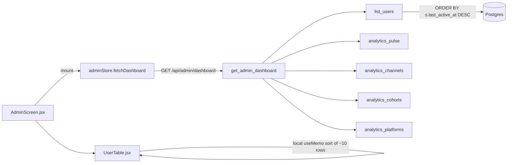
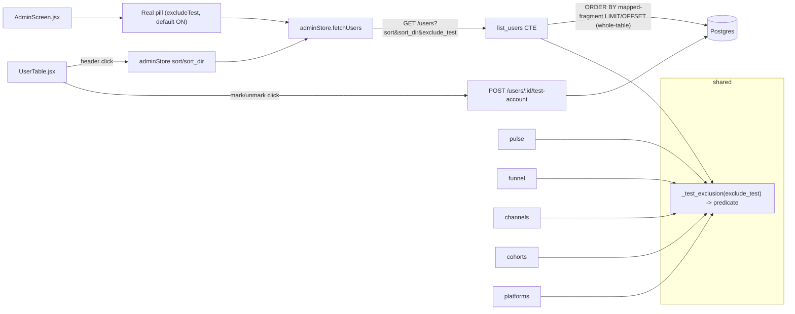

# T8110 — Design: Admin panel — hide test accounts + sort across the whole DB

**Task:** `docs/plans/tasks/T8110-admin-test-user-filter-and-global-sort.md`
**Tier:** L (schema change + new pattern: whitelisted global-sort CTE; 8-endpoint fan-out; design-gated)
**Status:** DESIGN GATE — requires user approval before implementation.

This document decides the query shape, the whitelist, the shared exclusion helper, the two
derived-column decisions, the last_step ordering, the pulse/share-funnel/platforms scope calls,
the new mark endpoint, and the frontend rework. It ends with an explicit **Approval needed** list
calling out the genuine product decisions.

---

## 1. Current State Analysis

### Architecture (today)



### Data-flow facts that constrain the design (from Code Expert audit + re-read)

- `list_users` (admin.py:99-273) is a **sync `def`** (T8020, threadpooled). WHERE built by
  `_build_segment_filter` (admin.py:1596-1622). It runs a COUNT, a page query
  `ORDER BY s.last_active_at DESC NULLS LAST LIMIT/OFFSET`, then **three follow-up queries keyed
  by the page's user ids** (action aggregate, last_7d, plus `credit_ledger.stats_for_admin`), then
  computes last_step / session_count / action_count / usage tail / avg-weekly **in Python per row**.
- The `users u LEFT JOIN user_segments s` shape is **load-bearing (T4970)**: a segment-less user
  must still be enumerated. The new CTE must preserve this exact outer shape.
- Funnel totals are computed **inside** `list_users` (186-200) via a *separate* `funnel_join` that
  only joins `user_segments` when a filter is active, and joins `s` (not `users u`). Threading
  `NOT u.is_test_account` here needs a `users u` join added independently of the CTE.
- `total_usage_seconds` / `avg_weekly_seconds` carry a **live open-session tail** computed in Python
  via `analytics.session_engaged_seconds` (admin.py:218-240). `session_engaged_seconds`
  (analytics.py:32-62) = uncapped confirmed span + a capped idle tail (cap 1800s, trimmed to 0 past
  cap). Not currently expressible without replicating that CASE logic in SQL.
- `_compute_last_step` (admin.py:80-85) walks `reversed(FUNNEL_STEPS)` (analytics.py:244-264) and
  returns the first matching step's `FLOW_EVENTS[label]`, else `"Signed Up"`. **Reverse-priority,
  not alphabetical.**
- `credits` balance is `SELECT user_id, balance FROM credits` inside `stats_for_admin`
  (credit_ledger.py:390) — trivially foldable into the CTE as a LEFT JOIN so `credits` is
  server-sortable. The rest of `stats_for_admin` (credits_spent / purchased / purchase amounts) is
  **not sortable** and stays a per-page call.
- Frontend `UserTable.jsx` sorts locally (`sorted` useMemo, 155-163; `getSortValue` 85-90;
  `handleSort` 165-172; `sortKey`/`sortDir` useState 141-142). The 16 `COLUMNS` keys (41-58) are the
  server whitelist. The **email search** useMemo (149-153) stays local (page-only), matching current
  behavior.

### Code Smells Identified

| Smell | Location | Impact |
|-------|----------|--------|
| Misleading UI (local sort masquerading as a global ranking) | UserTable.jsx:155-163 vs admin.py:148 | "Sort by Clips desc" ranks only the page — actively lies |
| Metric computed two ways (SQL vs Python per-row) | admin.py:210-240 | Sorting on a Python-derived field is impossible without moving it to SQL |
| N+1-shaped follow-ups keyed by page ids | admin.py:156-174 | Fine for display, but cannot drive a *global* ORDER BY — the metric must live in the ranked query |
| Duplicated exclusion string risk | 8 analytics endpoints (Part 3) | If threaded as 7 copies of `NOT u.is_test_account`, they drift |
| No internal-account marker anywhere | `users` table | Test accounts pollute every population aggregate |

### Current behavior (pseudo)

```pseudo
list_users():
  page_rows = SELECT ... ORDER BY last_active_at DESC LIMIT n OFFSET k   # page-local order
  action_rows = SELECT ... WHERE user_id = ANY(page_ids)                 # keyed by THIS page
  for row in page_rows:
     last_step = python_reverse_scan(row.actions)                        # <-- Python metric
     usage = row.banked + python_open_session_tail(...)                  # <-- Python metric
  # sorting any of these = sorting 10 rows, never the DB
```

---

## 2. Target Architecture

### Design principles applied

- [ ] **Single source of ordering** = Postgres. Delete the frontend sort entirely; header click →
      store param → refetch page 1.
- [ ] **One CTE statement** ranks the whole table before LIMIT/OFFSET, so page 1 row 1 is the true
      DB extremum.
- [ ] **DRY exclusion**: ONE helper returns the `NOT u.is_test_account` predicate; all 8 endpoints
      consume it. No copied string literal.
- [ ] **Hard whitelist**: `sort` key → fixed ORDER BY fragment dict. Unknown key → 422. Never
      interpolate a client string.
- [ ] **Preserve T4970**: `users u LEFT JOIN user_segments s` outer shape unchanged.
- [ ] **Gesture-based write**: the mark/unmark endpoint is a single UPDATE off an explicit admin
      click; the toggle/sort are ephemeral store state, never persisted.

### Target diagram



---

## 3. Implementation Plan (mapped to the task's 12 steps)

### Step 1 — Schema + migration

- `pg.py` `_SCHEMA_DDL` `users` table (pg.py:54-65): add
  `is_test_account BOOLEAN NOT NULL DEFAULT false` (fresh deploys).
- New migration `src/backend/app/migrations/postgres/v026_test_account_flag.py`
  (**Implementor MUST re-verify the number** via
  `git log --all --oneline -- src/backend/app/migrations/postgres/` at impl time — v025 is max on
  master; a sibling branch could collide). `BaseMigration` subclass, registered in
  `postgres/__init__.py` MIGRATIONS list. `up(self, conn)`:
  1. `ALTER TABLE users ADD COLUMN IF NOT EXISTS is_test_account BOOLEAN NOT NULL DEFAULT false`
  2. `UPDATE users SET is_test_account = true WHERE email = ANY(%s)` with the 7 seed emails
     (spampoopers@, imankh@, sarkarati@, hello@reelballers.com, drewsoccerati@, themaryam14@,
     iman@launchitlabs.io). Missing email on an env = 0-row no-op, not an error (per task note).
- Postgres track: **operator-triggered** after deploy via `POST /api/admin/migrate-postgres`
  (T5087 rename — the task's step-12 reference to `POST /api/admin/migrate` is stale; the design
  uses the current route).

### Step 2 + 3 — `list_users`: exclusion + whitelisted global-sort CTE

**Signature additions:**
```python
def list_users(..., sort: str = Query("last_active_at"),
                    sort_dir: str = Query("desc"),
                    exclude_test: bool = Query(True)):
```

**The CTE skeleton (pseudo-SQL).** One statement; all sortable metrics computed across the WHOLE
table, then ordered, then paged. `<extra_where>` = the `_build_segment_filter` parts AND the
`_test_exclusion` predicate (§4); `<order_fragment>` = the whitelisted mapping (§5).

```sql
WITH act AS (                         -- per-user action aggregate, pivoted to columns
  SELECT user_id,
         SUM(count)                                             AS action_count,
         SUM(count) FILTER (WHERE action = 'game_created')      AS game_created_count,
         SUM(count) FILTER (WHERE action = 'clip_created')      AS clip_created_count,
         SUM(count) FILTER (WHERE action = 'export_completed')  AS export_completed_count,
         SUM(count) FILTER (WHERE action = 'share_completed')   AS share_completed_count,
         SUM(count) FILTER (WHERE action = 'session_started')   AS session_count,
         -- last_step: MAX funnel-ordinal present, mapped back to a label in Python (§6)
         MAX(CASE action <reverse-priority CASE, see §6> END)   AS last_step_rank
  FROM user_actions
  GROUP BY user_id
),
u7 AS (                               -- trailing-7-day engaged seconds
  SELECT user_id, COALESCE(SUM(seconds),0) AS last_7d_seconds
  FROM user_usage_daily
  WHERE day >= CURRENT_DATE - INTERVAL '6 days'
  GROUP BY user_id
),
bal AS (SELECT user_id, balance FROM credits)   -- credits, now server-sortable
SELECT
  u.user_id, u.email, u.created_at,
  s.origin, s.acquired_at, s.total_spent_cents, s.last_active_at,
  s.total_usage_seconds, s.current_session_start,
  COALESCE(act.action_count,0)          AS action_count,
  COALESCE(act.game_created_count,0)    AS game_created_count,
  COALESCE(act.clip_created_count,0)    AS clip_created_count,
  COALESCE(act.export_completed_count,0) AS export_completed_count,
  COALESCE(act.share_completed_count,0)  AS share_completed_count,
  COALESCE(act.session_count,0)         AS session_count,
  act.last_step_rank,
  COALESCE(u7.last_7d_seconds,0)        AS last_7d_seconds,
  bal.balance                           AS credits,
  -- usage_sort_seconds: banked usage only (see §7 decision A)
  COALESCE(s.total_usage_seconds,0)     AS usage_sort_seconds,
  -- avg_weekly_sort: banked usage / weeks-since-signup, computed in SQL (see §7)
  ( COALESCE(s.total_usage_seconds,0)::float
      / GREATEST(1.0, EXTRACT(EPOCH FROM (now() - COALESCE(s.acquired_at, u.created_at))) / 604800.0)
  )                                     AS avg_weekly_sort
FROM users u
LEFT JOIN user_segments s ON u.user_id = s.user_id
LEFT JOIN act  ON act.user_id = u.user_id
LEFT JOIN u7   ON u7.user_id  = u.user_id
LEFT JOIN bal  ON bal.user_id = u.user_id
<extra_where>
ORDER BY <order_fragment>
LIMIT %s OFFSET %s;
```

**Follow-up query fate:**
- The page-keyed **action aggregate** (admin.py:156-162), **last_7d** (168-174) and **credits
  balance** are FOLDED into the CTE (they drive sort). The per-page follow-ups for them are deleted.
- `credit_ledger.stats_for_admin(page_ids)` is **KEPT** for the non-sortable derived fields still
  shown per row: `credits_spent`, `credits_purchased`, `credit_purchase_count` /
  `purchase_credit_amounts` → `total_spent`-adjacent display. It runs on the ≤50 page ids only, so
  it stays cheap and off the global sort path. (`credits` balance is no longer read from it — the
  CTE `bal` column is authoritative for the list; keeping the balance read there too is harmless but
  the row uses the CTE value.)
- **Open-session usage tail + avg-weekly display** stay a Python post-step over the page rows
  (see §7) — the CTE provides the *sort* key; Python provides the *displayed* value.

**COUNT query:** unchanged shape (`users u LEFT JOIN user_segments s <extra_where>`), now including
the exclusion predicate so `total_users` matches the filtered set.

**Performance.** The `act` CTE aggregates ALL of `user_actions` per request. Today's per-page
`WHERE user_id = ANY(page_ids)` used `idx_actions_action_user(action, user_id)`; the whole-table
GROUP BY cannot. On the current row scale a single grouped seq-scan of `user_actions` is acceptable,
but the task explicitly flags scaling to thousands of users (T8000). **Decision: add a covering
index in the SAME migration** —
`CREATE INDEX IF NOT EXISTS idx_actions_user_action_count ON user_actions(user_id, action) INCLUDE (count)`
— so the aggregate is an index-only scan. `u7`/`bal` are small (bounded by 7 days / balance rows).
**Implementor MUST run `EXPLAIN (ANALYZE)` on a realistic row count (step 11) and confirm no
per-request seq-scan of `user_actions` before shipping;** if the plan still seq-scans, revisit the
index shape rather than shipping a slow endpoint.

### Step 4 — Thread exclusion through the 8 analytics endpoints

Via the shared `_test_exclusion` helper (§4). Injection map (from audit, verified against source):

| Endpoint | Injection |
|----------|-----------|
| `list_users` funnel_totals (186-200) | add `JOIN users u ON u.user_id = a.user_id` + predicate; today's `funnel_join` only joins `s` when filtered — exclusion must join `u` independently |
| `/analytics/funnel` (1029-35, 1038-45) | add `JOIN users u` + predicate to BOTH signup + action queries |
| `/analytics/channels` (1098-1123) | add `JOIN users u ON u.user_id = s.user_id` + predicate on outer WHERE |
| `/analytics/cohorts` (1243-48 shared where) | add `JOIN users u` + predicate via the shared `where_clause` used by all 4 queries |
| `/analytics/pulse` | **see §6 decision** |
| `/analytics/platforms` (1947-55, 1973-80) | add `JOIN users u ON u.user_id = ua.user_id` + predicate to BOTH queries — **see §7 scope call** |
| `/revenue-reconciliation` (async, 554) | **see §7 scope call** |
| `/dashboard` (2028-37) | add `exclude_test` param, thread into each callee explicitly (keep the Query-sentinel discipline); update `TestDashboardEndpoint` byte-equality guard |

### Step 5 — Mark/unmark endpoint

`POST /api/admin/users/{user_id}/test-account` body `{is_test: bool}`:
```pseudo
_require_admin()
UPDATE users SET is_test_account = %s WHERE user_id = %s
if cursor.rowcount == 0: raise 404          # T7500 zero-row-update rule
logger.info("[ADMIN] %s marked user %s is_test_account=%s", admin_id, user_id, is_test)
return {"user_id", "is_test_account"}
```
**Route order:** register it AFTER the `/users/bulk/*` routes and alongside the other
`/users/{user_id}/*` mutations (FastAPI definition-order matching — the existing bulk-route landmine).

### Steps 6-8, 10 — Frontend (§10)

### Step 9, 11 — Tests + query plan (§ Risks / Open Questions)

---

## 4. Shared exclusion-predicate helper

**Location:** admin.py, sibling to `_build_segment_filter` (so both live together).
**Signature:**
```python
def _test_exclusion(exclude_test: bool) -> str:
    """Return the WHERE fragment excluding internal test accounts, or '' when
    exclude_test is False. Independent of the exclusive userFilter pill — composes
    with (never replaces) _build_segment_filter's parts."""
    return "NOT u.is_test_account" if exclude_test else ""
```
- Returns a **static string** (no params), so it composes into any `where_parts` list by simple
  append. It is **independent** of `_build_segment_filter`'s single-value `user_filter` — "Real"
  never joins the exclusive pill set, so `Real + Paying` = real paying users (acceptance criterion).
- Every consumer that lacks a `users u` alias must ADD `JOIN users u ON u.user_id = <fk>` before
  applying the predicate (mapped per endpoint in Step 4).
- **DRY guarantee:** the literal `NOT u.is_test_account` appears in exactly ONE place.

Composition example (`list_users`):
```python
where_parts, params = _build_segment_filter(origin, acquired_from, acquired_to, filter)
excl = _test_exclusion(exclude_test)
if excl:
    where_parts.append(excl)
where_clause = ("WHERE " + " AND ".join(where_parts)) if where_parts else ""
```

---

## 5. Whitelist mapping (16 columns) — sort key → ORDER BY fragment

Hard dict in admin.py. `sort` not in the dict → **HTTP 422** (`raise HTTPException(422, ...)`),
never interpolated. `sort_dir` restricted to `{"asc","desc"}` (else 422). A stable tiebreaker
`u.user_id` is appended to EVERY fragment so equal-metric rows can't repeat/skip across page
boundaries.

`DESC` uses `NULLS LAST`, `ASC` uses `NULLS FIRST` — i.e. NULLs always sort to the *bottom* of a
descending ranking (a segment-less/zero user is never the "top" of "most clips desc") and to the
*bottom* of an ascending ranking too is wrong; the rule below keeps NULLs at the far end in both
directions so paging is consistent:

```python
# value fragment per key (direction + NULLS appended by _order_by())
_SORT_COLUMNS = {
    "email":                  "u.email",
    "origin":                 "s.origin",
    "last_step":              "act.last_step_rank",
    "acquired_at":            "s.acquired_at",
    "game_created_count":     "game_created_count",
    "clip_created_count":     "clip_created_count",
    "export_completed_count": "export_completed_count",
    "share_completed_count":  "share_completed_count",
    "credits":                "credits",
    "total_spent_cents":      "s.total_spent_cents",
    "action_count":           "action_count",
    "session_count":          "session_count",
    "total_usage_seconds":    "usage_sort_seconds",   # §7 decision A (banked)
    "avg_weekly_seconds":     "avg_weekly_sort",      # §7 (SQL banked-derived)
    "last_7d_seconds":        "last_7d_seconds",
    "last_active_at":         "s.last_active_at",
}

def _order_by(sort: str, sort_dir: str) -> str:
    frag = _SORT_COLUMNS.get(sort)
    if frag is None or sort_dir not in ("asc", "desc"):
        raise HTTPException(422, "invalid sort")
    nulls = "NULLS LAST" if sort_dir == "desc" else "NULLS FIRST"
    return f"{frag} {sort_dir.upper()} {nulls}, u.user_id ASC"
```

**Direction × NULLS rationale.** With `DESC NULLS LAST` a NULL/zero metric sits at the end of the
ranking (correct: absent data is not the max). With `ASC NULLS FIRST` NULLs sit at the start —
consistent with "ascending shows smallest first, unknown treated as smallest." Either way the
ordering is **total** (tiebroken by `user_id`), so LIMIT/OFFSET paging never repeats or drops a row
(acceptance criterion). Default remains `last_active_at` / `desc` (unchanged landing behavior).

---

## 6. `last_step` ordering (reverse funnel priority, NOT alphabetical)

`_compute_last_step` returns the LAST funnel step the user reached. To make it sortable we compute a
numeric **rank** in SQL that mirrors `reversed(FUNNEL_STEPS)` priority, then map rank → label in
Python for display.

- Build the CASE from `analytics.FUNNEL_STEPS` order at import time (greppable, generated from the
  single source, not hand-copied):
```python
# ordinal = position in FUNNEL_STEPS; higher = further in the funnel
_STEP_RANK = {step: i + 1 for i, step in enumerate(FUNNEL_STEPS)}   # session_started=1 ... credit_purchased=N
# in the CTE act aggregate:
#   MAX(CASE action WHEN 'session_started' THEN 1 WHEN 'add_game_opened' THEN 2 ... END) AS last_step_rank
```
- `MAX(rank)` over a user's actions = the furthest step reached = exactly what
  `reversed(FUNNEL_STEPS)` first-match yields. NULL rank (no actions) → `"Signed Up"`.
- Display mapping: `rank -> FLOW_EVENTS[FUNNEL_STEPS[rank-1]]["label"]`, else `"Signed Up"` — the
  same labels `_compute_last_step` produces today, so `StepBadge`'s `STEP_STYLES` keys are
  unchanged.
- Sorting on `act.last_step_rank` gives funnel-progression order (task requirement: match
  `FUNNEL_STEPS`, not alphabetical). The CASE arms are **generated from `FUNNEL_STEPS`** so a future
  step insertion can't desync the sort from `_compute_last_step`.

> **Note for reviewer:** `MAX(rank)` and `reversed()`-first-match agree ONLY because ranks increase
> monotonically with funnel position. This is asserted by a test (a user with a late + an early
> action ranks by the late one). The CASE must be built from `FUNNEL_STEPS` at import, never a
> hand-written literal ladder.

---

## 7. Two derived-column decisions + two population-scope calls

### (A) `total_usage_seconds` / `avg_weekly_seconds` — sort on BANKED usage, keep Python tail for display

**Options:**
1. Replicate `session_engaged_seconds` (confirmed span + capped-idle-tail-trimmed-past-cap) entirely
   in SQL so sort and display are byte-identical.
2. **[CHOSEN]** Sort on **banked** `total_usage_seconds` (and a SQL banked-derived `avg_weekly_sort`);
   keep the existing Python open-session tail for the **displayed** value only.

**Why option 2.** The open-session tail is a *live, read-time* estimate that changes every second
(`now()`), depends on the per-request clock, and trims past a 1800s idle cap — replicating that
exactly in SQL (option 1) duplicates a subtle, already-tested accounting rule in a second language,
creating the very "two ways to compute one metric" smell we are removing elsewhere. The tail matters
only for a user *currently online* (at most their single open session, ≤ one idle-cap of seconds);
it can only ever *raise* one user slightly. For a **ranking**, banked usage is the honest,
stable, whole-history key. So: **sort key = banked; displayed value = banked + Python tail.**

**Documented divergence (must be an in-code comment at the sort site AND the display site):**
> Sort uses banked `total_usage_seconds`; the Usage/Avg-wk *cells* add a live open-session tail
> (`session_engaged_seconds`). For a user with an open session the displayed number can exceed the
> value it was ranked by, by at most one idle-cap (1800s). This is deliberate — the ranking is on
> stable banked usage, not a per-request live estimate. Do NOT "fix" this by sorting on the tailed
> value (that would re-rank the whole table on every clock tick and duplicate the cap logic in SQL).

`avg_weekly_sort` in SQL uses the banked numerator over weeks-since-`acquired_at` (fallback
`created_at`), clamped `GREATEST(1.0, ...)` — matching the Python `weeks_since_signup` clamp. The
Python display keeps using tailed effective usage as today.

### (B) `/analytics/pulse` — force the filtered path when `exclude_test` is on

Pulse has two branches (audit): a **filtered** branch that joins `user_segments s` and can carry an
extra predicate, and an **UNFILTERED** branch that reads pre-aggregated `daily_counters` (origin_type
rows) which have **no per-user dimension** — a per-user test flag cannot be honored there.

**Decision:** treat `exclude_test=True` as "there is a filter," i.e. **route pulse through the
filtered branch whenever `exclude_test` is on** (its default). Concretely: `has_filter` becomes
`bool(filter_parts) or exclude_test`, and the exclusion predicate is appended to `filter_parts` (via
a `users u` join on the segment queries). The `daily_counters` fast path is used ONLY when
`exclude_test=False` AND no segment filter — i.e. the explicit "show everything including test
accounts, unfiltered" case.

**Cost/consequence (call out to user):** with the default (`exclude_test=True`) pulse always uses
the per-user `user_segments`/`user_actions` path instead of the cheaper `daily_counters` sparkline
path. That path already exists and is used whenever any pill is active today, so this is not new SQL
— but it does mean the default dashboard no longer reads the pre-aggregated counters. The 7 test
accounts are heavy, so excluding them is the point; the tradeoff is a slightly costlier default
pulse query. **This is a genuine product/perf tradeoff — see Approval.**

### (C) `/analytics/share-funnel` — per-sharer-link, exclusion DEFERRED (open question)

share-funnel is a **per-link** funnel (views→claims→activated per game_link), keyed on the SHARER,
not a population aggregate. "Exclude test accounts" is ambiguous here: hide links whose *sharer* is a
test account? Hide *claimers* who are test accounts from the counts? Both are plausible and neither is
what the other analytics cards mean by "population."

**Recommendation: DEFER** — do not thread `exclude_test` into share-funnel in this task; leave its
behavior unchanged. Rationale: it is per-link diagnostic data, not a "how are real users doing"
aggregate, and the 7 test accounts sharing links is not the pollution the task targets. **Flag as an
open question** — if the user wants sharer-side exclusion it is a one-predicate add on the
`s.sharer_user_id` join, but it is a product call.

### (D) `/analytics/platforms` — apply exclusion (has no user join today)

platforms reads `user_actions` only (no users/segments join). Threading exclusion means adding
`JOIN users u ON u.user_id = ua.user_id` to both queries and the predicate. This IS a population
aggregate ("% of users/actions on mobile/desktop/pwa") and the 7 heavy test accounts do skew it.

**Decision:** APPLY exclusion to platforms (both queries), honoring the same `exclude_test` default.
`/revenue-reconciliation` (async) similarly filters its `_load_local_spent_positive` query.
**USER DECISION 2026-09-01: revenue-reconciliation EXCLUDES test accounts** (consistent with the
other population aggregates), NOT the show-as-drift alternative. Apply `NOT u.is_test_account` to its
query the same as everywhere else.

### (E) `AnalyticsDashboard.jsx` — dead code, DO NOT MODIFY

Audit confirms `AnalyticsDashboard.jsx` is **not imported anywhere**. Task item 9's request to
"pass the exclusion through" it is moot. **Recommendation: do not modify it; flag to user** (separate
cleanup task if desired). Not touched by this design.

---

## 8. Design Decisions (summary)

| Decision | Options | Choice | Rationale |
|----------|---------|--------|-----------|
| Global sort mechanism | client sort / server ORDER BY on page / **CTE over whole table** | CTE | Only whole-table ranking makes page-1-row-1 the true extremum |
| Sortable metrics source | keep page-keyed follow-ups / **fold into CTE** | fold | A page-keyed aggregate can't drive a global ORDER BY |
| `credits` sort | keep in stats_for_admin / **LEFT JOIN in CTE** | CTE join | Makes credits server-sortable; stats_for_admin still serves non-sortable credit fields |
| Sort whitelist | dynamic column / **static dict → 422** | static dict | No SQL injection surface; explicit + greppable |
| Usage sort | SQL-replicate tail / **banked + Python display tail** | banked | Avoids duplicating capped-tail logic in SQL; ranking on stable banked usage |
| last_step sort | alphabetical / **funnel-rank CASE from FUNNEL_STEPS** | funnel-rank | Matches `_compute_last_step`; generated from the single source |
| exclusion helper | extend `_build_segment_filter` / **sibling `_test_exclusion`** | sibling | Keeps it independent of the exclusive userFilter (Real + Paying must compose) |
| pulse exclusion | can't-exclude default cards / **force filtered path when excluding** | force filtered | Only path that can honor a per-user flag; reuses existing branch |
| share-funnel | apply / **defer** | defer | Per-link diagnostic, not population; ambiguous semantics |
| index | rely on existing / **add covering index in migration** | add | Whole-table GROUP BY can't use `idx_actions_action_user`; avoid seq-scan at scale |

---

## 9. Frontend design

### Real pill (AdminScreen.jsx)
- Add `excludeTest` to `adminStore` (default `true`). Render a **"Real" pill in the existing FILTER
  row** (AdminScreen.jsx:120-134), rendered SEPARATELY from the `USER_FILTERS.map` exclusive pills
  (it toggles `excludeTest` independently, not `userFilter`).
- Toggling calls a new `setExcludeTest(bool)` store action that `set`s the flag then
  `fetchUsers(1)` + `fetchPulse()` (the `setUserFilter` refetch precedent). Store state only, never
  persisted.
- Lit (active) by default so the panel opens on real users. Visually distinct from the exclusive
  pills (e.g. a check/eye affordance) so it reads as an independent toggle, not a 6th exclusive pill.

### adminStore.js
- Add state: `sort: 'last_active_at'`, `sortDir: 'desc'`, `excludeTest: true`.
- `fetchUsers` (54-81): append `sort`, `sort_dir`, `exclude_test` params.
- `fetchDashboard` (88-119) + `fetchPulse` (268-281): append `exclude_test`.
- New `setSort(key)` action: if same key → flip `sortDir`; else set key + `sortDir='desc'`; then
  `fetchUsers(1)` (reset to page 1 — a new global sort invalidates the current page).
- New `setExcludeTest(bool)` action (refetch users + pulse).
- New `markTestAccount(userId, isTest)` action: POST the mark endpoint; on success, refetch page 1
  (a marked row may drop out under the active Real filter) — or patch the row's badge and let the
  next refetch reconcile. Refetch is simplest and matches the "survives reload" criterion.

### UserTable.jsx
- **DELETE** the local sort: `sorted` useMemo (155-163), `getSortValue` (85-90), `handleSort`
  (165-172), `sortKey`/`sortDir` useState (141-142), and `SortIcon`'s local-state read. Render rows
  directly from `users` (already server-ordered), filtered only by the **local email search**
  (search useMemo stays — page-only, matching current behavior; keep the "on page" copy).
- Header click → `useAdminStore.getState().setSort(col.key)`. Direction indicator reads the store's
  `sort`/`sortDir` (active column shows Up/Down; others show the neutral `ArrowUpDown`).
- **Test badge:** when a row's `is_test_account` is true (visible only with Real off), render a small
  "TEST" badge near the email.
- **Per-row mark control:** a small toggle (e.g. in the last-active action cluster) calling
  `markTestAccount(user.user_id, !user.is_test_account)`. Admin-only surface already.
- `list_users` response must include `is_test_account` per row (add to the CTE SELECT + row dict) so
  the badge/toggle reflect DB truth.

### AnalyticsDashboard.jsx
- **Not modified** (dead code, §7E).

---

## 10. Risks

| Risk | Mitigation |
|------|------------|
| Whole-table `act` CTE seq-scans `user_actions` at scale | Add covering index in the SAME migration; `EXPLAIN ANALYZE` at realistic scale (step 11) before ship |
| Page-boundary repeats/gaps from non-total ordering | Every ORDER BY fragment appends `u.user_id` tiebreaker; explicit NULLS per direction |
| Sort/display divergence on usage confuses admins | In-code comments at both sites (§7A); documented, deliberate |
| last_step sort desyncs from `_compute_last_step` | CASE generated from `FUNNEL_STEPS`; test asserts furthest-step wins |
| `T4970` regression (segment-less user dropped) | Preserve `users u LEFT JOIN user_segments s`; test asserts a segment-less user still lists + sorts (NULLS LAST) |
| `TestDashboardEndpoint` byte-equality breaks when `exclude_test` added to `/dashboard` | Update the guard to the new default (`exclude_test=True`) explicitly; keep Query-sentinel discipline |
| `AdminScreen.test.jsx` "exactly ONE mount request" breaks if extra param changes URL | Update assertion to the new URL (still one request) |
| Pulse default now always uses the segment path (not daily_counters) | Accepted tradeoff (§7B); path already exists and is exercised by every active pill today |
| Migration number collision with a sibling branch | Implementor re-checks `git log --all` for the highest PG migration at impl time |
| Marking a user mid-view shifts pagination | `markTestAccount` refetches page 1; acceptable (rare admin gesture) |

---

## 11. Open Questions for user approval

These are **genuine product decisions**, not implementation details — please confirm before build:

1. **Pulse default cost (§7B).** With Real ON by default, the pulse cards will always compute from
   the per-user segment path instead of the pre-aggregated `daily_counters` sparkline path. This is
   the only way to exclude the 7 heavy test accounts from the default dashboard. Accept the slightly
   costlier default pulse query? (Alternative: leave pulse default cards unable to exclude test
   accounts, exclude only when a pill is active — cheaper, but the default numbers stay polluted.)

2. **share-funnel scope (§7C).** Recommend **deferring** exclusion on `/analytics/share-funnel` (it
   is a per-link diagnostic keyed on the sharer, not a population aggregate). OK to leave it
   unchanged? Or should test-account *sharers'* links be hidden?

3. **platforms + revenue-reconciliation scope (§7D).** Recommend **applying** exclusion to
   `/analytics/platforms` (a real population aggregate). For `/revenue-reconciliation` (a Stripe-truth
   audit tool), should test accounts be excluded from the reconciliation too, or shown as-is (since
   it's an audit, not a product metric)?

4. **Usage sort semantics (§7A).** Confirm we sort on **banked** `total_usage_seconds`/`avg_weekly`
   (stable, whole-history) while the cells still *display* the live open-session tail — meaning an
   online user's displayed Usage can slightly exceed its ranking value (by ≤ 30 min). Alternative is
   replicating the capped-tail accounting in SQL (more code, duplicated logic).

5. **AnalyticsDashboard.jsx (§7E).** It is dead code (unimported). Recommend **not** modifying it
   (task item 9 is moot). Confirm, or file a separate delete-dead-code task.

---

## Approval needed on:  — ✅ ALL APPROVED (user, 2026-09-01)

- [x] **Pulse**: force the filtered/segment path when `exclude_test` is on (Q1). ✅ ACCEPTED
- [x] **share-funnel**: defer exclusion (Q2). ✅ ACCEPTED (leave unchanged)
- [x] **platforms**: apply exclusion; **revenue-reconciliation**: EXCLUDE test accounts (Q3). ✅
- [x] **Usage/avg-wk sort**: banked-for-sort, tailed-for-display divergence (Q4). ✅ ACCEPTED
- [x] **AnalyticsDashboard.jsx**: leave untouched as dead code (Q5). ✅ ACCEPTED
- [x] Overall CTE-based global-sort + whitelist + `_test_exclusion` helper + `v026` migration
      (with covering index) approach. ✅ APPROVED
