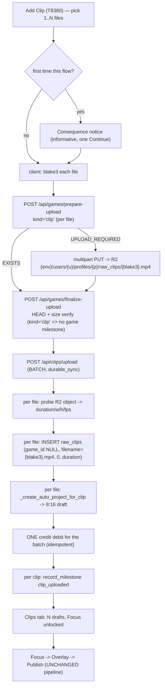

# T8370 Design: Pre-cut clip upload support (clips without a full game)

**Status:** APPROVED (2026-09-04, with amendments to Q3 and Q8 — see §7 and the Approval status section)
**Author:** Architect Agent
**Date:** 2026-09-03
**Task file:** [T8370-precut-clip-upload.md](T8370-precut-clip-upload.md)
**Blocks:** T8380 (Clips-screen entry point), T7640 (tutorial rollout)

---

## 0. Executive summary

**Recommendation: Shape 2 (independent clip source) — because it already exists.**

The task file frames this as a choice between inventing a wrapper game and inventing an
independent clip source. Reading the code changes the question: **an independent clip source is
already the shipped model**, it is just undermaintained and reachable only from a legacy,
half-broken endpoint.

`POST /api/clips/projects/{id}/clips/upload-with-metadata` (clips.py:1930) has, since before the
current pipeline, created a `raw_clips` row with **`game_id = NULL`** and its own R2 object at
`raw_clips/{uuid}.mp4`. Every downstream seam already honours that row shape:

| Seam | Already handles a game-less clip? | Evidence |
|---|---|---|
| Export source resolution | **Yes** | `resolve_clip_source` step 2 (export_helpers.py:594) presigns `raw_clips/{raw_filename}` when no game video exists |
| Focus playback (frontend) | **Yes** | `FocusScreen.getClipVideoConfig` L475: *"Uploaded/extracted clip: use file_url directly (no offset)"* |
| Clip list API | **Yes** | `list_working_clips` LEFT JOINs games; emits `file_url` from `raw_clips/`, `game_video_url = null` |
| Poster generation | **Yes** | `poster.py:1330` LEFT JOIN games → falls through `resolve_clip_source` |
| Orphan R2 sweep | **Yes** | `orphan_raw_clips.py` names *"direct no-game uploads"* as a live reference class and refuses to delete non-`auto_` objects |
| Clip delete | **Yes** | `delete_raw_clip` already deletes `raw_clips/{filename}` (clips.py:1542) |
| Reel-draft creation | **Yes** | `_create_auto_project_for_clip` reads only `raw_clips` columns |
| Game attribution joins | **Correctly empty** | projects.py:427 / downloads.py:438 carry `WHERE rc.game_id IS NOT NULL` |

Choosing the wrapper game would introduce a **third** representation of "a clip whose source is a
whole file" alongside the two that exist, and would then need a hidden-state filter on ~6 backend
enumerations plus every future `FROM games` query. Shape 2 does the opposite: it **promotes the
existing model to first class and deletes its weaker duplicates**.

Second key decision that falls out of this: clip source bytes stay in the **per-profile
`raw_clips/` prefix, not the global `games/{hash}.mp4` namespace**. That single choice removes the
entire T6770 ref-count-drift class from this feature — a per-profile object has exactly one owner
(the `raw_clips` row), so there is no ref count to drift, no `game_storage` row, no sweep
participation, no grace-deletion, no cross-user dedup hazard. It also makes clip sources
**permanent** (they die with the clip, not on a 30-day clock), which is a pricing decision needing
your sign-off (§7 Q1/Q2).

Net schema cost: **zero new `raw_clips` columns**, one new `pending_uploads.kind` column
(profile_db), one new `daily_counters.clips_uploaded` column (postgres).

---

## 1. Current state ("As Is")

### 1.1 The three upload paths that exist today

```mermaid
flowchart TD
    subgraph P1["Path 1 — Add Game (the real one)"]
        A1[File picker] --> A2["POST /api/games/prepare-upload<br/>blake3 + size"]
        A2 -->|EXISTS| A3[dedup: no bytes moved]
        A2 -->|UPLOAD_REQUIRED| A4["multipart PUT x N -> R2<br/>games/{blake3}.mp4"]
        A4 --> A5["POST /finalize-upload<br/>HEAD verify + size match"]
        A5 --> A6["POST /api/games (pending row)"]
        A6 --> A7["POST /{id}/activate<br/>probe -> storage refs -> DEBIT -> ready"]
        A7 --> A8[Annotate: cut clips out of it]
    end
    subgraph P2["Path 2 — add file to a reel (legacy)"]
        B1["POST /projects/{id}/clips (file=)"] --> B2["await file.read() in RAM"]
        B2 --> B3["uploads/{uuid}.mp4"]
        B3 --> B4["working_clips.uploaded_filename<br/>NO raw_clip, NO credits"]
    end
    subgraph P3["Path 3 — upload-with-metadata (legacy)"]
        C1["POST /projects/{id}/clips/upload-with-metadata"] --> C2["await file.read() in RAM"]
        C2 --> C3["raw_clips/{uuid}.mp4"]
        C3 --> C4["raw_clips row, game_id=NULL<br/>start_time/end_time NULL<br/>NO credits, NO probe"]
    end
```



### 1.2 What each path actually gives you

| | Path 1 (game) | Path 2 (uploaded_filename) | Path 3 (upload-with-metadata) |
|---|---|---|---|
| Transport | multipart, resumable, presigned | `await file.read()` in API RAM | `await file.read()` in API RAM |
| Dedup | blake3, cross-user | none | none |
| Credits | yes (`calculate_upload_cost`) | **none** | **none** |
| Storage accounting / expiry | `game_storage` + PG refs + sweep | **none** | **none** |
| Duration/dims | probed from R2 at activate (authoritative) | ffprobe on the temp file | **not probed at all** |
| Produces a Clip | only via Annotate | working_clip only | `raw_clips` row (game_id NULL) |
| Lands on Clips surface | no | no | no (inside an existing reel) |
| Batch | one file per gesture | one | one |

### 1.3 Live defects found while reading (relevant, not invented scope)

| # | Finding | Impact |
|---|---|---|
| **D1** | Path 3 inserts `raw_clips` with `start_time`/`end_time` **NULL**. `resolve_clip_source` then computes `duration = clip.get('raw_duration') or 0.0` → **a 0-second source range** at export. | An uploaded clip is not reliably renderable today. T8370 must set `(0, probed_duration)`. |
| **D2** | Path 2 writes `uploads/{name}` but `multi_clip.py:2417` and `orphan_raw_clips.py` both read `raw_clips/{uploaded_filename}`. Prefix mismatch between the write and the export read. | Either Path 2 exports are broken, or there is an undocumented mirror. Argues for retiring Path 2 onto ONE prefix. |
| **D3** | `latest_working_clips_subquery` (queries.py:121) partitions clip identity by `COALESCE(rc.end_time, wc.uploaded_filename)` — **not by clip id**. Two different clips with the same `end_time` in one project collapse; the lower `version` disappears from every list. | **High probability for this feature's audience**: Veo/Trace auto-cut highlights are frequently the exact same length. Mitigated in T8370 by one-draft-per-clip (§6 R3); a real fix is filed separately. |
| **D4** | `finalize_upload` emits `game_upload_succeeded` unconditionally. | If the clip path reused it unchanged, T8220's tried/succeeded pair would count clip uploads as game uploads. Routed by `pending_uploads.kind` in §3.2. |

### 1.4 The observed failure this task closes

A user with four pre-cut clips had only Path 1 available. Four 15-second "games":
`create_game` + `activate` × 4 → **8 credits burned**, four nonsense tiles in the games list, an
Annotate screen asking them to cut clips out of a clip, and zero output. There was no path from
"I have a clip" to "a clip I can Focus and publish".

---

## 2. Target state ("Should Be")

### 2.1 The model

> **A clip source is a `raw_clips` row with `game_id IS NULL` whose `filename` names a
> per-profile R2 object at `raw_clips/{blake3}.mp4` that this row exclusively owns.**

Consequences, stated as invariants:

- **INV-U1 — one owner, no ref count.** A clip-source object is referenced by exactly one
  `raw_clips` row in exactly one profile. Deleting the row deletes the object (the existing
  `delete_raw_clip` R2 delete). There is no counter and no cross-profile sharing, so the T6770
  drift class is structurally absent — not mitigated, **absent**.
- **INV-U2 — clip sources never enter `game_storage`.** The `game_storage` / `game_storage_refs`
  tables are keyed by blake3 in the **global `games/`** namespace, and sweep Phase 2 deletes
  `games/{hash}.mp4` for any hash it reclaims. Inserting a clip-source hash there would make the
  sweep delete the wrong key and expire a live clip. **Never insert a clip-source hash into
  `game_storage`.** (This is why clip sources do not expire — §7 Q1.)
- **INV-U3 — no `games` row is created, ever.** A clip upload creates zero games rows, emits no
  `game_created` / `game_upload_succeeded`, and cannot satisfy the `upload_game` quest step or
  appear in the games list, storage UI, tournaments, recap, sharing or admin game metrics. This is
  invisibility by **absence**, not by filter.
- **INV-U4 — the source range is `(0, probed_duration)`**, probed server-side from the object R2
  actually holds. Client-supplied duration is a hint for the UI only and is never written
  (no silent fallback — a failed probe fails the upload visibly).
- **INV-U5 — one clip, one draft.** Each uploaded file produces exactly one `raw_clips` row and
  exactly one auto-created 9:16 project (`is_auto_created = 1`), so it appears on the Clips tab and
  unlocks Focus immediately (T8480's `announceReelCreated` contract).

### 2.2 Target flow



### 2.3 What is deliberately unchanged

Everything after the clip row exists. Focus, Overlay, export, poster, publish, share, collections
and rankings all read a `raw_clips` row and resolve pixels through `resolve_clip_source` — which
already prefers the game video **when one exists** and falls through to `raw_clips/{filename}`
otherwise. **No new pixel-resolution code path is created by this design.**

Annotate is untouched and unreachable for these clips: there is no game to open, and Annotate is
entered only via a game tile. Nothing in Annotate assumes "every clip has an Annotate step" —
`_ensure_unique_name(..., game_id=None)` already reserves a "no-game clips" cohort, and the
`(game_id, end_time, video_sequence)` natural key is never consulted for `game_id IS NULL` rows
(`save_raw_clip` looks up `WHERE game_id = ?`, which never matches NULL).

Consequence, stated plainly for the user-facing warning (**narrowed per Q8's approval,
2026-09-04** — the clip is NOT second-class in any other respect; it can still be rated, tagged,
renamed and organized like any Annotate-created clip): an uploaded clip has **no game footage
behind it**, so it can never be re-trimmed wider, never joins a game group, never appears in a
game recap, and can never be a source for future game-based highlight assembly. That is the
complete list — nothing else about the clip is limited.

---

## 3. Implementation plan ("Will Be")

Sequenced so each slice is an independently reviewable unit under ~200 lines of meaningful diff.

### Slice A — mechanical: make the upload transport namespace-aware (no behavior change)

`games_upload.py` hardcodes `games/{blake3}.mp4` in five places. Every R2 multipart helper
(`r2_create_multipart_upload`, `generate_multipart_urls`, `r2_complete_multipart_upload`,
`r2_abort_multipart_upload`, `r2_is_multipart_upload_valid`, `r2_multipart_parts_match_size`)
already takes a **raw key**, so a per-profile key needs no storage.py change at all.

```pseudo
// games_upload.py — ONE resolver, greppable, no dynamic dispatch
UPLOAD_KIND_GAME = "game"        // constants.py, str Enum (type-safety skill)
UPLOAD_KIND_CLIP = "clip"

+ def upload_object_key(kind, blake3) -> str:
+     if kind == UPLOAD_KIND_GAME: return f"games/{blake3}.mp4"          // global namespace
+     if kind == UPLOAD_KIND_CLIP: return r2_key(user_id, f"raw_clips/{blake3}.mp4")  // per-profile
+     raise ValueError(kind)      // fail visibly, never default

  PrepareUploadRequest:
+     kind: str = "game"          // default keeps every existing caller byte-identical
```

`pending_uploads` gains `kind TEXT NOT NULL DEFAULT 'game'` so finalize/reap/cancel can route
without the client re-declaring intent (client-declared intent at finalize would be forgeable and
would let a clip upload claim a game milestone).

Guarded write (T6550/T6780 pattern): if `pending_uploads.kind` is absent (below-v050 DB in a
rolling-deploy window), a **`kind='clip'` prepare returns 503 `pending_migration`** — it must
REFUSE, not omit, because a clip-intent row recorded as `kind='game'` would be finalized into the
wrong namespace and emit the wrong milestone. A `kind='game'` prepare is unaffected (omit the
column, default is correct).

Everything else in this file — T8160's UploadId rules (spare orphans by AGE, never by id
comparison; keeper post-check after any reclaim), T7480's 5MB `PART_SIZE`, T7950's create-then-
reclaim ordering, resume, the T7490 reaper, `_record_upload_failure` — is reused **verbatim and
untouched**. No new multipart logic is written by this task.

### Slice B — the batch clip-creation endpoint

```pseudo
POST /api/clips/upload        (clips.py, Depends(durable_sync))
body: { items: [ { blake3_hash, file_size, original_filename,
                   name?, rating?, tags?, notes?, my_athlete? } ], ... }

for each item:                                       // ordered, per-item result
    key = raw_clips/{blake3}.mp4  (per-profile)
    if not r2_head_object(user_id, key):             // bytes must already be durable
        item -> {ok:false, error:"source_missing"};  continue
    if raw_clips row already has filename = {blake3}.mp4:   // IDEMPOTENT re-post
        item -> {ok:true, raw_clip_id: existing, project_id: existing.auto_project_id}
        continue                                     // no duplicate row, no second charge
    meta = probe_r2_video(key)                       // authoritative; None -> item fails visibly
    INSERT raw_clips(filename={blake3}.mp4, game_id=NULL,
                     start_time=0, end_time=meta.duration,
                     rating, tags, name (unique-in-no-game-cohort), notes,
                     my_athlete=1, video_sequence=NULL)
    _create_auto_project_for_clip(cursor, raw_clip_id, name)   // reused verbatim
    set working_clips.width/height/fps from meta               // explicit, not game-derived

commit
charge ONE debit for the whole batch (§4), source="clip_upload",
       reference_id = "clipbatch:{sha256 of sorted accepted hashes}"   // idempotent on retry
for each created clip: record_milestone(user_id, "clip_uploaded", {...})
return { results: [...], charged, balance }
```

Design notes:

- **Partial failure is first class** (mirrors T4860's bulk endpoints): per-item `{ok, error}`,
  never an all-or-nothing 500. A file whose probe fails does not block its siblings.
- **Idempotency by content**, not by a client token: re-posting the same batch returns the same
  clips and does not re-charge (the debit's `reference_id` derives from the accepted hash set, and
  `credit_ledger.debit` is idempotent on `(user_id, idempotency_key)`).
- **`durable_sync`** matches the existing clip-creating gestures (`POST /clips/raw/save`,
  `PUT /clips/raw/{id}`) — a 200 must mean the rows reached R2, never a lying success.
- **Ordering**: rows committed → then charge → then milestones. If the debit 402s (insufficient
  credits) the rows already exist, so the response must state that plainly and the clips are
  usable; **or** charge first (see §7 Q3 — this ordering is a product call, and the safe default
  proposed here is *reserve-then-create* mirroring `activate_game`'s "refs before charge before
  flip"). Recommended concrete order, matching `activate_game`: probe + validate everything →
  **debit** → insert rows → milestones. A crash after the debit is recovered by the idempotent
  reference_id on retry.
- **`record_milestone` per clip**, not per batch: five uploaded clips are five `clip_uploaded`
  events, matching `clip_created`'s per-clip grain.

### Slice C — analytics + counters

```pseudo
// analytics.py FLOW_EVENTS
- "clip_uploaded": {"label": "Clip Uploaded", "daily_col": None}     // T7860 reservation
+ "clip_uploaded": {"label": "Clip Uploaded", "daily_col": "clips_uploaded"}
+ "clip_upload_attempted": {"label": "Clip Upload Attempted", "daily_col": None}
+ "clip_upload_failed":    {"label": "Clip Upload Failed",    "daily_col": None}
// FUNNEL_STEPS: clip_uploaded already sits after clip_created — position unchanged.
```

- `clip_created` is **not touched** — the annotation-origin time series stays unbroken.
- The attempt/outcome/failure triple is required by the T8220 rule ("tries vs success must both
  show"): a success-only event makes the clip-upload success rate 100% by construction, which is
  the exact lie T7510 fixed for games.
- `clip_upload_attempted` fires from the T8380 gesture (before prepare) via the existing
  frontend→`record_milestone` bridge used by `add_game_opened`/`upload_file_selected`.
  **Name check:** `add_clip_opened` already exists and means the Annotate add-clip gesture — do not
  reuse it.
- `clip_upload_failed` reuses the existing `MILESTONE_REASONS` vocabulary and is emitted from the
  same three sites `game_upload_failed` is, routed by `pending_uploads.kind`:
  `prepare_upload` validation branches, `finalize_upload` complete/HEAD/size branches, and the
  `upload-failure-beacon` `phase == "uploading"` branch. `finalize_upload` emits
  `game_upload_succeeded` **only when `kind == 'game'`** (fixes D4); the clip path's durable
  success is `clip_uploaded`, emitted when the rows land.
- The T7490 stale-pending reaper's `UPDATE games SET status='upload_failed' WHERE blake3_hash=?`
  is a no-op for clip uploads (no games row exists), so it must be skipped for `kind='clip'` rows
  and emit `clip_upload_failed:user_abandoned` instead. **A dead clip upload has no visible
  surface** — see §7 Q5.

### Slice D — retire the duplicate upload paths (DRY)

This is the third occurrence of "upload a video file and make it a clip" — the repo rule
("abstract on the 3rd duplication") says now is the time, and leaving three live paths is the
"multiple code paths for the same action" smell the architecture checklist forbids.

| Endpoint | Disposition |
|---|---|
| `POST /projects/{id}/clips/upload-with-metadata` (Path 3) | **Delete.** Its only caller is `UploadClipModal`; that caller is redirected to `POST /api/clips/upload` + `add_clip_to_project(raw_clip_id=)`. |
| `POST /projects/{id}/clips` with `file=` (Path 2) | **Delete the `file=` branch**, keep `raw_clip_id=`. Removes the RAM-buffered read (T7090 OOM class) and the D2 prefix mismatch in one move. |

If either endpoint has live data in the wild (`working_clips.uploaded_filename` rows exist), the
**read** side stays (export/poster already read it); only the **write** side is removed. No
migration of existing rows.

**If this slice is judged out of scope** (§7 Q6), it must be filed as an explicit follow-up in the
same PR, not left implicit — otherwise this task ships a fourth path.

### Slice E — frontend plumbing (T8380 owns the UI)

T8370 ships the reusable capability; T8380 ships the button, the modal and the warning copy.

| File | Change |
|---|---|
| `services/uploadManager.js` | accept a `kind` and pass it to prepare/finalize; no other change (the part loop is key-agnostic) |
| `hooks/useClipUpload.js` (new) | batch orchestration: hash → prepare → parts → finalize per file, then ONE `POST /api/clips/upload`; per-file progress via the existing `uploadStore` shape |
| `stores/projectsStore.js` | after the batch call, `fetchProjects({force:true})` + `selectProject(first)` — reuse `announceReelCreated`'s contract (T8480) so Focus unlocks |
| consequence notice | **session-only React/module state**, no persisted "seen" flag (no-persisted-view-state + gesture-persistence rules). Rendered by T8380; T8370 exposes nothing to persist. |

### Slice F — migrations (Migration agent writes the files; described, not written, here)

| Track | Version | Content | Notes |
|---|---|---|---|
| `profile_db` | **v050** (head is v049 — re-verify unmerged siblings first) | `ALTER TABLE pending_uploads ADD COLUMN kind TEXT NOT NULL DEFAULT 'game'` | Also add to `ensure_database()`. Column-adding → **must** extend `POST_V023_COLUMNS` and bump `HEAD_VERSION_AUDITED` in `test_t6030_migration_window_structural_guard.py`, or that test goes red by design. No backfill: the default is correct for every existing row. |
| `postgres` | **v027** (head is v026 — re-verify siblings) | `ALTER TABLE daily_counters ADD COLUMN clips_uploaded INTEGER NOT NULL DEFAULT 0` | Also add to `_SCHEMA_DDL` in `pg.py` for fresh deployments. Requires `POST /api/admin/migrate-postgres` after deploy (postgres does not auto-migrate). |

**No `raw_clips` schema change.** Both migrations are additive, idempotent, and touch no R2.
Neither writes through a request-path opener, so the T8190 seam-reentrancy guard test stays green.

### Slice G — files touched (summary)

| File | Change |
|---|---|
| `app/constants.py` | `UploadKind` str-Enum (`game`/`clip`) |
| `app/routers/games_upload.py` | `upload_object_key()`; `kind` on prepare/finalize/reap/cancel; milestone routing; guarded write |
| `app/routers/clips.py` | `POST /api/clips/upload` (batch); delete Path 3; delete Path 2's `file=` branch |
| `app/services/media_probe.py` (new or extracted) | `probe_r2_video(key)` — generalized from `games._probe_video_metadata` (currently `games/`-only) |
| `app/analytics.py` | `clip_uploaded` daily_col; `clip_upload_attempted`/`_failed` |
| `app/services/pg.py` | `daily_counters.clips_uploaded` in `_SCHEMA_DDL` |
| `app/database.py` | `pending_uploads.kind` in `ensure_database()` |
| `src/frontend/src/services/uploadManager.js`, `hooks/useClipUpload.js` | see Slice E |
| tests | see §5 |

---

## 4. Credits and pricing

### 4.1 What the existing formula actually does (the task file's premise needs correcting)

The task file says the model is "flat `ceil(seconds)`". It is not — it is **size-based**
(`storage_credits.py`):

```
cost = max(1, ceil(size_GB * 0.015 * (days/30) * 1.10 / 0.05)) + AUTO_EXPORT_SURCHARGE(1)
```

| Upload | Storage term | + surcharge | **Total** |
|---|---|---|---|
| 15 s clip (~20 MB) | 1 (floor) | 1 | **2 credits** |
| 5 × 15 s clips, charged per file | 1 each | 1 each | **10 credits** |
| One 2 GB full game | 1 (0.66 → 1) | 1 | **2 credits** |
| One 10 GB game | 4 | 1 | **5 credits** |

So per-file charging makes **five pre-cut clips cost 5× a full 2 GB game**, and exceeds the
8-credit new-account grant. That is the observed failure re-priced, not fixed.

### 4.2 Recommendation

**One charge per upload gesture, computed by the existing `calculate_upload_cost` on the SUMMED
bytes of the batch, with the auto-export surcharge dropped for clip uploads.**

```pseudo
batch_cost = calculate_storage_cost(sum(file_size for accepted items))   // NO +1 surcharge
           = max(1, ceil(total_GB * 0.015 * 1.10 / 0.05))
```

- A typical 1–10 clip batch = **1 credit**. A 2 GB game stays 2 credits. Nothing new is invented:
  the same function, the same cost basis, the same GB scaling (so a large batch still costs more).
- The `AUTO_EXPORT_SURCHARGE` is dropped because it prepays the expiry sweep's auto-export, and
  **clip sources do not expire and are never swept** (INV-U2). Charging for a service that cannot
  run would be dishonest pricing.
- Idempotent on the batch's content digest, so a retry after a 503 never double-charges.

### 4.3 The thing that makes this safe: a size cap

Because clip sources are permanent (§7 Q1), a 1-credit charge for an unbounded upload is
exploitable. The clip path needs its own ceiling, enforced in `prepare_upload` when
`kind='clip'`:

```pseudo
MAX_CLIP_UPLOAD_BYTES  — proposed 500 MB per file
MAX_CLIP_DURATION_S    — proposed 600 s (10 min), enforced at probe time
```

Over the cap → a **400 with copy that steers the user to Add Game**, not a silent truncation. The
numbers are a product call (§7 Q2).

### 4.4 Failure / refund

Same rules as the upload-integrity epic (T7470–T7510): nothing is charged until the bytes are
HEAD-verified on R2 and the probe succeeded. A failed or abandoned upload charges nothing (the
debit happens in Slice B, after finalize). There is no refund path to write because there is no
window where money is taken for absent bytes.

---

## 5. Test plan (Tester agent expands; this is the required coverage shape)

| Level | Test | Why |
|---|---|---|
| Backend unit | `POST /api/clips/upload` creates `raw_clips(game_id NULL, start=0, end=probed)` + one auto project per file | INV-U4, INV-U5, closes D1 |
| Backend unit | Re-posting the same batch returns the same ids and charges **once** | idempotency |
| Backend unit | Batch of 5 debits `calculate_storage_cost(sum(sizes))`, once | §4 |
| Backend unit | A file over `MAX_CLIP_UPLOAD_BYTES` is refused at prepare with 400 | §4.3 |
| Backend **guard** | After a clip upload: `GET /api/games` is empty, quest `upload_game` step is incomplete, no `game_created`/`game_upload_succeeded` recorded | **INV-U3** — the anti-regression that the wrapper-game alternative would have needed everywhere |
| Backend guard | No `game_storage` row and no `game_storage_refs` row exists for a clip-source hash | **INV-U2** — the sweep must never see it |
| Backend unit | `finalize_upload` with `kind='clip'` emits **no** `game_upload_succeeded` | D4 |
| Backend unit | `prepare_upload(kind='clip')` on a below-v050 DB (no `pending_uploads.kind`) returns 503, not a mis-namespaced row | guarded-write, T6550/T6780 |
| Backend integration | `resolve_clip_source` on an uploaded clip returns `(raw_clips/{hash}.mp4, 0, duration, flexible=False)` | reuses the existing `test_resolve_clip_source.py` fixtures |
| Backend integration | `delete_raw_clip` on an uploaded clip deletes the R2 object and its draft (T4800 path) | INV-U1 |
| Frontend unit | `useClipUpload` batch orchestration: N files → N finalize calls → 1 batch POST; per-file failure isolated | partial failure |
| E2E (QA) | Upload 2 real files → 2 drafts on the Clips tab → open Focus on one → export | the acceptance criterion end to end |
| E2E (QA) | **Two clips of identical duration** in one batch → 2 distinct drafts, both visible | D3 guard |
| Migration | v050 idempotent; `HEAD_VERSION_AUDITED` bumped; structural-guard test green | migration-window rules |

Local runs stay a curated ~10-test set (upload seam + clips router + analytics + the two guards);
Branch CI is the full sweep.

---

## 6. Risks

| # | Risk | Likelihood | Mitigation |
|---|---|---|---|
| **R1** | Permanent clip storage accrues cost forever with a one-time charge | Medium | Size + duration caps (§4.3). At $0.015/GB/mo, 500 MB permanent ≈ $0.09/yr against a ≥1-credit ($0.05–0.05+) charge — thin at the cap, generous at typical sizes. **Needs sign-off (Q1/Q2).** |
| **R2** | Clip sources are invisible to every storage/usage surface (no `game_storage` row) | Medium | Accepted consequence, stated in §7 Q4. A usage view for clip sources is a follow-up, not a silent gap. |
| **R3** | D3: two same-duration clips in ONE project collapse via `latest_working_clips_subquery` | **High for this audience** (fixed-length Veo/Trace clips) | T8370 gives each clip its **own** draft, so the collision is unreachable on the paths this task ships. E2E guard test above. Combining uploaded clips into one reel is filed as a separate task (needs the partition-key change reviewed by the Expert — it interacts with T1532's cross-project fix). |
| **R4** | Deleting the write side of Paths 2/3 breaks an unnoticed caller | Low | Grep-verified single callers; read side retained; slice is independently revertible. |
| **R5** | Rolling-deploy skew: new code + below-v050 profile DB | Low | Guarded write refuses with a retryable 503 rather than writing an un-routable pending row. |
| **R6** | Postgres v027 not run after deploy → `clips_uploaded` writes fail | Low | `daily_counters` flush already swallows+retries; the counter buffer logs. Deploy checklist: run `POST /api/admin/migrate-postgres`. |
| **R7** | A user routes around clip pricing via the legacy free upload endpoints | Low after Slice D | Slice D removes them. If Slice D is deferred, this becomes a live hole — the reason Q6 exists. |
| **R8** | Batch upload of many files stresses the single-process event loop | Low | Per-file prepare/finalize are the existing endpoints; the new batch handler is a plain `def` (sqlite + R2 HEAD/probe), so anyio runs it off the loop (T6200 Option C). |

---

## 7. Open questions — user sign-off required before implementation

These are product/pricing calls, not engineering calls. Implementation should not start until Q1,
Q2 and Q3 are answered.

- [ ] **Q1 — Do uploaded clip sources expire?**
  **Recommended: NO.** They live in the per-profile prefix, are owned by exactly one clip, and are
  deleted when the clip is deleted. This is what removes the entire ref-count/sweep/auto-export
  hazard class and gives a better story ("your uploaded clip stays until you delete it").
  *Cost of the alternative:* making them expire requires a new expiry table, a new sweep branch, a
  new preservation strategy for the clip's reel, and re-opens the T6770 class — a materially bigger
  and riskier task.

- [ ] **Q2 — Pricing + caps.** Recommended: **one charge per upload gesture on summed bytes, no
  auto-export surcharge** (a typical batch = **1 credit**; a 2 GB game stays 2). Plus a per-file
  cap of **500 MB** and a duration cap of **10 minutes**, over which the user is steered to Add
  Game. Confirm the price shape and both numbers.
  *Alternative you may prefer:* keep the +1 surcharge so an upload gesture costs 2 credits — the
  same as a game — which is simpler to explain ("every upload costs 2 credits").

- [x] **Q3 — Charge before or after the rows exist? APPROVED with an amendment (2026-09-04):**
  charge first (as recommended), **plus a refund safety net** for the case where the idempotent
  retry never happens (client crashes/abandons and never re-posts the batch). Mechanism, grounded
  in code that already exists:
  - `credit_ledger.refund_credits(user_id, amount, reference_id, source="clip_upload_refund")`
    already exists (`credit_ledger.py:635`) and is idempotent via `credit_key(source,
    reference_id)` — safe to call more than once for the same orphaned debit.
  - Reuse the existing **hourly background loop** (`app/services/cleanup.py`, already started at
    app startup in `main.py:551` alongside session/OTP cleanup — no new scheduler needed, per the
    leverage-existing-systems rule) to add one reconciliation pass: find `credit_ledger` rows with
    `source="clip_upload"` **older than 24h** with no `raw_clips` row matching their
    `reference_id` (the batch content hash from Slice B), refund each via `refund_credits`, and
    mark it reconciled (a `reconciled_at` timestamp on the ledger row, or an idempotency-key
    convention that makes a second pass a no-op — Migration agent to confirm the cheapest shape).
  - **24h** is the proposed threshold — long enough that a client which merely lost connectivity
    and will retry on next app-open is not refunded out from under an in-progress upload, short
    enough that a genuinely abandoned charge doesn't sit unresolved for long. Confirm the number or
    propose another.
  - Log CRITICAL on every reconciliation refund (fail-loud rule) — an orphaned debit is a real bug
    signal (a crash between debit and insert, or a client that silently gave up), not routine
    housekeeping.

- [x] **Q4 — RESOLVED, not actually a separate question.** "Storage/usage surface" meant the
  existing `GameTile` `storage_status` chip, `StorageExpiryBanner`, `SourceExpiredPanel`, and
  `DraftTile`'s T8320 countdown chip — all driven by a `game_storage` row. Since Q1 makes clip
  sources permanent and they never get a `game_storage` row (INV-U2), they structurally never
  populate any of this UI. This is a direct, mechanical consequence of Q1's answer, not an
  independent product decision — closed, no further action.

- [ ] **Q5 — What does a FAILED clip upload look like?** A failed game upload leaves a visible
  `upload_failed` game card with Retry/Discard (T7490). A clip upload has no row to leave behind,
  so a dead upload currently vanishes silently. Options: (a) accept silence for v1 (the client
  still shows its own failure state within the session), (b) T8380 renders an in-session failed
  card with Retry, (c) persist a placeholder row. **Recommended: (b)** — session-scoped, no new
  persisted state. Confirm.

- [ ] **Q6 — Retire the two legacy upload endpoints in this task (Slice D), or file it?**
  Recommended: **in this task.** Leaving them live means three upload paths, two of which are free
  and bypass the credit charge (R7), plus the D2 prefix bug. If you prefer a smaller PR, Slice D
  becomes T83xx and must be filed in the same PR.

- [ ] **Q7 — Vocabulary.** T8130 reserved "New Clip" for this feature; T8380 currently says "Add
  Video". Recommended: **"Add Clip"** — it is the direct sibling of the existing "Add Game" and
  uses the epic-binding noun (Plays / Clips / Highlight Reels, T8470). T8380 owns the final UI
  string; this task only needs the vocabulary settled.

- [x] **Q8 — APPROVED with an amendment (2026-09-04):** defaults stand as recommended
  (`rating = 5`, `my_athlete = 1`, name from the filename, no tags at creation) — **but metadata
  must be editable afterward**, through the same `ClipDetailsEditor` surface Annotate-created
  clips already use (no new editor, this is an existing surface gaining a new caller). A user can
  add tags, change the rating, rename, or add notes on an uploaded clip exactly as they would on
  any other clip. T8380 wires the "edit" entry point; T8370 does not need to build anything new
  here beyond making sure the uploaded clip's `raw_clips`/`working_clips` rows are shaped
  identically to an Annotate-created clip's (they already are per §2.1's model).
  **Consequence: the upload warning copy changes.** Since the clip CAN still be tagged, rated, and
  organized like any other clip, the warning must not read as "this clip is second-class" — it
  should narrow to the one thing that's actually true and permanent: **no game footage backs it**,
  so it can never be re-trimmed wider, never joins a game group, never appears in a game recap,
  and can never source a future game-based highlight assembly. T8380 owns the exact copy; this
  amendment is the constraint on what that copy may claim.

---

## 8. Why not the wrapper game (the rejected alternative, recorded)

For the record, since the task file listed it first and it is a defensible choice:

**In its favour:** every game-shaped seam (playback URL, bounded stream proxy, storage refs,
expiry + extend-storage, sweep auto-export preservation, `game_videos` metadata home, the T7490
failed-upload card) works with zero new code, and the pixel path stays literally identical.

**Why it loses here:**

1. **It would be the third representation** of the same concept. `raw_clips(game_id NULL,
   filename)` already exists and is honoured by the export resolver, the frontend player, the
   orphan sweep and the unique-name cohort. Adding a wrapper would leave two live models for
   "clip with its own file" and make `resolve_clip_source`'s step 2 permanently ambiguous.
2. **Invisibility would be a filter, not a fact.** Roughly six backend enumerations would need a
   `kind='game'` predicate (`_read_games_for_list`, quests `_check_all_steps`'s `upload_game`
   probe, `storage.py` presign warm, privacy export, plus the games-list count paths), and **every
   future `FROM games` query becomes a leak risk**. Shape 2 has nothing to filter: no games row is
   ever created.
3. **It would enter the ref-counted namespace.** A wrapper's source lives at `games/{hash}.mp4`
   with a `game_storage` row, so clip upload would join the sweep, grace-deletion and
   `game_storage_refs` machinery — precisely the T6770 minefield the task asked to avoid.
4. **Deletion becomes a two-way cascade.** `raw_clips.game_id` is `ON DELETE CASCADE` from games;
   deleting the *clip* would need a reverse cascade to reap its wrapper game and its ref — a new
   ref-cleanup call site, the exact shape of the T4270 leak.

The honest cost of choosing Shape 2 instead: the game-shaped conveniences above must be
re-provided for clips where they matter. This design provides two of them (permanent storage
replaces expiry; per-clip drafts replace the game tile) and explicitly defers the third (a visible
failed-upload affordance, Q5).

---

## Approval status (updated 2026-09-04 — user reviewed via decision artifact)

1. **Q1** — APPROVED: clip sources are permanent (never expire).
2. **Q2** — APPROVED: one charge per gesture on summed bytes, no auto-export surcharge; 500 MB / 10 min caps.
3. **Q3** — APPROVED WITH AMENDMENT: charge before creating rows, **plus** an hourly reconciliation
   pass (piggybacked on the existing `cleanup.py` loop) that refunds any `clip_upload` debit older
   than 24h with no matching `raw_clips` rows, via the existing `refund_credits()`. See the
   amended Q3 entry above for the concrete mechanism.
4. **Q4** — RESOLVED (not a real open question): a direct, mechanical consequence of Q1 — clip
   sources never get a `game_storage` row, so they structurally cannot show any storage/expiry
   chip that already exists in the app (`GameTile`, `StorageExpiryBanner`, `SourceExpiredPanel`,
   `DraftTile`'s countdown).
5. **Q5** — APPROVED: failed clip uploads show an in-session card only, no persisted placeholder.
6. **Q6** — APPROVED: retire the two legacy free upload endpoints in this task (Slice D stays in scope).
7. **Q7** — APPROVED: user-facing name "Add Clip".
8. **Q8** — APPROVED WITH AMENDMENT: defaults stand (rating 5 / My Athlete / filename name / no
   tags), but all metadata including tags becomes editable afterward via the existing
   `ClipDetailsEditor` (no new editor). The upload consequence-warning copy narrows accordingly —
   see the amended Q8 entry and §2.3 above for the exact constraint on what T8380's copy may claim.

**All open questions are now resolved.** Ready for implementation.

Engineering decisions taken in this document (not requiring sign-off, but open to challenge):
Shape 2 over the wrapper game; per-profile `raw_clips/{blake3}.mp4` over the global namespace;
reuse of `prepare-upload`/`finalize-upload` via a `kind` parameter rather than a second upload
path; zero `raw_clips` schema change; one profile_db and one postgres additive migration.
