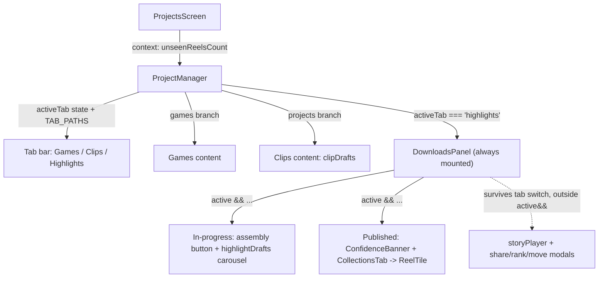
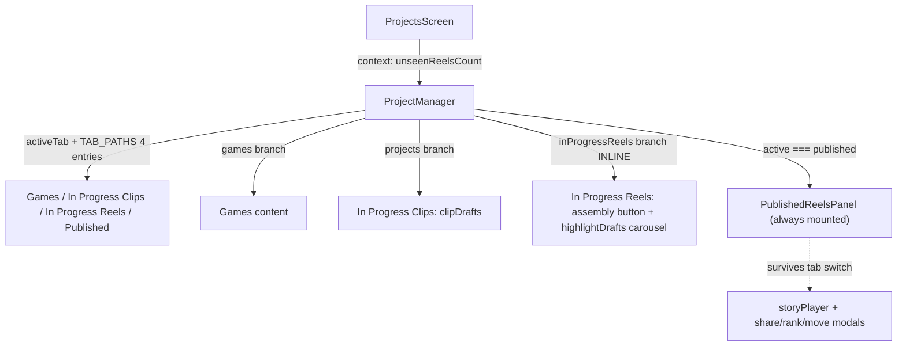

# T8555 Design — "Published" becomes its own tab; "Highlights" narrows to multiclip-only

**Status:** DRAFT — awaiting user approval at the design gate
**Tier:** L (Frontend only, design-gated)
**Author:** Architect agent
**Companion spec:** `docs/plans/tasks/T8555-ui-spec.md` (ui-designer, produced in parallel) — this
doc owns component decomposition, routing, badge wiring, state ownership and the rename sweep.
The visual layout of the 4-tab segmented control at 320px, color tokens, and badge styling are the
ui-spec's call; reference it there rather than duplicating those decisions here. Where this doc names
a color token or a `SegmentedTabButton` prop, treat the ui-spec as authoritative for the concrete value.

---

## 0. Problem in one line

`DownloadsPanel` renders TWO surfaces (in-progress multiclip drafts + the published gallery) under one
`activeTab === 'highlights'` body. T8545 promoted that combined body to a top-level tab literally labeled
"Highlights," so every published reel (single- and multi-clip origin) shows under a tab that claims to be
multiclip-only. The fix is to split the combined body into two peer tabs and relocate the published gallery
to its own tab.

---

## 1. Current State

### 1.1 Architecture (3 tabs today)



### 1.2 Verified line map (working tree, 2026-09-04)

**`ProjectManager.jsx`** (1846 lines)
- `TAB_PATHS` L374 = `{ games:'/home/games', projects:'/home/reels', highlights:'/home/highlights' }`; `tabFromPath` L378 (one map drives both directions).
- `SegmentedTabButton` L390-427 — label span FIRST (L411), icon+badge with `order-first` after (DOM-order landmine: accessible name must read `{label}{count}`). Takes `activeBg` + `activeBgDark`.
- `activeTab` state L512; `setActiveTab` L513-519 wraps setState + `history.replaceState(TAB_PATHS[tab])`.
- `clipDrafts = projects.filter(p => p.is_auto_created)` L499; `clipsTabDisabled` L506-507.
- `initialTab` L510-511 (URL-first, else clip-count default).
- Fallback-off-dead-tab effect L952-956 (`clipsTabDisabled && activeTab==='projects' -> 'games'`).
- **Publish-landing effect L964-970:** reacts to `galleryStore.isOpen`, `setActiveTab('highlights')` + `close()`. Fed by `usePublishProject.js` `galleryStore.open()` from DraftTile's publish action. This is T8400's mechanism.
- Tab bar render L1231-1264, hardcoded `grid grid-cols-3 sm:flex` (L1234). Highlights badge wired to `unseenReelsCount` L1260.
- Content ternary games/projects at L1269+ (NO highlights branch — DownloadsPanel owns it).
- `<DownloadsPanel active={activeTab==='highlights'}>` always-mounted L1730-1740.
- `showAssemblyModal` state L525; `GameClipSelectorModal` mount L1744-1750, opened via `onOpenAssembly`.

**`DownloadsPanel.jsx`** (922 lines) — the decomposition target
- `highlightDrafts = projects.filter(p => !p.is_auto_created)` L78; `draftClipCount` L82 (single-clip count for the empty-state cross-link).
- `collections = useCollections(active)` L105 — **active gate #1** (fetches summary on rising edge).
- `fetchIntroCards` effect L408-410 — **active gate #2** (fetches when active).
- `if (!active && !storyPlayer) return null` L479 — **active gate #3**.
- `{active && (...<div data-testid="highlights-tab-panel">...)}` L762-834 — **active gate #4** (wraps the ENTIRE combined body).
- Inside the body: assembly button "Create Highlight Reel" L775-787 (`onClick=onOpenAssembly`, `disabled=!hasClips`); in-progress section header + empty-state + `CardCarousel` of `DraftTile` L789-815; `ConfidenceBanner` L817-820; `CollectionsTab` (renders `renderDownloadCard` -> `ReelTile`) L821-832.
- **State that survives a tab switch (rendered OUTSIDE `active &&`, at fragment top level):** `storyPlayer` (L116, mount L896-916), share/move/rank modals `sharingDownload`/`sharingCollection`/`introCollectionTarget`/`movingIds`/`showRankingGame` (mounts L837-886). All published-reel action handlers (`handlePlay`/`Download`/`Delete`/`webShareReel`/`copyReelLink`/`renameReel`/`handleSetIntro`/`handleBeforeAfter`/`handleReRank`/`handleOpenProject`, `renderDownloadCard` L726-758) are **published** concerns.

**Supporting**
- `ProjectsScreen.jsx` L141 `unseenReelsCount = useGalleryStore(s => s.unwatchedCount)`, passed via `appStateValue.unseenReelsCount` L426 (context, not explicit prop). Badge source is tab-agnostic — relocation is a 1-line change at ProjectManager L1260.
- `displayNames.js`: `SECTION_NAMES = { CLIPS:'Clips', CLIPS_LOWER, HIGHLIGHTS:'Highlights', HIGHLIGHTS_LOWER, LIBRARY:'Highlight Reels' }`. LIBRARY is used by non-tab surfaces (publish button, export toasts, GalleryButton, quests).
- `themeColors.js`: `GAME` (green, full), `REEL` (cyan, full), `HIGHLIGHT` (violet, only `{bg,bgDark}` — T8545 tab-only). No 4th token yet. `SegmentedTabButton` needs only `activeBg`+`activeBgDark`.
- `galleryStore.js` + `useCollections.js`: NO "must be inside Highlights tab" assumption. `isOpen` is a tab-agnostic fire-once nav signal; `useCollections`'s only coupling is the `isActive` param driving summary fetch on the rising edge — must be rewired to the Published tab's active flag.

### 1.3 Code smells in the current structure

| Smell | Location | Impact |
|-------|----------|--------|
| One component, two responsibilities | `DownloadsPanel` renders in-progress AND published | The bug: published leaked under the "Highlights" label; can't tab them independently |
| Single flag gates four things | `active` at L105/408/479/762 | Splitting requires threading the RIGHT active flag to each — a mechanical hazard |
| Label/id mismatch (pre-existing) | tab id `projects` renders label "Clips" | Confusing but load-bearing (URL `/home/reels`); do not "fix" the id or the URL breaks deep links |
| Hardcoded `grid-cols-3` | ProjectManager L1234 | Must become 4-up; ui-spec owns the responsive layout |

---

## 2. Target State (4-tab IA)



Four peer tabs. In Progress Reels renders inline in ProjectManager's content region (no surviving-state
requirement). Published becomes a renamed, thinned `DownloadsPanel` that keeps its always-mounted
survivor state.

### Tab registry (id / label / URL)

| Position | Tab id | Label (SECTION_NAMES) | URL path | Content |
|---|---|---|---|---|
| 1 | `games` | "Games" | `/home/games` | unchanged |
| 2 | `projects` | "In Progress Clips" | `/home/reels` | unchanged (`clipDrafts`, `is_auto_created===true`). id + URL frozen for deep-link compat |
| 3 | `inProgressReels` | "In Progress Reels" | `/home/reels-in-progress` | `highlightDrafts` (`is_auto_created===false`) + assembly button ONLY |
| 4 | `published` | "Published" | `/home/published` | every published reel (unchanged gallery behavior) |

**Decision — rename the `highlights` id to `inProgressReels`.** The `highlights` id no longer describes
its content (it is now in-progress reels, not the published gallery). Greppability beats churn-avoidance
here: after this task, a repo-wide grep for `'highlights'` as a tab id should return zero, which is one of
the acceptance criteria (the underlying `is_auto_created` concept is untouched). `projects`/`/home/reels`
STAY as-is despite the label mismatch — changing them breaks every existing `/home/reels` deep link and
the `initialTab`/fallback logic keyed on `'projects'`, for zero user-visible gain.

**URL choice for Published:** `/home/published` (clear, matches the tab). **In Progress Reels:**
`/home/reels-in-progress`. Both are new paths with no existing deep links to preserve. (Open to the
ui-designer/user if a shorter slug is preferred — non-load-bearing.)

---

## 3. Implementation Plan

### 3.1 Component split — the core architecture call

**Decision:** asymmetric split, justified by the surviving-state requirement.

- **Published surface → `PublishedReelsPanel`** (rename `DownloadsPanel.jsx`). Keep ~90% of the file:
  all reel action handlers, `useCollections`, `useIntroCards`, the story player, and every share/rank/move
  modal. It STAYS always-mounted in ProjectManager and STAYS gated on an `active` prop — because its
  story-player/modal state must survive a tab switch (a user mid-playback who taps another tab must return
  to the same player). Only ONE change to its body: **delete the in-progress block (assembly button +
  highlightDrafts section, L771-815)** — it moves out. The `active` flag it reads becomes
  `activeTab === 'published'`.

- **In Progress Reels → inline branch in ProjectManager's content ternary** (NOT a separate always-mounted
  component). Rationale: this surface is `highlightDrafts` (from `projectsStore.projects`, already in
  ProjectManager) + the assembly button (`onOpenAssembly`/`showAssemblyModal`, already ProjectManager-local
  since T8545) + a `DraftTile` carousel. It holds **no state that must survive a tab switch** — the
  assembly modal lives in ProjectManager, not the surface. So it belongs inline as a new branch alongside
  the existing games/projects branches, conditionally rendered (`activeTab === 'inProgressReels'`), same
  shape as the Clips branch. A separate always-mounted component would add an unnecessary mount + prop
  wiring for a surface with nothing to preserve.

**DRY check — no duplicated published-list rendering.** The published list (`ConfidenceBanner` +
`CollectionsTab` + `renderDownloadCard`/`ReelTile`) lives in exactly ONE place after the split
(`PublishedReelsPanel`). The In Progress Reels branch renders ONLY `DraftTile`s (a different component,
already used on the Clips tab). Zero rendering logic is copied. The `highlightDrafts` filter is computed
ONCE in ProjectManager (see §3.3) and no longer in the panel.

**How the four `active` gates split:**

| Gate | Today (DownloadsPanel) | After |
|---|---|---|
| #1 `useCollections(active)` L105 | `active = activeTab==='highlights'` | `PublishedReelsPanel`, `active = activeTab==='published'` |
| #2 `fetchIntroCards` when active L408 | same | `PublishedReelsPanel`, same `published` flag |
| #3 `if (!active && !storyPlayer) return null` L479 | same | `PublishedReelsPanel`, same `published` flag (survivor exemption preserved) |
| #4 `{active && (body)}` L762 | wraps combined body | `PublishedReelsPanel`, wraps published-only body |

All four stay in the ONE published panel and all four read the SAME new `published` active flag. The
In Progress Reels surface has no `active`-gate concept at all — it is conditionally rendered by the content
ternary, so it simply isn't in the tree when inactive. This removes the "one flag gates four things across
two surfaces" smell entirely: after the split, all four gates guard a single-responsibility component.

### 3.2 Before / after structure sketch (ProjectManager render)

```pseudo
// BEFORE
<tabBar cols-3: Games | Clips | Highlights(unseenReelsCount) />
{activeTab==='games'   && <GamesContent/>}
{activeTab==='projects'&& <ClipsContent clipDrafts/>}
<DownloadsPanel active={activeTab==='highlights'} .../>   // always mounted, renders BOTH surfaces
<GameClipSelectorModal .../>

// AFTER
<tabBar cols-4:
   Games(games.length)
 | InProgressClips(clipDrafts.length)          // id 'projects'
 | InProgressReels(highlightDrafts.length)     // id 'inProgressReels'   <- NEW badge
 | Published(unseenReelsCount) />              // id 'published'          <- badge MOVED here
{activeTab==='games'          && <GamesContent/>}
{activeTab==='projects'       && <ClipsContent clipDrafts/>}
{activeTab==='inProgressReels'&& (             // NEW inline branch, conditionally rendered
   <div>
     <AssemblyButton disabled={!hasClips} onClick={()=>setShowAssemblyModal(true)}/>
     {highlightDrafts.length===0
        ? <EmptyState/>
        : <CardCarousel>{highlightDrafts.map(p => <DraftTile .../>)}</CardCarousel>}
   </div>
)}
<PublishedReelsPanel active={activeTab==='published'} .../>  // always mounted, published ONLY
<GameClipSelectorModal .../>                                 // unchanged, still ProjectManager-local
```

The In Progress Reels JSX is the block MOVED verbatim out of DownloadsPanel L771-815 (a mechanical code
move per refactoring rule #3), re-parented into ProjectManager and re-wired to ProjectManager-local
`highlightDrafts`/`hasClips`/`setShowAssemblyModal`. `hasClips` already exists in ProjectManager (L477).

### 3.3 Badge wiring

| Tab | Badge source | Change |
|---|---|---|
| Games | `games.length` | unchanged |
| In Progress Clips | `clipDrafts.length` | unchanged |
| In Progress Reels | `highlightDrafts.length` | **NEW** — compute `highlightDrafts = projects.filter(p => !p.is_auto_created)` in ProjectManager next to `clipDrafts` (L499). Single source = `projectsStore.projects`; do NOT lift state, do NOT keep it in DownloadsPanel too (the panel no longer needs it after the in-progress block moves out) |
| Published | `unseenReelsCount` | **MOVED** from the old Highlights badge (L1260). Source (`ProjectsScreen` context) is already tab-agnostic — a 1-line change of which button the value feeds |

`highlightDrafts` currently lives at `DownloadsPanel.jsx:78`. After the split its only consumer (the
in-progress block) moves to ProjectManager, so the filter moves with it — no duplication, one home.

### 3.4 Routing

- Add two entries to `TAB_PATHS` (L374): `inProgressReels: '/home/reels-in-progress'`, `published: '/home/published'`. The single-map invariant (one entry per tab, both directions derived) means nothing else changes for routing — `tabFromPath` and `setActiveTab` already read the map generically.
- `initialTab` (L510-511) and the fallback-off-dead-tab effect (L952-956) reference `'projects'`/`'games'` only — unchanged.

### 3.5 Publish-landing effect (T8400 hook)

Retarget L964-970: `setActiveTab('highlights')` -> `setActiveTab('published')`. A published draft lands the
user on the Published tab (where the reel now lives), preserving T8400's intent under the new IA.
**Downstream dependency — do NOT implement here:** T8400 ("publish lands on reel") is a separate held task
that must be designed against THIS 4-tab structure. This task only keeps the existing fire-once
`galleryStore.isOpen` mechanism pointing at the correct tab; any richer "land on the specific reel"
behavior is T8400's scope. Flag in Risks.

### 3.6 useCollections `isActive` rewire

`useCollections(active)` is called once, in `PublishedReelsPanel` (formerly DownloadsPanel L105). After the
rename its `active` prop = `activeTab === 'published'`. Confirmed: `useCollections`/`galleryStore` carry no
"Highlights tab" assumption — `isActive` only drives the rising-edge summary fetch + version refetch, which
now fires when the Published tab activates. No change inside the hook or store.

### 3.7 Color token

`SegmentedTabButton` needs `activeBg` + `activeBgDark` per tab. Four tabs, three tokens today
(`GAME`, `REEL`, `HIGHLIGHT`). **The 4th token (Published) is the ui-spec's decision** — it owns color.
This doc's only constraint: whatever token Published uses must expose `bg` + `bgDark` keys (like `HIGHLIGHT`).
Reusing `HIGHLIGHT` (violet) for In Progress Reels and adding one new token for Published is the likely
shape, but defer to `T8555-ui-spec.md`.

---

## 4. Rename Sweep Plan (grep-driven checklist — one commit, code + docs)

Per the doc-code-consistency rule, code + every doc/task file quoting the old tab naming ship together.
The e2e blast radius is the dominant cost. Give the implementor a grep checklist, not a hand-typed file
list — the sets below are the ground truth as of 2026-09-04 (verify counts at implementation time).

### 4.1 Config

- `displayNames.js` `SECTION_NAMES`: the labels are the source of truth. Proposed:
  - `CLIPS: 'In Progress Clips'` (was `'Clips'`) — plus `CLIPS_LOWER` if still referenced.
  - `HIGHLIGHTS: 'In Progress Reels'` (was `'Highlights'`) — plus `HIGHLIGHTS_LOWER`.
  - Add `PUBLISHED: 'Published'`.
  - **`LIBRARY: 'Highlight Reels'` STAYS** — it names the published-reels *noun* used by non-tab surfaces
    (publish button, export toasts, GalleryButton, quests), NOT the tab. Renaming it is out of scope and
    would bleed into surfaces this task doesn't touch. (Argue the opposite only if the user retires
    "Highlight Reels" as a product noun — not indicated by the task.)
  - Renaming the KEYS (e.g. `HIGHLIGHTS -> IN_PROGRESS_REELS`) is optional cleanup; the SECTION_NAMES key
    is internal. Recommend keeping keys stable to shrink the diff unless the Reviewer prefers key rename
    for greppability — flag as a minor call, not blocking.

### 4.2 testids

- `data-testid="highlights-tab-panel"` (DownloadsPanel L770) → rename to `published-tab-panel` (it now
  scopes published-only content). Grep all e2e for the old string.
- The In Progress Reels inline branch needs its OWN testid, e.g. `in-progress-reels-tab-panel`, for e2e
  scoping (the old combined panel had one; the new inline surface needs one too).

### 4.3 Grep checklist for the implementor (run each, curate results)

```
# Tab id / routing / URL
rg "'highlights'"                         src/frontend/src   # tab id -> 'inProgressReels' or 'published' per context
rg "activeTab === 'highlights'"           src/frontend
rg "/home/highlights"                     src/frontend docs
rg "highlights-tab-panel"                 src/frontend        # -> published-tab-panel

# Labels / copy
rg -i "Highlight Reels"                    src/frontend docs   # DISTINGUISH tab-label uses (rename) from LIBRARY-noun uses (keep)
rg -i "Create Highlight Reel"              src/frontend docs   # assembly button — SEE OPEN QUESTION §5 before touching
rg "SECTION_NAMES\.(CLIPS|HIGHLIGHTS)"     src/frontend
```

- **src blast radius (verified): 16 files** contain the target strings — `ProjectManager.jsx`,
  `DownloadsPanel.jsx`, `displayNames.js`, `themeColors.js`, `usePublishProject.js`, `useMoveReels.js`,
  `storageUrls.js`, `CollectionPlayer.jsx`, `RecapPlayerModal.jsx`, `LockedReasonModal.jsx`, and the
  `.test.jsx` files (`ProjectManager.publishRetry`, `ProjectManager.homeTabDefaults`, `CollectionPlayer`,
  `ExportButtonView`, `DraftTile`, `DraftReelPreview`). Each hit must be triaged: TAB reference (rename)
  vs `is_auto_created`/`LIBRARY`-noun/gallery-store reference (leave). NOT every hit is a rename.
- **e2e blast radius (verified): 46 spec files, 172 occurrences.** This is the dominant cost. Every spec
  asserting the "Highlights" tab text, the `highlights-tab-panel` testid, or navigating to
  `/home/highlights` must be repointed. Because the surface SPLIT (a spec that used to find a published
  reel "in the Highlights tab" must now look in the Published tab; a spec finding an in-progress draft must
  look in In Progress Reels), this is NOT a blind find-replace — each spec needs its assertion re-homed to
  the correct one of the two new tabs. The Reviewer must confirm completeness via repo-wide grep, per the
  kickoff and AC.

### 4.4 Docs / knowledge sweep

- `.claude/knowledge/annotate.md` — update the T8545 IA entries (top of file, L9-50 + the T8360/T8470
  entries) to describe the 4-tab IA. Add a T8555 entry recording the DownloadsPanel→PublishedReelsPanel
  rename, the inline In Progress Reels branch, the badge relocation, and the new testids. Per kickoff this
  is part of the rename sweep (one commit), not a separate Stage-7 step.
- Task/plan docs quoting "Highlights"/"Highlight Reels" as a TAB name: `PLAN.md`, EPIC files under
  `first-reel-funnel/`, `T8545-*.md`, `T8360-design.md`, `T8470-*.md`, `T8130`'s naming table, `T7620-design.md`.
  Grep `docs -i "Highlights tab"` and `docs -i "Highlight Reels tab"`; leave historical descriptions of
  shipped tasks intact where they describe past state, but any FORWARD-looking reference to the current tab
  naming must update.

---

## 5. Risks & Open Questions

### RESOLVED at the gate (2026-09-04) — assembly button copy = **"New Highlight Reel"**

The user chose a THIRD option at the gate: **"New Highlight Reel"** (not the shipped "Create Highlight
Reel", not the "Build New Reel" phrasing). Sweep sites (all must read "New Highlight Reel"):
- Button label: `DownloadsPanel.jsx:785` (moves to ProjectManager's inline In Progress Reels branch — rename at the new site).
- Empty-state copy: `DownloadsPanel.jsx:797-798` (the promoted centered empty-state block — reference the new label).
- Any e2e asserting the button text (grep `rg -i "Create Highlight Reel" src/frontend`).
- `GameClipSelectorModal` title/heading if it echoes the phrase.

### RESOLVED at the gate — remaining ui-spec choices
- Full icon set approved: Games `Gamepad2` / In Progress Clips `Scissors` / In Progress Reels `Clapperboard` / Published `Send`.
- `grid-cols-4` + two-line-wrap layout, PUBLISHED amber token, In Progress Reels empty-state promoted to the centered block — all approved.
- **`tailwind.config.js` does NOT define an `xs` breakpoint** (verified) → use the ui-spec fallback `text-[10px] sm:text-sm` (drop the `xs:` step).

### Implementation addendum (live QA finding, 2026-09-04)
Live-drive QA on the real account caught a deep-link bug NOT in the original plan: `editorStore.js`'s
cold-load URL canonicalization (`HOME_TAB_PATHS`, consumed at line ~387) collapses any `/home/*` path
not in its whitelist to `/home`, dropping the tab before ProjectManager reads it. The whitelist only had
`/home/games` + `/home/reels`, so `/home/published` and `/home/reels-in-progress` deep links bounced to
the default tab (this was ALSO a latent bug for T8545's `/home/highlights`). **Fix:** added both new
routes to `HOME_TAB_PATHS` (must stay in lockstep with ProjectManager's `TAB_PATHS`); covered by
`editorStore.test.js` and the live `e2e/T8555-four-tab-split.qa.spec.js` deep-link assertion.

### Risks

| Risk | Mitigation |
|---|---|
| **42+ e2e spec sweep** (verified 46 files / 172 hits) — the dominant cost; a split (not just a rename) so each spec must be re-homed to the correct new tab, not blind-replaced | Tester Phase 1 writes the 4-tab navigation + badge-relocation failing tests first; Reviewer gates on repo-wide grep proving zero stale `'highlights'` tab refs; live QA drives all four tabs (kickoff QA phase) |
| **T8400 downstream** — publish-landing must be designed against THIS 4-tab structure | This task only retargets the existing effect to `'published'` (§3.5). T8400 stays held; note it depends on this structure. Do NOT implement richer landing here |
| **T8390 landing/close** re-verify — `openFinishedReel` doesn't set `activeTab`; what's underneath the preview post-close changes under 4 tabs | Out of scope (T8400/T8390 own it); call out for the QA pass so the manual tester checks it |
| Threading the wrong `active` flag to one of the 4 published gates | All 4 gates stay in ONE component reading ONE `published` flag (§3.1) — structurally can't diverge |
| Accessible-name DOM-order landmine on the new/4th button | `SegmentedTabButton` is unchanged (label-first DOM order preserved); reusing it for all 4 tabs inherits the fix |
| Renaming `LIBRARY` noun by mistake during the sweep | Explicit triage rule (§4.1): `LIBRARY` = non-tab noun, KEEP; only tab-label/tab-id/testid strings rename |
| Deep-link breakage from renaming `projects` id / `/home/reels` | Explicitly NOT renamed (§2) — id + URL frozen |
| 320px 4-tab layout harder than T8545's 3-tab | ui-spec (`T8555-ui-spec.md`) owns it; this doc defers all visual layout there |

---

## 6. Design Checklist

- [x] DRY: published-list rendering lives in exactly one component; `highlightDrafts` filter has one home
- [x] Single code path: in-progress reels rendered one way (inline branch); published one way (panel)
- [x] Minimal branches: 4 gates collapse onto one `published` flag in one component
- [x] MVC: ProjectManager (container) owns tab state + `highlightDrafts`/`clipDrafts` derivation; panels/branches are presentational, data guarded by the container
- [x] No reactive persistence: `activeTab` stays local UI state, URL via `replaceState` only (no DB write)
- [x] Greppability: `highlights` tab id retired; sweep AC enforces zero stale refs
- [x] Code motion separated from behavior change: In Progress Reels block is a mechanical move
- [x] User approval at the design gate (2026-09-04): button copy = "New Highlight Reel"; full icon set; grid-cols-4; amber PUBLISHED; xs breakpoint absent → text-[10px] sm:text-sm
- [x] ui-spec (`T8555-ui-spec.md`) approved in parallel for the 4-tab layout + color token
