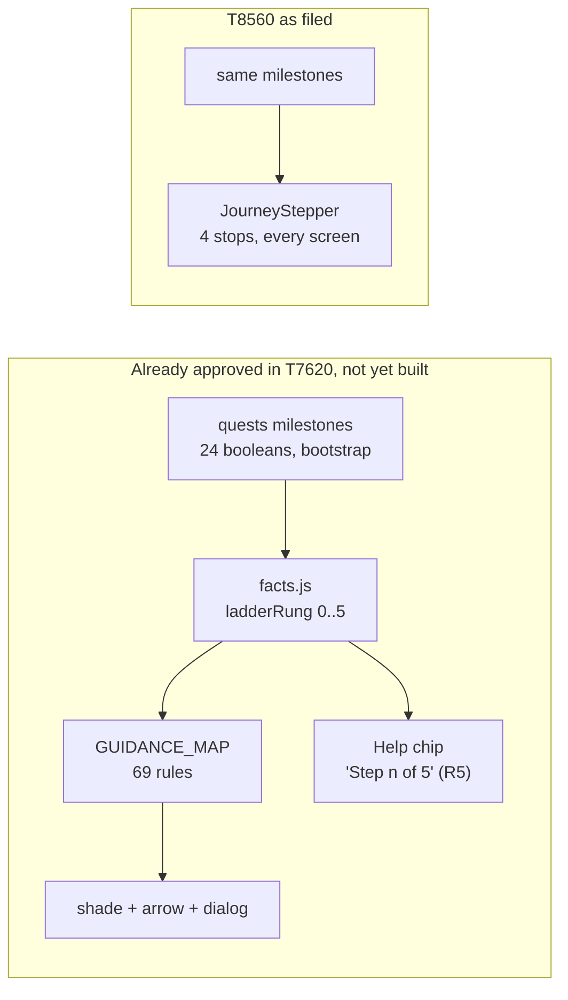
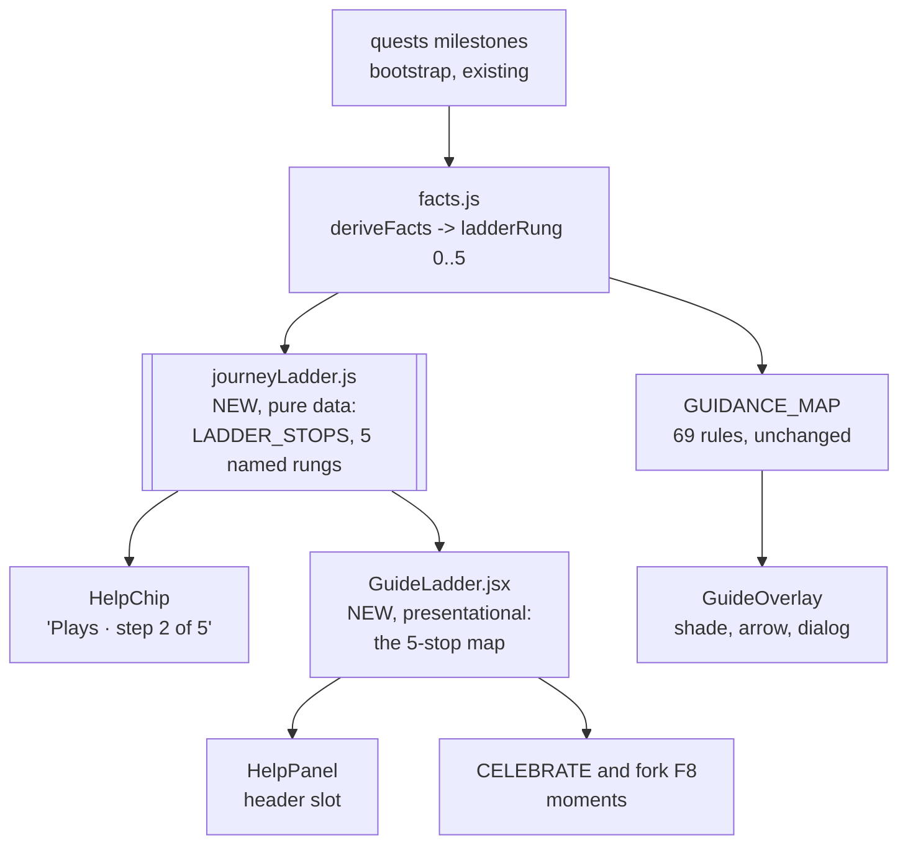

# T8560 Design: the persistent journey map, and why it must be one system

**Task:** [T8560](first-reel-funnel/T8560-journey-stepper-design.md)
**Epic:** [First Reel Funnel](first-reel-funnel/EPIC.md)
**Status:** PROPOSED. Needs user approval before anything is built or closed.
**Author:** Architect agent
**Date:** 2026-09-03

---

## 0. Verdict up front

**Recommendation: do not build a standalone journey stepper. Fold it into the guided-help
engine and close T8560 as FOLDED.**

This is not "close it, the idea was wrong". The idea is right, and the product needs it. The
finding is that **the thing T8560 asks for is already approved and already scoped**, in
[T7620's design](T7620-design.md), as the five-rung goal ladder plus recommendation R5 ("the
chip shows Step n of 5"). What T8560 adds on top of that approved design is genuinely small
and genuinely valuable: the ladder's rungs should have **names**, and the user should be able
to see **the whole map**, not just a counter. That residue is worth about one pure data array
and one presentational component, and it belongs inside the guide module beside the ladder it
renders.

Building it as a second, independently mounted, independently derived surface would put two
always-on components on every screen, both answering "where am I", both derived from the same
milestones, each able to word the answer differently. That is the exact failure this epic
exists to kill: T8470 was filed because one reel had three status stories on three surfaces in
one session. Shipping a second orientation system inside the epic whose binding constraint is
"one status story" would contradict the epic.

**What I need from you is one of two answers**, both fully specified below:

| Answer | Meaning | What happens next |
|---|---|---|
| **"Fold"** (recommended) | Section 3 becomes a Round 3 amendment to the approved T7620 design and joins T7630's build scope. T8560 closes as FOLDED, zero product code in this task. | I edit T7620-design.md and T7630's task file, close T8560 in PLAN.md and EPIC.md. Nothing ships in this epic. |
| **"Build it"** | Section 5's Option A is the design. T8560 stays open as an implementation task inside this epic. | I implement Option A, and T7630 is bound to consume its ladder module rather than fork one. |

Section 4 answers the task file's five design questions under **both** answers, so neither
branch leaves an open spec.

---

## 1. Current state analysis

### 1.1 Everything that already tells a user "where am I"

There are five, today, before any of this epic's remaining tasks land.

| Surface | Scope of the answer | Where | Persistent? |
|---|---|---|---|
| **Quest chip** (`QuestPanel.jsx`, collapsed form from T8120) | Account. Title plus "2/5" over the active quest's steps | Mounted twice in `App.jsx`: `inline` after home content (L870) and floating over the editor (L1010) | Yes, every screen, both mounts |
| **ModeSwitcher** tabs | The current reel. Which of Annotate / Focus / Overlay you are on, and which are reachable | `UnifiedHeader.jsx` L54 (mobile) and L93 (desktop) | Only on editor screens |
| **Draft stage label** (`draftStage.js` `DRAFT_STAGE_LABELS`, T8470) | One reel. Draft / Draft in Focus / Draft in Overlay / Ready to share | `DraftTile` chip, group headers, phase filter, continue card | Only on the Clips tab |
| **SegmentedProgressStrip** (T7790b, T5672 slim variant) | One reel, per stage, clickable deep link into Focus or Overlay | `DraftTile`, full and slim variants | Only on the Clips tab |
| **Home tabs plus counts** | Account inventory. Games count, Clips count, Highlight Reels | `ProjectManager.jsx` L1194 onward | Only on home |

Two of these are account-scoped and cross-screen (the quest chip is the only truly persistent
one). Three are reel-scoped and live where the reel lives.

### 1.2 What T7620 already approved (2026-09-02)

The guided-help design is not a tour in the front-loaded sense. Its spine is:

- **A five-rung goal ladder** (T7620 section 3): L1 a game or clip is in the app, L2 a play is
  captured, L3 the clip is framed and exported, L4 the reel is published, L5 the reel is
  shared. Every rule declares its rung; the engine always serves the lowest incomplete rung.
- **Derived, never stored** (T7620 section 11.2, decision D3): `facts.ladderRung` is computed
  from the 24 milestone booleans `_check_all_steps` already ships on `/api/bootstrap`. No new
  state, no bookmark.
- **A visible gradient** (T7620 section 3 rule 3, recommendation R5, marked IN SCOPE): the
  Help chip shows "Step n of 5" while the ladder is incomplete. This explicitly replaces the
  quest chip's count slot.
- **Persistent, cross-screen, always mounted**: `GuideRoot` mounts once in `App.jsx`, replacing
  `<QuestPanel />`, and the chip renders on every screen it is not deliberately suppressed on.
- **Default ON for accounts that have not published a reel, OFF for accounts that have**
  (decision D1).



The two boxes read the same inputs, mount in the same place, run at the same time, for the same
audience, and answer the same question.

### 1.3 Code smells that a standalone stepper would create

| Smell | Where it would land | Impact |
|---|---|---|
| **Two derivations of one truth** | `JourneyStepper`'s own stop derivation beside `facts.ladderRung` | Two on-screen answers to "where am I" that can disagree. This is the T8470 defect class, reintroduced |
| **Two numbering systems for one journey** | Stepper "2 of 4" beside the chip's "Step 3 of 5" | Visible contradiction; the guide's monotonicity test proves nothing about the stepper |
| **Two persistent chrome components with identical suppression needs** | Modal occlusion, `shared_annotation_flow`, admin routes, sign-in, keyboard-open | T8120 already found three real bugs in one occlusion implementation. A second one doubles that surface |
| **Guaranteed rework inside one epic boundary** | T8560 ships before T7630; T7630 either deletes the stepper or wires around it | Refactoring rule 4 (keep units small) and rule 3 (moves are mechanical) both argue against building then unbuilding |
| **New vocabulary for named screens** | "Mark Plays" for a screen already labelled "Annotate" (`SCREENS.ANNOTATE.label`), "Upload" for a gesture already labelled "Add Game" | The epic's binding constraint forbids introducing nouns; the four proposed stop labels include two new coinages |

### 1.4 Current behavior, in pseudo code

```pseudo
user lands on any screen:
    QuestPanel chip shows "<active quest title>  2/5"      // account-scoped, no screen awareness
    ModeSwitcher shows which editor tab is reachable       // reel-scoped, editor screens only
    DraftTile shows Draft / in Focus / Ready to share      // reel-scoped, Clips tab only
    nothing anywhere names the journey or its remaining stops

after T7630 (approved, not built):
    Help chip shows "<current step label>  Step 3 of 5"    // account-scoped, screen aware
    an arrow points at the next control on this screen
    still nothing shows the WHOLE map                      // <-- the real residue T8560 names
```

---

## 2. The coexistence question, answered

### 2.1 The test: do they solve the same problem?

The task file frames the two as different problems, "persistent orientation versus first-run
instruction". That framing is correct about the two *mechanisms* (a map is not an arrow) and
incorrect about the two *systems as designed*, because T7620's system already contains a
persistent orientation component. Applying four discriminators:

| Discriminator | Journey stepper (T8560) | Guided help (T7620) | Same? |
|---|---|---|---|
| Input data | Milestones: has a game, has a play, has a reel, has shared | The same milestones, via `facts.ladderRung` | **Same** |
| Audience | Accounts before their first reel (task file's own guess, question 4) | Default ON exactly for accounts that have not published (D1) | **Same** |
| Lifetime | Persistent, every screen, until the first reel exists | Chip is persistent, every screen; gradient text shows while the ladder is incomplete | **Same** |
| Message | "You are at stop 2 of 4, next is Focus" | "Step 2 of 5" plus an arrow at the next control | **Same information, less of it** |

Four out of four. The stepper is not a different system; it is a **richer rendering of the
guide's ladder**. That is a fold, not a coexistence.

### 2.2 The failures the stepper was proposed to fix are each already owned

The stepper was the UX expert's generalized remedy for four concrete walkthrough failures. Each
of those four now has a dedicated task in this same epic.

| Walkthrough failure | Owner | Status |
|---|---|---|
| Focus tab stayed locked after a reel existed | T8480 (selects the new project so `ModeSwitcher.hasProject` flips; tappable toast) | STAGING |
| The reel was invisible ("Reel created" / "Not Started" / "No reels yet") | T8470 (one Draft / Shared vocabulary in `draftStage.js`, drafts visible in the drawer) | STAGING |
| Overlay arrived as a surprise stage | T8520 (Overlay becomes an explicit offer with a skip path) | TODO, in this epic |
| Move to Highlight Reels was a manual mystery gesture | T8530 (one-tap publish on completion) | TODO, in this epic |

A stepper would not have fixed any of the four. It would have *labelled* them: the user would
have seen "you are at stop 3" while the Focus tab stayed locked. Orientation chrome cannot
substitute for a working path, and once the path works, the marginal value of the chrome drops
sharply. The stepper's remaining job is the honest one: **teach the shape of the journey to
someone who has never done it**. That is precisely the guide's job description.

### 2.3 What is genuinely left over

Two things in T8560 are real and are **not** covered by the approved T7620 design:

1. **The rungs have no names.** "Step 3 of 5" is an anonymous counter. A user who has never
   made a reel cannot infer what step 3 is, what step 4 will be, or that there are only five.
   Goal-gradient motivation needs the destination to be legible, not just countable.
2. **There is no map.** Nothing renders all five stops at once, so a user can never see the
   whole path, only their position on it.

Both are display concerns over data that already exists. Neither needs new state, a new mount
point, a new derivation, or a new suppression contract.

### 2.4 Verdict

> **The stepper and the guided tour do not layer. The stepper IS the guide's ladder, drawn.
> Fold T8560's substance into T7620/T7630 as a named, mappable rendering of the existing five
> rungs, and close T8560 as FOLDED.**

---

## 3. Target architecture (the fold)

### 3.1 Diagram



One derivation (`facts.ladderRung`), one data array (`LADDER_STOPS`), two render sites that
both read it, zero new mounts, zero new state, zero new API surface.

### 3.2 The three amendments to the approved T7620 design

Filed as **Round 3** in `docs/plans/tasks/T7620-design.md`, and added to T7630's build scope.

| # | Amendment | Replaces | Cost |
|---|---|---|---|
| **A1** | The five ladder rungs get **names**, in one pure array `guide/journeyLadder.js` exporting `LADDER_STOPS = [{ rung, label, chipLabel }]`. The chip renders "`{stop.label}` step n of 5" instead of a bare counter. | T7620 R5's bare "Step n of 5" | One data file, one string change in `HelpChip` |
| **A2** | The Help panel opens onto **the map**: a new presentational `guide/GuideLadder.jsx` renders all five stops with done / current / remaining state, driven purely by `facts.ladderRung`. It is the panel's header on every screen, and it is the visual used by the CELEBRATE rule and fork F8. | Nothing. The panel today opens onto a menu with no orientation header | One presentational component, no logic |
| **A3** | **No second mount, no new chrome row.** The ladder never renders into `UnifiedHeader`, `ModeSwitcher`, or `ProjectManager`'s tab strip. Persistent orientation is delivered by the chip's named label; the full map is one tap away, inside the surface that already exists. | The task file's suggested `ModeSwitcher` mount point | Zero. This is a constraint, not code |

Test obligations, added to T7630's existing list:

| Test | Proves |
|---|---|
| `journeyLadder.test.js` | `LADDER_STOPS` has exactly five entries, one per rung, in ascending rung order; every label is drawn from the locked vocabulary set (see 3.3); no stop label is a new coinage |
| `guideLadder.render.test.jsx` | Given `ladderRung = n`, exactly n stops render done, one renders current, the rest remaining; at `ladderComplete` no stop renders current |
| `placement.test.js` (extended) | The map lays out vertically below 384px and never exceeds the panel's usable width at 320 |

### 3.3 The five stops, and the vocabulary reconciliation

The expert's four proposed labels (Upload, Mark Plays, Focus, Share) fail the epic's binding
vocabulary constraint on two counts: "Upload" and "Mark Plays" are new coinages for gestures
and screens that already have locked names, and collapsing to four stops hides L4 (publish),
which is a real rung the engine's monotonicity test binds to. Two numberings for one journey is
the same defect as two derivations.

**Proposed stops, all five, every label already shipped:**

| Rung | Stop label | Chip label | Provenance of the word | Complete when |
|---|---|---|---|---|
| L1 | **Game** | Add your game | Home Games tab, "Add Game" button | `hasGame` |
| L2 | **Plays** | Add a play | T8130 locked noun, "Add Play" CTA | `clipCount >= 1` |
| L3 | **Focus** | Frame and export | `SCREENS.FRAMING.label`, ModeSwitcher tab, T7580 naming | `hasWorkingVideo` |
| L4 | **Highlight Reel** | Publish your reel | T8130 locked noun, `SECTION_NAMES.LIBRARY` | `hasPublishedReel` |
| L5 | **Share** | Share it | Share dialog, T8540's player button | `hasShared` |

Overlay is deliberately absent, matching T7620 section 3 rule 2 and T8520: the spotlight is an
optional branch between L3 and L4, never a stop on the map.

At 320px the chip carries one stop label, not five. Nothing in this design ever asks five labels
to sit side by side in a 320px row.

### 3.4 Rendering

```
Persistent, every screen (the chip, already mounted by GuideRoot):

   +--------------------------------+
   |  ?  Plays   ·   step 2 of 5    |     one line, one stop name, ~180px wide
   +--------------------------------+

One tap (the Help panel, existing surface). Desktop and >=384px:

   ( 1 )----( 2 )----( 3 )----( 4 )----( 5 )
    Game    Plays    Focus   Reel    Share
    done    HERE

Below 384px the same component stacks vertically, which is the standard mobile
stepper answer and needs no horizontal budget at all:

   [x]  Game
   [>]  Plays          <- you are here
   [ ]  Focus
   [ ]  Highlight Reel
   [ ]  Share
```

### 3.5 What does not change

- No new persisted state. The ladder is derived (T7620 D3, and the house rule against storing
  derivable state).
- No new endpoint, no schema change, no migration.
- No new mount point, no new occlusion contract, no new z rung.
- `ModeSwitcher`, `UnifiedHeader`, `ProjectManager`, `DraftTile`, `SegmentedProgressStrip` and
  `draftStage.js` are all untouched. Per-reel progress stays exactly where it lives today.
- T7620's 69 rules, forks, advanced tier, and engagement posture are unchanged. The amendment
  touches only how the ladder is labelled and drawn.

---

## 4. The task file's five design questions, answered

**Q1. Coexistence verdict.** Fold. Section 2. The two systems share input, audience, lifetime
and message; the stepper is the ladder drawn, so it ships inside the guide module or not at
all.

**Q2. Which stops, and what entity does it track on a multi-reel account?**
Five stops (3.3). The entity is **the account's first-reel journey, never a specific reel.**
Reasoning, and it holds under either answer:

- Every rung is derived from account-level "ever" milestones (`hasGame`, `clipCount`,
  `hasWorkingVideo`, `hasPublishedReel`, `hasShared`). None of them is per-reel.
- There is no durable "active reel" to track. `projectsStore.selectedProjectId` is in-memory
  editor selection that resets on reload (`projectsStore.js` L27, L272), and a user legitimately
  holds many single-clip drafts on the Clips tab (`clipDrafts`, `ProjectManager.jsx` L456) plus
  multi-clip Highlights in the drawer. Inventing a persisted "current journey reel" would be new
  redundant state, which both the house rules and this epic forbid.
- Per-reel progress is already answered, twice, by surfaces that own it:
  `DRAFT_STAGE_LABELS` (Draft / Draft in Focus / Draft in Overlay / Ready to share) and
  `SegmentedProgressStrip`, both on the tile, both already clickable deep links.

So the map answers "have I ever done this loop, and what is left of it", and the tile answers
"how far is this particular reel". Two different questions, two surfaces that already exist,
no overlap.

**Q3. Mobile presentation at 320px.** The map is never horizontal chrome. Persistent
orientation at 320px is the chip's single stop name; the full map stacks vertically inside the
panel. Concretely, the mobile header is already a single 40px row carrying a back arrow, a
truncated title, `CreditBalance` in Focus, and three ModeSwitcher icons with their labels
hidden below 640px (`UnifiedHeader.jsx` L41 to L65, `ModeSwitcher.jsx` L134). A four or five
stop strip cannot fit that row and would need a second row on every screen, costing 32 to 44px
of vertical space on exactly the screens T8550 is currently fixing for CTAs falling below the
fold, and on Annotate where T8600 just claimed the under-canvas area for the play editor strip.
Spending that budget on a duplicate of an existing chip is a bad trade.

**Q4. Does it hide for accounts past their first reel?** Yes, and under the fold this is free
rather than a new rule. T7620 D1 already defaults help OFF for accounts that have published,
and the gradient text only renders while the ladder is incomplete (T7620 section 3 rule 3). So
the map self-retires at L5 with no extra branch, no extra flag, and no "is this a first-reel
account" predicate to keep correct. This confirms the task file's guess, by mechanism rather
than by opinion: it is an orientation scaffold, and the scaffold's removal condition is already
written and already tested.

One deliberate consequence worth stating: turning help off also turns the map off. That is
correct and is a single code path. An explicit "turn help off" gesture is the user saying they
do not need orientation, and honoring it in one place beats two independent off switches.

**Q5. Stop labels and T8130's locked vocabulary.** The locked terms are **Plays, Clips,
Highlight Reels** (T8130, user-approved 2026-08-31), with the shipped screen labels Annotate,
Focus, Overlay (`editorStore.SCREENS`) and status words Draft / Shared (this epic's constraint,
live in `draftStage.js`). Section 3.3's five labels are drawn entirely from that set. The
expert's "Upload" and "Mark Plays" are rejected: "Upload" duplicates "Add Game", and "Mark
Plays" would become a third name for the screen the app calls Annotate and the CTA calls Add
Play.

---

## 5. If you reject the fold: Option A, the standalone stepper done safely

Specified so that "build it" is an actionable answer, not a restart.

**Non-negotiable constraint even here: one derivation.** The stepper must be fed by a pure
`src/frontend/src/utils/journeyLadder.js` exporting `LADDER_STOPS` and
`deriveLadderRung(milestones)`, and T7620/T7630 must be amended in the same commit to state
that `facts.ladderRung` **calls that function** rather than deriving rungs a second time. Two
derivations is the one outcome that is not acceptable under any answer.

| Piece | Decision |
|---|---|
| Component | `components/shared/JourneyStepper.jsx`, presentational, props `{ rung }` only |
| Source | `journeyLadder.deriveLadderRung(questStore.quests)`, no new state, no new fetch |
| Stops | The same five of section 3.3. Four stops is rejected: it forks the numbering the guide's monotonicity test binds to |
| Mounts | Two, mirroring the existing quest surface exactly: inline after home content and in the editor frame. Not inside `ModeSwitcher` (its availability model is per-reel and per-mode, a different question) |
| Mobile | Collapsed pill "Plays, step 2 of 5" below 384px, expanding on tap into the vertical list. Never a five-across strip |
| Visibility | Hidden once `rung === 5`, and suppressed on the same routes the quest chip is suppressed on (`shared_annotation_flow`, admin, sign in), reusing `modalOcclusion.js` rather than a second implementation |
| Binding follow-on | T7630 **deletes** `JourneyStepper`'s mounts and re-renders the same component inside the Help panel, or proves the chip and the stepper are one component. Recorded in T7630's task file at approval time, not discovered later |
| Cost | Roughly 150 to 200 lines plus tests, plus the T7630 rework above |

Option A is a real option, not a straw man. Its honest downside is that it spends this epic's
last slot on chrome that duplicates an approved component, adds a second always-on surface to
every screen for the weeks between this epic and T7630, and buys back only the naming and the
map, which the fold delivers for a fraction of the code.

---

## 6. What actually gets edited

**Under "Fold" (recommended): no product code in this task.**

| File | Change |
|---|---|
| `docs/plans/tasks/T7620-design.md` | New "Round 3" section carrying amendments A1, A2, A3, the five stop labels, and the three test obligations. Section 3 rule 3 and R5 updated in place to name the stops |
| `docs/plans/tasks/tutorial-redesign/T7630-guided-tour-implementation.md` | Scope gains `guide/journeyLadder.js` and `guide/GuideLadder.jsx` plus the three tests |
| `docs/plans/tasks/first-reel-funnel/T8560-journey-stepper-design.md` | Status FOLDED, with the verdict and a pointer to this doc |
| `docs/plans/tasks/first-reel-funnel/EPIC.md` | T8560 row marked FOLDED; the "Interactions with in-flight work" note records that the stepper decision is now inside T7620 |
| `docs/plans/PLAN.md` | T8560 row status set per the status rule, description replaced with the verdict in one line |

The epic's completion criteria (EPIC.md) do not mention the stepper, so folding does not weaken
the epic's definition of done. The Tutorial Redesign gate is satisfied: that group was waiting
on T8560's **decision**, and this document is that decision.

**Under "Build it": section 5's table is the implementation plan**, plus the same T7620/T7630
amendment so the derivation stays single.

---

## 7. Design decisions

| Decision | Options considered | Choice | Rationale |
|---|---|---|---|
| Stepper versus guided tour | Coexist as peers; stepper is the map the tour anchors to; **fold the stepper into the tour's ladder** | **Fold** | Same input, same audience, same lifetime, same message (2.1). Two persistent answers to one question is the T8470 defect, and this epic's binding constraint is one status story |
| Where the ladder is derived | Stepper derives its own; guide derives its own; **one pure module both read** | **One module** | DRY, and it is the only thing that makes the two on-screen numbers provably equal. Required under either answer |
| Number of stops | Four (the expert's Upload / Mark Plays / Focus / Share); **five, matching the engine's rungs** | **Five** | Four hides publish, which is a real rung T8530 is currently making one tap, and forks the numbering the guide's monotonicity test binds to |
| Stop labels | Expert's new coinages; screen names only; **locked nouns plus shipped screen labels** | **Locked set** | T8130 vocabulary is binding and the epic forbids new nouns. Game, Plays, Focus, Highlight Reel, Share are all already on screen |
| Persistent presentation | Header strip on every screen; **named label on the existing chip, full map one tap away** | **Chip label plus panel map** | Zero new chrome, zero new mount, and it fits 320px without a second header row (Q3) |
| Mount point | `ModeSwitcher` (task file's suggestion); `UnifiedHeader`; **the guide surface already mounted in App.jsx** | **Existing guide mount** | `ModeSwitcher`'s availability model is per-reel and per-mode (needs `selectedProject` for Focus, a working video for Overlay), a different question from account journey position. Reusing the mounted surface also inherits T8120's occlusion contract instead of forking it |
| Entity tracked | Active reel; most recent draft; **the account's first-reel journey** | **Account** | Every rung is an account-level milestone; there is no durable active reel, and per-reel progress already has two owners on the tile (Q2) |
| Retirement after first reel | New "first reel account" predicate; never hide; **inherit T7620 D1 plus ladder-complete** | **Inherit** | Free, already specified, already tested. No new branch to keep correct |
| Delivery of the residue | New task; **amendment to the approved T7620 design** | **Amendment** | It is two files inside a module T7630 is already building. A separate task would need its own branch, review and rebase against the same files |

---

## 8. Risks

| Risk | Mitigation |
|---|---|
| **The fold defers all orientation to T7630, which ships after this epic** | Accepted, and the interim is not empty: the four concrete orientation failures are each owned by a sibling task (2.2), and the existing quest chip still shows progress until T7630 replaces it. Anything built into `QuestPanel.jsx` in the meantime is deleted by T7630 (T7620 section 18.2), so interim work there is throwaway by construction |
| **T7630 slips and the named map slips with it** | The amendment is one pure data file plus one presentational component with no dependencies on the 69 rules. If T7630 is split, this is the cheapest possible slice to land first (it needs only `facts.ladderRung` and the chip) |
| **The user wanted a visible always-on map, and a chip label plus one tap is less than that** | This is the honest tradeoff, and it is the decision being put to you. If always-on visibility is the requirement, answer "build it" and section 5 is the design. My argument for the chip is 320px space (Q3) plus the fact that the always-on element already exists and only lacks a name |
| **Five stops feel longer than four, which could read as more work** | The gradient is presented as position, not as remaining effort, and T8530 is collapsing L4 into a single tap on the completion toast. If L4 becomes genuinely invisible in the shipped flow, the clean follow-up is to merge L4 and L5 in the ENGINE (one rung change, one test update), never to display four while the engine counts five |
| **Closing T8560 loses the expert's insight** | The verdict, the five stops, and the vocabulary reconciliation are recorded in T7620's Round 3 amendment and in the task file's closure note, so the insight travels with the code that implements it |
| **Someone later adds a second orientation surface, not knowing this** | The amendment states A3 as a constraint in the approved design, and `journeyLadder.test.js` pins the single stop list. A second surface would have to either import the same array or fail the vocabulary test |

---

## 9. Open questions and the approval gate

**Needs your answer (blocking):**

- [ ] **Q-A. Fold, or build it?** Section 0's table. Recommended: fold.

**Needs your answer only if you choose "fold" (each has a default I will take if you do not
object):**

- [ ] **Q-B. Stop labels.** Game, Plays, Focus, Highlight Reel, Share (3.3). Default: as
      written. The one I am least sure of is "Game" for L1, since the gesture is "Add Game"
      but the stop is really "your footage is in".
- [ ] **Q-C. Where the map appears.** Default: the Help panel header on every screen, plus the
      CELEBRATE and fork F8 moments. Alternative worth a word: also render it once, inline, on
      the home screen for accounts with zero games, where there is space and nothing else to
      look at.

**Not open, recorded for the reader:**

- Whether the map tracks a reel: no, it tracks the account (Q2), under either answer.
- Whether it hides after the first reel: yes, inherited from T7620 D1 (Q4).
- Whether four stops are acceptable: no, five, to keep one numbering (3.3).
- Whether the derivation may be duplicated: never, under either answer (section 5).

**What happens on approval:**

| Your answer | My next step |
|---|---|
| "Fold" | Edit T7620-design.md (Round 3), T7630's task file, T8560's task file, EPIC.md and PLAN.md. No branch, no product code, no tests. T8560 closes as FOLDED and the Tutorial Redesign group's gate on it is satisfied |
| "Build it" | Branch `feature/T8560-journey-stepper`, implement section 5, plus the T7620/T7630 amendment binding `facts.ladderRung` to the shared module. Test scope: `journeyLadder.test.js`, `JourneyStepper.test.jsx`, the two existing quest-surface suppression tests, and a 320px e2e assertion in the epic's mobile matrix |
