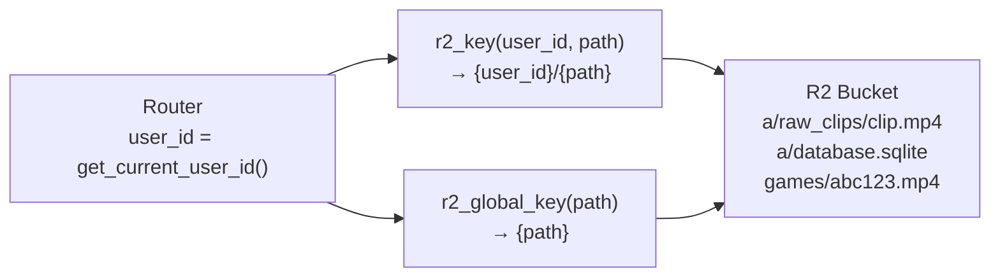
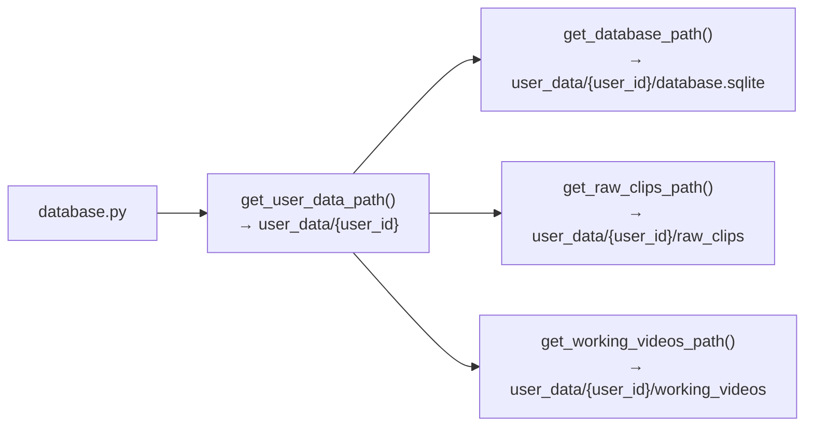
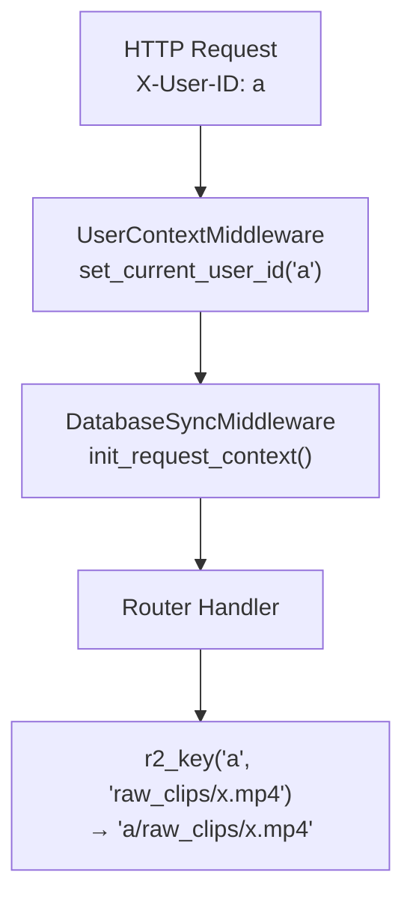
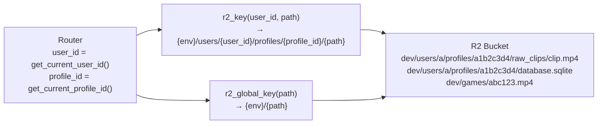
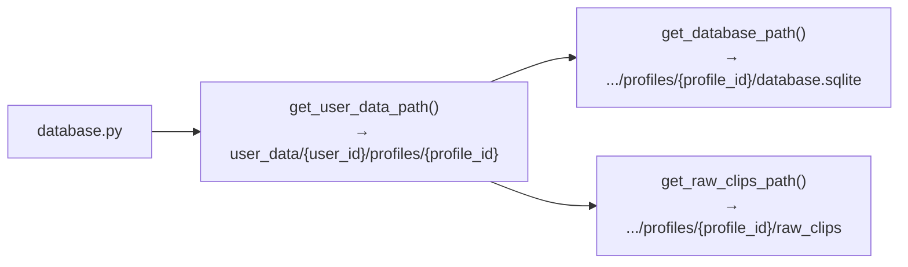
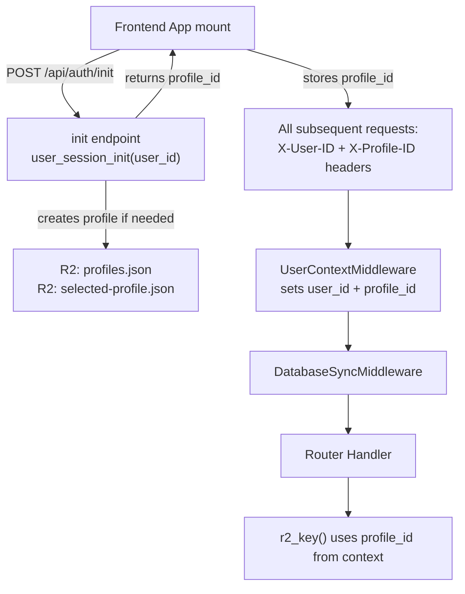

# T85a Design: R2 Restructure — Environment + Profiles Path Layout

**Status:** APPROVED
**Author:** Architect Agent
**Approved:** 2026-02-19

## Current State ("As Is")

### R2 Path Flow



### Local Path Flow



### Context Flow



### Per-User Init (Scattered)

Currently, per-user initialization is scattered across multiple implicit triggers:

| What | Where | Triggered By |
|------|-------|-------------|
| Table creation | `ensure_database()` at database.py:402 | First `get_db_connection()` call |
| R2 DB download | `ensure_database()` at database.py:424 | First `get_db_connection()` call |
| Stale project cleanup | `ensure_database()` at database.py:922 | First `get_db_connection()` call |
| DB bloat pruning | `ensure_database()` at database.py:936 | First `get_db_connection()` call |
| Cache warming | `App.jsx:95` | Frontend `useEffect` on mount |

No explicit login/init endpoint is called by the frontend. The existing `/api/auth/login` at auth.py:33 is a no-op.

### Limitations
- No environment separation — dev/staging/prod share same R2 namespace
- No profile isolation — all user data in single flat namespace
- Per-user init code scattered — will be hard to find when adding real auth
- `games/` and `{user_id}/` sit at same level with no grouping

---

## Target State ("Should Be")

### R2 Path Flow



### Local Path Flow



### Context Flow (New — Login Endpoint)



### Key Architectural Decision: Login Endpoint over Middleware

Instead of a `ProfileLoadMiddleware` that runs on every request, we use an explicit **`/api/auth/init`** endpoint that the frontend calls once on startup. This consolidates all per-user setup into one place, making it easy to find and move when real auth is added.

**Benefits:**
- All per-user init code in one function (`user_session_init()`)
- Frontend explicitly controls when init happens (can show loading state)
- No per-request overhead — profile ID sent via header after init
- When real auth arrives: just call `user_session_init()` from the login handler

### R2 Structure

```
reel-ballers-users/                              (R2 bucket)
  {env}/                                         (dev | staging | prod)
    games/
      {blake3_hash}.mp4
    users/
      {user_id}/
        profiles.json                            # Profile name mapping
        selected-profile.json                    # Last selected profile GUID
        profiles/
          {profile_guid}/
            database.sqlite
            raw_clips/...
            working_videos/...
            final_videos/...
```

---

## Implementation Plan ("Will Be")

### Files to Modify

| File | Change |
|------|--------|
| `src/backend/app/storage.py` | Add `APP_ENV`, update `r2_key()` and `r2_global_key()`, add profile R2 helpers |
| `src/backend/app/profile_context.py` | **New file:** ContextVar for profile ID + get/set/reset |
| `src/backend/app/database.py` | Update `get_user_data_path()` to include profile path segment |
| `src/backend/app/routers/auth.py` | Replace no-op login with `init` endpoint calling `user_session_init()` |
| `src/backend/app/main.py` | Update `UserContextMiddleware` to read `X-Profile-ID` header |
| `src/backend/app/session_init.py` | **New file:** `user_session_init()` — all per-user setup in one place |
| `src/frontend/src/App.jsx` | Call `/api/auth/init` on mount, store profile_id, send in headers |
| `src/frontend/src/config.js` | Add profile_id storage/accessor |
| `src/frontend/e2e/*.spec.js` | Call `/api/auth/init` in beforeEach, add `X-Profile-ID` header |
| `scripts/migrate_r2_structure.py` | **New file:** Migration script for user "a" |

### Step 1: Create `profile_context.py`

```pseudo
// New file: src/backend/app/profile_context.py
// Follows exact pattern of user_context.py

_current_profile_id: ContextVar[str] = ContextVar('current_profile_id', default=None)

get_current_profile_id() -> str:
    value = _current_profile_id.get()
    if value is None:
        raise RuntimeError("Profile ID not set — call /api/auth/init first")
    return value

set_current_profile_id(profile_id: str):
    _current_profile_id.set(profile_id)

reset_profile_id():
    _current_profile_id.set(None)
```

Raises on `None` — fail loudly if init hasn't happened yet.

### Step 2: Create `session_init.py` — Single Init Function

This is the **single entry point** for all per-user setup. Everything that should run "on login" lives here.

```pseudo
// New file: src/backend/app/session_init.py
// ONE function that does ALL per-user setup.
// When real auth is added, call this from the login handler.

def user_session_init(user_id: str) -> dict:
    """
    Initialize a user session. Called once per app load via /api/auth/init.
    Returns: { profile_id, is_new_user }
    """

    // 1. Load or create profile
    profile_id = None
    is_new_user = False

    if R2_ENABLED:
        profile_id = read_selected_profile_from_r2(user_id)

    if not profile_id:
        // New user — create default profile
        profile_id = uuid4().hex[:8]
        is_new_user = True
        if R2_ENABLED:
            upload_profiles_json(user_id, profile_id)
            upload_selected_profile_json(user_id, profile_id)

    // 2. Set profile context so downstream functions work
    set_current_profile_id(profile_id)

    // 3. Ensure database exists (dirs, R2 download, table creation)
    //    This already runs via ensure_database() → get_db_connection(),
    //    but calling it explicitly here makes the dependency clear.
    ensure_database()

    // 4. Cleanup tasks (MOVED from ensure_database lines 922-938)
    //    These were previously tacked onto the end of ensure_database()
    //    and triggered implicitly on first get_db_connection(). Now explicit.
    cleanup_stale_restored_projects(user_id)   // T66
    cleanup_database_bloat()                    // T243

    return {
        "profile_id": profile_id,
        "is_new_user": is_new_user,
    }
```

**What moved here (and where from):**

| Init task | Previously at | Now at |
|-----------|--------------|--------|
| Profile load/create | *new* | `session_init.py` |
| R2 DB download (first access) | `database.py:424` (inside `ensure_database`) | stays in `ensure_database()` (schema concern) |
| Table creation | `database.py:451` (inside `ensure_database`) | stays in `ensure_database()` (schema concern) |
| Stale project cleanup (T66) | `database.py:922` (tacked onto `ensure_database`) | **moved to** `session_init.py` |
| DB bloat pruning (T243) | `database.py:936` (tacked onto `ensure_database`) | **moved to** `session_init.py` |
| Default user DB init | `main.py:221` (server startup) | **removed** — init happens via `/api/auth/init` |
| Cache warming | `App.jsx:95` (frontend useEffect) | **moved to** after `/api/auth/init` returns |

**What stays in `ensure_database()`:** Directory creation, R2 DB download, table creation. These are schema/infrastructure concerns that `get_db_connection()` still needs as a safety net (idempotent). The cleanup tasks are removed from there — they're session-init concerns, not schema concerns.

**What's removed from `main.py` startup:** The `init_database()` call at line 221. The default user's DB is now initialized when the frontend calls `/api/auth/init`. Orphaned job recovery and modal queue processing stay in startup (they're global, not per-user).

### Step 3: Update `auth.py` — Init Endpoint

```pseudo
// Replace the no-op login endpoint

@router.post("/init")
async def init_session():
    """
    Initialize user session. Frontend calls this once on app mount.
    Creates default profile if needed, returns profile_id for subsequent requests.
    """
    user_id = get_current_user_id()  // Set by UserContextMiddleware from X-User-ID
    result = user_session_init(user_id)
    return {
        "user_id": user_id,
        "profile_id": result["profile_id"],
        "is_new_user": result["is_new_user"],
    }
```

Keep `/api/auth/login` as a deprecated alias that calls the same function (backwards compat for tests).

### Step 4: Update `main.py` — Read X-Profile-ID Header

```pseudo
// UserContextMiddleware.dispatch — add profile ID from header

class UserContextMiddleware:
    dispatch(request, call_next):
        // Existing: set user_id from X-User-ID header
        user_id = request.headers.get('X-User-ID', DEFAULT_USER_ID)
        set_current_user_id(sanitized_user_id)

        // New: set profile_id from X-Profile-ID header (if present)
        profile_id = request.headers.get('X-Profile-ID')
        if profile_id:
            set_current_profile_id(profile_id)

        response = await call_next(request)
        return response
```

**No profile_id header = no profile context set.** This is intentional — if the frontend hasn't called `/api/auth/init` yet, any endpoint that uses `r2_key()` will fail with a clear error ("Profile ID not set").

**Exception paths:** Health checks, static files, and the `/api/auth/init` endpoint itself don't use `r2_key()`, so they work without a profile.

### Step 5: Update `storage.py` — Path Functions

```pseudo
// storage.py top-level
APP_ENV = os.getenv("APP_ENV", "dev")

// Updated r2_key
r2_key(user_id, path):
    from .profile_context import get_current_profile_id
    profile_id = get_current_profile_id()
    path = normalize_separators(path)
    return f"{APP_ENV}/users/{user_id}/profiles/{profile_id}/{path}"

// Updated r2_global_key
r2_global_key(path):
    path = normalize_separators(path)
    return f"{APP_ENV}/{path}"

// New: Profile R2 helpers (user-level, NOT inside profiles/)
def r2_user_key(user_id: str, path: str) -> str:
    """R2 key for user-level files (profiles.json, selected-profile.json)."""
    return f"{APP_ENV}/users/{user_id}/{path}"

def read_selected_profile_from_r2(user_id) -> Optional[str]:
    key = r2_user_key(user_id, "selected-profile.json")
    // download, parse JSON, return profileId

def upload_profiles_json(user_id, profile_id):
    key = r2_user_key(user_id, "profiles.json")
    // upload JSON

def upload_selected_profile_json(user_id, profile_id):
    key = r2_user_key(user_id, "selected-profile.json")
    // upload JSON
```

### Step 6: Update `database.py` — Local Paths

```pseudo
from .profile_context import get_current_profile_id

get_user_data_path():
    return USER_DATA_BASE / get_current_user_id() / "profiles" / get_current_profile_id()
```

All downstream path functions auto-inherit.

### Step 7: Frontend — Call Init on Mount

```pseudo
// App.jsx — replace the warmAllUserVideos() useEffect

useEffect(() => {
    async function initSession() {
        const response = await fetch('/api/auth/init', { method: 'POST' });
        const data = await response.json();

        // Store profile_id for all subsequent requests
        window.__profileId = data.profile_id;

        // Now safe to warm cache (profile is set)
        warmAllUserVideos();
    }
    initSession();
}, []);
```

```pseudo
// Intercept all fetch calls to add X-Profile-ID header
// Option A: Thin wrapper around fetch
// Option B: Fetch interceptor / request middleware
// Option C: Store in a Zustand store, each API call reads it

// Simplest: add to the existing API pattern
// Every fetch('/api/...') already goes through Vite proxy
// Add a small utility that attaches the header
```

**E2E tests:** Tests call `/api/auth/init` in `beforeEach`, same as the real app. Store returned `profile_id` and add to `page.setExtraHTTPHeaders()` alongside `X-User-ID`.

### Step 8: Migration Script

```pseudo
// scripts/migrate_r2_structure.py
// Same as before — only handles user "a" (dev user)

migrate_user("a"):
    profile_id = uuid4().hex[:8]
    env = "dev"

    // Copy R2 files to new structure
    for prefix in ["raw_clips", "working_videos", "final_videos", "database.sqlite"]:
        copy from "a/{prefix}/..." to "dev/users/a/profiles/{profile_id}/{prefix}/..."

    // Copy games
    copy from "games/..." to "dev/games/..."

    // Create profile JSONs
    upload profiles.json to "dev/users/a/profiles.json"
    upload selected-profile.json to "dev/users/a/selected-profile.json"

    // Migrate local directory
    move user_data/a/* to user_data/a/profiles/{profile_id}/
```

---

## E2E Test Strategy

E2E tests call `/api/auth/init` just like the real app — tests should test actual code paths.

**Each E2E test's `beforeEach`:**
1. Set `X-User-ID` header (already done)
2. `POST /api/auth/init` to create profile and get `profile_id`
3. Add `X-Profile-ID` to `page.setExtraHTTPHeaders()`

This is ~3 lines of additional setup per test file, shared in a helper. It exercises the same init path the real app uses, so if init breaks, tests catch it.

---

## Risks

| Risk | Mitigation |
|------|------------|
| R2 migration is one-way | Run migration script BEFORE deploying new code |
| Cached presigned URLs break | Acceptable — users refresh to get new URLs |
| Frontend must call init before any API call | Show loading screen until init completes; other endpoints fail loudly if profile missing |
| E2E test changes | Tests call `/api/auth/init` in beforeEach — ~3 lines per file in shared helper |
| `/api/auth/init` R2 latency on first call | Use sync client with fast timeouts (3s). Only happens once per app load |
| Profile context not set for health/static endpoints | These don't use `r2_key()` — no issue |

## Open Questions

- [x] Where to put profile helpers? → In `storage.py` alongside existing R2 functions
- [x] Should `get_current_profile_id()` raise or return default? → Raise on None (no silent fallbacks)
- [x] Middleware vs login endpoint? → Login endpoint (`/api/auth/init`) — consolidates all per-user init
- [x] E2E test handling → Option B: tests call `/api/auth/init` (tests should test actual code paths)
