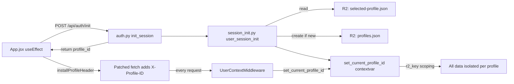
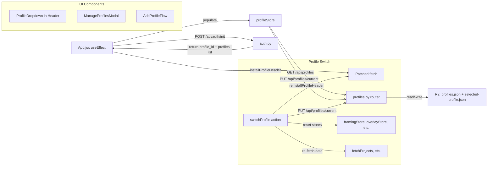

# T85b Design: Profile Switching — Multi-Athlete Support

**Status:** APPROVED
**Author:** Architect Agent
**Approved:** 2026-02-24

## Current State ("As Is")

### Data Flow



### Current Behavior

```pseudo
on app mount:
    POST /api/auth/init
    → backend reads selected-profile.json from R2
    → if missing, creates default profile (uuid[:8]), writes profiles.json + selected-profile.json
    → sets profile_id in contextvar
    → returns { profile_id, user_id, is_new_user }
    frontend patches window.fetch to add X-Profile-ID header
    all subsequent API calls are scoped to that profile

on every request:
    UserContextMiddleware reads X-Profile-ID header
    → if present: sets profile contextvar directly (fast path)
    → if missing: calls user_session_init (auto-resolve)
```

### Limitations

- Only one profile ever used — the one selected at first init
- No way to list profiles, create new ones, switch, or delete
- `profiles.json` exists but is write-only (created on init, never read back for listing)
- No `read_profiles_json` function exists — only `upload_profiles_json`
- Frontend has no concept of profiles — just blindly sends the profile_id it got at init

---

## Target State ("Should Be")

### Updated Flow



### Target Behavior

```pseudo
on app mount:
    POST /api/auth/init (unchanged)
    GET /api/profiles → populate profileStore with all profiles
    if profiles.length >= 2: show ProfileDropdown in header

on switch profile:
    PUT /api/profiles/current { profileId: "new_id" }
    → backend updates selected-profile.json in R2
    → backend invalidates session_init cache for user
    frontend reinstalls X-Profile-ID header with new profile_id
    frontend resets all data stores (framing, overlay, clips, projects, etc.)
    frontend re-fetches projects (from new profile's DB)
    frontend navigates to project manager

on create profile:
    if first additional profile (going from 1 → 2):
        prompt to name current profile first
    POST /api/profiles { name: "Jordan", color: "#10B981" }
    → backend generates new profile GUID
    → backend adds to profiles.json
    → backend initializes empty DB for new profile
    → backend auto-switches to new profile (updates selected-profile.json)
    frontend triggers profile switch flow (above)

on delete profile:
    block if last profile
    if deleting current profile: switch to another first
    DELETE /api/profiles/{id}
    → backend removes from profiles.json
    → backend deletes all R2 objects under profiles/{id}/
    → backend deletes local data dir for that profile
    frontend removes from profileStore
```

---

## Implementation Plan ("Will Be")

### Files to Create

| File | Purpose |
|------|---------|
| `src/backend/app/routers/profiles.py` | Profile CRUD + switch endpoints |
| `src/frontend/src/stores/profileStore.js` | Profile state management |
| `src/frontend/src/components/ProfileDropdown.jsx` | Header dropdown for switching |
| `src/frontend/src/components/ManageProfilesModal.jsx` | CRUD modal for profiles |

### Files to Modify

| File | Change |
|------|--------|
| `src/backend/app/storage.py` | Add `read_profiles_json()`, `save_profiles_json()`, `delete_profile_r2_data()` |
| `src/backend/app/session_init.py` | Add `invalidate_user_cache()` for switch |
| `src/backend/app/routers/__init__.py` | Export `profiles_router` |
| `src/backend/app/main.py` | Register profiles router |
| `src/frontend/src/utils/sessionInit.js` | Export `reinstallProfileHeader()` for switching |
| `src/frontend/src/stores/index.js` | Export `useProfileStore` |
| `src/frontend/src/App.jsx` | Add ProfileDropdown to header, ManageProfilesModal |

---

### Backend: `src/backend/app/storage.py` additions

```pseudo
def read_profiles_json(user_id: str) -> dict | None:
    """Read profiles.json from R2. Returns parsed dict or None."""
    key = r2_user_key(user_id, "profiles.json")
    download from R2, parse JSON, return

def save_profiles_json(user_id: str, data: dict) -> bool:
    """Write profiles.json to R2. Replaces the full document."""
    key = r2_user_key(user_id, "profiles.json")
    upload JSON to R2

def delete_profile_r2_data(user_id: str, profile_id: str) -> bool:
    """Delete all R2 objects under profiles/{profile_id}/"""
    prefix = r2_user_key(user_id, f"profiles/{profile_id}/")
    list all objects with prefix, batch delete
```

### Backend: `src/backend/app/session_init.py` addition

```pseudo
def invalidate_user_cache(user_id: str):
    """Remove user from _init_cache so next request re-reads from R2."""
    _init_cache.pop(user_id, None)
```

### Backend: `src/backend/app/routers/profiles.py`

```pseudo
router = APIRouter(prefix="/api/profiles", tags=["profiles"])

GET /
    user_id = get_current_user_id()
    data = read_profiles_json(user_id)
    if not data: return { profiles: [] }
    selected = read_selected_profile_from_r2(user_id)
    return {
        profiles: [
            { id, name, color, isDefault: id == data.default, isCurrent: id == selected }
            for id, meta in data.profiles.items()
        ]
    }

POST /
    body: { name: str, color: str }
    user_id = get_current_user_id()
    data = read_profiles_json(user_id)
    new_id = uuid4().hex[:8]
    data.profiles[new_id] = { name, color }
    save_profiles_json(user_id, data)
    # Initialize DB for new profile
    set_current_profile_id(new_id)
    ensure_database()
    # Auto-switch to new profile
    upload_selected_profile_json(user_id, new_id)
    invalidate_user_cache(user_id)
    return { id: new_id, name, color }

PUT /{profile_id}
    body: { name?: str, color?: str }
    user_id = get_current_user_id()
    data = read_profiles_json(user_id)
    if profile_id not in data.profiles: 404
    update fields in data.profiles[profile_id]
    save_profiles_json(user_id, data)
    return updated profile

PUT /current
    body: { profileId: str }
    user_id = get_current_user_id()
    data = read_profiles_json(user_id)
    if profileId not in data.profiles: 404
    upload_selected_profile_json(user_id, profileId)
    invalidate_user_cache(user_id)
    # Initialize DB for switched profile (ensures it exists locally)
    set_current_profile_id(profileId)
    ensure_database()
    return { profileId }

DELETE /{profile_id}
    user_id = get_current_user_id()
    data = read_profiles_json(user_id)
    if len(data.profiles) <= 1: 400 "Cannot delete last profile"
    if profile_id not in data.profiles: 404
    current = read_selected_profile_from_r2(user_id)
    if profile_id == current:
        # Switch to another profile first
        other_id = next(id for id in data.profiles if id != profile_id)
        upload_selected_profile_json(user_id, other_id)
        invalidate_user_cache(user_id)
    del data.profiles[profile_id]
    if data.default == profile_id:
        data.default = next(iter(data.profiles))
    save_profiles_json(user_id, data)
    # Delete R2 data and local data
    delete_profile_r2_data(user_id, profile_id)
    delete_local_profile_data(user_id, profile_id)
    return { deleted: profile_id }
```

### Frontend: `sessionInit.js` changes

```pseudo
// Add ability to change profile header without re-patching fetch
let _currentProfileId = null;

function installProfileHeader(profileId):
    _currentProfileId = profileId
    // patch fetch to use _currentProfileId (read from closure variable)

export function reinstallProfileHeader(newProfileId):
    """Called on profile switch to update the X-Profile-ID header."""
    _currentProfileId = newProfileId
    _profileId = newProfileId
```

Key insight: Instead of re-patching `window.fetch` on every switch, we make the patched fetch read from a mutable variable. The initial install patches once; `reinstallProfileHeader` just updates the variable.

### Frontend: `profileStore.js`

```pseudo
useProfileStore = create((set, get) => ({
    profiles: [],
    currentProfileId: null,
    isLoading: false,
    isInitialized: false,

    fetchProfiles: async () => {
        set({ isLoading: true })
        response = await fetch('/api/profiles')
        data = await response.json()
        current = data.profiles.find(p => p.isCurrent)
        set({
            profiles: data.profiles,
            currentProfileId: current?.id,
            isLoading: false,
            isInitialized: true,
        })
    },

    switchProfile: async (profileId) => {
        await fetch('/api/profiles/current', PUT { profileId })
        reinstallProfileHeader(profileId)
        set({ currentProfileId: profileId })

        // Reset all data stores
        useProjectDataStore.getState().reset()
        useFramingStore.getState().reset()
        useOverlayStore.getState().reset()
        useVideoStore.getState().reset()
        useClipStore.getState().reset()
        useNavigationStore.getState().reset()
        useExportStore.getState().clearExport()
        useGamesStore.getState().reset()  // if it has reset
        useSettingsStore.getState().isInitialized = false  // force re-load

        // Navigate to project manager
        useEditorStore.getState().setEditorMode(EDITOR_MODES.PROJECT_MANAGER)
    },

    createProfile: async (name, color) => {
        response = await fetch('/api/profiles', POST { name, color })
        newProfile = await response.json()
        // Refetch profiles list and trigger switch
        await get().fetchProfiles()
        await get().switchProfile(newProfile.id)
    },

    updateProfile: async (profileId, updates) => {
        response = await fetch(`/api/profiles/${profileId}`, PUT updates)
        // Update in local list
        await get().fetchProfiles()
    },

    deleteProfile: async (profileId) => {
        response = await fetch(`/api/profiles/${profileId}`, DELETE)
        // If deleted current, the backend auto-switched — refetch
        await get().fetchProfiles()
        // Check if we need to switch
        if (profileId === get().currentProfileId) {
            newCurrent = get().profiles.find(p => p.isCurrent)
            if (newCurrent) await get().switchProfile(newCurrent.id)
        }
    },

    // Computed
    hasMultipleProfiles: () => get().profiles.length >= 2,
    currentProfile: () => get().profiles.find(p => p.id === get().currentProfileId),
}))
```

### Frontend: `ProfileDropdown.jsx`

```pseudo
function ProfileDropdown():
    profiles = useProfileStore(s => s.profiles)
    currentProfile = useProfileStore(s => s.currentProfile())
    switchProfile = useProfileStore(s => s.switchProfile)
    [showDropdown, setShowDropdown] = useState(false)
    [showManageModal, setShowManageModal] = useState(false)

    // Only render if 2+ profiles
    if (profiles.length < 2) return null

    return (
        <div className="relative">
            {/* Trigger: avatar circle + name + chevron */}
            <button onClick={() => setShowDropdown(!showDropdown)}>
                <div style={{ backgroundColor: currentProfile.color }}
                     className="w-6 h-6 rounded-full" />
                <span>{currentProfile.name || 'Default'}</span>
                <ChevronDown />
            </button>

            {/* Backdrop */}
            {showDropdown && <div className="fixed inset-0 z-40" onClick={close} />}

            {/* Dropdown menu */}
            {showDropdown && (
                <div className="absolute right-0 mt-2 w-56 bg-gray-800 border border-gray-700 rounded-lg z-50">
                    {profiles.map(p => (
                        <button onClick={() => { switchProfile(p.id); close() }}>
                            <Avatar color={p.color} />
                            <span>{p.name || 'Default'}</span>
                            {p.isCurrent && <Check />}
                        </button>
                    ))}
                    <hr />
                    <button onClick={() => { close(); setShowManageModal(true) }}>
                        Manage Profiles
                    </button>
                </div>
            )}

            <ManageProfilesModal
                isOpen={showManageModal}
                onClose={() => setShowManageModal(false)}
            />
        </div>
    )
```

### Frontend: `ManageProfilesModal.jsx`

```pseudo
function ManageProfilesModal({ isOpen, onClose }):
    profiles = useProfileStore(s => s.profiles)
    createProfile = useProfileStore(s => s.createProfile)
    updateProfile = useProfileStore(s => s.updateProfile)
    deleteProfile = useProfileStore(s => s.deleteProfile)

    [mode, setMode] = useState('list')  // 'list' | 'add' | 'add-first' | 'edit'
    [editingProfile, setEditingProfile] = useState(null)
    [deleteConfirm, setDeleteConfirm] = useState(null)

    // "Add Profile" flow
    // If only 1 profile exists → 'add-first' mode (name current + new)
    // If 2+ profiles → 'add' mode (just name new)

    if (!isOpen) return null

    return (
        <div className="fixed inset-0 bg-black/70 z-50 flex items-center justify-center">
            <div className="bg-gray-800 rounded-lg w-full max-w-md border border-gray-700">
                {mode === 'list' && (
                    <>
                        <Header title="Manage Profiles" onClose={onClose} />
                        <ProfileList>
                            {profiles.map(p => (
                                <ProfileRow
                                    profile={p}
                                    onEdit={() => { setEditingProfile(p); setMode('edit') }}
                                    onDelete={() => setDeleteConfirm(p)}
                                    canDelete={profiles.length > 1}
                                />
                            ))}
                        </ProfileList>
                        <Footer>
                            <Button onClick={handleAddClick}>+ Add Profile</Button>
                        </Footer>
                    </>
                )}

                {mode === 'add-first' && (
                    <AddFirstProfileFlow
                        currentProfile={profiles[0]}
                        onComplete={(currentName, currentColor, newName, newColor) => {
                            updateProfile(profiles[0].id, { name: currentName, color: currentColor })
                            createProfile(newName, newColor)
                            setMode('list')
                        }}
                        onCancel={() => setMode('list')}
                    />
                )}

                {mode === 'add' && (
                    <AddProfileForm
                        onSubmit={(name, color) => { createProfile(name, color); setMode('list') }}
                        onCancel={() => setMode('list')}
                        usedColors={profiles.map(p => p.color)}
                    />
                )}

                {mode === 'edit' && (
                    <EditProfileForm
                        profile={editingProfile}
                        onSubmit={(updates) => { updateProfile(editingProfile.id, updates); setMode('list') }}
                        onCancel={() => setMode('list')}
                        usedColors={profiles.filter(p => p.id !== editingProfile.id).map(p => p.color)}
                    />
                )}
            </div>

            {/* Delete confirmation */}
            <ConfirmationDialog
                isOpen={!!deleteConfirm}
                title={`Delete "${deleteConfirm?.name || 'Default'}"?`}
                message="All clips, projects, and exports for this profile will be permanently deleted. Game videos shared with other profiles will not be affected."
                onClose={() => setDeleteConfirm(null)}
                buttons={[
                    { label: 'Cancel', onClick: () => setDeleteConfirm(null), variant: 'secondary' },
                    { label: 'Delete Profile', onClick: () => { deleteProfile(deleteConfirm.id); setDeleteConfirm(null) }, variant: 'danger' },
                ]}
            />
        </div>
    )
```

### Frontend: `App.jsx` integration

```pseudo
// In header (right side), before GalleryButton:
<ProfileDropdown />

// Add "Add Profile" entry point for single-profile users
// This could be in ProfileDropdown (renders a small "+" button when only 1 profile)
// OR in the settings area — keeping it simple by always rendering ProfileDropdown
// but changing its rendering based on profile count:
//   0-1 profiles: render nothing (or small "+" icon)
//   2+ profiles: render full dropdown

// Where ProfileDropdown is placed in header:
<div className="flex items-center gap-2">
    <ProfileDropdown />   {/* NEW */}
    <GalleryButton />
    ...mode switcher...
</div>
```

### Frontend: `sessionInit.js` refactor

```pseudo
let _currentProfileId = null;
let _fetchPatched = false;

function installProfileHeader(profileId):
    _currentProfileId = profileId
    if (_fetchPatched) return  // only patch once

    originalFetch = window.fetch
    window.fetch = function(input, init = {}):
        url = typeof input === 'string' ? input : input?.url || ''
        isApiRequest = url.startsWith('/api') || url.startsWith(API_BASE + '/api')

        if isApiRequest and _currentProfileId:
            init = { ...init }
            init.headers = { ...(init.headers || {}), 'X-Profile-ID': _currentProfileId }

        return originalFetch.call(window, input, init)

    _fetchPatched = true

export function reinstallProfileHeader(newProfileId):
    _currentProfileId = newProfileId
    _profileId = newProfileId
```

---

## Color Picker Design

Inline color picker — a row of clickable color circles. No separate ColorPicker component needed; it's just a row of buttons inside the Add/Edit forms.

```pseudo
const PROFILE_COLORS = [
    '#3B82F6', '#10B981', '#F59E0B', '#EF4444',
    '#8B5CF6', '#EC4899', '#06B6D4', '#84CC16',
]

function ColorSelector({ value, onChange, usedColors = [] }):
    return (
        <div className="flex gap-2">
            {PROFILE_COLORS.map(color => (
                <button
                    onClick={() => onChange(color)}
                    className={`w-8 h-8 rounded-full border-2 ${
                        color === value ? 'border-white' : 'border-transparent'
                    } ${usedColors.includes(color) ? 'opacity-40' : ''}`}
                    style={{ backgroundColor: color }}
                />
            ))}
        </div>
    )
```

Used colors are dimmed but still selectable (users may want the same color).

---

## Add Profile Entry Point (Single Profile Users)

For users with only 1 profile, the dropdown is hidden. We need an entry point to add a profile. Options:

**Chosen approach: Always render ProfileDropdown, but adapt its rendering.**
- 1 profile: Render just a small user icon in the header. Clicking it opens ManageProfilesModal directly (with "add-first" flow).
- 2+ profiles: Render full dropdown with name + chevron.

This avoids burying the feature in a settings menu and keeps it discoverable.

---

## Risks

| Risk | Mitigation |
|------|------------|
| Race condition: two tabs switching profiles simultaneously | `profiles.json` is small and writes are infrequent — acceptable risk. Future: add ETag-based optimistic locking |
| Profile switch while export is running | Show warning toast, block switch. Check `useExportStore.getState().activeExports` |
| `_init_cache` becomes stale after switch | `invalidate_user_cache()` clears it; next request will re-init with new profile |
| Deleting profile with large R2 data takes time | Return success immediately, log deletion errors. R2 list+delete is fast for typical profile sizes |
| `reinstallProfileHeader` doesn't affect in-flight requests | Acceptable — old profile requests will complete fine, new requests use new header |

## Open Questions

- [x] Should we block profile switch while an export is in progress? → **Yes, show warning toast.**
- [x] Where should the "Add Profile" entry point be for single-profile users? → **Small user icon in header, opens ManageProfilesModal.**
- [x] Should deleting a profile require typing the profile name for confirmation? → **No, standard confirmation dialog.**
- [x] Should profile colors be unique per user or allow duplicates? → **Allow duplicates, dim already-used colors.**
