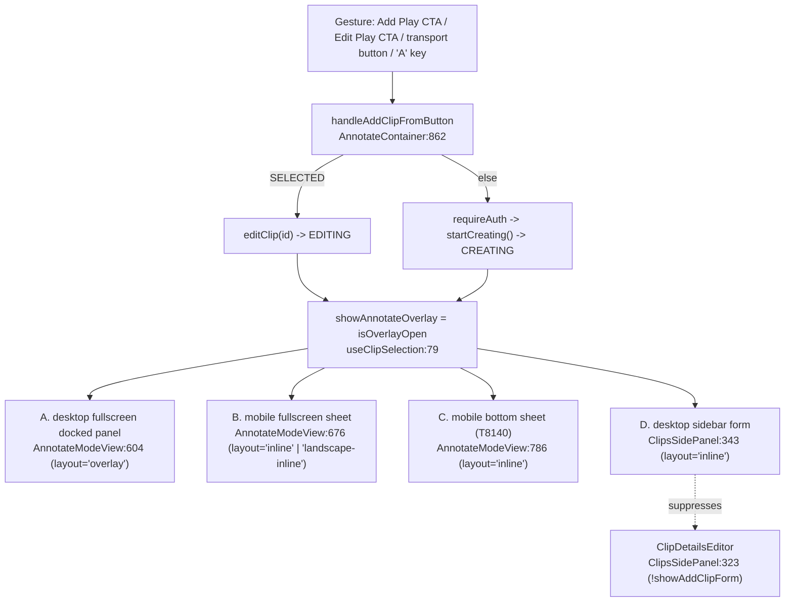
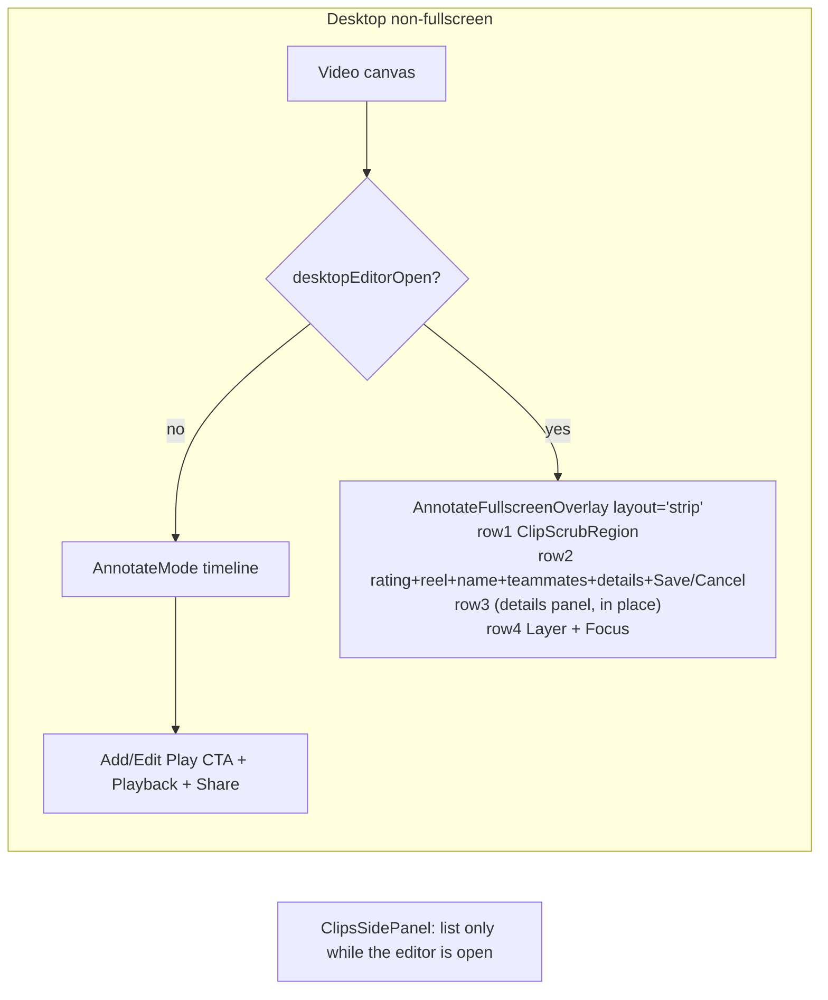

# T8600 Design: Inline Play Editor (add/edit plays under the canvas)

**Status:** AWAITING USER APPROVAL (design gate, Stage 2)
**Tier:** L (6+ files, new layout variant, mode swap, 2 layers of gating rewired)
**Author:** Architect agent, 2026-09-03
**Inputs (treated as decided, not re-opened):**
[T8600 task file](./T8600-inline-play-editor-under-canvas.md) (locked user decisions) ·
[UX review](../ux/UX-inline-play-editor-2026-09-03.md) (rationale) ·
[UI spec](./T8600-ui-spec.md) (Tailwind-level detail) ·
[T8590](./T8590-desktop-edit-play-opens-create-form.md) (prerequisite, landed 2026-09-03)
**Knowledge doc:** `.claude/knowledge/annotate.md`

This doc answers the six questions the task file flags but does not resolve:
the mode-swap state machine (§2.1), the ClipsSidePanel rewiring (§2.3), the
transport-bar Add suppression (§2.4), the beacon surface discriminator (§2.5),
Esc layering plus 1-5/Enter key scoping (§2.6), and the commit sequencing (§3).
Six deviations from the UI spec are called out inline and collected in §4.

---

## 1. Current state

### 1.1 Where the add/edit form renders today (4 live render sites)



All four render the same component, `AnnotateFullscreenOverlay`, which owns 100%
of the form state in local `useState` and writes nothing until the Save gesture.
`showAddClipForm` (`AnnotateScreen.jsx:681`) is literally
`showAnnotateOverlay && !annotateFullscreen`.

### 1.2 The desktop non-fullscreen layout this task rearranges

| Region | File / lines | Rendered when |
|---|---|---|
| Timeline (`AnnotateMode`, 2 lanes) | `AnnotateModeView.jsx:761-777` | `!annotateFullscreen && !mobileInlineForm` |
| Mobile bottom sheet | `AnnotateModeView.jsx:784-804` | `mobileInlineForm` |
| Primary CTA + Playback/Share rows | `AnnotateModeView.jsx:823-927` | `!annotateFullscreen && !mobileInlineForm` |
| Transport bar Add/Edit button | `AnnotateControls.jsx:169-204`, wired at `AnnotateModeView.jsx:641` | `onAddClip` truthy AND (`isFullscreen` OR `!isEditMode`) |
| Sidebar list + details editor + form | `ClipsSidePanel.jsx:280-360` | see 1.1 |

### 1.3 Code smells the current shape carries

| Smell | Location | Impact |
|---|---|---|
| Duplicated surface predicate | `mobileInlineForm` (ModeView:138) and `showAddClipForm` (Screen:681) are the same idea computed twice, one with `isMobile`, one without | The desktop half of the predicate has no name, which is exactly why the desktop path drifted into the T8590 bug |
| Shotgun surgery on render sites | 4 (soon 4 again) `AnnotateFullscreenOverlay` call sites, each hand-passing 12+ props | T8590 was one omitted prop with no error; the same class of bug is one new render site away |
| Speculative generality vs missing gate | `AnnotateControls` hides Add on `!isEditMode` (SELECTED) but NOT on EDITING/CREATING, where `onAddClip` silently calls `startCreating()` | Mid-edit click flips an open edit into a create (UX review risk e3). Today the mobile sheet is patched by passing `undefined`; desktop is not patched at all |
| Conditional complexity | `AnnotateFullscreenOverlay` has 3 layout branches, 2 device branches (`isMobile`), 1 mode branch (`isEditMode`) interleaved in one `formBody` | Adding a 4th layout naively multiplies branches |
| Test blind spot | `clip-selection-state-machine.spec.js` runs at `viewport 900x600`, and `useIsMobile()` is `max-width: 1023px`, so the whole T8130/T8590 e2e guard is exercising the MOBILE sheet, not the desktop sidebar form | After this task the desktop surface would be entirely uncovered while the spec keeps passing green against the sheet. Called out again in §5 |

### 1.4 Current behavior, pseudo

```pseudo
when user clicks "Edit Play" (desktop, non-fullscreen):
    editClip(id) -> EDITING -> showAnnotateOverlay = true
    ClipsSidePanel:
        ClipDetailsEditor  -> hidden  (because showAddClipForm)
        AnnotateFullscreenOverlay(layout='inline', existingClip=selected)  -> shown IN SIDEBAR
    AnnotateModeView:
        timeline           -> still shown
        Add Play CTA       -> still shown, label "Add Play" (isEditMode is SELECTED-only, now false)
        transport Add btn  -> still shown  <-- clicking it calls startCreating(): silent edit->create flip
```

---

## 2. Target architecture

### 2.0 Design principles applied

- [x] **DRY / one predicate:** the "an under-canvas editor is open" idea gets ONE
      name and both device halves derive from it. No third copy.
- [x] **Single owner of form state:** the button row (Layer, Focus) that the task
      moves out of the CTA block is rendered BY the overlay component, inside its
      `layout="strip"` return, not by `AnnotateModeView`. Nothing is lifted, no new
      store, no callbacks up-and-down. See D1 in §4.
- [x] **One details state, two presentations:** a single `detailsOpen` boolean
      drives the desktop expand-in-place panel and the mobile full-screen popup.
- [x] **Delete, do not fork:** the desktop sidebar form render is DELETED, not
      hidden behind a flag. There is exactly one desktop non-fullscreen editor.
- [x] **No new persistence, no reactive effects:** zero new `useEffect` writes;
      zero new store fields; the form stays memory-only until Save (§2.2).
- [x] **Fewer branches:** the transport-button suppression and the timeline/CTA
      suppression collapse to the same boolean instead of two ad hoc conditions.

### 2.1 The mode-swap state machine (question 1)

**No new state machine. No new state in `useClipSelection.js`. One new boolean of
local view state in the whole task (`detailsOpen`).**

The existing machine already expresses everything the swap needs:

```
NONE --startCreating--> CREATING --close/save--> NONE
SELECTED --editClip--> EDITING --close--> SELECTED
                              --save--> SELECTED
EDITING/CREATING are immune to playhead auto-deselect (useClipSelection:67)
```

`AnnotateModeView` derives three render-time booleans (pure, no `useState`):

```js
// AnnotateModeView.jsx, replacing the lone `mobileInlineForm` at L138
const underCanvasEditor  = showAnnotateOverlay && !annotateFullscreen;  // the ONE predicate
const mobileInlineForm   = underCanvasEditor && isMobile;   // existing name, unchanged meaning
const desktopEditorOpen  = underCanvasEditor && !isMobile;  // NEW: the strip
```

`mobileInlineForm` and `desktopEditorOpen` are mutually exclusive by construction
(`isMobile` partitions them), so "two editors at once" is impossible at this level
by shape, not by discipline.

**Transition table (every trigger, no others exist):**

| Gesture | Handler | Selection transition | Surface effect |
|---|---|---|---|
| "Add Play" CTA, no selection | `handleAddClipFromButton` -> `requireAuth` -> `startCreating()` | NONE -> CREATING | timeline + CTA block swap out, green strip in |
| "Edit Play" CTA, clip selected | `handleAddClipFromButton` -> `editClip(id)` | SELECTED -> EDITING | yellow strip in, sidebar `ClipDetailsEditor` stays suppressed |
| `A` key | same handler, already gated on `!showAnnotateOverlay` (`AnnotateScreen:566`) | same | same. Cannot flip edit into create, the gate predates this task |
| transport bar Add | `onAddClip` | SUPPRESSED while the strip is open (§2.4) | n/a |
| Save / Update | `handleSave` -> `onCreateClip`/`onUpdateClip` -> `onResume`/`handleFullscreenUpdateClip` -> `closeOverlay()` | CREATING -> NONE, EDITING -> SELECTED | strip out, timeline + CTA back |
| Cancel, header X, Esc | `onClose` = `handleOverlayClose` -> `closeOverlay()` | same as above | same |
| click another clip in the sidebar list while EDITING | `handleSelectRegion` -> `editClip(newId)` (Container:1163) | EDITING -> EDITING(new id) | strip re-seeds from the new clip via the existing `[existingClip]` reset effect. PRE-EXISTING behavior, see R3 |
| timeline seek to empty time | `handleTimelineSeek` -> `closeOverlay()` | closes | **UNREACHABLE while the strip is open (there is no timeline).** Exactly the state the mobile sheet has been in since T8140. **No code change**, this resolves the task file's open item on `AnnotateContainer` |
| "Add details" / chevron | `setDetailsOpen(o => !o)` | none | desktop: in-place panel; mobile: full-screen popup |
| Esc while `detailsOpen` | keydown layer 1 (§2.6) | none | closes details only |

**Target diagram:**



### 2.2 Persistence check (project rule: gesture-based only)

| Concern | Verdict |
|---|---|
| New `useEffect` that writes to store or backend | NONE. The task adds zero effects. `detailsOpen` is set from click handlers only |
| Form state | Stays local to `AnnotateFullscreenOverlay`, memory-only until Save, unchanged |
| Save path | Unchanged: `onCreateClip` -> `handleFullscreenCreateClip` -> `saveClip`, `onUpdateClip` -> `updateClipRegionWithSync`. Surgical, one write path |
| `detailsOpen` reset | Deliberately NOT added to the `[existingClip]` reset effect. The component unmounts when the editor closes (parent gates the render), so it resets naturally; re-seeding on a clip switch leaves the panel open, which is harmless and avoids a second reset path |
| T7540 teammate auto-commit on Save | Unchanged, `handleSave` keeps calling `commitPendingTeammateText` |
| Rating -> auto-name -> Create Reel auto-arm coupling | Unchanged, all three still live in `handleRatingChange` |

### 2.3 ClipsSidePanel rewiring (question 2)

**Exact current logic** (traced, `ClipsSidePanel.jsx`):

```jsx
// L323  details editor, suppressed only because the form was rendered below it
{!isMobile && selectedRegion && !showAddClipForm && (<ClipDetailsEditor ... />)}

// L343  the desktop form (this is the render T8590 just fixed)
{!isMobile && showAddClipForm && (<AnnotateFullscreenOverlay existingClip={selectedRegion || null} ... />)}
```

**Target:**

```jsx
// L323  UNCHANGED LOGIC, renamed prop. This is now the ONLY reason the panel
//       knows an editor exists: it must not render a second live editor.
{!isMobile && selectedRegion && !clipEditorOpen && (<ClipDetailsEditor ... />)}

// L343  DELETED (block, the AnnotateFullscreenOverlay import, and every prop
//       whose last reference it was)
```

Concrete steps:

1. Delete lines ~342-360 and the `AnnotateFullscreenOverlay` import (line 6).
2. Delete the props that become unreferenced. Candidates, each to be grep-verified
   for remaining uses inside the file before removal: `currentTime`, `onCreateClip`,
   `onUpdateClip`, `onOverlayResume`, `onOverlayClose`, `newClipLayerIsMine`.
   `videoController`, `onSeek`, `onScrubLock/Unlock`, `teammateSuggestions`,
   `boundaryOffsets` all still serve `ClipDetailsEditor`/`ClipListItem` and stay.
   Remove the matching lines from the `<ClipsSidePanel .../>` call in
   `AnnotateScreen.jsx` (~L670-694) in the same commit.
3. Rename `showAddClipForm` -> `clipEditorOpen` in both files. The old name now
   lies (the panel shows no form). Derivation is unchanged:
   `clipEditorOpen={showAnnotateOverlay && !annotateFullscreen}` (mobile sheet and
   desktop strip both suppress the sidebar editor, which is correct for both).
4. **Re-home the T8590 guard.** `ClipsSidePanel.editMode.test.jsx` asserts the
   deleted render passes `existingClip`. Deleting the render must not delete the
   invariant (annotate.md: "every render site must pass `existingClip`"). Replace
   with two tests: (a) new `AnnotateModeView.strip.test.jsx` asserting the strip
   render passes `existingClip` when EDITING and null when CREATING, and (b) a
   ClipsSidePanel test asserting the panel renders NO `AnnotateFullscreenOverlay`
   at all and hides `ClipDetailsEditor` while `clipEditorOpen`.

**Result:** during EDITING the sidebar shows list only. Per-field-persisting
`ClipDetailsEditor` and the batch-on-Save strip can never co-exist, and the two
`ClipScrubRegion`s / two "Create Reel" controls / two Layer radiogroups that the
UX review flagged as Playwright strict-mode hazards remain mutually exclusive.

Known pre-existing hole, NOT introduced here: on mobile, `mobileShowDetail`
(L79) is not gated on the editor being open, so the mobile full-panel
`ClipDetailsEditor` can co-render with the bottom sheet. One-line hardening
(`&& !clipEditorOpen`) is offered as Open Question Q1.

### 2.4 Transport-bar Add suppression (question 3)

One line, and it removes a branch instead of adding one:

```js
// AnnotateModeView.jsx:641
- onAddClip={mobileInlineForm ? undefined : onAddClip}
+ onAddClip={underCanvasEditor ? undefined : onAddClip}
```

Why this exact shape:

- `underCanvasEditor` is the union of the mobile sheet (already suppressed) and
  the desktop strip (the new case), so the special-casing disappears rather than
  doubling. This is the ui-designer's wiring note, simplified: their
  `(mobileInlineForm || desktopEditorOpen)` is by definition `underCanvasEditor`.
- Passing `undefined` reuses the existing "no handler, no button" contract in
  `AnnotateControls` (`{onAddClip && ...}`, L173/L190). No new prop, no new
  visual state, no disabled-button choice tax.
- Fullscreen is deliberately untouched: the docked panel supports switching
  edit -> create while open (overlay L145-156) and its Add button stays.
- The `A` shortcut needs no change, `AnnotateScreen:566` already gates on
  `!showAnnotateOverlay`.
- Both `AnnotateControls` Add buttons (desktop `hidden sm:flex` and mobile
  `flex sm:hidden`) disappear together since both hang off the same prop, so the
  T8130 title-collision landmine gains no new instance.

### 2.5 Beacon surface discriminator (question 4)

**Existing vocabulary (verified in code):** `recordUiImpression(kind, name)`
(`utils/uiTelemetry.js:53`) POSTs to `/api/telemetry/impression`;
`analytics.record_impression` (`analytics.py:582-604`) writes
`action = f"{kind}_impression:{slug}"` into `user_actions (user_id, action,
platform)` where `slug = _slugify_impression_name(name)` collapses every
non-`[a-z0-9]` run to `_` and truncates at 48 chars.

**Design:** a required `surface` prop on `AnnotateFullscreenOverlay`, passed
explicitly at every render site (mirroring the T8590 `existingClip` invariant,
same failure mode, same remedy), interpolated into the existing name:

```js
// AnnotateFullscreenOverlay.jsx, inside the existing T8140 abandonment effect
recordUiImpression('dialog', `add_clip_opened_no_save:${surface}`);
```

| Render site | `surface` | Resulting `user_actions.action` (post-slugify) | len |
|---|---|---|---|
| desktop strip (new) | `inline_desktop` | `dialog_impression:add_clip_opened_no_save_inline_desktop` | 38 |
| mobile bottom sheet | `sheet_mobile` | `..._sheet_mobile` | 36 |
| desktop fullscreen dock | `dock_fullscreen` | `..._dock_fullscreen` | 39 |
| mobile fullscreen | `fullscreen_mobile` | `..._fullscreen_mobile` | 41 |

All under the 48-char truncation. **No schema change, no migration, no new
endpoint**, exactly as the task requires.

Details that matter for reading the experiment:

- **Query continuity:** the prefix is preserved, so
  `LIKE 'dialog_impression:add_clip_opened_no_save%'` still returns the whole
  family INCLUDING the pre-T8600 undiscriminated rows. An exact-equality query on
  the old name would silently go to zero, so the design note goes in the knowledge
  doc. No admin surface hardcodes this name (grep-verified: only ad hoc SQL and
  docs reference it).
- **`platform` is not a substitute.** `user_actions` already carries
  `pwa-mobile`/`webapp-desktop` (UA-derived, `user_context.py:88`). The surface
  tag is finer and is the thing that changed: `useIsMobile()` is viewport plus
  pointer (`max-width:1023px, (hover:none) and (pointer:coarse)`), so a narrow
  desktop window is `webapp-desktop` but renders the MOBILE sheet. Reading the
  T8600 hypothesis needs the surface; `platform` stays useful as a cross-check.
- **No silent fallback.** `surface` has no default. If it is falsy the component
  fires `add_clip_opened_no_save:unknown_surface` AND `console.warn`s, so a
  missed render site shows up in the data as a distinct row instead of quietly
  polluting a real surface's count. This is the no-silent-fallback rule applied
  to the exact failure shape T8590 just cost us.
- A render-site inventory unit test asserts all four sites pass both `surface`
  and `existingClip`.

### 2.6 Esc layering and key scoping (question 5)

**The handler this extends** is the overlay's own window-level listener
(`AnnotateFullscreenOverlay.jsx:243-268`). It is the only handler in play for
these keys: `AnnotateScreen`'s document listener (L546-612) handles Space, `A`
and arrows only, returns early for INPUT/TEXTAREA, and its `A` branch is already
gated on `!showAnnotateOverlay`. No new listener is added anywhere.

Restructured so Escape is handled in ONE place instead of two (a branch removed,
not added):

```js
const handleKeyDown = (e) => {
  const typing = e.target.tagName === 'INPUT' || e.target.tagName === 'TEXTAREA';

  if (e.key === 'Escape') {          // handled for typing and non-typing targets alike
    e.preventDefault();
    if (detailsOpen) { setDetailsOpen(false); return; }   // layer 1: details first
    onClose();                                            // layer 2: the editor
    return;
  }
  if (typing) return;                // 1-5 and Enter keep ignoring INPUT/TEXTAREA

  if (e.key === 'Enter' && !e.shiftKey) { e.preventDefault(); handleSaveRef.current(); return; }
  if (e.key >= '1' && e.key <= '5') handleRatingChangeRef.current(parseInt(e.key, 10));
};
```

- `detailsOpen` joins the effect deps (`[isVisible, onClose, detailsOpen]`). Cheap
  re-subscribe, no ref gymnastics, no stale closure.
- The notes `<textarea>` and the tag buttons now live INSIDE the details surface,
  so "1-5 while typing a note" is unchanged (early return) and "Esc while typing a
  note" now closes the note panel rather than discarding the whole play. That is
  precisely UX review risk e2.
- Enter inside the details surface still saves. Accepted and unchanged from today.
- Mobile popup: same `detailsOpen`, so a hardware/Bluetooth keyboard behaves
  identically. Its visible dismissal stays explicit Done or X, never backdrop.

### 2.7 The strip and the details surfaces (structure, not pixels)

The UI spec owns the classes. The architecture is:

```
AnnotateFullscreenOverlay
  state: rating, tags, name, notes, scrubStart/End, teammates, myAthlete,
         createProject, detailsOpen                       <- one owner, unchanged + 1
  layout='strip'   (NEW, desktop non-fullscreen)
      tinted card: header (mode + clip name + X)
                   ClipScrubRegion (non-compact)
                   controls row: StarRating, Reel toggle/button, name input,
                                 TeammateTagInput (when !myAthlete),
                                 "Add details" disclosure, Save, Cancel
                   details panel (when detailsOpen): TagSelector + Notes, max-h-64 scroll
      button row (outside the card): LayerSegmentedControl + Focus (edit mode, autoProjectId)
  layout='inline' + isMobile   (mobile sheet, T8140 shape preserved)
      Tags+Notes block replaced by the same "Add details" disclosure
      -> <AddDetailsPopup> rendered through createPortal(document.body)
  layout='inline' + !isMobile  -> no longer reachable (sidebar render deleted)
  layout='overlay' / 'landscape-inline' -> UNCHANGED (full form, v1)
```

Two structural decisions worth reviewing:

- **The Layer + Focus button row lives inside the strip variant, not in
  `AnnotateModeView`.** `myAthlete` is the overlay's state; rendering its control
  in a sibling component would require lifting form state out of the component
  that owns it (or a render-prop). Rendering it as the strip's last row is
  visually identical to the UI spec (it replaces the same screen region) and costs
  zero state movement. `AnnotateModeView`'s entire job becomes "hide the timeline
  and the CTA block, render the strip".
- **`AddDetailsPopup` is portaled to `document.body` at `Z.MODAL`**, deviating
  from the UI spec's `z-[110]` inside the sheet. The sheet is
  `fixed ... z-40`, which creates a stacking context, so a `z-[110]` descendant
  cannot escape it. That is the exact landmine annotate.md records for the T5700
  clip-marker tooltip ("a z-index cannot escape an ancestor's stacking context").
  Portal + the T6600 `Z` ladder is the house pattern. The "never stacks with the
  T8140 sport question" invariant still holds structurally (details exist only
  pre-Save, the sport question only post-Save), and if they ever did co-render the
  sport question's `z-[110]` wins, which is the desired order anyway.

### 2.8 Focus mid-edit (task invariant: never silent discard)

The strip's Focus button (edit mode, `existingClip.autoProjectId` set) opens a
`ConfirmationDialog` (the shared blocking-dialog primitive) instead of navigating:

```pseudo
title:   "Save this play first?"
message: "Opening Focus closes the play editor."
buttons: [ "Save & open Focus" (primary), "Cancel" (secondary) ]
onClose: cancel
impressionKey: 'focus_while_editing_play'   // free T7515 signal, no schema change
```

"Save & open Focus" does `await handleSave(); onOpenInFocus(existingClip.autoProjectId)`.
To make that await honest, `handleSave` gains a `return` of the create/update
promise it already produces (2 lines, no behavior change; `onUpdateClip` is
`handleFullscreenUpdateClip`, already async). No dirty-tracking state is
introduced: the prompt is unconditional, and Focus in edit mode is a rare click.

`onOpenInFocus` is the SAME prop name and semantics `ClipDetailsEditor` already
uses (`ClipsSidePanel:336`, `AnnotateScreen.openClipInFocus`), threaded
`AnnotateScreen -> AnnotateModeView -> overlay`. One new prop on
`AnnotateModeView`.

---

## 3. Implementation plan (question 6: sequencing)

One branch, `feature/T8600-inline-play-editor`. Seven commits, each a reviewable
unit under roughly 200 lines of meaningful diff. **C2 and C3 must land in the same
merge** (C2 alone leaves an unrendered variant, C3 alone deletes the desktop
editor); every other commit is independently safe.

| # | Commit | Files | Meaningful LOC | Independently shippable |
|---|---|---|---|---|
| C0 | Tester phase 1: failing specs for the strip gating, no-double-editor, beacon surface, Esc layering | test files only | ~150 (test) | n/a |
| C1 | "Add details" disclosure + `AddDetailsPopup` (mobile sheet) | `AnnotateFullscreenOverlay.jsx`, new `AddDetailsPopup.jsx` | ~170 | YES (this is the half the UX review thinks may be the bigger lever) |
| C2 | `layout="strip"` variant: header, scrub row, controls row, in-place details, Layer+Focus row | `AnnotateFullscreenOverlay.jsx` | ~190 | no (not yet rendered) |
| C3 | THE FLIP: `AnnotateModeView` swap + `ClipsSidePanel` delete + `AnnotateControls` unify + prop rename + `AnnotateScreen` threading | `AnnotateModeView.jsx`, `ClipsSidePanel.jsx`, `AnnotateScreen.jsx` | ~90 | with C2 |
| C4 | Beacon surface discriminator, 4 sites + warn + inventory test | `AnnotateFullscreenOverlay.jsx`, `AnnotateModeView.jsx` | ~40 | YES |
| C5 | Focus save-first prompt | `AnnotateFullscreenOverlay.jsx` | ~50 | YES |
| C6 | e2e: new `T8600-inline-play-editor.spec.js` at 1280x800; annotate the 900x600 spec that its T8130/T8590 blocks now cover the mobile sheet | `e2e/` | ~180 (test) | YES |
| C7 | Knowledge doc (`annotate.md`) + `ui-style-guide.md` strip/tint pattern entry | docs | ~40 | YES |

### C1 pseudo

```pseudo
// NEW shared helper, inside AnnotateFullscreenOverlay (used by BOTH surfaces)
+ detailsLabel = tags+note counts ? "Details (2 tags, note)" : "Add details"

// formBody, mobile branch
- <Tags block/>          (isMobile)
- <Notes block/>         (never rendered on mobile today)
+ <AddDetailsButton onClick={() => setDetailsOpen(true)} label={detailsLabel} />
+ {detailsOpen && createPortal(<AddDetailsPopup tags notes onDone={() => setDetailsOpen(false)} />, document.body)}
```

Deliberate consequences to review:

- **Notes becomes newly AVAILABLE on mobile** (it is `!isMobile`-gated today, overlay
  L445). This is a capability gain, not a relocation. The ui-designer flagged it and
  it is accepted here: forking a "no notes on mobile" branch inside the popup would
  add a code path to preserve an accident.
- The mobile FULLSCREEN portrait sheet also uses `layout='inline'` with
  `isMobile`, so it inherits the popup. Accepted: it is the same mobile form, and
  special-casing it would be the fork we just refused. Landscape
  (`layout='landscape-inline'`) is untouched.

### C3 pseudo

```pseudo
// AnnotateModeView
+ const underCanvasEditor = showAnnotateOverlay && !annotateFullscreen;
+ const desktopEditorOpen = underCanvasEditor && !isMobile;
  const mobileInlineForm  = underCanvasEditor && isMobile;

- {!annotateFullscreen && !mobileInlineForm && <AnnotateMode timeline/>}
+ {!annotateFullscreen && !underCanvasEditor && <AnnotateMode timeline/>}
+ {desktopEditorOpen && <AnnotateFullscreenOverlay layout="strip" existingClip={existingClip}
+     surface="inline_desktop" onOpenInFocus={onOpenClipInFocus} ...same props as the sheet/>}

- {!annotateFullscreen && !mobileInlineForm && <CTA + Playback + Share block/>}
+ {!annotateFullscreen && !underCanvasEditor && <CTA + Playback + Share block/>}

- onAddClip={mobileInlineForm ? undefined : onAddClip}
+ onAddClip={underCanvasEditor ? undefined : onAddClip}

// ClipsSidePanel
- import { AnnotateFullscreenOverlay }
- {!isMobile && showAddClipForm && <AnnotateFullscreenOverlay .../>}
- showAddClipForm prop            + clipEditorOpen prop   (same derivation)

// AnnotateScreen
- showAddClipForm={showAnnotateOverlay && !annotateFullscreen}
+ clipEditorOpen={showAnnotateOverlay && !annotateFullscreen}
+ onOpenClipInFocus={openClipInFocus}   // -> AnnotateModeView
```

Note the timeline/CTA gates change from `!mobileInlineForm` to
`!underCanvasEditor`, which is how one edit covers both device halves.

### Test plan (relevant set, roughly 10 specs, curated)

| Level | Spec | Guards |
|---|---|---|
| unit | `AnnotateModeView.strip.test.jsx` (new) | strip renders when `desktopEditorOpen`; passes `existingClip` (T8590 invariant re-homed) and `surface`; timeline and CTA block absent while open, present after close |
| unit | `AnnotateModeView.cta.test.jsx` (extend) | CTA hierarchy unchanged when the editor is closed |
| unit | `ClipsSidePanel.editMode.test.jsx` (rewrite as `ClipsSidePanel.noEditor.test.jsx`) | panel renders no overlay; `ClipDetailsEditor` hidden while `clipEditorOpen` |
| unit | `AnnotateFullscreenOverlay.details.test.jsx` (new) | disclosure label counts; desktop expands in place; mobile portals the popup; Done closes without saving |
| unit | `AnnotateFullscreenOverlay.keys.test.jsx` (new) | Esc closes details first then the editor; 1-5 ignored in INPUT/TEXTAREA; Enter saves |
| unit | `AnnotateFullscreenOverlay.oneTap.test.jsx` (extend) | beacon fires once per create-open with the `:surface` suffix; edit-opens never arm it |
| unit | `AnnotateFullscreenOverlay.teammates.test.jsx` (extend) | teammates visible inline in the strip on Team; cleared and visibly gone on switch to My Athlete (T5725) |
| unit | `AnnotateFullscreenOverlay.layer.test.jsx` (extend) | Layer control present in the strip's button row, disabled for `shared_by` clips |
| e2e | `T8600-inline-play-editor.spec.js` (new, 1280x800, real browser) | Add Play -> strip replaces timeline, one-tap Save lands "Play N"; Edit Play -> yellow strip prefilled, Update does not duplicate; transport Add absent mid-edit; details expand/collapse; Esc layering |
| e2e | `clip-selection-state-machine.spec.js` (annotate + keep) | at 900x600 this is the MOBILE sheet path. Comment updated so nobody reads it as desktop coverage again |

Live-drive QA at 1280px and 390x844 per the task file, using `dev-login`.

---

## 4. Design decisions

| # | Decision | Options considered | Choice | Rationale |
|---|---|---|---|---|
| D1 | Where the Layer/Focus button row renders | (a) `AnnotateModeView` with form state lifted, (b) inside the strip variant, (c) render-prop from the overlay | (b) | `myAthlete` is the overlay's state. (a) lifts state out of its owner and would put a second writer on the teammates clear-on-switch coupling; (c) is indirection for one call site |
| D2 | Sidebar form during editing | (a) keep and hide behind a flag, (b) delete | (b) | Two code paths to the same editor is exactly the smell that produced T8590. One desktop editor, one render site |
| D3 | Mobile details surface | (a) expand in place like desktop, (b) full-screen popup | (b) (user-decided) | 85vh sheet plus pinned Save squeezes the tag grid; T8140's sport question already establishes full-screen takeover on this surface |
| D4 | Popup stacking | (a) `z-[110]` in place (UI spec), (b) portal to body at `Z.MODAL` | (b) | The sheet's `fixed z-40` is a stacking context; a descendant z-index cannot escape it (recorded T5700 landmine). T6600 ladder is the house rule |
| D5 | Beacon shape | (a) new event name, (b) new column, (c) `:surface` suffix on the existing name | (c) (task-directed) | No schema change; prefix `LIKE` preserves historical continuity; slug stays inside the 48-char cap |
| D6 | Missing `surface` prop | (a) default to the bare old name, (b) `:unknown_surface` + `console.warn` | (b) | No silent fallbacks for internal data. A missed render site must be visible, not blended into a real surface's count |
| D7 | Focus mid-edit | (a) auto-save and go, (b) confirm then save and go, (c) drop Focus from the strip | (b) | Never a silent discard, and never an unnamed write either. (c) contradicts the locked button-row decision |
| D8 | `handleTimelineSeek` with no timeline | (a) new close-on-canvas-click gesture, (b) nothing | (b) | The gesture is simply unreachable while the strip is open, exactly as it has been for the mobile sheet since T8140. Adding a substitute gesture invents a code path nobody asked for |
| D9 | `detailsOpen` scope | (a) two booleans (desktop panel, mobile popup), (b) one | (b) | One state, two presentations. Also gives Esc layering a single condition to test |
| D10 | Prop rename `showAddClipForm` -> `clipEditorOpen` | (a) keep the name, (b) rename | (b) | After D2 the name describes a form the panel no longer renders. Mechanical rename, 2 files plus tests, same commit as the deletion |

---

## 5. Risks

| # | Risk | Mitigation |
|---|---|---|
| R1 | **e2e blind spot.** `clip-selection-state-machine.spec.js` pins `viewport 900x600`, which `useIsMobile()` classifies as MOBILE. After C3 its T8130/T8590 assertions exercise the bottom sheet and keep passing while the new desktop surface has zero coverage | C6 adds a dedicated 1280x800 spec. Do NOT simply widen the existing spec's viewport: it was narrowed on purpose so the fullscreen button appears (`useFullscreenWorthwhile`) |
| R2 | Half-landed flip (strip rendered and sidebar form still present, or neither) | C2 and C3 merge together; branch is the merge unit; the C3 unit test asserts the panel renders no overlay |
| R3 | Clicking another clip in the sidebar list while the strip is open re-seeds the form and drops unsaved edits (`handleSelectRegion` -> `editClip` -> `[existingClip]` reset) | PRE-EXISTING (same today with the sidebar form), not a regression. Out of scope; if it bites in QA the existing `hasUncommittedTeammateText` warning shape is the cheap guard. Recorded, not fixed |
| R4 | Edit-mode "Create Reel" inside the strip closes the editor (`handleFullscreenUpdateClip` calls `closeOverlay`) | PRE-EXISTING behavior of that handler. Accepted for v1; a strip that vanishes on Create Reel is at least loud. Noted in the knowledge doc |
| R5 | Losing the timeline mid-edit hides neighboring clips during boundary setting (UX review e1) | Accepted by user decision 2 (no mini-timeline in v1). The recorded fallback (slim read-only strip) stays filed against the beacon: if `add_clip_opened_no_save:inline_desktop` worsens or overlap complaints appear, that is the first lever |
| R6 | Playwright strict-mode name collisions from relocated controls (T8130 landmine, new shape) | The kept `!clipEditorOpen` guard makes strip controls and `ClipDetailsEditor` controls mutually exclusive; `isMobile` makes strip and sheet mutually exclusive. New e2e locators use `data-testid` on the strip root and the disclosure, not `title` text |
| R7 | Hiding Tags behind a disclosure may depress tagging, which feeds auto-names, per-player shares, curated collections and the rated-and-tagged quest (UX review a) | Out of this task's control by design (it is the point of the experiment). Watch tag-bearing clip share after 1-2 weekends alongside the beacon. The disclosure label surfaces existing tags so edit-mode users can see there is content |
| R8 | Desktop `no_sport` users lose the amber `NoSportTagWarning` from the visible form (it travels with Tags into the details panel) | Open Question Q3. Desktop still has the top-bar sport control, which was T7922's stated reason the desktop case is less acute |
| R9 | Beacon exact-match queries on the old name go to zero | Prefix `LIKE` documented in `annotate.md`; no admin surface hardcodes the name (grep-verified) |
| R10 | Scope creep into `AnnotateFullscreenOverlay`, already 638 lines and growing to roughly 850 | Accepted for this task (extraction on the 3rd duplication, not the 1st). If C2 pushes past roughly 900 lines, extract `StripLayout` as a mechanical, behavior-free move in its own commit, never mixed with C2 |

---

## 6. Open questions for the approver

- [ ] **Q1.** In scope: the one-line mobile hardening
      `mobileShowDetail = isMobile && selectedRegion && !mobileForceList && !clipEditorOpen`?
      It closes the same "two live editors" hole on mobile that §2.3 closes on
      desktop. Pre-existing, so strictly optional.
- [ ] **Q2.** Focus prompt buttons: "Save & open Focus" plus "Cancel" only (my
      recommendation), or also a "Discard & open Focus" third button?
- [ ] **Q3.** Where does the `no_sport` amber prompt live on the desktop strip:
      inside the details panel with Tags (simplest, one code path, less visible),
      or promoted into the strip's controls row when `sport === NO_SPORT`?
- [ ] **Q4.** Keep T8140's "You can change all of this later." reassurance line in
      the compact strip? Recommendation: drop it in the strip (the strip is small
      enough to read at a glance), keep it in the mobile sheet where it shipped.
- [ ] **Q5.** Confirm C1 may merge on its own if C2/C3 slip. It is the details
      collapse alone, which the UX review argues may be the larger abandonment
      lever, and it is measurable independently on mobile.
