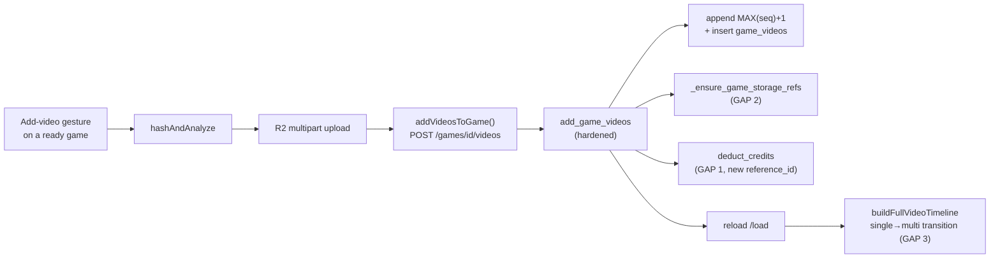

# T8700 — Design: Game upload surfacing (Opponent/Date) + attach-more-videos-to-an-existing-game

**Task:** [T8700-game-upload-opponent-date-multivideo.md](T8700-game-upload-opponent-date-multivideo.md)
**Tier:** L (design-gated) · **Status:** APPROVED 2026-09-04 (all 5 §7 open questions accepted as recommended)
**Owns:** data-model confirmation, the 3 backend safety-gap closures, upload-transport reuse, append-only sequence rule, credit/storage integration, migration decision, test plan, risks.
**Defers to a parallel ui-designer pass:** exact copy/layout/classes for the Opponent/Date field treatment AND the attach entry-point placement. This doc scopes the frontend surface at "which components change and what data/handlers they need."

---

## 0. TL;DR (the crux)

**Multi-video-per-game already exists end-to-end.** T8700 is *exposure*, not new plumbing:
the schema (`game_videos` child table), the backend attach endpoint (`POST /api/games/{id}/videos`),
the frontend transport (`addVideosToGame`), and Annotate's multi-video virtual timeline all ship today.

The one real engineering surface is that the bare `add_game_videos` endpoint was written for
**create-time** per-half upload only (its sole caller is `uploadMultiVideoGame`) and therefore
**skips three things `activate_game` does**: (1) it never **charges credits** for the attached video,
(2) it never inserts a **storage ref**, so the attached source is un-refcounted and reclaimable early,
and (3) it has no explicit **append-only sequence** discipline or single→multi transition handling.
Closing those three gaps is the backbone of this task. The frontend then reuses the existing
`hashAndAnalyze → R2 upload → addVideosToGame` transport behind a new "add video" gesture, and
re-loads the game so Annotate's timeline picks up the new half.

---

## 1. Current State Analysis

### 1.1 Data-model truth (confirmed against code)

The source of truth for a game's videos is the **`game_videos`** child table, not the legacy
single-video columns on `games`.

- **Schema** — `game_videos` (`src/backend/app/database.py:1556-1576`):
  `id, game_id INTEGER NOT NULL REFERENCES games(id) ON DELETE CASCADE, blake3_hash TEXT NOT NULL,
  sequence NOT NULL, duration, video_width, video_height, video_size, fps, UNIQUE(game_id, sequence)`;
  index `idx_game_videos_game(game_id)`. Comment at `:1551-1555` (T82/T7870) confirms **a
  `game_videos` row is written for EVERY game including single-video**; `games.blake3_hash` /
  `video_filename` are kept as a legacy/query convenience, not the sole source of truth.
- **`create_game`** (`games.py:275-473`) inserts the `games` row (aggregate duration/size, single-video
  legacy hash) then calls `_insert_game_videos(cursor, game_id, request.videos, ...)` unconditionally
  (`:451`). It already rejects empty `videos` (T1180, `:291-295`) precisely so no row is committed
  without a backing `game_videos` row.
- **`/load`** (`load_game`) returns `videos = _get_game_videos_response(cursor, game_id)`
  (`games.py:251-272`): list of `{sequence, blake3_hash, duration, video_url, video_width, video_height}`,
  ordered by `sequence`, each with a 4h presigned `games/{hash}.mp4` URL.
- **Annotate consumes multi-video already**: `applyGameData` reads `gameData.videos`;
  `buildFullVideoTimeline(gameVideos)` (`useVirtualTimeline.js:136-217`) concatenates per-half videos
  into one virtual timeline (`getVideoOffset`/`clampToVideo`). Clips carry `video_sequence`; natural
  key is `(game_id, end_time, video_sequence)`. **Single-video ⇒ `gameVideos = null`** (annotate.md
  Data flow); legacy clips with `video_sequence = NULL` resolve via `COALESCE(rc.video_sequence, 1)`
  on the backend (`games.py:782`) and `?? 1` on the frontend.

### 1.2 The attach endpoint EXISTS but is create-time-only

- **`POST /api/games/{game_id}/videos` → `add_game_videos`** (`games.py:476-554`), body
  `AddVideosRequest{videos:[VideoReference]}`. Docstring: *"Use this to add a second half to an
  existing game."* It validates each hash is in R2 (`_validate_video_in_r2`), inserts `game_videos`
  rows via `_insert_game_videos`, re-aggregates `games.video_duration`/`video_size` (and mirrors
  legacy fields + fps only when the game is still single-video, `:519-539`).
- **Frontend transport EXISTS**: `addVideosToGame(gameId, videos)` (`uploadManager.js:810`) — a thin
  `POST` wrapper. Its **only caller today** is `uploadMultiVideoGame` (`:992`, at `:1054`), which
  during a *create-time* multi-file upload hashes each file, uploads it to R2, creates the game with
  file 0, then attaches files 1..N. **No UI attaches a video to an already-created `ready` game.**

### 1.3 Code smells / gaps

| Gap | Location | Impact |
|-----|----------|--------|
| Attach charges **no credits** | `add_game_videos` (`games.py:476-554`) vs charge in `activate_game` (`games.py:801,824`) | An attached video is free; create-time upload is not — inconsistent pricing, revenue leak |
| Attach inserts **no storage ref** | `add_game_videos` never calls `insert_game_storage_ref`; `activate_game` does (`games.py:813-818`), and `_ensure_game_storage_refs` (`games.py:557-589`) is the idempotent primitive | Attached source is un-refcounted → expiry sweep can reclaim `games/{hash}.mp4` early, breaking playback of that half |
| No explicit **append-only** rule | `_insert_game_videos` assigns sequences from the request; attach is at the mercy of the caller | A prepend/reorder would shift every existing clip's virtual-timeline offset (`getVideoOffset`), silently corrupting clip positions |
| Single→multi transition undocumented | `gameVideos=null` when `videos.length<=1` | A game going 1→2 videos must start rendering the multi-video timeline; legacy `video_sequence=NULL` clips must still resolve at offset 0 |

### 1.4 Current attach behavior (pseudo)

```pseudo
add_game_videos(game_id, videos):
    validate each hash in R2
    _insert_game_videos(game_id, videos)          # sequences from request
    re-aggregate games.duration/size
    # NO credit charge, NO storage ref, NO append-only guard
    return {videos_added, videos}
```

---

## 2. Target Architecture

### 2.1 Design principles applied

- [ ] **DRY / single code path** — the attach path reuses `_ensure_game_storage_refs` (the same
      idempotent ref primitive `activate_game`'s self-heal uses) and `calculate_upload_cost` +
      `deduct_credits` (the same charge primitives), rather than forking pricing/ref logic.
- [ ] **Reuse the existing transport** — the frontend rides `hashAndAnalyze → R2 multipart upload →
      addVideosToGame`, the *same* three steps `uploadMultiVideoGame` already performs for halves ≥2.
      No new upload machinery (T8370 precedent: promote the existing path, don't build a parallel one).
- [ ] **Append-only sequence** — attach computes `MAX(sequence)+1`; never prepend/reorder.
- [ ] **No reactive persistence** — the charge + refs + insert all trace to ONE gesture ("Add video"
      → its confirm). Game re-load after attach is a read (no write-back).

### 2.2 Target attach flow (pseudo)

```pseudo
# gesture: user picks a file in the "Add video to this game" affordance
onAddVideoToGame(gameId, file):
    { blake3_hash, faststartInfo, file_size } = await hashAndAnalyze(file)   # existing
    await uploadFileToR2(blake3_hash, file, faststartInfo)                   # existing multipart path
    videoRef = { blake3_hash, sequence: <server-assigned>, duration, width, height, file_size }
    result = await addVideosToGame(gameId, [videoRef])                       # existing transport
    await reloadGame(gameId)   # /load → applyGameData → buildFullVideoTimeline picks up new half
```

```pseudo
# backend, hardened endpoint
add_game_videos(game_id, videos):
    require game exists (404 else)
    validate each hash in R2
    next_seq = (SELECT MAX(sequence) FROM game_videos WHERE game_id=?) + 1   # APPEND-ONLY
    assign sequences server-side from next_seq (ignore/override client sequence)
    _insert_game_videos(game_id, videos_with_assigned_sequences)
    re-aggregate games.duration/size (+ legacy fields only while still single-video)
    commit                                                                   # close write txn (bug26p)
    # GAP 2: storage refs for the newly-attached hashes (idempotent, own connection)
    _ensure_game_storage_refs(cursor, game_id, user_id, profile_id, storage_expires_at().isoformat())
    # GAP 1: charge for the newly-attached bytes (see §3.1 for the reference_id decision)
    cost = calculate_upload_cost(sum(new video_size)) or 1
    deduct_credits(user_id, cost, source="game_video_add", reference_id=f"{game_id}:{max_new_hash}")
    return {game_id, videos_added, videos, upload_cost_charged: cost}
```

### 2.3 Diagram



---

## 3. Implementation Plan

### Phase 1 — Backend safety-gap closure (do this FIRST; it is the crux)

**File: `src/backend/app/routers/games.py` — `add_game_videos` (`:476-554`)**

| # | Change | Detail |
|---|--------|--------|
| 1.1 | **Append-only sequence** | Before inserting, `SELECT COALESCE(MAX(sequence), 0) FROM game_videos WHERE game_id=?`; assign incoming videos `next, next+1, ...`. Server assigns the sequence — do NOT trust the client's `sequence` for attach (prevents prepend/reorder). The `UNIQUE(game_id, sequence)` constraint is the backstop. |
| 1.2 | **Storage refs (GAP 2)** | After the metadata `conn.commit()` (bug26p: must close the write txn first — `_ensure_game_storage_refs`/`insert_game_storage_ref` open their own connections), call `_ensure_game_storage_refs(cursor, game_id, get_current_user_id(), get_current_profile_id(), storage_expires_at().isoformat())`. It is idempotent per hash and already HEAD-checks the R2 source before writing a ref (bug 27p safe), so it only refs the truly-present new hashes. |
| 1.3 | **Credit charge (GAP 1)** | `cost = calculate_upload_cost(sum(new video_size)) if sum>0 else 1`, then `deduct_credits(user_id, cost, source="game_video_add", reference_id=f"{game_id}:{hash_of_new_video}")`. **Charge ordering:** refs → charge (mirror `activate_game`'s "ref first, then charge" so we never charge for an unref'd/absent source). On `CreditsUnavailable` → HTTP 503 `{code:"credits_unavailable", retryable:true}`; on `!result["success"]` → HTTP 402 with `required`/`balance` (identical shape to `activate_game:823-835`). Return `upload_cost_charged` in the response. |
| 1.4 | **Milestone (optional, parity)** | Consider `record_milestone(user_id, "game_video_add")` for funnel visibility. Not required for correctness — flag as open question §7. |

**The reference_id decision (critical — prevents a silent no-op charge).**
`deduct_credits` is **idempotent on `(source, reference_id)`** (credit_ledger, `credit_key()`), and
`activate_game` already charged the whole game under `source="game_upload", reference_id=str(game_id)`
(`games.py:824`). If attach reused that same `(source, reference_id)` the debit would be a **no-op**
(already charged). Therefore attach MUST use a **distinct reference** that is unique per attached
video — the recommendation is `source="game_video_add", reference_id=f"{game_id}:{blake3_hash}"`.
Keying on the hash also makes the charge **idempotent per attached video**, so a Retry after a crash
between insert and charge cannot double-charge — matching the idempotency guarantee `activate_game`
relies on. (This is the one place a naive "reuse activate's charge" would silently do nothing.)

**Ordering within the endpoint (mirror `activate_game:804-846`):** insert+aggregate → `conn.commit()`
→ storage refs → charge → return. Keep insert and charge adjacent-enough that the failure modes are:
insert-but-no-charge (self-healable/retryable, game still shows the video but a follow-up run charges),
never charge-but-no-video.

### Phase 2 — Frontend wiring (after Phase 1 is green)

| File | Change |
|------|--------|
| `src/frontend/src/services/uploadManager.js` | Export a single-purpose `attachVideoToExistingGame(gameId, file, onProgress)` that runs the existing 3 steps (`hashAndAnalyze` → the existing R2 multipart upload helper `uploadMultiVideoGame` uses for halves ≥2 → `addVideosToGame`). Extract the halves-≥2 body of `uploadMultiVideoGame` if it isn't already reusable, so create-time and attach-time share ONE code path (DRY). |
| Game surface component (per ui-designer) | New "Add video" affordance on a `ready` game (entry-point placement is the ui-designer's call — likely GameTile / an open-game surface). It needs: the `gameId`, a file picker, `attachVideoToExistingGame`, progress UI, and on success a **game re-load** so Annotate/the game view re-render with the new half. |
| `GameDetailsModal.jsx` (create-time) | Opponent/Date field-treatment change (make them feel wanted, not "optional, skip me") + video dropzone visibly present, still optional — **exact copy/layout deferred to ui-designer.** Submit must stay non-blocking (T8500 gates on `hasVideo` alone; opponent/date still default). This doc only asserts: no behavior regression to the two-gesture create flow, and the fields remain non-required-to-submit. |

The credit/expiry pre-check UX (showing the cost before confirming an attach) should mirror the
create-time cost line; `prepare_upload` already returns an `upload_cost` preview
(`games_upload.py:270-274`) the attach affordance can surface.

### Phase 3 — Single→multi transition verification (GAP 3)

No code change expected — **verification + tests**:
- A game with one `game_videos` row (`videos.length === 1` ⇒ `gameVideos=null`) that gains a second
  row must, on re-load, render the multi-video timeline (`videos.length > 1` ⇒
  `buildFullVideoTimeline` runs). Confirm `applyGameData` re-derives `gameVideos` from the fresh
  `/load` payload (not a stale memo).
- Legacy clips captured while single-video have `video_sequence = NULL`. Confirm they resolve at
  **offset 0** post-transition: backend `COALESCE(rc.video_sequence, 1)` (`games.py:782`) and
  frontend `?? 1` both map NULL→sequence 1, and sequence 1 is the first video (offset 0 in
  `getVideoOffset`). Append-only guarantees the newly-attached video is sequence 2+, so it can never
  steal offset 0 from the existing clips.

---

## 4. Data-safety & invariants

- **Append-only is load-bearing.** Existing clips' positions are computed as
  `getVideoOffset(video_sequence)` over the ordered `game_videos`. Inserting anywhere but the tail
  shifts every later video's offset and silently mis-positions existing clips. The `MAX(sequence)+1`
  rule + `UNIQUE(game_id, sequence)` make reorder structurally hard.
- **A ready game must never have an unref'd, chargeable video.** Refs-before-charge mirrors
  `activate_game`; `_ensure_game_storage_refs` refuses to ref an absent R2 source (bug 27p), so we
  never ref-then-fail-to-play.
- **Charge is idempotent per attached video** (`reference_id=f"{game_id}:{hash}"`), so Retry is safe
  and double-charge is impossible — the same property `activate_game` depends on.
- **Attach is purely additive** — it inserts new `game_videos` rows and re-aggregates; it never
  touches existing rows, existing clips, or `raw_clips.game_id` (write-once, T7010). No orphaning of
  the first video's clips/framing (task Technical Note satisfied).
- **Re-load after attach is read-only** — no reactive write-back (gesture-based persistence rule).

---

## 5. Migration decision

**No migration required.** The `game_videos` table, its index, and the `_insert_game_videos` write
path already exist and already run for every game (single and multi). This task adds no column and
changes no schema — it only (a) charges/refs on an existing write path and (b) adds a frontend
gesture. Existing single-video games are untouched until their owner explicitly attaches a second
video (acceptance criterion "Existing single-video games are unaffected (no forced migration/backfill)"
is satisfied by construction). **Migration agent: not needed.** Confirm during review that no
`_SCHEMA_DDL`/`_USER_DB_SCHEMA` change sneaks in.

---

## 6. Test plan (Tester Phase 1 — write these RED first)

### Backend (`src/backend/tests/`, new `test_t8700_attach_video.py`)

1. **Charges credits (GAP 1):** attach a video to a ready game → user's credit balance drops by
   `calculate_upload_cost(new_size)`; response carries `upload_cost_charged`. (Fails today: no charge.)
2. **Distinct reference_id is not a no-op:** create+activate a game (charged under
   `game_upload:{game_id}`), then attach → the attach debit actually applies (proves we did NOT reuse
   activate's `(source, reference_id)`).
3. **Idempotent per video:** attaching the *same* hash twice (retry) charges once (idempotency on
   `game_video_add:{game_id}:{hash}`).
4. **Insufficient credits → 402** with `required`/`balance`; game_videos row NOT left half-charged.
5. **Storage ref inserted (GAP 2):** after attach, a `game_storage` / `game_storage_refs` row exists
   for the new hash (so the expiry sweep won't reclaim it). (Fails today: no ref.)
6. **Ref refused for absent R2 source (bug 27p parity):** `_ensure_game_storage_refs` doesn't ref a
   hash whose `games/{hash}.mp4` is missing.
7. **Append-only sequence (GAP 3):** attaching to a game with sequences {1} yields sequence 2;
   attaching two at once yields {2,3}; existing rows' sequences unchanged; client-supplied out-of-order
   `sequence` is overridden.
8. **404** on unknown game; **empty videos → 400** (existing guards still hold).
9. **Single→multi aggregate:** `games.video_duration`/`video_size` re-aggregate to the sum after attach.

### Frontend (`src/frontend/src/services/`)

10. `attachVideoToExistingGame` unit test: mocks `hashAndAnalyze`/upload/`addVideosToGame`, asserts the
    3-step order and that success triggers a game re-load.
11. `useVirtualTimeline` / `applyGameData`: a game re-loaded with `videos.length` going 1→2 switches
    from `gameVideos=null` (single) to `buildFullVideoTimeline` (multi); legacy `video_sequence=null`
    clip resolves at offset 0 after transition.
12. `GameDetailsModal`: create-time submit stays enabled without opponent/date (non-blocking);
    Opponent/Date rendered as first-class (assert against the ui-designer's chosen treatment — coordinate).

### E2E (`src/frontend/e2e/`, new spec)

13. Create a single-video game → open it → use the new "Add video" affordance → attach a second video
    → assert the game shows two videos and Annotate renders the concatenated timeline; assert a credit
    charge occurred.

**Relevant set to run:** the new backend file + `test_games.py`/upload tests guarding the game
create/activate corner; `uploadManager.test.js`; `GameDetailsModal` unit tests; the new attach e2e
spec. Not the full suite (Branch CI is the full-sweep verdict).

---

## 7. Risks & open questions

| Risk | Mitigation |
|------|------------|
| Reusing `activate_game`'s `(source, reference_id)` → silent no-op charge | **Explicitly** use `source="game_video_add", reference_id=f"{game_id}:{hash}"`; test #2 proves it charges |
| Append at wrong position shifts existing clip offsets | Server-assigned `MAX(seq)+1` + `UNIQUE(game_id, sequence)`; test #7 |
| Attached source reclaimed early (no ref) | `_ensure_game_storage_refs` after commit; test #5 |
| Extracting the halves-≥2 upload body from `uploadMultiVideoGame` regresses create-time multi-upload | Keep create-time and attach on ONE shared helper; run `uploadManager.test.js` + a create-time multi-video e2e in the relevant set |
| Attach onto a `pending` (not-yet-activated) game | Decide: reject attach unless `status='ready'` (attach is a post-creation action) — recommend 409/400 if not ready. **Open question Q3.** |

**Open questions — ALL RESOLVED (approved 2026-09-04, recommendations accepted):**
- [x] **Q1 — `source` name:** ACCEPTED — distinct `source="game_video_add"`, `reference_id=f"{game_id}:{hash}"`.
- [x] **Q2 — Milestone:** ACCEPTED — emit a new lightweight `game_video_add` milestone, no daily column.
- [x] **Q3 — Attach onto non-ready game:** ACCEPTED — reject unless `status='ready'`, return **409**.
- [x] **Q4 — ui-designer coordination:** ACCEPTED — proceed with the ui-designer pass for exact
      Opponent/Date copy/layout + attach entry-point placement (GameTile kebab + rail progress per the
      ui-designer proposal); field-treatment tests assert against that chosen copy.
- [x] **Q5 — Cost preview before confirm:** ACCEPTED — surface `prepare_upload`'s `upload_cost` in the
      attach affordance (mirror the create-time cost line); no new endpoint.
