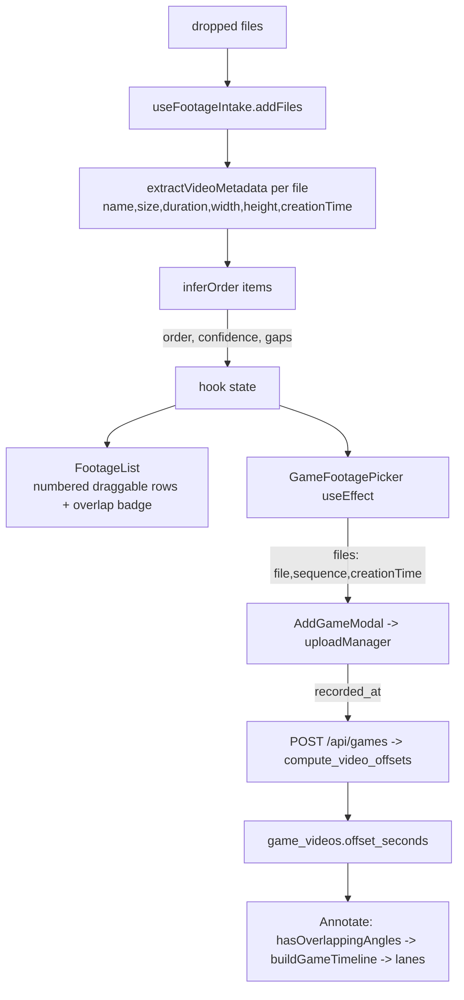
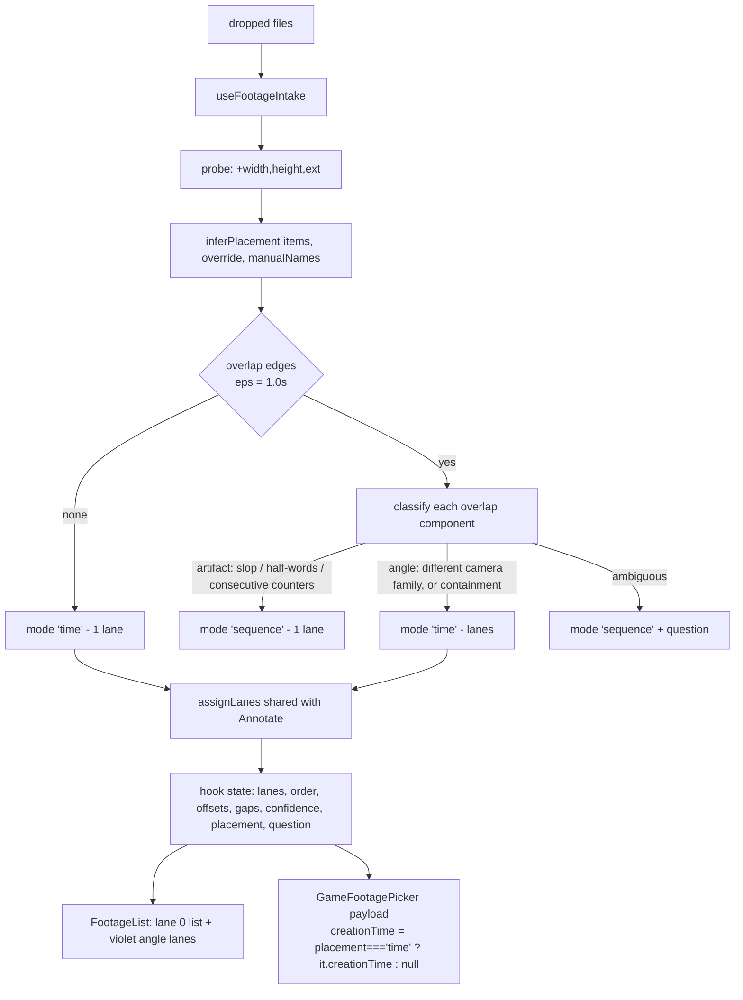

# T8824 Design: Intake - overlap is a signal, not a disqualifier (layered order editor)

**Status:** APPROVED 2026-09-07 (user: "I approve of the design. Please proceed") - all 7 open
questions (§8) accepted as recommended: Q1 ambiguous defaults to sequential, Q2 containment
auto-angles without asking, Q3 accepts the Legends+angle gap (no invented placement), Q4
accepts the slop trust-line nuance, Q5 clock-time wording on angle rows, Q6 skip codec/fps
probing for v1, Q7 run in parallel with T8892 (data-wise; see the supervisor's separate
file-conflict finding below, which queues the CONTAINER behind T8892 for unrelated reasons -
shared edit surface in `GameFootagePicker.jsx`/`useVirtualTimeline.js`, not a data dependency).
**Author:** Architect Agent
**Created:** 2026-09-06
**Mockups:** [T8824-picker-mockup.html](T8824-picker-mockup.html) (open in a browser; S1-S7, widths 360/390/428)
**Task file:** [universal-upload/T8824-intake-overlap-as-layers.md](universal-upload/T8824-intake-overlap-as-layers.md)

---

## 0. What this changes at the decision level

| Doc | Today | After this task |
|-----|-------|-----------------|
| EPIC decision 1 | Chain overlaps =&gt; timestamps are export times =&gt; **discard WHOLESALE**, fall back to filenames | Chain overlaps =&gt; **classify the overlap** (artifact vs genuine angle) and place accordingly; discard only when the evidence says artifact |
| EPIC decision 3 | "confirm strip: chips show evidence, gaps render as connectors, one trust line" | Same, plus: **angles render as violet lanes below the list**, and the trust line gains the angle count / the one-recording phrasing |
| T8822 overlap badge | Violet "we'll treat it as a second angle" badge per row, driven by `overlapGroups` | **Retired.** The lanes ARE the overlap disclosure; `overlapGroups` is deleted |
| T8872 gate | `confidence === 'time'` decides whether ANY `recorded_at` is sent | `placement === 'time'` decides it. Same invariant, new (and correct) input |

Proposed replacement text for EPIC decision 1 is in §7.1.

---

## 1. Current State ("As Is")

### 1.1 Data flow



### 1.2 Current behaviour

```pseudo
inferOrder(items):
    if every item has creationTime:
        sort by creationTime
        chainValid = no pair overlaps by more than CHAIN_TOLERANCE_S (120s)
        if chainValid: return {order: byTime, confidence:'time', gaps}
        # else: fall through, timestamps discarded for EVERY item
    byName = halfWords || sharedPrefixCounter || embeddedDate
    if byName: return {order: byName, confidence:'name', gaps: []}
    return {order: naturalSort, confidence:'unknown', gaps: []}

GameFootagePicker:
    creationTime sent = (confidence === 'time') ? item.creationTime : null   # T8872

FootageList:
    overlaps = overlapGroups(order, confidence)   # only when confidence==='time'
    -> violet informational badge per overlapping row
```

### 1.3 Limitations (verified against the code, 2026-09-06)

1. **The headline scenario is unreachable.** Main camera + a phone clip filmed during it =&gt; the
   chain check fails =&gt; timestamps discarded =&gt; `confidence:'unknown'` =&gt; yellow "We couldn't tell
   what order these go in", no badge (the badge needs `confidence === 'time'`, which overlap can
   never produce - `overlapGroups` is **dead code for real overlap**, it can only ever fire for
   sub-120s slop), and post-T8872 no `recorded_at` at all. Every part of the stack loses.
2. **One decision serves two opposite truths.** Legends (export artifact) and phone-during-game
   (real angle) are the same input signature to `inferOrder`, which always picks "artifact".
3. **`CHAIN_TOLERANCE_S = 120` is now a latent phantom-angle bug.** An overlap of 2-120s keeps
   `confidence:'time'`, so the raw timestamps ARE sent; `compute_video_offsets` stores overlapping
   offsets; and Annotate's `hasOverlappingAngles` (epsilon **1.0s**) then routes the game to
   `buildGameTimeline`, inventing an angle out of recording-split slop. The intake and Annotate
   disagree about what "overlap" means by a factor of 120.
4. **`setManualOrder` is a second, divergent code path.** It hand-patches `order`/`confidence`/`gaps`
   in `setState` instead of re-deriving them, so every future field (lanes, offsets) has to be
   hand-patched there too, forever.
5. **Per-item timestamp trust is unsafe against the current backend** (found while designing, see
   §2.5): `compute_video_offsets` places a video with `recorded_at` on the wall axis and a video
   without it by **prefix-sum**. Mixing the two axes inside one game silently produces bogus
   placements (e.g. an untimed clip landing on top of a timed one =&gt; phantom angle). The
   task file's suggested per-item `trusted` flag would introduce exactly this.

---

## 2. Target State ("Should Be")

### 2.1 One model, two placement modes

`inferOrder` becomes **`inferPlacement`**: it returns everything the picker renders and everything
the payload sends, and it has exactly **two placement modes**:

| Mode | Meaning | Payload | Picker |
|------|---------|---------|--------|
| `'time'` | Every item's recording clock is trusted evidence on ONE shared clock | `recorded_at` sent for **every** item | Lanes from `assignLanes` (1 lane when nothing overlaps) |
| `'sequence'` | The clock cannot place these files | `recorded_at` **null for every item** | Exactly one lane = today's list |

**Invariant P (picker == Annotate, by construction):** the intake emits timestamps only when the
placement it just displayed is the placement the backend will compute and Annotate will re-derive.
In `'sequence'` mode the backend prefix-sums, `hasOverlappingAngles` is false, and the game renders
on the untouched `buildFullVideoTimeline` path - which is exactly one lane, which is what the picker
drew. In `'time'` mode the backend's `recorded_at - zero` reproduces our offsets and Annotate's
`assignLanes` reproduces our lanes (same function, same inputs). There is no third state, so there
is no way for the two to disagree.

This is why placement is a whole-set property and not a per-item flag (§1.3.5): a set that is
half wall-clock and half prefix-sum has no coherent axis.

### 2.2 Target flow



### 2.3 The disambiguation rule (the design gate's core question)

Given probed items (`name`, `duration`, `creationTime`, `width`, `height`, `ext`):

```pseudo
inferPlacement(items, { override, manualNames }):

  # ---- 0. no clock at all -> today's behaviour, unchanged
  if NOT every item has a usable creationTime:
      return sequenceMode(order = halfWords || counter || date || naturalSort)

  # ---- 1. mirror the backend's placement window (games.py PLACEMENT_WINDOW_H = 12)
  start(i)  = creationTime(i) in seconds
  offset(i) = start(i) - min(start)
  if max(offset) > 12h:                      # garbage clock, backend would prefix-sum it
      return sequenceMode(...)

  # ---- 2. overlap graph, at ANNOTATE'S epsilon (never 120s again)
  edge(a,b) iff overlapSeconds(a,b) > OVERLAP_EPSILON_S    # 1.0, shared constant
  if no edges: return timeMode(...)                        # DJI folder, gaps preserved

  # ---- 3. classify each connected component of the overlap graph
  for each component:
      if isSlop(component):            verdict = ARTIFACT   # A0
      elif hasOneRecordingNames(comp): verdict = ARTIFACT   # A1
      elif hasDifferentFamily(comp):   verdict = ANGLE      # A2
      elif hasContainment(comp):       verdict = ANGLE      # A3
      else:                            verdict = ASK        # A4

  # ---- 4. the SET decides (invariant P: one axis or none)
  if every component is ANGLE:  auto = 'time'
  else:                         auto = 'sequence'          # + question if any ASK

  # ---- 5. the user always wins
  placement = manualNames ? 'sequence' : (override ?? auto)
```

Signal definitions:

| # | Signal | Test | Why it is trustworthy |
|---|--------|------|-----------------------|
| A0 | **Slop** | every overlap in the component is `<= SLOP_MAX_S (120)` **and** `<= 50%` of the shorter file | Recording-split / clock-rounding noise. Never a real angle worth a lane: a clip that overlaps the main camera by under 2 minutes and is mostly outside it is a sequential tail, not a second camera |
| A1 | **One-recording names** | decisive `_orderByHalfWords` over the component, **or** shared non-empty prefix + **consecutive** integer counters | Half words and camera counters describe SEGMENTS OF ONE RECORDING. One camera cannot record two files at once, so the clock must be lying (Legends: `creation_time` is the export time) |
| A2 | **Different camera family** | some overlapping pair differs in `width x height` **or** container extension | Two different devices =&gt; both clocks are real recording clocks =&gt; the overlap is real (DJI 7680x4320 `.MP4` vs phone 1080x1920 `.MOV`) |
| A3 | **Containment** | some overlapping pair has one interval wholly inside the other **and** `longer.duration >= 3 x shorter.duration` | Segments of ONE recording are disjoint in real time - they can never contain one another. A 4-min file sitting inside a 50-min file is a second camera, whatever the filenames say |
| A4 | **Ask** | none of the above | EPIC decision 1's "ask, never block" survives verbatim |

Explicitly **rejected** signals (show-your-work):

- **`_orderByDate` as an artifact signal.** A date embedded in a filename is an ORDER hint, not a
  one-recording hint: two different phones both name files `VID_<date>_<time>`. Using it would
  misclassify the "two phones, no main camera" fixture as an artifact. It stays in the ordering
  cascade for `'sequence'` mode and never votes on artifact-vs-angle.
- **Loose trailing counters as an artifact signal.** `_orderByCounter` today accepts
  `VID_20260905_094101` / `VID_20260905_101533` as "shared prefix + distinct counters" - which is
  the two-phones fixture again. A1 therefore requires **consecutive** counters (`DJI_0231, 0232,
  0233`), which is what camera segmentation actually produces.
- **Filename-date vs embedded-clock corroboration.** Attractive, but the epic's own evidence kills
  it: `VID_20260905_094101.mp4`'s filename date is the COPY date and disagrees with the real
  recording time. A signal that is wrong on the one fixture we have must not be load-bearing.
- **Codec / fps probing.** Would sharpen A2, but `extractVideoMetadata` exposes neither (the
  `<video>` element gives no codec; `_parseMoov` reads `mvhd` + `tkhd` only - codec needs a
  `trak>mdia>minf>stbl>stsd` descent, fps needs `stts`). Resolution + container already separate
  every real fixture, and the fallback when they don't is A4 (ask), which is safe. **Do not extend
  the MP4 parser in this task**; A2 can gain `codec` later without any other change.

### 2.4 Every fixture, resolved

| # | Fixture | Overlap? | Component verdict | Mode | Picker | Payload | Annotate |
|---|---------|----------|-------------------|------|--------|---------|----------|
| 1 | **DJI folder** (4 segs, 9-min halftime gap) | none | - | `time` | 1 lane, 4 rows, "9 min break" | all 4 `recorded_at` | no overlap -&gt; `buildFullVideoTimeline`, byte-identical to today |
| 2 | **Legends export pair** (overlap 32 min, reversed) | yes | A1 half-words -&gt; ARTIFACT | `sequence` | 1 lane, name order, 1st-half first | **all null** | prefix-sum, 1 lane |
| 3 | **Phone during the DJI game** | yes (phone vs seg 2) | A2 different family -&gt; ANGLE | `time` | lane 0 = 4 DJI rows + gap; lane 1 = violet `sideline.mp4` | all 5 `recorded_at` | `hasOverlappingAngles` -&gt; backbone = 4 DJI, angle lane 1 - **same lanes** |
| 4 | Chain with a real gap AND an angle | = fixture 3 | ANGLE | `time` | gap connector on lane 0, angle unaffected | all | gap compresses on the backbone, angle keeps its wall position |
| 5 | Main + 2 phones that overlap each other | yes, one component | A2 -&gt; ANGLE | `time` | **3 lanes** (lane 2 exists because the phones overlap) | all | identical 3 lanes (same `assignLanes`) |
| 6 | Angle running past the main camera's end | yes | A2 -&gt; ANGLE | `time` | angle block overflows lane 0's right edge | all | coverage extension (EPIC decision 9) |
| 7 | **No main camera: two identical phones, half-overlapping** | yes | same family, no scheme, no containment -&gt; **ASK** | `sequence` (default) | 1 lane + question, submit never blocked | null | sequential. Answer "yes" -&gt; `time`, 2 lanes |
| 8 | Two identical phones, 4-min clip inside a 90-min clip | yes | A3 containment -&gt; ANGLE | `time` | lane 0 = the 90-min file, lane 1 = the clip | all | 2 lanes |
| 9 | Same camera, 45s slop between consecutive segments | yes (&gt;1s) | A0 slop (also A1) -&gt; ARTIFACT | `sequence` | 1 lane, time order kept, green trust line | **all null** | 1 lane. **Fixes the §1.3.3 phantom angle** |
| 10 | Sub-second slop (0.4s) | no edge (eps 1.0) | - | `time` | 1 lane | all | 1 lane (same epsilon) |
| 11 | Legends pair **plus** a real phone angle | yes, 2 components (ARTIFACT + ANGLE) | set rule =&gt; `sequence` | `sequence` | 1 lane | all null | sequential, no angle |
| 12 | One item has no `creationTime` | n/a (rule 0) | - | `sequence` | today's exact behaviour | all null | unchanged |

Fixture 11 is the one place this design deliberately gives up an angle. It is not a gap in the rule,
it is the rule being honest: the Legends halves have **no usable clock at all**, so there is no
common axis on which the phone clip can be placed relative to them. Any placement we invented would
be a guess written into a **write-once** `offset_seconds`. Sequential is recoverable; a wrong angle
(today) is not. See open question Q3.

Fixture 9 is a deliberate, small regression trade: the halftime "9 min break" connector disappears
for a camera whose segment timestamps overlap by 1-120s, because we now drop those timestamps. In
exchange we stop shipping overlapping `offset_seconds` that Annotate would render as an invented
angle. No real probed fixture behaves this way (DJI chains exactly); the 120s tolerance was a guard,
not evidence.

### 2.5 The payload rule (T8872's invariant, restated correctly)

```pseudo
# GameFootagePicker
creationTime: placement === 'time' ? item.creationTime : null
```

- `placement`, **never** `confidence`, gates the payload. `confidence` stays a **display** concept
  (which evidence ordered the list -&gt; which trust line / which per-row evidence). They are equal in
  every state except fixture 9 (slop), where the list is genuinely ordered by the clock
  (`confidence:'time'`, green line, clock evidence per row) while placement is sequential. A unit
  test pins exactly that pair so nobody "simplifies" the gate back to `confidence`.
- No per-item `trusted` flag: it would be redundant state (always `placement === 'time'`) and it
  would invite the mixed-axis bug of §1.3.5.

### 2.6 Shared lane assignment

`buildGameTimeline`'s lane block (backbone seed = longest video, grown by non-overlap in offset
order; then the minimal-lane greedy for the rest) moves verbatim into a new pure module and is
called from both sides:

```pseudo
# src/frontend/src/utils/laneAssignment.js   (new)
export const OVERLAP_EPSILON_S = 1.0
export function assignLanes(intervals)      # [{key, start, end, duration}]
    -> { laneOf: Map<key, laneIndex>, backbone: key[], laneCount }
```

`useVirtualTimeline.js` re-exports `OVERLAP_EPSILON_S` (so no existing import path breaks) and calls
`assignLanes(videos.map(v => ({key: v.sequence, ...})))`. The picker calls it with
`{key: dedupeKey(item)}`. **T8880/T8890's suites must pass unmodified** - that is the acceptance
test for the extraction commit.

---

## 3. Model shape exposed by `useFootageIntake`

```pseudo
{
  status, items, skipped, proxies,          # unchanged
  order,        # ALL items in payload order = sorted by offset, tie: lane, then name
  confidence,   # 'time' | 'name' | 'unknown' | 'manual'   (display only, unchanged meaning)
  gaps,         # [{afterIndex, seconds}] - indices into lanes[0] (== order when 1 lane)
  placement,    # NEW: 'time' | 'sequence'  -> the payload gate
  lanes,        # NEW: [[placed, ...], ...]  lanes[0] = backbone. Always length >= 1
  spanSeconds,  # NEW: max(end) - min(start) over all items; the mini-map's 100%
  question,     # NEW: null | { a: item, b: item }   (A4 only)
  addFiles, removeItem, setManualOrder,
  setPlacementMode(mode),                   # NEW gesture: the one override control
  reset,
}

placed = { item, offsetSeconds, endSeconds, lane }
```

- `offsetSeconds` mirrors what `compute_video_offsets` will compute: `start - min(start)` in
  `'time'` mode, prefix-sum-of-durations by order in `'sequence'` mode. One unit test asserts the
  mirror for both modes (the Python is the source of truth; the JS comment names `games.py`).
- **When `lanes.length === 1` the model is field-for-field what T8822 already renders**, so the
  no-angle path is provably unchanged (test: identical DOM).
- The hook keeps only `items`, `override`, `manualNames`. **Everything else is derived by one call**
  to `inferPlacement` from one `publish()` - deleting `setManualOrder`'s hand-patched `setState`
  (§1.3.4). Drag now sets `manualNames` and re-publishes; gaps drop out naturally (no time
  placement =&gt; no gaps), preserving T8822's fix without the special case.

---

## 4. Picker layout

Open [T8824-picker-mockup.html](T8824-picker-mockup.html). Structure inside `FootageList`:

```
+-- card (green | yellow when asking) ------------------------+
|  Your game - 5 videos - 1 hr 21 min                          |
|  [lane 0: today's numbered, always-draggable rows]           |   <- unchanged component code
|  [gap connectors between lane-0 rows]                        |
|  [+ Add more]                                                |
|  --- Also filmed at the same time -------------------------- |   <- only when lanes.length > 1
|  [mini-map: lane 0 gray blocks / lane 1..n violet blocks]    |
|  [violet angle row: name, duration, "overlaps X from .. to"] |
|  [violet angle row: ...]                                     |
|  trust line                                                  |
|  one-line escape hatch (the override control)                |
+--------------------------------------------------------------+
```

Decisions:

1. **Lane 0 stays the vertical list; lanes 1+ are a time-proportional mini-map plus labelled rows.**
   A full 2D grid would have to replace the draggable list with proportional blocks (unusable at
   360px for a 5-min segment next to a 24-min one, and it would kill drag). The mini-map carries
   the layered picture; the rows carry the text, the 44px touch target and the remove button. The
   mini-map is deliberately the same idiom as Annotate's `AngleLanes` bars, so the picker
   *looks like* what the user will see next.
2. **The mini-map includes lane 0** (gray blocks, one per backbone video, real gaps as real holes).
   Without it "positioned by offset" has no reference.
3. **Angle rows are not numbered** (a violet camera glyph instead) - they are not "next in order".
4. **Drag is lane-0-only in v1.** Angle rows have no grip. Moving an angle in time is T8900.
5. **Remove works on every row**, including angles.
6. **One override control, three phrasings, one code path** (`setPlacementMode`):
   - angles showing -&gt; `Not two cameras? Put them all in order instead` (-&gt; `'sequence'`)
   - artifact/sequential with overlap present -&gt; `Were they filmed at the same time? Show them as angles` (-&gt; `'time'`)
   - after a lane-0 drag -&gt; `Use the recorded times instead` (-&gt; clears `manualNames`, `'time'`)
   - ASK state -&gt; the same two destinations rendered as two buttons with the safe one preselected.
   It renders **only** when overlap exists (or after a drag on a set that has overlap), so the
   no-angle path gains zero pixels.
7. **Mobile 360-428px:** the mini-map is fluid width, lanes `h-3.5` + 4px gap (3 lanes = 50px);
   angle rows use the existing 44px coarse-pointer minimum; the "overlaps ..." line wraps to two
   lines at 360px and never truncates the partner filename below `shortLabel`'s 14 chars.

### 4.1 Copy (approved tone; "angle", never "lane"/"overlap"/"offset")

| State | Trust line | Extra |
|-------|-----------|-------|
| `time`, no angles | `Put in order by the time each was recorded` (unchanged) | - |
| `time`, 1 angle | `Put in order by the time each was recorded - and 1 angle filmed at the same time` | link: `Not two cameras? Put them all in order instead` |
| `time`, N angles | `... - and {N} angles filmed at the same time` | same link |
| artifact (names) | `These look like two parts of one recording - put in order by their names` | link: `Were they filmed at the same time? Show them as angles` |
| artifact (slop) | `Put in order by the time each was recorded` (green, unchanged) | none (no visible overlap) |
| ASK | `We put them in order by their names - check this looks right` (yellow) | question: `Were {A} and {B} filmed at the same time?` / buttons `No - two parts of one game` (preselected) and `Yes - two cameras at once` |
| manual | `Order set by you` (unchanged) | link: `Use the recorded times instead` (only if the set has overlap) |
| angle row | `{duration} - overlaps {partner} from {clock} to {clock}` | partner = `shortLabel` of the lane-0 file it overlaps most; 2+ partners -&gt; `{first} and {second}` |

Clock times (`6:25 PM`) rather than elapsed `mm:ss`: every row in this state already shows clock
evidence, and a parent has no elapsed-time reference before Annotate exists. See Q5.

---

## 5. Implementation Plan ("Will Be")

Sequenced so each commit is independently green and reviewable (&lt;200 lines of meaningful diff).

### Step 1 - extract `assignLanes` (mechanical move, zero behaviour change)

| File | Change |
|------|--------|
| `src/frontend/src/utils/laneAssignment.js` | **NEW.** `OVERLAP_EPSILON_S`, `intervalsOverlap`, `assignLanes(intervals)` moved verbatim from `buildGameTimeline` |
| `src/frontend/src/modes/annotate/hooks/useVirtualTimeline.js` | import + re-export `OVERLAP_EPSILON_S`; backbone/greedy block replaced by one `assignLanes` call |
| `src/frontend/src/utils/laneAssignment.test.js` | **NEW** - minimal-lane, backbone-anchoring, epsilon cases |

Gate: `useVirtualTimeline.test.js` + `useVirtualTimeline.overlap.test.js` pass **unmodified**.

### Step 2 - `inferPlacement`

| File | Change |
|------|--------|
| `src/frontend/src/utils/footageIntake.js` | `inferOrder` -&gt; `inferPlacement(items, {override, manualNames})`; `CHAIN_TOLERANCE_S` -&gt; `SLOP_MAX_S` (+`SLOP_MAX_FRACTION = 0.5`, `CONTAINMENT_RATIO = 3`, `PLACEMENT_WINDOW_S = 12*3600` mirroring `games.py`); `_orderByCounter` gains the **consecutive** requirement; new `_overlapComponents`, `_classifyComponent`; filename heuristics kept and reused |
| `src/frontend/src/utils/footageIntake.test.js` | rewrite the `inferOrder` block as `inferPlacement`, one test per row of §2.4's table (12 cases) + the `compute_video_offsets` mirror test |

No facade / no `inferOrder` shim: the only callers are the hook and its test (greppability over
compatibility).

### Step 3 - hook

| File | Change |
|------|--------|
| `src/frontend/src/hooks/useFootageIntake.js` | state = `items` + `override` + `manualNames`; ONE `publish()` derives everything through `inferPlacement`; `setManualOrder` sets `manualNames` (its bespoke `setState` deleted); new `setPlacementMode`; expose `placement`, `lanes`, `spanSeconds`, `question` |

### Step 4 - `FootageList`

| File | Change |
|------|--------|
| `src/frontend/src/components/FootageList.jsx` | rows map over `lanes[0]`; new `<AngleLanes>` sub-block (mini-map + angle rows) rendered only when `lanes.length > 1`; new question block; one override link; **overlap badge + `Layers` import deleted** |
| `src/frontend/src/utils/footageDisplay.js` | **delete `overlapGroups`** (superseded); keep `shortLabel`; add `overlapSentence(angle, partners)` |
| `src/frontend/src/components/FootageList.test.jsx` | delete the badge block; add lanes/mini-map/question/override tests + `lanes.length === 1` DOM-equality test + 360/390/428 sweep |
| `src/frontend/src/utils/footageDisplay.test.js` | drop `overlapGroups` tests, add `overlapSentence` |

### Step 5 - payload

| File | Change |
|------|--------|
| `src/frontend/src/components/GameFootagePicker.jsx` | `creationTime: placement === 'time' ? ... : null`; thread `placement`/`lanes`/`question`/`setPlacementMode` into `FootageList`; comment rewritten (T8872 -&gt; T8824) |
| `src/frontend/src/components/GameFootagePicker.test.jsx` | rewrite the three T8872 tests against `placement`; add the slop case (`confidence:'time'` + `placement:'sequence'` =&gt; null) |

Backend: **no change.** `compute_video_offsets` already does the right thing for both modes.

### Step 6 - e2e

| File | Change |
|------|--------|
| `src/frontend/tests/e2e/...` | (a) ffmpeg-built main + `sideline` (T8892 recipe) -&gt; picker shows 2 lanes -&gt; `GET /api/games/{id}` has non-null `recorded_at` + overlapping `offset_seconds` -&gt; Annotate shows the angle; (b) Legends-shaped pair -&gt; 1 lane, `recorded_at` null, prefix-sum offsets. Existing `T8820-confirm-strip-reorder.qa.spec.js` must still pass |

### Step 7 - docs (same commit as the code that changes the rule)

EPIC decision 1 rewritten (§7.1), decision 3's confirm-strip bullet gains the angle-lane sentence,
`.claude/knowledge/annotate.md` intake bullet updated (badge retired, placement model, shared
`assignLanes`, the `placement`-not-`confidence` gate), T8822's task file annotated "badge superseded
by T8824".

### 5.1 Curated test set for the local runs

`footageIntake.test.js`, `laneAssignment.test.js`, `useVirtualTimeline.test.js`,
`useVirtualTimeline.overlap.test.js`, `FootageList.test.jsx`, `GameFootagePicker.test.jsx`,
`footageDisplay.test.js`, `AnnotateTimeline.angleStrip.test.jsx`, plus the two e2e specs.

---

## 6. Risks

| Risk | Mitigation |
|------|-----------|
| Picker lanes drift from Annotate lanes | Single `assignLanes`; invariant P (§2.1) makes disagreement unrepresentable; e2e asserts both ends of the same upload |
| Mixed wall/prefix-sum axes in one game (§1.3.5) | Whole-set placement mode; no per-item `trusted`; test that a set with one untimed item sends **all** nulls |
| Backend's 12h `PLACEMENT_WINDOW_H` silently prefix-sums one video | Mirrored as `PLACEMENT_WINDOW_S` in the model (rule 1); crossing it forces `'sequence'` for the whole set |
| A wrong auto-angle is currently **unfixable** (`offset_seconds` is write-once; T8900 not built) | Conservative ASK default (sequential); the override control is present in EVERY overlap state, so the user can always correct it before submit; A3's containment threshold set at 3x |
| Extraction changes lane behaviour | Step 1 is a mechanical commit; T8880/T8890 suites must pass **unmodified** |
| Angle-free uploads regress | `lanes.length === 1` renders the same tree; DOM-equality test; `buildFullVideoTimeline` untouched |
| Two files with the same name (different folders) collide | Model keys on `dedupeKey` (name\|size\|duration), not `name`. `removeItem(name)` + React `key={item.name}` remain name-keyed - a **pre-existing** wart; out of scope, noted here so it isn't re-introduced in the new rows |
| Slop chains lose their gap connector (fixture 9) | Accepted, documented; it removes a real phantom-angle bug; no probed fixture hits it |
| Scope creep into T8900 (dragging angles in time) | v1 has no angle drag, no timing nudge, no clip re-assignment |

---

## 7. Doc amendments

### 7.1 Proposed replacement for EPIC decision 1

> **1. Placement rule:** sort by embedded recording time. Files whose recorded spans OVERLAP (beyond
> `OVERLAP_EPSILON_S = 1.0s`, the same tolerance Annotate uses) are classified, not discarded:
> recording-split slop, a one-recording naming scheme (half words, consecutive camera counters), or a
> clock outside the backend's 12h placement window means the timestamps are export artifacts -&gt; place
> sequentially by filename heuristics and send NO `recorded_at`; a different camera family or a
> contained short clip means the overlap is REAL -&gt; place by the clock and show the files as **angles**
> in stacked lanes (derived by the same `assignLanes` Annotate uses). Anything else asks one plain
> question with the sequential (safe) answer preselected. Timestamps are sent for ALL files or NONE -
> never a mix, because the backend places timed videos on the wall clock and untimed ones by prefix-sum.
> Neither clock nor names decisive -&gt; name order + yellow "please check". **NEVER block submit on
> ambiguity.** (Amended by T8824, 2026-09-06; supersedes the original wholesale-discard rule, which
> made the epic's own headline scenario - a phone clip filmed during the main camera - unreachable.)

### 7.2 Decision 3 addition

> ... one plain-language trust line. **When footage genuinely overlaps, the strip grows angle lanes:
> lane 0 stays the draggable order list, each angle gets a violet lane positioned by its recorded
> time plus a labelled row; a single link flips the whole set between "angles" and "one recording in
> order".** Single file = today's exact two-gesture flow, zero new UI (acceptance bar).

---

## 8. Open Questions (need explicit sign-off before Step 2)

- [ ] **Q1 - ASK default.** Ambiguous overlap defaults to **sequential** (today's behaviour), with
      one tap to flip to angles. Rationale: `offset_seconds` is write-once and T8900 (fix timing)
      does not exist yet, so a wrong angle is unfixable while a wrong sequence is merely ugly.
      Agreed?
- [ ] **Q2 - A3 containment auto-angle.** Same-family overlap where one file sits wholly inside
      another that is 3x+ longer is auto-classified as an ANGLE without asking (this is what makes
      a 1080p main camera + a 1080p phone clip work without a question). Agreed, or should it ask?
- [ ] **Q3 - Legends + a real angle in one upload** (fixture 11) produces a plain sequential game
      with no angle, because the Legends halves have no usable clock to place the phone clip
      against. Accept, or should it ask instead?
- [ ] **Q4 - slop display.** Fixture 9 keeps the green "Put in order by the time each was recorded"
      line while placing sequentially (clock times are true; placement isn't shown). Accept, or
      should slop drop to the gray filename line?
- [ ] **Q5 - angle row wording.** `4 min - overlaps DJI_0004.MP4 from 6:25 PM to 6:29 PM` (clock)
      vs `... from 30:00 to 34:00` (elapsed into the game). Design proposes clock.
- [ ] **Q6 - no codec/fps probe.** Camera family = resolution + container only; anything that
      slips through lands in the ASK state. Agreed to skip extending the MP4 parser?
- [ ] **Q7 - T8892 ordering.** The angle rows show real filenames from the intake, so this task does
      not depend on T8892; but the ANNOTATE end of the e2e shows `sideline` only after T8892 lands.
      Run T8824 in parallel with T8892 (assert the file stem in the picker, and the angle's presence
      - not its name - in Annotate)?
