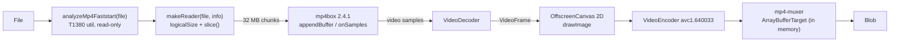
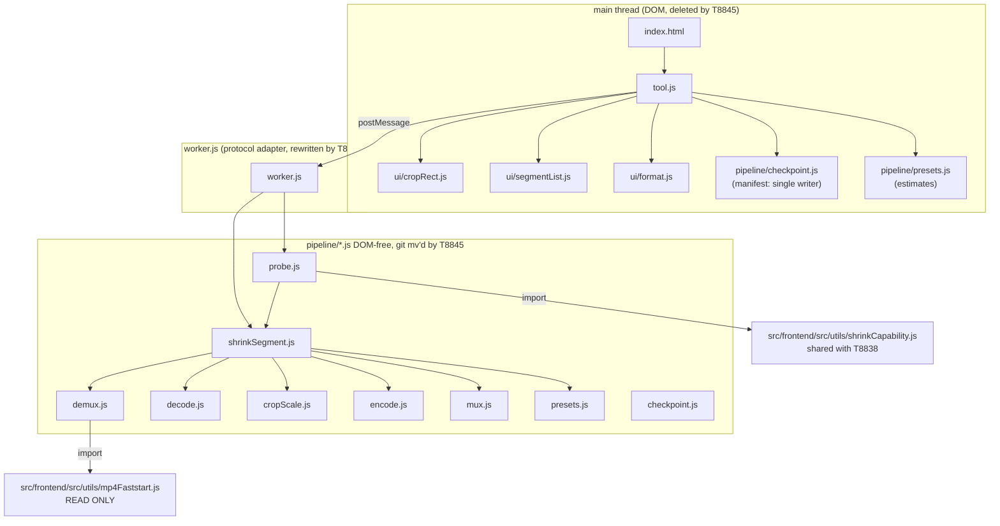
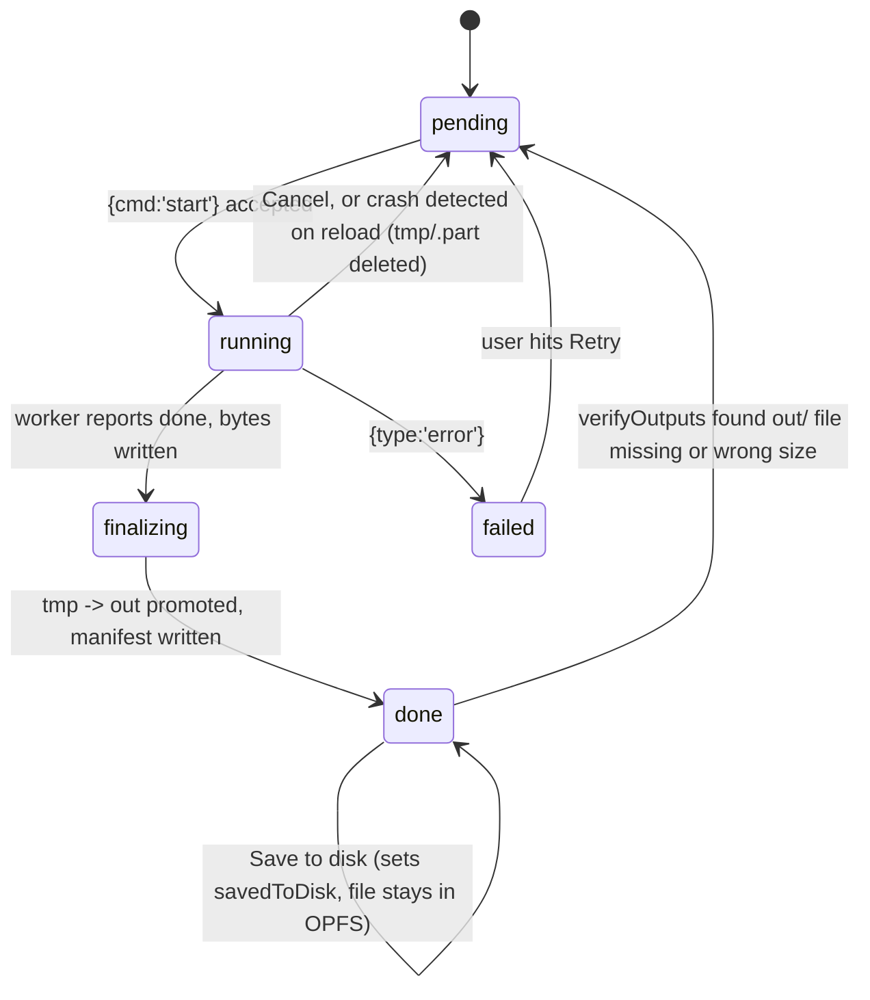

# T8840 Design: Standalone browser shrink tool (zero app integration)

**Status:** APPROVED (2026-09-07) — all 8 open questions accepted per the design's recommendations. Amended same day (R11 added below) per user direction: prioritize no visible quality loss over minimizing shrink/upload time.
**Author:** Architect Agent
**Created:** 2026-09-07
**Task file:** [universal-upload/T8840-shrink-pipeline-core.md](universal-upload/T8840-shrink-pipeline-core.md)
**Epic:** [universal-upload/EPIC.md](universal-upload/EPIC.md) (decisions 4, 5, 6)
**Proven inputs:** [scripts/shrink-spike/README.md](../../../scripts/shrink-spike/README.md) ("Verdict for T8840"), T8830 throughput table, T8832 real-hardware memory run

---

## 0. What this design decides (scan this first)

| Question the task file left open | This design's answer | Reversible? |
|---|---|---|
| How many pipeline modules | 9, not 8: the task's 8 plus `shrinkSegment.js`, the DOM-free orchestrator (§2.2) | Yes, but it is the file T8845 ports most valuably |
| How the probe avoids being a second pipeline | The probe **is** the real pipeline with `limits.sampleFrames` set (§2.4, §4) | Core to the design |
| Speed threshold | GO at realtime multiplier **>= 0.5x**, amber warn 0.25-0.5x, refuse **< 0.25x** (reuses T8830's own GO/NO-GO bands) | Yes, Q1 |
| Resume across reload with `<input webkitdirectory>` Files | Not possible; primary picker is `showDirectoryPicker()` with the handle persisted in IndexedDB (§3.4) | Q2 |
| Checkpoint granularity | Whole segment. No mid-segment resume (§3.3) | Core to the design |
| Audio path | Copy-through only. If step 0 proves it flaky, ship AAC re-encode only. **Never both** (§2.2 mux, Q3) | Q3 |
| Who owns the OPFS manifest | Main thread, single writer. Worker owns only output bytes (§3.6) | Core to the design |
| Crop aspect ratio | Free, with a live "output 2688 x 1512" readout | Q4 |
| Where the shared capability function lives | `src/frontend/src/utils/shrinkCapability.js`, created by whichever of T8838/T8840 lands first (§7) | Q5 |
| How unit tests run | Own `vitest.config.js` under the tool + one CI step (§9) | Q6 |
| Pause (distinct from Cancel) | Recommended in v1, ~10 lines, directly serves caveat 10 | Q7 |

Two findings worth the user's attention before approval, because they can change the plan:

1. **A Sharpest-preset output on a long segment can exceed 4 GB** (24 Mbps x 24 min = 4.3 GB). Whether `mp4-muxer` writes a 64-bit `mdat` size in streaming mode decides whether that output is valid or silently corrupt. This is now a hard step-0 check (§10 R1).
2. **`releaseUsedSamples` must be called for the audio track too.** T8832 proved memory flatness with a video-only extraction. Adding an audio track without releasing it re-opens the exact leak T8832 closed (§2.2 demux, §10 R2).

---

## 1. Current state

### 1.1 What already exists and works



`scripts/shrink-spike/spike.js` (610 lines, one file) contains a working version of every box
above. It is proven on real hardware:

| Proof | Source | Number |
|---|---|---|
| 8K 10-bit HEVC decode+encode, end to end | T8830 | 1.523x realtime (Chrome), 1.419x (Edge) |
| 1080p H.264 control | T8830 | 1.918x (Chrome), 4.113x (Edge) |
| Full-file streaming demux, 17.2 GB, 42,264 samples | T8832 | peak JS heap 200.8 MB, flat over 11 buckets |
| mp4box internal buffer retention | T8832 | max 1 buffer, 423 `releaseUsedSamples` calls |
| Frame-count equivalence streaming vs single-shot | T8832 smoke | 2700 == 2700 == moov |

### 1.2 What the spike is NOT (the actual work of this task)

| Gap | Why it matters | Caveat |
|---|---|---|
| Output buffered entirely in a tab `ArrayBuffer` | A 17 GB segment at 12 Mbps is ~2.1 GB held in memory. The one thing T8832 structurally could not reveal | 7 |
| No audio at all | Every acceptance criterion mentions A/V sync | Tech notes |
| Center crop hardcoded | The feature is a user-drawn crop | Tech notes |
| One preset hardcoded (2688 @ 12 Mbps) | Three presets, estimate before Start | 4, EPIC 5 |
| No cancel, no resume, no checkpoint | A 50 GB game is ~an hour of pegged machine | 9 |
| Capability check only, no speed probe | "Supported" is not "fast enough" on an encode-bound pipeline | 6 |
| DJI `djmd`/`dbgi`/`tmcd` tracks | 2.7% of every DJI segment, never read by the app | 8 |
| No expectation copy, no progress, no ETA | Expectation setting is part of the feature | 10 |
| Everything on the main thread | The tool must prove the worker protocol T8845 ports | Tech notes |
| Single 610-line file, no module boundaries | T8845 is supposed to be a mechanical `git mv` | Solution |

### 1.3 Smells in the spike that must NOT be carried forward

| Smell | Location | Fix in this design |
|---|---|---|
| Backpressure gate leaked into the caller (`beforeDecode()` returns null-or-Promise, every demux loop must remember to await it) | `spike.js` `buildPipeline` / both demux fns | `decode.js` owns it: `await stage.push(sample)` (§2.2) |
| Two near-identical demux loops (single-shot and streaming) | `demuxSingleShot` + `demuxStreaming` | One loop. Single-shot mode is deleted, it exists only as T8832's oracle |
| Two probe implementations (`probeBuffer`, `probeReader`) | `spike.js` | One: `probeContainer(reader)` |
| Backpressure watches the decoder only; the encoder queue is unbounded | `beforeDecode` | Gate on decode AND encode queue depth (§2.2 decode) |
| Frame ownership implicit | decoder `output` callback | Explicit single-owner rule + `liveFrames` counter (§3.5) |
| Reporting interleaved with pipeline logic (`lines`, `report` passed into `buildPipeline`) | `spike.js` | Pipeline emits structured events; only `tool.js` renders strings |

---

## 2. Target architecture

### 2.1 Module map



**The boundary rule, stated once:** anything under `pipeline/` may touch `File`, `Blob`,
`OffscreenCanvas`, `VideoDecoder`/`VideoEncoder`, OPFS (`navigator.storage`),
`postMessage`-free callbacks, and nothing else. No `document`, no `window`, no
`self.postMessage`, no string formatting for humans. That is exactly the set available inside
a Web Worker, which is what makes T8845 a `git mv`.

**The one line in `pipeline/` that is not mechanically portable** is `demux.js`'s import of
`mp4Faststart.js` (`../../../src/frontend/src/utils/mp4Faststart.js` here, `../../utils/mp4Faststart.js`
after the move). It gets a `// T8845: this relative path is the only edit the port needs`
comment directly above it. Same for `probe.js`'s import of `shrinkCapability.js`.

### 2.2 File-by-file public API

Signatures below are the contract. Anything not listed is module-private.

---

#### `pipeline/demux.js`

```js
/** Opens a faststart-ordered logical view over any MP4 layout (T8832 caveat 1). */
export async function openReader(file)
//   -> { logicalSize:number, slice(start,end):Blob, layout:'relocated'|'verbatim', info }

/** Streams the first chunks until moov is parsed. Never reads mdat. */
export async function probeContainer(reader, { chunkSizeMB = 32 } = {})
//   -> {
//        video: { trackId, codec, codedWidth, codedHeight, description:Uint8Array,
//                 nbSamples, timescale, durationSec, fps },
//        audio: { trackId, codec, sampleRate, numberOfChannels, nbSamples,
//                 timescale, description:Uint8Array|null } | null,
//        createdAt: Date|null,          // mvhd creation_time, used for segment ordering
//        durationSec: number,
//        droppedTracks: [{ id, type }]  // djmd / dbgi / tmcd  (caveat 8)
//      }

/** The single forward demux loop. Extracts video AND audio; releases BOTH. */
export async function streamSamples(reader, tracks, {
  chunkSizeMB = 32,
  onVideoSample,          // async (sample) => void   <- awaited: this IS the backpressure
  onAudioSample,          // (sample) => void         <- sync, never awaited
  signal,                 // AbortSignal
}) // -> { samplesRead, releaseCalls, maxMp4boxBuffers, finalMp4boxBuffers }
```

Binding implementation notes carried from T8832:

- 32 MB chunks (proven number; 8 MB was mechanism-tested only).
- `setExtractionOptions(trackId, null, { nbSamples: 100 })` for **both** the video and the
  audio track.
- `releaseUsedSamples(trackId, lastNumber)` every 100 samples **per track**. T8832's flat-memory
  proof used a video-only extraction; an extracted-but-never-released audio track pins
  mp4box's buffer list and re-opens the leak. `streamSamples` returns
  `maxMp4boxBuffers` so the tool can display it and the smoke test can assert it stays small.
- Feed -> `appendBuffer` -> drain fully -> feed. One `async` loop. `onSamples` only pushes to a
  plain array (T8830's documented stall class is two loops competing for one resume slot).
- Abort is checked between chunks and inside the drain loop.

---

#### `pipeline/decode.js`

```js
export const IN_FLIGHT_CAP = 32;   // >= hardware pipeline depth (T8830 Test files)

export async function createDecodeStage({
  video,                  // probeContainer().video
  onFrame,                // async (VideoFrame) => void   <- takes OWNERSHIP, must close it
  onError,                // (err) => void
  encoderQueueDepth,      // () => number  (so the gate also watches the encoder)
  inFlightCap = IN_FLIGHT_CAP,
})
// -> {
//      push(sample): Promise<void>,   // resolves when the decoder can accept more
//      flush(): Promise<void>,
//      close(): void,                 // hard teardown, no flush
//      stats(): { framesDecoded, inFlight, liveFrames },
//    }
```

`push` is where backpressure lives: it awaits internally while
`decoder.decodeQueueSize > cap || inFlight > cap || encoderQueueDepth() > cap`, and resumes on
the decoder's `dequeue` event or when `onFrame` returns. The caller (`demux.streamSamples`)
cannot forget to await it, because `onVideoSample` is awaited by contract. This kills smell 1.

Adding the encoder-queue term to the gate is new versus the spike and is what keeps VideoFrames
from piling up in GPU memory on an encode-bound machine (which every machine is, caveat 4).

---

#### `pipeline/cropScale.js`

```js
/** PURE. Unit-tested without a DOM. */
export function resolveCropRect(crop, sourceWidth, sourceHeight)
//   crop = { x, y, w, h } normalized 0..1, origin top-left
//   -> { sx, sy, sw, sh }   integers, clamped into the frame, w/h >= 10% per axis

export function createCropScaler({ sourceWidth, sourceHeight, crop, outWidth, outHeight })
// -> { transform(frame): VideoFrame, close(): void }
```

**Frame ownership rule (single owner, always):** `transform(frame)` closes `frame` before it
returns and hands back a NEW `VideoFrame` that the caller must close immediately after
`encoder.encode()`. There is never a moment where two references to the same frame exist, and
never a frame owned by a container that outlives one tick. The `liveFrames` counter in
`decode.js` is incremented/decremented at exactly those two points and must read 0 after
teardown.

---

#### `pipeline/encode.js`

```js
export const OUTPUT_CODEC = 'avc1.640033';        // H.264 High 5.1, covers all three presets
export const KEYFRAME_INTERVAL_SEC = 2;           // tech notes: sane seek/annotate later

export async function pickOutputCodec({ width, height, bitrate, framerate })
// -> { codec, muxerCodec:'avc'|'hevc' } | null

export async function createEncodeStage({
  width, height, bitrate, framerate,
  onChunk,                // (chunk, meta) => void
  onError,
})
// -> {
//      encode(videoFrame): void,      // forces keyFrame when >= 2 s since the last one
//      queueDepth(): number,
//      flush(): Promise<void>,
//      close(): void,
//      stats(): { framesEncoded },
//    }
```

`colorSpace: { primaries:'bt709', transfer:'bt709', matrix:'bt709', fullRange:false }` is set
explicitly on `configure` (caveat 2, mp4-muxer crashes at finalize without one). See risk R3 for
the HDR/BT.2020 source question this raises.

---

#### `pipeline/mux.js`

```js
/** Streaming OPFS target (caveat 7). NEVER ArrayBufferTarget, NEVER fastStart:'in-memory'. */
export async function createOpfsSink(dirHandle, filename)
// -> { handle, writable, target }        target = mp4-muxer FileSystemWritableFileStreamTarget

export function createMuxer({
  target,
  video: { codec, width, height },
  audio: { codec, sampleRate, numberOfChannels, description } | null,
  timestampOriginUs,      // ONE global t0 shared by both tracks (see below)
})
// -> {
//      addVideoChunk(chunk, meta): void,
//      addAudioSample(sample): void,      // raw copy-through, no AudioEncoder
//      finalize(): Promise<void>,         // muxer.finalize() then writable.close()
//      abort(): Promise<void>,            // writable.abort(), for Cancel
//    }
```

Three decisions inside this module:

1. **`fastStart: false`.** Output is moov-at-end. That is fine and deliberate: T8834 measured
   T1380 relocating moov in 6-15 ms at upload time, so the shrunk file still lands fast-start on
   R2 (caveat 7).
2. **A single global `timestampOriginUs`, not `firstTimestampBehavior: 'offset'`.** mp4-muxer's
   `offset` mode rebases **each track independently**, so a source whose audio and video first
   timestamps differ comes out of the muxer with the two tracks silently shifted relative to each
   other. `shrinkSegment` computes `t0 = min(firstVideoCts, firstAudioCts)` once and subtracts it
   from both tracks, then the muxer runs in its default `strict` mode. This is the A/V sync
   landmine of the whole task and the whistle test in the recipe is what proves it.
3. **Only two tracks are ever created:** the video track and the primary audio track.
   `djmd`/`dbgi`/`tmcd` are simply never given extraction options (caveat 8). The muxer never
   hears about them.

**Audio lead is bounded structurally, not by a buffer.** Audio samples are forwarded to the
muxer the moment mp4box emits them, with no queue of our own. They can only run ahead of video
by however far the single serialized demux loop has advanced past the encoder, which the
backpressure gate caps at ~32 frames (about 1 second). Do not move audio onto its own loop; that
is what would make the muxer's interleave buffer grow without bound.

---

#### `pipeline/presets.js` (pure, fully unit-tested)

```js
export const PRESETS = {
  sharpest:    { id:'sharpest',    label:'Sharpest',    maxWidth:3840, bitrate:24_000_000 },
  recommended: { id:'recommended', label:'Recommended', maxWidth:2688, bitrate:12_000_000 },
  smallest:    { id:'smallest',    label:'Smallest',    maxWidth:1920, bitrate: 7_000_000 },
};

// T8830 Chrome, 8K source -> 2688x1512 @ 12 Mbps at 45.63 fps = 4,064,256 px x 45.63.
// The conservative (8K-source) number, not the 1080p-source one.
export const REFERENCE_ENCODE_PIXELS_PER_SEC = 185_000_000;

export const SHRINK_OFFER_MIN_BYTES   = 3e9;        // EPIC decision 4
export const SHRINK_OFFER_MIN_BITRATE = 10_000_000; // EPIC decision 4

export function resolveOutputSize(preset, cropPixelWidth, cropPixelHeight)
//   -> { width, height }  // width = min(maxWidth, cropPixelWidth); never upscales;
//                         // both floored to even numbers

export function estimateOutputBytes(preset, durationSec)      // bitrate*dur/8 * 1.02
export function estimateShrinkSeconds({ outWidth, outHeight, durationSec, fps, pixelsPerSecond })
export function shouldOfferShrink({ totalBytes, sourceBitrateBps })   // EPIC decision 4
```

`estimateShrinkSeconds` is **one function with one code path**. Before the probe it is called
with `pixelsPerSecond = REFERENCE_ENCODE_PIXELS_PER_SEC` and the UI labels the answer "estimated
on a reference machine". After the probe it is called with the measured number and the label
drops. Different input, not a different branch.

Pre-probe estimates this model produces for the real 50 GB DJI folder (69 min of 8K at ~97 Mbps),
which is what the tool will show before Start:

| Preset | Output | Estimated size | Estimated time (reference machine) | Implied realtime x |
|---|---|---|---|---|
| Sharpest | 3840 x 2160 @ 24 Mbps | ~12.6 GB | ~92 min | 0.75x |
| Recommended | 2688 x 1512 @ 12 Mbps | ~6.3 GB | ~45 min | 1.53x |
| Smallest | 1920 x 1080 @ 7 Mbps | ~3.7 GB | ~23 min | 3.0x |

Those sizes bracket the acceptance criterion's "~3-12 GB total (not 50)" exactly, which is a
useful sanity check on the model. The **time** model currently ignores bitrate (it keys off
output pixels only, k = 0). Step 0's required Sharpest timing is precisely what calibrates the
bitrate term; until that number exists the estimator ships with k = 0 and the README records a
documented +/- 40% band.

---

#### `pipeline/probe.js`

```js
export const SPEED_GO_MULTIPLIER     = 0.50;   // >= this: green, proceed
export const SPEED_REFUSE_MULTIPLIER = 0.25;   // <  this: red, refuse
export const PROBE_WARMUP_FRAMES  = 30;        // ~1 s, discarded from timing
export const PROBE_MEASURE_FRAMES = 90;        // ~3 s, the measured window

export async function checkCapability(videoTrack, outputConfig)
// -> { decode:'yes'|'no'|'unavailable', encode:..., codecFamily, resBucket }
//    delegates to the shared shrinkCapability module (see §7); never throws

export async function runSpeedProbe({ file, crop, preset, signal })
// -> {
//      framesMeasured, wallSeconds, fps, sourceFps,
//      realtimeMultiplier, pixelsPerSecond,
//      verdict: 'go' | 'slow' | 'too-slow',
//    }
```

See §4 for how the number and the verdict are produced and why those two cutoffs.

---

#### `pipeline/checkpoint.js`

Deliberately split into a pure reducer and a thin OPFS shell, because jsdom has no OPFS and the
state machine is the part worth testing.

```js
// ---- pure, unit-tested ----
export function newManifest({ jobId, crop, preset, segments })
export function reduceSegment(segment, event)
//   event.type in: 'start' | 'finalizing' | 'finish' | 'cancel' | 'fail' | 'save' | 'orphan'
export function planResume(manifest, presentSegments)
//   -> { action:'resume'|'mismatch'|'fresh', firstPendingIdx, repairs:[...] }

// ---- OPFS shell ----
export async function openWorkspace()          // -> { root, outDir, tmpDir }
export async function readManifest(root)       // -> manifest | null
export async function writeManifest(root, m)   // atomic: write .tmp then move()
export async function verifyOutputs(root, m)   // -> repaired manifest (§3.4)
export async function promoteOutput(root, seg) // tmp/<x>.part -> out/<x>.shrunk.mp4
export async function discardWorkspace(root)
```

---

#### `pipeline/shrinkSegment.js` (the 9th module, the orchestrator)

This is the deviation from the task file's 8-file list, and it is deliberate. Without it, the
wiring of demux -> decode -> cropScale -> encode -> mux (the backpressure, the `t0` handshake, the
progress accounting, the abort teardown order) lives in `worker.js`, and `worker.js` is exactly
the file T8845 rewrites. That would make the "mechanical port" claim false for the most
delicate 150 lines in the task.

```js
export async function shrinkSegment({
  file,
  crop,                  // { x, y, w, h } normalized
  preset,                // PRESETS[id]
  sink,                  // { dirHandle, filename } or null (probe mode uses a throwaway)
  onProgress,            // ({ framesDone, framesTotal, fps, stage }) => void   (unthrottled)
  signal,                // AbortSignal
  limits: { chunkSizeMB = 32, inFlightCap = 32, sampleFrames = null } = {},
})
// -> { framesDone, framesTotal, bytes, wallSeconds, pixelsPerSecond, outputHandle, mp4boxBuffers }
```

`stage` is a closed vocabulary: `'analyze' | 'probe' | 'demux' | 'decode' | 'crop' | 'encode' |
'mux' | 'checkpoint'`. It is what `{type:'error', stage, message}` reports.

### 2.3 One pipeline, not two: the probe reuses `shrinkSegment`

This is the single most important structural decision in the design and the reason the module
list looks the way it does.

```pseudo
runSpeedProbe({file, crop, preset}):
    result = shrinkSegment({
        file, crop, preset,
        sink: throwaway OPFS file,
        limits: { sampleFrames: PROBE_WARMUP_FRAMES + PROBE_MEASURE_FRAMES },
    })
    delete the throwaway file
    return verdict(result)
```

There is no second decode+encode path to keep in sync, no risk of the probe measuring something
the real run does not do, and no risk of a probe-only bug. It also means the probe exercises the
real OPFS write path, so "your disk is full / OPFS is not writable" is discovered in 4 seconds
rather than 40 minutes in.

`sampleFrames` also gives the smoke test a cheap way to run the whole pipeline on a fixture.

### 2.4 Worker and main-thread split

```mermaid
sequenceDiagram
    participant U as user
    participant T as tool.js (main)
    participant W as worker.js
    participant P as pipeline/*
    participant O as OPFS

    U->>T: pick folder, draw crop, pick preset
    T->>T: estimate (presets.js, reference px/s)
    U->>T: Start
    T->>W: {cmd:'probe', file:seg0, crop, preset}
    W->>P: runSpeedProbe -> shrinkSegment(sampleFrames)
    W-->>T: {type:'probe', realtimeMultiplier, verdict}
    T->>T: re-estimate with measured px/s, render verdict
    U->>T: confirm (only if verdict !== 'too-slow')
    loop each pending segment
        T->>O: manifest[i].state = 'running'
        T->>W: {cmd:'start', file, crop, preset, outName}
        W->>P: shrinkSegment(...)
        P->>O: stream bytes into tmp/<i>.part
        W-->>T: {type:'progress', framesDone, framesTotal, fps}  (~2/s)
        W-->>T: {type:'done', file, bytes, frames}
        T->>O: state='finalizing'; promote tmp -> out; state='done'
    end
    U->>T: Cancel
    T->>W: {cmd:'cancel'}
    W->>P: abort -> close decoder/encoder, abort writable
    W-->>T: {type:'cancelled'}
```

**Message protocol** (superset of the task file's, additions marked):

| Direction | Message | Notes |
|---|---|---|
| in | `{cmd:'start', file, crop, preset}` | task file; plus `outName` and the OPFS dir handle |
| in | `{cmd:'cancel'}` | task file |
| in | `{cmd:'probe', file, crop, preset}` | **added**: same pipeline, `sampleFrames` set |
| out | `{type:'progress', framesDone, framesTotal, fps}` | throttled to ~2/s in `worker.js`, not in the pipeline |
| out | `{type:'done', file}` | `file = await outputHandle.getFile()`, named `{orig-stem}.shrunk.mp4`. A `File` over an OPFS entry is a lazy reference, not a copy, so this stays memory-flat |
| out | `{type:'error', stage, message}` | closed `stage` vocabulary from §2.2 |
| out | `{type:'probe', realtimeMultiplier, fps, pixelsPerSecond, verdict}` | **added** |
| out | `{type:'cancelled'}` | **added**: lets the main thread stop its 2 s terminate timer |

**One worker for the whole job**, reused across segments (module load + mp4box init are not
re-paid per segment). Cancel is graceful first (target < 500 ms) with `worker.terminate()` as a
hard backstop at 2 s, then a fresh worker is spawned for the next action. Terminating destroys
the worker's `VideoDecoder`/`VideoEncoder` and every frame they hold, which makes the "Cancel
terminates within 2 s and frees resources" criterion deterministic rather than best-effort.

Which side does what:

| Concern | Main (`tool.js`) | Worker |
|---|---|---|
| Folder picking, `.LRF` previews, crop canvas, preset chips, progress DOM, Save picker, playback | yes | no |
| OPFS **manifest** read/write | yes (single writer) | no |
| OPFS **output bytes** | no | yes |
| `promoteOutput` (tmp -> out rename) | yes | no |
| decode/encode/mux | no | yes |
| Progress throttling, ETA math | ETA yes | throttle yes |

---

## 3. OPFS checkpoint state machine

### 3.1 Layout

```
OPFS root
  shrink-tool/
    manifest.json                        <- one active job, ever
    manifest.json.tmp                    <- write-then-move, so a crash never truncates it
    tmp/<idx>-<stem>.part                <- the segment currently being written
    out/<idx>-<stem>.shrunk.mp4          <- finished segments, survive reload
```

One active job at a time. Starting a job whose segment set does not match the manifest prompts
"Discard the saved workspace? ({k} finished files, {x} GB)". Never silent.

### 3.2 Manifest

```jsonc
{
  "version": 1,
  "jobId": "a1b2c3d4",                  // first 8 hex of sha-256 over sorted "name|size|lastModified"
  "createdAt": 1757260000000,
  "crop":   { "x": 0.12, "y": 0.30, "w": 0.62, "h": 0.44 },
  "preset": "recommended",
  "probe":  { "realtimeMultiplier": 1.48, "pixelsPerSecond": 181000000, "at": 1757260012000 },
  "segments": [
    {
      "idx": 0,
      "name": "DJI_20260718105543_0003_D.MP4",
      "size": 17200000000,
      "lastModified": 1752836143000,
      "durationSec": 1416.4,
      "framesTotal": 42264,
      "state": "done",                  // pending | running | finalizing | done | failed
      "outputName": "DJI_20260718105543_0003_D.shrunk.mp4",
      "outputBytes": 2126000000,
      "framesDone": 42264,
      "savedToDisk": true,
      "error": null
    }
  ]
}
```

`jobId` deliberately does **not** include crop or preset: those live in the manifest body so a
resume can detect that the user changed their mind and refuse to silently mix settings across
segments of one output set.

### 3.3 State machine



**A segment is the checkpoint unit; there is no mid-segment resume.** Resuming inside a segment
would require restoring the encoder's exact GOP state and concatenating two `mdat` regions, and
the segment is already the natural unit (caveat 9, and T8860's two-slot design assumes it). The
cost of that decision is bounded and worth stating plainly: worst case a Cancel or crash loses
one segment of work, about 11 minutes on the reference machine at 1.5x realtime, about 34 minutes
on a machine sitting at the 0.5x floor. Pause (Q7) is the mitigation for "I need my computer
back", not Cancel.

### 3.4 What resume checks and does, exactly

```pseudo
on page load:
    ws = await openWorkspace()
    m  = await readManifest(ws.root)
    if !m: show empty state; done

    # 1. repair states that a crash could have left behind
    for seg in m.segments:
        if seg.state == 'running':
            delete tmp/<seg>.part            # partial output is never resumable
            seg.state = 'pending'
        if seg.state == 'finalizing':
            seg.state = out/<seg.outputName> exists ? 'done' : 'pending'
        if seg.state == 'done':
            f = out/<seg.outputName>
            if !f or f.size != seg.outputBytes:
                seg.state = 'pending'        # log loudly; never silently "fix" the number
    orphans = files in out/ with no matching done segment  -> delete, log
    writeManifest(m)

    # 2. show what survived, before the user has re-picked anything
    render "Workspace: {done}/{n} segments done, {bytes} on disk"
           [Resume]  [Save finished now]  [Discard workspace]

    # 3. resume needs the source files back (the browser cannot hold File objects across reload)
    on Resume:
        dirHandle = await restoreDirectoryHandle()        # IndexedDB, see below
        if !dirHandle: ask the user to re-pick the folder
        await dirHandle.requestPermission({mode:'read'})  # one click, browser requirement
        present = enumerate(dirHandle)
        plan = planResume(m, present)                     # match on name|size|lastModified
        if plan.action == 'mismatch':
            "This folder does not match the saved workspace." [Start over] only
        else:
            crop/preset are restored from the manifest and shown read-only
            start at plan.firstPendingIdx
```

**Why `showDirectoryPicker()` is the primary picker.** `<input type=file webkitdirectory>` yields
`File` objects that cannot survive a reload, so with that input alone "resume after a reload"
degrades to "re-pick the folder every time". `showDirectoryPicker()` returns a
`FileSystemDirectoryHandle` which is structured-cloneable into IndexedDB, so after a reload the
tool restores it and needs one permission click. `<input webkitdirectory>` stays as the fallback
for browsers without the picker, with the re-pick behaviour and a plain line saying so. This is
Q2.

**Storage preflight, before Start:** `navigator.storage.estimate()` versus
`sum(estimateOutputBytes)` plus 20% headroom. Below that, the tool refuses with a real number
("this needs about 6.3 GB free; you have 4.1 GB"), rather than dying at segment 3.
`navigator.storage.persist()` is requested at the same moment; if it is denied the tool says the
workspace may be evicted under disk pressure.

### 3.5 Cancel: teardown order and the no-leaked-GPU-memory guarantee

```pseudo
tool.js:  Cancel clicked
          -> worker.postMessage({cmd:'cancel'})
          -> start a 2000 ms timer

worker.js: abortController.abort()

shrinkSegment abort handler, in this exact order:
    1. stop feeding: the demux loop's next abort check exits, mp4box file is closed
    2. decoder.close()      # NOT flush: queued inputs are discarded, their frames never created
    3. drop the in-flight frame if transform() is mid-call; close it
    4. encoder.close()      # frees every VideoFrame still queued for encode
    5. muxer sink: writable.abort()   # NOT finalize; the .part file is left invalid on purpose
    6. assert stats().liveFrames === 0, log it (this is the number the manual
       chrome://gpu / Task Manager check corroborates)
    7. postMessage({type:'cancelled'})

tool.js on 'cancelled':  clear the timer, delete tmp/<i>.part, segment -> 'pending'
tool.js on timeout:      worker.terminate(), same cleanup, spawn a fresh worker
```

Points 2 and 4 are the whole guarantee. `close()` (not `flush()`) is what makes cancel fast:
flushing a full encoder queue on an encode-bound machine can take seconds, which is exactly the
2 s criterion being missed. Nothing is worth saving in a cancelled segment, so there is nothing
to flush.

### 3.6 Crash consistency: why `finalizing` exists

The worker writes bytes; the main thread writes the manifest. A crash between those two acts
must not produce a state the tool cannot reason about. The ordering is:

```
worker finishes bytes  ->  main writes state='finalizing'  ->  main promotes tmp -> out  ->  main writes state='done'
```

Every crash point maps to exactly one repair (§3.4): `running` means no usable output exists
(delete the `.part`), `finalizing` means "check whether the promote happened", `done` means the
file must be there at the recorded size or the entry is wrong and the segment is redone. There
is no case where the tool trusts a file it has not confirmed, which is the same discipline the
project's persistence rules demand of R2 writes.

---

## 4. The speed probe and its threshold

### 4.1 How the number is produced

```pseudo
runSpeedProbe({file, crop, preset}):
    # identical pipeline to the real run, capped at 120 source frames (~4 s at 30 fps)
    r = shrinkSegment({ ..., limits: { sampleFrames: 30 + 90 } })

    # timing starts only AFTER frame 30: the first frames pay decoder/encoder init,
    # canvas allocation, and the GPU clocking up. Timing them would report a machine
    # as slower than it is.
    fps                = 90 / r.measuredWallSeconds
    realtimeMultiplier = fps / sourceFps
    pixelsPerSecond    = outWidth * outHeight * fps
    verdict            = m >= 0.50 ? 'go' : m >= 0.25 ? 'slow' : 'too-slow'
```

Three properties that matter:

- **It runs after the preset and crop are chosen, not before.** The pipeline is encode-bound
  (caveat 4), so throughput is a property of the OUTPUT configuration. A probe run at
  Recommended tells you nothing reliable about Sharpest (2x the pixels). Changing the preset
  invalidates the probe and the tool re-runs it.
- **It starts at sample 0**, which is a keyframe, so no seeking or random access is needed. It
  reuses the reader that was already opened for `probeContainer`.
- **`pixelsPerSecond`, not just the multiplier, is what gets stored**, because that is the input
  `estimateShrinkSeconds` needs to predict the OTHER presets and the remaining segments without
  re-probing.

### 4.2 The proposed cutoffs, and the reasoning

| Multiplier | Verdict | UI |
|---|---|---|
| `>= 0.50x` | go | green: "About {t}. Your computer will be busy the whole time." Start enabled |
| `0.25x - 0.50x` | slow | amber: "This will take about {t} and your computer will be busy the whole time. Uploading the originals may be easier." Start enabled behind a second explicit click |
| `< 0.25x` | too-slow | red: "This computer is too slow for this. Upload the originals instead." Start disabled |

**Why not 1x.** The instinctive bar is "at least realtime", and it is the wrong bar. Nothing here
is playing back; the only thing the number competes with is the upload the user would otherwise
do. Take the real folder: 50 GB raw on a typical 20 Mbps upstream is about 5.5 hours of
uploading. Shrunk to ~6.3 GB it is about 40 minutes. So the shrink is a net win for the user's
day as long as it costs less than roughly 5 hours, and 69 minutes of footage in 5 hours is about
**0.23x realtime**. That is the pure economics floor, and it lands right on top of T8830's
existing NO-GO line.

**Why 0.5 and 0.25 specifically, rather than new numbers.** T8830's own verdict rubric already
defines GO as ">= 0.5x realtime on at least one ordinary machine" and NO-GO as "< 0.25x". Reusing
those two constants keeps one vocabulary across the spike, this tool, and T8860's Modal fallback,
instead of introducing a third pair of magic numbers that has to be reconciled later. They also
happen to be the right shape: 0.25x is where the economics stop working, and 0.5x is where the
experience stops being defensible (0.5x means 2 hours of pegged machine for a 1 hour game).

**How much headroom that leaves.** The reference laptop measured 1.42-1.52x on 8K HEVC into the
Recommended target. A device **3x slower than that laptop** still clears the 0.5x green line, and
a device **6x slower** still clears the amber line. Given the 1080p control ran at 1.9-4.1x on
the same machine, an ordinary integrated-GPU laptop shrinking 1080p-class footage has a very wide
margin; the tight case is exactly the one the census (T8838) is measuring, 8K 10-bit HEVC decode
on integrated silicon, where the likely outcome is not "slow" but `isConfigSupported: false`
(handled by the capability gate, not the speed gate).

**Two guards the multiplier alone does not give:**

1. **Absolute wall-clock guard.** Even at a green multiplier, if the estimate exceeds
   `MAX_COMFORTABLE_SECONDS = 4 h` the tool shows the amber copy. A 3 hour job is a bad idea at
   any multiplier.
2. **Running re-check, because a 4 second probe cannot see thermal throttling.** This is the
   honest limitation of any short probe: a laptop that is fast at second 5 can be half that at
   minute 20. `tool.js` keeps an EWMA of the observed multiplier over the last 60 seconds and, if
   it drops below `SPEED_REFUSE_MULTIPLIER`, surfaces a banner ("this is running much slower than
   the probe predicted, {new ETA}") with Pause and Cancel offered. It never auto-aborts: the user
   decides, and finished segments are already safe.

---

## 5. The crop rect UI

One static normalized rect for all segments (EPIC decision 5, v1 excludes per-segment crops).

**Preview frames stay entirely in DOM code** (`ui/segmentList.js`), deliberately: pulling a
preview frame is a `<video>` plus `drawImage`, and routing it through the pipeline would add a
module that T8845 does not want (T8850 rebuilds this in React anyway).

```pseudo
previewFor(segment):
    src = segment.lrfFile ?? segment.file          # .LRF is the 720p proxy, T8836: ~224 ms/frame
    v = <video src=URL.createObjectURL(src) preload=metadata muted>
    seek to min(2 s, duration/2)                   # 2 s in, past any black lead-in
    on 'seeked': drawImage(v, canvas); revoke the URL
    on error / 10 s timeout: gray placeholder tile with the filename
```

Falling back to the original 8K file in a `<video>` element is expected to work in Chrome (a blob
URL supports local range reads, so moov-at-end is fine) but is not guaranteed on every GPU. The
placeholder tile is the third rung and is not a dead end: the crop is normalized and shared, so
the user can draw it on any segment that did render, including the `.LRF`. The `.LRF` proxy is
the same recording and the same field of view as its `.MP4`, so a normalized rect drawn on the
proxy maps exactly onto the source; the recipe's step 5 ("the crop is right") is what proves it.

**Interaction** (this is the part the task file left open, Q4):

| Gesture | Behaviour |
|---|---|
| Drag inside the rect | Move. Clamped so the rect stays fully inside the frame |
| Drag a corner handle (4) | Resize from that corner |
| Drag an edge handle (4) | Resize that edge only |
| Any resize | Clamped to `w >= 0.1` and `h >= 0.1` (task file), and to the frame bounds |
| Double click outside | Reset to the full frame |
| Aspect ratio | **Free** (recommended). A live readout under the canvas shows the consequence: "Output: 2688 x 1512" |
| Switching segments | The rect does not move (acceptance bar), it just redraws over the new preview |

Pointer events only (`pointerdown`/`move`/`up` with `setPointerCapture`), no mouse/touch split.
The rect lives in normalized space at all times; canvas pixels are only ever a render-time
multiplication, so a resized window or a different preview resolution cannot drift it.

The rect is written into the manifest at Start and restored read-only on Resume.

**Legends case (recipe step 7).** After `probeContainer`, `sourceBitrateBps = size*8/duration`.
If `!shouldOfferShrink({totalBytes, sourceBitrateBps})` the tool shows a yellow banner: "These
files are already {4.7} Mbps, lower than every preset. Shrinking them will not make them
meaningfully smaller." Start stays enabled (this is a dev tool and the user's recipe asks to try
it), but the warning is unmissable. In the app, T8850 uses the same predicate to not render the
offer at all.

---

## 6. Refactoring plan and what actually gets built

### 6.1 The spike is not modified (except step 0)

`scripts/shrink-spike/` stays as the benchmark and as T8832's frame-count oracle. The tool
supersedes it for real use. The one exception is step 0 below, which the task file mandates
happen in the spike before any of this is built.

### 6.2 Build order

| # | Deliverable | Gate |
|---|---|---|
| 0 | **Step 0 in the spike** (task file step 0): audio copy-through + streaming OPFS target, full 17.2 GB unattended run, plus a Sharpest timing on the 25 s trim | **Hard go/no-go.** A fail re-scopes the task. Also settles Q3 (audio), R1 (4 GB mdat), R3 (color) |
| 1 | `pipeline/presets.js` + its unit tests | Pure math, no hardware. Unblocks the estimate UI |
| 2 | `pipeline/demux.js` (`openReader`, `probeContainer`, `streamSamples` with dual-track release) | Frame count on the synthetic fixture equals the spike's |
| 3 | `pipeline/decode.js` + `cropScale.js` + `encode.js` | Backpressure gate owns itself; `resolveCropRect` unit-tested |
| 4 | `pipeline/mux.js` + `shrinkSegment.js` | Synthetic fixture produces a playable OPFS output with audio in sync |
| 5 | `pipeline/checkpoint.js` (reducer first, then the OPFS shell) | Reducer unit tests green |
| 6 | `pipeline/probe.js` + the shared capability import (§7) | Verdict renders on a real device |
| 7 | `worker.js` + `index.html` + `tool.js` + `ui/*` | The whole recipe is runnable |
| 8 | `qa/t8840-smoke.mjs` (headless Playwright, synthetic fixture) | Frame-count equivalence, output plays, checkpoint transitions |
| 9 | `README.md` with the run instructions, the recipe, and a per-machine results table | Handoff to the user's manual run |

### 6.3 Pseudo code for the core loop (what steps 2-4 add up to)

```pseudo
shrinkSegment({file, crop, preset, sink, onProgress, signal, limits}):
    reader = await openReader(file)                       # T1380 faststart view
    tracks = await probeContainer(reader)                 # moov only, never mdat
    if !tracks.video: throw StageError('analyze', 'no video track')

    src  = resolveCropRect(crop, tracks.video.codedWidth, tracks.video.codedHeight)
    out  = resolveOutputSize(preset, src.sw, src.sh)
    codec = await pickOutputCodec({...out, bitrate: preset.bitrate, framerate: tracks.video.fps})
    if !codec: throw StageError('encode', 'no supported output encoder at this size')

    t0 = min(firstVideoCtsUs, firstAudioCtsUs)            # ONE origin for both tracks
    muxer   = createMuxer({target: await createOpfsSink(sink), video: {...}, audio: tracks.audio, timestampOriginUs: t0})
    encoder = await createEncodeStage({...out, bitrate, framerate, onChunk: muxer.addVideoChunk})
    scaler  = createCropScaler({... src, ... out})
    decoder = await createDecodeStage({
        video: tracks.video,
        encoderQueueDepth: encoder.queueDepth,            # gate watches BOTH queues
        onFrame: async (frame) => {
            const scaled = scaler.transform(frame)        # closes `frame`, returns a new one
            encoder.encode(scaled)                        # closes `scaled`
            onProgress({framesDone: ++done, framesTotal, fps: ewma(), stage: 'encode'})
            if (limits.sampleFrames && done >= limits.sampleFrames) abort()   # probe mode
        },
    })

    await streamSamples(reader, tracks, {
        onVideoSample: (s) => decoder.push(s),            # AWAITED -> this is the backpressure
        onAudioSample: (s) => muxer.addAudioSample(s),    # copy-through, no AudioEncoder
        signal,
    })

    await decoder.flush(); await encoder.flush(); await muxer.finalize()
    assert decoder.stats().liveFrames === 0
    return { framesDone, bytes, wallSeconds, pixelsPerSecond, outputHandle }
```

---

## 7. Sharing the capability module with T8838

T8838 ships `src/frontend/src/utils/shrinkCapability.js`. Caveat 11 and EPIC decision 6 say this
tool is its second consumer, not a re-implementation. Two concrete requirements come out of that,
and both are asks on T8838 that should be recorded now because T8838 has not merged:

**R-CAP-1: no top-level app imports in `shrinkCapability.js`.** The tool imports it directly over
a relative path from `scripts/`. If the module imports `uiTelemetry.js` at the top level, the
tool pulls in the app's API client, its store, and its auth, none of which exist in a bare page.
T8838's beacon-firing wrapper must either live in `uploadManager.js` or reach telemetry through
`await import('./uiTelemetry.js')` inside the function that fires it.

**R-CAP-2: split parse from decide.**

```js
// the pure decision half - what T8840 needs
export async function capabilityFromTrack({codec, codedWidth, codedHeight}, outputConfig)
//   -> { decode:'yes'|'no'|'unavailable', encode:..., codecFamily, resBucket }

// T8838's existing entry point becomes: parse ftyp+moov with mp4box, then call the above
export async function probeShrinkCapability(file, faststartInfo)
```

Without the split, `pipeline/probe.js` would either re-parse the moov it just parsed in
`demux.probeContainer` (harmless at 16-124 ms, but a duplicated parse) or, worse, re-derive the
codec string itself, which is exactly the "hand-rolled hvcC to RFC 6381 string that gets a profile
bit wrong" failure T8838's own notes warn about.

**Ordering, since both tasks are TODO.** Whichever lands first creates the file with
`capabilityFromTrack` at that signature; the other imports it. If T8840 gets there first it
creates `src/frontend/src/utils/shrinkCapability.js` containing only the pure half, and T8838
adds the parse half and the beacons on top. That means T8840 touches one file outside
`scripts/` (Q5); no app code imports it until T8838 wires it, and the "nothing under
`scripts/shrink-tool/` is imported by app code" criterion is unaffected because the dependency
points the correct way (tool -> app util, never app -> tool).

The tool never calls `probeAndReport`. It fires no telemetry: there is no session, no user, and
no app.

---

## 8. Tests

| Level | What | Where |
|---|---|---|
| Pure unit | `presets`: `resolveOutputSize` (never upscales, even numbers, all three presets, crop narrower than the cap), `estimateOutputBytes`, `estimateShrinkSeconds`, `shouldOfferShrink` (real DJI 97 Mbps yes, real Legends 4.67 Mbps no, 2.9 GB no) | `pipeline/presets.test.js` |
| Pure unit | `resolveCropRect`: clamping, 10% floors on both axes, out-of-range input, odd sizes | `pipeline/cropScale.test.js` |
| Pure unit | `reduceSegment` and `planResume`: every transition in §3.3, the crash-repair table in §3.4, the mismatch case | `pipeline/checkpoint.test.js` |
| Headless smoke | Playwright + the synthetic non-fast-start fixture: frame count equals the spike's 2700, output plays, OPFS output exists at a sane size, mp4box buffer count stays bounded **with audio extraction on**, cancel mid-run leaves `liveFrames === 0` | `qa/t8840-smoke.mjs` |
| Manual (the real acceptance bar) | The task file's 7 step user recipe, on the real 50 GB folder and a second machine, recorded in `README.md` | user |

WebCodecs cannot be faked in jsdom and this design does not try. The split of `checkpoint.js`
into a pure reducer plus an OPFS shell, and of `cropScale.js` into `resolveCropRect` plus the
canvas, exists specifically so that the state machine and the geometry, the two places a silent
bug would be expensive, are testable without hardware.

The synthetic fixture needs an audio track for this task (T8832's has none):
`ffmpeg -f lavfi -i testsrc2 -f lavfi -i sine=frequency=1000 ...` with the same non-fast-start
layout. The 1 kHz tone makes an A/V drift assertion possible in the smoke test rather than only
by ear.

---

## 9. Risks

| # | Risk | Likelihood | Mitigation |
|---|---|---|---|
| R1 | **`mdat` above 4 GB.** Sharpest at 24 Mbps exceeds a 32-bit `mdat` size at about 24 minutes of output. The real 17.2 GB segment is about 24 minutes. If `mp4-muxer` in streaming mode writes a 32-bit size, that output is silently corrupt | Medium | **Step 0 must check it explicitly**: mux a >4 GB output (or inspect the code path) and confirm a 64-bit `largeSize` header. If it does not, the fallback is to reserve the 16 byte extended header up front, or to cap Sharpest by duration. Recommended and Smallest are unaffected |
| R2 | **Audio extraction re-opens the mp4box buffer leak.** T8832's flat-memory proof was video-only. An extracted track that is never released pins every appended buffer | Medium | `releaseUsedSamples` on both tracks (§2.2), and `streamSamples` returns `maxMp4boxBuffers` so both the smoke test and the tool's own UI can assert it stays in single digits |
| R3 | **Color.** DJI 8K 10-bit may be BT.2020 / HLG. Drawing it into an sRGB canvas and tagging the H.264 output `bt709` can produce washed out or shifted color. T8830 verified "plays back", not "looks right" | Medium | Step 0 adds a visual side-by-side of a source frame and an output frame. If the tone map is wrong, the options are an explicit canvas `colorSpace`, or accepting SDR conversion (the app's whole downstream pipeline is SDR anyway) and saying so in the README |
| R4 | **Audio copy-through fights the muxer** (mp4-muxer needs the AAC `AudioSpecificConfig` from `esds` as `decoderConfig.description`) | Medium | Step 0 proves it before anything is built (task file step 0 requires exactly this). Q3 decides the outcome: one path, not a runtime branch |
| R5 | **A 4 second probe cannot see thermal throttling** | High | Accepted and disclosed. The running re-check in §4.2 catches it at minute 2 instead of never, and finished segments are already checkpointed |
| R6 | **OPFS quota.** 12.6 GB of Sharpest output plus the originals on the same disk | Medium | `navigator.storage.estimate()` preflight with a real number in the refusal, `persist()` requested, "Save all and clear workspace" offered as soon as a segment finishes |
| R7 | **Estimator misses the +/- 15% acceptance bar** because WebCodecs defaults to `bitrateMode: 'variable'` and can undershoot on static footage | Medium | Measure in step 0. If it misses, switch to `bitrateMode: 'constant'` (one line, more predictable, slightly larger files) rather than fudging the estimator |
| R8 | **Scope creep**: this tool has a full UI and it is throwaway-adjacent | Medium | The UI is 4 files and is explicitly not ported by T8845 (T8850 rebuilds it in React). Review the `pipeline/` boundary hard and the UI lightly |
| R9 | **T8838 lands after T8840** and the shared module does not exist yet | Medium | §7's "whichever lands first creates it" rule, with the exact signature fixed here so neither task has to guess |
| R10 | **The `.LRF` field of view might not match its `.MP4`** on some camera modes | Low | Recipe step 5 ("the crop is right") is the check. If it ever mismatches, the fallback is to preview from the original file, which is already the rung-2 path |
| R11 | **H.264 output vs. HEVC source is not equivalent quality at matched bits/pixel.** All three presets target roughly the source's own bits-per-pixel (source ~0.098; Sharpest ~0.097, Recommended ~0.099, Smallest ~0.113 — computed from the real DJI bitrate/resolution/fps), which is the right instinct for preserving detail, but H.264 is a less efficient codec than 10-bit HEVC at the same bpp, so Recommended and Sharpest (the two running closest to the source's own density) may look softer or blockier than the source, not just downscaled. HEVC output was considered and rejected for browser playback compatibility (Firefox and much of Chrome lack HEVC decode) — that is a real, separate axis from quality, not something to trade away | Medium | **User direction 2026-09-07: no visible quality loss takes priority over minimizing shrink/upload time, and any quality-neutral optimization should be automatic, never a user-facing choice.** Step 0's already-planned visual side-by-side (R3) is extended from a color-only check to an explicit compression-artifact A/B: source vs. Recommended-preset H.264 output at matched viewing size, on real footage (grass texture, motion, skin tones — the surfaces where blocking/softness show first). If it's visibly worse, the fix is raising `PRESETS.recommended.bitrate` (and `sharpest.bitrate` if it shows the same issue) in `presets.js` — a constant change, no new UI, no codec switch, keeping H.264's compatibility. Reference sample clips (source + all three presets, real footage, no crop, ffmpeg/libx264 approximation ahead of the real WebCodecs build) were produced for a manual look ahead of Step 0 proper |

---

## 10. Open questions

Each has a recommendation. Approving the design as written means accepting all recommendations.

**Q1. Speed threshold: 0.5x green / 0.25x refuse?**
Recommended: yes, reusing T8830's own GO and NO-GO bands rather than inventing new numbers.
Reasoning in §4.2. The alternative worth considering is a stricter 0.75x refuse line, which would
protect users from long jobs but would also refuse the Sharpest preset on the reference laptop
(0.75x estimated), which seems wrong for a tool whose whole point is proving the pipeline. If you
want a single number instead of a band, the band collapses cleanly to "refuse below 0.25x, warn
otherwise".

**Q2. Primary folder picker: `showDirectoryPicker()` with the handle in IndexedDB?**
Recommended: yes, with `<input webkitdirectory>` as the fallback. Without it, "resume after a
reload" means "re-pick the folder every reload", which still works but makes step 4 of the recipe
clunkier than it should be. Cost: about 40 lines (IndexedDB store, permission re-request).

**Q3. Audio: what happens if step 0's copy-through proof is shaky?**
Recommended: **one path, chosen once by step 0's evidence.** If copy-through works, ship
copy-through and nothing else. If it does not, ship the 128 kbps `AudioEncoder` re-encode and
nothing else. The task file's "fallback is AAC re-encode" is easy to read as "ship both with a
runtime branch", which would give the feature two code paths, two sets of sync bugs, and a
condition nobody can reproduce on demand. Do you agree with collapsing it to one?

**Q4. Crop rect: free aspect, or locked to 16:9?**
Recommended: free, with a live "Output: 2688 x 1512" readout so the consequence is visible. A
locked 16:9 is simpler and guarantees a normal-looking output, but the crop's whole purpose is to
cut a field out of an 8K frame and that framing is not always 16:9. Also open inside this
question: 8 handles (corners plus edges) versus 4 corners only. Recommended: 8, it is about
15 extra lines.

**Q5. Is T8840 allowed to create `src/frontend/src/utils/shrinkCapability.js` if T8838 has not
merged yet?**
Recommended: yes, containing only the pure `capabilityFromTrack` half, with T8838 building its
parse and beacon layer on top. The alternative is a temporary copy inside `pipeline/`, which
means two capability implementations existing at once, exactly what caveat 11 exists to prevent.
Note this is the one file the task touches outside `scripts/`.

**Q6. How should the pure unit tests run in CI?**
Recommended: a `scripts/shrink-tool/vitest.config.js` plus a `test` script in the tool's
`package.json`, and one step in the frontend CI job. Branch CI already runs the frontend job when
`scripts/**` changes, so this actually gets exercised. The alternative (pointing the app's
`vite.config.js` `test.include` at `../../scripts/...`) couples the app's test config to a folder
it must never import from.

**Q7. Add Pause, distinct from Cancel?**
Recommended: yes. It is about 10 lines (the demux loop awaits a gate), it directly serves
caveat 10 ("your computer will be busy"), and it is the difference between "I need my laptop for
20 minutes" costing nothing versus costing a whole segment of re-encoding. It is a small
addition to the task file's "Start / Cancel / Resume" list, so it should be an explicit yes
rather than a silent one.

**Q8. Is the 9th pipeline module (`shrinkSegment.js`) acceptable?**
Recommended: yes. Reasoning in §2.2. The task file lists 8 modules and puts the orchestration
nowhere; leaving it in `worker.js` would put the most delicate 150 lines of the task (backpressure
wiring, `t0` handshake, teardown order) in the one file T8845 rewrites rather than moves.
