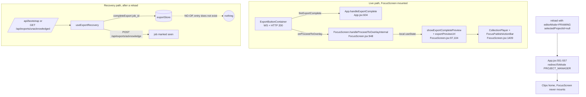
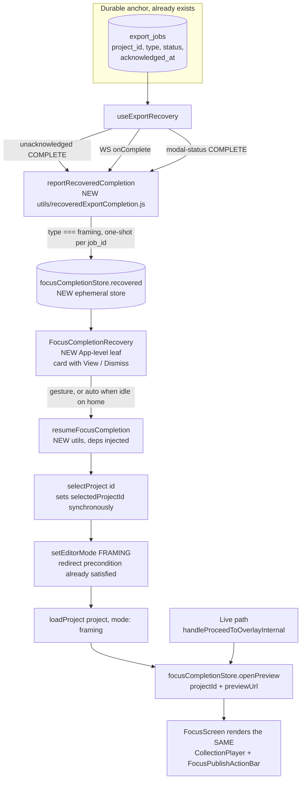

# T9285 Design: recovered Focus completions never reach the publish-exit preview

**Task:** [T9285-focus-recovery-path-skips-completion-preview.md](T9285-focus-recovery-path-skips-completion-preview.md)
**Status:** DESIGN, awaiting approval (no code written)
**Author:** Architect agent, 2026-09-12
**Tier:** L (design-gated, per the 2026-09-12 Progress Log re-classification)

> **Read this first:** the task file's original "Solution" section is superseded. `publishIntentStore`
> is in-memory only and dies with the reload, so it cannot carry anything across a tab discard. This
> document supersedes it and is built on the 2026-09-12 Code Expert re-read plus a fresh read of every
> file as it exists after T9740 (PR #419).

---

## 1. Current State Analysis

### 1.1 The two ways a Focus render can finish

| Path | Who owns the completion | What the user sees today |
|------|-------------------------|--------------------------|
| **Live** (FocusScreen mounted the whole time) | `ExportButtonContainer` WS/HTTP callbacks, `fireExportComplete` (`ExportButtonContainer.jsx:285-289`), then `FocusScreen.handleProceedToOverlayInternal` (`FocusScreen.jsx:948`) | Preview-first completion screen: `CollectionPlayer` + `FocusPublishActionBar` (`FocusScreen.jsx:1409-1429`). Correct, T9280 hardened its guard. |
| **Recovery** (tab discarded / reloaded mid-render) | `useExportRecovery.js` | **Nothing at all.** See 1.3. |

### 1.2 Architecture today



### 1.3 Mechanism, confirmed by reading the code as it is now

1. A mobile tab discard destroys **all** in-memory state. `publishIntentStore`, `reelPreviewStore`,
   `exportStore` and every React tree are gone. The URL survives, so the reload re-enters with
   `editorMode = FRAMING` and `selectedProjectId = null`.
2. `App.jsx:551-557` (T5677) sees "editor mode with no selected project" and `redirectToMode(PROJECT_MANAGER)`.
   FocusScreen never mounts, so nothing that lives inside it can run. T9280's guard
   (`focusOverlayTransition.js:63`) is inert here by construction, exactly as the task says.
3. The only durable record that survives is the server-side `export_jobs` row, surfaced by
   `GET /api/exports/unacknowledged` (`exports.py:715-768`) and by the bootstrap payload
   (`bootstrap.py:169-182`). Both carry `project_id`, `type` ('framing' | 'overlay' | 'annotate'),
   `status`, `project_name`, `output_video_id`.
4. `useExportRecovery.js:124-131` walks that list and calls `completeExport(exp.job_id, ...)`.

**New finding, and it is load-bearing for this design:** that call is a **silent no-op**.
`exportStore.completeExport` (`exportStore.js:252-258`) starts with
`const existing = state.activeExports[exportId]; if (!existing) return state;`. The store was just
overwritten by `setExportsFromServer(activeExports)` (`useExportRecovery.js:81`), which contains
**only** pending/processing/uploading jobs. A completed-while-away job is by definition not in that
list, so there is no entry to complete. The same is true of the `failExport` branch. Net effect today:

- no store entry, so `GlobalExportIndicator`'s toast effect (`GlobalExportIndicator.jsx:195-251`) never
  even iterates it,
- `POST /api/exports/acknowledge` still fires, so the job is marked as seen,
- the user gets **absolutely no signal** that their render finished. Not a missing preview, total silence.

This is why the reported symptom is "nothing happened", and it means a fix cannot be built on top of the
existing toast, which is dead for this case.

### 1.4 A second, equally unhandled sub-case

The task frames this as "completed while the tab was dead", but the same gap exists when the export is
**still running** at reload:

- recovery re-hydrates it from `/api/exports/active`, connects the WS
  (`useExportRecovery.js:94-104`) and the completion arrives minutes later,
- or `checkModalStatusOnce` finds it already complete on Modal (`useExportRecovery.js:205-210`).

In both, the only reaction is a store update plus a toast. No preview, because FocusScreen is not
mounted (the user is on Clips home, where the T5677 redirect put them). Any fix that only handles the
`unacknowledged` list leaves half the bug alive. Both sub-cases share one predicate, which this design
uses as its single seam: **a framing export reached COMPLETE and no FocusScreen owned that completion.**

### 1.5 Why the recovery path and the live path cannot double-fire

Verified, because T9740 spent four rounds on exactly this class of bug:
`ExportButtonContainer.connectWebSocket` is called only from `handleExport` and from the manual
"Retry connection" handler (which early-returns on `!exportIdRef.current`). A fresh page load has a
null `exportIdRef`, so a container **never** owns an export dispatched in a previous page session.
Recovery only ever touches jobs it discovered from the server. The two sets are disjoint by
construction, not by a guard.

Within recovery there *is* a genuine double-delivery path: the WS `onComplete` and the 60s
silence-timeout `checkModalStatusOnce` re-poll can both report the same job. That is why the new seam
is one-shot per `job_id` (section 2.3), for the same reason `fireExportComplete` exists, not as
defensive padding.

### 1.6 Code smells found on the way

| Smell | Location | Impact |
|-------|----------|--------|
| Dead notification branch | `useExportRecovery.js:124-131` + `exportStore.js:252-258` | The whole "completed while you were away" feature is inert for every export type. Acknowledges the job while showing nothing. |
| Three unrelated completion call sites | `useExportRecovery.js` lines ~98, ~126, ~209 | Same event, three places, no shared handler. This is exactly the shape T9740 collapsed into `fireExportComplete`. |
| Dead code branch | `FocusScreen.jsx:991-1029` (`if (renderedVideoBlob)`) | All four `onProceedToOverlay` call sites in `ExportButtonContainer.jsx` (`:321, :393, :725, :848`) pass `null`. ~40 lines that cannot execute. |
| Silent no-render | `FocusScreen.jsx:1409` `showExportCompletePreview && exportPreviewUrl` | If `resolveWorkingVideoPreviewUrl` returns null, the `overlay_offered` achievement fires and the completion screen silently does not appear. A no-silent-fallbacks violation. |
| Timestamp landmine | `GlobalExportIndicator.jsx:201-203` vs `exportStore.js:78` | `completedAt` is an ISO string when set client-side but a naive UTC `"YYYY-MM-DD HH:MM:SS"` when hydrated from the server. `new Date(naive)` is parsed as **local** time by most browsers, so any recency math on a server-hydrated row is wrong by the UTC offset. This design therefore does no timestamp math. |
| Replica tests | `focusPublishExit.test.jsx:39-100` | The test rebuilds its own mini FocusScreen instead of driving the real one, so it cannot catch a change in where the preview state lives. Same class of landmine T9740 deleted `appPublishAfterRender.test.js` for. |

### 1.7 Current behavior, pseudo code

```pseudo
on reload after tab discard:
    editorMode = FRAMING (from URL), selectedProjectId = null
    App effect (T5677) -> redirectToMode(PROJECT_MANAGER)      // FocusScreen never mounts

    useExportRecovery:
        setExportsFromServer(activeExports)                    // completed job not in here
        for exp in unacknowledgedExports:
            completeExport(exp.job_id, ...)                    // <-- NO-OP, no entry exists
        POST /api/exports/acknowledge                          // job marked seen anyway
    // user sees nothing at all
```

---

## 2. Target Architecture

### 2.1 Principles applied

- **One durable anchor, no new persistence.** `export_jobs` already answers "did a framing render finish
  that the user has not been shown?" via `acknowledged_at`. No new table, column, localStorage or
  sessionStorage. The only new state is one ephemeral in-memory store, in the same family as
  `publishIntentStore` and `reelPreviewStore`.
- **One preview implementation.** The recovered path does not get its own preview. It navigates into
  Focus for that project and opens **the same** `CollectionPlayer` + `FocusPublishActionBar` block the
  live path opens, with the same four handlers. No duplicated action bar, no second set of semantics.
- **One completion seam inside recovery.** The three sites collapse into one named helper, mirroring
  `fireExportComplete`.
- **Defeat the redirect by satisfying it, not by weakening it.** `App.jsx:551-557` stays byte-identical.
  The resume selects the project **before** switching mode, so the "editor mode with no project"
  condition is never true. No new exception branch in a guard that exists to prevent back-button loops.
- **T9280 untouched.** `shouldSkipFocusCompletionPreview` keeps gating the live path only. The recovered
  path answers "is the user on a different project?" by construction (it navigates to the project
  first), so there is no second copy of that decision.

### 2.2 Target diagram



The single most important property: **`openPreview` has exactly two callers and one renderer.** The live
completion and the recovered completion converge before the preview, not after.

### 2.3 The three new modules

**a) `src/frontend/src/stores/focusCompletionStore.js`** (ephemeral, never persisted, header comment
modelled on `publishIntentStore.js`)

```pseudo
{
  // the open preview, read by FocusScreen's render (replaces two useState hooks)
  preview: { projectId, previewUrl, openMode } | null,
  openPreview({ projectId, previewUrl, openMode }),
  closePreview(),

  // a completion discovered by recovery that no screen owned
  recovered: { jobId, projectId, projectName } | null,
  noteRecovered(payload),   // latest wins, at most one carried
  clearRecovered(),
}
```

Why a store and not props: the writer (App-level recovery) and the reader (FocusScreen, behind
`React.lazy` + Suspense) have no ref or prop relationship. That is verbatim the rationale
`publishIntentStore.js` already documents. Lifting the state into `App.jsx` was considered and rejected
in section 4.

**b) `src/frontend/src/utils/recoveredExportCompletion.js`**

```pseudo
const reported = new Set()          // module scope, one-shot per job id (StrictMode + WS/poll double delivery)

export function reportRecoveredCompletion({ jobId, projectId, projectName, type }) {
  if (!jobId || reported.has(jobId)) return false
  reported.add(jobId)
  if (type !== 'framing') return false          // overlay owns its own completion (T9110 / handleOverlayExportCompletion)
  if (!projectId) { console.error('[RecoveredExport] framing job with no project_id', jobId); return false }
  focusCompletionStore.noteRecovered({ jobId, projectId, projectName })
  return true
}
```

**c) `src/frontend/src/utils/resumeFocusCompletion.js`** (all collaborators injected, so tests drive the
real module, mirroring `handleOverlayExportCompletion.js`)

```pseudo
export async function resumeFocusCompletion({ projectId }, {
  getEditorMode, getSelectedProjectId, selectProject, setEditorMode,
  loadProject, resolvePreviewUrl, openPreview, recordAchievement, toastError, EDITOR_MODES,
}) {
  const previewUrl = await resolvePreviewUrl(projectId)
  if (!previewUrl) {
    console.error('[ResumeFocus] no working-video preview URL for project', projectId)
    toastError("Couldn't open the preview", { message: 'Open the clip from Clips to finish it.' })
    return { opened: false, navigated: false }
  }

  // Already standing in Focus for this project (recovered export finished while the
  // user had navigated back in): open in place. loadProject would reset projectData /
  // focus / overlay / video stores under a live editor, which is not a cosmetic cost.
  if (getEditorMode() === EDITOR_MODES.FRAMING && getSelectedProjectId() === projectId) {
    openPreview({ projectId, previewUrl, openMode: EDITOR_MODES.FRAMING })
    recordAchievement('overlay_offered')
    return { opened: true, navigated: false }
  }

  const project = await selectProject(projectId)          // sets selectedProjectId SYNCHRONOUSLY
  if (!project) { console.error(...); toastError(...); return { opened: false, navigated: false } }

  setEditorMode(EDITOR_MODES.FRAMING)                     // redirect precondition already satisfied
  await loadProject(project, { mode: EDITOR_MODES.FRAMING })   // explicit mode is REQUIRED, see risks
  openPreview({ projectId, previewUrl, openMode: EDITOR_MODES.FRAMING })
  recordAchievement('overlay_offered')
  return { opened: true, navigated: true }
}
```

Ordering is the whole point and must be locked by a test: `selectProject` before `setEditorMode`, and
`{ mode: 'framing' }` passed explicitly.

### 2.4 Target behavior, pseudo code

```pseudo
on reload after tab discard:
    App redirect (UNCHANGED) -> Clips home
    useExportRecovery discovers job: type=framing, status=complete, project_id=X
        -> reportRecoveredCompletion(...)  -> focusCompletionStore.recovered = { X }

    FocusCompletionRecovery (App-level leaf):
        renders "AI Focus ready - {name}"  [View]  [Dismiss]
        (+ optionally auto-invokes View when the user is idle on home, see the OPEN QUESTION)

    View tap -> resumeFocusCompletion(X)
        -> selectProject(X) -> setEditorMode(FRAMING) -> loadProject(X, framing)
        -> openPreview(X, url)
        -> FocusScreen renders the SAME preview + FocusPublishActionBar the live path shows
        -> Publish / Add spotlight / Refocus / Save draft all behave identically
```

---

## 3. Implementation Plan

### 3.1 File-level changes

| File | Change | Notes |
|------|--------|-------|
| `stores/focusCompletionStore.js` | **NEW**, ~35 lines incl. header | Ephemeral. `preview` + `recovered` slices. |
| `utils/recoveredExportCompletion.js` | **NEW**, ~25 lines | One-shot per job id, framing-only, loud on missing project id. |
| `utils/resumeFocusCompletion.js` | **NEW**, ~50 lines | Injected deps, no React import. |
| `components/FocusCompletionRecovery.jsx` | **NEW**, ~70 lines | Leaf that owns `useProjectLoader()` and the surface. Renders `null` when `recovered` is null. |
| `hooks/useExportRecovery.js` | 3 call sites route through `reportRecoveredCompletion` | WS `onComplete` (~:98), unacknowledged loop (~:126), `checkModalStatusOnce` COMPLETE (~:209). `completeExport`/`failExport` calls stay exactly as they are; acknowledge behavior unchanged. |
| `screens/FocusScreen.jsx` | Replace 2 `useState` with a store read; 5 setter call sites become `openPreview`/`closePreview` | See 3.2. Net roughly neutral LOC. |
| `App.jsx` | Mount `<FocusCompletionRecovery />` in both returns | Beside `GlobalExportIndicator` at `:931` (home) and `:1031` (editor), exactly how `DraftReelPreview` is mounted twice (`:945`, `:1028`). |

Nothing in `App.jsx:551-557`, `handleOverlayExportCompletion.js`, `ExportButtonContainer.jsx`,
`publishIntentStore.js`, `scheduleExportWhenReady.js` or `focusOverlayTransition.js` is touched. No
backend change, no schema change, no migration.

### 3.2 FocusScreen edit, precisely

```pseudo
// FocusScreen.jsx:97,104  -- REMOVE two local useState hooks
- const [showExportCompletePreview, setShowExportCompletePreview] = useState(false)
- const [exportPreviewUrl, setExportPreviewUrl] = useState(null)
+ const completionPreview = useFocusCompletionStore(s => s.preview)
+ const previewOpen = completionPreview?.projectId === projectId    // derived, never stored twice

// FocusScreen.jsx:1038-1052 + :1069-1080  -- live completion path
  const previewUrl = await resolveWorkingVideoPreviewUrl(projectId)
- if (previewUrl) setExportPreviewUrl(previewUrl)
  ...
- setShowExportCompletePreview(true)
- recordAchievement('overlay_offered')
+ if (previewUrl) {
+   openPreview({ projectId, previewUrl, openMode: EDITOR_MODES.FRAMING })
+   recordAchievement('overlay_offered')
+ } else {
+   console.error('[FocusScreen] export completed but no preview URL for project', projectId)   // was a silent no-render
+ }

// FocusScreen.jsx:1085-1176  -- the four handlers, unchanged except the close call
- setShowExportCompletePreview(false); setExportPreviewUrl(null)
+ closePreview()
// publishIntentStore clears, achievements, toasts, navigation: all UNCHANGED (T9740 / T8390 behavior)

// FocusScreen.jsx:1409  -- render gate
- {showExportCompletePreview && exportPreviewUrl && (
+ {previewOpen && (
      <CollectionPlayer reels={[{ ..., streamUrl: completionPreview.previewUrl }]} ... />
```

`previewUrl` is now guaranteed non-null at the store boundary, so the compound render gate collapses to
one condition and the silent-no-render smell disappears.

**Stale-payload scoping:** copy the mechanism T9470 already blessed for the sibling surface. The payload
carries `openMode`; a 3-line effect clears it when `editorMode` moves off `openMode`
(`DraftReelPreview.jsx:45-50`). This is an ephemeral view payload being dropped, never an API or DB
write, so it does not touch the reactive-persistence ban; it is the established pattern for this exact
"overlay outlived its screen" problem in this codebase.

### 3.3 The surface component

```pseudo
function FocusCompletionRecovery() {
  const recovered = useFocusCompletionStore(s => s.recovered)
  const { loadProject } = useProjectLoader()        // isolated HERE, see Design Decisions
  const [resuming, setResuming] = useState(false)
  if (!recovered) return null
  // bottom-right card, same slot/visual family as GlobalExportIndicator
  //   title: EXPORT_JOBS.framing.completed  ("AI Focus ready")
  //   message: recovered.projectName
  //   primary: [View]  -> setResuming(true); await resumeFocusCompletion(...); clearRecovered()
  //   secondary: [Dismiss] -> clearRecovered()
}
```

Copy comes from `config/displayNames.js` `EXPORT_JOBS.framing` (T9540's single source), not new strings.

### 3.4 Test plan (red first, then green)

| Test | Kind | Locks |
|------|------|-------|
| `recoveredExportCompletion.test.js` | unit, real module | one-shot per job id (WS + modal-poll double delivery collapses to one), framing-only, loud + no note on missing `project_id`, latest-wins |
| `resumeFocusCompletion.test.js` | unit, real module + injected spies | **ordering**: `selectProject` resolves before `setEditorMode`; `loadProject` receives `{ mode: 'framing' }`; null preview URL -> no `openPreview`, one `console.error`, one toast; already-in-Focus branch -> no `loadProject`, no store reset |
| `useExportRecovery` integration | RTL/unit with mocked fetch | unacknowledged framing COMPLETE -> `recovered` set; overlay/annotate COMPLETE -> not set; acknowledge POST still fires exactly once |
| FocusScreen preview render | RTL against the REAL FocusScreen if feasible, otherwise an honest harness | store payload matching `projectId` renders `FocusPublishActionBar`; mismatched `projectId` renders nothing; each of the four handlers calls `closePreview` |
| T9280 regression | existing `focusOverlayTransition.test.js` | stays green, file untouched |
| Reload-mid-export simulation | e2e approximation per the task's Technical Notes | reload while a framing export is in flight, stub `/api/exports/unacknowledged` with a complete framing job, assert the surface appears and View lands on the action bar |

Red proof required before the fix: the recovery integration test plus the FocusScreen render test must
fail on master for the right reason (nothing carries the completion, nothing renders).

### 3.5 Out of scope, file as follow-ups

1. **The dead `completeExport` branch for unacknowledged jobs** (1.3). Fixing it properly means hydrating
   those rows into `exportStore`, which changes what `GlobalExportIndicator` lists and toasts for **all**
   export types, and runs straight into the `completed_at` parsing landmine. Separate task.
2. **The dead `renderedVideoBlob` branch** (`FocusScreen.jsx:991-1029`). Deleting it is a mechanical
   commit; per the refactoring rules it must not ride along with a behavior change.
3. **Relocating the whole completion preview out of FocusScreen** (section 4, option 2).

---

## 4. Design Decisions

| Decision | Options considered | Choice | Rationale |
|----------|--------------------|--------|-----------|
| Cross-reload carrier | extend `publishIntentStore`; new localStorage/sessionStorage key; derive from `export_jobs` | **derive from `export_jobs`** | The store is in-memory (its own header says so) and dies with the tab. A new persisted key would be persisted view state, which the project bans, and would duplicate a server fact that already exists with an `acknowledged_at` bit. |
| Where the recovered completion is detected | a new poller; `GlobalExportIndicator`; inside `useExportRecovery` | **`useExportRecovery`, one shared helper for its 3 completion sites** | It already fetches both lists and owns the WS reconnects. A second poller would be a parallel code path for one question. Collapsing 3 sites into 1 helper is the same move `fireExportComplete` made. |
| Where the preview lives | (1) stays in FocusScreen, flag moves to a store; (2) relocate the whole preview to an App-level component like `DraftReelPreview` | **(1)** | Both options require navigating into Focus first anyway, because Publish needs Overlay's export button to mount and Add spotlight/Refocus need a loaded project. Given that, (2) buys only a thinner FocusScreen at the cost of moving `handlePublish`, the exact code T9740 stabilized over four rounds. Recommended as a follow-up refactor, not as this fix. |
| Preview flag: store vs lifted App state | Zustand ephemeral store; `useState` in `App.jsx` + props | **store** | FocusScreen is `React.lazy` behind Suspense and the writer is a sibling leaf. Props would thread through two boundaries. The precedent (`publishIntentStore`, `reelPreviewStore`) exists for this exact writer/reader shape. |
| Where `useProjectLoader()` is called | `App.jsx`; `useExportRecovery`; a new leaf component | **new leaf component** | `useProjectLoader` destructures the whole `projectDataStore`, so calling it in `App.jsx` or in a hook `App` calls would re-render the entire editor tree on every clip-metadata change. A leaf that renders a small card (or `null`) contains that subscription. |
| Reuse `ProjectsScreen.handleSelectProjectWithMode`? | extract a shared `useOpenProjectInMode`; duplicate the minimal sequence | **duplicate the minimal 3 calls, cross-referenced by comment** | Only 2 call sites, and the abstract-on-the-3rd-duplication rule applies. The resume deliberately skips the breadcrumb/profiling/`onStateReset` bits, which exist for the chunk-reload resume. A comment naming `ProjectsScreen.jsx:257-302` keeps the drift visible. |
| Defeating `App.jsx:551-557` | add a "resuming" exception to the redirect; select the project first | **select first** | The redirect keys on `selectedProjectId`, which `selectProject` sets synchronously before its own await. Satisfying the precondition needs zero change to a guard that exists to stop back-button loops. |
| Recency/eligibility | parse `completed_at` and bound it; use the server's `acknowledged_at` only | **`acknowledged_at` only, no timestamp math** | `completed_at` arrives as a naive UTC string and `new Date()` parses it as local time (1.6). Any window built on it is silently wrong by the UTC offset. `acknowledged_at IS NULL` is the server's own "the user has not been shown this" bit. |

---

## 5. Risks

| Risk | Mitigation |
|------|------------|
| Reintroducing the T9740 double-fire class | No new call site is added to `ExportButtonContainer`, and `fireExportComplete`/`handleOverlayExportCompletion` are not touched. Container-owned and recovery-owned completions are disjoint by construction (1.5). The recovery-internal WS-vs-poll double delivery is collapsed by the one-shot `Set`, and `resumeFocusCompletion` is idempotent (a second `openPreview` for the same project is the same payload). |
| Regressing T9280's still-mounted path | `focusOverlayTransition.js` is untouched and its test stays green. The live path's only change is where the flag is stored and one `console.error` replacing a silent no-render. |
| `loadProject` lands on Overlay instead of Focus | Real landmine: `useProjectLoader.js:117-120` defaults to `overlay` whenever `working_video_id` is set and there is no final video, which is exactly the post-framing-render state. The resume must pass `{ mode: 'framing' }` explicitly; locked by a test. |
| A live editor gets reset under the user | The "already in Focus for this project" branch skips `selectProject`/`loadProject` (which reset four stores) and opens the preview in place. |
| Stale preview resurrects on re-entry | `openMode` scoping, same mechanism T9470 shipped for `DraftReelPreview`. |
| Missed surface is gone forever (the job is acknowledged on the same load) | Accepted and documented. The project still shows as a finished draft on the Clips home, so nothing is lost, only the funnel moment. Making `acknowledge` conditional on the UI being seen was rejected: it turns a mount-time reconciliation write into a UI-dependent write and risks re-prompting on every load for 24h. |
| Two bottom-right surfaces collide | The recovery card and `GlobalExportIndicator` share the corner. Indicator renders only while something is processing, so overlap is rare; the card takes a stacking offset. Cosmetic. |
| Auto-navigation disorients the user | This is the open product question below. |
| Live-device confirmation still owed (task AC1) | A real OS tab discard is not reproducible in Playwright. Reproduce via reload-mid-export plus a stubbed unacknowledged response, and state the gap plainly, as T9740 did. |

---

## 6. OPEN PRODUCT QUESTION (needs your call before implementation)

**When a Focus render is discovered as already finished after a reload, should the app take over the
screen and show the preview, or offer it passively?**

| Option | Behavior | Pros | Cons |
|--------|----------|------|------|
| **A. Always hijack** | On discovery, auto-run the resume: select the project, enter Focus, open the preview | Matches the task's AC wording literally ("lands the user on"). Highest funnel conversion. Zero taps. | A 20-hour-old unacknowledged job would yank someone into a preview on app open. If the export completed later in the session while the user is annotating another game, it rips them out of real work. |
| **B. Always passive** | Show a persistent "AI Focus ready - {name}" card with View / Dismiss. One tap gets the full preview | Never disrupts. Simplest code: no auto-trigger effect at all, the resume runs from a real gesture. | One extra tap at the exact moment the funnel is trying to close. A user who dismisses or misses the card does not get the card back (the job is acknowledged). |
| **C. Conditional (recommended)** | Auto-resume **only** when the completion was discovered by the mount-time recovery pass **and** the user is still sitting on home with no project selected. Every other case shows the B card | Distinguishes "the app redirected you here, you chose nothing" from "you navigated somewhere on purpose". Mirrors the hijack policy the app already has in `handleOverlayExportCompletion.js:130` ("only land them on the finished reel if they are still in Overlay for this project"). | One extra branch. An old unacknowledged job can still auto-open on a cold start (no timestamp guard, by design, see 1.6). |

**Recommendation: C**, for three reasons.

1. In the reported scenario the user never chose to be on the Clips home. `App.jsx:551-557` put them
   there. Restoring the screen they were on is repair, not hijack.
2. The app already owns this exact policy predicate for the sibling Overlay completion, and T9740's fix
   split the navigation decision from the action decision specifically so that wandering off suppresses
   only the screen takeover. Reusing that stance keeps one mental model.
3. The cost of the branch is one `if` in one file, and both arms call the same `resumeFocusCompletion`,
   so there is still exactly one code path to the preview.

If you prefer the smallest, safest change, **B** is a clean answer and drops the auto-trigger effect
entirely. If you want maximum funnel pressure, **A** is a one-line change from C. The architecture is
identical in all three; only the trigger differs, in one file.

**Sub-question if you pick A or C:** should an auto-open be suppressed for completions older than some
window? My recommendation is no, because the only timestamp available client-side is the one described
in 1.6 and any window built on it is wrong by the UTC offset. `acknowledged_at IS NULL` already means
"never shown to this user". Say the word if you want a real recency bound and I will design it with the
server returning an explicit age instead.

---

## 6a. DECIDED: Option C, plus a refinement to the acknowledge timing (2026-09-12)

**User approved Option C** (auto-open only when the completion was discovered while the user is
still on Clips home with nothing selected; a passive card otherwise).

**Also approved, following a second Opus-expert trace of the actual WebSocket/reconnect code**
(confirming no push/replay channel exists in this codebase that could substitute for the
`export_jobs` read - see that consult's verdict for the full evidence trail: the one WS endpoint
in the backend is fire-and-forget with zero replay on reconnect, and its own fallback path is
itself an `export_jobs` HTTP poll): **defer the `POST /api/exports/acknowledge` write for
FRAMING jobs specifically from mount-time to the View/Dismiss gesture**, instead of this design's
original unconditional mount-time acknowledge.

**Why:** today `useExportRecovery.js:133-140` acknowledges every unacknowledged job the instant
the app loads, flagged `rbNonDataWrite: true // mount-time reconciliation, not a user gesture`.
Combined with this design's own §5 risk ("Missed surface is gone forever... the job is
acknowledged on the same load"), a SECOND tab discard between the card rendering and the user
tapping View would permanently lose the completion-preview moment - the exact mobile failure mode
this task exists to fix, recurring one level up.

**Revised behavior for framing jobs only** (overlay/annotate jobs keep the existing unconditional
mount-time acknowledge - this refinement is scoped to the bug this task fixes, not a general
policy change):
- On discovering an unacknowledged FRAMING job, do NOT call `/api/exports/acknowledge` yet.
  Still call `reportRecoveredCompletion(...)` -> `focusCompletionStore.noteRecovered(...)` as
  designed.
- Acknowledge only when the user acts: the View gesture (inside `resumeFocusCompletion`, after
  `openPreview` fires) or the Dismiss gesture (inside `FocusCompletionRecovery`'s dismiss
  handler) calls `POST /api/exports/acknowledge` at that point instead.
- Net effect: a second discard before the user acts simply means the card reappears next load -
  "re-prompt until seen" - rather than the completion vanishing. This converts a reconciliation
  write into a real user-gesture write, which is a BETTER fit for CLAUDE.md's persistence
  invariant ("every DB write must trace to a named user gesture"), not a deviation from it.
- No change to the 24-hour `completed_at >= now() - interval '24 hours'` window in
  `GET /api/exports/unacknowledged` (`exports.py:715-768`) - an old job past that window still
  ages out normally; this refinement only affects jobs still inside that window.

**File-level delta from §3.1**: `useExportRecovery.js`'s framing branch of the unacknowledged-jobs
loop skips its acknowledge call (still calls `reportRecoveredCompletion`); `resumeFocusCompletion.js`
gains an `acknowledgeJob(jobId)` injected dependency, called after `openPreview` succeeds;
`FocusCompletionRecovery`'s Dismiss handler calls the same `acknowledgeJob(jobId)` before
`clearRecovered()`. No new modules, no schema change - same three new files as §3.1, same edit
surface, this only moves WHEN one existing HTTP call fires for one job type.

---

## 7. Approval

**APPROVED 2026-09-12** - Option C plus the §6a acknowledge-timing refinement. Next stage: Test
First (red proof on master), then implementation.
