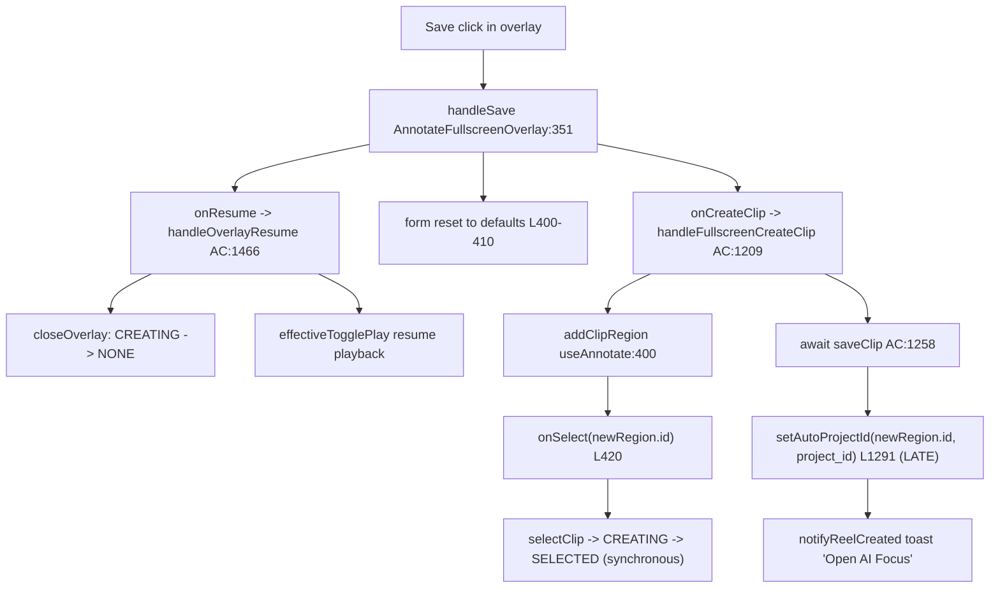
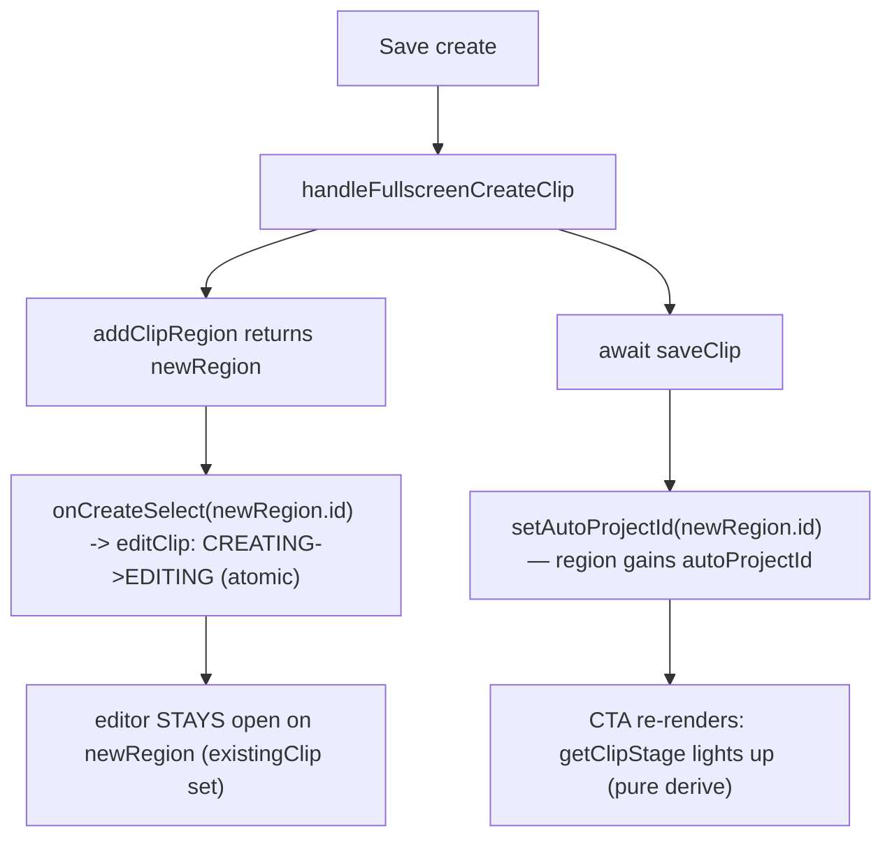

# T9330 — Design: Clipping a play keeps the editor open, with a stage-aware primary CTA

**Status:** APPROVED (2026-09-10) — proceeding to implementation
**Tier:** L (state machine + save-lifecycle change spanning four surfaces; create-to-edit handoff runs while a backend call is in flight)
**Task file:** `docs/plans/tasks/T9330-stay-in-edit-mode-stage-aware-cta.md`

> All `file:line` anchors below are re-verified against the current tree (the task file's own citations had drifted). Real paths: `src/frontend/src/modes/annotate/hooks/useClipSelection.js`, `src/frontend/src/containers/AnnotateContainer.jsx`, `src/frontend/src/modes/annotate/components/AnnotateFullscreenOverlay.jsx`, `src/frontend/src/modes/annotate/components/ClipDetailsEditor.jsx`, `src/frontend/src/modes/AnnotateModeView.jsx`.

---

## 0. Approved Decisions (2026-09-10) — supersede the Open Questions in §6

The user reviewed the five §6 open questions and answered:

1. **Label strings — APPROVED as designed.** User-facing CTA + sidebar labels: `Apply AI Focus` / `Apply Spotlight` / `View Final` / `View Published`, superseding T9320's shipped `AI Focus` / `Spotlight` / `Completed` / `Published` / `Open clip (Draft)`. The confirm-dialog copy becomes **stage-aware** and the stale "…closes the Annotate editor" line is **dropped** (the editor now stays open). `ClipDetailsEditor.reel.test.jsx` is rewritten to match (filename kept — grandfathered, see §0.1).
2. **Playback on create-save — APPROVED: resume playback** (matches current felt behavior). Implement §2.4's split so playback resumes WITHOUT closing the editor.
3. **Mobile sheet — APPROVED: diverge, mobile CLOSES on create** (desktop strip stays open). Build toward this; **a real-device check per T5380 is still owed** before final sign-off — flagged explicitly in QA, not skipped.
4. **Drifted / below-migration clip projects open the existing project instead of offering re-create — APPROVED**, with the vocabulary correction in §0.1.

### 0.1 VOCABULARY CORRECTION (binding, applies to all code + this doc)

Current app vocabulary hierarchy: **Play → Clip → (published multi-clip) Highlight Reel**. The word **"Reel" / "Highlight Reel" is reserved EXCLUSIVELY for the separate multi-clip published object.** A single clip's own Focus/Overlay-produced project/video — what `region.autoProjectId` / `linkedProject` refers to throughout this task — is **NOT a reel; it is that CLIP'S OWN PROJECT.** (This is the pre-established rule behind memory `feedback_play_produces_clip_never_reel`, already applied in T9320 which relabeled the old Reel/Create Reel control to Clip/Create Clip.)

Consequence — the design's earlier draft used stale "reel" terminology for the clip's project. **Canonical rename applied across this doc and to be applied in all new code/comments:**

| Stale (draft) | Corrected |
|---------------|-----------|
| `getClipReelStage` | **`getClipStage`** |
| `CLIP_REEL_STAGE` | **`CLIP_STAGE`** |
| `clipReelStage.js` / `.test.js` | **`clipStage.js` / `clipStage.test.js`** |
| `reelReflectsClip` (new local) | **`projectReflectsClip`** |
| `reelIsFreshDraft` (new local) | **`projectIsFreshDraft`** |
| `reelPending` (new ref) | **`focusPending`** |
| `hasReel` (new local) | **`hasProject`** |
| stage const `NO_REEL` | **`NO_PROJECT`** |
| prose "the reel" (= clip's project) | **"the clip's project"** |

**Grandfathered — pre-existing identifiers NOT renamed by this task** (they are persisted fields / store fns / existing files, out of scope; renaming them is a separate refactor): `region.autoProjectId`, `region.reelSourceStartTime`, `region.reelSourceEndTime`, `linkedProject.has_working_video` / `.has_final_video` / `.is_published`, `notifyReelCreated` / `announceReelCreated`, the `reelRequested` local state in `ClipDetailsEditor`, and the existing test filename `ClipDetailsEditor.reel.test.jsx`. New code MUST NOT introduce fresh "reel"-as-clip-project identifiers.

---

## 1. Current State Analysis

### 1.1 Architecture (create flow today)



**The two timings (CONFIRMED):**

| Timing | What sets state | Result |
|--------|-----------------|--------|
| Synchronous (in `addClipRegion`) | `onSelect(newRegion.id)` -> `selectClip` -> **CREATING→SELECTED** | Overlay closes; `showAnnotateOverlay`(=`isOverlayOpen`)=false. |
| After network (`await saveClip`) | `setAutoProjectId(newRegion.id, project_id)` (AC:1291) | The clip's project exists — but editor is already closed. |

There is **no moment where the editor is open AND `autoProjectId` exists** — exactly the moment the "open in AI Focus" CTA would matter. `newRegion.id` is stable across both timings, so the late `setAutoProjectId` reaches the right region.

### 1.2 The selection state machine (`useClipSelection.js`, 97 lines)

Plain `setState` (no reducer). States `NONE / SELECTED / EDITING / CREATING`.

| Transition | Function | Effect |
|-----------|----------|--------|
| →SELECTED | `selectClip(id)` (L40) | `{type:SELECTED, clipId:id}` |
| →EDITING | `editClip(id)` (L44) | `{type:EDITING, clipId:id}` |
| →CREATING | `startCreating()` (L48) | `{type:CREATING}` — **carries no clipId** |
| close | `closeOverlay()` (L52) | EDITING→SELECTED (keeps clipId) / CREATING→NONE |
| deselect | `deselectClip()` (L64) | EDITING & CREATING **immune** |

Derived (L74-81): `selectedRegionId` non-null in SELECTED\|EDITING; `isOverlayOpen` = EDITING\|CREATING; **`isEditMode` = SELECTED only** (this is the SIDEBAR-visible "Edit Clip button" flag, a confusing name — see §2.1).

There is **no dedicated create-finished transition today**; create finish is the generic `onSelect(newRegion.id)` side-effect firing `selectClip` (CREATING→SELECTED).

### 1.3 The overlay's OWN `isEditMode` (different flag, same name)

`AnnotateFullscreenOverlay.jsx:147`: `const isEditMode = !!existingClip;` — a LOCAL derivation, **not** the hook's flag. `existingClip` (AnnotateModeView:138) = `clipRegions.find(id === annotateSelectedRegionId)` gated on `showAnnotateOverlay`. So the overlay renders edit-mode UI the instant `existingClip` is non-null AND the overlay is open — which is precisely the state we want to land in after create.

### 1.4 Code smells identified

| Smell | Location | Impact |
|-------|----------|--------|
| **Duplicate stage machine** | `AnnotateFullscreenOverlay.jsx:922-940` (strip, stage-BLIND: always "AI Focus") vs `ClipDetailsEditor.jsx:399-447` (5-way nested ternary) | Two surfaces, two vocabularies, one underlying state. Drift risk (already drifted — strip never shows Spotlight/Completed/Published). |
| **Overloaded name `isEditMode`** | hook (SELECTED-only) vs overlay (`!!existingClip`) | Reader confusion; the fix hinges on knowing they differ. |
| **Unconditional form reset masquerading as "continue"** | `handleSave` L400-410 resets to create defaults in BOTH modes | Blocks stay-open (would show default values for a real clip). |
| **`onResume` conflates two concerns** | `handleOverlayResume` AC:1466 = `closeOverlay()` + `effectiveTogglePlay()` | Cannot "resume playback but stay open" without splitting. |

### 1.5 Current behavior (pseudo)

```pseudo
Save (create):
    onCreateClip(clipData)              // fires addClipRegion -> onSelect -> CREATING->SELECTED (closes)
    reset form to create defaults       // L400-410
    onResume()                          // closeOverlay (CREATING->NONE, no-op) + resume playback
    // ... later: saveClip resolves -> setAutoProjectId -> toast   <-- editor already gone
```

---

## 2. Target Architecture

### Design principles applied
- [x] **DRY** — one `getClipStage(region, linkedProject)` helper consumed by BOTH surfaces; delete the strip's blind "AI Focus" and the sidebar's nested ternary in favour of it.
- [x] **Single code path** — create-completion routes through ONE new explicit transition (`finishCreating(id)`), not the generic `onSelect`.
- [x] **Minimal branches** — the 6-row stage table becomes one ordered function returning `{stage, label, action}`; call sites render from that shape, no per-surface ternary.
- [x] **No reactive persistence** — the CTA is PURE render-derived from `region.autoProjectId` / `linkedProject`; nothing writes when the project id lands (task hard rule).
- [x] **Greppability** — explicit stage string constants near use; explicit `finishCreating` name (no dynamic dispatch).

### 2.1 Stay in EDITING after create (Resolution #1)

Add ONE transition to `useClipSelection.js`:

```pseudo
finishCreating = (clipId) => setState(prev =>
    prev.type === CREATING ? { type: EDITING, clipId } : prev)
```

Rationale for a new function rather than reusing `editClip`:
- `startCreating()` carries no `clipId`; the create-complete edge needs `newRegion.id` threaded in. `newRegion.id` **is available synchronously** from `addClipRegion`'s return, so the caller has it.
- Guarding on `prev.type === CREATING` makes it a no-op if state already moved (defensive against a double-fire; matches the existing guarded-reducer style of `closeOverlay`/`deselectClip`).
- Reusing `editClip(id)` would also work mechanically, but a named `finishCreating` keeps the create→edit edge greppable and documents intent at the call site.

**Wiring:** `handleFullscreenCreateClip` (AC:1209) must call `finishCreating(newRegion.id)` INSTEAD of relying on the `onSelect` side-effect landing on `selectClip`. The generic `onSelect` (AC:540, `id ? selectClip(id) : deselectClip()`) stays unchanged for every OTHER caller; we override the create path explicitly:
- Preferred: after `addClipRegion` returns `newRegion` (AC:1251), call `finishCreating(newRegion.id)`. The synchronous `onSelect(newRegion.id)` inside `addClipRegion` still fires first (CREATING→SELECTED); `finishCreating` then re-routes SELECTED... **but `finishCreating` guards on CREATING and would no-op.** See the ordering fix below.

**Ordering hazard + fix:** `addClipRegion` (useAnnotate:420) calls `onSelect(newRegion.id)` internally, which moves CREATING→SELECTED *before* `handleFullscreenCreateClip` regains control. Two clean options:

- **Option A (chosen):** give `useAnnotate` an optional `onCreateSelect` distinct from `onSelect`; when present, `addClipRegion` calls it instead of `onSelect` for the create edge, and the container wires `onCreateSelect = (id) => editClip(id)` (or `finishCreating` seeded to accept from any state). This keeps the transition atomic (never transiently SELECTED) and keeps `onSelect` semantics intact for scrub/click selection.
- **Option B:** drop the `CREATING`-guard so `finishCreating(id)` accepts from SELECTED too, and call it in `handleFullscreenCreateClip` after `addClipRegion`. Simpler, but allows a 1-frame SELECTED flash and weakens the guard.

**Recommendation: Option A** — atomic, preserves the guard, and the "create selection is a distinct edge" is exactly the semantic we're modelling. `isEditMode` (hook, SELECTED-only) does **not** need to change: after create we are in EDITING, `isOverlayOpen`=true, `selectedRegionId`=newRegion.id, so `showAnnotateOverlay`=true and `existingClip`=newRegion — the overlay renders edit UI via its OWN `!!existingClip`. No consumer of the hook's `isEditMode` needs the new state.



### 2.2 Reset-becomes-rehydrate (Resolution #2)

Today `handleSave` L400-410 unconditionally resets the form to CREATE defaults, then `onResume()`. With stay-open, after a create the overlay's `existingClip` flips from `null` to the new region, and the **reset effect L223-251 (keyed on `existingClip`) already rehydrates** the form from `existingClip` (rating, tags, name, scrub window, notes, teammates, `my_athlete`, `createProject = !!autoProjectId`). That effect is the single source of truth for a freshly-opened edit form.

**Change:** in `handleSave`, make the L400-410 reset run **only in create mode's "next clip" continuation path we are removing** — i.e. delete the unconditional reset block. After a create, we are staying open on the new clip; the `existingClip`-keyed effect (L223-251) rehydrates. After an update, we stay in edit mode on the same clip; no reset wanted. So the reset block is no longer correct in EITHER branch.

**Render-ordering hazard (must-not-regress):** the reset-to-defaults path (L238-250, `existingClip == null`) vs rehydrate-from-new-existingClip (L226-237). There is a window between `handleSave` firing and the state machine landing EDITING where `existingClip` is still the OLD value (null in create). We must NOT run the create-defaults reset in that window and then have the effect rehydrate — that's a double write and a flash. By **deleting the L400-410 reset entirely**, the ONLY form-population path becomes the `existingClip`-keyed effect, which fires exactly once when `existingClip` transitions null→newRegion. Source of truth = `existingClip`; single write path preserved.

Note `defaultClipName` / one-tap "Play N" (L152) is create-only (`isEditMode ? '' : ...`); once `existingClip` is set we're edit-mode, so the name effect (L256-263) reads the saved name. No regression.

### 2.3 Immediate open vs late CTA (Resolution #3)

- **Editor opens immediately** on the LOCAL region: `addClipRegion` returns synchronously and `onCreateSelect(newRegion.id)` lands EDITING in the same tick — no `await` between them. The editor never blocks on the network.
- **CTA lights up later, independently:** when `saveClip` resolves and `setAutoProjectId(newRegion.id)` runs, `region.autoProjectId` becomes non-null. The CTA is a PURE render of `getClipStage(region, linkedProject)`; React re-renders on the store update. **No `useEffect` writes** — the id landing is a store mutation from the existing gesture-scoped `saveClip` resolution, and the CTA merely reads it. This satisfies the task's hard rule (no reactive persistence when the project id lands).

```pseudo
CTA render (no effects, no writes):
    stage = getClipStage(region, linkedProject)   // pure
    <PrimaryCTA disabled={stage.action == null} onClick={stage.action}>{stage.label}</PrimaryCTA>
```

### 2.4 Playback resume without closing (Resolution #4)

`handleOverlayResume` (AC:1466) = `closeOverlay()` + `effectiveTogglePlay()`. If the editor must STAY open, `closeOverlay` must NOT fire on a create-save. So `onResume` (as currently wired) cannot be reused for the create path.

**Decision: split resume from close, and KEEP playback resuming (confirm task's proposal).** Rationale:
- The task proposes playback still resumes, matching today's felt behavior; the under-canvas strip (desktop) does not cover the canvas, so a playing video behind an open editor is coherent.
- `handleSave` currently calls `onResume()` at L411. We replace that single call with two concerns:
  - **create mode:** resume playback ONLY (do not close). Introduce `onResumePlaybackOnly` (or pass a flag) wired to a new `handleOverlayResumePlayback = () => effectiveTogglePlay()` in the container — playback toggles, overlay stays.
  - **edit mode (`onUpdateClip`):** current `handleFullscreenUpdateClip` (AC:1434) still calls `closeOverlay()` after update — UNCHANGED (updating a clip and pressing Update should still collapse to SELECTED, matching today). Update mode does not call the reset either (see §2.2).

  Concretely, `handleSave` stops calling the close-bearing `onResume`; the create branch calls the playback-only resume; the overlay itself no longer closes on create.

**Open question flagged for user:** confirm playback should auto-resume on create-save while the editor stays open (vs staying paused so the user can immediately act on the CTA). See §6.

### 2.5 Shared `getClipStage` helper (Resolution #5)

**Signature:**
```pseudo
getClipStage(region, linkedProject) -> {
    stage: STAGE,             // one of the constants below (greppable)
    label: string,            // the CTA label
    action: 'focus'|'overlay'|null   // which navigation the CTA fires, null = disabled
}
```
Returning an ACTION TOKEN (`'focus'`/`'overlay'`/`null`) rather than a bound callback keeps the helper pure and testable; each surface maps the token to its own `onOpenInFocus` / `onOpenInOverlay` prop. This is important because the two surfaces already have different prop names and the overlay currently lacks `onOpenInOverlay` (Spotlight) — see wiring note below.

**Stage constants (near use, `as const`-style object):**
```pseudo
CLIP_STAGE = {
  CREATE_IN_FLIGHT: 'CREATE_IN_FLIGHT',   // NEW row — clip project requested, no autoProjectId yet
  FOCUS:            'FOCUS',              // no working video, or stale, or fresh draft
  SPOTLIGHT:        'SPOTLIGHT',          // has_working_video, no final
  FINAL:            'FINAL',              // has_final_video, not published
  PUBLISHED:        'PUBLISHED',          // is_published
  NO_PROJECT:          'NO_PROJECT',            // conflated: no project / drifted / below-migration — NOT this CTA's job
}
```

**The 6-row table as ONE ordered function** (order matters — first match wins; composes T8070 staleness and T8470 Part D):

```pseudo
getClipStage(region, linkedProject):
    hasProject = !!region.autoProjectId

    # NEW: create in flight — no autoProjectId yet but a clip project was requested this session.
    # Represented by the caller: the overlay passes region as-is; "in flight" is the
    # window between create-save and setAutoProjectId. Since region.autoProjectId is
    # null in that window, this maps to NO_PROJECT by data alone — see the create-in-flight
    # note below for how the disabled 'Apply AI Focus' is shown WITHOUT a stored flag.
    if not hasProject:
        return { stage: NO_PROJECT, label: 'Create Clip', action: null }   # manual-create territory, NOT our CTA

    projectReflectsClip =                                    # T8070 exact-equality staleness gate
        region.reelSourceStartTime != null and
        region.reelSourceEndTime  != null and
        region.startTime === region.reelSourceStartTime and
        region.endTime   === region.reelSourceEndTime

    projectIsFreshDraft =                                    # T8470 Part D: live link, never a dead end
        region.reelSourceStartTime == null and
        region.reelSourceEndTime  == null and
        not linkedProject?.has_working_video and
        not linkedProject?.has_final_video

    if projectReflectsClip and linkedProject?.has_final_video:
        return linkedProject.is_published
            ? { stage: PUBLISHED, label: 'View Published', action: 'focus' }
            : { stage: FINAL,     label: 'View Final',     action: 'focus' }
    if projectReflectsClip and linkedProject?.has_working_video:
        return { stage: SPOTLIGHT, label: 'Apply Spotlight', action: 'overlay' }
    if projectReflectsClip:
        return { stage: FOCUS, label: 'Apply AI Focus', action: 'focus' }
    if projectIsFreshDraft:
        return { stage: FOCUS, label: 'Apply AI Focus', action: 'focus' }   # subsumes old 'Open clip (Draft)'
    # drifted (non-null snapshot, boundaries moved) OR below-migration (produced video, null snapshot):
    return { stage: FOCUS, label: 'Apply AI Focus', action: 'focus' }
```

**Preserving branch-5's three-state conflation:** in `ClipDetailsEditor` today, branch 5 (else) covers three states — no-project, drifted-project, below-migration-project — all showing "Create Clip". The helper splits these: `hasProject==false` → `NO_PROJECT` (manual Create Clip stays, untouched); `hasProject` + drifted / below-migration → `FOCUS` ("Apply AI Focus", opens the existing clip project). **This is a deliberate behavior change for the drifted/below-migration sub-cases** — the task's table maps stale/drifted to `Apply AI Focus`, and a clip project that EXISTS should open, not offer to re-create. The **manual `Create Clip` control stays a SEPARATE affordance** (rating<5 / Team-layer clips with no project) driven by `NO_PROJECT` + the existing `reelRequested` local state (a pre-existing grandfathered identifier, see §0.1) and `onUpdate({createProject:true})` gesture — the new stage CTA does NOT replace it. The sidebar keeps rendering the manual Create Clip button when `stage === NO_PROJECT`; the primary stage CTA renders only when `hasProject`.

**Create-in-flight row without a stored flag (no reactive write):** the table row "no autoProjectId yet (create in flight) → `Apply AI Focus`, disabled" is presentational only during the ~network window. Rather than persist an "in flight" flag (banned reactive write), the overlay shows a **disabled `Apply AI Focus`** whenever it is in edit mode on a clip that has no `autoProjectId` AND `createProject` was true on save. Chosen representation: the overlay passes a local `focusPending` boolean (the value of `createProject` at save time, held in a ref set by `handleSave`, memory-only) to decide whether to render the disabled CTA before the id lands. When `setAutoProjectId` resolves, `region.autoProjectId` becomes non-null and `getClipStage` returns the live `FOCUS` stage — the disabled state clears by pure re-render. `focusPending` is UI-ephemeral, never persisted, and traces to the Save gesture.

**File home decision:** create **`src/frontend/src/modes/annotate/clipStage.js`** (new), NOT `clipConstants.js`. Reasoning: `clipConstants.js` is pure rating/format constants shared with the framing mode and has zero clip-project knowledge; adding `linkedProject`-shape clip-stage logic there over-couples framing to annotate's clip-project lifecycle and violates cohesion (that file does ONE thing — display constants). A dedicated `clipStage.js` co-located with the annotate components keeps the clip-stage concern cohesive and its unit test beside it (`clipStage.test.js`).

**Final label strings (decision — needs user confirmation, see §6):** adopt the task's 2026-09-09 user-decided vocabulary: `Apply AI Focus`, `Apply Spotlight`, `View Final`, `View Published`, plus the create CTA `Create Clip`/`Clip Created` (manual, unchanged from T9320). This **supersedes** T9320's shipped `AI Focus` / `Spotlight` / `Completed` / `Published` / `Open clip (Draft)` strings on these two surfaces. **Pinned tests get rewritten:** `ClipDetailsEditor.reel.test.jsx` (canonical lock, asserts `AI Focus`/`Spotlight`/`Completed`/`Published`) and any strip test asserting `AI Focus` must be updated to the new strings and to assert-against-the-helper.

### 2.6 Mobile sheet vs desktop strip (Resolution #6)

Today the Focus CTA exists ONLY in `layout === 'strip'` (desktop under-canvas). Mobile layouts (`inline`/`landscape-inline`/`overlay` sheet+dock) render only `actionsFooter` (Save/Cancel).

**Design intent (FLAGGED "to be confirmed live" — T5380 precedent; jsdom lies about this layout/lifecycle class):**
- **Stay-open after create:** desktop strip stays open (primary target of this task). For **mobile**, staying open in a bottom sheet may trap the user (the sheet covers the canvas, and "cut several plays in a row" needs the Add Play CTA reachable). **Proposal: mobile sheet does NOT stay open after create — it retains today's close-on-save behavior**; desktop strip stays open. This diverges deliberately and MUST be verified on a real device.
- **Shared CTA on mobile:** add the stage CTA to the mobile edit surface only if the sheet stays open when RE-opening an existing clip for edit (it already can be opened in edit mode). Decision: render the shared stage CTA in the mobile edit layouts too (so mobile edit-of-existing gets stage awareness), but keep the create-then-close behavior. Confirm live.

Because desktop/mobile are mutually exclusive by construction (AnnotateModeView:173-175, `isMobile` partitions), the stay-open branch keys off the same `isMobile` partition — no "two editors open" risk.

### 2.7 T8730 unsaved-edit guard composing with stay-open (Resolution #7)

`hasUnsavedEdits()` (L423-444) returns `false` immediately if `!existingClip` (L424), and otherwise field-diffs the live form against `existingClip`. The critical question: **does a freshly created clip read as dirty the instant it opens?**

**It must not, and it will not, PROVIDED the rehydrate (§2.2) is the sole population path.** At the instant the editor lands EDITING on the new region:
- `existingClip` = the new region, whose stored fields are exactly what `handleSave` just persisted (rating, tags, name-as-saved, scrub window, notes, teammates, `my_athlete`). The reset effect (L223-251) rehydrates the FORM from those same stored values.
- Therefore every field diff in L433-441 compares equal.
- The one subtlety: `createProject !== !!existingClip.autoProjectId` (L438). Right after create, `existingClip.autoProjectId` is still `null` (lands later), and the effect sets `createProject = !!autoProjectId = false`. So `false !== false` → clean. When `autoProjectId` lands, the `existingClip`-keyed effect re-runs (existingClip identity changes) and re-sets `createProject = true`; still clean. No dirty flash.
- `nameToSave` uses the same derivation as `handleSave` (L430-431 mirrors L368-369), so an auto-generated name saved as `''` reads clean against `existingClip.name === ''`.

**Guard against regression:** the danger is any OTHER code path writing form state after the rehydrate (e.g. a leftover partial reset). Deleting the L400-410 block (§2.2) removes that path. This is the must-verify assertion for the new "still open after create" test.

The confirm-then-save-then-navigate dialog (L944-962) stays; only wording may change to match the stage label (e.g. "Save & open AI Focus" stays valid for the FOCUS stage; other stages would want stage-appropriate wording — see Open Questions).

### 2.8 T8140 abandonment beacon (Resolution #8)

The beacon effect (L281-292) is keyed `[isVisible, isEditMode, surface]` and **arms only in create mode** (`if (!isVisible || isEditMode) return;`). It fires `add_clip_opened_no_save:{surface}` on cleanup UNLESS `savedThisOpenRef.current` is true.

With stay-open, on a create-save the sequence is:
1. `handleSave` sets `savedThisOpenRef.current = true` (L353) — FIRST line, before anything else.
2. State machine lands EDITING → overlay's `isEditMode` (`!!existingClip`) flips `false→true`.
3. The beacon effect's dependency `isEditMode` changes true, so React runs its CLEANUP (L284-291). Cleanup checks `savedThisOpenRef.current` — already `true` — so it does **NOT** fire. No phantom abandonment.

**Ordering is the crux and it holds:** `savedThisOpenRef` is set synchronously inside `handleSave` before the create round-trip and before the state transition that flips `isEditMode`. React runs effect cleanups after the commit that changed `isEditMode`, which is strictly after `handleSave` ran. So the ref is already `true` at cleanup. **No fix needed — verify with the existing `AnnotateFullscreenOverlay.oneTap.test.jsx` extended to assert the beacon does NOT fire on a create-save that stays open.**

One caveat to test: the beacon effect will NOT re-arm for the now-open edit session (correct — edit opens never beacon). If the user later closes the still-open editor without further edits, no beacon fires (it was a saved create). Correct behavior.

---

## 3. Implementation Plan (file-by-file)

### 3.1 `src/frontend/src/modes/annotate/clipStage.js` (NEW) + `clipStage.test.js`
- Export `CLIP_STAGE` constants and `getClipStage(region, linkedProject)` per §2.5.
- Unit test every row: create-in-flight (via `focusPending` handled at call site — test the pure helper's `NO_PROJECT`/`FOCUS`), no-project→NO_PROJECT, fresh-draft→FOCUS, drifted→FOCUS, below-migration→FOCUS, projectReflects+working→SPOTLIGHT, projectReflects+final+!published→FINAL, +published→PUBLISHED. Assert exact label strings and action tokens.

### 3.2 `src/frontend/src/modes/annotate/hooks/useClipSelection.js`
- Add `finishCreating(clipId)` (CREATING→EDITING, guarded) OR expose `editClip` for the create edge (§2.1 Option A). Export it.
- No change to derived flags.

### 3.3 `src/frontend/src/modes/annotate/hooks/useAnnotate.js`
- Add optional `onCreateSelect` param; `addClipRegion` calls `onCreateSelect(newRegion.id)` when provided instead of `onSelect(newRegion.id)` (L420), else falls back to `onSelect` (§2.1 Option A). Keeps every other selection path on `onSelect`.

### 3.4 `src/frontend/src/containers/AnnotateContainer.jsx`
- Wire `onCreateSelect = (id) => editClip(id)` into `useAnnotate` (near L538-541).
- `handleFullscreenCreateClip` (L1209): no structural change to the network path; the create edge now lands EDITING atomically. Update the stale comment at L1297.
- Split resume: add `handleOverlayResumePlayback = () => effectiveTogglePlay()` (no close); keep `handleOverlayResume` for other callers. Expose it (near L1861-1864).
- `handleFullscreenUpdateClip` (L1434): unchanged (still closes on update).
- Ensure `onOpenInOverlay` (Spotlight target) is available to the overlay strip (it already flows to ClipDetailsEditor / sidebar; thread the same handler to the overlay). Verify the module-scope open-in-focus / `onOpenInOverlay` wiring.

### 3.5 `src/frontend/src/modes/annotate/components/AnnotateFullscreenOverlay.jsx`
- **Delete** the L400-410 unconditional form reset in `handleSave` (§2.2). Keep `savedThisOpenRef.current = true` (L353) and the payload build; the create branch calls the new playback-only resume instead of `onResume` (§2.4).
- Add `onOpenInOverlay` and (optional) `onResumePlaybackOnly` props; keep `onResume` for edit/close paths.
- Replace the strip CTA row (L917-940) with a **full-width primary** CTA driven by `getClipStage(existingClip, linkedProject)`; map `action` token → `onOpenInFocus`/`onOpenInOverlay`; render disabled `Apply AI Focus` while `focusPending && !existingClip.autoProjectId` (§2.5 create-in-flight). Keep the T8730 `hasUnsavedEdits()` confirm-then-navigate wrapper on the click; relabel dialog per stage.
- Add `focusPending` ref set from `createProject` at save time (memory-only).
- Compute `linkedProject` in the overlay via `useProjectsList()` (same as ClipDetailsEditor L123-124).
- Mobile: keep create-then-close (do NOT stay open) — the stay-open create edge is keyed to the desktop partition (§2.6); render the shared stage CTA on mobile edit layouts (confirm live).

### 3.6 `src/frontend/src/modes/annotate/components/ClipDetailsEditor.jsx`
- Replace the L399-447 nested-ternary stage machine with `getClipStage(region, linkedProject)` → render `stage.label` + map `action` to `onOpenInFocus`/`onOpenInOverlay`. Keep the `NO_PROJECT` branch rendering the existing manual Create Clip button (with `reelRequested` local state + `onUpdate({createProject:true})`), unchanged.
- Delete the now-duplicated `projectReflectsClip`/`projectIsFreshDraft` locals (L135-156) — moved into the helper (import them via the helper's result).

### 3.7 `src/frontend/src/modes/AnnotateModeView.jsx`
- Thread `onResumePlaybackOnly` / `onOpenInOverlay` to the desktop strip overlay (L880-899). No change to `existingClip` derivation (L138) — it already tracks EDITING.

### 3.8 Tests (relevant set ~10, curated)
- NEW `clipStage.test.js` — every stage row (§3.1).
- NEW test: editor still open, on the NEW clip, after a create resolves; and reads CLEAN (not dirty) the instant it opens (§2.7).
- Rewrite `ClipDetailsEditor.reel.test.jsx` against the shared helper + new labels.
- `AnnotateFullscreenOverlay.focusPrompt.test.jsx` — relabeled dialog.
- `AnnotateFullscreenOverlay.oneTap.test.jsx` — one-tap save still works AND beacon does NOT fire on stay-open create (§2.8).
- `AnnotateFullscreenOverlay.details.test.jsx`, `AnnotateFullscreenOverlay.stripLayout.test.jsx` — strip CTA now full-width + stage-aware.
- `ClipsSidePanel.focusButton.test.jsx`, `useAnnotateState.test.js`, `useClipSelection.test.js` (add `finishCreating`/create-edge coverage).
- `AnnotateModeView.cta.test.jsx` — T8130 primary-CTA guard still holds.
- Annotate e2e add-play spec.
- **Real-browser verification REQUIRED** for mobile sheet stay-open/close (T5380 precedent).

---

## 4. Risks

| Risk | Mitigation |
|------|------------|
| Freshly created clip reads dirty on open (T8730) → false "Save first?" dialog | Delete L400-410 reset so the `existingClip`-keyed effect is the sole population path; add explicit "opens clean" test (§2.7). |
| Phantom `add_clip_opened_no_save` beacon on stay-open create (T8140) | `savedThisOpenRef` set synchronously before the transition flips `isEditMode`; assert no-fire in oneTap test (§2.8). |
| Transient SELECTED flash / non-atomic transition | Option A (`onCreateSelect`→`editClip`) makes CREATING→EDITING atomic; never routes through SELECTED. |
| Behavior change for drifted/below-migration clip projects (now "Apply AI Focus" open vs old "Create Clip") | Deliberate per task table; call out in review; a clip project that EXISTS should open, not offer re-create. Manual Create Clip stays for the true no-project case. |
| Mobile sheet stay-open traps the user | Diverge: mobile closes on create (proposal); flag for live verification (T5380). |
| Vocabulary regression vs T9320 | Rewrite the pinned tests in the same PR; single source of labels is the helper. |
| Over-coupling framing mode via helper in clipConstants.js | New `modes/annotate/clipStage.js`, keep clipConstants pure. |
| Reactive-write temptation for "create in flight" | Represent with memory-only `focusPending` ref set from the Save gesture; NO stored flag, NO useEffect write. |

---

## 5. Design Decisions

| Decision | Options | Choice | Rationale |
|----------|---------|--------|-----------|
| Create→edit transition | reuse `editClip` / new `finishCreating` / `onCreateSelect` param | `onCreateSelect`→`editClip` (Option A) | Atomic CREATING→EDITING, no SELECTED flash, `onSelect` semantics intact. |
| Stage helper return | bound callbacks / action tokens | action tokens (`'focus'`/`'overlay'`/`null`) | Pure + testable; surfaces map tokens to their own props (differing names). |
| Helper file home | `clipConstants.js` / new `clipStage.js` | new `clipStage.js` | Cohesion — clipConstants is framing-shared pure display constants, no clip-project knowledge. |
| Form after create | keep reset / rehydrate via effect | delete reset, rehydrate via `existingClip` effect | Single population path; prevents dirty flash + double write. |
| Playback on create-save | resume / stay paused | resume (confirm) | Matches felt behavior; strip doesn't cover canvas. NEEDS user confirm. |
| Mobile stay-open | same as desktop / diverge | diverge (close on create) | Sheet traps user; needs live verification. |
| "Create in flight" state | stored flag / memory ref | memory `focusPending` ref | No reactive write; traces to Save gesture. |

---

## 6. Open Questions — RESOLVED 2026-09-10 (see §0)

All five resolved by the user. Recorded here for traceability; §0 is the binding record.

1. **Final label strings.** Confirm adopting `Apply AI Focus` / `Apply Spotlight` / `View Final` / `View Published` (task's 2026-09-09 decision), SUPERSEDING T9320's shipped `AI Focus` / `Spotlight` / `Completed` / `Published` / `Open clip (Draft)` on both the strip and the sidebar. This rewrites the pinned `ClipDetailsEditor.reel.test.jsx`. **→ APPROVED as designed.**
2. **Playback-resume-while-open.** On a create-save that keeps the editor open, should playback auto-resume (proposal, matches today) or stay paused so the user can immediately hit the now-open stage CTA? (§2.4) **→ APPROVED: resume playback.**
3. **Mobile sheet stays open?** Proposal: mobile sheet CLOSES on create (diverges from desktop strip which stays open), because a persistent bottom sheet traps the "cut several plays in a row" flow. Confirm this divergence (final answer pending real-device verification). **→ APPROVED: diverge, mobile closes on create; real-device check owed (T5380), flagged in QA.**
4. **Confirm-dialog wording per stage.** T8730's dialog says "Save & open AI Focus" / "Opening AI Focus closes the Annotate editor." With the editor now STAYING open, the "closes the editor" copy is stale, and the button label should track the stage (Spotlight/Final/Published). Approve stage-aware dialog copy (or drop the "closes the editor" line)? **→ APPROVED: stage-aware dialog copy, drop the "closes the editor" line.**
5. **Drifted / below-migration clip projects now open instead of offering re-create.** Confirm the deliberate behavior change (task table maps stale→`Apply AI Focus`): a clip project that exists should OPEN, and the manual `Create Clip` affordance is reserved for the genuine no-project case only. **→ APPROVED (with §0.1 vocabulary correction: this is the clip's own project, never a "reel").**
