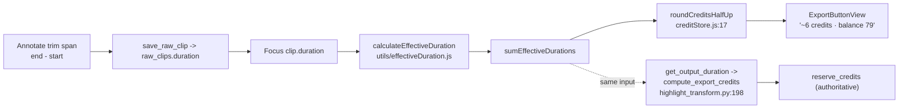

# T9480 Design: One time-format rule, exact trim entry, and honest billable duration

**Status:** APPROVED 2026-09-12 - full scope, including Stage D3 (shared VideoControls default)
and D4 (falsy-guard removal). Next: Test First, then implementation per the staged plan.
**Created:** 2026-09-12
**Task file:** `docs/plans/tasks/T9480-one-time-format-exact-trim-and-billing-precision.md`
**Tier:** L (7+ files, 2 layers touched for verification, new shared abstraction, design-gated)

---

## 0. What changed since the task file was written

The task file says the rounding copy must wait for **T9680**. T9680 is now STAGING, and
**T9750 (PR #420, already merged)** superseded the rule T9680 first recorded:

> **The CURRENT render/export billing rule is ROUND-HALF-UP with a 1-credit floor, NOT ceil.**
> `round_credits_half_up(s) = 0 if s <= 0 else max(1, floor(s + 0.5))`
> — `src/backend/app/highlight_transform.py:176`
> Frontend mirror: `roundCreditsHalfUp` — `src/frontend/src/stores/creditStore.js:17`

Consequence for the walkthrough's own repro: **6.027 s bills 6 credits, not 7.** The seventh
credit the parent was charged was the OLD ceil rule and is already fixed on master. This design
must therefore *never* ship the task file's suggested copy "rounded up to the next whole second";
the shipped wording is T9750's **"1 credit per second, rounded to the nearest second."**

Also stale and fixed in this task: `.claude/knowledge/keyframes-framing.md:134` still documents
`getRequiredCredits` as `Math.ceil`.

---

## 1. Current State Analysis

### 1.1 The reported symptom, mechanically explained

One number, `startTime = 2.973`, rendered three ways:

| Screen | String | Producer | Mode |
|--------|--------|----------|------|
| Sidebar row / Overlay | `0'02"` | `formatGameClock` — `utils/timeFormat.js:79` | **floor** to whole second |
| Trim details | `00:03.0` | local `formatTime` — `ClipScrubRegion.jsx:15` (`secs.toFixed(1)`) | **round** to tenth |
| Span readout | `6.0` | inline `clipDuration.toFixed(1)` — `ClipScrubRegion.jsx:541,556` | **round** to tenth |

So the disagreement is two independent axes, both undocumented: **precision** (second vs tenth)
and **rounding mode** (floor vs round). Nothing in the codebase states which is correct for which
kind of quantity.

### 1.2 Enumeration of every seconds-to-string implementation

The task file estimated "~8". The actual count of **named** `seconds -> string` functions is
**19**, in **13 files**, plus **6 inline** formatting expressions. (Two additional `formatTime`-named
functions — `UserDetailPanel.jsx:59` and `footageDisplay.js:26` — format a **Date/ISO string**, not
seconds, and are out of scope except for a rename so the family grep comes back clean.)

**Shared module `src/frontend/src/utils/timeFormat.js`**

| # | Symbol | Line | Output | Mode | Guard | Consumers |
|---|--------|------|--------|------|-------|-----------|
| 1 | `formatTime` | 10 | `HH:MM:SS.mmm` | floor | NaN/<0 -> `00:00:00.000` | `Controls.jsx:120`, `AnnotateControls.jsx:200` |
| 2 | `formatTimeSimple` | 33 | `M:SS.mmm` (no hours) | floor | NaN/<0 -> `0:00.000` | `TimelineBase.jsx:391`; **dead import** in `useAnnotate.js:2` |
| 3 | `formatTimeCompact` | 47 | `125.3` (bare seconds) | **round** (`toFixed(1)`) | NaN/<0 -> `0.0` | `VideoControls.jsx:51,126` (the shared player's DEFAULT time display) |
| 4 | `formatClock` | 56 | `M:SS` / `H:MM:SS` | floor | NaN/<0 -> `0:00` | `AnnotateContainer.jsx:1144,1156`, `TutorialVideoModal.jsx:408` |
| 5 | `formatGameClock` | 79 | `MM'SS"` | floor | null/NaN/<0 -> `null` | `DraftTile:348`, `CollectionPlayer:299,375,377`, `PublishedReelsPanel:706`, `RecapPlayerModal:610`, `RecapClipsSidebar:31` |
| 6 | `clipGameClock` | 103 | via #5 | floor | null | `ClipsSidePanel:314`, `AnnotateModeView:164`, `OverlayScreen:173` |

**Second shared module `src/frontend/src/components/shared/clipConstants.js`**

| # | Symbol | Line | Output | Mode | Guard | Consumers |
|---|--------|------|--------|------|-------|-----------|
| 7 | `formatDuration` | 108 | `12.5s` | **round** (`toFixed(1)`) | `!seconds` -> `0.0s` (falsy swallows 0) | `ClipSelectorSidebar:297,450` |
| 8 | `formatTimeSimple` | 118 | `M:SS` | floor | `!seconds` -> `0:00` | `OverlayModeView:793,874`, `PosterMarkerLayer:374`, `FocusModeView:38,384`, `TextManagementPanel:170`, `ThumbnailPanel:34` |

> **#8 is a name collision with #2** — same exported name, different file, different output
> (`M:SS` vs `M:SS.mmm`). Which one a component gets depends purely on its import line. This is the
> single worst smell in the set.

**Third shared module `src/frontend/src/components/collections/format.js`**

| # | Symbol | Line | Output | Mode | Guard | Consumers |
|---|--------|------|--------|------|-------|-----------|
| 9 | `formatDuration` | 4 | `M:SS` / `H:MM:SS` | **round** (`Math.round`) | null/NaN -> `null` | `DurationBudgetSlider:32` |
| 10 | `formatDurationHuman` | 19 | `1m 30s` | round | null | `CollectionHeader:93`, `LockedReasonModal:114,115,144,145`, `LockedCollectionCard:57`, `UnlockProgress:26`, `ConfidenceBanner:102,109`, `PublishedReelsPanel:705` |

**Per-component private copies (the duplication the task named)**

| # | Symbol | File:line | Output | Mode | Notes |
|---|--------|-----------|--------|------|-------|
| 11 | `formatTime` | `modes/annotate/components/ClipScrubRegion.jsx:15` | `MM:SS.s` | **round** | **Also a real bug:** `59.97` -> `mins=0`, `secs.toFixed(1)="60.0"` -> `"00:60.0"` |
| 12 | `formatTime` | `modes/annotate/components/ClipListItem.jsx:62` | `M:SS` / `H:MM:SS` | floor | — |
| 13 | `formatTime` | `modes/annotate/layers/ClipRegionLayer.jsx:49` | `M:SS` / `H:MM:SS` | floor | Byte-identical copy of #12 |
| 14 | `formatDuration` | `components/ClipLibraryModal.jsx:13` | `M:SS` | floor | `!seconds \|\| <=0` -> `0:00` |
| 15 | `formatDuration` | `components/GameClipSelectorModal.jsx:164` | `M:SS` | floor | **No hours case** — a >1h total reads `63:20` |
| 16 | `formatDuration` | `hooks/useDownloads.js:340` | `M:SS` / `H:MM:SS` | **round** | A `useCallback` **inside a hook**, re-exported at `:584` |
| 17 | `fmtTimestamp` | `components/ShareGameModal.jsx:26` | `M:SS` | floor | clamps `max(0, ...)` |
| 18 | `formatSecondsForTsv` | `modes/annotate/hooks/useAnnotate.js:54` | `M:SS` | floor | **Wire format**, must round-trip with the TSV importer |
| 19 | `formatTimestampForName` | `modes/annotate/hooks/useAnnotate.js:230` | `HH:MM:SS` | floor | **Name generator**, frozen into persisted clip names |

**Inline (unnamed) formatting**

| Site | Expression | Mode |
|------|-----------|------|
| `ClipScrubRegion.jsx:541,556` | `` `${clipDuration.toFixed(1)}s` `` | round |
| `ClipScrubRegion.jsx:603` | `` `${Math.floor(t/60)}:${String(Math.floor(t%60)).padStart(2,'0')}` `` | floor |
| `AnnotateControls.jsx:194` | `` `${elapsed.toFixed(1)}s / ${clipLength.toFixed(1)}s` `` | round |
| `modes/overlay/layers/HighlightLayer.jsx:259` | `` `${highlightDuration.toFixed(1)}s` `` | round |
| `modes/focus/layers/SegmentLayer.jsx:150` | `` `${d.toFixed(1)}s -> ${d.toFixed(1)}s` `` | round |
| `utils/videoMetadata.js:413` | `` `${Math.floor(d/60)}:${(d%60).toFixed(2)}` `` | round |

### 1.3 Architecture of the display problem

```mermaid
flowchart TD
    T["one number: startTime = 2.973"]
    T --> A["formatGameClock #5<br/>floor -> 0'02\""]
    T --> B["ClipScrubRegion.formatTime #11<br/>round -> 00:03.0"]
    T --> C["clipConstants.formatTimeSimple #8<br/>floor -> 0:02"]
    T --> D["timeFormat.formatTimeSimple #2<br/>floor -> 0:02.973"]
    T --> E["formatTimeCompact #3<br/>round -> 3.0"]
    A --> S[Sidebar / Overlay]
    B --> S2[Trim details]
    C --> S3[Focus / Overlay chips]
    D --> S4[Timeline hover]
    E --> S5[Shared player]
```

### 1.4 The billing side (already correct, needs only disclosure)



FE and BE rounding **already agree exactly** (T9750 pinned both, `creditStore.test.js:42`,
`test_t9750_round_credits.py`). The gap is purely that **nothing on screen states the rule or the
exact duration it was applied to**, so the parent cannot derive the charge.

### 1.5 Code smells identified

| Smell (Fowler) | Location | Impact |
|---|---|---|
| Duplicated Code | #11-#17: 7 private copies of a M:SS-family formatter | Each drifts independently; that drift IS the reported bug |
| Shotgun Surgery | A rounding-rule change today needs 19 edits | Guarantees the next rule change re-introduces the inconsistency |
| Divergent Change / name collision | `formatTimeSimple` exists twice (#2, #8) with different output | Behavior depends on the import line; invisible in review |
| Primitive Obsession | Seconds are passed around with no notion of *instant* vs *length* | The floor-vs-round choice is made ad hoc at every call site |
| Special Case (silent fallback) | `!seconds -> '0.0s'` (#7), `!seconds -> '0:00'` (#8, #14) | Violates CLAUDE.md "no silent fallbacks for internal data" — `0` and `undefined` render identically |
| Long Method / inline logic | `ClipScrubRegion` pointermove inlines the clamp twice (start branch, end branch) | Entry UI would need a third copy |
| Hidden bug | #11: `59.97 -> "00:60.0"` | Ships a nonexistent clock reading |
| Misplaced responsibility | #16 is a formatter living inside a React hook | Cannot be used or tested outside the hook |
| Stale documentation | `keyframes-framing.md:134` says `Math.ceil` | Contradicts shipped code (T9750) |

### 1.6 Current behavior (pseudo)

```pseudo
render a time somewhere:
    whichever formatter this file happens to import or define locally
        -> a precision nobody chose
        -> a rounding mode nobody documented
quote a cost:
    show roundCreditsHalfUp(seconds)          // correct number
    show NOTHING about the rule or the seconds it came from   // <-- the AC3 gap
enter an exact trim point:
    impossible — drag handles only              // <-- the AC2 gap
push a trim past a boundary:
    silently clamped inside the drag handler, twice, to the VISIBLE WINDOW
    (not the media), with no message                          // <-- the AC4 gap
```

---

## 2. Target Architecture

### 2.1 The ONE documented rule

> **A time value is either an INSTANT (a position on a timeline) or a LENGTH (a span).**
> **Instants FLOOR at the shown precision. Lengths ROUND HALF-UP at the shown precision.**
> **Round-half-up is the same rule credits use, so a length shown to the whole second IS the
> billable second count.**

Why this split rather than "round everything":

- A clock that reads `0'03"` at t=2.973 would be lying about a moment that has not happened yet.
  Flooring an instant is what every clock does, it is what `formatGameClock` already does, and it
  is already pinned by `timeFormat.test.js:33` ("floors fractional seconds"). Changing it would
  break Annotate/Overlay/recap/collection game marks for no user benefit.
- A *length*, however, must match the charge. Round-half-up makes the whole-second length display
  **identical by construction** to `roundCreditsHalfUp`, which is the entire point of AC3/AC4.

Applied to the reported case (`start 2.973`, `end 9.000`, span `6.027`):

| Surface | Kind | Precision | Before | After |
|---|---|---|---|---|
| Sidebar / Overlay game mark | instant | second | `0'02"` | `0'02"` (unchanged) |
| Trim detail start | instant | tenth | `00:03.0` | **`0:02.9`** |
| Trim detail end | instant | tenth | `00:09.0` | `0:09.0` |
| Span readout | length | tenth | `6.0` | `6.0s` (unchanged) |
| Billable | length | second | *(not shown)* | **`6 credits`** |

Every number on screen is now the same underlying value presented at a stated precision under a
stated mode, and the whole-second length equals the charge.

### 2.2 Canonical module

Extend the **existing** `src/frontend/src/utils/timeFormat.js` (leverage existing systems; do not
create a fourth "time" module). New names deliberately do not collide with any of the 19, so a
post-migration grep for `formatDuration|formatTimeSimple|formatTimeCompact|formatClock` returning
**zero** outside this module is a mechanical acceptance check.

```js
// utils/timeFormat.js  — THE one time-format rule (T9480)

export const PRECISION = { SECOND: 0, TENTH: 1, MILLI: 3 };

/** Round-half-up at `decimals` places. The ONE rounding mode for lengths;
 *  matches backend round_credits_half_up's floor(x + 0.5) idiom exactly. */
export function roundHalfUp(value, decimals = 0)

/** An INSTANT (position). FLOORS at `precision`. Never emits ":60".
 *  hours: 'auto' (default) | 'always' | 'never'.
 *  Non-finite/negative input -> throws in dev, returns '0:00' in prod?  NO:
 *  returns null and console.warns — callers decide (no silent fallback). */
export function formatInstant(seconds, precision = PRECISION.SECOND, opts)

/** A LENGTH (span). ROUNDS HALF-UP at `precision`.
 *  style: 'unit' (default, "6.0s") | 'clock' ("0:06") | 'human' ("1m 30s"). */
export function formatLength(seconds, precision = PRECISION.TENTH, opts)

/** Inverse of formatInstant. Accepts "H:MM:SS.s" | "M:SS.s" | "SS.s" | "SS".
 *  Returns a Number, or null when unparseable — NEVER 0. (No silent fallback.) */
export function parseTimeInput(text)

/** Quantize to the app's UI step grid. See §2.5 on fps honesty. */
export const UI_STEP_FPS = 30
export function snapToStep(seconds)

// UNCHANGED, re-documented as instants: formatGameClock, clipGameClock, compareGameTime
// UNCHANGED, unrelated: pixelToTime, timeToPixel, seekToFrame
```

**Null/NaN policy (CLAUDE.md "no silent fallbacks for internal data"):** `formatInstant` /
`formatLength` return `null` and `console.warn` for non-finite input. Call sites that legitimately
have "no value yet" already handle `null` (`formatGameClock` has done this since T3920 and
`collections/format.js` since its inception). The five falsy-guard sites (#7, #8, #14) that
currently turn `undefined` into a plausible-looking `0:00` lose that lie; each becomes an explicit
`value == null ? <placeholder> : formatX(value)` at the call site. **This is a behavior change and
gets its own commit + tests**, not a mechanical move.

**Billing parity is asserted, not assumed.** `roundCreditsHalfUp` stays exactly where T9750 put it
(`creditStore.js` — shipped billing code is not moved by this task). A new test pins the bridge:

```js
// for every s >= 0.5:  Number(formatLength(s, PRECISION.SECOND, {style:'plain'})) === roundCreditsHalfUp(s)
// documented divergence: 0 < s < 0.5 -> display "0s", charge 1 credit (the 1-credit floor)
```

### 2.3 Target data flow

```mermaid
flowchart TD
    SRC["seconds (one value)"]
    SRC --> K{"instant or length?"}
    K -->|instant| FI["formatInstant(s, precision)<br/>FLOOR"]
    K -->|length| FL["formatLength(s, precision)<br/>ROUND-HALF-UP"]
    FI --> GC["formatGameClock / clipGameClock<br/>(MM'SS\" notation of an instant)"]
    FI --> UI1["trim fields · timeline hover · player readouts · row times"]
    FL --> UI2["span readouts · budget sliders · library durations"]
    FL --> BILL["whole-second length == roundCreditsHalfUp(s) == backend charge"]
    BILL --> DISC["disclosure line"]
```

### 2.4 Exact trim entry (AC2)

**New component** `src/frontend/src/modes/annotate/components/TrimTimeField.jsx` — one controlled
boundary field. Rendered twice by `ClipScrubRegion` (start, end).

At rest it renders **exactly the string it renders today** (`formatInstant(value, TENTH)`), so the
resting DOM is visually unchanged in every one of the three layouts. It becomes an input on
click/Enter/focus.

```pseudo
TrimTimeField({ value, edge, otherValue, mediaBounds, onCommit, onSeek, compact })

  rest:       <button class="font-mono">{formatInstant(value, TENTH)}</button>
  editing:    <input inputMode="decimal" value={draft} />

  Enter | blur  -> commit(draft)
  Escape        -> discard draft, restore value, NO write
  ArrowUp/Down  -> step(±1 frame);  Shift+Arrow -> step(±1 second)

  commit(text):
      t = parseTimeInput(text)
      if t == null:  show "Use M:SS.s (e.g. 2:09.5)"; keep editing; NO write
      t = snapToStep(t)                                  // one grid, drag + entry + steps
      r = clampTrim({ start, end, edge, media: mediaBounds })
      if r.rejected: show r.message; restore value; NO write
      if r.clamped:  show r.message (the value DID move — say so, never silently)
      onCommit(r.value)      // the SAME onStartTimeChange/onEndTimeChange the drag calls
      onSeek(r.value)        // AC2: "the final preview matches the released value"
```

**Layout**

- Full editor (`compact === false`, `ClipScrubRegion.jsx:549-576`): the existing time row becomes
  `[◀][start field][▶]  →  [◀][end field][▶]` on the left; the right keeps the span readout
  (now `formatLength(span, TENTH)`) and the existing preview button.
- `compact === true` (sidebar + landscape strip, `:477-482`): the two readouts become click-to-edit
  **in place** — no step buttons, no new rows, no added footprint. Keyboard stepping still works
  once a field is focused.
- Step buttons carry `coarse-pointer:min-h-[44px]` (T7350 touch floor) and
  `title="Step one frame (1/30 s)"`.

**Keyboard safety:** `AnnotateScreen`'s keydown handler already disables arrow-key seek and the
1-5 rating shortcuts while `showAnnotateOverlay` is true (T8960), so a focused field's Arrow keys
cannot double-fire. Digits typed into the field must not reach the rating shortcut — the handler
already returns early for the overlay, and the field additionally `stopPropagation`s.

**UI-design consult: NOT required.** A numeric/timecode field with frame-step chevrons is a
conventional pattern, the resting appearance is byte-identical to today's readouts, and the only
genuinely constrained layout (`compact`) takes *zero* additional space under the click-to-edit
approach. The compact crowding risk is listed in §5 with a concrete fallback.

### 2.5 Frame stepping and fps honesty

`getFramerate()` (`utils/videoUtils.js:81`) **returns a hardcoded 30 with a comment saying real
detection is unimplemented**, and `useMultiVideoScrub.js:160,170` hardcodes `const fps = 30`. Per
"no silent fallbacks for internal data", this design does **not** pretend to know the source fps.
Instead it names what the number actually is:

```js
/** UI_STEP_FPS is a chosen UI STEP GRANULARITY, not a measured source frame rate.
 *  (We do not detect fps — videoUtils.getFramerate is a hardcoded 30.) It is the
 *  grid that drag, typed entry and the step buttons all snap to, so all three
 *  produce values from the SAME set. Handy property: at 30 the 0.1 s entry
 *  precision is exactly 3 steps, so a typed tenth lands exactly on the grid. */
export const UI_STEP_FPS = 30;
```

The step control is labelled by the amount it moves (`1/30 s`), never "one frame of your video",
so the UI makes no claim we cannot back. `useMultiVideoScrub`'s two hardcoded 30s import this
constant (mechanical, identical behavior) so there is one grid in Annotate.

### 2.6 Bounds enforcement (AC4)

**New pure module** `src/frontend/src/modes/annotate/trimBounds.js`:

```js
export const MIN_REGION_DURATION = 0.5;   // MOVED from ClipScrubRegion.jsx:6 (one owner)

/** The ONE trim-bounds policy. Drag, typed entry and step buttons all route here.
 *  Returns { value, rejected, clamped, message }. Never swaps start/end. */
export function clampTrim({ start, end, edge, mediaStart = 0, mediaEnd })
```

Rules (each with a user-visible message when it bites, never a silent substitution):

| Condition | Result | Message |
|---|---|---|
| `edge==='start'` and `value > end - MIN` | clamp to `end - MIN` | "Start must stay at least 0.5s before the end." |
| `edge==='end'` and `value < start + MIN` | clamp to `start + MIN` | "End must stay at least 0.5s after the start." |
| `value < mediaStart` | clamp to `mediaStart` | "That is before the start of the video." |
| `value > mediaEnd` | clamp to `mediaEnd` | "That is past the end of the video." |
| resulting span `<= 0` | **rejected**, no write | (covered by the two MIN rules; the `<=0` case is structurally unreachable once MIN holds, and is asserted as such) |

**This unifies three code paths into one.** Today the drag handler inlines the clamp twice
(`ClipScrubRegion.jsx:261-280`) and clamps to `windowStart`/`windowEnd` — the **visible ±30 s
window**, which is a *view* concern, not a media bound. That is precisely why a parent "fights the
drag handle": the handle cannot reach a boundary the window does not show. Target:

```pseudo
drag:   clampTrim(...)  then  clampToVisibleWindow(...)   // view constraint, drag only
entry:  clampTrim(...)                                     // reaches the true media bounds
steps:  clampTrim(...)
```

`clampToVisibleWindow` is named and separate, so the "why" of each constraint is greppable.

**Angle sources:** when an angle is active, the true media bound is the angle's own span, which
`buildGameTimeline().clampToSource` already owns (T8890, EPIC decision 10: a clip is cut from ONE
source). `clampTrim` receives `mediaEnd` from the caller; `ClipScrubRegion`'s caller passes the
angle-clamped bound when `activeSourceSequence` is set. No second source-clamping implementation.

### 2.7 Billable-duration disclosure (AC3)

**Copy is single-sourced.** `config/displayNames.js` gains a `CREDITS` block; `BuyCreditsModal.jsx`'s
three existing literals (`:114`, `:118`, `:457`) are refactored to read from it, so the new surface
**cannot** drift from the shipped T9750 wording.

```js
export const CREDITS = {
  // T9750 rule, verbatim from BuyCreditsModal's shipped copy. Round-HALF-UP, NOT ceil.
  PER_SECOND_RULE: '1 credit per second, rounded to the nearest second',
  MIN_CHARGE: 'Any render costs at least 1 credit.',
  billableLine: (exactSeconds, credits) =>
    `${formatLength(exactSeconds, PRECISION.TENTH)} of video · ${credits} credit${credits === 1 ? '' : 's'} · ${CREDITS.PER_SECOND_RULE}.`,
};
```

Surfaces:

| Surface | Today | Target |
|---|---|---|
| `ExportButtonView.jsx:197-210` (Focus estimate) | `~6 credits · balance 79` | unchanged first line; a second muted line `6.0s of video · 6 credits · 1 credit per second, rounded to the nearest second.` rendered **only when `formatLength(s, SECOND) !== formatLength(s, TENTH)`**, i.e. only when rounding actually changed the number |
| `BuyCreditsModal.jsx:466-467` | `{required} credits ({required}s of video)` — conflates billable with actual | `{required} credits for {formatLength(videoSeconds, TENTH)} of video` + the rule line. `insufficientCredits.videoSeconds` is already passed in |
| `BuyCreditsModal` `CreditsExplainer:118` | rule bullet | + `CREDITS.MIN_CHARGE` bullet (the sub-1s floor, currently undisclosed) |
| Annotate play editor span readout | `6.0s` | `6.0s`, `data-testid="clip-length"`. **No credit language** — Annotate charges nothing; inventing a cost here would be a new lie |

**The disclosed integer is never re-derived.** It renders `estimatedCredits` (already
`estimateExportCredits(clips)` -> `getRequiredCredits` -> `roundCreditsHalfUp`), so there is
structurally one number on the screen and it is the one the backend will charge.

### 2.8 Target behavior (pseudo)

```pseudo
render a time:
    formatInstant(s, precision)   // it is a position -> FLOOR
  or
    formatLength(s, precision)    // it is a span     -> ROUND-HALF-UP  == the billing rule

quote a cost:
    credits = getRequiredCredits(exactSeconds)      // one number, already authoritative
    show credits
    if rounding changed the number:
        show CREDITS.billableLine(exactSeconds, credits)

set a trim point:
    drag | type | step   ->  snapToStep -> clampTrim -> onStart/EndTimeChange -> onSeek
                             (one grid,   one policy,  one write path,          one preview)
```

### 2.9 Design principles applied

- [x] **DRY** — 19 named + 6 inline implementations collapse to 2 formatters + 1 parser + 1 rounder.
- [x] **Single code path** — one write path for a trim boundary (drag, entry and steps all call
      `snapToStep -> clampTrim -> onXTimeChange -> onSeek`); one number for the cost.
- [x] **Minimal branches** — the instant/length choice is made **once per call site** by picking a
      function name, not by an `if` inside a formatter; `clampTrim` replaces two inline clamp branches.
- [x] **Greppability** — new names collide with nothing; post-migration grep for the old names
      returns zero outside the module (a checkable acceptance criterion).
- [x] **No silent fallbacks** — `parseTimeInput` returns `null`, never `0`; formatters warn on
      non-finite input; a clamp that moves a typed value says so.
- [x] **Gesture-based persistence unchanged** — trim edits stay local `useState` in
      `AnnotateFullscreenOverlay` until the existing Save gesture. **No new persistence path, no
      `useEffect` that writes.**
- [x] **MVC** — `TrimTimeField` is presentational (props in, callbacks out); bounds policy is a pure
      module; `ClipScrubRegion` keeps ownership of the seek/drag wiring.

---

## 3. Refactoring Plan

Commits are ordered so that **every mechanical-move commit produces byte-identical rendered output**
and every behavior change is isolated, per CLAUDE.md refactoring rules 2-4. Target < ~200 lines of
meaningful diff per commit.

### Stage A — characterization first (rule 2)

| # | Commit | Type | Files |
|---|---|---|---|
| A1 | `T9480: Characterize every current time formatter before consolidating` | test-only | NEW `src/utils/timeFormat.characterization.test.js` — a table asserting the **current** output of all 19 named formatters + the 6 inline expressions at a fixed input set (`0, 0.4, 0.5, 2.973, 6.027, 59.97, 60, 3599.9, 3600, NaN, null, -1`). Includes the `"00:60.0"` bug as a *documented current* output so the fix commit visibly flips it. |

### Stage B — build the canonical module (additive, zero call sites touched)

| # | Commit | Type | Files |
|---|---|---|---|
| B1 | `T9480: Add the one time-format rule (formatInstant / formatLength / parseTimeInput)` | **behavior: additive only** | `utils/timeFormat.js` (+~120 lines), `utils/timeFormat.test.js` (+the rule as executable spec) |
| B2 | `T9480: Pin the billing parity between formatLength(SECOND) and roundCreditsHalfUp` | test-only | NEW `utils/timeFormat.billingParity.test.js` |

### Stage C — mechanical moves (byte-identical output; NO behavior change)

Each row deletes a private copy and imports the canonical equivalent. Grouped into 3 commits to stay
reviewable; the characterization suite from A1 is the proof of identity.

| # | Commit | Sites replaced |
|---|---|---|
| C1 | `T9480: Move Annotate time formatters to the shared module (no output change)` | #12 `ClipListItem:62`, #13 `ClipRegionLayer:49` -> `formatInstant(s, SECOND)`; `ClipScrubRegion:603` tick, `ClipScrubRegion:541,556` span -> `formatLength(s, TENTH)`; `useMultiVideoScrub:160,170` -> `UI_STEP_FPS` |
| C2 | `T9480: Move library/share/collections duration formatters to the shared module` | #14 `ClipLibraryModal:13`, #17 `ShareGameModal:26` -> `formatInstant(s, SECOND)`; #9 `collections/format.formatDuration`, #10 `formatDurationHuman`, #16 `useDownloads:340` -> `formatLength(...)` (`Math.round` on positives == round-half-up; characterization proves it). `collections/format.js` becomes a 2-line re-export shim **deleted in the same commit** by updating its 9 importers |
| C3 | `T9480: Collapse the duplicate formatTimeSimple/formatDuration in clipConstants` | #7, #8 deleted from `clipConstants.js`; the 8 importers (`OverlayModeView`, `PosterMarkerLayer`, `FocusModeView`, `TextManagementPanel`, `ThumbnailPanel`, `ClipSelectorSidebar`) switch to `formatInstant`/`formatLength`. **Resolves the #2/#8 name collision.** Also: delete the dead `formatTimeSimple` import at `useAnnotate.js:2`; rename `UserDetailPanel.formatTime` -> `formatIsoTimestamp` (it takes a string, not seconds) |

After C3: `grep -rn "formatDuration\|formatTimeSimple\|formatTimeCompact\|formatClock\b" src/frontend/src`
returns **zero hits outside `utils/timeFormat.js`** (excluding tests). This is checked in CI-visible form
by the acceptance criteria, not by a lint rule.

### Stage D — the behavior changes (each isolated, each with a red-green test)

| # | Commit | Change | Risk |
|---|---|---|---|
| D1 | `T9480: Trim details floor to the shown precision (2.973 reads 0:02.9, not 00:03.0)` | #11 `ClipScrubRegion.formatTime` deleted -> `formatInstant(s, TENTH)`. **Fixes the reported bug and the `"00:60.0"` overflow.** | Low; 6 render sites in one file |
| D2 | `T9480: One rule in the transport readouts` | `AnnotateControls:194` elapsed -> `formatInstant(TENTH)` (instant), clipLength -> `formatLength(TENTH)`; `#2 formatTimeSimple` consumers gain the hours case (`TimelineBase` hover past 1h now reads `1:35:03.123`, not `95:03.123`); `#15 GameClipSelectorModal` gains the hours case | Low-med: visible strings change past 1h |
| D3 | `T9480: Shared player shows clock time, not bare seconds` | #3 `formatTimeCompact` (`"125.3"`) -> `formatInstant(s, TENTH)` (`"2:05.3"`) as `VideoControls`' default | **Med — shared published-reel player.** `TutorialVideoModal` already overrides with `formatClock`, so blast radius is the collection/story player. Own commit + e2e |
| D4 | `T9480: Remove the falsy time guards that render undefined as 0:00` | #7/#8/#14's `!seconds` guards replaced by explicit `value == null ? placeholder : ...` at each call site | Low, but touches 8 call sites; each needs a chosen placeholder |
| D5 | `T9480: Inline duration expressions use formatLength` | `HighlightLayer:259`, `SegmentLayer:150`, `videoMetadata:413` (or delete `durationFormatted` if unconsumed — grep first) | Low |

### Stage E — the feature work

| # | Commit | Change |
|---|---|---|
| E1 | `T9480: Extract the one trim-bounds policy (drag + future entry share it)` | NEW `modes/annotate/trimBounds.js` (`MIN_REGION_DURATION` moved here, `clampTrim`); `ClipScrubRegion`'s two inline drag clamps call it; `clampToVisibleWindow` named and applied to the drag path only. **Behavior-preserving for drag** (asserted by the existing `ClipScrubRegion.test.jsx` + a new bounds test) |
| E2 | `T9480: Exact start/end entry with frame stepping in the play editor` | NEW `TrimTimeField.jsx`; `ClipScrubRegion` renders two, full layout gets the step buttons, compact gets click-to-edit in place. Uses `parseTimeInput` + `snapToStep` + `clampTrim` + the existing `onStartTimeChange`/`onEndTimeChange`/`onSeek` |
| E3 | `T9480: Single-source the credit rule copy` | `config/displayNames.js` `CREDITS` block; `BuyCreditsModal` :114/:118/:457 refactored to it (**mechanical, byte-identical strings**) |
| E4 | `T9480: Disclose billable duration wherever a cost is quoted` | `ExportButtonView` second line (only when rounding changed the number); `BuyCreditsModal:466-467` shows actual seconds + rule; `CreditsExplainer` gains the 1-credit-floor bullet; Annotate span readout gets `data-testid="clip-length"` |

### Stage F — docs

| # | Commit | Change |
|---|---|---|
| F1 | `T9480: Update knowledge docs` | `keyframes-framing.md:134` `Math.ceil` -> round-half-up (**stale since T9750**); `:122` formatter reference updated; `annotate.md` gains the T9480 entry (the rule, `TrimTimeField`, `trimBounds.js`, the fact that the game clock deliberately still floors) |

### Pseudo-code diff summary

```pseudo
// NEW canonical rule (utils/timeFormat.js)
+ formatInstant(s, precision)   // FLOOR   — positions
+ formatLength(s, precision)    // ROUND   — spans, == the credit rule
+ parseTimeInput(text)          // null on garbage, never 0
+ snapToStep(s), UI_STEP_FPS    // one grid for drag/entry/steps

// 19 named + 6 inline implementations
- 7 private per-component copies
- 2 duplicate shared modules (clipConstants, collections/format)
- formatTimeSimple name collision
+ import { formatInstant, formatLength } from '.../utils/timeFormat'

// Trim boundary: three paths become one
- drag: inline clamp (start branch) + inline clamp (end branch) to the VISIBLE WINDOW
+ clampTrim({start,end,edge,mediaEnd})   // shared by drag, typed entry, step buttons
+ clampToVisibleWindow(...)              // drag only, named as the view concern it is

// Cost
  credits = getRequiredCredits(exactSeconds)     // unchanged, authoritative
+ if (rounding changed it) show CREDITS.billableLine(exactSeconds, credits)
```

---

## 4. Design Decisions

| Decision | Options considered | Choice | Rationale |
|---|---|---|---|
| One rounding mode, or two? | (a) round everything (b) floor everything (c) **floor instants, round lengths** | **(c)** | (a) makes a clock read a moment that has not happened and breaks `formatGameClock`'s pinned test; (b) makes the whole-second length display disagree with the charge, which is the thing AC3/AC4 exist to fix. (c) is the only option where the displayed billable length *is* the charge by construction |
| Where does the canonical module live? | new `utils/duration.js` / `components/shared/` / **extend `utils/timeFormat.js`** | **extend `utils/timeFormat.js`** | It is already the shared module and already holds `formatGameClock`; a fourth time module would be a 4th thing to grep |
| New names vs reusing `formatDuration` | reuse / **new distinct names** | **`formatInstant` / `formatLength`** | Reusing a name that exists 4x makes the migration ungreppable mid-flight; distinct names make "zero hits for the old names" a checkable end state |
| Move `roundCreditsHalfUp` into the format module? | move / **leave in `creditStore.js` + parity test** | **leave it** | Shipped billing code (T9750, 3 days old) should not be moved by a formatting task. A cross-module parity test gives the same guarantee with none of the risk |
| Entry input format | two numeric spinners (min, sec) / masked `MM:SS.s` / **free text parsed by `parseTimeInput`, accepting `M:SS.s` or bare seconds** | **free text + parser** | Parents type `2:09.5` or `129.5`; both work. A mask fights mobile keyboards. Invalid input is rejected loudly, never coerced |
| Frame-step size source | detect real fps / **named `UI_STEP_FPS = 30` step granularity** | **named constant** | `getFramerate()` is a hardcoded 30 with a comment admitting it. Claiming "one frame of your video" would be a fallback masquerading as data. Labelling the control `1/30 s` is honest and still gives the deliberate fine control AC2 asks for |
| Entry affordance in `compact` | new row / popover / **click-to-edit in place** | **click-to-edit in place** | Zero added footprint in the sidebar and landscape-compact layouts, which are already dense (T8960/T9630) |
| Does Annotate quote credits? | yes / **no** | **no** | Annotate charges nothing; a cost there would be a new fiction. It shows the exact span, which is the number that carries into the charge |
| Where to disclose the rule | always / **only when rounding changed the number** | **conditional** | AC3 is literally "when rounding changes the cost". Always-on adds noise to the common `6.0s -> 6` case |
| Disclosure wording | new copy / **reuse T9750's shipped string** | **reuse, via `displayNames.CREDITS`** | Prevents the exact drift this task is about; matches `BuyCreditsModal.jsx:114/:457` verbatim |
| Migration shape | one big commit / **characterize -> move -> change** | **staged** | CLAUDE.md refactoring rules 2-4; the characterization suite is what makes "mechanical" a provable claim rather than a hope |

---

## 5. Risks

| Risk | Likelihood | Mitigation |
|---|---|---|
| A "mechanical" move silently changes a string | Med | Stage A characterization suite runs **before and after** each C commit; any diff is a review blocker |
| D3 (shared `VideoControls` default) regresses the published-reel player | Med | Isolated commit; real-browser e2e on the collection/story player; `TutorialVideoModal` already overrides so it is unaffected |
| Compact trim layout crowds on a 320px/landscape phone | Med | Click-to-edit adds no footprint; **fallback if QA disagrees:** drop the compact fields back to read-only text and keep exact entry in the full editor only (AC2 is still met) |
| jsdom gives false confidence on the drag/entry interaction | High (T5380 landmine, in memory) | Entry is keyboard/click and safe in jsdom, but the **shared `clampTrim` on the drag path** gets a real-browser e2e; unit tests alone are not accepted as proof |
| Removing falsy guards (D4) surfaces a real `undefined` somewhere as a visible placeholder | Med | That is the *point* (no silent fallbacks) — but each of the 8 call sites picks its placeholder deliberately and is listed in the D4 diff |
| Scope creep: 19 formatters is a big blast radius for one task | High | Stages C/D are sequenced and independently revertable; if review judges D3/D4/D5 out of scope they split into a follow-up without blocking AC1-AC4 (AC1 is satisfied by A+B+C1+C3+D1) |
| Migration-version / branch collision | Low | No schema change in this task |
| Knowledge doc says `Math.ceil` and a reader trusts it | Certain today | F1 fixes it in-task (CLAUDE.md: docs are claims, code is truth) |

---

## 6. Test Plan (curated relevant set, ~11)

| # | Test | Layer | Proves |
|---|---|---|---|
| 1 | `src/utils/timeFormat.characterization.test.js` (NEW, Stage A) | FE unit | The C commits are byte-identical moves |
| 2 | `src/utils/timeFormat.test.js` (extended) | FE unit | **The rule**: instants floor, lengths round-half-up, at each precision; `59.97` never renders `:60`; `parseTimeInput` round-trips and returns `null` on garbage |
| 3 | `src/utils/timeFormat.billingParity.test.js` (NEW) | FE unit | `formatLength(s, SECOND) === roundCreditsHalfUp(s)` for `s >= 0.5`; documents the sub-1s floor divergence. **AC1 + AC3** |
| 4 | `src/modes/annotate/trimBounds.test.js` (NEW) | FE unit | `end <= start` rejected, out-of-media clamped with a message, `MIN_REGION_DURATION` honored, no silent swap. **AC4** |
| 5 | `ClipScrubRegion.trimEntry.test.jsx` (NEW) | FE unit | Type/Enter/Escape/blur, snap-to-grid, step buttons, `onSeek` fires with the committed value. **AC2** |
| 6 | `ClipScrubRegion.test.jsx` (existing) | FE unit | Drag still behaves identically after `clampTrim` extraction |
| 7 | `ExportButtonView.billableDisclosure.test.jsx` (NEW) | FE unit | Line appears only when rounding changed the number; wording === `displayNames.CREDITS`; displayed integer === `estimatedCredits`. **AC3** |
| 8 | `src/containers/ExportButtonContainer.test.js` (existing) | FE unit | `estimateExportCredits` unchanged |
| 9 | `src/components/shared/clipConstants.test.js` (existing) | FE unit | Nothing broke when #7/#8 were removed |
| 10 | `ClipListItem.gameClock.test.jsx` (existing) | FE unit | The game clock **still floors** — proves we did not "fix" an instant into a rounded value |
| 11 | `src/backend/tests/test_t9750_round_credits.py` (existing) | BE | The billing anchor the frontend parity test mirrors, with the **same** value table (`0.3, 0.5, 6.027, 6.49, 6.5, 6.51`) and a cross-reference comment in both files |
| 12 | `e2e/T9480-one-time-format.qa.spec.js` (NEW, real browser) | E2E | Type `2.9` into the start field -> sidebar, Overlay, trim detail and span all read consistently -> Focus export estimate shows `N credits` + the rule -> the number matches the charge. Covers the jsdom-pointer landmine on the shared drag path. **AC1-AC4** |

Test evidence (actual output) is required before completion, per CLAUDE.md.

---

## 7. Open Questions

**None blocking.** Two items were considered and resolved in-design rather than escalated:

1. *Should the whole-second surfaces (sidebar `0'02"`, Overlay mark) start rounding so they match
   the trim detail?* — **No.** Under the instant/length rule they already agree: `0'02"` and
   `0:02.9` are the same value at two precisions, both floored. Rounding the game clock would break
   `formatGameClock`'s existing pinned semantics for no benefit. The reporter's complaint is fully
   resolved by fixing the *trim detail* (which was rounding an instant) instead.
2. *Does the trim entry UI need a ui-designer pass?* — **No.** Resting appearance is byte-identical
   to today's readouts, the pattern (timecode field + frame-step chevrons) is conventional, and the
   only constrained layout takes zero extra space. The crowding risk has a named fallback in §5.

One item for the approver's awareness, not a question: **Stage D3 and D4 have the widest blast
radius** (the shared `VideoControls` player, and 8 falsy-guard call sites). If you would rather keep
this task tight, say so at approval and they split into a follow-up — AC1-AC4 are all satisfied
without them.
