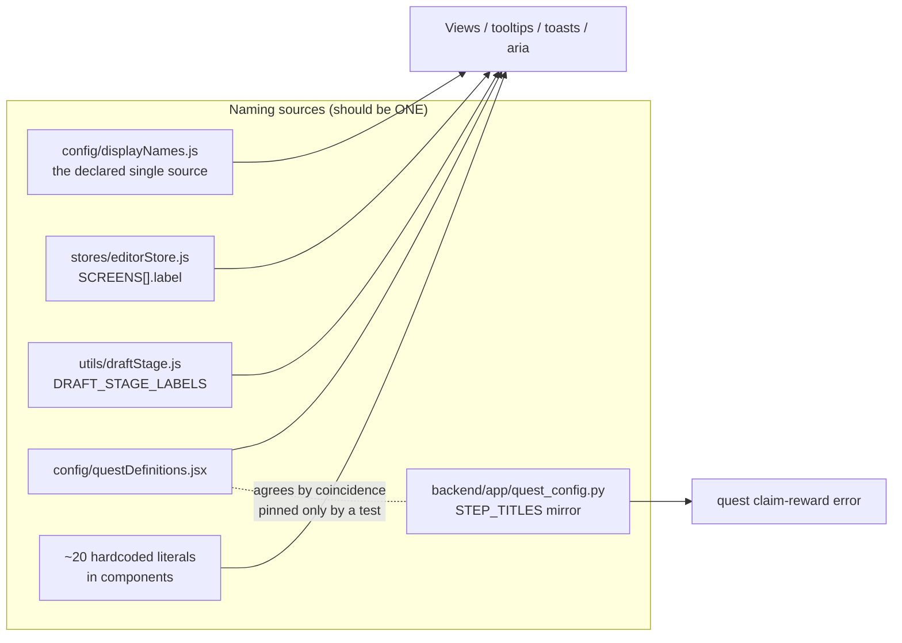
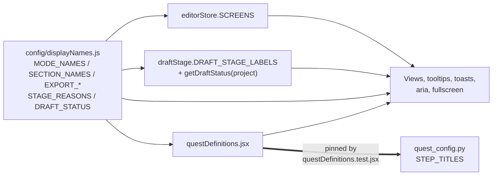

# T9860 Design: Copy and concept sweep, one vocabulary and one reason per screen

**Task file:** [docs/plans/tasks/evaluation-2026-09-13/T9860.md](evaluation-2026-09-13/T9860.md)
**Epic rules:** [docs/plans/tasks/shared-vocabulary/EPIC.md](shared-vocabulary/EPIC.md)
**Status:** APPROVED 2026-09-14 (design gate cleared)
**Written:** 2026-09-14
**Tier:** L (design-gated). ~34 source files + ~30 test/spec files, 2 layers (Frontend + Backend),
no schema change, single-cutover constraint.

> This document is the approval gate. Nothing is implemented until the user approves it.
> Sections 2 and 4 contain **five decisions that diverge from the task file's literal text**,
> each backed by evidence found in the code or in T9670's verified contract. Those are the rows
> that most need a yes or no.

---

## 0. What changed between the task brief and the code

The brief was written 2026-09-13 from an evaluation walkthrough. A verification pass against the
current checkout (2026-09-14) found five places where the brief's premise has moved:

| # | Brief says | Code says | Effect on the plan |
|---|---|---|---|
| A | Spotlight progress says "nothing", add "Finding players" | T9540 already shipped `EXPORT_PROGRESS.FINDING_PLAYERS = 'Finding players for spotlight'` (`displayNames.js:229`), wired at `exportProgressPresentation.js:57` | Not new copy. See **D6**: recommendation is to KEEP the current string, not trim it. |
| B | `"AI" appears in exactly ONE parent-facing place` | Six more parent-facing AI/quality claims exist (invite email, three quest strings, a dead component, a crop tooltip) | Section 3 grows; listed in full in §3.3. |
| C | Status table has a `Shared` state | `draftStage.js:8-13` has four states and no `Shared`; `READY` spans ready-and-published | **D4**: a derivation is added, `draftStage`'s state machine is untouched (criterion holds). |
| D | `Shared / Anyone with the link` is the published caption | T9670 (DONE 2026-09-13) verified that **publishing creates no link and grants no audience**; sharing is a separate second gesture | **D5**: "Shared / anyone with the link" would ship a NEW false claim. Recommend `Published / Only you can see it until you share a link`. Also fixes three existing false toasts. |
| E | `FocusPublishActionBar` already says "Edit framing" | Confirmed (`displayNames.js:254`, rendered `FocusPublishActionBar.jsx:111`) | No change needed there. Brief's claim holds. |

Two additional dead-code findings, both **out of scope** and filed as follow-ups (§5):
`CompareModelsButton.jsx` (unimported, carries a stale quality claim) and `GalleryButton.jsx`
(unimported since T8555 moved the destination into the Published tab; still renders
`SECTION_NAMES.LIBRARY`).

---

## 1. Current State Analysis

### 1.1 How a user-visible string reaches a screen today



The defect class is not one bad word. It is that **six independent naming sources feed one screen**,
so a rename lands in one of them and the other five silently disagree.

### 1.2 Code smells identified

| Smell | Location | Impact |
|---|---|---|
| Declared name contradicts value | `displayNames.js:91` `HIGHLIGHTS: 'Reels'` | Grepping "Reels" misses the constant; grepping `HIGHLIGHTS` finds a thing that never says highlights |
| Dead constant | `displayNames.js:92` `HIGHLIGHTS_LOWER` | Zero consumers |
| Destination that does not exist | `displayNames.js:268` `'Saved to Highlight Reels, under Highlights'` | Names a tab retired by T8555, on a **draft** save that never went to a published destination at all |
| Destination name absent from the UI | `SECTION_NAMES.LIBRARY = 'Highlight Reels'` in 9 copy sites | The tabs read Games / Clips / Reels / Published. "Find it in Highlight Reels" points at no clickable place |
| Quest step names a deleted button | `questDefinitions.jsx:159` + `quest_config.py:155` `Move to Highlight Reels` | T9530 renamed the real control to "Publish clip"/"Publish reel". The guide instructs a click that cannot be made |
| Cross-layer duplicate with no shared constant | `quest_config.py:128,141,155` vs `questDefinitions.jsx:131,149,159` | `quest_config.py:149-154` admits in-comment they agree "by COINCIDENCE", pinned only by `questDefinitions.test.jsx:285` |
| UI string living in a store | `editorStore.js:100` `FRAMING: { label: 'AI Focus' }` | The mode noun, the most-rendered string in the sweep, is the one string not in `displayNames.js` |
| Same derivation improvised three times | `ProjectManager.jsx:1412-1414`, `DraftTile.jsx:511-518`, `DraftTile.jsx:529` | Each re-derives published-vs-ready from `has_final_video` + `is_published`, each picks its own word (`Done` / `Ready to Publish` / an icon) |
| Parallel status vocabulary | `DraftTile.jsx:354-363` one-word chip | Computes `Draft/Done/Uploading/Offline/Exporting/Failed/In Spotlight/AI Focus/Exported` without touching `draftStage.js`. T9670 §6 already flagged this as contradicting T9600's own acceptance criterion |
| Message that names the wrong object | `ModeSwitcher.jsx:94,96` "Select a reel first" | `clipStage.js:6-9`: `autoProjectId` points at the CLIP's own project, not a reel. There is no reel selector on this screen, so it is a dead end |
| Copy contradicting the verified contract | `displayNames.js:253,299`; `OverlayScreen.jsx:1597`; `handleOverlayExportCompletion.js:116`; `DraftReelPreview.jsx:110` | All promise "anyone with the link can watch it" as a consequence of **publishing**. T9670 §4: publishing creates no link |
| Em dashes in shipped copy | `FramingInstructions.jsx:93`, `AnnotateModeView.jsx:1069` (`&mdash;`) | Violates the project-wide no-em-dash rule, in two strings this task rewrites anyway |
| Mixed subject noun | `displayNames.js:251` says "your athlete"; `:37,351-354` and `FramingInstructions.jsx:36,56,93` say "your player" | Direct evidence the vocabulary is currently mixed. The two words coexist on adjacent screens |

### 1.3 Current behavior, pseudo code

```pseudo
// the mode noun, 30+ render sites
editorStore.SCREENS.FRAMING.label = 'AI Focus'      // a store owns a UI string
displayNames.EXPORT_JOBS.framing.*  = '...AI Focus' // displayNames owns four more
draftStage.DRAFT_STAGE_LABELS.IN_FRAMING = 'Draft - in AI Focus'
SegmentedProgressStrip.jsx           = 'AI Focus' x7 (hardcoded)
DraftTile.jsx                        = 'AI Focus' x3 (hardcoded)
AnnotateFullscreenOverlay.jsx        = 'AI Focus' x2 (map + fallback literal)
quest_config.py                      = 'AI Focus'   (backend duplicate)
// => renaming the mode means editing SEVEN sources, or shipping a half-rename

// the ready/published split, improvised per call site
ProjectManager: has_final_video && is_published ? 'Done' : DRAFT_STAGE_LABELS[stage]
DraftTile:      isComplete && !is_published     ? 'Ready to Publish' badge : one-word chip
DraftTile:      isComplete && is_published      ? a cyan check icon titled 'In Highlight Reels'
// => three call sites, three words, one datum
```

---

## 2. Target Architecture

### 2.1 Design principles applied

- **One source per datum.** Every string in this sweep resolves from `config/displayNames.js`.
  `editorStore.SCREENS[].label` and `draftStage.DRAFT_STAGE_LABELS` import from it instead of
  declaring their own. Hardcoded literals in `SegmentedProgressStrip`, `DraftTile`,
  `AnnotateFullscreenOverlay`, `CollectionPlayer` and `useMoveReels` are replaced by constant reads.
- **One derivation for one datum.** The ready/published split becomes `getDraftStatus(project)` in
  `draftStage.js`; the three improvised call sites call it.
- **No new abstractions beyond those two.** Rule 1 of the refactoring rules (abstract on the third
  duplication) is satisfied for both, and nothing else in this sweep hits three.
- **Internal identifiers are untouched** (§5). Only display strings move.
- **No new promise replaces the removed one.** T9970 has not measured quality, so every claim this
  sweep removes is removed, not restated in softer words.

### 2.2 Target diagram



### 2.3 The vocabulary, final

**Section 1, objects and destinations.**

| Slot | Today | Target | Note |
|---|---|---|---|
| Multi-clip drafts tab | `SECTION_NAMES.HIGHLIGHTS = 'Reels'` | `SECTION_NAMES.REELS = 'Reels'` | Key renamed to match its value (precedent: T9530 renamed `ADD_VIDEO` to `UPLOAD_CLIP` for this exact reason). Value unchanged, zero visual diff |
| `SECTION_NAMES.HIGHLIGHTS_LOWER` | `'reels'`, no consumers | deleted | Dead constant |
| Published destination in copy | `SECTION_NAMES.LIBRARY = 'Highlight Reels'` (9 sites) | `SECTION_NAMES.PUBLISHED = 'Published'` | **D1**, see below |
| `SECTION_NAMES.LIBRARY` | a place name | deleted | No consumers left after D1 |
| Prose object noun | mixed | lowercase `highlight clip` / `highlight reel` in explanatory sentences only | The standing short-in-controls / long-in-prose rule, unchanged |
| Quest step `move_to_my_reels` title | `Move to Highlight Reels` | `LIBRARY_ACTIONS.PUBLISH_CLIP` = `Publish clip` | Names the control that actually exists (T9530 renamed it). FE and BE together |
| `ModeSwitcher` locked-Framing message | `Select a reel first` | `Open a clip to start framing` | Names the real prerequisite; one string feeds tooltip, toast and `title=` |
| `ModeSwitcher` locked-Spotlight message | `Export from AI Focus first to enable Spotlight mode` | `Export from Framing first to unlock Spotlight` | Mode rename plus the same phrasing shape |

**Section 2, the mode noun.**

| Slot | Today | Target |
|---|---|---|
| Mode noun, every surface | `AI Focus` | `Framing` |
| Screen instruction (Focus) | `Frame your player` | `Frame your athlete` |
| Bare verb "Focus" in copy | `UPLOAD_ENTRY_HINT.CLIP`, `emptyStates.js:51,102` | `Framing` as a noun, never as a verb |
| Internal identifiers | `EDITOR_MODES.FRAMING`, `/focus`, `CLIP_STAGE.FOCUS`, `DRAFT_STAGE.IN_FRAMING`, `EXPORT_JOBS.framing`, `framing_exported`, `FocusScreen.jsx`, `focusPending` | **unchanged** (§5) |

**Section 2b, the athlete reversal (user decision, 2026-09-14).**

T9550 (shipped 2026-09-11) standardised on "player" and left a code comment at
`displayNames.js:325-327` saying *do not reintroduce "athlete"*. The user has reversed that:
**athlete wins.** Recorded here as a decision with its date and reason, per the epic's own
reversal-recording convention (N05, N09, N10/N11).

The reversal needs a rule, because the product uses the word for two different things. The
rule that makes the task's own target strings consistent (it asks for both "Frame your athlete"
and "Finding players" on the same pipeline):

> **`athlete` = your kid, the subject. Always possessive or singular: "your athlete", "My athlete".**
> **`player` = anyone on the field, or a detection count. Always generic or plural: "22 players detected", "Finding players".**

Side-consistency worth recording: the internal field has always been `my_athlete`, so this
reversal makes the UI agree with the persisted schema rather than diverge from it.

| Flips to "athlete" | Stays "player" |
|---|---|
| `ANNOTATE.LAYER_MINE` `My player` to `My athlete` (propagates to the radio aria-labels, `ClipRegionLayer` marker aria via `layerNameFor`, `AnnotateTimeline` lane label and its empty message) | `EXPORT_PROGRESS.FINDING_PLAYERS` (a count of detections) |
| `FramingInstructions.jsx:36,56,93` | the `N players detected` badge in `PlayerDetectionOverlay` |
| `CropLayer.jsx:122` `Keep your player in frame` | `SHARING.TAGGED_SHARE` `Share with tagged players` (teammates genuinely are other players) |
| `FocusTimeline.jsx:99` tooltip | every internal identifier: `my_athlete`, `playerDetections`, `showPlayerBoxes`, `PlayerDetectionOverlay`, quest id `select_players`, `VideoPlayer` |
| `EDITOR_PANELS.SELECT_PLAYER_TITLE/CLICK/TAP/FIND` | |
| `EDITOR_PANELS.SPOTLIGHT_AROUND_PLAYER/UNDER_PLAYER` (**D3**, see below) | |
| `questDefinitions.jsx:146,152,167,168,184,187,189,190,192,194` + the `quest_config.py` mirrors | |
| `inviteEmail.js:40` `your player's clips` | |
| the `displayNames.js:325-327` comment itself, rewritten to state the new rule and cite this reversal | |

Under this rule the Spotlight screen reads *better*, not worse: "22 players detected. Tap your
athlete." now distinguishes the crowd from your kid, which is the whole point of the feature.

**Section 3, where the AI claim goes.**

| Slot | Today | Target |
|---|---|---|
| `ai_upscale` / `upscaling` phases | fold into `RENDERING` | new `EXPORT_PROGRESS.ENHANCING = 'Enhancing video'` |
| `processing` / `modal_processing` / `rendering` / `analyzing` | `Rendering` | unchanged |
| `detecting_players` | `Finding players for spotlight` | unchanged (**D6**) |
| `inferFromMessage` keyword fallback | `upscal` falls through to `RENDERING` | `upscal` matches `ENHANCING`, checked before the render branch |
| Quality promises | `Crisp it up to 1080p`, `crisp 1080p` x2, `We are upscaling your highlight to crisp 1080p` | reworded to name the step, never the outcome (§3.3) |

**Section 4, status presentation.** `draftStage.js`'s four states, order, buckets and every
consumer of `getDraftStage` are **unchanged** (acceptance criterion). Two things are added:
corrected stage labels, and one shared per-project derivation.

| Stage-row heading (`DRAFT_STAGE_LABELS`, stage-keyed) | Today | Target |
|---|---|---|
| `NOT_STARTED` | `Draft` | `Draft` |
| `IN_FRAMING` | `Draft - in AI Focus` | `Draft, in Framing` |
| `IN_OVERLAY` | `Draft - in Spotlight` | `Draft, in Spotlight` |
| `READY` | `Ready to Publish` | `Ready to watch` |

`READY`'s heading groups private **and** published items, which is exactly why
`ProjectManager.jsx:1412-1414` improvises a `'Done'` override today. `Ready to watch` is true of
both, so that override is deleted rather than reproduced.

| Per-project status (`getDraftStatus(project)`, new) | Condition | Label | Detail |
|---|---|---|---|
| Draft | `!has_final_video` | `Draft` | `Not exported yet` |
| Private | `has_final_video && !is_published` | `Private` | `Only you can see it` |
| Published | `has_final_video && is_published` | `Published` | `Only you can see it until you share a link` |

**D5** replaces the brief's `Shared / Anyone with the link` third row. See below.

**Section 5, one reason per stage.** New `STAGE_REASONS` block in `displayNames.js`, one sentence
each, none using the feature's own name as the reason, no em dashes.

| Screen | Kind | Sentence |
|---|---|---|
| Mark play | replace + widen gate (**D2**) | `You are bookmarking, not editing, so tap through the whole game and come back to edit later.` |
| Framing | add | `You filmed wide from the stands and the video you are sending is phone shaped, so framing is you choosing what survives the crop.` |
| Spotlight | replace `SPOTLIGHT_CAPTION` | `Twenty-two kids in the same kit: this is how anyone watching knows which one is yours.` |
| Publish | add | `Nobody else can see this until you share a link.` |

### 2.4 The five decisions that need a yes or no

**D1. Retire "Highlight Reels" as a destination name; the destination is "Published".**
*Recommend: yes.* The tab bar reads Games / Clips / Reels / Published (`ProjectManager.jsx:1429-1481`).
No surface named "Highlight Reels" exists for a parent to click, yet nine copy sites send them
there, and one sends them to "Highlights", retired by T8555. T9670 independently flagged the same
collision ("every published row, including single-clip ones, lands in the surface named Highlight
Reels... copy must not assume Reel implies multi-clip on the Published surface"). The real publish
button already says "Publish clip" / "Publish reel" (T9530), so the only survivors of the old noun
are copy and one quest step. Cost is about 12 copy sites, 2 e2e locators and the FE/BE quest mirror.
*Fallback if rejected:* keep `SECTION_NAMES.LIBRARY` as a proper-noun destination and fix only the
`under Highlights` ghost at `displayNames.js:268`. The wayfinding defect then survives the sweep.

**D2. The Mark play reason replaces the mechanics line and shows for the first three plays.**
*Recommend: yes.* `AnnotateModeView.jsx:1067-1071` gates the only helper line on `!hasAnnotateClips`,
so it vanishes the moment the first play is saved, which is exactly when "keep going, edit later"
starts to matter. The gate widens to a derived count (`annotateClipCount < 3`), which is
derived state, not persisted view state, so it needs no store and no effect. The 6s/2s capture
window (`ANNOTATE.MARK_PLAY_HELPER`) stays as a second sentence in the same paragraph on the
first play only. The `&mdash;` at line 1069 goes with it.

**D3. `Around player` / `Under player` flip to `Around athlete` / `Under athlete`.**
*Recommend: yes, but this is the cheapest row to drop.* They name where the spotlight sits relative
to the subject, and the subject is your athlete. Keeping "player" here is defensible (it is a
position label, not a possessive), so if the user wants a smaller blast radius this row can be
struck without breaking the athlete/player rule. It touches `displayNames.js:337-338` plus
`questDefinitions.jsx:192`, which already interpolates the constants.

**D4. Add `getDraftStatus(project)` rather than a fourth `DRAFT_STAGE`.**
*Recommend: yes.* The acceptance criterion is explicit that `draftStage.js` keeps its states.
`Shared`/`Published` is not a pipeline stage, it is a second axis (`final_videos.published_at`,
T9670 §6 lists five independent axes). A derived presentation helper satisfies the brief's
three-row table without touching the state machine, and deletes three improvised splits.

**D5. The published caption says `Published`, not `Shared`, and never claims an audience.**
*Recommend: yes. This is the most important row in the document.*
T9670 §4, verified live by T9710: `POST /api/downloads/publish/{id}` sets `published_at` and moves
the reel to the owner's own Published tab, and **creates no link and grants no audience by itself**.
Sharing is a separate gesture (`POST /api/gallery/{video_id}/share`). Three shipped toasts and both
publish captions currently tell the parent the opposite:

- `displayNames.js:253` `Adds it to your Highlight Reels as is -- anyone with the link can watch it.`
- `displayNames.js:299` `Adds it to your Highlight Reels -- anyone with the link can watch it.`
- `OverlayScreen.jsx:1597`, `handleOverlayExportCompletion.js:116`, `DraftReelPreview.jsx:110`
  `Published` / `Anyone with the link can watch it.`

Adopting the brief's `Shared / Anyone with the link` caption would put the same false claim on the
status chip too. T9600's own in-code rationale already warned that routing a private draft through
audience-implying language is itself the bug. Recommendation: publish copy states the destination
and the precondition, and "anyone with the link" survives only where it is true, inside the share
dialogs (`ShareModal.jsx:225`, `CollectionShareModal.jsx:201`, `ShareGameModal.jsx:442`) and on the
real link-copy toast (`PublishedReelsPanel.jsx:353-355`, which fires after a share token is minted).
A true `Shared` state needs the share axis on the project object; that is plumbing, so it is
handed to **T9900** (§5).

**D6. Keep `Finding players for spotlight`; do not trim to `Finding players`.**
*Recommend: keep.* The brief's table lists this slot as "says today: nothing", which was true when
it was written and is no longer. The phase runs during the **framing** export (detection is
produced by the framing render), so "for spotlight" is the one word telling a parent why player
detection is happening on a screen that has nothing to do with spotlights. Trimming it removes a
reason sentence in a task whose whole thesis is that every step should state its point. Zero diff,
zero risk. *If rejected:* one-line change at `displayNames.js:229` plus
`exportProgressPresentation.test.js`.

---

## 3. File-by-file change list

Line numbers verified against the checkout at `7a95fe89` (2026-09-14). `+`/`-` marks added and
removed lines; everything else is a string replacement in place.

### 3.0 Shared plumbing (do this first, it is what every later section reads from)

| File | Change |
|---|---|
| `src/frontend/src/config/displayNames.js` | `+ export const MODE_NAMES = { ANNOTATE: 'Annotate', FRAMING: 'Framing', SPOTLIGHT: 'Spotlight' }` |
| `src/frontend/src/config/displayNames.js` | `+ export const STAGE_REASONS = { MARK_PLAY, FRAMING, SPOTLIGHT, PUBLISH }` (§2.3 Section 5 table) |
| `src/frontend/src/config/displayNames.js:91-92` | `HIGHLIGHTS: 'Reels'` to `REELS: 'Reels'`; delete `HIGHLIGHTS_LOWER` |
| `src/frontend/src/config/displayNames.js:99-105` | delete `LIBRARY` and its comment block (D1) |
| `src/frontend/src/stores/editorStore.js:100-102` | `label: 'AI Focus'` to `MODE_NAMES.FRAMING`; `'Spotlight'` to `MODE_NAMES.SPOTLIGHT`; `'Annotate'` to `MODE_NAMES.ANNOTATE` (file already imports `displayNames`) |
| `src/frontend/src/utils/draftStage.js:28-33` | labels per §2.3; `IN_FRAMING`/`IN_OVERLAY` interpolate `MODE_NAMES.*` |
| `src/frontend/src/utils/draftStage.js` | `+ export const DRAFT_STATUS` and `+ export function getDraftStatus(project)` (D4) |

### 3.1 Section 1, vocabulary and destinations

| File:line | Current | Target |
|---|---|---|
| `ProjectManager.jsx:1463` | `label={SECTION_NAMES.HIGHLIGHTS}` | `SECTION_NAMES.REELS` |
| `ProjectManager.jsx:2135` | aria-label using `HIGHLIGHTS` | `SECTION_NAMES.REELS` |
| `ProjectManager.jsx:2128` | `title="Extract clips from a game first using Annotate mode"` | `Mark a play in a game first` (object-model verb, matches `ANNOTATE.MARK_PLAY`) |
| `ExportButtonView.jsx:179` | `Find it in ${SECTION_NAMES.LIBRARY}.` | `Find it under ${SECTION_NAMES.PUBLISHED}.` |
| `ExportButtonContainer.jsx:867` | `Saving to ${SECTION_NAMES.LIBRARY}...` | `Saving to ${SECTION_NAMES.PUBLISHED}...` |
| `DraftTile.jsx:530` | `title={`In ${SECTION_NAMES.LIBRARY}`}` | `In ${SECTION_NAMES.PUBLISHED}` |
| `DraftTile.jsx:655` | `Hide from Drafts (stays in ${SECTION_NAMES.LIBRARY})` | `...stays under ${SECTION_NAMES.PUBLISHED})` |
| `useMoveReels.js:125` | `Find them in the other profile's Highlight Reels.` | `Find them under the other profile's ${SECTION_NAMES.PUBLISHED}.` |
| `CollectionPlayer.jsx:397,398` | hardcoded `Publish to Highlight Reels` (title + aria) | `LIBRARY_ACTIONS.PUBLISH_REEL` |
| `DraftReelPreview.jsx` publish control | hardcoded `Publish to Highlight Reels` title | `LIBRARY_ACTIONS.PUBLISH_REEL` |
| `displayNames.js:264-265` | `Clips are single plays. Highlight Reels join several clips...` | `Clips are single plays. A highlight reel joins several clips into one video.` (prose long form, lowercase) |
| `displayNames.js:268` | `Saved to Highlight Reels, under Highlights` | `Saved to ${SECTION_NAMES.REELS}` (a saved DRAFT reel lands on the Reels tab, not a published destination) |
| `displayNames.js:269-271` | `Highlight Reels join several clips...` | same prose fix as `:264` |
| `questDefinitions.jsx:159` | `Move to ${SECTION_NAMES.LIBRARY}` | `LIBRARY_ACTIONS.PUBLISH_CLIP` |
| `questDefinitions.jsx:197` | `Click [Move to Highlight Reels] to publish your clip` | `Click [Publish clip]...` via `LIBRARY_ACTIONS.PUBLISH_CLIP` |
| `quest_config.py:149-157` | `"move_to_my_reels": "Move to Highlight Reels"` + its drift comment | `"Publish clip"`; comment updated to point at the FE constant it mirrors |
| `ModeSwitcher.jsx:94` | `Select a reel first` | `Open a clip to start framing` |
| `ModeSwitcher.jsx:96` | `Export from AI Focus first to enable Spotlight mode` / `Select a reel first` | `Export from Framing first to unlock Spotlight` / `Open a clip to start framing` |
| `emptyStates.js:41,52,98` | `tap Add Play` / `Tap Add Play` | `${ANNOTATE.MARK_PLAY}` (T9520 renamed the control; this file was missed) |
| `emptyStates.js:51` | `Clips get a Focus pass, then publish...` | `Clips get a Framing pass, then publish...` |
| `emptyStates.js:102-103` | `Give each clip a Focus pass` | `Give each clip a Framing pass` |

`emptyStates.js`'s header comment marks its copy "APPROVED (T9390) and binding, do not paraphrase".
These edits are vocabulary corrections mandated by a later decision, not paraphrases; the comment is
updated in the same edit to record that T9860 superseded the affected words.

### 3.2 Section 2, AI Focus to Framing (plus the athlete reversal)

**Mode-noun sites (visible text, tooltips, toasts, aria, fullscreen):**

| File:line | Note |
|---|---|
| `editorStore.js:100` | THE mode noun, consumed by `ModeSwitcher.jsx:58` |
| `displayNames.js:206-209` | `Generate Framing` / `Generating Framing...` / `Framing ready` / jobNoun `Framing` |
| `displayNames.js:302,303` | `Reapply Framing` + caption |
| `displayNames.js:315` | `Reframe your clip in Framing, then export again...` (also drops its ` -- `) |
| `draftStage.js:30` | via `MODE_NAMES.FRAMING` |
| `App.jsx:1055,1058` | mode-switch confirm dialog: title plus two occurrences in the body string |
| `OverlayModeView.jsx:1210,1216` | blocking notice body plus the `Switch to Framing Mode` button |
| `DraftTile.jsx:362` | status chip (see §5 boundary: only this word changes here) |
| `DraftTile.jsx:400,649` | kebab item + icon-button `title` (icon-only, so `title` is the accessible name) |
| `SegmentedProgressStrip.jsx:52,55,58` | segment labels; replace the three literals with `MODE_NAMES.FRAMING` |
| `SegmentedProgressStrip.jsx:137,140,142` | visible strip captions |
| `SegmentedProgressStrip.jsx:196` | `Started - export AI Focus to complete` |
| `AnnotateContainer.jsx:97` | toast action button `Open Framing` |
| `AnnotateFullscreenOverlay.jsx:27` | `STAGE_OPEN_NAME[CLIP_STAGE.FOCUS]` |
| `AnnotateFullscreenOverlay.jsx:180` | fallback literal `|| 'AI Focus'`; drives `Save & open Framing` at `:874,880` |
| `questDefinitions.jsx:131` | `Watch Framing tutorial` |
| `questDefinitions.jsx:189` | `...shows Framing complete (green)...` |
| `quest_config.py:128` | BE mirror of `:131` |
| `displayNames.js:162,169` | `UPLOAD_ENTRY_HINT.CLIP` / `CLIP_UPLOAD.NOTICE_BODY`: bare verb "Focus" becomes the noun |

**Comment-only occurrences, updated for accuracy in the same pass** (no behavior, keeps the next
grep honest): `displayNames.js:11,196,200-203,239,291,296,308,319,321,325-327`;
`FocusPublishActionBar.jsx:24`; `OverlayPublishActionBar.jsx:22,92`; `GlobalExportIndicator.jsx:236`;
`ExportButtonView.jsx:85,176`; `clipStage.js:29,32`; `ClipDetailsEditor.jsx:376,378`;
`AnnotateModeView.jsx:126`; `AnnotateContainer.jsx:1235,1298,1325,1965`;
`AnnotateFullscreenOverlay.jsx:149,179,865,868,1240`; `ProjectManager.jsx:1406`;
`questDefinitions.jsx:10,128`; `quest_config.py:125`.

**Athlete reversal sites:**

| File:line | Current | Target |
|---|---|---|
| `displayNames.js:37` | `LAYER_MINE: 'My player'` | `'My athlete'` |
| `displayNames.js:325-327` | comment banning "athlete" | rewritten: states the athlete/player rule, cites this reversal with its date |
| `displayNames.js:351-354` | `Pick your player` / `Click your player...` / `Tap your player...` / `...find your player` | `athlete` in all four |
| `displayNames.js:337-338` (**D3**) | `Around player` / `Under player` | `Around athlete` / `Under athlete` |
| `FramingInstructions.jsx:36` | `Move the box over your player.` | `...your athlete.` |
| `FramingInstructions.jsx:56` | `Frame your player` | `Frame your athlete` (the Section 2 screen instruction) |
| `FramingInstructions.jsx:93` | `...follows your player — before you export.` | `...follows your athlete, before you export.` (em dash removed) |
| `CropLayer.jsx:122` | `Keep your player in frame` | `Keep your athlete in frame` |
| `FocusTimeline.jsx:99` | `...frame your player at different moments.` | `...your athlete...` |
| `questDefinitions.jsx:146,152` | `Keep your player in frame` / `Pick your player` | athlete; `quest_config.py:138,143` mirrored |
| `questDefinitions.jsx:167,168,184,187,189,190,192,194` | eight `your player` prose occurrences | athlete |
| `inviteEmail.js:40` | `annotate your player's clips` | `annotate your athlete's clips` (AI/quality clause handled in §3.3) |
| `ClipRegionLayer.jsx:23,257`, `AnnotateTimeline.jsx:23,65,76`, `AnnotateContainer.jsx:1059,1949`, `AnnotateFullscreenOverlay.jsx:645-671,921,967` | comments saying `My Athlete` | already correct under the new rule; left as is |

Rendered aria and lane labels (`ClipRegionLayer.layerNameFor`, `AnnotateTimeline.jsx:141,217`,
`LayerSegmentedControl` radios, the clips filter) all read `ANNOTATE.LAYER_MINE` and need no edit,
only test updates.

### 3.3 Section 3, put the AI claim where the AI runs

| File:line | Current | Target |
|---|---|---|
| `displayNames.js:225-230` | `RENDERING` covers upscaling | `+ ENHANCING: 'Enhancing video'`; `RENDERING` comment narrowed |
| `exportProgressPresentation.js:55-56` | `upscaling`/`ai_upscale` map to `RENDERING` | map to `ENHANCING` |
| `exportProgressPresentation.js:68-70` | `upscal` keyword falls into `RENDERING` | `upscal` matched first, returns `ENHANCING` |
| `questDefinitions.jsx:149` | `Crisp it up to 1080p` | `Enhance the video` |
| `questDefinitions.jsx:186` | `...we'll render your close-up in crisp 1080p.` | `...and we'll render your close-up.` |
| `questDefinitions.jsx:187` | `We are upscaling your highlight to crisp 1080p...` | `We are enhancing your video. This takes a minute. Sit tight; next you will add a spotlight to your athlete on this same clip.` |
| `quest_config.py:141` | `Crisp it up to 1080p` | `Enhance the video` (BE mirror) |
| `inviteEmail.js:40` | `...and use AI to create great looking highlights.` | `...and turn them into highlight reels.` (drops the outcome promise; "AI" is not needed to sell an invite) |

Deliberately left alone: `CropOverlay.jsx:634` (`AI upscaler works best with 4x scaling`) is an
accurate, well-placed tooltip sitting where the upscaler is configured; `TermsOfService.jsx:56` and
`PrivacyPolicy.jsx:101` are legal text.

### 3.4 Section 4, status presentation

| File:line | Change |
|---|---|
| `ProjectManager.jsx:117,131` | unchanged code, new labels arrive via `DRAFT_STAGE_LABELS` |
| `ProjectManager.jsx:2002,2010` | same |
| `ProjectManager.jsx:1412-1414` | **delete** the `? 'Done' :` override; call `getDraftStatus(project).label` |
| `DraftTile.jsx:511-518` | ready badge renders `getDraftStatus(project).label` (`Private`) instead of `DRAFT_STAGE_LABELS[READY]` |
| `DraftTile.jsx:529-533` | published marker `title` uses `getDraftStatus(project).label` (`Published`) |
| `DraftTile.jsx:356` | chip `'Done'` becomes `getDraftStatus(project).label`; this branch only fires when published, so it reads `Published` |
| `DraftTile.jsx:362` | `'AI Focus'` to `MODE_NAMES.FRAMING` |
| `SegmentedProgressStrip.jsx:202` | unchanged code, new `IN_OVERLAY` label |
| `displayNames.js:253` | `Adds it to your Highlight Reels as is -- anyone with the link can watch it.` to `Files it under Published as is. ${STAGE_REASONS.PUBLISH}` |
| `displayNames.js:299` | `Adds it to your Highlight Reels -- anyone...` to `Files it under Published. ${STAGE_REASONS.PUBLISH}` |
| `displayNames.js:242-248` | the "re-verify once T9670 lands" comment replaced by the recorded T9670 finding and its date |
| `OverlayScreen.jsx:1597` | `Published` / `Anyone with the link can watch it.` to `Published` / `${STAGE_REASONS.PUBLISH}` |
| `handleOverlayExportCompletion.js:116` | same |
| `DraftReelPreview.jsx:110` | same |
| `PublishedReelsPanel.jsx:353-355` | **unchanged** (fires after a real share token is minted, so the claim is true) |
| `ShareModal.jsx:225`, `CollectionShareModal.jsx:201`, `ShareGameModal.jsx:442` | **unchanged** (visibility-setting labels inside the share dialogs) |

`DraftTile.jsx:354-363`'s transient/error chip words (`Uploading`, `Offline`, `Exporting`,
`Failed`, `Exported`) are **not** touched. See the T9900 boundary in §5.

### 3.5 Section 5, every stage states its point

| Screen | File | Change |
|---|---|---|
| Mark play | `AnnotateModeView.jsx:1067-1071` | gate widens to `annotateClipCount < 3` (**D2**); line 1 becomes `STAGE_REASONS.MARK_PLAY`; the `ANNOTATE.MARK_PLAY_HELPER` mechanic sentence stays as line 2 on the first play only; `&mdash;` removed |
| Framing | `FramingInstructions.jsx:64-82` | `+ <p>{STAGE_REASONS.FRAMING}</p>` directly under the `Frame your athlete` header, above the three steps |
| Spotlight | `displayNames.js:251` | `SPOTLIGHT_CAPTION` replaced by `STAGE_REASONS.SPOTLIGHT`; render site `FocusPublishActionBar.jsx:87` unchanged |
| Publish | `displayNames.js:253,299` | the reason is appended to both publish captions, as in §3.4 |

**Fullscreen placement, decided:** the Framing reason stays out of fullscreen.
`FocusModeView.jsx:436` gates `FramingInstructions` on `!isFullscreen && !mobileFs` by design
(fullscreen is the deliberately chrome-free mode). The acceptance criterion that names fullscreen is
about the mode NOUN, and that is satisfied through `AnnotateFullscreenOverlay.jsx:27,180` and the
`SegmentedProgressStrip` captions, both of which this sweep fixes. No second placement is added.

---

## 4. Design decisions

| Decision | Options considered | Choice | Rationale |
|---|---|---|---|
| Where the mode noun lives | leave in `editorStore`; duplicate in `displayNames`; move to `displayNames` and import | move | Epic standing rule says `displayNames.js` is the single source. `editorStore` already imports it, so no new dependency and no cycle |
| Ready/published split | fourth `DRAFT_STAGE`; per-call-site `if`; one derived helper | derived helper (**D4**) | The criterion forbids changing `draftStage`'s states; three improvised splits already exist, which is the third-duplication threshold |
| Published caption wording | brief's `Shared / Anyone with the link`; honest `Published` + precondition | honest (**D5**) | T9670 §4, live-verified by T9710: publishing grants no audience. Shipping the brief's text would add a false claim in a task whose thesis is credibility |
| Destination noun | keep `Highlight Reels`; use `Published` | `Published` (**D1**) | It is the only destination a parent can actually click |
| `SECTION_NAMES.HIGHLIGHTS` fix | change the value to `Highlight Reels`; rename the key to `REELS` | rename the key | The tab bar is a control row, so short form is correct; the key was the thing lying. Precedent: T9530's `ADD_VIDEO` to `UPLOAD_CLIP` |
| athlete vs player | flip everything; flip nothing; split by meaning | split by meaning (§2.3) | Makes the brief's own two target strings consistent, matches the `my_athlete` schema, and sharpens the Spotlight screen |
| `Finding players` trim | trim per the brief; keep | keep (**D6**) | The brief's premise is stale; "for spotlight" is the only thing explaining detection during a framing export |
| Quest FE/BE sync | share a constant across layers; keep the mirror + test | keep the mirror | A JS/Python shared constant is new machinery for one dict; `questDefinitions.test.jsx` already reads `quest_config.py` and pins the pairs |
| `Export complete!` literals | route through `EXPORT_JOBS[type].completed`; leave | leave, file follow-up | Five sites in `ExportButtonContainer` bypass the constant, but they are transient progress strings with no vocabulary from this sweep's five sections. Keeping them out protects the single cutover |

---

## 5. Boundaries and non-goals

### Boundary with T9900 (per-object status plumbing, TODO)

T9860 is **presentation only**. It hands T9900 two things, recorded here so T9900's kickoff can
pick them up without re-deriving them:

1. **The one-word `DraftTile` chip** (`DraftTile.jsx:354-363`) computes
   `Draft/Done/Uploading/Offline/Exporting/Failed/In Spotlight/AI Focus/Exported` outside
   `draftStage.js`. T9670 §6 already flagged this as contradicting T9600's acceptance criterion.
   T9860 changes exactly two words in it (`AI Focus` to `Framing`, `Done` through `getDraftStatus`)
   and leaves the job-vs-object-status reconciliation to T9900.
2. **The real `Shared` state.** A project object carries no share-token field, so "has a live share
   link" cannot be derived today. T9900 owns adding that axis; the `DRAFT_STATUS` table in
   `draftStage.js` is shaped to take a fourth row without changing its callers.

### Boundary with T9970 (quality measurement, not landed)

Every outcome promise this sweep removes stays removed until T9970 measures something. The full
list, so T9970 can restore them with evidence if the numbers hold:
`questDefinitions.jsx:149` `Crisp it up to 1080p`; `:186` `crisp 1080p`; `:187` `crisp 1080p`;
`quest_config.py:141` mirror; `inviteEmail.js:40` `great looking highlights`;
`CompareModelsButton.jsx:217` (dead component, see below).

### Admin analytics labels: out of scope, not silently renamed

`admin/UserTable.jsx`, `admin/PlatformBreakdown.jsx` and `admin/FunnelChart.jsx` render columns
labelled `Focus`, `Focus Opened`, `Focus Exported` over the analytics ids `framing_opened` /
`framing_exported` / `framing_exported_count`. These are **admin-facing, never parent-facing**.
Renaming them is a separate, non-binding decision that should be taken with the analytics
continuity question in view (historical charts read those labels). This task leaves them alone and
does not treat them as a criterion violation.

### Explicit non-goals

- **No internal identifier renames.** Confirmed must-not-change: `EDITOR_MODES.FRAMING/.OVERLAY`;
  routes `/focus`, `/overlay`; `CLIP_STAGE.*` (`clipStage.js:25-40`); `DRAFT_STAGE.IN_FRAMING` (only
  its label moves); `EXPORT_JOBS` keys `framing`/`overlay`; analytics ids `framing_exported`,
  `framing_opened`, `framing_exported_count`, `FLOW_EVENTS`; the `my_athlete` column; quest step ids
  including `select_players` and `move_to_my_reels`; component files `FocusScreen.jsx`,
  `FocusModeView.jsx`, `modes/focus/**`; props and state `focusPending`, `onOpenReelInFocus`,
  `focusPointCount`, `framingOutOfSync`, `playerDetections`, `showPlayerBoxes`.
- **No schema change, no migration, no backend behavior change.** The only backend edit is three
  strings in `quest_config.py:128,138,141,143,155`.
- **No component deletions.** Two dead components are flagged, not removed, so this task stays a
  copy sweep: `CompareModelsButton.jsx` (unimported; carries a stale quality claim at `:213,217`)
  and `GalleryButton.jsx` (unimported since T8555 moved the destination into the Published tab;
  would be the last consumer of `SECTION_NAMES.LIBRARY`). **Follow-up task to file after approval:
  "Delete the two unimported components CompareModelsButton and GalleryButton."** If D1 is approved,
  the implementer must confirm `GalleryButton.jsx` has no importer before deleting `LIBRARY`; the
  file itself is deleted by the follow-up, not here.
- **No behavior change.** One exception, deliberate and listed: D2 widens a render gate on the Mark
  play hint. No data, no request, no persisted state.
- **`Export complete!` and the T9540 completion-message plumbing** stay as they are (see §4).

---

## 6. Sequencing: how to land ~64 files as one cutover

The acceptance criterion is *"Single cutover. If it cannot land whole, it does not start."* That
constrains what reaches **master**, not how the branch is built. The plan:

**One branch, `feature/T9860-copy-and-concept-sweep`. One PR. Six ordered commits.**
Every commit subject starts with `T9860:` (branch attribution rule). No commit after the first is
independently shippable and none is merged separately; the PR is the cutover unit.

| # | Commit | Contents | Green at this point? |
|---|---|---|---|
| 1 | `T9860: add MODE_NAMES, STAGE_REASONS, DRAFT_STATUS; no call sites` | §3.0 additions only. `SECTION_NAMES.HIGHLIGHTS` gains `REELS` as an alias in the same object; `LIBRARY` retained. Pure additions | yes, suite untouched |
| 2 | `T9860: route mode noun through MODE_NAMES (AI Focus -> Framing)` | §3.2 mode-noun sites + the comment sweep | no: ~10 test files red. Expected and named |
| 3 | `T9860: athlete/player subject-noun reversal` | §3.2 athlete table | no: ~6 more test files red |
| 4 | `T9860: destinations, status labels and publish audience` | §3.1 + §3.4, drop the `HIGHLIGHTS`/`LIBRARY` aliases here | no |
| 5 | `T9860: enhancing phase, remove quality promises, stage reasons` | §3.3 + §3.5 | no |
| 6 | `T9860: update every test and spec asserting the old copy` | §7 test list, all at once | **yes: this is the commit that must go green** |

Why the tests move last rather than per-commit: about 18 of the ~30 test files assert strings
touched by two or more of commits 2 to 5, so updating them per-commit means editing the same
assertions repeatedly and reviewing churn instead of intent. The tradeoff is that commits 2 to 5 are
red in isolation, which is acceptable **only** because they never reach master independently.

**Gates, in order:**

1. Lint hooks run per edit and block (automatic, all tiers).
2. After commit 6: the curated relevant set, run and pasted as evidence (§7).
3. `grep -rn "AI Focus" src/` must return **only** intentional survivors, which after this task is
   the empty set in `src/` (the comment sweep removes even the explanatory ones). A non-empty result
   means the cutover is partial and the PR does not open. Same check for `Select a reel first`,
   `Highlight Reels` (D1), `HIGHLIGHTS_LOWER`, and `crisp 1080p`.
4. Real-browser QA on the three screens whose copy carries a reason (Mark play, Framing, the Focus
   publish bar), since jsdom cannot prove a string is visible in the layout at the breakpoints that
   matter. Drive as a real user per `reference_drive_app_as_user`.
5. Branch CI, both layers (the `quest_config.py` edit forces the backend job too).

**If the sweep cannot be finished,** the branch is abandoned whole. There is no partial-merge path,
which is the point: a half-rename is what produced the current state.

---

## 7. Risks

| Risk | Mitigation |
|---|---|
| **FE/BE string drift.** `quest_config.py:128,138,141,143,155` mirrors `questDefinitions.jsx` with no shared constant, agreeing "by COINCIDENCE" per its own comment | Edit both in the same commit. `questDefinitions.test.jsx:264-290` reads the Python file and pins the pairs, so a one-sided edit fails the suite. Do not "fix" that test by loosening it |
| **A test that must be INVERTED, not updated.** `e2e/T9550-editor-stage-strings.qa.spec.js:16,43,49-50` asserts `AI Focus` is still VISIBLE (it pinned the epic override this task lifts) | Rewrite the assertion to require `Framing` and forbid `AI Focus`, and update the spec's header comment to record that T9860 lifted the T9320/T9550 override. Deleting the test loses the guard |
| **Half-rename shipping.** 7 naming sources, 60+ files | The §6 grep gate is a hard precondition on opening the PR, not a review suggestion |
| **Em dashes reintroduced.** Two strings this task rewrites currently contain them (`FramingInstructions.jsx:93`, `AnnotateModeView.jsx:1069` `&mdash;`) | Fix both while in the file; all new copy in §2.3 is written dash-free |
| **D1 breaks e2e locators.** `derisk-staging-export.qa.spec.js:272-287` and `T4110-reedit-reel-persistence.spec.js:166-177` click `Move to Highlight Reels` | Those locators are **already stale** (T9530 renamed the button to `Publish clip`/`Publish reel`); they pass only because both specs wrap the click in a best-effort `.catch()`. Repoint them to the real label as part of commit 6 |
| **Scope creep from the athlete reversal.** "player" appears ~120 times in `src/frontend/src` | The §2.3 rule makes the split mechanical: possessive/singular flips, generic/plural and every identifier stays. The flip list in §3.2 is closed; anything not on it is out of scope |
| **A publish caption that is still wrong.** D5 rests on T9670 §4 | T9710 live-verified it end to end (`T9710-publish-and-draft-destination-verification.md:105-118,176`). If the user prefers to keep "anyone with the link", the sweep must still delete it from the three post-publish toasts, or the app contradicts itself within one screen |
| **`emptyStates.js` copy is marked binding by T9390** | Edits are vocabulary corrections mandated by a later decision, recorded in the file's header comment in the same edit so the next reader sees the supersession, not drift |
| **Reviewer cannot judge 64 files at once** | Reviewer gets the PR diff by path plus this document; §3's tables are the expected-diff manifest, so review is a comparison, not a re-derivation |

### Tests that assert old copy and must be UPDATED, never deleted

Unit and integration (~24 files): `ExportButtonView.test.jsx` (13 assertions),
`SegmentedProgressStrip.test.jsx` (6), `ModeSwitcher.test.jsx:47`, `DraftTile.test.jsx:152,168-172`,
`AnnotateContainer.reelCreated.test.jsx:55`, `OverlayPublishActionBar.test.jsx:33-39,95`,
`FocusPublishActionBar.test.jsx:29`, `questDefinitions.test.jsx:193,211-213,227,234,284-285`,
`exportProgressPresentation.test.js:21`, `GlobalExportIndicator.test.jsx:84-85,154`,
`FramingInstructions.test.jsx:16`, `CropLayer.test.jsx:100`,
`OverlayModeView.playerSelection.test.jsx:97,110`, `ClipRegionLayer.layerTint.test.jsx:78`,
`AnnotateFullscreenOverlay.focusPrompt.test.jsx` (9), `AnnotateFullscreenOverlay.stripLayout.test.jsx:132,146`,
`AnnotateFullscreenOverlay.layer.test.jsx:40,77,92,152`, `AnnotateFullscreenOverlay.teammates.test.jsx:94`,
`focusPublishExit.test.jsx:183`, `overlayPublishExit.test.jsx:48,213`, `DraftReelPreview.test.jsx:110-153`,
`handleOverlayExportCompletion.test.js:66`, `CollectionPlayer.test.jsx:230,235`,
`ProjectManager.homeTabDefaults.test.jsx:136`, `ProjectManager.publishRetry.test.jsx:64,100,122`.

E2E and QA specs (~7 files): `T9550-editor-stage-strings.qa.spec.js` (**invert**),
`T9110-overlay-publish-exit.spec.js:39,79-90`, `T8510-export-guard.qa.spec.js:6,23`,
`T8730-focus-dirty-check.qa.spec.js` (8 `Open in AI Focus` locators),
`derisk-staging-export.qa.spec.js:115-117,272-287`, `cta-visibility.spec.js:157,177,197`,
`T5700-team-layer-interactive.qa.spec.js:89-140` (`My player` locators).

**Curated relevant set to run locally** (~12, per the test-scope policy; Branch CI is the full
sweep): `ExportButtonView.test.jsx`, `SegmentedProgressStrip.test.jsx`, `ModeSwitcher.test.jsx`,
`DraftTile.test.jsx`, `questDefinitions.test.jsx`, `exportProgressPresentation.test.js`,
`FramingInstructions.test.jsx`, `AnnotateFullscreenOverlay.focusPrompt.test.jsx`,
`FocusPublishActionBar.test.jsx`, `OverlayPublishActionBar.test.jsx`,
`handleOverlayExportCompletion.test.js`, `ProjectManager.publishRetry.test.jsx`, plus the backend
quest tests that touch `quest_config.py` (`routers/quests.py` consumers).

---

## 8. Decisions — APPROVED by user 2026-09-14

- [x] **D1** Retire "Highlight Reels" as a destination name in favour of "Published". **APPROVED.**
- [x] **D2** Mark play reason replaces the mechanics line and shows for the first three plays, not just the first. **APPROVED.**
- [x] **D3** Flip `Around player` / `Under player` to `athlete`. **APPROVED.**
- [x] **D5** Publish copy says `Published` + "nobody else can see this until you share a link", instead of the brief's `Shared / Anyone with the link`. **APPROVED** (the brief's text contradicted T9670's verified contract).
- [x] **D6** Keep `Finding players for spotlight` rather than trimming to `Finding players`. **ADOPTED** (recommended default, no tradeoff raised).
- [x] The two dead-component deletions (`CompareModelsButton.jsx`, `GalleryButton.jsx`) are filed as a **separate follow-up task**, not folded into T9860. **ADOPTED** (recommended default, no tradeoff raised).

**Design APPROVED. Proceeding to implementation per §6's sequencing plan.**
