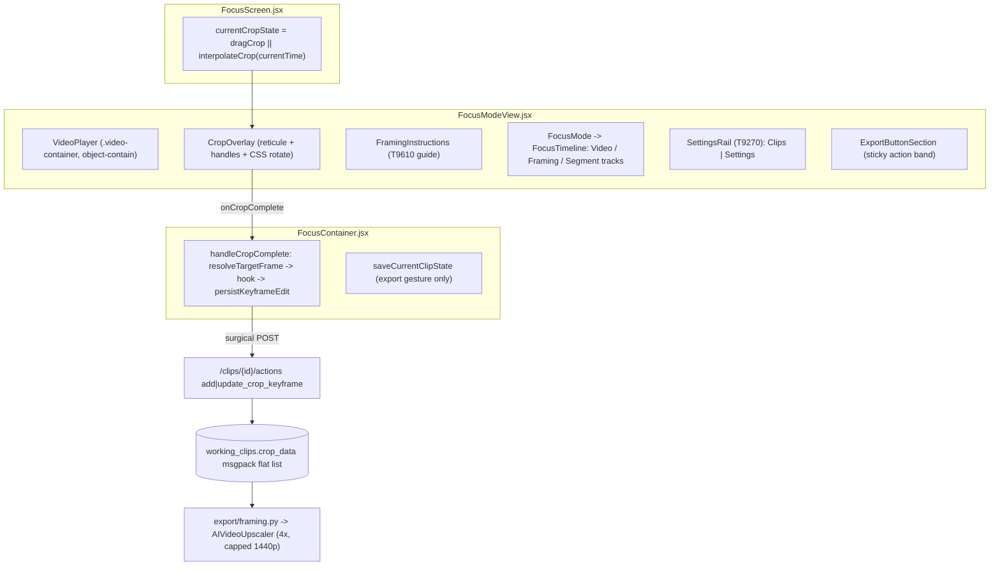
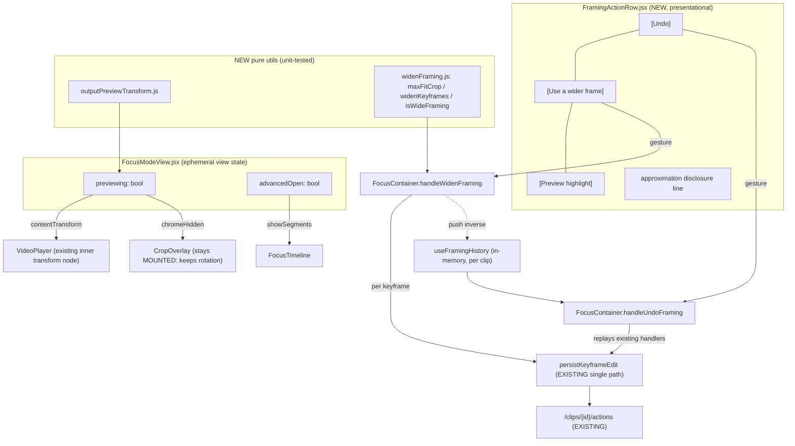

# T9950 Design: Simplify manual framing and preview actual output before export

**Status:** APPROVED, with amendments from a second-pass review — see §9
**Task:** [T9950](evaluation-2026-09-13/T9950.md) - source brief [T19](evaluation-2026-09-13/source/tasks/T19.md) - epic [EPIC.md](evaluation-2026-09-13/EPIC.md)
**Knowledge domain:** [.claude/knowledge/keyframes-framing.md](../../../.claude/knowledge/keyframes-framing.md)
**Tier verdict:** stays **L**, but frontend-only. **No migration, no schema change, no backend change, no Modal change.** See section 7.

---

## 0. TL;DR for the approver

1. **"Use a wider frame" is a crop EDIT, not a view toggle and not a new stored preference.** It rewrites
   the existing crop keyframes to the widest rect that fits the source at the current output aspect,
   through the write path that already exists. That satisfies "reversible, persists, retains source
   bounds" literally, with **zero schema change and no Migration agent**. Full argument in section 3.
2. **The moving output preview is a re-framing of the existing player, not a second player.** One video
   element, one playback mechanism, one new pure transform helper. This upholds the standing invariant
   that Focus's movement preview IS ordinary playback (T9610) instead of contradicting it.
3. **"Advanced editing" reuses T9270's collapse precedent.** Only the segment/speed track is genuinely
   uncollapsed today; straighten/dim/zoom are already in the settings rail, and numeric coordinates are
   already non-production-only.
4. Net-new: **Undo** (session-scoped, replays through the existing gesture handlers) and the **preview
   toggle**. Those two are why this is still L.
5. One measurement is required before merge (section 6, R1): a wide-framed export is a ~1.3x upscale of
   a ~8x larger crop instead of a ~4x upscale of a tiny crop. Output resolution is unchanged (1440p cap),
   but GPU time per export may rise. We must time it, not assume it.

---

## 1. Current state analysis

### 1.1 Verification of the prior Code Expert audit

Each of the five findings in T9950's Outcome record was re-checked against the tree. Four confirm,
with corrections that shrink the work; the fifth is re-framed.

| # | Audit claim | Verdict | Correction / evidence |
|---|---|---|---|
| 1 | Brief says "Framing point", canonical term is "Focus point" | **Confirmed** | `config/displayNames.js:397` `FOCUS_POINT: 'Focus point'`, settled by T9550 and left untouched by T9860 (knowledge doc front-matter). Also: **"Frame your athlete" already ships** (`FramingInstructions.jsx:56`), so that half of the brief's "Work to perform" bullet 1 is DONE. Verify, do not re-implement. |
| 2 | No moving output-aspect preview exists | **Confirmed, but narrower than stated** | The crop box already follows the interpolated spline during ordinary playback (`FocusScreen.jsx:787` `currentCropState = dragCrop \|\| interpolateCrop(currentTime)`, advanced by `useVideo.js:785`'s rAF loop). What is missing is only the **output-aspect framing of that same playback**. Net-new is a viewport, not a preview engine. |
| 3 | No crop undo exists | **Confirmed** | Grep finds only `trimHistory` + `onDetrimStart`/`onDetrimEnd` (a trim-specific reversal, `useSegments.js:61`). No crop/focus-point undo. Per-gesture `rollback` closures exist in `FocusContainer.handleCropComplete` (L403-412) but they are failure rollbacks, not user-facing undo. |
| 4 | Segments/speed/trim still prominent | **Confirmed for segments/speed only** | `boundaries = [0, ...userSplits, duration]` (`useSegments.js:77-80`) so `segments.length >= 1` always, so `FocusTimeline.jsx:163` always renders the SegmentLayer track. **But:** straighten + background dim + zoom + aspect + audio are ALREADY collapsed into the T9270 settings rail (`FocusSettingsPanel.jsx`), and the **numeric coordinate badge is already gated to non-production** (`CropOverlay.jsx:618` `versionInfo.environment !== 'production'`). Two of the brief's five "collapse these" items need no work at all. |
| 5 | Wider framing: schema-free recompute vs new `working_clips` column | **Re-framed; both options in the audit are wrong** | Neither a live-derived VIEW nor a stored TOGGLE. It is an edit to the crop keyframes themselves. Section 3. |

### 1.2 Architecture as it stands



Facts that constrain the design:

- **`crop_data` is the only thing the renderer reads for framing.** Flat list of
  `{frame,x,y,width,height,origin}`; empty means "apply `default_crop_keyframes`" (knowledge doc,
  Invariants). There is no second framing input, so anything the user chooses about framing has to be
  expressible as crop rects or the renderer cannot honour it.
- **Output resolution is capped, not proportional.** `app/ai_upscaler/__init__.py:678-696`: ideal is
  `crop * 4`, then `scale_limit = min(1920/sr_w, 1440/sr_h, 1.0)`. The evaluator's 205x365 crop gave
  810x1440 (matches the brief's S05 observation exactly). A max-fit 607x1080 crop on a 1080p source
  also gives ~810x1440, but at a ~1.33x real upscale instead of ~3.95x. **Widening is the single
  highest-leverage quality lever already available**, and it needs no renderer change.
- **The default 9:16 crop is a FIXED 205x365** (`modes/focus/hooks/useCrop.js:19-22`, mirrored by
  `services/default_crop.py`). On a 1080p source that is a 5.7% area crop. This is why the evaluator's
  result "looked soft".
- **Playback already honours timing.** `useVideo.js:1373-1408` sets `playbackRate = segment.speed` and
  stops at trim boundaries. Audio already tracks the export decision (`muted={!includeAudio}`,
  `FocusModeView.jsx:468`).
- **CropOverlay owns the straighten rotation imperatively** (`CropOverlay.jsx:101-111` writes
  `video.style.transform`, and its cleanup CLEARS it). Anything that unmounts CropOverlay loses the
  rotation on screen. Landmine for the preview design.

### 1.3 Code smells in the touched surface

| Smell | Location | Impact on this task |
|---|---|---|
| Long parameter list (~90 props) | `FocusModeView.jsx:140-259` | Adding 6 more props is more of the same. Accepted, not fixed here: threading is greppable, and a props refactor would blow the reviewable-diff budget. Out of scope, noted. |
| Duplicated timeline block | `FocusModeView.jsx:582-627` and `655-700` (desktop + mobileFs render `FocusMode` twice with near-identical props) | Any new timeline prop must be added in BOTH places or mobile fullscreen silently diverges. Flagged in the plan. |
| Mirrored constants | `DEFAULT_CROP_SIZES` (frontend) vs `default_crop.py` (backend) | The widen helper must NOT touch these. Changing the default is a separate decision (section 8). |
| Dev-only debug badge in a product component | `CropOverlay.jsx:618-627` | Already satisfies the brief's "collapse numeric coordinates". Leave alone. |

---

## 2. Target architecture

### 2.1 Design principles applied

- [x] **Single write path.** Widen and Undo both go through `persistKeyframeEdit` / the existing
      `FocusContainer` handlers. No new API action, no new endpoint, no second crop writer.
- [x] **No redundant state.** "Is this clip widely framed?" is DERIVED from the crop rects, never stored.
- [x] **No new schema.** Nothing this task adds is persisted that is not already persisted.
- [x] **Gesture-based persistence.** Every write traces to a named click (Use a wider frame, Undo,
      focus-point drag). No `useEffect` writes. Preview and Advanced-editing disclosure are ephemeral
      view state (precedent: `straightenVisible` T5641, `railCollapsed` T9270, `guideOverride` T9610).
- [x] **One preview mechanism.** Preview is ordinary playback re-framed, not a second player, not a
      canvas, not a render. Upholds the T9610 invariant instead of contradicting it.
- [x] **Reuse the existing disclosure pattern** (T9270 settings rail) rather than inventing a second one.

### 2.2 Target diagram



### 2.3 Target behaviour (pseudo code)

```pseudo
# Preview: one video element, one playback path
when [Preview highlight] clicked:
    previewing = !previewing                      # ephemeral, no write
render:
    if previewing:
        stage box aspect := globalAspectRatio     # format agrees with export
        VideoPlayer.contentTransform := computeOutputPreviewTransform(
            crop = currentCropState,              # SAME value the reticule uses
            displayRect, containerBox)            # inverse of videoToScreenRect
        VideoPlayer.zoom := 1 ; panOffset := 0    # view-only zoom must not leak in
        CropOverlay.chromeHidden := true          # stays MOUNTED so rotation survives
        show disclosure line
    else:
        unchanged from today

# Wider frame: an EDIT, through the one existing write path
when [Use a wider frame] clicked:
    target = isWide ? defaultCropSize : maxFitCrop(videoW, videoH, aspectValue)
    for each keyframe kf in keyframes:            # zero keyframes -> create one at currentTime
        rect = resizeAboutCenter(kf, target)      # then clamp inside [0,0,videoW,videoH]
        addOrUpdateKeyframe(...)                  # existing hook op
        persistKeyframeEdit(...)                  # existing surgical POST
    history.push(inverse)                         # memory only
isWide = derived: every keyframe within epsilon of maxFitCrop     # NEVER stored

# Undo: replays the existing handlers, never a parallel writer
when [Undo] clicked:
    op = history.pop()
    op.apply()                                    # calls the same public handlers
```

---

## 3. THE FORK: how "wider framing is reversible, persists and retains source bounds" is satisfied

### 3.1 Re-reading the acceptance criterion

The brief's exact words matter in three places:

- AC4: *"Wider framing is reversible, persists and retains source bounds."*
- Work to perform: *"Provide ... reversible wider framing/format choice **supported by renderer**."*
- AC2: *"Preview/export crop, timing, format and audio decisions **agree**."*

"Supported by renderer" is the deciding clause. The renderer reads exactly one framing input,
`working_clips.crop_data`. Therefore:

- A **view-only wide framing** (audit option A as originally framed, "wide is a computed alternate view
  of the same data") **fails AC2 by construction**: the preview would show a wide frame while the export
  produced the tight one. It also fails "supported by renderer", because nothing would carry the choice
  to the renderer. **Rejected.**
- A **persisted boolean column** (audit option B) would be **redundant state**: either the backend
  renderer learns to expand the crop when the flag is set (a second framing code path in the render
  pipeline, which is the exact "two ways to do one thing" this project forbids, plus a Modal redeploy),
  or the flag is applied at write time, in which case the crop rects already say everything and the
  column is a second copy of a fact. **Rejected.**
- **Widening IS an edit to the crop rects.** The choice reaches the renderer because it is written into
  the only thing the renderer reads. **Chosen.**

### 3.2 How the chosen option satisfies each word of AC4

| Word | How it is satisfied | Where |
|---|---|---|
| **reversible** | (a) `[Undo]` restores the exact previous rects within the session; (b) the button is a toggle, and pressing it again returns each focus point to the default crop size at the same centre; (c) nothing is destroyed at the data level, it is an ordinary crop edit like any drag. | `useFramingHistory` + `handleWidenFraming` |
| **persists** | The widened rects ARE `working_clips.crop_data`, written through the existing surgical `update_crop_keyframe` action, synced to R2 like every other framing edit. Reopen shows the wide framing, and the toggle reads "on" because the state is derivable from the rects. | existing `persistKeyframeEdit` path |
| **retains source bounds** | This is a **clamp**, not a persistence guarantee. `maxFitCrop` is by definition the largest rect of the output aspect that fits inside `videoMetadata.width x height`, and every widened rect is clamped into `[0,0,videoW,videoH]` (the same constraint `CropOverlay.constrainCrop` already enforces for drags, `CropOverlay.jsx:116-118`). A wide frame can never reference pixels the source does not have. Under straighten, it additionally clamps to the inscribed safe area via the existing `clampCropForCurrentRotation`. | `widenFraming.js` + existing clamps |

### 3.3 Why derived "is wide" is safe

`isWideFraming(keyframes, videoDims, aspectValue)` compares each rect to `maxFitCrop` within an epsilon
(propose 1% of width, to absorb the server-side centre-preserving aspect refit of T3910 and integer
rounding). Failure mode if the definition of max-fit ever changes: an older wide clip reads as "not
wide" and the button shows unpressed. **The user's framing is unchanged and nothing is lost**; one tap
re-widens. That is a cosmetic, non-destructive degradation, and it is strictly better than the
alternative failure mode of a stored flag disagreeing with the rects it claims to describe.

### 3.4 Verdict

**Option A, in its correct form: no new column, no profile_db migration, no Migration agent.** This
removes the one thing in the original classification that required a schema decision. It does not
shrink the task to M (section 7), but it removes the highest-risk part of it.

### 3.5 The quality finding that makes this the most valuable part of the task

Widening is not cosmetic. On a 1080p source at 9:16:

| Framing | Crop | Ideal 4x | After the 1440p cap | Real upscale |
|---|---|---|---|---|
| Today's default | 205 x 365 | 820 x 1460 | **810 x 1440** | **~3.95x** (matches the evaluator's S05 observation) |
| Max fit | 607 x 1080 | 2428 x 4320 | **~810 x 1440** | **~1.33x** |

Same delivered resolution, roughly one third of the synthetic magnification. This is the honest answer
to the "looked soft" finding, and it requires no upscaler work. It must be shipped **without** a quality
claim in the copy (epic decision 3: name the step, never promise the outcome; brief: "Do not promise
crispness from resolution alone", "Do not add uncalibrated softness warning"). Copy therefore says what
the control DOES ("Use a wider frame" / "Shows more of the field"), never what it will look like.

---

## 4. The preview: why a re-framed stage and not a second pane

The brief's schematic shows `[Source + movable crop] [Moving output-aspect preview]` side by side. The
brief also states the schematic "defines behavior/hierarchy, not a new visual identity". Three
candidates were considered:

| Option | Mechanism | Verdict |
|---|---|---|
| **P1 (chosen)** Toggle: the stage re-frames to the output aspect | Existing `<video>`, existing playback, CSS transform on VideoPlayer's existing inner transform node | One decoder, perfect sync by construction, no new render loop, rotation handled by the existing CropOverlay effect, identical on mobile and desktop (ONE code path). Upholds T9610's "the preview IS ordinary playback" invariant. |
| P2 Side-by-side `<canvas>` with `drawImage` per rAF | Second render loop, crop + rotation math re-implemented | Adds a THIRD copy of the rotation math (frontend overlay, backend export, canvas). The knowledge doc flags mirrored-math drift repeatedly (spotlight reveal, default crop sizes). No room for it on mobile. Rejected. |
| P3 Side-by-side second `<video>` slaved to the first | Two decoders, sync correction loop | Drift, double bandwidth against presigned R2 URLs, a whole class of timing bugs for zero user benefit. Rejected. |

**P1 mechanics.** The preview transform is the exact inverse of the existing
`videoToScreenRect`: with `transform-origin: 0 0`, `scale(s) translate(-cropScreen.x px,
-cropScreen.y px)` where `s = containerWidth / cropScreen.width` maps the crop rect onto the whole
container. `computeOutputPreviewTransform` is a pure function over
`(crop, displayRect, containerBox)`, unit-testable with no DOM, sitting next to
`computeVideoDisplayRect` conceptually.

**Landmines the design must respect:**

1. **CropOverlay must stay MOUNTED in preview.** Its unmount cleanup clears `video.style.transform`
   (`CropOverlay.jsx:106-110`), so unmounting it would silently un-straighten the preview, making the
   preview disagree with the export. Add a `chromeHidden` prop that suppresses the reticule, handles,
   badges, dim shadow and straighten tool while leaving the rotation layout effect untouched.
2. **View-only zoom must not leak in.** Pass `zoom={1} panOffset={{x:0,y:0}}` while previewing, so the
   preview reflects the export, not the editor's inspection zoom.
3. **The transform composes with rotation correctly** because rotation is applied to the `<video>`
   element itself (inner) and the preview transform to its wrapper (outer), which is the same nesting
   order the export uses (rotate the frame, then crop it).

**Honest disclosure (AC2 "approximation is disclosed").** The preview is exact for crop geometry,
timing, aspect/format and audio, and approximate for image quality (browser scaling versus the
Real-ESRGAN pass) and for multi-clip projects (only the selected clip plays; no concatenation or
transition). Proposed copy, routed through `displayNames.js`:

- always: *"Preview shows your framing, timing and format. Final image quality is produced at export."*
- multi-clip only (derived from `clipsWithCurrentState.length > 1`): *"Previewing this clip. Your clips
  are joined at export."*

No sharpness claim in either direction.

---

## 5. Implementation plan

Frontend only. Three ordered slices, each independently reviewable and each keeping the app shippable.
Recommend one branch, three commits, a Reviewer pass per slice (refactoring rule 4: reviewable units
under ~200 lines of meaningful diff).

### Slice 1: Advanced editing disclosure (smallest, no persistence surface)

| File | Change |
|---|---|
| `src/frontend/src/modes/FocusModeView.jsx` | Add `const [advancedOpen, setAdvancedOpen] = useState(false)` (ephemeral, gesture-only, same comment convention as `railCollapsed`). Render the `▸ Advanced editing` disclosure row directly under the timeline. Pass `showSegments={advancedOpen}` to BOTH `FocusMode` instances (desktop L582 and mobileFs L655 - the duplicated block noted in 1.3). |
| `src/frontend/src/modes/focus/FocusMode.jsx` | Thread `showSegments` through to `FocusTimeline`. |
| `src/frontend/src/modes/focus/FocusTimeline.jsx` | New prop `showSegments = true`. Gate the SegmentLayer block (L163) and its label (L105) on `showSegments && segments.length > 0`; `getTotalLayerHeight` uses the same condition. Default `true` keeps every existing caller and test byte-identical. |
| `src/frontend/src/components/settings/FocusSettingsPanel.jsx` | Group the existing "This clip" (straighten) and "View only" (dim, zoom) panels under one `Advanced editing` heading so the rail and the timeline use the SAME word. Copy/grouping only, no behaviour change, `desktopOnly` gating untouched. |
| `src/frontend/src/config/displayNames.js` | `EDITOR_PANELS.ADVANCED_EDITING = 'Advanced editing'`. |

Not touched: numeric coordinates (already non-production only), aspect/audio (already in the rail and
NOT advanced - they are first-class output decisions).

### Slice 2: Wider frame + Undo (the persistence-touching slice)

| File | Change |
|---|---|
| `src/frontend/src/utils/widenFraming.js` **(new, pure)** | `maxFitCrop(videoW, videoH, aspectValue)` (largest rect of that aspect inside the source, even dimensions); `resizeAboutCenter(rect, targetW, targetH, videoW, videoH)` (centre-preserving, clamped into source bounds); `isWideFraming(keyframes, videoDims, aspectValue, epsilon = 0.01)`. No React, no I/O. |
| `src/frontend/src/hooks/useFramingHistory.js` **(new)** | Ref-backed LIFO stack of `{label, apply}` inverse thunks, depth 20, `push/undo/clear/canUndo`. Memory only, never persisted, never written from a `useEffect`. |
| `src/frontend/src/containers/FocusContainer.jsx` | `handleWidenFraming()`: compute target rects, apply per keyframe via the existing `addOrUpdateKeyframe` + `persistKeyframeEdit` pair (identical shape to `handleCropComplete`, including `resolveTargetFrame` - each keyframe keeps its own frame key, so identity resolution is a no-op by construction and no near-duplicates can appear). Zero-keyframe clips create ONE keyframe at `currentTime`. Push the inverse. `handleUndoFraming()`: pop and run. Push inverses from the existing crop handlers (`handleCropComplete`, keyframe delete) so Undo covers focus-point edits too. Clear the stack inside the existing clip-selection gesture handler (a gesture, not an effect). Expose `canUndo`, `isWideFraming`. |
| `src/frontend/src/modes/focus/FramingActionRow.jsx` **(new, presentational)** | `[Undo] [Use a wider frame] [Preview highlight]` plus the disclosure line. Pure props in, callbacks out. No store reads. |
| `src/frontend/src/screens/FocusScreen.jsx` | Thread the new container outputs to the view. Selector-scoped `focusStore` reads only (T6190 invariant). |
| `src/frontend/src/modes/FocusModeView.jsx` | Render `FramingActionRow` under the timeline, above the Advanced-editing disclosure (matching the brief's hierarchy). |
| `src/frontend/src/config/displayNames.js` | `WIDER_FRAME`, `WIDER_FRAME_HELPER`, `UNDO`, `UNDO_NOTHING` strings. |

Persistence rules honoured: every write is a click; each write is surgical and sends only that
keyframe; widening N keyframes is N ordinary actions serialised by `api/actionClient.js`'s per-entity
FIFO chain with version threading, exactly as N fast drags would be; `framing_version` CAS behaves
unchanged. Nothing in `removeBoundaryDuplicates` or the restore path is touched, so the T6140
persistence hazard is neither worsened nor accidentally entangled.

### Slice 3: Output-aspect moving preview

| File | Change |
|---|---|
| `src/frontend/src/utils/outputPreviewTransform.js` **(new, pure)** | `computeOutputPreviewTransform({ crop, displayRect, containerWidth, containerHeight })` returning `{ transform, transformOrigin, scale }`. Inverse of `videoToScreenRect`. Returns `null` when inputs are incomplete (fail closed: no preview rather than a wrong one). |
| `src/frontend/src/components/VideoPlayer.jsx` | One nullable prop `contentTransform`: when provided it replaces the pan/zoom transform on the EXISTING inner transform node (L223-229). No new DOM node, no new behaviour for any other caller. |
| `src/frontend/src/modes/focus/overlays/CropOverlay.jsx` | One nullable prop `chromeHidden`: suppresses the reticule, handles, badges, dim shadow and straighten tool. The rotation `useLayoutEffect` (L101-111) and its cleanup are UNTOUCHED. |
| `src/frontend/src/modes/FocusModeView.jsx` | `previewing` ephemeral state; when on, constrain the stage box to `globalAspectRatio`, pass `contentTransform`, `zoom=1`, `panOffset={x:0,y:0}`, `chromeHidden`; keep `Controls` and the timeline visible so the user can play and scrub the preview. |
| `src/frontend/src/modes/focus/FramingActionRow.jsx` | Wire `[Preview highlight]` (toggle label flips to "Back to framing" when on) and render the disclosure line. |

### Test plan (relevant set, roughly 10, per the test-scope policy)

New unit tests: `widenFraming.test.js` (max fit per aspect, centre preserved, clamped to source bounds,
rotation safe area, epsilon `isWideFraming`, idempotent second widen), `outputPreviewTransform.test.js`
(crop fills the box, letterboxed source, fail-closed nulls), `useFramingHistory.test.js` (LIFO, depth
cap, clear on clip change).

Extended existing tests: `FocusTimeline`/`SegmentLayer` (segment track hidden when `showSegments` is
false, default unchanged), `CropOverlay.test.jsx` (chromeHidden hides the reticule AND still rotates),
`FocusModeView.framingGuide.test.jsx` sibling for the new action row.

Real-browser QA spec `e2e/T9950-framing-preview.qa.spec.js` (jsdom cannot judge a CSS transform over a
playing video; memory note `feedback_real_browser_for_pointer_fixes`): place two focus points, press
Preview, assert the stage box aspect equals the output aspect and that the transform changes across
playback; Undo restores the prior rect; widen then reopen the clip and assert the rects persisted wide.

Regression guards to keep green: `keyframe-integrity.spec.js` (flat-list invariants),
`useCrop.test.js`, `FocusContainer` crop-persistence tests, `e2e/T9610-teach-framing.qa.spec.js`.

---

## 6. Risks

| # | Risk | Likelihood | Mitigation |
|---|---|---|---|
| **R1** | **Wide framing raises GPU cost/time per export.** The ESRGAN input frame becomes ~8x larger in pixels even though the output stays 1440p. `frame_processor.py:220-222` already adapts `outscale`, but input size still drives the model. | Medium | **Measure before merge**: time one default-crop export and one max-fit export of the same clip on the same path, record both in the outcome record. If the delta is material, the button stays but the finding is handed to T9970 (quality/cost measurement) rather than silently shipped. No code change is gated on the result; the decision to keep the control prominent is. |
| R2 | Widening N keyframes fires N surgical POSTs; a 409 mid-batch leaves a partially widened clip. | Low | Each POST already has its own rollback closure and the batch runs through the FIFO `actionClient`. On a 409 the existing refresh-toast path fires (`actionConflictPrompt`) and the clip reloads from the server, which is a consistent state. Do NOT add a bespoke batch endpoint (that would be a second write path). |
| R3 | Preview disagrees with export in a case we did not enumerate (straighten, trim at the boundary, multi-clip). | Medium | Rotation is unchanged (same element, same effect). Trim/speed already drive playback. Multi-clip is explicitly disclosed. The QA spec compares preview framing against the exported result on one real clip (the brief's "Compare preview/export on moving athlete and multiple points at start/interior/end"). |
| R4 | Hiding the segment track hides work a user already did (a clip with existing splits or a trim). | Medium | Default `advancedOpen` to **true when the clip already has user splits or a trim range** (derived, not stored, `boundaries.length > 2 \|\| trimRange`). A novice with an untouched clip sees it collapsed; a returning user never loses sight of their own edits. |
| R5 | Copy drift against T9860's settled vocabulary. | Low | All new strings go into `config/displayNames.js` `EDITOR_PANELS`, reuse `FOCUS_POINT`, and never introduce "Framing point" or "keyframe" as a primary label. |
| R6 | Touching the crop persistence path reopens the T350 corruption class. | Low | No new write path, no `useEffect` write, no runtime fixup reaching persistence, no change to restore or dedupe. Undo replays the SAME handlers. The integrity spec stays green. |

---

## 7. Tier and agent verdict

**Stays L. Frontend only.**

Resolving the fork toward the schema-free edit removes the migration, the backend change, the Modal
change and the schema decision, which is the single biggest risk reduction available. But the task
still adds two net-new capabilities (an undo history and an output-aspect preview viewport), touches
~12 files across screen/container/view/hooks/utils, and introduces a new prop contract on two shared
components (`VideoPlayer`, `CropOverlay`). That is a new abstraction plus a real design fork, which is
the L trigger in CLAUDE.md's table. Calling it M would also mean skipping the design gate this document
exists to satisfy.

Practical recommendation: implement as **one L task in three sequenced slices** (section 5), each with
its own commit and Reviewer pass. If the user prefers smaller units, slices 1 and 2 are cleanly
separable into child tasks and slice 3 is the only genuinely new-architecture piece.

| Agent | Include | Justification |
|---|---|---|
| Code Expert | Done | Audit complete, verified and corrected in section 1.1. |
| Architect | This document | Design gate. |
| Tester (Phase 1) | Yes | `widenFraming` and `outputPreviewTransform` are pure and should be test-first. |
| Implementor | Yes | Three slices. |
| **Migration** | **No** | No schema change, no new column, no data shape change. This is the explicit consequence of the section 3 decision. |
| Reviewer | Yes | One pass per slice; slice 2 touches the crop persistence path and needs the keyframes-framing invariants checked. |

---

## 8. Open questions for the approver

1. **Toggle-off semantics.** Recommended: pressing "Use a wider frame" when already wide returns each
   focus point to the DEFAULT crop size at the same centre (predictable, stateless), with `[Undo]`
   available for exact restoration inside the session. The alternative is offer-only-Undo (the button
   never un-widens). Which do you want?
2. **Should the DEFAULT crop stop being 205x365?** Section 3.5 shows the default is the root of the
   "looked soft" finding. Changing `DEFAULT_CROP_SIZES` plus its backend twin `default_crop.py` would
   fix it for every new clip without any user action. It is deliberately **out of scope here** (it
   changes output for un-framed clips and needs its own before/after evidence), but it may be the
   higher-value follow-up. File as a separate task?
3. **Preview as a toggle, not side by side** (section 4) deviates from the brief's schematic. Confirm
   this is acceptable, given the brief states the schematic defines behaviour and hierarchy rather
   than visual identity, and given mobile cannot carry two stages.
4. **Existing "sub-optimal upscale" warning** (`CropOverlay.jsx:630-638`, shown when the crop is too
   small for a clean 4x). It predates this task and is arguably the "uncalibrated softness warning"
   the brief says not to ADD. Recommendation: leave it exactly as is (do not add, do not remove) and
   let T9970's measurement decide its fate. Agree?
5. **R1 measurement** is proposed as a merge gate for the FINDING (recorded in the outcome record), not
   for the code. Confirm that is the bar you want.

---

## 9. Approval and second-pass amendments (2026-09-15)

**User approved Q1, Q3, Q4 as recommended.** A second-pass review (Fable 5.1, requested
specifically to verify this doc's load-bearing claims against the code before implementation)
confirmed the fork resolution, the preview mechanics, the Advanced-editing collapse plan, and the
Undo-via-replay design are all sound as written. It found two corrections and one real gap, all
resolved below.

### 9.1 Corrections (cosmetic)

Two file-path citations in section 1.2 were wrong and have been fixed inline:
`useCrop.js` is at `src/frontend/src/modes/focus/hooks/useCrop.js`, and the upscaler citation is
`app/ai_upscaler/__init__.py` (not under `services/`). No other claim in sections 1-8 required
correction — the crop/renderer architecture, the preview transform mechanics, and the file plan
in section 5 all verified against the current tree.

### 9.2 The real gap: max-fit is not actually reversible after a reload — DECISION: target 2x, not max-fit

Section 3's argument that widening "retains source bounds" and is "reversible" is correct for
the SESSION-scoped `Undo` (it replays the same handlers, so it's exact). But the ACROSS-RELOAD
toggle-off behavior recommended in §8 Q1 ("snap back to the default size at the same centre")
quietly assumed the round trip loses nothing. It does, specifically for **max-fit**: a full-height
608x1080 crop leaves ZERO vertical positioning freedom (crop height == source height), so widening
collapses every keyframe's vertical center to the same value. An athlete who was framed near the
top of the source at one keyframe and lower at another loses that distinction the moment they
widen — `Undo` restores it within the session, but a toggle-off after a page reload restores the
DEFAULT size at the (now-uniform) WIDE center, not each keyframe's original vertical position.
That is a real, silent loss the design doc did not flag.

**Fix: the "wider frame" target is a bounded 2x scale of the default crop (410x730 for 9:16 on a
1080p source), not literal `maxFitCrop`.** `maxFitCrop` stays in `widenFraming.js` as a clamp/
safety-net (a source small enough that 2x would exceed it still needs the upper bound), but the
button's actual target becomes `min(defaultCropSize * WIDE_FRAME_SCALE, maxFitCrop)` with
`WIDE_FRAME_SCALE = 2`. At 410x730 the crop still has 350px of vertical freedom on a 1080p
source (730 of 1080 used) — enough that typical multi-keyframe pans retain distinct positioning,
materially reducing (not claiming to fully eliminate in every extreme case) the round-trip loss
that full max-fit guarantees.

**This also happens to be the better product decision on the numbers**, benchmarked with T9970's
own tooling on the same fixture (no-GAN Lanczos lower bound; a new middle variant was added to the
original two-point benchmark):

| Crop | Enlargement | Sharpness (lap_var) | Athlete share of frame | Relative GPU input pixels |
|---|---|---|---|---|
| 205x365 (today's default) | 3.95x | 3.2 | 35.6% | 1x |
| **410x730 (chosen wider-frame target)** | **1.98x** | **32.1 (~10x better than today)** | **17.8%** | **~4x** |
| 608x1080 (max-fit — rejected as the button's target) | 1.33x | 105.0 | 12.0% | ~8.8x |

Max-fit is sharper in absolute terms, but it shows the full source height and shrinks the athlete
to about a tenth of the frame — working against the entire point of Focus mode (framing IS
choosing what survives the crop, per the epic's own "why frame" answer). 410x730 captures ~10x of
the sharpness win, keeps the athlete a clear subject, costs half of max-fit's GPU input, and keeps
enough vertical freedom that the approved Q1 toggle-off behavior is close to lossless instead of
quietly lossy. `maxFitCrop` remains the correct target for a SEPARATE, later question — whether
the DEFAULT crop (not the widen button) should change — because a default-size decision is
evaluated without the reversibility constraint (there's no "toggle back" for a value nobody
explicitly chose).

**Update to section 5's file plan:** `widenFraming.js` gets a `WIDE_FRAME_SCALE = 2` constant;
`resizeAboutCenter`'s target becomes `min(defaultCropSize.width * WIDE_FRAME_SCALE, maxFit.width)`
/ `...height...` (aspect-preserving since default and max-fit share the same output aspect).
`isWideFraming`'s epsilon comparison target changes to match. Everything else in slice 2 (Undo,
the write path, the per-keyframe surgical POSTs) is unchanged.

### 9.3 R1 (GPU cost) is more serious than "Medium" — revised gate

Reading `model_manager.py` and `frame_processor.py` directly: production runs with `tile_size=0`
(no tiling — `multi_clip.py:1101`, `processor_local.py:82`), and `enhance()` always runs the GAN
at up to 4x on the FULL input frame before any resize-down happens (`frame_processor.py:216-228`
computes `desired_scale` but still executes the model at that scale on the whole crop — there is
no code path today that skips the GAN for a small enlargement). So GPU cost scales with the CROP'S
pixel count, not with how much enlargement is actually needed. The 410x730 target is ~4x the input
pixels of today's default; true max-fit would have been ~8.8x. This is the same class of GPU
memory/time pressure documented for the T7090 intro-card OOM.

**Revised gate: the GPU-time measurement (originally proposed as a merge-time check in §8 Q5)
now happens BEFORE slice 2 is implemented, not just before merge**, and a genuine fix — skipping
the GAN pass below some enlargement threshold — is out of scope for T9950 and filed as its own
task, **[T10160](../T10160-skip-gan-for-small-enlargements.md)**, gated by an `expert` agent
measurement of the real quality/GPU tradeoff on the actual Modal T4 path (the benchmark numbers
above are a no-GAN Lanczos LOWER BOUND, not a substitute for that). T9950's slice 2 still ships
the widen button at the chosen 2x target — the measurement determines whether GPU cost is
acceptable as-is or whether T10160 needs to land first in practice, not whether the button ships.

### 9.4 Q2 filed separately, as recommended — and gated

The default-crop-size question (§8 Q2) is filed as **[T10150](../T10150-reduce-default-crop-synthetic-upscale.md)**,
explicitly gated on T10160: changing the DEFAULT (not opt-in) crop for every new clip has a much
larger GPU-cost blast radius than a user-triggered widen button, so it should not ship without the
same cheap-path mitigation, or an explicit user waiver after a real cost measurement.

### 9.5 Net effect on this document

Sections 1-2 (architecture), 4 (preview), and the parts of section 5 not touched by 9.2 remain
authoritative as written. Section 3's conclusion (no schema change, no migration, no Migration
agent) is UNCHANGED — the wider-frame target moved from max-fit to a 2x scale, but it is still an
ordinary crop-rectangle edit through the same existing write path. Section 6's risk table should
be read with R1 now gating slice 2's START rather than the merge, and with T10150/T10160 as its
follow-up tasks. Section 7's tier verdict (L, frontend-only, no Migration agent) is unchanged.
