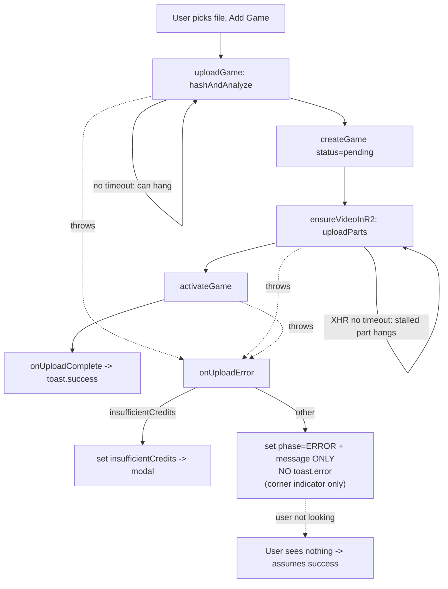
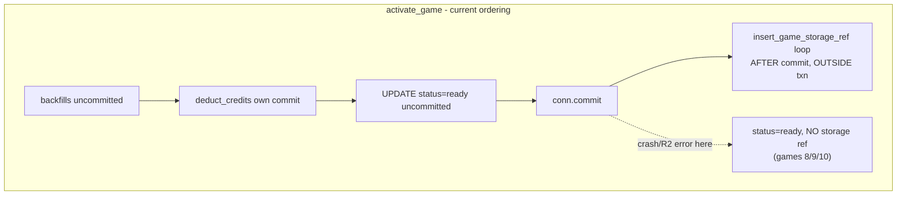
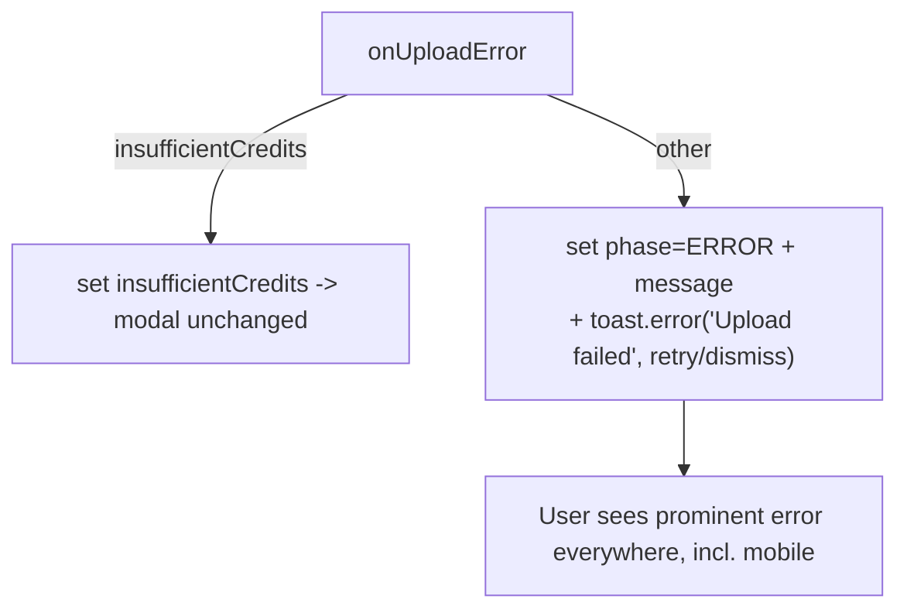
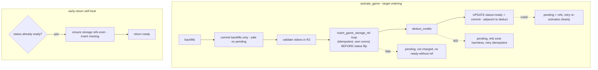

# Tbug26p — "Added a game but it never showed up": silent Add-Game upload failure

**Bug:** A user uploaded a ~2.5GB game video via Add Game; it never appeared in their
Games list, and they were never told it failed. They believed it succeeded. Investigation
also surfaced a second, related data-consistency class: games can reach `status='ready'`
with NO `game_storage` ref (games 8/9/10 for this user).

**Scope (user chose: BROAD robustness pass):** surface upload failures loudly (primary),
add hashing/XHR timeouts, ensure pending-game cleanup, and make backend `activate()`
storage-ref writes consistent with the status flip.

**Status:** Design gate — awaiting architecture approval. Do NOT implement yet.

---

## Stage 0 — Classification

**Stack Layers:** Frontend + Backend (no schema change expected)
**Files Affected:** ~6–8
**LOC Estimate:** ~200–320
**Test Scope:** Frontend Unit (`uploadStore` error/success paths) + Backend (`activate` ref/status consistency)

| Agent | Include? | Justification |
|-------|----------|---------------|
| Code Expert | No | Pipeline fully mapped here; root causes verified against source. |
| Architect | Yes | Spans frontend notify path + backend billing/storage ordering; design-gated. |
| Tester | Yes | Error-path + activate consistency need failing-test-first then green. |
| Reviewer | Yes | Touches upload + billing/storage path; high scrutiny. |
| Migration | **No (verify)** | No schema change planned. A one-time data-repair for existing ready-without-ref rows is an **open question** — if approved, INCLUDE Migration. |

---

## Root Causes (verified against source)

### Frontend — silent failure (direct cause of the report)
- `stores/uploadStore.js` `onUploadError` (~140–162): on non-credit failure it only sets
  `activeUpload.phase = ERROR` + a message. Unlike `onUploadComplete` (which calls
  `toast.success`), it **never calls `toast.error`**. The sole failure surface is the small
  corner `UploadProgressIndicator` (`fixed bottom-4 right-4 w-80`). A user not staring at
  that corner — or on mobile — sees nothing and assumes success. **This is bug 26.**
- `services/uploadManager.js`:
  - `hashAndAnalyze()` (~349–383) / `hashFile()` (~61–100): no AbortController / timeout.
    A 2.5GB sampled hash + faststart analyze can hang on a flaky disk/file handle.
  - `uploadPart()` XHR (~109–150): no `xhr.timeout`. A stalled R2 part hangs indefinitely
    (only `onerror`/non-2xx reject; a silent stall never does).
  - `saveCompletedParts()` (~181–192) and the retry-path call (~165): `.catch(() => {})` /
    `console.warn` swallow resume-state save errors. (Out of scope per kickoff — leave.)
  - Pending-game cleanup on error (~697–709, both `uploadGame` and `uploadMultiVideoGame`):
    best-effort DELETE, only `console.warn` on failure — can orphan a `pending` row.

### Backend — `activate_game` storage-ref consistency (`routers/games.py` ~543–711)
Ordering verified (the secondhand note was backwards). As written:
1. backfills (metadata/fps/aggregates) — uncommitted on activate's connection
2. `deduct_credits(...)` (~680) — **separate `user.sqlite` connection, own commit**
3. `UPDATE games SET status='ready'` (~693–696) — uncommitted on activate's connection
4. `conn.commit()` (~697)
5. **`insert_game_storage_ref(...)` loop (~699–704) — AFTER commit, outside the transaction**

`deduct_credits` runs before the status flip, so an insufficient-credit failure correctly
leaves the game `pending`. **The real gap is step 5:** if the process dies / R2 errors
between the commit and the ref inserts, you get `status='ready'` with NO storage ref —
exactly games 8/9/10.

**Three separate stores are involved — no single transaction can span them:**
| Data | Store | Connection |
|------|-------|------------|
| credits balance + `credit_transactions` | per-user `user.sqlite` | `get_user_db_connection(user_id)` |
| `games.status` + `game_storage` refs | per-profile SQLite | `get_db_connection()` |
| `game_ref_counts` | Postgres | `get_pg()` |

So the fix is **failure-safe ordering**, not "one transaction". Verified facts that shape it:
- `insert_game_storage_ref` opens its **own** `get_db_connection()` and also writes Postgres.
  It is **idempotent per hash**: `INSERT OR IGNORE` into `game_storage` sets `is_new`, and the
  PG `game_ref_counts` increment only fires when `is_new` — so calling it twice for the same
  hash does NOT double-count. Safe to call on retry / in the idempotent path.
- Because it opens its own SQLite connection (WAL, `busy_timeout=30000`), calling it **while
  activate's connection holds an uncommitted write transaction risks a writer lock** (30s
  block then "database is locked"). It must be called when activate is NOT holding a write lock.
- `deduct_credits` is **NOT idempotent** on `reference_id` — every call deducts and inserts a
  new `credit_transactions` row. So any retry of activate on a still-`pending` game double-charges.
  This window exists today (between deduct ~680 and commit ~697); the redesign must not widen it.

### Already-correct (no change needed — confirm only)
- **Pending games never shown:** `stores/gamesDataStore.js` derives
  `readyGames = gamesList.filter(g => g.status !== 'pending')` (lines ~57, ~87). The list
  endpoint returns pending rows but the UI filters them. Scope item #3's "never surface
  pending" is already satisfied; remaining work is reliable *cleanup* of the orphan row.

---

## Current State





---

## Target State





---

## Implementation Plan

Organize into reviewable commits:
1. Frontend: surface failures (toast) — the primary fix
2. Frontend: hashing abort/timeout + XHR timeout
3. Frontend: pending-game cleanup hardening
4. Backend: activate() ordering + idempotent self-heal
5. Tests (frontend unit + backend)

### 1. Surface upload failures (`stores/uploadStore.js` `onUploadError`)
Add a `toast.error` on the non-credit branch. Keep the insufficient-credits modal path
untouched. Reuse the existing `toast` import and the corner indicator's
`clearFailedUpload` retry affordance — no parallel system.

```js
// non-credit branch (after setting phase=ERROR)
toast.error('Upload failed', {
  message: `${gameName || 'Your video'} didn't upload. Please try again.`,
  // duration already 8000ms for errors (Toast.jsx)
});
```
- **Where it renders:** existing `<ToastContainer>` (top-level, already mounted) +
  the corner `UploadProgressIndicator` ERROR state (already shows message + Dismiss).
- **Copy:** title "Upload failed"; message "`<game name>` didn't upload. Please try again."
- **Retry affordance:** the corner indicator's Dismiss → `clearFailedUpload` already lets
  the user re-initiate Add Game. (Open Q: do we want a literal "Retry" button that re-runs
  the same file? That requires retaining the `File` handle — see Open Questions.)
- Do NOT toast on the `insufficientCredits` branch (the modal is the surface there).

### 2. Hashing abort/timeout + XHR timeout (`services/uploadManager.js`)
- **Hash:** wrap `hashAndAnalyze` (or `hashFile`'s loop) so a wall-clock cap rejects with a
  clear error. Proposed approach: a `Promise.race` against a timeout, plus an
  `AbortController` whose signal short-circuits the per-sample loop (checked between samples,
  where the code already `await`s `setTimeout(0)`).
  - **Proposed value: 120s** for the full hash+analyze of one file. Rationale: sampled hash
    reads only 5×1MB + an MP4 faststart scan; even on a slow phone/disk this is seconds, so
    120s is a generous "something is wrong / file handle died" ceiling, not a normal-path risk.
- **Part upload XHR:** set `xhr.timeout` and add `xhr.ontimeout` → reject as retryable
  (so `uploadPartWithRetry`'s existing backoff applies, then surfaces loudly).
  - **Proposed value: 120s per part.** Parts are sized by the backend; at the adaptive
    "slow" floor (~2MB/s, concurrency 1) a part still completes well under 120s. 120s flags a
    truly stalled/dead socket. (Open Q: confirm max part size from `prepare-upload` to ensure
    120s comfortably covers the largest part on a slow link; adjust to 180s if parts are large.)
- All timeout errors flow through the existing `catch` in `uploadGame`/`uploadMultiVideoGame`
  → pending cleanup → `onUploadError` → (new) toast. No new error channel.

### 3. Pending-game cleanup hardening (`services/uploadManager.js` catch blocks)
- The orphan is invisible to users already (client filter), so this is belt-and-suspenders.
- Keep best-effort DELETE; on cleanup failure, escalate from `console.warn` to a path that
  guarantees the row never surfaces. Options (pick in review):
  (a) leave as-is (already filtered client-side) and just ensure the error still surfaces, or
  (b) confirm backend `_list_games_impl`/`readyGames` filter is the single guard and document it.
- **Recommendation:** keep client filter as the guard (already correct); do not add backend
  query changes. The real cleanup value is covered by the backend ordering fix (#4), which
  stops creating ready-without-ref rows. Net frontend change here is minimal.

### 4. Backend `activate_game` ordering + self-heal (`routers/games.py`)
**Reorder** so the failure-safe direction is preserved and no writer-lock/double-charge is
introduced:

```python
# (a) backfills as today, then commit JUST the backfills (safe on a pending game)
conn.commit()

# (b) compute total_size / upload_cost (as today)

# (c) write storage refs BEFORE the status flip — idempotent, own connections,
#     and activate's connection is NOT holding a write lock here (committed in (a))
for vr in game_video_rows:
    if vr["blake3_hash"]:
        insert_game_storage_ref(user_id, profile_id, vr["blake3_hash"],
                                vr["video_size"] or 0, expires_str)

# (d) deduct + flip status ADJACENT (window unchanged vs today), then commit
result = deduct_credits(user_id, upload_cost, source="game_upload", reference_id=str(game_id))
if not result["success"]:
    raise HTTPException(status_code=402, detail={...})  # pending; refs already exist (harmless/idempotent)
cursor.execute("UPDATE games SET status='ready' WHERE id=?", (game_id,))
conn.commit()
```

**Idempotent early-return self-heal** (~560–561): before returning on
`status == READY`, ensure each `game_videos` hash has a `game_storage` ref, inserting any
missing (idempotent). This closes the residual gap (crash between (c) and (d)'s commit) on
any re-activation and makes the endpoint self-repairing.

**Failure analysis of target ordering:**
| Failure point | Result | Recovery |
|---------------|--------|----------|
| refs (c) fail | pending, not charged, no ready | frontend deletes pending; user retries |
| deduct (d) 402 | pending, refs exist (idempotent) | buy credits → retry → ready, no double ref |
| commit (d) crash | pending + refs | retry → deduct again ⚠ (pre-existing narrow risk), then ready |
| process dies after (d) | ready + refs ✓ | none needed |

The only residual concern is the **pre-existing** deduct double-charge if (d) crashes between
deduct and commit — window unchanged from today. See Open Questions for an optional
`reference_id` idempotency guard.

### 5. Tests
- **Frontend unit** (`stores/uploadStore.test.js`, new or extend):
  - `onUploadError` (non-credit) calls `toast.error` AND sets phase=ERROR. (mock `toast`)
  - `onUploadError` (insufficientCredits) sets the modal state and does NOT toast.error.
  - `onUploadComplete` still calls `toast.success` (regression guard).
- **Frontend unit** (`services/uploadManager.test.js`, extend): hash timeout rejects;
  XHR `ontimeout` rejects as retryable (assert via mocked XHR).
- **Backend** (`tests/test_game_activate_consistency.py`, new): after `activate`,
  `status='ready'` ⇔ a `game_storage` ref exists for every video hash (no ready-without-ref);
  re-calling `activate` on a ready game is idempotent (no double ref, no double charge);
  self-heal path inserts a missing ref when a ready game lacks one.

---

## Risks & Open Questions

1. **Data-repair migration for existing ready-without-ref games (8/9/10)?**
   The going-forward fix (ordering + self-heal-on-activate) does NOT repair rows that are
   already `ready` without refs, because the upload flow won't re-activate them. Options:
   (a) one-time data-repair migration that inserts missing `game_storage` refs for ready
   games (and bumps PG `game_ref_counts`); (b) a small admin/self-heal trigger; (c) leave
   them (storage accounting under-counts; games still play). **Kickoff says flag, don't write
   without approval. → Decision needed. If (a), INCLUDE the Migration agent.**

2. **Deduct double-charge on crash-between-deduct-and-commit.** Pre-existing, narrow. Want an
   optional idempotency guard (skip deduct if a `credit_transactions` row with
   `source='game_upload'` + `reference_id=str(game_id)` already exists)? Small, defensible,
   but slightly out of the stated scope. Include now or file separately?

3. **Hash/XHR timeout values (120s / 120s).** Proposed as "something is wrong" ceilings, not
   normal-path limits. Need confirmation that the largest `prepare-upload` part comfortably
   fits 120s on a slow (~2MB/s) link — if parts can be large, bump per-part to 180s. Confirm.

4. **Literal "Retry" button vs Dismiss+redo.** Surfacing the failure is the requirement.
   A one-click retry would need to retain the `File` handle in the upload store across the
   error. Worth it, or is Dismiss → re-Add-Game enough for v1?

5. **Multi-video partial cleanup.** `uploadMultiVideoGame` may have uploaded video 1's bytes
   to R2 before failing on video 2; cleanup deletes the pending game row but not R2 bytes.
   Bytes are dedup-shared and refless, so harmless (no ref = eligible for GC). Confirm we
   treat this as acceptable (no extra cleanup).

6. **No schema change anticipated** → Migration agent not needed *unless* OQ #1 chooses a
   repair migration.
