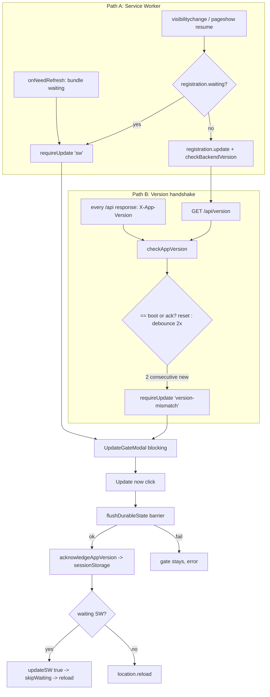
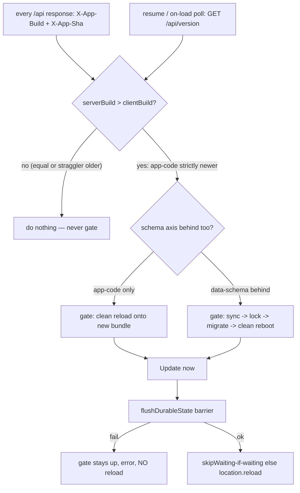

# Tbug40p — Truth-based update/migration gate (kill the "acknowledge" concept)

**Bug (prod 40p):** the blocking "A new version is ready" gate re-appears on essentially every Safari wake / return / Mac-sleep resume for Arshia (Safari 26.5, macOS, build `c454f903`) — it nags on every resume instead of "once per genuinely-newer version."

**Two objectives (both are acceptance criteria — a fix that only does #1 is incomplete):**
1. **Stop the false nagging** — the gate must never re-appear at a steady version (Safari wake / sleep / bfcache), which the truth comparison (`serverBuild > clientBuild`) guarantees.
2. **Actually land the latest code when a genuinely newer build exists, service worker included** — when `serverBuild > clientBuild`, the update path must reliably activate the new bundle (not let a stale Workbox SW keep serving old precache). See §5 escalation (update → skipWaiting → unregister+reload) and verify via `__APP_BUILD__` after reload.

**Status:** ✅ APPROVED (user, 2026-07-28). Ready for implementation.

**Approved decisions (design gate):**
1. **"Log out" = clean in-memory reboot, session cookie preserved** — after a migration/reload, tear down all in-memory app state and re-run session-init from R2; do NOT clear credentials or prompt for re-auth.
2. **Ship now** — the truth-based design fixes 40p under either Path A or Path B; Arshia's Safari SW evidence is post-deploy confirmation, not a prerequisite.
3. **Seam now, heavy path later** — build the `serverBuild > clientBuild` comparison and the decision seam, but route ALL cases to `reloadClean()` for now. Do NOT ship the data-schema sync→lock→migrate→reboot path dark/unexercised; leave it as a clearly-marked seam that a future real schema-advancing deploy wires up.

---

## Stage 0 — Classification

| Field | Value |
|-------|-------|
| **Tier** | **L** — replaces a cross-cutting version-gating subsystem, changes a new pattern (truth comparison), touches Frontend + Backend + CI, 6+ files, design-gated. |
| **Stack Layers** | Frontend (update gate + version utils), Backend (`/api/version`, `X-App-Version`), CI (`deploy-*.yml` monotonic build number). **Database: NO** — this task does not migrate DATA (see Design Q2); it only reloads onto a new bundle. A row/table would only appear if we chose to persist a monotonic version server-side, which we do NOT need (see Q1 recommendation). |
| **Files Affected** | ~8: `pwaUpdate.js`, `appVersion.js` (gutted), `updateGateStore.js`, `updateFlush.js` (unchanged in spirit, reused), `UpdateGateModal.jsx` (copy only), `version.py` / `health.py` / `main.py` (advertise build number), `vite.config.js` + `deploy-frontend.yml` + `deploy-backend.yml` + `deploy_production.sh` (emit + bake the number). Tests: `appVersion.test.js`, `pwaUpdate.test.js`, `updateGateStore.test.js`, backend `test_*_version_*.py`, an E2E spec. |
| **LOC Estimate** | ~250–350 net (much of it DELETION of the debounce/ack/candidate machinery). |
| **Test Scope** | Frontend Unit (version-compare decision tree, no-flap on mixed fleet, no re-gate on resume) + Frontend E2E (gate fires once on strictly-newer, never on resume at same version) + Backend (header/endpoint advertise the monotonic number, ordering) + a documented **manual Safari real-device** pass (SW activation is not container-verifiable). |
| **Knowledge Docs** | `.claude/knowledge/persistence-sync.md` (§T5070, §T4310 CAS, §T4315 restore-if-newer, §T5920 checkpoint), CLAUDE.md "Persistence: Gesture-Based" + "A write path must prove its copy is current". |

| Agent | Include? | Justification |
|-------|----------|---------------|
| Code Expert | No | Supervisor + this doc already mapped both paths and every file; knowledge doc covers the sync side. |
| Architect | **Yes** | This document. |
| Tester | **Yes** | Version-compare + no-flap + no-resume-gate are exactly the regressions bug39/40p prove are easy to get wrong; characterization + failing tests first. |
| Implementor | Yes | Standard. |
| Reviewer | **Yes** (fan-out) | Touches persistence/CAS-adjacent flush barrier and a blocking gate that can lock users out — high blast radius. |
| Migration | **No** | No schema/DATA migration (Q2). If Q1 lands on a server-persisted version table this flips to Yes; the recommended answer avoids it. |

---

## Root Cause

There are **two independent "you should update" paths**, re-confirmed from code:

- **Path A — service worker.** `registerSW({ onNeedRefresh })` raises `requireUpdate('sw')` when a bundle is `waiting` (`pwaUpdate.js:31`). Critically, `onReturnToApp` **re-raises `requireUpdate('sw')` on every `visibilitychange`/`pageshow` whenever `registration?.waiting` is truthy** (`pwaUpdate.js:50-58`). It gates purely on `registration.waiting`.
- **Path B — backend version handshake.** `X-App-Version` (= backend `COMMIT_SHA`) is stamped on every response (`main.py:204`) and read passively by `sessionInit.js:102` → `appVersion.checkAppVersion`, plus an active poll in `pwaUpdate.js`. It compares *server-now vs server-at-boot* with a 2-observation debounce and an `acknowledgedVersion` sessionStorage latch (`appVersion.js`).

**Why Path B is NOT the cause for Arshia (established, re-confirmed):**
- Supervisor probed `/api/version` 12/12 times → all returned `c454f903…`, which **equals** Arshia's running build `c454f903`. Path B's mismatch is `server-now ≠ server-at-boot`; with a uniform fleet every response equals his boot version, so **B cannot currently fire for him**. The whole sessionStorage/ack theory (bug39's fix) is a dead end for 40p.
- **Residual uncertainty:** the probe was from a single datacenter vantage. A regional Fly straggler machine answering an *older* sha to Arshia specifically can't be fully ruled out from CI. If such a straggler exists, B *could* fire — but then bug39's ack latch would suppress the *repeat*, and Arshia reports repeats, so a straggler alone doesn't explain "every wake." It is at most a secondary contributor.

**Leading hypothesis — Path A, a perpetually-`waiting` SW on Safari:**
- Safari discards the page on sleep/background and does a **full reload on resume**. Each fresh load re-registers the SW; if a bundle is stuck `waiting` (its `skipWaiting`/activation never landed — a known Safari class of quirk), then on **every** resume `registration.waiting` is truthy, `onReturnToApp` fires `requireUpdate('sw')`, and the blocking gate reappears. The ack latch does NOT help here: Path A never consults `acknowledgedVersion` — it gates on `registration.waiting` alone. **This exactly matches "re-appears on every wake, bug39's fix didn't touch it."**
- Why activation might not land: `registerType: 'prompt'` means `skipWaiting` only fires from the user's click via `updateSW(true)`; on Safari the `controlling`/`controllerchange` reload after `skipWaiting` is flaky, and if the user dismisses/backgrounds mid-flow, or the reload lands but a *new* build is already waiting again, the waiting SW persists.

**Exactly what client-side Safari evidence finalizes it** (NOT obtainable from CI/container — must come from Arshia's device, Web Inspector → Storage → Service Workers):
1. Is there a SW stuck in **`waiting`** state across resumes (registration shows an activated worker AND a separate waiting worker)? → confirms Path A.
2. Does the **Console** log `requireUpdate('sw')` (reason `'sw'`) vs `'version-mismatch'` when the gate reappears on resume? (add a temporary `console.info` on `requireUpdate`.) `'sw'` on resume = Path A confirmed; `'version-mismatch'` = a straggler backend (Path B) is in play after all.
3. Does clicking "Update now" once and confirming `registration.waiting` is `null` afterward *stop* the recurrence? If it recurs with `waiting` still set, `skipWaiting` is not landing on Safari.

**Honest stance:** Path A is the leading, best-fit hypothesis; the doc's target design is built to be **correct regardless of which path is firing**, because it stops gating on `registration.waiting` and stops gating on `server-now-vs-boot`, replacing both with a single truth comparison that cannot re-fire at the same running version. The Safari evidence above finalizes *which* path, but the redesign does not depend on that answer to fix the bug.

---

## Current State



Pseudocode (today):
```pseudo
// Path A — pwaUpdate.onReturnToApp (fires EVERY resume)
if registration.waiting:            // <-- gates purely on waiting SW
    requireUpdate('sw')             // <-- re-raises the blocking gate every wake  ← 40p
    return

// Path B — appVersion.checkAppVersion(version)
if bootVersion is null: bootVersion = version; return
if version == bootVersion or version == acknowledgedVersion: reset candidate; return
if version == candidateVersion: count++ else candidate = version; count = 1
if count >= 2: requireUpdate('version-mismatch')   // <-- 2-obs debounce for mixed fleet

// ack latch (bug39) — coincidental derived state, user wants it GONE
acknowledgeAppVersion(): sessionStorage[rb_ack_app_version] = gatedVersion
```

**Smells in current state:**
| Smell | Location | Impact |
|-------|----------|--------|
| Two parallel "should update" code paths | Path A (`waiting`) vs Path B (sha) | Bug39/40p live in the seam between them; each fix touches one, the other re-fires. |
| Derived/coincidental state (`acknowledgedVersion`) | `appVersion.js` | User's explicit complaint: an "ack" is meaningless data that only coincidentally suppresses the gate and otherwise causes bugs. |
| Gate keyed on a *transient runtime object* (`registration.waiting`) not on truth | `pwaUpdate.js:50` | Re-fires forever when activation doesn't land (Safari). |
| Non-orderable version | shas compared for `==` only | Can't answer "am I actually behind?"; any straggler reads as a "difference." |
| Debounce/candidate/count machinery | `appVersion.js` | Compensates for the mixed fleet *because* the comparison isn't truth-based. |

---

## Target State (truth-based)

**Core principle:** compare the **actual running client version** to the **actual server version**, both as a **monotonic orderable build number**, and gate **only when `serverBuild > clientBuild` (strictly)**. No ack, no debounce, no candidate, no gating on `registration.waiting`.

The client's own running build (`clientBuild`) is baked into the bundle at build time and is **immutable for the life of that loaded page** — it is truth, not a latched observation. Therefore:
- The same running build can never "re-detect itself" as an update (kills 40p's re-fire).
- A straggler backend answering an *older or equal* build number is `serverBuild <= clientBuild` → **no gate** (kills mixed-fleet flap without any debounce).
- Once reloaded onto the new bundle, `clientBuild` *is* the new number, so the gate cannot reappear for that version — no ack needed.



Pseudocode (target):
```pseudo
// build-number source of truth, baked at build time (see Implementation)
CLIENT_BUILD = __APP_BUILD__          // monotonic integer, immutable this page

// single comparison — replaces checkAppVersion's whole body
function checkServerVersion(serverBuild):        // serverBuild from X-App-Build header
    if serverBuild is null: return               // header missing (very old server) → ignore
    if serverBuild <= CLIENT_BUILD: return        // up-to-date OR straggler → NEVER gate
    // strictly newer server bundle exists
    requireUpdate({ appCodeNewer: true })

// resume handler — NO LONGER gates on registration.waiting
function onReturnToApp():
    registration?.update()            // let SW discover a new bundle (mechanism, not gate)
    pollServerVersion()               // GET /api/version → checkServerVersion
    // note: we do NOT requireUpdate() just because a SW is waiting

// runUpdate (gesture) — unchanged barrier, simplified tail
async function runUpdate():
    if authenticated: await flushDurableState()   // T5070 barrier; fail → keep gate up
    if waitingProbe(): await updateSW(true)       // let a waiting SW activate+reload
    else: location.reload()                        // truth-based reload lands the new bundle
    // NO acknowledgeAppVersion — nothing to remember; the new bundle IS the new build
```

**Deleted:** `appVersion.js`'s `bootVersion`/`candidateVersion`/`candidateCount`/`gatedVersion`/`acknowledgedVersion`, `readAckVersion`, `acknowledgeAppVersion`, the `ACK_VERSION_KEY` sessionStorage read/write, and the 2-observation debounce. `checkAppVersion(sha)` becomes `checkServerVersion(serverBuild)` — a pure `>` comparison against the baked constant.

---

## Implementation Plan

### 1. A monotonic, orderable build number (the crux — Design Q1)

Git shas are **not orderable**, so "client < server" is undefined and a straggler answering an older sha would falsely read as "behind." Introduce a monotonic integer that **only ever increases across deploys**, advertised alongside the sha (sha stays, for logs/bug reports/human correlation).

**Source (recommended): CI-provided, no server state, no DB.**
- **GitHub Actions** exposes `github.run_number` (monotonic per-workflow) — but frontend and backend are *separate* workflows with independent run numbers, so they'd diverge. Instead use a **commit-count**: `git rev-list --count HEAD` on `master` is monotonic, identical for a given commit regardless of which workflow builds it, and requires zero stored state. This is the recommended orderable number for BOTH frontend and backend, so a frontend build and the backend built from the same commit carry the **same** build number.
  - **Frontend:** `vite.config.js` already runs git. Add `const buildNumber = Number(execSync('git rev-list --count HEAD'))` and `define: { __APP_BUILD__: buildNumber, __COMMIT_HASH__: ... }`. `deploy-frontend.yml` checks out full history (`fetch-depth: 0`) so the count is correct.
  - **Backend:** compute in CI and pass as a build-arg, mirroring `COMMIT_SHA`:
    - `deploy-backend.yml`: add `APP_BUILD=$(git rev-list --count ${{ github.sha }})` and `--build-arg APP_BUILD=$APP_BUILD` (needs `actions/checkout@v4` with `fetch-depth: 0`).
    - `deploy_production.sh`: `app_build=$(git rev-list --count HEAD)` → `--build-arg APP_BUILD="$app_build"`.
    - `Dockerfile`: `ARG APP_BUILD=0` / `ENV APP_BUILD=${APP_BUILD}` next to `COMMIT_SHA`.
    - `version.py`: `APP_BUILD = int(os.getenv("APP_BUILD", "0"))`; `"dev"` local runs get `0` (never gates a dev client, whose own `__APP_BUILD__` is also its local commit count ≥ 0 — see edge note below).
- **The client learns its own build** from `__APP_BUILD__` (vite define), exactly as it already learns its sha from `__COMMIT_HASH__` (`vite.config.js:16`, logged at `main.jsx:21`). No network needed for the client's own number.

**Server advertises it** on `X-App-Build` (new response header, alongside the existing `X-App-Version` sha) and in `GET /api/version` (`{ version: sha, build: APP_BUILD }`). `main.py`'s `AppVersionHeaderMiddleware` adds one line: `response.headers["X-App-Build"] = str(APP_BUILD)`.

**Why not a deploy timestamp?** A timestamp is monotonic too, but commit-count is deterministic from the artifact (no clock, reproducible, identical across FE/BE for the same commit), so a frontend and its matching backend agree exactly — important for the mixed-fleet reasoning below. **Recommended: commit-count.**

**Edge — local dev (`APP_BUILD=0` server) vs a real client:** a client built locally has `__APP_BUILD__ = git rev-list --count HEAD` (some large N) while a local `uvicorn` server advertises `0`. `0 > N` is false → the dev client never gates against its own dev server. A deployed client (N) hitting a mis-configured server that forgot the build-arg (`0`) also never gates (`0 > N` false) — a missing number is inert, never a false gate. Correct failure mode.

### 2. Two version axes (Design Q2) — what triggers reload vs data-migration

CLAUDE.md keeps **app-code version** and **data-schema version** deliberately independent. Map them:

| Axis | Where it lives | What a bump means | Gate action |
|------|----------------|-------------------|-------------|
| **App-code build** | `__APP_BUILD__` (client) vs `X-App-Build` (server), the new monotonic int | New JS bundle / backend code shipped | **Clean reload onto the new bundle** — flush durable state (barrier) then reload. NO data migration. |
| **Data-schema version** | `PRAGMA user_version` (per-DB) / R2 `x-amz-meta-db-version` sync version | The DB schema/shape changed and needs the migration runner | **Heavy path only when actually behind:** sync → lock editing → migrate → clean reboot. |

**Do NOT force a data migration on a pure frontend code bump.** Almost every deploy is app-code-only; those must be the light "reload clean" path. The heavy sync→lock→migrate→logout path is reserved for the (rare) deploy that also advances the data schema.

**How the client knows the schema axis moved:** the backend already owns schema version (migration runner, `PRAGMA user_version`). Advertise the server's **head schema version** too — e.g. `X-Data-Schema: <PROFILE_DB_RUNNER.latest_version>` and include it in `/api/version` (`{ version, build, schema }`). The client compares it to the schema version its current session was initialized against (surfaced once at session-init). Decision tree at gate time:
```pseudo
if serverBuild <= clientBuild:               noop                     // up to date / straggler
elif serverSchema == clientSchema:           reloadClean()            // app-code only (the common case)
else (serverSchema > clientSchema):          syncLockMigrateReboot()  // rare, data axis moved
```
**Recommendation:** implement the app-code path fully now (it fixes 40p), and implement the schema-axis branch as a **thin, correct seam** that today almost always evaluates to `reloadClean()` — the migration runner is already server-side and admin-triggered (persistence-sync.md §Migration runner), so client-side "migrate" here means **re-run session-init cleanly against the already-migrated server DB**, not run migrations in the browser. Keep the T5070 "step-5 migration seam" clean/no-op posture; this design just routes to it only on a real schema advance.

### 3. "Log out" semantics (Design Q3)

Forcing real re-authentication on every deploy (multiple/day) is unacceptable UX. **Recommendation: "log out" = a clean in-memory app-state reboot, NOT clearing the auth session.**
- Keep the `rb_session` cookie. On the reload, session-init re-runs from R2 (`user_session_init`) and rebuilds all in-memory hook/store state from the canonical server copy — which is exactly what a fresh page load already does. This gives the user's stated goal ("log in cleanly on the new version") without a login prompt.
- The full page reload already tears down all React/Zustand/hook state; there is nothing extra to clear for the app-code path.
- **Only clear credentials (true logout) if** a deploy ever changes the auth/session contract itself (rare; would be its own flagged task). Default is the clean reboot.
- This also honors the user's real intent: eliminate *derived* client state that drifts across versions. A clean reboot from R2 discards any stale in-memory state and re-derives everything from truth — no ack, no latched boot version.

### 4. Sync-before-migrate + edit-lock (Design Q4) — reuse existing mechanisms

The pieces already exist; wire them, don't reinvent:
- **Sync barrier:** `flushDurableState()` (`updateFlush.js`) is already the pre-reload drain+verify barrier (drains overlay retry queue; conditional framing full-state save gated on `framingChangedSinceExport`; `POST /api/sync/flush-verify` awaits R2 confirmation). `runUpdate` already calls it and **keeps the gate up on failure** (`updateGateStore.js:74-81`) — never reload/migrate on unsynced state. This IS the T5070 barrier; keep it verbatim for both the app-code and schema paths.
- **CAS / restore-if-newer safety:** the flush's writes go through the normal write paths, which are governed by T4310 CAS (refuse stale upload) + T4315 restore-if-newer + T5920 checkpoint-or-refuse (persistence-sync.md). A `flush-verify` that comes back 503 `sync_failed` (pending marker still set) throws → gate stays up. So "never migrate on unsynced state" is already enforced structurally; the design must NOT add any reload path that bypasses `flushDurableState`.
- **Edit-lock during migration:** the gate itself is the lock. `UpdateGateModal` is **blocking and non-dismissible** (`z-[60]`, no X/backdrop/ESC), painted above the login surface — while it's up the user cannot interact with the editor, so no new gestures/edits can occur. That IS "lock editing during migration." For the heavy schema path, the sequence is: gate appears (lock) → click → `flushDurableState` (sync) → [server DB already migrated by admin-run runner] → clean reboot (session-init pulls the migrated copy). No in-browser DB mutation, so there is no partially-migrated local state to protect beyond what the barrier already guarantees.
- **Flush failure surfacing:** already wired — `phase:'error'`, red error box, button flips to "Try again", gate stays up (`UpdateGateModal.jsx:51-62`). Reuse unchanged.

### 5. Path A (service worker) under the new model (Design Q5)

**The truth comparison SUBSUMES the *decision to gate*; the SW remains the *mechanism* that swaps the bundle.** Concretely:
- **Stop gating on `registration.waiting`.** Delete the `if (registration?.waiting) requireUpdate('sw')` branch in `onReturnToApp` (`pwaUpdate.js:50-58`) and the `onNeedRefresh → requireUpdate('sw')` auto-gate. A waiting SW no longer, by itself, raises the blocking gate. **This is the direct fix for 40p:** a perpetually-waiting SW on Safari can no longer re-nag on every resume, because gating is now driven solely by `serverBuild > clientBuild`, which is false at a steady version.
- **Keep the SW as the activation mechanism.** `registration.update()` on resume still lets Workbox discover/stage a new bundle. When the truth comparison *does* fire the gate (server genuinely newer) and the user clicks, `runUpdate` still prefers `updateSW(true)` when `waitingProbe()` is true (activates the waiting bundle in one step) and falls back to `location.reload()` otherwise (`updateGateStore.js:96-105`). Keep `setWaitingProbe` — it's the right race-free "is a bundle staged?" signal for choosing skipWaiting-vs-reload; it just must **not** be a *gating trigger*.
- **Robust to Safari skipWaiting not landing — the fallback must BUST the stale SW, not just reload.** This is Objective 2 ("actually get onto the latest code, and the service worker is reloaded"). A plain `location.reload()` while an old Workbox SW controls the page is served the **stale precached `index.html`** → old bundle → `clientBuild` stays `< serverBuild` → the truth gate correctly re-fires but a bare reload can never escape it. So `runUpdate`'s reload path is an ordered escalation, each step time-boxed:
  1. `await registration.update()` — stage the newest SW (so a bundle is actually waiting to activate).
  2. If a worker is now `waiting`: `updateSW(true)` (skipWaiting). Its `controllerchange`/`controlling` listener performs the reload; the newly-activated SW serves the NEW precache → new bundle.
  3. **If `controllerchange` doesn't fire within a short timeout (Safari quirk):** do NOT settle for a plain reload — first neutralize the stale controller: `await registration.waiting?.postMessage({type:'SKIP_WAITING'})`, and if still not controlling, `await registration.unregister()` (removes the controlling SW so the next load bypasses its cache), THEN `location.reload()`. A post-unregister load fetches `index.html` fresh from the network/CDN and re-registers the new SW.
  - **Verification, not faith:** after any reload path, boot re-reads `__APP_BUILD__`. If it now equals/`>=` `serverBuild`, the update landed and the gate stays down. If it is STILL `< serverBuild` (CDN lag / offline), the gate reappears (visible, correct) — but because step 3 unregisters the stale SW, the *next* reload is served fresh, so the user converges rather than looping on the same cached bundle. Never auto-reload in a spin; the gate is a blocking modal requiring a user click, so escalation only advances on gesture.

### 6. Mixed-fleet correctness (Design Q6)

The monotonic-number + strict-greater rule is exactly what makes flap impossible:
- A client on build `N` transiently hitting an older straggler backend on build `N-1`: `N-1 > N` is **false** → no gate. No debounce needed; the old 2-observation `candidateCount` machinery is deleted.
- A client on `N` hitting the new backend `N+1`: `N+1 > N` true → gate once. After reload the client is `N+1`; a subsequent hit to a straggler `N` is `N > N+1` false → no re-gate. Convergence is monotone and self-terminating.
- Because FE and BE share the commit-count, a frontend on build `N` and the backend deployed from the same commit both report `N` — the axes stay aligned; the client never gates against a backend that is actually its own peer.

---

## Design Decisions (summary of recommendations)

| # | Question | Recommendation |
|---|----------|----------------|
| Q1 | Orderable version | **`git rev-list --count HEAD`** (commit-count) baked into both FE (`__APP_BUILD__` vite define) and BE (`APP_BUILD` build-arg → `X-App-Build` header + `/api/version`). Monotonic, deterministic, identical across FE/BE for a commit, no server state/DB. Gate only when `serverBuild > clientBuild` strictly. |
| Q2 | Two axes | App-code build bump → **clean reload** (common case). Data-schema (`PRAGMA user_version`) advance → **sync→lock→migrate→reboot**. Never force data migration on a frontend bump. Implement app-code path fully; schema branch as a thin seam that reboots into the already-server-migrated DB. |
| Q3 | "Log out" semantics | **Clean in-memory app-state reboot, session cookie preserved** — re-run session-init from R2, no re-auth prompt. Real credential logout only if a deploy changes the auth contract (separate flagged task). |
| Q4 | Sync + edit-lock | Reuse `flushDurableState()` barrier (fail → gate stays up, never reload on unsynced state) + the blocking `UpdateGateModal` as the edit-lock. No new sync machinery; CAS/T4315/T5920 already protect the writes. |
| Q5 | Path A / SW | Truth comparison subsumes the *gate trigger*; SW stays the *swap mechanism*. Delete `registration.waiting`-based gating; keep `waitingProbe` for skipWaiting-vs-reload choice; add a `updateSW(true)` timeout → `location.reload()` fallback for Safari. |
| Q6 | Mixed fleet | Strict-greater on a shared monotonic number makes flap structurally impossible; debounce/candidate/ack all DELETED. |

---

## Open Questions & Risks (need user's call at the gate)

1. **Confirm the root cause before shipping.** The redesign is correct regardless of path, but we should still capture the 3 Safari Web-Inspector observations (waiting-SW present? reason on resume? does one update clear it?) from Arshia to *confirm* Path A and to catch a secret straggler (Path B). **Decision:** ship the redesign now, or wait for Arshia's device evidence first? **Recommendation: ship** — the design fixes the bug under either path and removes the fragile machinery; evidence is confirmation, not a blocker.
2. **Always-reload vs conditional (Q2 depth).** Do we want the schema-axis branch implemented now, or ship app-code-only truth gating first and add the schema branch when the first real schema-advancing deploy is on the horizon? **Recommendation:** implement the *seam and comparison* now (cheap, and `X-Data-Schema` is a one-line add) but let it route to `reloadClean()` until a schema deploy needs it — avoids untested heavy-path code shipping dark.
3. **Logout semantics (Q3) — user's explicit word was "LOG THE USER OUT."** We recommend the *clean reboot* interpretation (no re-auth), which meets "log in cleanly on the new version" without punishing users with a login prompt on every deploy. **Confirm** this reading is acceptable, or the user genuinely wants credential clearing (worse UX, multiple deploys/day).
4. **Commit-count monotonicity assumes linear master history.** `git rev-list --count HEAD` can *equal* across a force-push/rebase that rewrites master, or a merge-commit topology could make two commits share a count. Master here is push-to-deploy and effectively linear, so this is low-risk, but note it: if master history is ever rewritten, two deploys could carry the same build number (a genuinely-newer server would then read as equal → no gate, a *miss*, never a false gate). **Recommendation:** accept for now (fail-safe direction); revisit only if master topology changes.
5. **`fetch-depth: 0` in CI.** `git rev-list --count` needs full history; both deploy workflows currently use default shallow checkout. Adding `fetch-depth: 0` is required and slightly slows checkout. Low risk, flagged for completeness.
6. **Risk — a genuinely-newer build that forgot the build-arg reads as `0` → never gates (a miss).** Mitigation: CI wiring makes `APP_BUILD` mandatory in both workflows + `deploy_production.sh`; add a startup log `APP_BUILD=<n>` and a one-line assertion in the deploy scripts that the arg is non-zero, so a forgotten arg is caught at deploy, not silently in prod.
7. **Risk — removing the debounce could surface a real transient during a rolling deploy.** But strict-greater already handles it (a straggler is `<=`, never `>`), and a client that hits the *new* machine mid-rollout *should* gate. No debounce needed; the debounce only ever existed to paper over non-orderable shas. Verified by the mixed-fleet reasoning (Q6).
8. **Characterization tests first (L-tier + persistence-adjacent).** Before deleting the ack/debounce machinery, pin current behavior and add the new failing tests: (a) resume at equal build never gates; (b) `serverBuild > clientBuild` gates once; (c) straggler `serverBuild < clientBuild` never gates; (d) waiting SW alone never gates; (e) flush failure keeps gate up. Then flip.

---

**Awaiting approval.** On approval: Tester (Phase 1 failing tests) → Implementor → Reviewer fan-out → Tester (Phase 2) → manual Safari real-device verification (documented, not container-verifiable) → complete.
