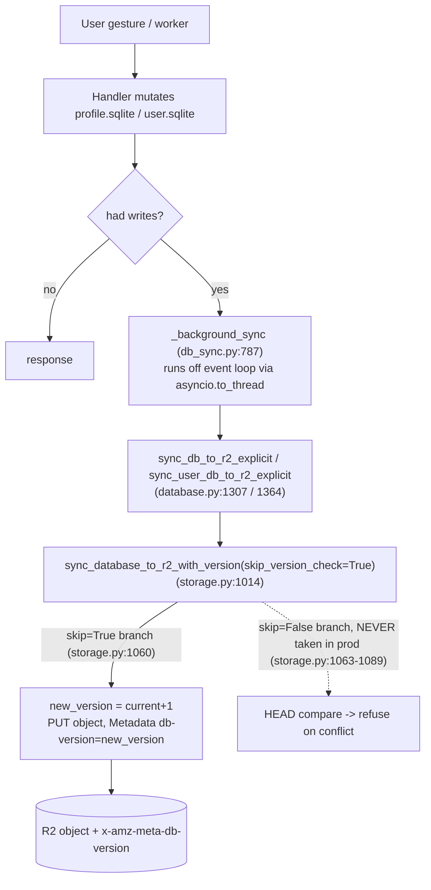
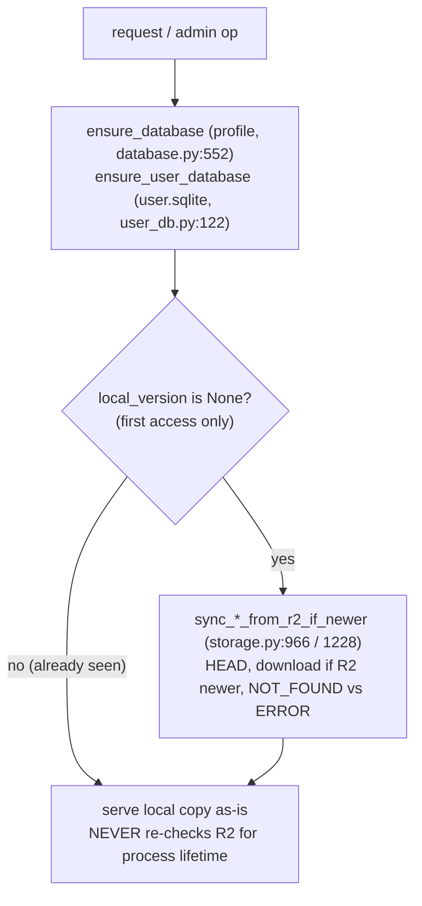
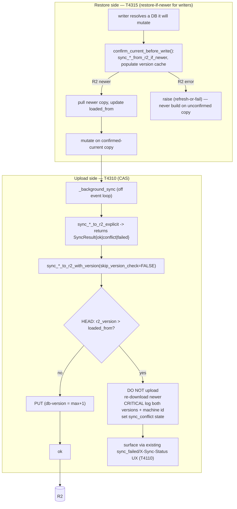

# T4310 + T4315 — CAS Uploads × Restore-if-Newer (Combined Design)

**Status:** DESIGN — awaiting user approval (L-tier, design-gated)
**Epic:** [durability-sync](EPIC.md) · Audit items B2 (T4310) + the 2026-07-24 restore sibling (T4315)
**Author:** Architect agent
**Designed together because:** the epic's own conclusion — *CAS alone still serves stale
reads; restore-if-newer alone still races the upload; neither alone closes the loop* (EPIC.md
§ Shared design decisions #3). They also share five files
(`storage.py`, `db_sync.py`, `database.py`, `materialization.py`, `user_db.py`), so they cannot
be fanned out in parallel.

---

## 0. Archaeology — why is `skip_version_check=True` at every call site?

**Answer (recorded per T4310 Step 1): pure latency, from T1020. NOT false-positive conflicts.**

The conflict check (T950) is fully implemented in
`storage.py:sync_database_to_r2_with_version` (`storage.py:1014`, conflict branch
`storage.py:1078-1089`) and its user.sqlite twin (`storage.py:1278`, conflict branch
`storage.py:1319-1335`). It HEADs R2, and if `r2_version > current_version` it **refuses the
upload, re-downloads the newer copy, and returns `(False, r2_version)`**. The logic is correct
and already loud.

It was compiled out by **T1020 "Profile R2 Sync and Make It Faster"**
([docs/plans/tasks/T1020-fast-r2-sync.md](../T1020-fast-r2-sync.md)). T1020 measured R2 sync at
1.7–3.0s per write — **61% of Frame Video latency** — with the sync running *synchronously on the
request thread*. Its "Skip version check when single-device" / "Cache version locally — skip HEAD
on writes" idea removed the ~200-500ms HEAD round-trip. The `skip_version_check` flag and its
regression test (`test_performance.py:201 TestR2SyncSkipHead` — "HEAD should NOT be called") are
that optimization. T1020's own note even scoped the intended safe version: *"Only HEAD on session
start to detect conflicts."*

Two consequences the design MUST honor:

1. **The HEAD was expensive only because it was on the request thread.** T2720 later added the
   `_SYNC_LOCK_TIMEOUT = 0.5s` defer (`db_sync.py:201`) precisely because a synchronous sync could
   block the response ~14s behind the export worker's upload lock. **Re-adding a synchronous HEAD
   to the request path is the T2720 regression.** Since T3250/T4050, the sync already runs in
   `_background_sync` off the event loop (`asyncio.to_thread`, `db_sync.py:869-902`) — for
   fire-and-forget writes *after* the response is sent, for durable writes awaited inside the
   already-held write lock (accepted cost per T4320). **The CAS HEAD belongs there, where it adds
   zero p50 request latency for fire-and-forget and one HEAD RTT only to the already-durable set.**

2. **Flipping the flag is not enough — there is a latent clobber even with the check on.** The
   conflict branch is guarded by `current_version is not None` (`storage.py:1078`). A writer whose
   in-memory loaded-from version is `None` (cold cache background worker, a path that never
   restored-if-newer) *skips the conflict check entirely* and uploads `new_version = r2_version+1`
   on top of whatever R2 holds. So CAS is only meaningful if the writer actually knows the version
   it loaded from — which is exactly the guarantee T4315 (restore-if-newer, populate the version
   cache before writing) provides. **This is the mechanical reason the two interlock.**

---

## 1. Current State

### 1a. How a write flows local → R2 today



Version metadata is set on every PUT: `ExtraArgs={"Metadata": {"db-version": str(new_version)}}`
(`storage.py:1125` profile, `storage.py:1367` user). The loaded-from version lives in two
in-memory dicts — `_user_db_versions` (profile) and `_user_sqlite_versions` (user.sqlite,
`database.py:1408`) — updated by `set_local_db_version` / `set_local_user_db_version` after every
successful upload and every restore.

**Every prod upload call site passes `skip_version_check=True`:**

| Call site | Path kind | File:line |
|-----------|-----------|-----------|
| `sync_db_to_cloud` | request-path (legacy, conflict-aware wrapper) | `database.py:1264` |
| `sync_db_to_r2_explicit` | background/worker + middleware `_background_sync` | `database.py:1351` |
| `sync_user_db_to_r2_explicit` | background/worker + middleware `_background_sync` | `database.py:1391` |
| `retry_pending_sync` (profile + user) | request-path retry worker | `db_sync.py:275`, `db_sync.py:288` |
| `_graceful_shutdown` (profile + user loops) | SIGTERM worker | `main.py:347`, `main.py:374` |

Note a **second smell**: two sync orchestrators exist with *different* conflict awareness.
`sync_db_to_cloud` (`database.py:1241`) already returns `"ok" | "conflict" | "failed"` and updates
local tracking on conflict — but the middleware does NOT call it; `_background_sync` calls the
`*_explicit` functions (`database.py:1307/1364`) which collapse everything to a **bool** and can
never report `"conflict"`. The middleware's own status enum already has a `"conflict"` arm
(`db_sync.py:904`) that is currently dead because nothing below it ever emits conflict.

### 1b. How a restore flows R2 → local today



The restore-if-newer primitive **already exists and is correct**:
`sync_database_from_r2_if_newer` (`storage.py:966`) and `sync_user_db_from_r2_if_newer`
(`storage.py:1228`) both HEAD, download only when R2 is newer, and return
`(was_downloaded, version, was_error)` distinguishing NOT_FOUND from ERROR. The gap is purely
*when they are called*: only behind the `local_version is None` first-access gate
(`database.py:579`, `user_db.py:147`). Once a machine has the file, it serves that snapshot for
the whole process lifetime.

### 1c. Both proven failure modes (with file:line evidence)

**Mode A — multi-machine both-live race (T4310's original framing).**
Machine pinning is a cookie + circuit-breaker (`db_sync.py:454-478`); the per-user write lock is
**per-process** (`db_sync.py:188-230`). When a pinned machine dies mid-session, another serves the
user from a fresh download. If both hold the DB across any window (e.g. an in-flight export worker
on A syncs after B took over), both compute `new_version = local+1` and PUT. With
`skip_version_check=True` the second write silently wins; **db-version metadata shows no anomaly.**

**Mode B — single-server stale-writer force-push + machine-replacement restore gap
(the 2026-07-24 prod incident, arshia).**
- *Stale-writer force-push:* `move_reels` resolved the target profile through the read-optimized
  `ensure_profile_db_local` (`materialization.py:53`), which returned the **stale local copy on an
  R2 blip**, then force-pushed `[stale snapshot + new row]` — reverting the profile and deleting
  reels moved earlier (the reverted `sqlite_sequence` even let the next insert reuse the freed id,
  hiding the loss). Point-fixed by `require_fresh=True` (a5ff3e48, `materialization.py:84-91`) —
  *per caller, not the general rule.*
- *Machine-replacement restore gap:* an admin credit grant landed only in machine A's local
  `user.sqlite`; the middleware synced the SESSION user (admin), not the grantee, so it never
  reached R2. The next **deploy replaced the machine** (`ensure_user_database` sees
  `local_version is None`, `user_db.py:147`) and pulled the R2 copy that never saw the grant — the
  400 credits were gone. Point-fixed by `_persist_target_user_db` + `_refresh_target_user_db`
  (fec38d12/e1e324ac, `admin.py:63`/`admin.py:104`) and by `TrackedConnection` owner tracking
  (b9302790 — the middleware now syncs every DB a request wrote, `db_sync.py:688-692`,
  `db_sync.py:912-943`). *All three are per-caller / per-surface, not the general guarantee.*
- *Live-machine out-of-band repair is futile:* a direct +400 R2 edit while a session is live was
  clobbered within minutes — the live machine never re-reads (`local_version is not None`) and its
  next force-push overwrote the edit.

**Correction to a task claim (must be accurate in the design):** T4315 says "the profile-DB
request path already does the right thing: `ensure_database` + `session_init` restore-if-newer on
each request." Ground truth: `ensure_database` restores **only** on the `local_version is None`
first-access gate (`database.py:579`; comment `database.py:572` "We do NOT check R2 version on
every request"), and `session_init` just calls `ensure_database` (`session_init.py:93/129/160`).
So **profile.sqlite is also first-access-only** — it is *not* re-pulled per request. Profile
writes are nonetheless less exposed than user.sqlite because (a) they ride the request path where
a machine replacement re-initializes via the same gate, and (b) the acute lenient-writer hole
(`ensure_profile_db_local`) is already `require_fresh`-guarded for move_reels. The design does
**not** rely on the incorrect "per-request restore" claim.

---

## 2. Target State



**Design principles applied:**
- [ ] **Single code path for conflict:** collapse the two orchestrators — the `*_explicit`
  functions return a 3-state result (not bool) so `_background_sync`'s existing `"conflict"` arm
  (`db_sync.py:904`) becomes live instead of dead. One sync-status type end to end.
- [ ] **CAS runs where latency doesn't matter:** the HEAD lives inside `_background_sync`'s
  `asyncio.to_thread` (already off the request thread) and the shutdown/worker paths — never on the
  request thread. `skip_version_check` stays `True` *only* on the legacy synchronous
  `sync_db_to_cloud` request wrapper, which prod does not use; it is left untouched or deleted.
  **[CORRECTION, post-implementation reviewer round 2]:** this premise was FALSE — prod calls
  `sync_db_to_cloud` via `POST /api/retry-sync` (`health.py`). It now also runs with
  `skip_version_check=False`: it's a manual-retry gesture off the hot path, so the HEAD is free,
  and leaving it `True` let a confirmed-elsewhere conflict force-push a stale local DB over R2 on
  retry (and regress the R2 version backwards, disarming CAS for every other machine).
- [ ] **Restore-if-newer generalized, not per-caller:** one shared `confirm_current_before_write`
  helper replaces the copy-pasted `_refresh_target_user_db` (admin) and the `require_fresh` flag
  (move_reels), so any writer resolving another user's/profile's DB inherits refresh-or-fail.
- [ ] **Freeze-and-escalate recovery** (not auto-merge): a conflict stops syncing that user, logs
  CRITICAL with both versions + `FLY_MACHINE_ID`, and surfaces through the existing
  `.sync_pending` / `X-Sync-Status: failed` machinery (T4110/T4900 already render a persistent
  "edits aren't saving — Retry" affordance). Automatic reconciliation is explicitly out of scope.

### Target behavior (pseudocode)

```pseudo
# T4310 — upload side, inside the already-async _background_sync / worker / shutdown
sync_profile(user_id, profile_id):
    loaded_from = get_local_db_version(user_id, profile_id)   # the version we restored/last-pushed
    result = sync_database_to_r2_with_version(
        ..., current_version=loaded_from, skip_version_check=False)   # CAS ON
    match result:
        ok(new_version):     set_local_db_version(new_version); clear conflict
        conflict(r2_version): # storage.py already re-downloaded the newer copy
            set_local_db_version(r2_version)
            log CRITICAL "[SYNC_CONFLICT] user=.. loaded=.. r2=.. machine=$FLY_MACHINE_ID"
            mark_sync_conflict(user_id)          # feeds X-Sync-Status, freeze further pushes
        failed:              mark_sync_pending(user_id)   # existing retry path

# T4315 — restore side, shared write-path guard
confirm_current_before_write(user_id, profile_id=None):   # user.sqlite when profile_id is None
    downloaded, version, was_error = sync_*_from_r2_if_newer(...)   # EXISTING primitive
    if was_error: raise SyncRefreshFailed        # refresh-or-fail (generalized require_fresh)
    if version is not None: set_local_*_version(version)   # gives CAS a real loaded_from baseline

# every writer that resolves a NON-request DB (admin grant, webhook, move_reels, cross-profile)
# calls confirm_current_before_write(...) before mutating, instead of its own bespoke refresh
```

The CAS conflict branch in `storage.py` **already re-downloads** the newer copy
(`storage.py:1084-1089`), so the restore side is partly self-healing from the upload side — a
nice interlock: a machine that loses a CAS conflict ends the request holding fresh data for the
next write.

---

## 3. How the two tasks split, and the deploy ordering

### What lands where

| Concern | Task | Files |
|---------|------|-------|
| 3-state `SyncResult` from `*_explicit` (retire the bool) | **T4310** | `database.py` |
| Turn CAS on in `_background_sync` (Stage 2) | **T4310** | `db_sync.py`, `database.py` |
| Turn CAS on in shutdown + retry + export/worker syncs (Stage 1) | **T4310** | `main.py`, `db_sync.py:retry_pending_sync`, worker callers |
| `sync_conflict` state + CRITICAL log + surface on existing `sync_failed` UX | **T4310** | `db_sync.py`, `storage.py` (marker family) |
| `user.sqlite` restore-if-newer for write paths (generalize `_refresh_target_user_db`) | **T4315** | `user_db.py`, `database.py`, `admin.py` |
| Shared `confirm_current_before_write` / refresh-or-fail (generalize `require_fresh`) | **T4315** | `materialization.py`, `user_db.py` |
| No force-push of empty/materialized DB on R2 ERROR (structural, not per-caller) | **T4315** | `materialization.py` |
| Audit `_open_profile_db` / `get_user_db_connection(other_user)` writers | **T4315** | `materialization.py`, callers |

### Shared-file sequencing so a reviewer can trust each commit

Both tasks touch `db_sync.py`, `storage.py`, `database.py` (T4315 also `materialization.py`,
`user_db.py`). To keep reviewable units < ~200 lines and mechanical:

1. **T4310-c1 (mechanical, no behavior):** introduce the `SyncResult` 3-state and thread it through
   `sync_db_to_r2_explicit` / `sync_user_db_to_r2_explicit` while callers still pass
   `skip_version_check=True` — behavior identical, just a richer return type. Reviewer verifies "no
   behavior change."
2. **T4310-c2 (behavior — Stage 1):** flip `skip_version_check=False` on the **non-request** paths
   (shutdown `main.py`, `retry_pending_sync`, export/worker syncs) + conflict state + CRITICAL log.
   Lowest blast radius (no request-latency surface).
3. **T4310-c3 (behavior — Stage 2):** flip CAS on in the request-path `_background_sync`; wire the
   `"conflict"` arm to the `sync_conflict` marker and `X-Sync-Status`.
4. **T4315-c1:** add `confirm_current_before_write`; re-point admin (`_refresh_target_user_db`) and
   move_reels (`require_fresh`) at it (generalize, delete the per-caller bodies).
5. **T4315-c2:** give `ensure_user_database` a write-path restore-if-newer sibling; make the
   empty-DB force-push structurally NOT_FOUND-only; audit remaining `_open_profile_db` writers.

### Recommended deploy ordering: **T4310 first, then T4315 — separate deploys are safe.**

- **T4310 is fail-safe by construction and can ship alone.** CAS-without-restore's worst case is a
  *refused* upload + re-download + loud conflict state — it can only *prevent* a clobber, never
  cause one. It immediately closes the highest-severity property (silent last-write-wins) for both
  Mode A and Mode B. The `current_version is None` latent hole (§0.2) is not *worsened* by T4310 —
  it exists today; T4310 simply doesn't fully fix it until T4315 populates the baseline.
- **T4315-first-alone is also safe but lower value:** it re-pulls before writes (reducing stale
  reads) but leaves the two-writer upload race open (no CAS), so the loop stays open.
- **Therefore:** deploy T4310 to close the silent-clobber hole now; deploy T4315 next to eliminate
  the stale reads that would otherwise make CAS conflicts *routine* rather than *rare* (and to give
  every writer a real `loaded_from` baseline so CAS's `current_version is not None` guard always
  holds). **They may ship in consecutive deploys; T4310 must not block on T4315.** The interlock is
  never "half-applied in a dangerous way" because the only intermediate state (CAS on, restore
  first-access-only) is strictly safer than today.

---

## 4. Implementation Plan (files → pseudocode deltas)

### T4310

**`storage.py`** — no logic change to the CAS branch itself (it is already correct at
`1078-1089` / `1319-1335`); optionally surface the machine id in the existing CRITICAL log.

```pseudo
# storage.py:1079  (add machine id to the already-present conflict log)
- logger.error(f"[SYNC] Version conflict for {user_id}: loaded v{current_version}, R2 has v{r2_version}...")
+ logger.critical(f"[SYNC_CONFLICT] user={user_id} loaded=v{current_version} r2=v{r2_version} "
+                 f"machine={FLY_MACHINE_ID} — NOT uploading, re-downloading")
```

**`database.py`** — 3-state result + CAS on for the explicit functions.

```pseudo
# database.py:1307 sync_db_to_r2_explicit / :1364 sync_user_db_to_r2_explicit
- def sync_db_to_r2_explicit(...) -> bool:
+ def sync_db_to_r2_explicit(...) -> SyncResult:      # ok | conflict | failed
      current = get_local_db_version(user_id, profile_id)
-     success, new_version = sync_database_to_r2_with_version(..., skip_version_check=True, ...)
+     success, new_version = sync_database_to_r2_with_version(..., skip_version_check=False, ...)
      if success:                      set_local_db_version(new_version); return SyncResult.ok
      if new_version is not None:      set_local_db_version(new_version); return SyncResult.conflict  # storage re-downloaded
      return SyncResult.failed
```

**`db_sync.py`** — `_background_sync` consumes the 3-state; conflict arm already exists
(`db_sync.py:904`) — make it set a distinct conflict marker rather than reuse "failed" verbatim.

```pseudo
# db_sync.py:835/855/893/900  (calls already run via asyncio.to_thread — no request-thread HEAD)
profile_res = await asyncio.to_thread(sync_db_to_r2_explicit, user_id, profile_id, lock_timeout)
if profile_res == SyncResult.conflict: sync_status = "conflict"; mark_sync_conflict(user_id)
# retry_pending_sync (db_sync.py:275/288): same flip to skip_version_check=False + conflict handling
```

**`main.py`** — shutdown loops (`main.py:347`, `main.py:374`) flip to `skip_version_check=False`;
on conflict, log CRITICAL and leave `.sync_pending` (a machine going down mid-conflict must not
overwrite R2 with its stale copy).

### T4315

**`user_db.py`** — write-path restore-if-newer sibling of `ensure_user_database`.

```pseudo
# user_db.py — new, or a require_fresh param on ensure_user_database
def ensure_user_database_fresh(user_id):        # for WRITE callers only
    ensure_user_database(user_id)               # existing first-access restore + schema
    path = _get_user_db_path(user_id)
    downloaded, version, was_error = sync_user_db_from_r2_if_newer(user_id, path,
                                          get_local_user_db_version(user_id))   # EXISTING primitive
    if was_error: raise SyncRefreshFailed(user_id)      # refresh-or-fail
    if version is not None: set_local_user_db_version(user_id, version)
# reads keep calling ensure_user_database unchanged (lenient — latency preserved)
```

**`admin.py`** — `_refresh_target_user_db` (`admin.py:63`) becomes a thin call to the shared
helper (delete the bespoke body; keep the visible warning behavior).

**`materialization.py`** — `require_fresh` (`materialization.py:84`) is the model; expose it as the
shared writer rule and make the empty-DB path NOT_FOUND-only.

```pseudo
# materialization.py:84  (already correct for move_reels; make it the rule)
if was_error and require_fresh: raise ProfileDBRefreshFailed(...)     # keep
# _ensure_empty_profile_db must run ONLY on genuine NOT_FOUND, never on ERROR (structural)
# audit: every _open_profile_db / get_user_db_connection(other_user) with write intent
#        must route through a require_fresh / confirm_current_before_write path first
```

---

## 5. Migration / rollout considerations

- **No metadata backfill needed.** Every R2 object already carries `x-amz-meta-db-version`
  (`storage.py:1125/1367`); legacy objects without it read as `0` and the conflict guard
  (`r2_version > 0 and current_version is not None`) treats `0` as no-conflict, so CAS is inert on
  pre-metadata objects — safe.
- **One-time conflict surfacing on first deploy of T4310.** Any live machine holding a stale copy
  (behind R2) will, on its next write, HEAD → see R2 newer → refuse + re-download → surface a
  conflict once, then proceed fresh. This is the *desired* healing of the exact 2026-07-24 clobber;
  document it so a support spike of "edits aren't saving — Retry" toasts right after deploy is
  understood, not treated as a regression.
- **Version-cache warmth.** Background/worker paths that currently run with a cold
  `get_local_db_version` (== `None`) skip the conflict guard today. T4315's
  `confirm_current_before_write` warms the cache before writes; until it lands, T4310's worker CAS
  is best-effort for those specific cold-cache workers (still no worse than today).
- **Which counter CAS compares (explicit, per the task's warning):** CAS compares the **sync
  version** — R2 `x-amz-meta-db-version` vs the in-memory loaded-from version
  (`_user_db_versions` / `_user_sqlite_versions`). It does **NOT** touch `PRAGMA user_version`
  (the schema/migration counter). These are independent (persistence-sync.md § Version model);
  conflating them would make every migration look like a data conflict.

---

## 6. Risks & Open Questions

| Risk | Mitigation |
|------|------------|
| **T2720 regression** (blocking sync on request thread) | CAS HEAD lives only in `_background_sync`'s `asyncio.to_thread` + shutdown/worker paths. The synchronous request wrapper `sync_db_to_cloud` keeps `skip_version_check=True` (or is deleted). p50 request latency for fire-and-forget writes unchanged; durable gestures add ≤ one HEAD RTT — measure before/after per T4310 AC. |
| **False-positive conflicts** | Low: `loaded_from` is bumped after every successful upload/restore, so a single machine writing repeatedly never trips it — only *another* writer bumping R2 does (the true-conflict case). The residual `current_version is None` skip is a *miss*, not a *false positive*, and is closed by T4315. |
| **CAS-without-restore churns re-downloads** | Acceptable and self-healing: the conflict branch re-downloads the newer copy so the next write is clean. Surfaced loudly, never silent. |
| **Conflict state confused with transient sync failure** | Distinct `sync_conflict` marker + CRITICAL log; reuse the T4110/T4900 Retry UX but log-differentiate so ops can tell a real divergence from an R2 blip. |
| **Generalizing the point-fixes could regress admin/move_reels** | Strangler-fig: shared helper first, re-point callers, delete bespoke bodies last; keep each landed fix's *observable* behavior (admin's `synced=false` surfacing, move_reels' `ProfileDBRefreshFailed`) covered by its existing test. |

### Must-not-regress list

- **T2720:** no synchronous HEAD/upload on the request thread — CAS strictly inside the async
  sync path (`db_sync.py:869-902`) and worker/shutdown contexts.
- **The three landed point-fixes are GENERALIZED, not duplicated or reverted:**
  - fec38d12/e1e324ac `_refresh_target_user_db` + `_persist_target_user_db` (`admin.py:63/104`) →
    become callers of the shared `confirm_current_before_write` / write-path sync.
  - b9302790 `TrackedConnection` owner tracking + foreign-DB sync (`db_sync.py:688-692`,
    `912-943`) → unchanged; CAS applies to those foreign syncs too.
  - a5ff3e48 `require_fresh` in move_reels (`materialization.py:84`) → promoted to the shared rule.
- **T4320 durable gestures** keep working (`Depends(durable_sync)` still awaits inside the write
  lock; CAS just adds the HEAD there).
- **T5340 explicit-key correctness** preserved (CAS HEAD keys off the same `profile_id` arg via
  `get_db_version_from_r2(..., profile_id=)`, `storage.py:935/1066`).
- **Reads/share paths stay lenient** — `ensure_user_database`, `ensure_database`,
  `open_profile_db_readonly` unchanged; only *write* paths gain refresh-or-fail (latency
  preserved).

---

## Open questions for user approval

1. **Deploy ordering — confirm T4310 first, T4315 second, in separate deploys?** (Recommended:
   yes — T4310 is fail-safe alone and closes the silent-clobber hole immediately; T4315 then makes
   conflicts rare and gives CAS a real baseline. The alternative is shipping both in one deploy for
   a single-step interlock — safer against "someone forgets T4315" but a larger, harder-to-review
   landing.)
2. **Recovery policy — freeze-and-escalate confirmed?** On conflict we stop pushing that user, log
   CRITICAL, and surface the existing "edits aren't saving — Retry" UX. No automatic merge. Retry
   re-downloads + re-applies via the normal gesture path (never a blind overwrite). OK?
3. **Legacy `sync_db_to_cloud` (`database.py:1241`) — delete or leave inert?** It is the only
   remaining conflict-aware *request-thread* orchestrator and prod does not call it. Deleting it
   removes the duplicate code path (DRY) but is out of the strict T4310 scope. Prefer delete?
   **[CORRECTION, post-implementation reviewer round 2]:** prod DOES call it — `POST
   /api/retry-sync` (`health.py`). Not deleted; fixed in place instead (CAS on, explicit
   status comparison instead of truthiness — see the persistence-sync.md T4310 section).
4. **Should T4315's `user.sqlite` write-path freshness also cover the `credits→Postgres` horizon
   (T5840)?** Once credits leave the R2 blob, path-1 stakes drop to "stale read," but
   quests/reservations/preferences still need it. Confirm we build the general `user.sqlite`
   refresh rule now regardless of T5840.
5. **CLAUDE.md doctrine 4th rule** (EPIC.md § Doctrine gap): *"a write path must prove its copy is
   current, or fail loudly."* Add it as part of T4315's completion, or as a separate docs commit?
