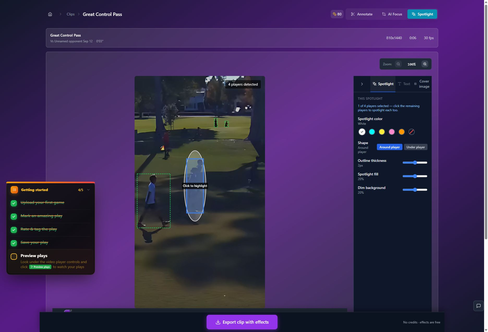
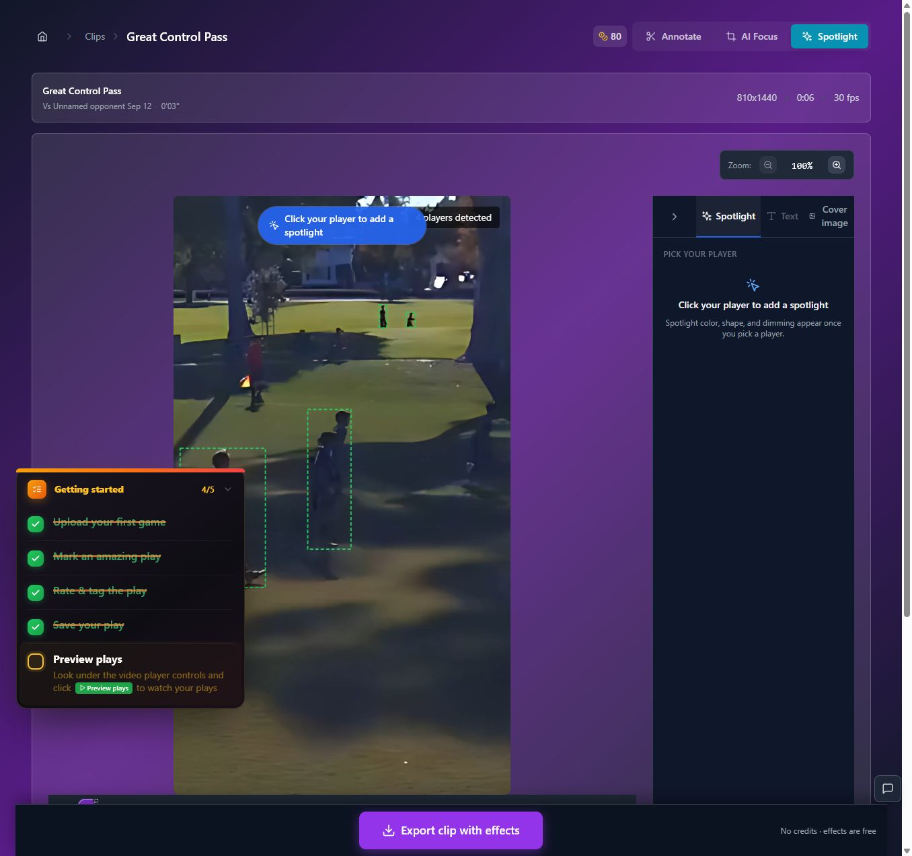
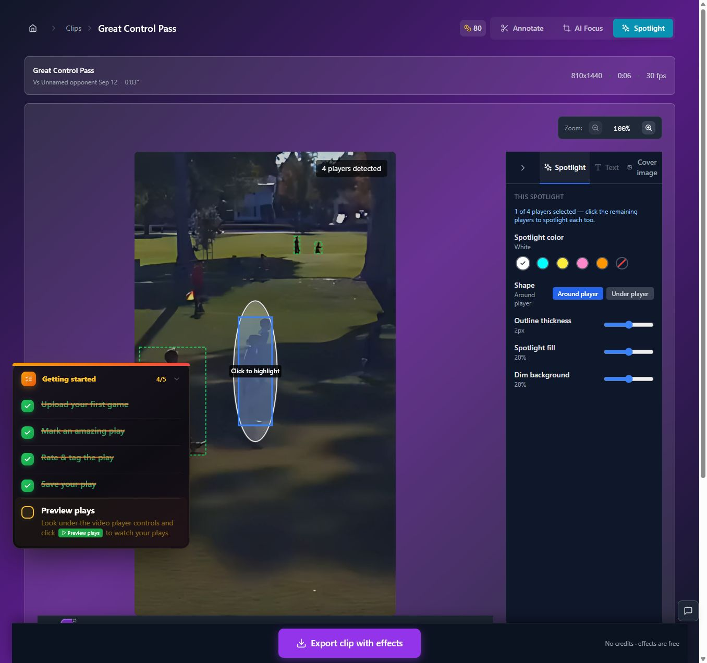
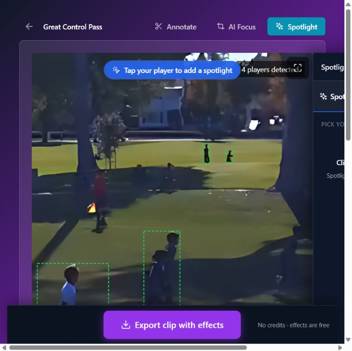

# T01 — Persist Spotlight selection, settings and timing

Epic: EP01 — Make saved results and key entry points dependable

Priority: P1 · Type: Fix · Status: READY

Dependencies: None

This file contains the task’s full product brief. Its adjacent `T01.html` is an equivalent single-file visual handoff with screenshots and report mockups embedded. Choose one format; do not read both. Markdown images use the included assets folder; the schematic below is inline text.

## Context and execution boundaries

The target user is a busy youth-sports parent making one compelling playable highlight quickly, then finding and sharing it confidently; keep a deliberate continued-annotation path. The supplied baseline of approximately 5 completed clip exporters per 100 signups and target of 75 are unverified business context. No fix has a verified lift and UX cannot explain every dropout.

Evidence comes from one fresh evaluator account on September 12–13, 2026, not a representative parent study. A supplied 1:29.322 MP4 and play notes identified a six-second moment at source 0:03–0:09, “Great Control Pass.” One framing render and two free effects renders completed for the same clip. The saved portrait played; Spotlight selection was absent on both reopening checks. Sampled frames alone do not prove whole-video effects failure. Exact blue #30 identity, recipient playback, publication, download, purchases and storage expiry were not verified.

No application repository or original source video is included in this handoff. Locate actual implementation and repository instructions first; do not invent code paths, backend architecture, analytics or policies. If a fixture is absent, use an authorized equivalent and document the limit. Read only this task for product requirements; inspect repository code/tests as necessary. Dependency contracts below are repeated so upstream documents are not required. Check prerequisite implementation/tests before starting dependent work.

Preserve browser-based upload, local preview with honest save state, cost/storage disclosure, precise trim inputs, direct framing, optional continued marking, playable completion, free effects when verified, private visibility and single-highlight export without reels. Game means source recording; play means source interval; highlight means editable/exportable moment; reel is optional combination. Export creates media without changing visibility; Download saves a local file; Publish creates link access; Invite is game-scoped. Keep one parent-facing vocabulary across the release.

Implement only this task’s scope. Evidence observations are not root-cause instructions. Proposed mockups/copy are not current behavior; exact controls depend on verified capability. Do not implement rejected alternatives just because they are discussed. No deployment, real publication/invitations, purchases or new paid/external services are authorized by this handoff. Use local/mocked or explicitly authorized test environments. Never claim a task complete from a plan alone.

## Dependency contract and starting conditions

No prerequisite task. Establish a durable edit revision with stable subject references, style and effect interval; T02 will consume exactly this revision. Coordinate the persisted shape before parallel edits to the same save path.

## Evidence, confirmed observations and uncertainty

Original references: B01, B06 · R1 · N11. N01–N12 were assigned to the naming report’s 12 unnumbered rows in source order; they are not original issue IDs. B01–B08 and R1–R7 are original references.

**B01, B06 · R1 · N11 (S01):**

Observed: Selection was absent after both save/reopen journeys, including one without reload. Saved playback worked; sampled frames lacked an ellipse. One library reload reopened an earlier framing completion.

Suspected / investigation: Selection serialization, detection identifiers, export input, preview asset selection and job acknowledgement are separate suspects. Compare persisted editor data, effects job input/output and the exact saved-player asset. Reproduce sequential jobs and delayed completions before selecting a cause.

## Selected implementation decision

Prefer durable persisted settings with explicit acknowledgement first. Autosave is T11. Do not mistake a selected editor overlay for a saved selection, or force a second render as recovery.

## Work to perform

- Locate actual edit serialization, detection identity and restore code; record findings rather than invent paths.
- Reproduce select → export → save → reopen with and without reload; compare saved values at each boundary.
- Persist selected subject references, style, timing and framing association; restore without automatic reselection. Handle removed selections and old drafts lacking fields.
- Keep local edits visible on failed save and provide retry. Make duplicate save requests safe; preserve existing drafts during schema evolution.

## Proposed replacement copy

- Saving spotlight…
- Spotlight settings saved.
- Your latest changes could not be saved. Keep this page open and try again.
- Try saving again

Use this task’s labels consistently with the release vocabulary. Bracketed values are dynamic data or explicit dependencies, never literal shipping copy. Conditional claims must remain conditional until verified.

## Proposed task schematic — not current UI

```text
Select athlete + interval
       ↓
Saving spotlight… → failure: retain edits + Try saving again
       ↓ durable acknowledgement
Spotlight settings saved
       ↓ leave / reload / reopen
Same athlete + style + interval restored
```

This schematic defines behavior/hierarchy, not a new visual identity. Related report mockups are embedded in the equivalent standalone HTML; this Markdown schematic carries the task-specific behavior without requiring that document.

## Acceptance criteria

- [ ] One selected athlete and configured style/interval survive navigation, reload and a new signed-in session.
- [ ] Removing a selection persists; existing older drafts load safely without invented selections.
- [ ] Save success appears only after durable acknowledgement; retry does not duplicate or erase work.
- [ ] Document persisted edit/revision contract and migration/backward compatibility for downstream work.

## Practical validation

- Automated serialization/restore tests for added, removed and multiple selections.
- Integration tests on the six-second fixture with network failure and duplicate saves.
- Reproduce both reported journeys; record before/after values and screenshots. Rendered-effect correctness belongs to T02.

## Out of scope

Do not add tracking, change publication, implement autosave, or declare the renderer fixed.

## Safe completion and rollback

Preserve old saved records and playable exports during changes. Use backward-compatible migration and existing feature gating where appropriate; do not delete user data as rollback. If a change regresses the core path, disable/revert the affected change while retaining persisted work. Run repository-required checks and this task’s meaningful validations. Screenshot comparison cannot establish playback or persistence by itself.

Update this file’s status and the plan row only after verified completion (keep the HTML counterpart consistent if maintained). Report changed paths, actual root cause/capability finding, tests executed/results, relevant before/after evidence, unresolved assumptions and rollback limits. Use `BLOCKED` with exact missing input when repository, policy, footage, permission or participants prevent verification. A discovery task is complete when its evidence/decision deliverable is complete; its proposed feature remains unimplemented. Downstream contracts must be recorded in the implementation, tests and task outcome rather than requiring another conversation.

## Original screenshot evidence

These are unchanged evaluation screenshots, not proposed outcomes. Their captions are the source descriptions. Read them alongside the bounded observations above.

### E26

One detected blue player selected, visible white ellipse, and instruction to select remaining players.



### E40

First persistence check: reopening Spotlight shows Pick your player and no retained selection.



### E41

Second diagnostic attempt: the same detected blue player is selected again.



### E55

Second persistence check: reopening Spotlight again asks to pick a player. Narrow layout also overflows.



## Source provenance (reading sources is optional)

Derived from `bug-report.html`, `first-export-friction-report.html`, `naming-and-action-consistency-report.html` (September 12–13, 2026) and solution report sections S01. Relevant requirements/evidence are reproduced here; source reports are not needed to execute this task.
