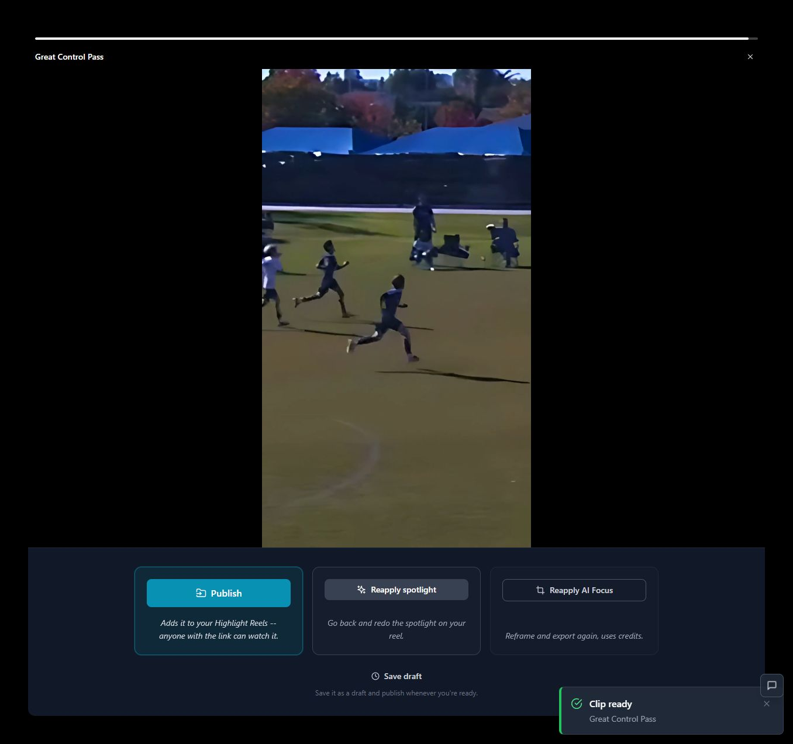
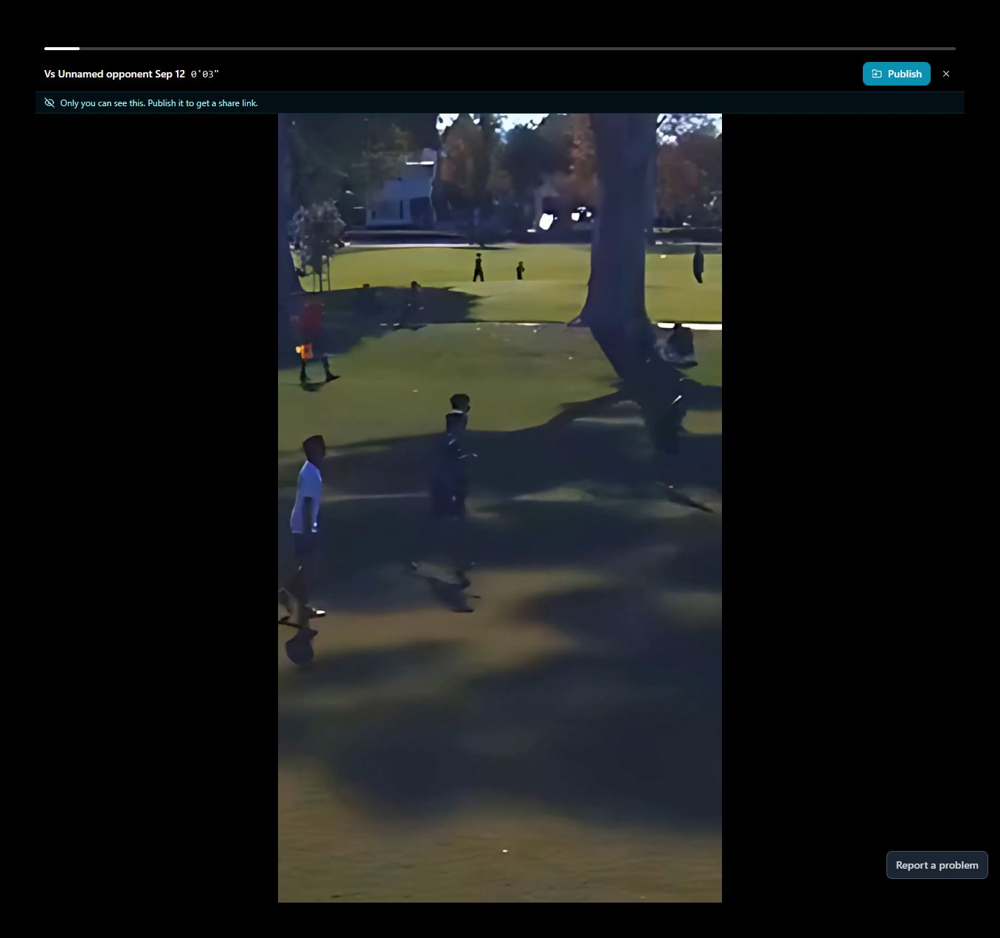
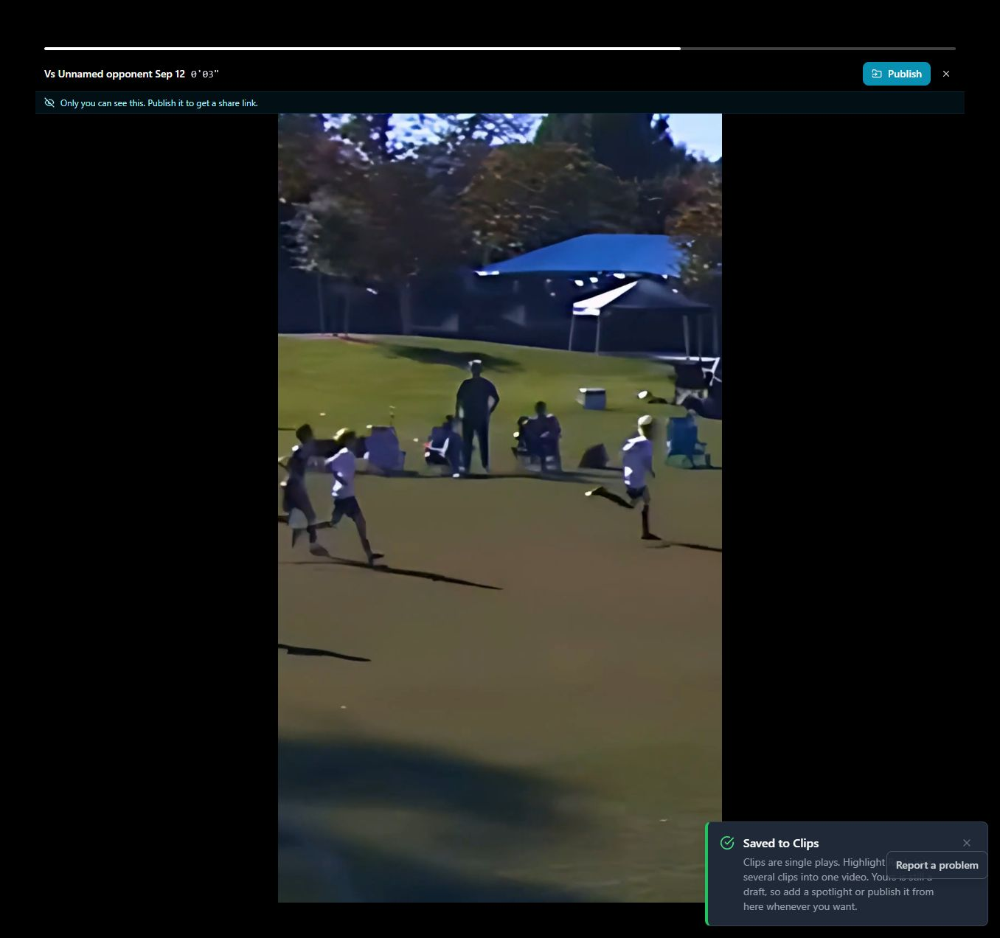

# T02 — Bind saved preview to the correct effects export

Epic: EP01 — Make saved results and key entry points dependable

Priority: P1 · Type: Fix / investigate · Status: WAITING_FOR_DEPENDENCIES

Dependencies: T01

This file contains the task’s full product brief. Its adjacent `T02.html` is an equivalent single-file visual handoff with screenshots and report mockups embedded. Choose one format; do not read both. Markdown images use the included assets folder; the schematic below is inline text.

## Context and execution boundaries

The target user is a busy youth-sports parent making one compelling playable highlight quickly, then finding and sharing it confidently; keep a deliberate continued-annotation path. The supplied baseline of approximately 5 completed clip exporters per 100 signups and target of 75 are unverified business context. No fix has a verified lift and UX cannot explain every dropout.

Evidence comes from one fresh evaluator account on September 12–13, 2026, not a representative parent study. A supplied 1:29.322 MP4 and play notes identified a six-second moment at source 0:03–0:09, “Great Control Pass.” One framing render and two free effects renders completed for the same clip. The saved portrait played; Spotlight selection was absent on both reopening checks. Sampled frames alone do not prove whole-video effects failure. Exact blue #30 identity, recipient playback, publication, download, purchases and storage expiry were not verified.

No application repository or original source video is included in this handoff. Locate actual implementation and repository instructions first; do not invent code paths, backend architecture, analytics or policies. If a fixture is absent, use an authorized equivalent and document the limit. Read only this task for product requirements; inspect repository code/tests as necessary. Dependency contracts below are repeated so upstream documents are not required. Check prerequisite implementation/tests before starting dependent work.

Preserve browser-based upload, local preview with honest save state, cost/storage disclosure, precise trim inputs, direct framing, optional continued marking, playable completion, free effects when verified, private visibility and single-highlight export without reels. Game means source recording; play means source interval; highlight means editable/exportable moment; reel is optional combination. Export creates media without changing visibility; Download saves a local file; Publish creates link access; Invite is game-scoped. Keep one parent-facing vocabulary across the release.

Implement only this task’s scope. Evidence observations are not root-cause instructions. Proposed mockups/copy are not current behavior; exact controls depend on verified capability. Do not implement rejected alternatives just because they are discussed. No deployment, real publication/invitations, purchases or new paid/external services are authorized by this handoff. Use local/mocked or explicitly authorized test environments. Never claim a task complete from a plan alone.

## Dependency contract and starting conditions

T01 must supply a durable edit revision and restorable subject/style/timing. Each render request must identify the revision it consumes. Verify that contract in repository/tests; reading T01’s document is not required.

## Evidence, confirmed observations and uncertainty

Original references: B01, B06 · R1 · N11. N01–N12 were assigned to the naming report’s 12 unnumbered rows in source order; they are not original issue IDs. B01–B08 and R1–R7 are original references.

**B01, B06 · R1 · N11 (S01):**

Observed: Selection was absent after both save/reopen journeys, including one without reload. Saved playback worked; sampled frames lacked an ellipse. One library reload reopened an earlier framing completion.

Suspected / investigation: Selection serialization, detection identifiers, export input, preview asset selection and job acknowledgement are separate suspects. Compare persisted editor data, effects job input/output and the exact saved-player asset. Reproduce sequential jobs and delayed completions before selecting a cause.

## Selected implementation decision

Prefer version-bound render inputs and explicit eligible-result promotion. A cache flush alone is not an adequate design. The missing ellipse in sampled frames is not yet proof of a renderer fault.

## Work to perform

- Trace effects job inputs, render output and exact media URI/version loaded by the saved viewer; compare artifacts before choosing the fix.
- Bind job to edit revision; promote only successful validated artifacts belonging to the intended version. Late old completions cannot supersede newer saved exports.
- Preserve previous playable result on failure and label unexported changes separately.
- Verify the effect throughout its configured interval in actual output bytes, not only canvas/editor overlays. Pin published output to its chosen version without publishing anything.

## Proposed replacement copy

- Your edits are saved. Export to update the finished highlight.
- The new export failed. Your previous highlight is still available.
- Watch previous export
- Spotlight included — show only after output verification

Use this task’s labels consistently with the release vocabulary. Bracketed values are dynamic data or explicit dependencies, never literal shipping copy. Conditional claims must remain conditional until verified.

## Proposed task schematic — not current UI

```text
Saved edit revision ──→ effects job ──→ validated artifact
                                         ↓ eligible promotion only
Great Control Pass · Private · Ready to watch
[Watch finished highlight] → exact promoted artifact
Older late job → retained history, not newer-result replacement
```

This schematic defines behavior/hierarchy, not a new visual identity. Related report mockups are embedded in the equivalent standalone HTML; this Markdown schematic carries the task-specific behavior without requiring that document.

## Acceptance criteria

- [ ] Saved preview uses the correct eligible effects artifact after save, navigation and reload.
- [ ] Configured ellipse is present during its interval in media frames; no unintended effect outside that interval.
- [ ] Failure/cancellation cannot advance playable-version state; out-of-order jobs cannot replace newer results.
- [ ] Publication references the artifact actually previewed; private edits do not silently change an existing shared artifact.

## Practical validation

- Compare input manifest, output and viewer artifact IDs on the reported six-second case.
- Use two revisions and reversed completion order; include failed newer render and retry.
- Frame-by-frame check configured effect interval and representative outside frames; review normal playback and actual target.

## Out of scope

No tracking or generic enhancement. If artifact investigation disproves a render defect, fix the isolated selection/viewer defect and document evidence; do not invent a render patch.

## Safe completion and rollback

Preserve old saved records and playable exports during changes. Use backward-compatible migration and existing feature gating where appropriate; do not delete user data as rollback. If a change regresses the core path, disable/revert the affected change while retaining persisted work. Run repository-required checks and this task’s meaningful validations. Screenshot comparison cannot establish playback or persistence by itself.

Update this file’s status and the plan row only after verified completion (keep the HTML counterpart consistent if maintained). Report changed paths, actual root cause/capability finding, tests executed/results, relevant before/after evidence, unresolved assumptions and rollback limits. Use `BLOCKED` with exact missing input when repository, policy, footage, permission or participants prevent verification. A discovery task is complete when its evidence/decision deliverable is complete; its proposed feature remains unimplemented. Downstream contracts must be recorded in the implementation, tests and task outcome rather than requiring another conversation.

## Original screenshot evidence

These are unchanged evaluation screenshots, not proposed outcomes. Their captions are the source descriptions. Read them alongside the bounded observations above.

### E26

One detected blue player selected, visible white ellipse, and instruction to select remaining players.


### E30

First effects export completes; Publish, Reapply spotlight, Reapply AI Focus, and Save draft.



### E38

Saved preview near the start; no white ellipse is visible in this sampled frame.



### E42

Second free effects export completes and offers Save draft.


### E43

Second saved effects result plays without a reload; no spotlight is visible in this sampled frame.



### E55

Second persistence check: reopening Spotlight again asks to pick a player. Narrow layout also overflows.


## Source provenance (reading sources is optional)

Derived from `bug-report.html`, `first-export-friction-report.html`, `naming-and-action-consistency-report.html` (September 12–13, 2026) and solution report sections S01. Relevant requirements/evidence are reproduced here; source reports are not needed to execute this task.
