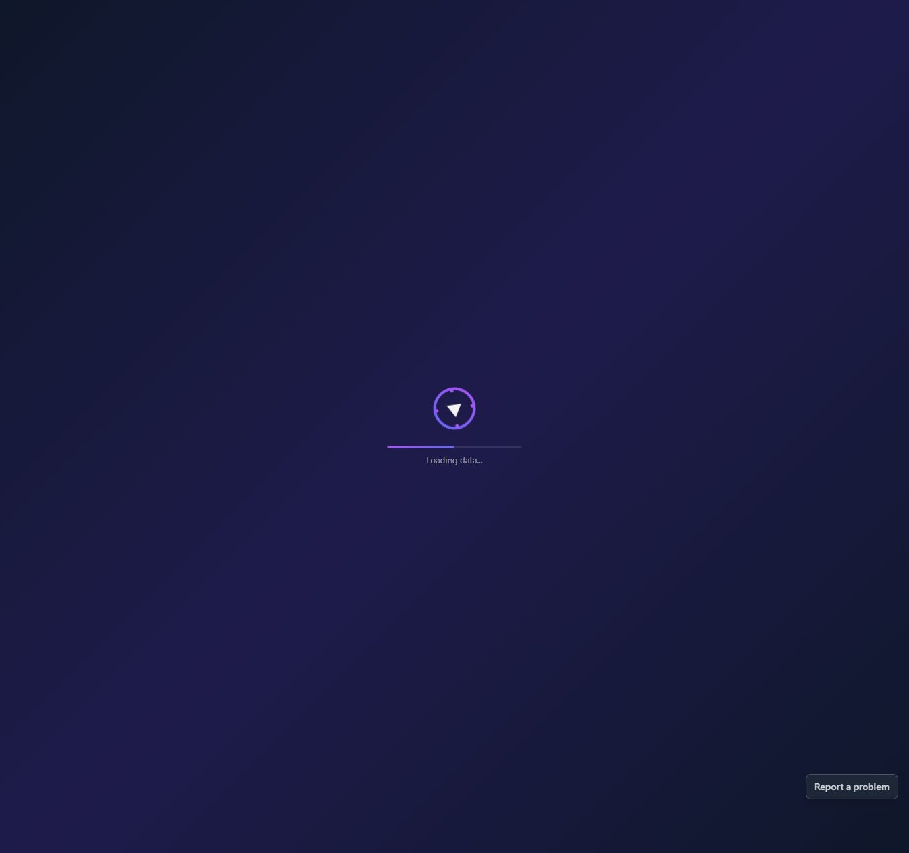
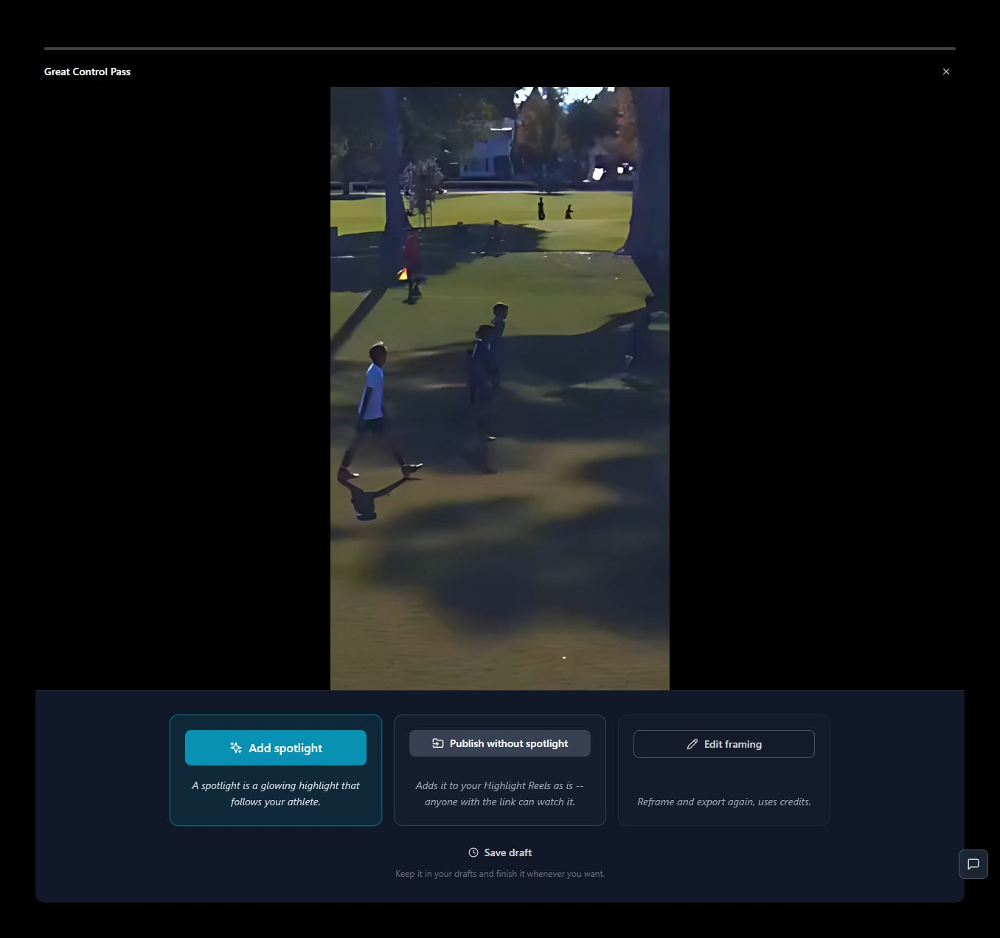
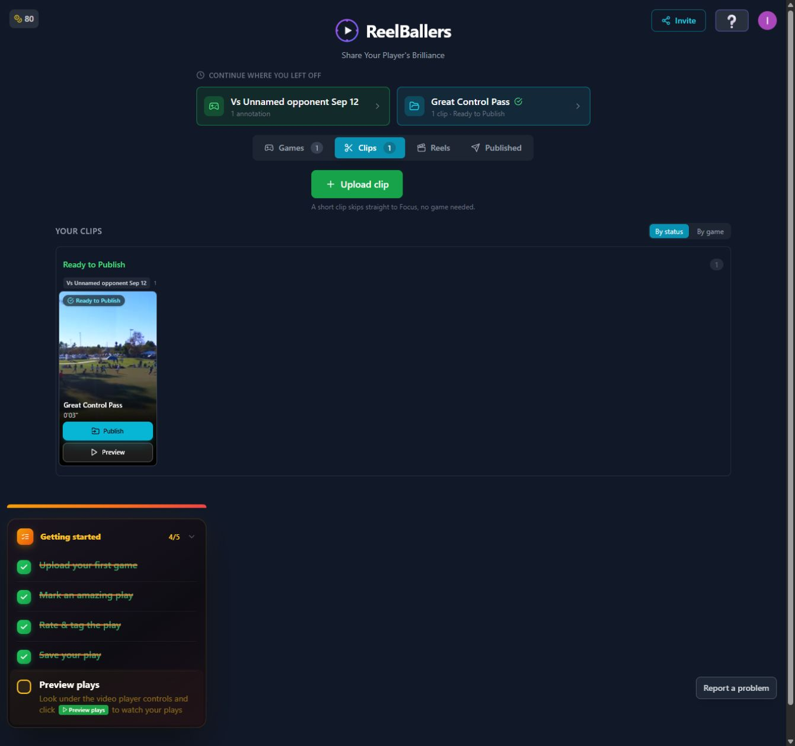

# T03 — Stop old export completions hijacking reload

Epic: EP01 — Make saved results and key entry points dependable

Priority: P1 · Type: Fix / investigate · Status: READY

Dependencies: None

This file contains the task’s full product brief. Its adjacent `T03.html` is an equivalent single-file visual handoff with screenshots and report mockups embedded. Choose one format; do not read both. Markdown images use the included assets folder; the schematic below is inline text.

## Context and execution boundaries

The target user is a busy youth-sports parent making one compelling playable highlight quickly, then finding and sharing it confidently; keep a deliberate continued-annotation path. The supplied baseline of approximately 5 completed clip exporters per 100 signups and target of 75 are unverified business context. No fix has a verified lift and UX cannot explain every dropout.

Evidence comes from one fresh evaluator account on September 12–13, 2026, not a representative parent study. A supplied 1:29.322 MP4 and play notes identified a six-second moment at source 0:03–0:09, “Great Control Pass.” One framing render and two free effects renders completed for the same clip. The saved portrait played; Spotlight selection was absent on both reopening checks. Sampled frames alone do not prove whole-video effects failure. Exact blue #30 identity, recipient playback, publication, download, purchases and storage expiry were not verified.

No application repository or original source video is included in this handoff. Locate actual implementation and repository instructions first; do not invent code paths, backend architecture, analytics or policies. If a fixture is absent, use an authorized equivalent and document the limit. Read only this task for product requirements; inspect repository code/tests as necessary. Dependency contracts below are repeated so upstream documents are not required. Check prerequisite implementation/tests before starting dependent work.

Preserve browser-based upload, local preview with honest save state, cost/storage disclosure, precise trim inputs, direct framing, optional continued marking, playable completion, free effects when verified, private visibility and single-highlight export without reels. Game means source recording; play means source interval; highlight means editable/exportable moment; reel is optional combination. Export creates media without changing visibility; Download saves a local file; Publish creates link access; Invite is game-scoped. Keep one parent-facing vocabulary across the release.

Implement only this task’s scope. Evidence observations are not root-cause instructions. Proposed mockups/copy are not current behavior; exact controls depend on verified capability. Do not implement rejected alternatives just because they are discussed. No deployment, real publication/invitations, purchases or new paid/external services are authorized by this handoff. Use local/mocked or explicitly authorized test environments. Never claim a task complete from a plan alone.

## Dependency contract and starting conditions

No prerequisite task. Maintain job acknowledgement and requested route independently of result version. Coordinate shared job code with T02; consume existing artifact IDs without inventing a new competing version model.

## Evidence, confirmed observations and uncertainty

Original references: B01, B06 · R1 · N11. N01–N12 were assigned to the naming report’s 12 unnumbered rows in source order; they are not original issue IDs. B01–B08 and R1–R7 are original references.

**B01, B06 · R1 · N11 (S01):**

Observed: Selection was absent after both save/reopen journeys, including one without reload. Saved playback worked; sampled frames lacked an ellipse. One library reload reopened an earlier framing completion.

Suspected / investigation: Selection serialization, detection identifiers, export input, preview asset selection and job acknowledgement are separate suspects. Compare persisted editor data, effects job input/output and the exact saved-player asset. Reproduce sequential jobs and delayed completions before selecting a cause.

## Selected implementation decision

Keep recovered job status in place rather than redirecting to a completion modal. The reported reload interruption happened once; reproduce before claiming stale-job handling as root cause.

## Work to perform

- Reproduce framing → effects → save to library → reload; inspect route restoration and completion acknowledgements.
- Persist handled completion state where appropriate and ignore older handled notifications for navigation.
- Recover pending jobs with labeled status in the requested destination; do not silently reopen /focus over the library.
- Preserve newest saved/playable version when job notifications arrive late.

## Proposed replacement copy

- Great Control Pass is ready.
- Watch finished highlight
- A previous export is ready to view. — only for a genuine recovered result, without automatic navigation

Use this task’s labels consistently with the release vocabulary. Bracketed values are dynamic data or explicit dependencies, never literal shipping copy. Conditional claims must remain conditional until verified.

## Proposed task schematic — not current UI

```text
Requested route: Highlights
Reload → restore Highlights + latest saved status
Recovered completion → in-place notice [Watch finished highlight]
Handled old completion → no modal and no redirect
```

This schematic defines behavior/hierarchy, not a new visual identity. Related report mockups are embedded in the equivalent standalone HTML; this Markdown schematic carries the task-specific behavior without requiring that document.

## Acceptance criteria

- [ ] Reload stays on requested library route in the reported sequence.
- [ ] Handled completions do not reopen after repeated reloads or new sessions.
- [ ] Unacknowledged recovered jobs are discoverable without superseding a newer result.
- [ ] No notification fix deletes saved drafts, media or job history.

## Practical validation

- Repeat sequential jobs with delay and reversed notifications.
- Reload before/after completion acknowledgement, then from another route.
- If reproduction fails, record attempted matrix and add targeted diagnostics/tests; do not mark the original observation disproven.

## Out of scope

No broad router rewrite or new export pipeline. Do not block T01 on an unproven mechanism.

## Safe completion and rollback

Preserve old saved records and playable exports during changes. Use backward-compatible migration and existing feature gating where appropriate; do not delete user data as rollback. If a change regresses the core path, disable/revert the affected change while retaining persisted work. Run repository-required checks and this task’s meaningful validations. Screenshot comparison cannot establish playback or persistence by itself.

Update this file’s status and the plan row only after verified completion (keep the HTML counterpart consistent if maintained). Report changed paths, actual root cause/capability finding, tests executed/results, relevant before/after evidence, unresolved assumptions and rollback limits. Use `BLOCKED` with exact missing input when repository, policy, footage, permission or participants prevent verification. A discovery task is complete when its evidence/decision deliverable is complete; its proposed feature remains unimplemented. Downstream contracts must be recorded in the implementation, tests and task outcome rather than requiring another conversation.

## Original screenshot evidence

These are unchanged evaluation screenshots, not proposed outcomes. Their captions are the source descriptions. Read them alongside the bounded observations above.

### E31

Save draft returns to Clips with Ready to Publish and a Preview action.


### E32

Reload transient: loading data and an AI Focus ready notice.



### E33

Reload unexpectedly opens the earlier AI Focus completion screen, offering Add spotlight again.



### E35

Persisted clip is found in Clips after recovering from the reload interruption.



## Source provenance (reading sources is optional)

Derived from `bug-report.html`, `first-export-friction-report.html`, `naming-and-action-consistency-report.html` (September 12–13, 2026) and solution report sections S01. Relevant requirements/evidence are reproduced here; source reports are not needed to execute this task.
