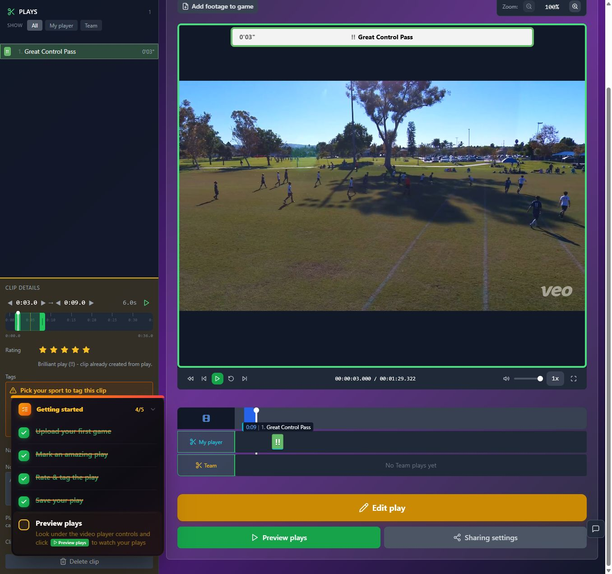
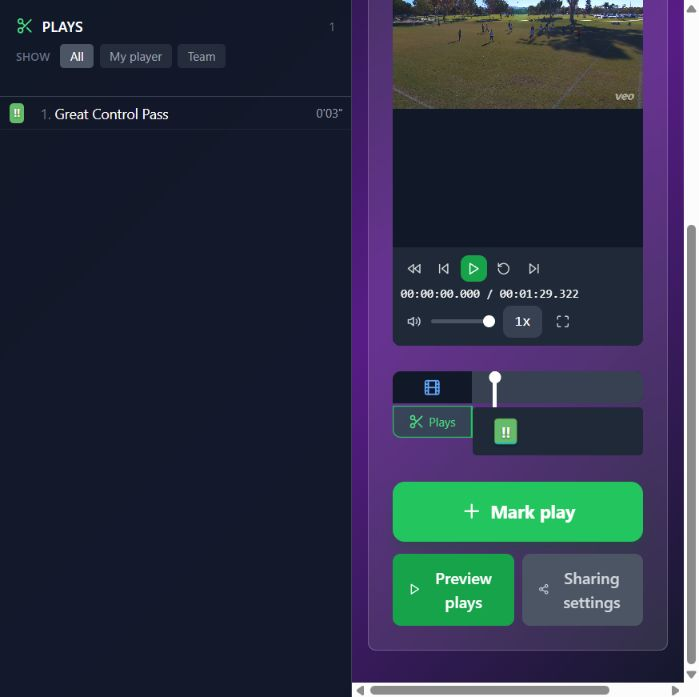
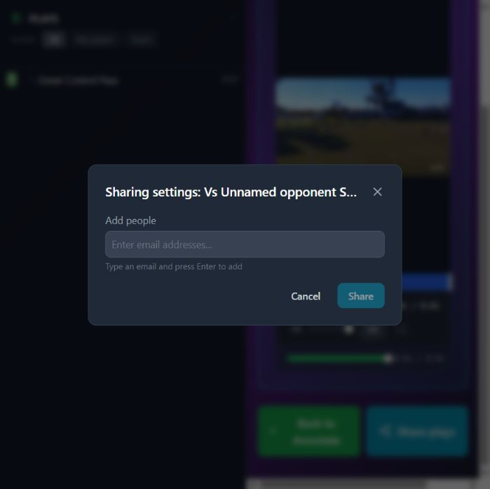

# T05 — Repair both game-invitation entry points

Epic: EP01 — Make saved results and key entry points dependable

Priority: P1 · Type: Fix · Status: READY

Dependencies: None

This file contains the task’s full product brief. Its adjacent `T05.html` is an equivalent single-file visual handoff with screenshots and report mockups embedded. Choose one format; do not read both. Markdown images use the included assets folder; the schematic below is inline text.

## Context and execution boundaries

The target user is a busy youth-sports parent making one compelling playable highlight quickly, then finding and sharing it confidently; keep a deliberate continued-annotation path. The supplied baseline of approximately 5 completed clip exporters per 100 signups and target of 75 are unverified business context. No fix has a verified lift and UX cannot explain every dropout.

Evidence comes from one fresh evaluator account on September 12–13, 2026, not a representative parent study. A supplied 1:29.322 MP4 and play notes identified a six-second moment at source 0:03–0:09, “Great Control Pass.” One framing render and two free effects renders completed for the same clip. The saved portrait played; Spotlight selection was absent on both reopening checks. Sampled frames alone do not prove whole-video effects failure. Exact blue #30 identity, recipient playback, publication, download, purchases and storage expiry were not verified.

No application repository or original source video is included in this handoff. Locate actual implementation and repository instructions first; do not invent code paths, backend architecture, analytics or policies. If a fixture is absent, use an authorized equivalent and document the limit. Read only this task for product requirements; inspect repository code/tests as necessary. Dependency contracts below are repeated so upstream documents are not required. Check prerequisite implementation/tests before starting dependent work.

Preserve browser-based upload, local preview with honest save state, cost/storage disclosure, precise trim inputs, direct framing, optional continued marking, playable completion, free effects when verified, private visibility and single-highlight export without reels. Game means source recording; play means source interval; highlight means editable/exportable moment; reel is optional combination. Export creates media without changing visibility; Download saves a local file; Publish creates link access; Invite is game-scoped. Keep one parent-facing vocabulary across the release.

Implement only this task’s scope. Evidence observations are not root-cause instructions. Proposed mockups/copy are not current behavior; exact controls depend on verified capability. Do not implement rejected alternatives just because they are discussed. No deployment, real publication/invitations, purchases or new paid/external services are authorized by this handoff. Use local/mocked or explicitly authorized test environments. Never claim a task complete from a plan alone.

## Dependency contract and starting conditions

No prerequisite task. Both game entry points must invoke the same scoped dialog and permission context. Opening/cancelling has no side effects. Exact access scope must be verified before stronger audience copy.

## Evidence, confirmed observations and uncertainty

Original references: B02 · R5 · N08 · untested download. N01–N12 were assigned to the naming report’s 12 unnumbered rows in source order; they are not original issue IDs. B01–B08 and R1–R7 are original references.

**B02 · R5 · N08 · untested download (S07):**

Observed: Three direct Sharing settings attempts produced no visible response. Preview plays → Share plays opened a game email form. Private/link visibility copy was clear. Publication, invitations, recipient playback and downloads were untested; no download was found in inspected menus.

Suspected / investigation: Compare both entry points, selected/unselected play context and dialog state. Verify game permission scope, recipient authentication and revocation before finalizing disclosure. Do not assume every sharing route is broken.

## Selected implementation decision

Repair explicit game actions, not a combined Share hub. The alternate path worked once; the direct path failed visibly three times.

## Work to perform

- Locate handlers/modal ownership and test selected and unselected play context.
- Route direct and alternate controls through the same game-scoped operation.
- Verify recipient permissions from code/tests and place accurate scope disclosure in the dialog.
- Return visible error/retry if the form cannot open. Use mocked sends; do not invite real people.

## Proposed replacement copy

- Invite people to game plays
- Invite people · [game name]
- Email addresses
- Send invitations
- Cancel
- Game invitations couldn’t open. Try again.

Use this task’s labels consistently with the release vocabulary. Bracketed values are dynamic data or explicit dependencies, never literal shipping copy. Conditional claims must remain conditional until verified.

## Proposed task schematic — not current UI

```text
Game plays ── [Invite people to game plays] ──┐
Watch marked plays ── same scoped action ────┤
                                            ↓
Invite people · [game name]
[Verified permission disclosure]
[Email addresses]
[Send invitations]  [Cancel: no side effect]
```

This schematic defines behavior/hierarchy, not a new visual identity. Related report mockups are embedded in the equivalent standalone HTML; this Markdown schematic carries the task-specific behavior without requiring that document.

## Acceptance criteria

- [ ] One click on either entry opens the same game form or an actionable error.
- [ ] Selected/unselected play state does not produce silent nonresponse.
- [ ] Cancel changes no access and sends no invitation.
- [ ] Dialog identifies game and actual permission scope, including full-game access if applicable.

## Practical validation

- Test both entry points before/after cancel at wide and 699px widths.
- Use mocked delivery and permission tests; assert no side effect on open/cancel.
- Record the verified recipient access contract; do not promise only-invited visibility without evidence.

## Out of scope

Do not merge game invitations with highlight publication or send real invitations.

## Safe completion and rollback

Preserve old saved records and playable exports during changes. Use backward-compatible migration and existing feature gating where appropriate; do not delete user data as rollback. If a change regresses the core path, disable/revert the affected change while retaining persisted work. Run repository-required checks and this task’s meaningful validations. Screenshot comparison cannot establish playback or persistence by itself.

Update this file’s status and the plan row only after verified completion (keep the HTML counterpart consistent if maintained). Report changed paths, actual root cause/capability finding, tests executed/results, relevant before/after evidence, unresolved assumptions and rollback limits. Use `BLOCKED` with exact missing input when repository, policy, footage, permission or participants prevent verification. A discovery task is complete when its evidence/decision deliverable is complete; its proposed feature remains unimplemented. Downstream contracts must be recorded in the implementation, tests and task outcome rather than requiring another conversation.

## Original screenshot evidence

These are unchanged evaluation screenshots, not proposed outcomes. Their captions are the source descriptions. Read them alongside the bounded observations above.

### E48

First direct Sharing settings click: no dialog or navigation appears.



### E50

Second direct Sharing settings attempt: no visible response; narrower layout now visible.



### E52

Share plays opens a game sharing dialog that asks for email addresses. No invitation was sent.



### E53

Third direct Sharing settings attempt, after the working alternate path: no visible dialog.


## Source provenance (reading sources is optional)

Derived from `bug-report.html`, `first-export-friction-report.html`, `naming-and-action-consistency-report.html` (September 12–13, 2026) and solution report sections S07. Relevant requirements/evidence are reproduced here; source reports are not needed to execute this task.
