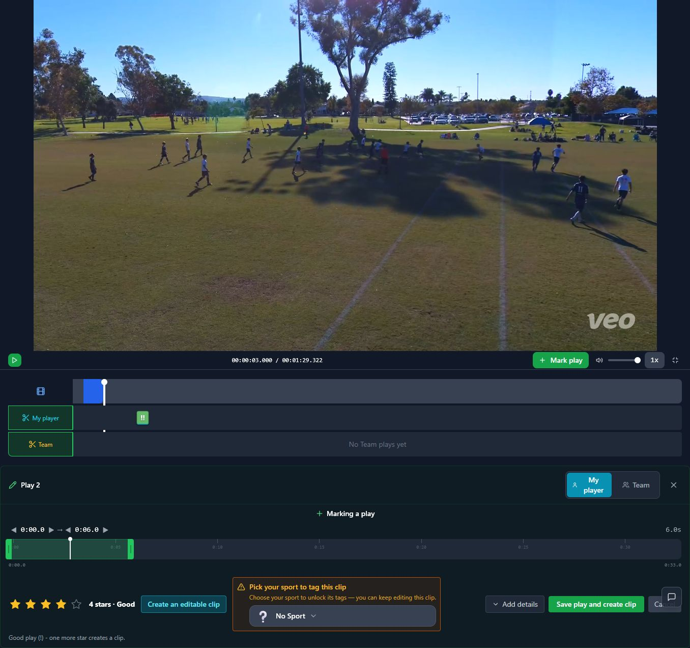

# T06 — Correct rating and clip-creation helper immediately

Epic: EP02 — Create a first highlight without sacrificing continued marking

Priority: P1 · Type: Fix · Status: READY

Dependencies: None

This file contains the task’s full product brief. Its adjacent `T06.html` is an equivalent single-file visual handoff with screenshots and report mockups embedded. Choose one format; do not read both. Markdown images use the included assets folder; the schematic below is inline text.

## Context and execution boundaries

The target user is a busy youth-sports parent making one compelling playable highlight quickly, then finding and sharing it confidently; keep a deliberate continued-annotation path. The supplied baseline of approximately 5 completed clip exporters per 100 signups and target of 75 are unverified business context. No fix has a verified lift and UX cannot explain every dropout.

Evidence comes from one fresh evaluator account on September 12–13, 2026, not a representative parent study. A supplied 1:29.322 MP4 and play notes identified a six-second moment at source 0:03–0:09, “Great Control Pass.” One framing render and two free effects renders completed for the same clip. The saved portrait played; Spotlight selection was absent on both reopening checks. Sampled frames alone do not prove whole-video effects failure. Exact blue #30 identity, recipient playback, publication, download, purchases and storage expiry were not verified.

No application repository or original source video is included in this handoff. Locate actual implementation and repository instructions first; do not invent code paths, backend architecture, analytics or policies. If a fixture is absent, use an authorized equivalent and document the limit. Read only this task for product requirements; inspect repository code/tests as necessary. Dependency contracts below are repeated so upstream documents are not required. Check prerequisite implementation/tests before starting dependent work.

Preserve browser-based upload, local preview with honest save state, cost/storage disclosure, precise trim inputs, direct framing, optional continued marking, playable completion, free effects when verified, private visibility and single-highlight export without reels. Game means source recording; play means source interval; highlight means editable/exportable moment; reel is optional combination. Export creates media without changing visibility; Download saves a local file; Publish creates link access; Invite is game-scoped. Keep one parent-facing vocabulary across the release.

Implement only this task’s scope. Evidence observations are not root-cause instructions. Proposed mockups/copy are not current behavior; exact controls depend on verified capability. Do not implement rejected alternatives just because they are discussed. No deployment, real publication/invitations, purchases or new paid/external services are authorized by this handoff. Use local/mocked or explicitly authorized test environments. Never claim a task complete from a plan alone.

## Dependency contract and starting conditions

No prerequisites. This is the small current-form repair; T07 owns the later two-action form. Helpers and CTA must derive from explicit creation intent independently of stars.

## Evidence, confirmed observations and uncertainty

Original references: B03 · R2 · N02–N03. N01–N12 were assigned to the naming report’s 12 unnumbered rows in source order; they are not original issue IDs. B01–B08 and R1–R7 are original references.

**B03 · R2 · N02–N03 (S02):**

Observed: At four stars, the toggle allowed clip creation while the helper still said one more star creates a clip. The evaluator raised the rating unnecessarily; five stars was not a real requirement.

Suspected / investigation: Rating-driven defaults and separately maintained helper text may have drifted. Inspect all rating/creation combinations; do not infer backend gating from misleading copy.

## Selected implementation decision

Retain the current toggle for this patch and repair contradictory behavior/text. Do not wait for the larger form redesign to remove the misleading rule.

## Work to perform

- Inspect every rating × create-clip toggle state.
- Remove star-threshold copy; derive helper and CTA from output intent.
- Ensure toggling creation does not modify rating and rating does not silently override explicit creation intent.

## Proposed replacement copy

- This play will also become an editable highlight. — creation enabled
- This saves the play without creating a highlight. — creation disabled
- Save play and create highlight
- Save play only

Use this task’s labels consistently with the release vocabulary. Bracketed values are dynamic data or explicit dependencies, never literal shipping copy. Conditional claims must remain conditional until verified.

## Proposed task schematic — not current UI

```text
Rating: ★★★★☆   Create editable highlight: ON
This play will also become an editable highlight.
[Save play and create highlight]

Toggle OFF → saves play only; rating stays the same
```

This schematic defines behavior/hierarchy, not a new visual identity. Related report mockups are embedded in the equivalent standalone HTML; this Markdown schematic carries the task-specific behavior without requiring that document.

## Acceptance criteria

- [ ] At four stars, enabled creation no longer says another star is required.
- [ ] All supported ratings can create via the explicit choice.
- [ ] Helper, CTA and persisted outcome agree in normal, narrow and fullscreen.

## Practical validation

- Test every supported rating with toggle on/off, including unrated only if currently supported.
- Regression on E47 contradiction.
- Verify no new automatic export or export-credit charge.

## Out of scope

Do not implement T07’s full layout in this patch. Retain current Clip noun until coordinated vocabulary cutover if needed; never mix nouns within one shipped flow.

## Safe completion and rollback

Preserve old saved records and playable exports during changes. Use backward-compatible migration and existing feature gating where appropriate; do not delete user data as rollback. If a change regresses the core path, disable/revert the affected change while retaining persisted work. Run repository-required checks and this task’s meaningful validations. Screenshot comparison cannot establish playback or persistence by itself.

Update this file’s status and the plan row only after verified completion (keep the HTML counterpart consistent if maintained). Report changed paths, actual root cause/capability finding, tests executed/results, relevant before/after evidence, unresolved assumptions and rollback limits. Use `BLOCKED` with exact missing input when repository, policy, footage, permission or participants prevent verification. A discovery task is complete when its evidence/decision deliverable is complete; its proposed feature remains unimplemented. Downstream contracts must be recorded in the implementation, tests and task outcome rather than requiring another conversation.

## Original screenshot evidence

These are unchanged evaluation screenshots, not proposed outcomes. Their captions are the source descriptions. Read them alongside the bounded observations above.

### E46

New unsaved play at game time 0:03 receives a 0:00–0:06 range; four-star default.


### E47

At four stars, Create an editable clip is enabled but helper still says one more star creates a clip.



## Source provenance (reading sources is optional)

Derived from `bug-report.html`, `first-export-friction-report.html`, `naming-and-action-consistency-report.html` (September 12–13, 2026) and solution report sections S02. Relevant requirements/evidence are reproduced here; source reports are not needed to execute this task.
